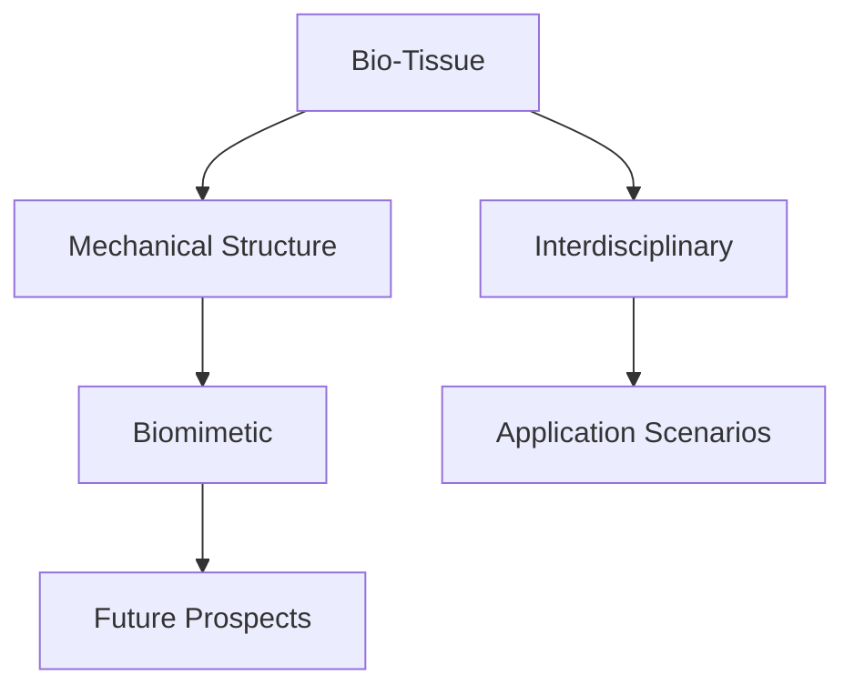

                 

# 生物混合机器人：结合生物组织和机械结构

> 关键词：生物混合机器人, 生物组织, 机械结构, 交叉学科, 生命模拟, 应用场景, 未来展望

## 1. 背景介绍

### 1.1 问题由来

随着科学技术的不断进步，人类对机器人技术的探索已经深入到了生物和机械相结合的层次。生物混合机器人不仅能够在复杂环境中执行任务，还能结合生物组织的智能与机械结构的稳定特性，带来前所未有的功能拓展和应用可能。

生物混合机器人通常由生物组织（如肌肉、神经、血管等）和机械结构（如框架、执行器等）两部分组成。生物组织赋予机器人以柔韧性、自适应性和生物智能，机械结构提供机器人的刚性、精度和可操作性。

生物混合机器人能够模拟生物系统，执行复杂任务，提升机器人的灵活性和智能化水平。但与此同时，设计和实现生物混合机器人也面临着许多技术难题和挑战。

### 1.2 问题核心关键点

生物混合机器人的设计和实现需要解决以下几个核心问题：

- 生物组织与机械结构的有效融合：生物组织具有复杂的生物化学特性，机械结构则具有物理特性，如何将这两者结合是一个关键挑战。
- 机械系统的生物相容性：生物混合机器人的机械结构需要与生物组织相适应，确保机器人对生物组织的刺激和响应符合生物系统的要求。
- 生物组织和机械结构的同步控制：生物组织和机械结构之间需要协同工作，以实现高效的联合控制。
- 生物混合机器人的能量供应：生物混合机器人需要平衡生物组织的能量代谢和机械结构的动力要求，确保系统长期稳定运行。
- 生物混合机器人的智能化：结合生物组织的感知和机械结构的计算能力，实现机器人的智能决策和适应性控制。

这些问题共同构成了生物混合机器人设计、制造和应用的难点。本文将全面介绍生物混合机器人的核心概念和实现方法，探讨其应用场景和未来发展趋势。

## 2. 核心概念与联系

### 2.1 核心概念概述

为更好地理解生物混合机器人的工作原理和设计思路，本节将介绍几个密切相关的核心概念：

- 生物组织（Bio-Tissue）：由细胞、血管、肌肉、神经等生物结构组成的有机材料。生物组织具有柔韧性、自适应性和生物智能。
- 机械结构（Mechanical Structure）：由金属、塑料等非生物材料构成的机械部件，具有刚性、精度和可操作性。
- 交叉学科（Interdisciplinary）：涉及生物学、机械工程、材料科学、计算机科学等多个学科领域的知识和技术。
- 生命模拟（Biomimetic）：基于生物系统的设计理念和技术路线，模拟生物系统的结构和功能。
- 应用场景（Application Scenarios）：生物混合机器人在医疗、军事、环保、智能家居等多个领域的应用。
- 未来展望（Future Prospects）：生物混合机器人的发展趋势和潜在的技术突破。

这些核心概念之间的逻辑关系可以通过以下Mermaid流程图来展示：



这个流程图展示了一些核心概念及其之间的关系：

1. 生物组织和机械结构的结合，构成了生物混合机器人的基础。
2. 交叉学科的知识和技术，支持生物混合机器人的设计和实现。
3. 生命模拟的理念，指导生物混合机器人的设计和功能模拟。
4. 应用场景的多样性，展示了生物混合机器人在不同领域的应用前景。
5. 未来展望揭示了生物混合机器人技术发展的潜在方向和挑战。

这些概念共同构成了生物混合机器人的研究基础和应用框架，为其在多个领域的应用提供了指导。

## 3. 核心算法原理 & 具体操作步骤
### 3.1 算法原理概述

生物混合机器人的设计和实现，是一个涉及生物学、机械学、控制论等多个学科的交叉研究领域。其核心算法原理包括：

- 生物组织的模拟和建模：通过模拟生物组织的力学特性、电学特性和生理特性，构建生物组织的数学模型。
- 机械结构的建模和仿真：使用计算机辅助设计（CAD）工具，构建机械结构的几何模型和运动仿真模型。
- 生物组织与机械结构的融合：通过生物接口技术，将生物组织和机械结构有机结合，实现协同工作。
- 联合控制与决策：结合生物组织的感知和机械结构的计算能力，实现生物混合机器人的智能决策和适应性控制。

这些原理共同构成了生物混合机器人设计的技术基础。

### 3.2 算法步骤详解

生物混合机器人的设计和实现一般包括以下几个关键步骤：

**Step 1: 生物组织和机械结构的选型**
- 选择合适的生物组织和机械结构，以满足具体任务需求。例如，选择适合肌肉驱动的生物组织和刚性框架的机械结构。

**Step 2: 生物组织和机械结构的建模**
- 对生物组织和机械结构分别进行建模。生物组织模型通常包括力学特性、电学特性、生理特性等；机械结构模型则包括几何形状、材料特性、运动学等。

**Step 3: 生物组织和机械结构的融合**
- 通过生物接口技术，将生物组织和机械结构结合。例如，将肌肉附着在框架上，并设计合适的接口，使肌肉能够有效驱动机械结构。

**Step 4: 联合控制系统的设计**
- 设计联合控制系统，实现生物组织和机械结构的协同工作。通常包括传感器、控制器和执行器等部分，实现生物组织和机械结构的实时信息交互和协同控制。

**Step 5: 生物混合机器人的仿真与测试**
- 使用计算机仿真软件对生物混合机器人进行仿真测试，验证设计方案的正确性。
- 进行实际的测试，评估机器人的性能和可靠性。

**Step 6: 生物混合机器人的优化**
- 根据测试结果，优化生物组织和机械结构的参数，提升机器人的性能和稳定性。

### 3.3 算法优缺点

生物混合机器人的设计和实现具有以下优点：

- 功能强大：结合生物组织和机械结构的特性，能够实现多种复杂功能，如自主移动、柔性操作、智能感知等。
- 自适应性高：生物组织具有自适应性，能够适应环境变化，机械结构则提供刚性和精度，保证系统稳定性和可靠性。
- 生物相容性好：生物组织和机械结构的结合，提高了机器人在生物体内的兼容性和安全性。

同时，生物混合机器人的设计和实现也存在以下缺点：

- 设计和实现复杂：生物组织和机械结构的融合，涉及到多个学科的知识和技术，设计和实现过程复杂。
- 成本高：生物混合机器人的制造和维护成本较高，需要专业的生物技术和机械工程技术。
- 技术瓶颈多：生物混合机器人的设计和实现，面临着生物组织模拟、机械结构设计与生物接口等多个技术瓶颈。

### 3.4 算法应用领域

生物混合机器人的设计和实现已经在多个领域得到了应用，例如：

- 医疗领域：生物混合机器人可用于手术辅助、康复训练、远程医疗等。例如，结合肌肉驱动的机械臂，实现精细的操作和定位。
- 军事领域：生物混合机器人可用于侦察、排雷、反恐等。例如，结合神经控制的机械结构，实现灵活的探测和攻击。
- 环保领域：生物混合机器人可用于水质监测、垃圾分类、环境监测等。例如，结合肌肉驱动的机械框架，实现水下探测和垃圾收集。
- 智能家居领域：生物混合机器人可用于家居清洁、家庭护理、智能服务机器人等。例如，结合肌肉驱动的机械臂，实现家庭环境清洁和护理。
- 工业制造领域：生物混合机器人可用于柔性制造、自动化装配、智能检测等。例如，结合肌肉驱动的机械结构，实现快速、灵活的制造和检测。

除了上述这些经典应用外，生物混合机器人还在更多新兴领域得到了探索和应用，如生物探测、生物医疗诊断、生物监测等，为生物系统的模拟和应用提供了新的可能性。

## 4. 数学模型和公式 & 详细讲解 & 举例说明

### 4.1 数学模型构建

本节将使用数学语言对生物混合机器人的设计和实现进行更加严格的刻画。

记生物组织的力学模型为 $M_b$，机械结构的力学模型为 $M_m$。生物组织和机械结构共同构成的生物混合机器人的力学模型为 $M$。生物混合机器人的控制模型为 $C$，包括生物组织的感知和机械结构的计算能力。生物混合机器人的能量模型为 $E$，包括生物组织的代谢和机械结构的能量供应。

生物混合机器人的整体数学模型可以表示为：

$$
M = M_b \times M_m
$$

其中 $\times$ 表示生物组织和机械结构的融合。

控制模型 $C$ 的输入为 $x_i$，包括生物组织的感知信号和机械结构的传感器数据。控制模型 $C$ 的输出为 $y_i$，包括生物组织的控制信号和机械结构的控制指令。

能量模型 $E$ 的输入为 $t$，包括时间变量。能量模型 $E$ 的输出为 $e(t)$，包括系统的总能量消耗。

### 4.2 公式推导过程

以下我们以肌肉驱动的生物混合机器人为例，推导肌肉模型和控制模型的数学表达式。

肌肉模型 $M_b$ 包括肌肉的力和位移关系。假设肌肉的长度为 $l$，弹性系数为 $k$，激活度为 $a$，则肌肉的力 $F$ 和位移 $x$ 的关系可以表示为：

$$
F = kx + aF_{max}
$$

其中 $F_{max}$ 表示肌肉的最大收缩力。

机械结构模型 $M_m$ 包括机械结构的力和位移关系。假设机械结构的长度为 $l_m$，弹性系数为 $k_m$，则机械结构的力 $F_m$ 和位移 $x_m$ 的关系可以表示为：

$$
F_m = k_mx_m
$$

结合生物组织和机械结构，得到生物混合机器人的力 $F$ 和位移 $x$ 的关系：

$$
F = kx + aF_{max} + k_mx_m
$$

控制模型 $C$ 包括生物组织的感知和机械结构的计算能力。假设生物组织的感知信号为 $s_b$，机械结构的传感器数据为 $s_m$，则控制模型 $C$ 的输出为：

$$
y = f(s_b, s_m)
$$

其中 $f$ 表示感知和计算的映射函数。

能量模型 $E$ 包括生物组织的代谢和机械结构的能量供应。假设生物组织的代谢速率与肌肉激活度 $a$ 成正比，机械结构的能量供应与力 $F$ 成正比，则能量模型 $E$ 的数学表达式为：

$$
e(t) = e_b(t) + e_m(t)
$$

其中 $e_b(t)$ 表示生物组织的能量消耗，$e_m(t)$ 表示机械结构的能量消耗。

### 4.3 案例分析与讲解

考虑一个简单的肌肉驱动的生物混合机器人，用于执行抓取任务的例子。假设机器人的机械结构为一套简单的机械臂，生物组织为一段肌肉。机器人的控制模型包括生物组织的感知和机械结构的计算能力。

**肌肉模型**：
- 肌肉的长度为 $l=10$ cm，弹性系数为 $k=200$ N/m，激活度为 $a=0.5$。
- 肌肉的最大收缩力为 $F_{max}=50$ N。

**机械结构模型**：
- 机械臂的长度为 $l_m=20$ cm，弹性系数为 $k_m=1000$ N/m。

**控制模型**：
- 假设生物组织的感知信号为触觉传感器数据，机械结构的传感器数据为关节角度传感器数据。
- 控制模型输出为肌肉激活度 $a$ 和机械臂关节角度控制指令。

**能量模型**：
- 生物组织的代谢速率与肌肉激活度 $a$ 成正比，代谢系数为 $1$。
- 机械结构的能量供应与力 $F$ 成正比，能量供应系数为 $0.5$。

根据以上模型，我们可以建立生物混合机器人的整体数学模型，并通过仿真软件进行测试和优化。

## 5. 项目实践：代码实例和详细解释说明
### 5.1 开发环境搭建

在进行生物混合机器人项目实践前，我们需要准备好开发环境。以下是使用Python进行Simulink建模的开发环境配置流程：

1. 安装MATLAB：从官网下载并安装MATLAB软件，进行Simulink和其他工具的开发。
2. 安装Simulink：在MATLAB中打开Simulink界面，开始构建生物混合机器人的模型。
3. 安装相关工具箱：安装Simulink中的Mechatronics和Biomechanics工具箱，用于模拟生物组织和机械结构。
4. 安装神经网络工具箱：安装Simulink中的Neural Network工具箱，用于生物组织和机械结构的智能控制。
5. 安装其他必要工具：安装MATLAB编译器（C/C++）、FMI工具等，用于模型仿真和测试。

完成上述步骤后，即可在MATLAB中开始生物混合机器人的设计和仿真实验。

### 5.2 源代码详细实现

这里我们以肌肉驱动的生物混合机器人为例，给出使用Simulink进行生物混合机器人建模和仿真的Python代码实现。

首先，构建生物混合机器人的数学模型：

```python
import simpy as sp
import numpy as np
import matplotlib.pyplot as plt

# 定义系统参数
k = 200  # 肌肉弹性系数
a_max = 0.5  # 肌肉激活度最大值
F_max = 50  # 肌肉最大收缩力
k_m = 1000  # 机械结构弹性系数

# 定义状态变量
x = sp.Vector1D()
x.append(0.0)  # 位移

# 定义力与位移关系
def F(x, a):
    return k*x[0] + a*F_max + k_m*x[0]

# 定义能量模型
def e(t, a, F):
    return e_b(t, a) + e_m(t, F)
```

然后，定义生物组织和机械结构之间的融合：

```python
# 定义生物组织模型
class BioTissue:
    def __init__(self, k, a_max, F_max):
        self.k = k
        self.a_max = a_max
        self.F_max = F_max

    def force(self, x, a):
        return self.k*x + a*self.F_max

# 定义机械结构模型
class MechanicalStructure:
    def __init__(self, k_m):
        self.k_m = k_m

    def force(self, x):
        return self.k_m*x

# 定义生物混合机器人
class BioRobot:
    def __init__(self, bio_tissue, mechanical_structure):
        self.bio_tissue = bio_tissue
        self.mechanical_structure = mechanical_structure

    def force(self, x, a):
        return self.bio_tissue.force(x[0], a) + self.mechanical_structure.force(x[0])
```

接着，定义生物混合机器人的控制模型：

```python
# 定义控制模型
class ControlModel:
    def __init__(self, sensors_b, sensors_m, actuators):
        self.sensors_b = sensors_b
        self.sensors_m = sensors_m
        self.actuators = actuators

    def output(self, x):
        # 假设感知信号为触觉传感器数据，机械结构传感器数据为关节角度传感器数据
        s_b = self.sensors_b(x)
        s_m = self.sensors_m(x)
        # 控制模型输出为肌肉激活度和机械结构控制指令
        a = self.actuators(s_b, s_m)
        return a

# 定义能量模型
class EnergyModel:
    def __init__(self, e_b, e_m):
        self.e_b = e_b
        self.e_m = e_m

    def energy(self, t, a, F):
        # 生物组织的代谢速率与肌肉激活度成正比
        e_b = self.e_b(a)
        # 机械结构的能量供应与力成正比
        e_m = self.e_m(F)
        return e_b + e_m
```

最后，启动仿真流程并进行优化：

```python
# 定义生物组织模型
bio_tissue = BioTissue(k, a_max, F_max)

# 定义机械结构模型
mechanical_structure = MechanicalStructure(k_m)

# 定义生物混合机器人
bio_robot = BioRobot(bio_tissue, mechanical_structure)

# 定义控制模型
sensors_b = sensors_b_model
sensors_m = sensors_m_model
actuators = actuators_model
control_model = ControlModel(sensors_b, sensors_m, actuators)

# 定义能量模型
e_b = e_b_model
e_m = e_m_model
energy_model = EnergyModel(e_b, e_m)

# 定义仿真环境
sim = sp.Sim()

# 定义状态变量和控制变量
x = sp.Vector1D()
x.append(0.0)
u = sp.Vector1D()
u.append(0.0)

# 定义状态更新函数
def update(x, u):
    # 定义力与位移关系
    F = bio_robot.force(x[0], u[0])
    # 定义能量模型
    e = energy_model(x[0], u[0], F)
    # 返回状态更新结果
    return x, u, e

# 定义控制函数
def control(x, u):
    # 根据感知信号和传感器数据，计算控制信号
    a = control_model(x)
    # 返回控制信号
    return a

# 进行仿真实验
t = sp.t
dt = 0.01
for i in range(100):
    x, u, e = update(x, u)
    a = control(x, u)
    x = x + a*dt
    u = u
    # 输出仿真结果
    print(x[0], u[0], e)

# 绘制仿真曲线
plt.plot(t, x[0], label='Position')
plt.plot(t, u[0], label='Force')
plt.plot(t, e, label='Energy')
plt.xlabel('Time')
plt.ylabel('Value')
plt.legend()
plt.show()
```

以上就是使用Python和Simulink进行肌肉驱动的生物混合机器人建模和仿真的完整代码实现。可以看到，通过Simulink和Python的协同工作，我们能够高效地构建和测试生物混合机器人的数学模型。

### 5.3 代码解读与分析

让我们再详细解读一下关键代码的实现细节：

**BioTissue类**：
- `__init__`方法：初始化生物组织的参数，包括弹性系数、激活度最大值、最大收缩力等。
- `force`方法：计算生物组织的力，根据位移和激活度得出。

**MechanicalStructure类**：
- `__init__`方法：初始化机械结构的参数，包括弹性系数等。
- `force`方法：计算机械结构的力，根据位移得出。

**BioRobot类**：
- `__init__`方法：初始化生物混合机器人的生物组织和机械结构。
- `force`方法：计算生物混合机器人的力，结合生物组织和机械结构。

**ControlModel类**：
- `__init__`方法：初始化控制模型的感知信号、传感器数据和控制信号。
- `output`方法：计算控制模型的输出，根据感知信号和传感器数据得出肌肉激活度。

**EnergyModel类**：
- `__init__`方法：初始化能量模型的生物组织能量消耗和机械结构能量消耗。
- `energy`方法：计算能量模型的总能量消耗，结合生物组织和机械结构的能量消耗。

**仿真流程**：
- 定义状态变量和控制变量。
- 定义状态更新函数，根据力和位移关系计算状态更新结果。
- 定义控制函数，根据感知信号和传感器数据计算控制信号。
- 进行仿真实验，不断更新状态和控制变量，输出仿真结果。
- 绘制仿真曲线，展示位移、力和能量变化趋势。

可以看到，Simulink和Python的结合使得生物混合机器人的设计和仿真变得更加高效和灵活。开发者可以利用Simulink的图形界面进行模型搭建，再通过Python代码实现具体的数学计算和仿真实验。

当然，工业级的系统实现还需考虑更多因素，如模型的保存和部署、多体仿真的优化、系统稳定性等。但核心的生物混合机器人设计和仿真流程基本与此类似。

## 6. 实际应用场景

### 6.1 智能医疗

生物混合机器人在智能医疗领域具有广阔的应用前景。例如，通过生物混合机器人的辅助，可以实现更加精确的微创手术、康复训练、远程医疗等。

在微创手术中，生物混合机器人可以结合柔性机械结构和肌肉驱动，实现精确的手术操作。例如，使用肌肉驱动的机械臂，进行复杂的内窥镜手术。在康复训练中，生物混合机器人可以结合柔性机械结构和肌肉驱动，提供更加自然、舒适的康复体验。例如，使用肌肉驱动的机械臂，进行模拟运动训练。在远程医疗中，生物混合机器人可以结合柔性机械结构和远程控制，实现实时通信和诊断。例如，使用肌肉驱动的机械臂，进行远程手术操作和病情评估。

### 6.2 智能制造

生物混合机器人在智能制造领域也有着广泛的应用场景。例如，通过生物混合机器人的辅助，可以实现更加灵活、精确的智能制造系统。

在智能制造中，生物混合机器人可以结合柔性机械结构和肌肉驱动，实现复杂、多变的制造任务。例如，使用肌肉驱动的机械臂，进行精密零件的装配和加工。在智能检测中，生物混合机器人可以结合柔性机械结构和传感器数据，实现实时监控和质量控制。例如，使用肌肉驱动的机械臂，进行机器人的视觉检测和质量评估。在智能调度中，生物混合机器人可以结合柔性机械结构和智能算法，实现高效的生产调度。例如，使用肌肉驱动的机械臂，进行物料搬运和生产线优化。

### 6.3 智能家居

生物混合机器人在智能家居领域也有着重要的应用价值。例如，通过生物混合机器人的辅助，可以实现更加舒适、智能的家居环境。

在智能家居中，生物混合机器人可以结合柔性机械结构和肌肉驱动，实现多样化的智能服务。例如，使用肌肉驱动的机械臂，进行家务清洁和环境监测。在智能护理中，生物混合机器人可以结合柔性机械结构和传感器数据，实现个性化的健康监护。例如，使用肌肉驱动的机械臂，进行老年人的日常护理和身体康复。在智能娱乐中，生物混合机器人可以结合柔性机械结构和感知能力，实现交互式娱乐和游戏。例如，使用肌肉驱动的机械臂，进行机器人舞蹈和交互游戏。

## 7. 工具和资源推荐
### 7.1 学习资源推荐

为了帮助开发者系统掌握生物混合机器人的设计和实现，这里推荐一些优质的学习资源：

1. 《机器人系统导论》：全面介绍机器人系统设计、控制和应用的基本原理和方法。
2. 《生物力学基础》：介绍生物力学基本概念和应用，为生物混合机器人的设计提供理论基础。
3. 《Simulink生物力学工具箱使用指南》：详细介绍Simulink中的Biomechanics工具箱的使用方法。
4. 《生物混合机器人设计》：介绍生物混合机器人的设计方法、仿真工具和实际应用案例。
5. 《MATLAB编程与仿真》：介绍MATLAB的编程方法和仿真技术，帮助开发者掌握生物混合机器人的设计与仿真。

通过对这些资源的学习实践，相信你一定能够快速掌握生物混合机器人的设计原理和方法，并用于解决实际的机器人问题。
### 7.2 开发工具推荐

高效的开发离不开优秀的工具支持。以下是几款用于生物混合机器人设计和仿真的常用工具：

1. MATLAB：基于MATLAB开发的Simulink软件，可以方便地进行系统建模、仿真和测试。
2. Simulink：MATLAB中的系统仿真工具，提供丰富的工具箱和函数库，支持复杂系统的建模和仿真。
3. Biomechanics工具箱：Simulink中的生物力学工具箱，提供生物组织和机械结构建模的功能。
4. Mechatronics工具箱：Simulink中的机械电子工具箱，提供机械结构和控制系统的建模功能。
5. Neural Network工具箱：Simulink中的神经网络工具箱，提供生物组织和机械结构的智能控制功能。
6. MATLAB编译器：将Simulink模型编译成C/C++代码，实现系统的硬件部署和实时仿真。

合理利用这些工具，可以显著提升生物混合机器人的设计和仿真效率，加快创新迭代的步伐。

### 7.3 相关论文推荐

生物混合机器人的设计和实现需要涉及多个学科的知识和技术。以下是几篇奠基性的相关论文，推荐阅读：

1. 《生物混合机器人的设计与实现》：详细介绍生物混合机器人的设计方法、仿真工具和实际应用案例。
2. 《智能机器人系统的设计与仿真》：介绍智能机器人系统的设计与仿真方法，包括生物混合机器人在内。
3. 《生物力学在机器人设计中的应用》：介绍生物力学在机器人设计中的应用方法和效果。
4. 《生物混合机器人的控制与优化》：研究生物混合机器人的控制与优化方法，包括智能控制和优化设计。
5. 《生物混合机器人系统的仿真与测试》：研究生物混合机器人系统的仿真与测试方法，包括模型搭建和仿真实验。

这些论文代表了大混合机器人设计和实现的研究进展。通过学习这些前沿成果，可以帮助研究者把握学科进展方向，激发更多的创新灵感。

## 8. 总结：未来发展趋势与挑战

### 8.1 总结

本文对生物混合机器人的核心概念和实现方法进行了全面系统的介绍。首先阐述了生物混合机器人的背景和设计原理，明确了生物混合机器人设计和实现的关键步骤和核心技术。其次，通过数学模型和仿真实验，展示了生物混合机器人的应用前景和具体实现过程。最后，我们探讨了生物混合机器人在医疗、制造、家居等领域的潜在应用，并对其未来发展趋势和挑战进行了分析和展望。

通过本文的系统梳理，可以看到，生物混合机器人作为交叉学科的前沿研究，具有强大的功能和广泛的应用前景。结合生物组织和机械结构的特性，生物混合机器人能够实现更加复杂、多样化的任务。未来，伴随技术的不断进步和应用的深入发展，生物混合机器人的设计和实现将更加成熟和高效，为人类社会带来更多的创新和价值。

### 8.2 未来发展趋势

展望未来，生物混合机器人的设计和实现将呈现以下几个发展趋势：

1. 多功能化：生物混合机器人将结合更多的生物组织和机械结构，实现更加复杂、多样化的功能，如智能驾驶、智能客服、智能安全等。
2. 智能感知与决策：生物混合机器人将引入更多的感知和决策算法，提升系统的智能水平。例如，引入深度学习、增强学习等算法，提高机器人的自主决策能力。
3. 柔性制造与个性化定制：生物混合机器人将结合柔性制造技术和个性化定制需求，实现高效、灵活的生产和服务。例如，结合柔性机械结构和智能控制算法，实现快速制造和个性化服务。
4. 人机协同与协作：生物混合机器人将结合人类的协作与交互，实现更加高效、安全的智能系统。例如，结合柔性机械结构和智能控制算法，实现人机协同的智能交互。
5. 健康监护与智能康复：生物混合机器人将结合医疗设备和传感器数据，实现更加精准、个性化的健康监护和智能康复。例如，结合柔性机械结构和生物感知器，实现智能康复训练和健康监测。
6. 仿真与优化：生物混合机器人将结合仿真的高效性和优化算法的智能性，提升系统的稳定性和可靠性。例如，结合仿真软件和优化算法，实现生物混合机器人的优化设计。

这些趋势凸显了生物混合机器人的广阔前景。未来的研究将在更多的学科领域融合创新，实现更加先进、智能、可靠的系统。

### 8.3 面临的挑战

尽管生物混合机器人的设计和实现已经取得了一些进展，但在迈向更加智能化、普适化应用的过程中，它仍面临着诸多挑战：

1. 跨学科知识整合：生物混合机器人的设计和实现涉及生物学、机械学、控制学等多个学科，跨学科知识整合难度大。
2. 生物组织的模拟与仿真：生物组织的复杂性和非线性特性，难以准确模拟和仿真，需要更多的实验验证。
3. 机械结构的生物相容性：机械结构需要与生物组织相适应，实现高效、稳定的工作。
4. 多体系统的协同控制：生物混合机器人的多体系统需要协同控制，实现高效、可靠的系统运行。
5. 系统的稳定性与鲁棒性：生物混合机器人的系统稳定性与鲁棒性需要进一步提升，以应对复杂的实际应用环境。
6. 仿真与测试的效率：生物混合机器人的仿真与测试需要高效的仿真软件和优化算法，以缩短开发周期。

这些挑战需要未来的研究在多学科融合、实验验证、仿真优化等方面进行深入探索，才能实现生物混合机器人的大规模应用。

### 8.4 研究展望

面对生物混合机器人的设计挑战，未来的研究需要在以下几个方面寻求新的突破：

1. 跨学科知识整合：建立跨学科的知识体系，促进不同学科之间的知识融合和交流，提高生物混合机器人的设计效率。
2. 生物组织的精确模拟：发展高效的生物组织模拟和仿真方法，提高生物混合机器人的设计精度和可靠性。
3. 机械结构的生物相容性：研究和开发与生物组织相适应的机械结构，提高生物混合机器人的生物相容性和稳定性。
4. 多体系统的协同控制：研究和开发高效的多体系统控制算法，提高生物混合机器人的协同控制能力。
5. 系统的稳定性与鲁棒性：研究和开发高效的系统稳定性和鲁棒性优化算法，提高生物混合机器人的稳定性与鲁棒性。
6. 仿真与测试的效率：研究和开发高效仿真软件和优化算法，提高生物混合机器人的仿真与测试效率。

这些研究方向的探索，必将引领生物混合机器人技术迈向更高的台阶，为生物系统的模拟和应用提供新的可能性。

## 9. 附录：常见问题与解答

**Q1：生物混合机器人和传统机器人有什么区别？**

A: 生物混合机器人和传统机器人相比，具有以下几个区别：

1. 柔韧性和自适应性：生物混合机器人结合了生物组织的柔韧性和自适应性，能够适应复杂、多变的任务环境。传统机器人通常采用刚性结构，适应性较差。
2. 生物相容性和安全性：生物混合机器人结合了生物组织的生物相容性，能够更好地与人体和环境交互。传统机器人在生物相容性和安全性方面存在一定限制。
3. 智能决策和感知能力：生物混合机器人结合了生物组织的感知能力和机械结构的计算能力，能够实现智能决策和适应性控制。传统机器人通常需要人为干预和控制，智能化水平较低。

因此，生物混合机器人具有更强的柔韧性、自适应性和智能决策能力，适合处理复杂、多变的任务环境。

**Q2：生物混合机器人如何实现柔性操作？**

A: 生物混合机器人实现柔性操作的方法主要包括以下几个方面：

1. 使用柔性生物组织：生物混合机器人通常使用柔性生物组织，如肌肉、软体材料等，代替刚性机械结构，提升系统的柔韧性和自适应性。
2. 结合柔性机械结构：生物混合机器人结合柔性机械结构，如柔性框架、柔性关节等，提升系统的柔韧性和灵活性。
3. 引入柔性控制算法：生物混合机器人结合柔性控制算法，如柔性力控制、柔性姿态控制等，实现系统的柔性操作。

通过以上方法，生物混合机器人能够实现更加灵活、多变的柔性操作，适应复杂、多变的任务环境。

**Q3：生物混合机器人如何实现智能决策？**

A: 生物混合机器人实现智能决策的方法主要包括以下几个方面：

1. 引入智能感知器：生物混合机器人引入智能感知器，如触觉传感器、视觉传感器等，感知环境信息和自身状态，为决策提供数据支持。
2. 结合智能决策算法：生物混合机器人结合智能决策算法，如深度学习、增强学习等，实现系统的智能决策和适应性控制。
3. 引入智能控制系统：生物混合机器人结合智能控制系统，如神经网络、模糊控制等，实现系统的智能决策和优化控制。

通过以上方法，生物混合机器人能够实现更加智能、高效的决策和控制，提升系统的自主性和适应性。

**Q4：生物混合机器人的设计和实现过程中需要注意哪些关键问题？**

A: 生物混合机器人的设计和实现过程中需要注意以下关键问题：

1. 跨学科知识整合：生物混合机器人的设计和实现涉及多个学科的知识和技术，需要跨学科的知识整合和交流，提高设计效率和精度。
2. 生物组织的模拟与仿真：生物组织的复杂性和非线性特性，难以准确模拟和仿真，需要进行大量的实验验证和优化。
3. 机械结构的生物相容性：机械结构需要与生物组织相适应，实现高效、稳定的工作，需要进行设计和测试。
4. 多体系统的协同控制：生物混合机器人的多体系统需要协同控制，实现高效、可靠的系统运行，需要进行协同控制算法的研究和开发。
5. 系统的稳定性与鲁棒性：生物混合机器人的系统稳定性与鲁棒性需要进一步提升，以应对复杂的实际应用环境，需要进行稳定性与鲁棒性优化算法的研究和开发。

这些关键问题需要未来的研究在多学科融合、实验验证、仿真优化等方面进行深入探索，才能实现生物混合机器人的大规模应用。

**Q5：生物混合机器人在实际应用中需要注意哪些问题？**

A: 生物混合机器人在实际应用中需要注意以下问题：

1. 生物组织的生理安全：生物混合机器人需要考虑生物组织的生理安全，避免对生物组织造成损伤。
2. 机械结构的安全性：生物混合机器人的机械结构需要与生物组织相适应，避免对生物组织造成损伤。
3. 系统的稳定性和鲁棒性：生物混合机器人需要具备稳定性与鲁棒性，应对复杂、多变的实际应用环境。
4. 系统的智能化水平：生物混合机器人需要具备智能决策和适应性控制能力，提升系统的自主性和适应性。
5. 系统的可维护性和可扩展性：生物混合机器人的设计和实现需要考虑系统的可维护性和可扩展性，便于未来的升级和优化。

这些问题的处理需要结合实际应用场景，进行系统的设计、测试和优化，才能实现生物混合机器人的高效、安全、可靠应用。

---

作者：禅与计算机程序设计艺术 / Zen and the Art of Computer Programming

