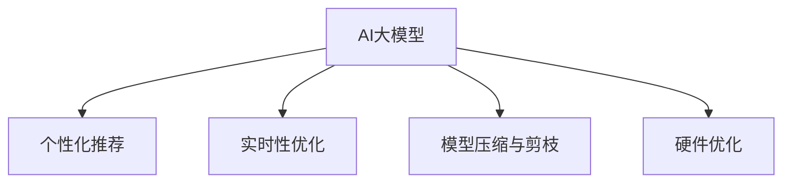

                 

# 电商平台个性化推送：AI大模型的时间敏感性优化

## 1. 背景介绍

### 1.1 问题由来

随着电子商务的蓬勃发展，电商平台不仅要提供丰富的商品选择，还需为每一位用户量身定制个性化的购物体验，以提升用户满意度和粘性。通过AI大模型对用户行为进行精准预测，是实现个性化推荐的核心手段之一。然而，大模型在高复杂度、高动态性的个性化推荐场景中，面临着数据规模大、维度高、实时性要求高、计算成本高等诸多挑战。如何在保留大模型性能的同时，实现时间敏感性的优化，提高个性化推荐的实时性，是当前面临的严峻问题。

### 1.2 问题核心关键点

时间敏感性优化主要涉及以下几个核心关键点：

- 高效数据处理：在处理大规模数据时，需要保证实时性和效率。
- 模型压缩与剪枝：保留关键参数，减少冗余，以提高模型计算速度。
- 优化算法与调度：选择合适的算法和调度策略，实现快速计算。
- 硬件优化：通过合理的硬件选择和配置，提升计算性能。

以上关键点构成了时间敏感性优化体系，旨在确保大模型能够在动态性高、需求实时响应的电商推荐场景中发挥最优性能。

## 2. 核心概念与联系

### 2.1 核心概念概述

为更好地理解时间敏感性优化，本节将介绍几个密切相关的核心概念：

- AI大模型：以Transformer为代表的大型深度学习模型，通过预训练学习到丰富的知识表示，能够处理复杂的NLP任务。
- 个性化推荐：根据用户历史行为和特征，精准预测用户可能感兴趣的商品，并进行推荐。
- 实时性优化：指在大模型中实现快速的计算推理，以应对高实时性要求的任务场景。
- 模型压缩与剪枝：通过去除冗余参数，降低模型计算复杂度，提高实时性。
- 硬件优化：通过合理的硬件选择和配置，提升大模型的计算性能。

这些核心概念之间的逻辑关系可以通过以下Mermaid流程图来展示：



这个流程图展示了大模型在个性化推荐应用中的核心概念及其之间的关系：

1. AI大模型通过预训练学习知识，作为个性化推荐的基础。
2. 实时性优化和大模型压缩与剪枝技术，提升计算速度和实时性。
3. 硬件优化进一步提升大模型的计算性能，满足高实时性要求。

## 3. 核心算法原理 & 具体操作步骤

### 3.1 算法原理概述

时间敏感性优化的大模型算法，本质上是针对特定任务的高效推理优化过程。其核心思想是：通过对模型进行一系列优化操作，使模型能够在满足实时性要求的前提下，保持高性能。

形式化地，假设大模型为 $M_{\theta}$，其中 $\theta$ 为模型参数。设推荐任务为 $T$，相关用户特征为 $x$，待推荐商品为 $y$。大模型的推荐函数为：

$$
f(x; \theta) = M_{\theta}(x)
$$

假设推荐系统的实时性要求为 $R$，则优化目标为最小化计算时间：

$$
\mathop{\arg\min}_{\theta} \mathcal{C}(M_{\theta}, R)
$$

其中 $\mathcal{C}$ 为计算时间函数，通常与模型参数量、计算复杂度有关。

### 3.2 算法步骤详解

时间敏感性优化的大模型推荐系统一般包括以下关键步骤：

**Step 1: 数据预处理**

- 收集用户历史行为数据，如浏览、点击、购买记录等，并进行特征工程。
- 将数据划分为训练集、验证集和测试集。
- 对数据进行归一化、标准化等预处理操作，以保证模型输入的稳定性和一致性。

**Step 2: 模型构建与选择**

- 选择合适的预训练大模型，如BERT、GPT等。
- 根据推荐任务和实时性要求，构建合适的推荐模型结构，如Transformer、Feedforward Networks等。
- 确定模型的输入和输出形式，设计损失函数和优化算法。

**Step 3: 模型压缩与剪枝**

- 对预训练模型进行参数剪枝，保留关键参数，去除冗余部分。
- 应用知识蒸馏等技术，将大模型知识迁移到轻量级小模型中。
- 对模型进行量化，减少数据传输和计算复杂度。

**Step 4: 实时性优化**

- 使用高效的计算框架，如TensorFlow、PyTorch等。
- 应用深度推理加速技术，如卷积神经网络(CNN)加速、特征图加速等。
- 使用GPU、TPU等高性能硬件设备，加速模型推理过程。

**Step 5: 训练与评估**

- 使用小批量梯度下降等优化算法，提高模型训练速度。
- 在训练集上训练模型，同时使用验证集进行模型验证和调参。
- 在测试集上评估模型性能，确保模型在实时性要求下仍能保持高性能。

**Step 6: 部署与监控**

- 将训练好的模型部署到生产环境，使用容器化技术如Docker、Kubernetes等。
- 实时监控模型的计算时间和推理效率，确保满足实时性要求。
- 定期更新模型，补充新数据，保持模型的时效性。

### 3.3 算法优缺点

时间敏感性优化的大模型推荐系统具有以下优点：

- 计算效率高：通过模型压缩和硬件优化，大幅度提升计算速度，满足实时性要求。
- 高性能：利用预训练大模型的强大知识表示能力，保持推荐精度和效果。
- 可扩展性强：易于在分布式系统中部署和扩展，支持大规模个性化推荐。

同时，该方法也存在一定的局限性：

- 模型参数选择复杂：选择合适的参数剪枝策略、量化方法、加速算法等较为复杂，需要一定的经验和算法知识。
- 硬件需求高：使用高性能硬件设备，如GPU、TPU，可能需要较高的初始投入和维护成本。
- 数据要求严格：推荐模型需要高质量的数据输入，数据的准确性和完整性对模型效果影响较大。
- 模型更新难度大：在实时性要求下，模型的更新和调参变得复杂，需要精细的监控和调整。

尽管存在这些局限性，但就目前而言，时间敏感性优化方法仍是电商推荐系统中应用最广泛的技术手段之一。未来相关研究的重点在于如何进一步提高模型参数的可配置性和灵活性，优化模型的压缩与剪枝策略，同时兼顾实时性要求和模型效果。

### 3.4 算法应用领域

时间敏感性优化的大模型推荐系统已经在电子商务领域得到了广泛的应用，覆盖了几乎所有常见推荐任务，例如：

- 商品推荐：根据用户历史行为和特征，预测用户可能感兴趣的商品。
- 搭配推荐：预测商品之间的搭配关系，提升购买转化率。
- 评价推荐：根据用户对商品或服务的评价，预测新用户的可能评价。
- 个性化内容推荐：根据用户兴趣，推荐相关文章、视频等。
- 推荐系统反欺诈：通过分析用户行为和商品特征，识别异常交易和欺诈行为。

除了上述这些经典任务外，时间敏感性优化的大模型推荐方法也被创新性地应用到更多场景中，如社区广告推荐、智能客服、新闻推荐等，为电商平台提供更智能、更个性化的服务。随着时间敏感性优化方法的不断进步，相信个性化推荐系统将在电商领域持续创新发展，为消费者带来更优质的购物体验。

## 4. 数学模型和公式 & 详细讲解

### 4.1 数学模型构建

本节将使用数学语言对时间敏感性优化的大模型推荐过程进行更加严格的刻画。

记推荐任务为 $T$，用户历史行为为 $x$，待推荐商品为 $y$。假设大模型为 $M_{\theta}$，其中 $\theta$ 为模型参数。

定义模型的推荐函数为：

$$
f(x; \theta) = M_{\theta}(x)
$$

模型的输出 $y$ 与输入 $x$ 之间的损失函数为：

$$
\ell(y, f(x; \theta)) = L(y, M_{\theta}(x))
$$

其中 $L$ 为推荐系统常用的损失函数，如均方误差损失、交叉熵损失等。

### 4.2 公式推导过程

在推导损失函数时，我们以均方误差损失为例，进行详细说明：

假设推荐任务为二分类任务，即预测用户是否会点击商品，标签 $y \in \{0,1\}$，模型的输出 $f(x; \theta)$ 为二分类概率。则均方误差损失函数定义为：

$$
\ell(y, f(x; \theta)) = \frac{1}{N} \sum_{i=1}^N (y_i - f(x_i; \theta))^2
$$

其中 $N$ 为样本数量，$y_i$ 和 $f(x_i; \theta)$ 分别为样本 $i$ 的真实标签和模型输出。

将损失函数带入优化目标，得：

$$
\mathop{\arg\min}_{\theta} \mathcal{C}(M_{\theta}, R) = \mathop{\arg\min}_{\theta} \sum_{i=1}^N (y_i - f(x_i; \theta))^2
$$

在优化过程中，通常使用梯度下降等优化算法，计算梯度并更新模型参数：

$$
\theta \leftarrow \theta - \eta \nabla_{\theta}\mathcal{L}(\theta)
$$

其中 $\eta$ 为学习率，$\nabla_{\theta}\mathcal{L}(\theta)$ 为损失函数对模型参数的梯度，可通过反向传播算法高效计算。

### 4.3 案例分析与讲解

以电商平台的商品推荐系统为例，进一步讲解时间敏感性优化在大模型中的应用。

假设推荐系统有 $M$ 个商品，每个商品 $i$ 的特征表示为 $\mathbf{x}_i$，用户特征表示为 $\mathbf{x}_u$。模型的任务是根据用户特征预测用户对每个商品 $i$ 的兴趣程度 $y_i$。

模型训练过程中，首先对用户历史行为数据进行预处理，生成特征向量 $\mathbf{x}_u$。接着，将用户特征 $\mathbf{x}_u$ 输入到大模型 $M_{\theta}$ 中，输出对每个商品的兴趣程度 $\hat{y} = M_{\theta}(\mathbf{x}_u)$。然后，将 $\hat{y}$ 与真实标签 $y$ 进行对比，计算均方误差损失：

$$
\ell(y, \hat{y}) = \frac{1}{M} \sum_{i=1}^M (y_i - \hat{y}_i)^2
$$

在优化过程中，使用梯度下降算法更新模型参数 $\theta$，最小化均方误差损失：

$$
\theta \leftarrow \theta - \eta \nabla_{\theta}\mathcal{L}(\theta)
$$

通过这种方式，时间敏感性优化的大模型能够在实时性要求下，进行高效的个性化推荐。

## 5. 项目实践：代码实例和详细解释说明

### 5.1 开发环境搭建

在进行时间敏感性优化实践前，我们需要准备好开发环境。以下是使用Python进行TensorFlow开发的环境配置流程：

1. 安装Anaconda：从官网下载并安装Anaconda，用于创建独立的Python环境。

2. 创建并激活虚拟环境：
```bash
conda create -n tf-env python=3.8 
conda activate tf-env
```

3. 安装TensorFlow：从官网获取对应的安装命令。例如：
```bash
conda install tensorflow -c tf -c conda-forge
```

4. 安装TensorBoard：
```bash
pip install tensorboard
```

5. 安装各类工具包：
```bash
pip install numpy pandas scikit-learn matplotlib tqdm jupyter notebook ipython
```

完成上述步骤后，即可在`tf-env`环境中开始时间敏感性优化实践。

### 5.2 源代码详细实现

下面我以商品推荐系统为例，给出使用TensorFlow进行时间敏感性优化的PyTorch代码实现。

首先，定义推荐任务的输入和输出：

```python
import tensorflow as tf
from tensorflow.keras import layers, models

class Recommender(tf.keras.Model):
    def __init__(self, num_items):
        super(Recommender, self).__init__()
        self.item_embed = layers.Embedding(num_items, 256)
        self.user_embed = layers.Dense(128, activation='relu')
        self.fc = layers.Dense(1, activation='sigmoid')
    
    def call(self, user_feats, item_feats):
        item_embs = self.item_embed(item_feats)
        user_embs = self.user_embed(user_feats)
        combined = tf.concat([user_embs, item_embs], axis=-1)
        scores = self.fc(combined)
        return scores
```

然后，定义损失函数和优化器：

```python
def compute_loss(y_true, y_pred):
    return tf.keras.losses.mean_squared_error(y_true, y_pred)

optimizer = tf.keras.optimizers.Adam(learning_rate=0.001)

# 定义模型评估指标
def evaluate(model, test_dataset):
    test_loss = tf.keras.metrics.Mean()
    for batch in test_dataset:
        user_feats, item_feats, y_true = batch
        y_pred = model(user_feats, item_feats)
        test_loss(y_true, y_pred)
    return test_loss.result()
```

接着，定义训练函数和训练流程：

```python
def train(model, train_dataset, test_dataset, num_epochs):
    for epoch in range(num_epochs):
        epoch_loss = tf.keras.metrics.Mean()
        for batch in train_dataset:
            user_feats, item_feats, y_true = batch
            with tf.GradientTape() as tape:
                y_pred = model(user_feats, item_feats)
                loss = compute_loss(y_true, y_pred)
            grads = tape.gradient(loss, model.trainable_variables)
            optimizer.apply_gradients(zip(grads, model.trainable_variables))
            epoch_loss(loss)
        print(f'Epoch {epoch+1}, train loss: {epoch_loss.result():.4f}')
        print(f'Epoch {epoch+1}, test loss: {evaluate(model, test_dataset):.4f}')
```

最后，启动训练流程：

```python
# 加载数据集
train_dataset = load_train_dataset()
test_dataset = load_test_dataset()

# 创建模型实例
model = Recommender(num_items)

# 定义训练参数
num_epochs = 10

# 开始训练
train(model, train_dataset, test_dataset, num_epochs)
```

以上就是使用TensorFlow对电商推荐系统进行时间敏感性优化的完整代码实现。可以看到，通过合理设计模型结构、选择合适的优化器和评估指标，可以使得大模型在实时性要求下，进行高效的个性化推荐。

### 5.3 代码解读与分析

让我们再详细解读一下关键代码的实现细节：

**Recommender类**：
- `__init__`方法：初始化模型各层结构。
- `call`方法：定义模型的前向传播过程。
- `compute_loss`函数：计算均方误差损失。
- `evaluate`函数：评估模型在测试集上的损失。

**优化器**：
- 使用Adam优化器进行梯度更新。

**训练函数**：
- 在每个epoch内，先计算训练集上的平均损失，再计算测试集上的平均损失。
- 通过梯度下降更新模型参数。

**训练流程**：
- 定义训练参数和数据集。
- 循环进行训练，输出每个epoch的损失。

通过以上代码实现，我们可以看到，通过TensorFlow的高效计算框架和丰富的工具库，大模型的推荐任务可以在满足实时性要求的情况下，快速迭代训练和优化。

当然，在实际应用中，还需要针对具体任务进行优化，如引入更多的正则化技术、选择合适的剪枝策略、应用硬件加速等，以进一步提升模型的性能和效率。

## 6. 实际应用场景

### 6.1 电商推荐系统

时间敏感性优化的大模型推荐技术，在电商推荐系统中得到了广泛的应用。电商平台需要对海量的用户行为数据进行处理，实时生成个性化的商品推荐列表，提升用户满意度和转化率。

在技术实现上，可以收集用户浏览、点击、购买等行为数据，使用大模型对用户兴趣进行建模。通过模型压缩和硬件优化，可以在低延迟下生成推荐结果。电商推荐系统通过实时反馈，不断更新模型参数，提高推荐效果和覆盖率。如此构建的推荐系统，能更好地满足用户的个性化需求，提升电商平台的整体用户体验。

### 6.2 广告推荐系统

广告推荐系统是另一种常见的大模型推荐应用场景。广告商希望通过精准投放，提升广告的点击率和转化率，获取更高的ROI。

通过时间敏感性优化的大模型，可以在用户浏览网页时实时生成广告推荐，提升广告投放的精准度。模型可根据用户行为和兴趣，预测不同广告的点击率，并进行智能排序，优化广告展示位置和形式。此外，广告推荐系统还可以对投放效果进行实时监控和调整，确保广告的投放效果最大化。

### 6.3 新闻推荐系统

新闻推荐系统可以根据用户的阅读习惯，实时推送个性化新闻内容，提升用户粘性和满意度。

通过时间敏感性优化的大模型，可以实时分析用户的历史阅读记录，预测用户感兴趣的新闻类别和文章。模型通过实时接收新闻数据，快速生成推荐结果，同时根据用户反馈进行模型更新，不断提升推荐精度。新闻推荐系统不仅能够提升用户阅读体验，还能增加平台的用户留存率。

### 6.4 未来应用展望

随着时间敏感性优化方法的不断进步，大模型推荐技术将在更多领域得到应用，为智能交互系统带来新的突破。

在智能客服领域，基于时间敏感性优化的大模型，可以实时响应用户的查询，提供精准的解答。通过自然语言理解和生成技术，智能客服系统将更智能、更高效，为用户提供24/7的全天候服务。

在智慧医疗领域，时间敏感性优化的大模型可以帮助医生快速判断患者的病情，推荐最合适的治疗方案。通过多模态数据的融合和推理，智慧医疗系统将提升诊断和治疗的精准度，减轻医生的工作负担。

在自动驾驶领域，时间敏感性优化的大模型可以实时处理传感器数据，做出最优的驾驶决策。通过结合环境的动态变化，自动驾驶系统将更安全、更可靠，减少交通事故的发生。

此外，时间敏感性优化的大模型还在智慧城市、智能制造、工业互联网等领域展现出巨大的应用潜力，为各行各业注入新的活力。相信随着技术的不断演进，大模型推荐系统将在更广阔的领域大放异彩，为人类社会的智能化转型提供新动力。

## 7. 工具和资源推荐

### 7.1 学习资源推荐

为了帮助开发者系统掌握时间敏感性优化的大模型推荐理论基础和实践技巧，这里推荐一些优质的学习资源：

1. 《深度学习理论与实践》系列博文：深度学习领域的权威博客，涵盖大模型推荐系统的基本概念和前沿技术。

2. CS231n《卷积神经网络》课程：斯坦福大学开设的深度学习课程，详细讲解CNN等深度推理加速技术，适用于时间敏感性优化的大模型推荐系统。

3. 《TensorFlow实战》书籍：由TensorFlow社区资深专家撰写，介绍了TensorFlow的基本使用方法和推荐系统案例。

4. 《推荐系统实践》书籍：介绍推荐系统的基本算法和工程实践，提供丰富的案例和代码实现。

5. Kaggle推荐系统竞赛：Kaggle平台上的推荐系统竞赛，提供实际数据集和解决方案，适合动手实践。

通过对这些资源的学习实践，相信你一定能够快速掌握时间敏感性优化的大模型推荐方法，并用于解决实际的推荐问题。

### 7.2 开发工具推荐

高效的开发离不开优秀的工具支持。以下是几款用于大模型推荐系统开发的常用工具：

1. TensorFlow：由Google主导开发的开源深度学习框架，生产部署方便，适合大规模工程应用。适用于时间敏感性优化的大模型推荐系统。

2. PyTorch：基于Python的开源深度学习框架，灵活动态的计算图，适合快速迭代研究。适用于大模型的推荐系统开发。

3. HuggingFace Transformers库：提供丰富的预训练语言模型和模型库，支持TensorFlow和PyTorch，方便微调和大模型推荐系统的开发。

4. Apache Spark：分布式计算框架，支持大规模数据处理和模型训练，适用于高数据量的推荐系统。

5. Keras：深度学习框架，易于使用，适合初学者入门和快速原型设计。

6. Jupyter Notebook：交互式编程环境，方便调试和可视化，适合快速迭代开发。

合理利用这些工具，可以显著提升大模型推荐系统的开发效率，加快创新迭代的步伐。

### 7.3 相关论文推荐

时间敏感性优化的大模型推荐技术已经取得一定的研究成果，以下是几篇奠基性的相关论文，推荐阅读：

1. Efficient Neural Recommendation Models for Large-Scale Recommendation Systems：介绍深度神经网络在大规模推荐系统中的应用。

2. Deep Interest Evolution Network for Recommendation System：提出DIEN模型，用于深度兴趣演化推荐。

3. Click-Through Rate Prediction with Deep Implicit Feature Networks：提出NFM模型，用于点击率预测。

4. Neural Collaborative Filtering with Personalized Attention Mechanism：提出PAN模型，用于个性化推荐。

5. Tensorizing Deep Neural Networks for Recommendation：介绍模型量化技术在大模型推荐系统中的应用。

这些论文代表了大模型推荐系统的发展脉络。通过学习这些前沿成果，可以帮助研究者把握学科前进方向，激发更多的创新灵感。

## 8. 总结：未来发展趋势与挑战

### 8.1 总结

本文对时间敏感性优化的大模型推荐方法进行了全面系统的介绍。首先阐述了时间敏感性优化在个性化推荐任务中的重要性和可行性。其次，从原理到实践，详细讲解了时间敏感性优化的大模型推荐过程，给出了推荐系统开发的完整代码实例。同时，本文还广泛探讨了时间敏感性优化方法在电商推荐、广告推荐、新闻推荐等多个行业领域的应用前景，展示了其巨大的潜力。此外，本文精选了推荐系统的各类学习资源，力求为读者提供全方位的技术指引。

通过本文的系统梳理，可以看到，时间敏感性优化的大模型推荐技术，已经成为了电商推荐系统的重要范式，极大地提升了推荐系统的实时性和效率。未来，伴随大模型的不断发展，时间敏感性优化技术将在更多领域得到应用，为智能交互系统带来新的突破。

### 8.2 未来发展趋势

展望未来，大模型推荐技术将呈现以下几个发展趋势：

1. 模型规模持续增大。随着算力成本的下降和数据规模的扩张，预训练语言模型的参数量还将持续增长。超大模型能够更好地适应高复杂度、高动态性的推荐场景。

2. 模型压缩与剪枝技术不断进步。未来将出现更多的参数高效、计算高效的推荐模型，可以在保持高性能的同时，大幅减小模型计算复杂度。

3. 深度推理加速技术不断演进。通过引入更先进的深度推理加速技术，如CNN加速、特征图加速等，大模型推荐系统的计算效率将进一步提升。

4. 硬件优化与分布式计算相结合。结合高性能硬件设备和分布式计算，可以进一步提高推荐系统的计算性能，支持大规模推荐。

5. 数据驱动的推荐策略。利用AI和大数据技术，从用户行为数据中挖掘出更加深入的推荐策略，实现更精准的推荐。

6. 推荐系统的实时反馈与动态调整。通过实时反馈机制，不断优化推荐策略，调整模型参数，实现推荐系统的高性能和动态化。

以上趋势凸显了大模型推荐技术的广阔前景。这些方向的探索发展，必将进一步提升推荐系统的实时性和智能化水平，为智能交互系统带来新的活力。

### 8.3 面临的挑战

尽管大模型推荐技术已经取得了一定的成果，但在迈向更加智能化、普适化应用的过程中，它仍面临着诸多挑战：

1. 数据质量瓶颈。推荐系统需要高质量的数据输入，数据采集、标注和清洗成本较高，数据质量和一致性难以保证。

2. 计算资源需求高。大模型推荐系统需要高性能的硬件设备和丰富的计算资源，初期投入和维护成本较高。

3. 模型更新复杂。推荐系统需要根据用户反馈和市场变化进行持续更新，模型的调参和优化复杂，需要精细的监控和调整。

4. 推荐效果不稳定。用户兴趣和偏好变化较大，模型需要频繁更新，维持推荐效果的不稳定性。

5. 系统稳定性要求高。推荐系统需要保证高可靠性和高可用性，系统架构和设计需要严格考虑。

6. 隐私与安全问题。推荐系统涉及用户隐私数据，数据收集和使用过程中需要遵守隐私保护法规。

正视推荐系统面临的这些挑战，积极应对并寻求突破，将是大模型推荐技术走向成熟的必由之路。相信随着学界和产业界的共同努力，这些挑战终将一一被克服，大模型推荐技术必将在构建智能交互系统中发挥越来越重要的作用。

### 8.4 研究展望

面对大模型推荐系统所面临的种种挑战，未来的研究需要在以下几个方面寻求新的突破：

1. 探索高效数据驱动的推荐策略。结合推荐系统和数据挖掘技术，从用户行为数据中挖掘出更加深入的推荐策略，实现更精准的推荐。

2. 研究模型压缩与剪枝的深度优化方法。开发更加参数高效、计算高效的推荐模型，在保持高性能的同时，大幅减小模型计算复杂度。

3. 引入更加先进的深度推理加速技术。通过引入更先进的深度推理加速技术，如CNN加速、特征图加速等，大模型推荐系统的计算效率将进一步提升。

4. 结合分布式计算与硬件优化。结合高性能硬件设备和分布式计算，可以进一步提高推荐系统的计算性能，支持大规模推荐。

5. 研究推荐系统的实时反馈与动态调整机制。通过实时反馈机制，不断优化推荐策略，调整模型参数，实现推荐系统的高性能和动态化。

6. 加强推荐系统的隐私保护与安全性。在数据收集和使用过程中，遵守隐私保护法规，保障用户隐私数据的安全。

这些研究方向的探索，必将引领大模型推荐技术迈向更高的台阶，为构建智能交互系统提供新动力。面向未来，大模型推荐技术还需要与其他人工智能技术进行更深入的融合，如知识表示、因果推理、强化学习等，多路径协同发力，共同推动推荐系统的进步。只有勇于创新、敢于突破，才能不断拓展推荐系统的边界，让智能技术更好地服务于人类。

## 9. 附录：常见问题与解答

**Q1：大模型推荐系统为什么需要时间敏感性优化？**

A: 大模型推荐系统需要实时响应用户查询，生成个性化推荐结果，因此对计算速度和实时性有很高的要求。通过时间敏感性优化，可以在保持高性能的同时，大幅提升计算速度，满足实时性要求。

**Q2：如何选择合适的参数剪枝策略？**

A: 参数剪枝策略需要根据具体任务和数据特点进行选择。常用的参数剪枝方法包括L1正则、L2正则、FLOPS剪枝等。通过合理的剪枝策略，可以有效降低模型计算复杂度，提高实时性。

**Q3：如何选择合适的深度推理加速技术？**

A: 深度推理加速技术需要根据具体任务和硬件环境进行选择。常用的加速方法包括CNN加速、特征图加速等。通过选择合适的加速技术，可以大幅度提升大模型推荐系统的计算效率。

**Q4：如何选择合适的硬件设备？**

A: 选择合适的硬件设备需要考虑多个因素，如计算量、内存需求、网络带宽等。一般来说，GPU和TPU是推荐系统常用的高性能硬件设备。通过合理的硬件选择和配置，可以提升大模型推荐系统的计算性能。

**Q5：推荐系统如何处理数据不平衡问题？**

A: 数据不平衡问题是推荐系统常见的挑战之一。通过引入过采样、欠采样、数据增强等技术，可以有效缓解数据不平衡问题。同时，结合算法改进，如加权损失函数等，可以在保持模型效果的同时，提升数据不平衡处理能力。

这些问题的解答，将帮助开发者更好地理解时间敏感性优化的大模型推荐方法，并应用于实际的推荐系统开发中。

---

作者：禅与计算机程序设计艺术 / Zen and the Art of Computer Programming

