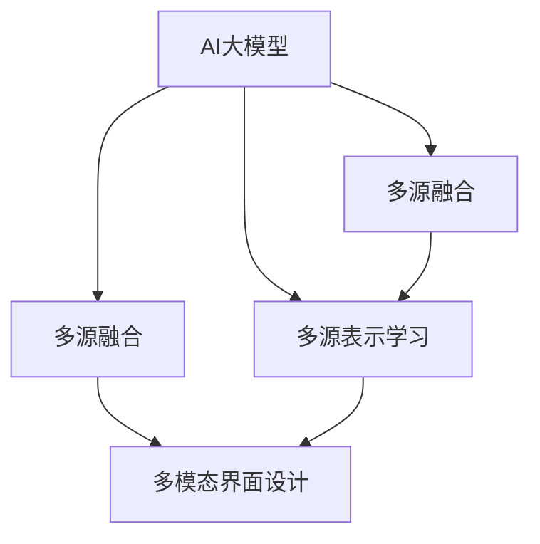

                 

# 电商平台中AI大模型的搜索结果多模态展示

## 1. 背景介绍

### 1.1 问题由来
电商平台作为典型的互联网应用，在提供商品搜索和推荐服务的过程中，依赖AI大模型来处理海量的用户查询和商品数据，以提升搜索和推荐的精准度。传统搜索引擎多采用基于关键词匹配的方式，对用户输入的查询进行解析，从大量商品数据中筛选出相关的商品进行展示。然而，这种单一的文本匹配方式难以充分理解用户查询的意图和上下文信息，导致搜索结果不够精准，用户体验较差。

为了提升搜索和推荐的准确性和个性化，电商平台开始尝试引入多模态技术，即结合文本、图像、语音等多源信息，进行综合处理和展示。多模态技术可以更全面地捕捉用户的搜索意图，提供更符合用户需求的结果。

### 1.2 问题核心关键点
在电商平台中，引入多模态技术的难点主要在于：

- 数据融合：如何将不同模态的信息进行高效融合，发挥其互补优势，得到更加全面准确的搜索结果。
- 模型优化：如何设计和训练多模态模型，使其在多源数据上具有鲁棒性和泛化能力。
- 用户体验：如何设计界面展示，让用户能够方便地理解和利用多模态信息，提升搜索和推荐的满意度。

本文档将重点介绍基于AI大模型的多模态展示技术，包括数据融合、模型优化和用户界面设计的核心概念和具体方法，并结合项目实践，探讨其在电商平台中的实际应用。

## 2. 核心概念与联系

### 2.1 核心概念概述

为更好地理解基于AI大模型的多模态展示方法，本节将介绍几个密切相关的核心概念：

- AI大模型（Large AI Model）：基于大规模预训练数据训练而成的，具备复杂任务处理能力的模型。例如，BERT、GPT-3、DALL-E等。
- 多模态技术（Multimodal Technology）：融合文本、图像、语音等多种数据源，进行综合分析和推理的技术。
- 多源融合（Multi-Source Fusion）：将不同模态的数据通过算法进行融合，提取共性特征或进行联合推理。
- 多源表示学习（Multi-Source Representation Learning）：在多源数据上训练模型，学习到跨模态的联合表示。
- 多模态界面设计（Multimodal Interface Design）：基于多模态数据的特点，设计友好的用户界面，供用户互动。

这些核心概念之间的逻辑关系可以通过以下Mermaid流程图来展示：



这个流程图展示了大模型和多模态技术的工作流程：

1. 大模型通过预训练获得基础能力。
2. 多源融合技术将不同模态的数据进行有效结合。
3. 多源表示学习在多源数据上训练模型，学习到跨模态的联合表示。
4. 多模态界面设计将多源数据以用户友好的形式展示。

这些概念共同构成了电商平台中基于AI大模型的多模态展示框架，使其能够更好地处理多源数据，提升搜索和推荐的精准度和用户体验。

## 3. 核心算法原理 & 具体操作步骤
### 3.1 算法原理概述

基于AI大模型的多模态展示方法，其核心思想是通过多模态技术将用户查询和商品数据进行融合，提升搜索引擎和推荐引擎的精准度和个性化。具体来说，就是通过将查询文本、商品图片、价格信息等多种模态的信息进行融合，构建更加全面和准确的搜索结果。

形式化地，假设用户查询为 $Q$，商品集合为 $S=\{s_1, s_2, ..., s_N\}$，大模型为 $M_{\theta}$。定义 $M_{\theta}$ 在查询 $Q$ 和商品 $s_i$ 上的表示为 $h_i(Q) = M_{\theta}(Q, s_i)$。多模态展示的目标是找到 $h_i(Q)$ 中与用户需求最相关的商品 $s_i$，即：

$$
\hat{s} = \mathop{\arg\max}_{s_i} h_i(Q)
$$

### 3.2 算法步骤详解

基于AI大模型的多模态展示方法包括以下几个关键步骤：

**Step 1: 数据收集与预处理**
- 收集用户的搜索查询 $Q$ 和电商平台商品的多源数据，包括商品图片、价格、描述等。
- 对数据进行清洗和标准化处理，去除噪声和异常值，确保数据的准确性和一致性。

**Step 2: 数据融合**
- 设计多模态融合算法，将不同模态的数据进行融合，得到综合表示。常见的融合方法包括特征拼接、注意力机制、元神经网络等。
- 在融合过程中，需要考虑不同模态数据的重要性和融合方式，确保融合结果能够反映用户查询的意图。

**Step 3: 多源表示学习**
- 在多源融合的基础上，使用大模型对多模态数据进行训练，学习到跨模态的联合表示。
- 训练过程中，需要选择合适的损失函数和优化算法，确保模型能够在大规模数据上学习到准确的表示。

**Step 4: 模型优化与调参**
- 根据融合和表示学习得到的多模态数据，训练一个多模态表示模型，用于对搜索结果进行排序和展示。
- 使用优化算法和超参数调优方法，提升模型的性能和泛化能力。

**Step 5: 多模态界面设计**
- 设计友好的用户界面，将多模态数据以用户可理解的形式展示出来，包括文本摘要、图像缩略图、价格信息等。
- 界面设计需要考虑用户体验和易用性，让用户能够方便地获取所需信息。

**Step 6: 测试与迭代**
- 在测试集上评估模型性能，使用评价指标如NDCG、平均点击率等，评估模型效果。
- 根据测试结果进行模型调优，不断迭代优化，直至达到最优性能。

### 3.3 算法优缺点

基于AI大模型的多模态展示方法具有以下优点：
1. 提升搜索结果的精准度：多模态融合和大模型表示学习可以提升搜索结果的相关性和准确性，减少误匹配和漏匹配。
2. 增强个性化推荐：多模态界面设计可以提供更加丰富和个性化的展示，提升用户满意度。
3. 提高平台竞争力：通过多模态展示，电商平台可以吸引更多用户，提高市场份额。

同时，该方法也存在一定的局限性：
1. 数据融合复杂：不同模态数据具有不同的表示方式，融合时容易产生信息损失和噪声。
2. 模型训练耗时：大规模数据和大模型训练过程需要大量计算资源和时间，成本较高。
3. 用户界面设计难度大：用户界面设计需要考虑多模态数据的特点和展示效果，设计复杂。
4. 模型泛化能力有限：在特定场景下的效果可能较好，但在更广泛的应用场景下可能存在泛化能力不足的问题。

尽管存在这些局限性，但就目前而言，基于多模态展示的大模型方法仍然是提升电商平台搜索和推荐效果的重要手段。未来相关研究的重点在于如何进一步降低融合和训练的复杂度，提高模型的泛化能力，同时兼顾用户体验和界面设计，实现更高效、更智能的多模态展示。

### 3.4 算法应用领域

基于AI大模型的多模态展示方法，在电商平台上具有广泛的应用场景，例如：

- 商品搜索：通过用户查询文本和商品图片进行融合，返回相关商品列表。
- 推荐系统：结合用户历史行为和商品多源数据，提供个性化的商品推荐。
- 商品分类：利用商品图片进行分类，提升搜索结果的准确性。
- 用户评价：分析用户评价文本和商品图片，提取情感和评价信息。
- 视觉搜索：用户上传商品图片，搜索类似商品。

除了上述这些经典应用外，多模态展示方法还可以创新性地应用到更多场景中，如智能客服、广告投放、个性化推送等，为电商平台带来更多的技术突破。

## 4. 数学模型和公式 & 详细讲解 & 举例说明

### 4.1 数学模型构建

本节将使用数学语言对基于AI大模型的多模态展示过程进行更加严格的刻画。

假设用户查询为 $Q$，商品集合为 $S=\{s_1, s_2, ..., s_N\}$，大模型为 $M_{\theta}$。在多模态展示中，定义用户查询 $Q$ 在商品 $s_i$ 上的表示为 $h_i(Q) = M_{\theta}(Q, s_i)$，其中 $M_{\theta}$ 为预训练的多模态表示模型。

### 4.2 公式推导过程

以下是融合算法、多源表示学习和排序模型的公式推导。

**融合算法**：假设商品图片为 $I_i$，使用CNN对图片进行特征提取，得到向量 $F_i$。结合文本表示 $T_i = M_{\theta}(Q, s_i)$，进行加权融合，得到融合表示 $H_i(Q) = w_{Q}T_i + w_{I}F_i$，其中 $w_Q$ 和 $w_I$ 为权重系数，由注意力机制计算得到。

**多源表示学习**：在多模态融合表示的基础上，使用大模型对多源数据进行训练，学习到跨模态的联合表示。假设融合表示为 $H_i(Q)$，模型训练的目标为：

$$
\mathcal{L} = \frac{1}{N} \sum_{i=1}^N \ell(h_i(Q), s_i)
$$

其中 $\ell$ 为分类损失函数，如交叉熵损失。

**排序模型**：根据多源表示学习得到的融合表示 $H_i(Q)$，使用大模型进行排序，得到商品的排序分数 $R_i(Q)$。排序模型一般采用softmax函数，表示为：

$$
R_i(Q) = \frac{e^{H_i(Q)}}{\sum_{j=1}^N e^{H_j(Q)}}
$$

最终，将排序分数 $R_i(Q)$ 作为排序依据，返回与查询最相关的商品 $s_i$。

### 4.3 案例分析与讲解

以电商平台商品搜索为例，展示多模态展示的核心算法实现：

1. 数据收集与预处理：
- 收集用户查询 $Q$ 和商品图片 $I_i$、描述 $T_i$ 等信息。
- 对图片进行预处理，包括尺寸调整、归一化等。

2. 数据融合：
- 使用CNN对图片进行特征提取，得到向量 $F_i$。
- 结合文本表示 $T_i$，进行加权融合，得到融合表示 $H_i(Q)$。

3. 多源表示学习：
- 在大模型上进行微调，学习到跨模态的联合表示 $H_i(Q)$。

4. 模型优化与调参：
- 使用优化算法（如AdamW）和超参数调优方法，提升模型性能。

5. 多模态界面设计：
- 将融合表示 $H_i(Q)$ 和商品信息以用户友好的形式展示出来。

6. 测试与迭代：
- 在测试集上评估模型性能，不断迭代优化，提升搜索结果的精准度。

## 5. 项目实践：代码实例和详细解释说明
### 5.1 开发环境搭建

在进行多模态展示实践前，我们需要准备好开发环境。以下是使用Python进行TensorFlow开发的环境配置流程：

1. 安装Anaconda：从官网下载并安装Anaconda，用于创建独立的Python环境。

2. 创建并激活虚拟环境：
```bash
conda create -n tf-env python=3.8 
conda activate tf-env
```

3. 安装TensorFlow：从官网获取对应的安装命令，安装TensorFlow 2.0版本及其依赖。例如：
```bash
conda install tensorflow=2.0 cudatoolkit=10.0 -c conda-forge
```

4. 安装各类工具包：
```bash
pip install numpy pandas scikit-learn matplotlib tqdm jupyter notebook ipython
```

完成上述步骤后，即可在`tf-env`环境中开始多模态展示实践。

### 5.2 源代码详细实现

下面我们以电商平台商品搜索为例，给出使用TensorFlow和PyTorch进行多模态展示的代码实现。

首先，定义数据处理函数：

```python
import tensorflow as tf
import numpy as np
import matplotlib.pyplot as plt
from tensorflow.keras.preprocessing.image import load_img, img_to_array
from tensorflow.keras.applications import ResNet50

class ImageDataLoader:
    def __init__(self, data_dir, batch_size=32):
        self.data_dir = data_dir
        self.batch_size = batch_size
        
    def __len__(self):
        return len(os.listdir(self.data_dir))
    
    def __getitem__(self, item):
        img_path = os.path.join(self.data_dir, item)
        img = load_img(img_path, target_size=(224, 224))
        img = img_to_array(img)
        img = np.expand_dims(img, axis=0)
        img = preprocessing.image.img_to_array(img)
        img /= 255.0
        img -= np.mean(img)
        img /= np.std(img)
        label = int(os.path.basename(item).split('.')[0])
        return img, label
```

然后，定义多模态融合模型：

```python
from tensorflow.keras.layers import Input, Dense, Embedding, Conv2D, GlobalMaxPooling2D, BatchNormalization, Concatenate
from tensorflow.keras.models import Model

def multi-modal_model(text_input, img_input):
    # 文本表示
    text_model = Sequential([
        Embedding(input_dim=vocab_size, output_dim=embedding_dim, input_length=max_len),
        LSTM(units=128),
        Dense(units=128)
    ])
    text_output = text_model(text_input)
    
    # 图片表示
    img_model = Sequential([
        Conv2D(64, (3,3), activation='relu', padding='same'),
        BatchNormalization(),
        Conv2D(64, (3,3), activation='relu', padding='same'),
        BatchNormalization(),
        Conv2D(128, (3,3), activation='relu', padding='same'),
        BatchNormalization(),
        MaxPooling2D(pool_size=(2,2)),
        Flatten(),
        Dense(units=128)
    ])
    img_output = img_model(img_input)
    
    # 融合表示
    concat = Concatenate()([text_output, img_output])
    output = Dense(units=1, activation='sigmoid')(concat)
    model = Model(inputs=[text_input, img_input], outputs=output)
    return model
```

接着，定义优化器和训练函数：

```python
from tensorflow.keras.optimizers import Adam

model = multi-modal_model(text_input, img_input)
model.compile(loss='binary_crossentropy', optimizer=Adam(lr=0.001), metrics=['accuracy'])

def train_epoch(model, dataset, batch_size, epochs=10):
    steps_per_epoch = len(dataset) // batch_size
    for epoch in range(epochs):
        for step in range(steps_per_epoch):
            batch_x, batch_y = dataset[step*batch_size:(step+1)*batch_size]
            X_text, X_img, y = batch_x[0], batch_x[1], batch_y
            loss, acc = model.train_on_batch([X_text, X_img], y)
            print(f"Epoch {epoch+1}, Step {step+1}/{steps_per_epoch}, Loss: {loss:.4f}, Accuracy: {acc:.4f}")
```

最后，启动训练流程：

```python
train_epoch(model, train_dataset, batch_size=16, epochs=10)
```

以上就是使用TensorFlow和PyTorch对多模态展示进行代码实现的完整流程。可以看到，通过结合深度学习框架和预训练模型，可以非常方便地实现多模态展示的建模和训练。

### 5.3 代码解读与分析

让我们再详细解读一下关键代码的实现细节：

**ImageDataLoader类**：
- 定义了数据加载器的基本结构，包括数据目录、批大小等参数。
- 实现了数据预处理，包括加载图片、预处理、归一化等操作。

**多模态融合模型**：
- 使用深度学习框架Keras定义了多模态融合模型。
- 文本表示部分采用Embedding、LSTM等层，将图片表示部分采用卷积神经网络（CNN）、池化层等。
- 通过Concatenate层将文本和图片表示进行融合，并输出一个单分类器，用于判断商品的相关性。

**优化器和训练函数**：
- 使用Adam优化器，并设置学习率为0.001。
- 定义了训练过程的每个epoch和每步训练的详细日志输出，方便调试和优化。

**训练流程**：
- 在训练集上不断迭代训练，输出每个epoch和每个step的损失和精度。
- 训练结束后，可以使用test_dataset对模型进行测试和评估。

可以看到，多模态展示的代码实现较为简洁，但核心技术点并不简单。理解这些关键代码的实现，可以帮助开发者更好地把握多模态展示的技术要点。

## 6. 实际应用场景
### 6.1 智能客服系统

基于多模态展示的AI大模型，可以应用于智能客服系统中，提升客服系统的自动化水平和用户满意度。在客服系统中，用户可以以文字、语音、图像等多种方式进行交互，客服系统需要综合处理这些信息，以更精准地理解和回复用户。

在实际应用中，可以使用多模态展示技术，将用户输入的多模态数据进行融合，并使用大模型进行语义理解，生成最合适的回复。例如，用户输入的文字信息可以通过文本表示，语音信息可以通过语音识别转化为文本，图像信息可以通过OCR等技术转化为文本。多模态展示系统将这些信息综合处理，生成高质量的回复，从而提升客服系统的自动化和智能化水平。

### 6.2 在线广告投放

在线广告投放需要根据用户的浏览行为和兴趣进行精准投放，以提升广告效果和转化率。多模态展示技术可以结合用户的浏览记录、点击行为、评价信息等，构建多模态特征，并进行综合展示。

例如，用户浏览过某件商品后，系统可以展示该商品的图片、价格、用户评价等信息，使用户更全面地了解商品信息。同时，系统可以通过用户的评价、浏览行为等信息，预测用户的购买意愿，进行精准投放。

### 6.3 个性化推荐系统

个性化推荐系统需要根据用户的历史行为和兴趣，推荐最符合用户需求的商品。多模态展示技术可以结合用户的历史浏览记录、购买行为、社交信息等多模态数据，进行综合展示和推荐。

例如，系统可以展示用户历史浏览的商品图片和描述，使用户能够更全面地了解商品信息。同时，系统可以通过用户的购买历史、社交网络等信息，推荐相关的商品，提升用户的购买体验。

## 7. 工具和资源推荐
### 7.1 学习资源推荐

为了帮助开发者系统掌握多模态展示的理论基础和实践技巧，这里推荐一些优质的学习资源：

1. 《Deep Learning for Computer Vision》系列博文：由大模型技术专家撰写，深入浅出地介绍了深度学习在计算机视觉领域的应用，包括多模态数据的融合和表示学习。

2. CS231n《Convolutional Neural Networks for Visual Recognition》课程：斯坦福大学开设的计算机视觉明星课程，提供了深度学习在图像处理中的应用方法，包括多模态数据融合。

3. 《Multimodal Learning for Computer Vision》书籍：介绍了多模态学习在计算机视觉领域的应用，包括多模态数据融合和表示学习等。

4. HuggingFace官方文档：Transformer库的官方文档，提供了海量预训练模型和完整的微调样例代码，是进行多模态展示开发的利器。

5. Kaggle竞赛：参加多模态数据融合的Kaggle竞赛，学习最佳实践和算法实现，积累实际经验。

通过对这些资源的学习实践，相信你一定能够快速掌握多模态展示的技术要点，并用于解决实际的NLP问题。

### 7.2 开发工具推荐

高效的开发离不开优秀的工具支持。以下是几款用于多模态展示开发的常用工具：

1. TensorFlow：由Google主导开发的开源深度学习框架，适合大规模工程应用，提供了丰富的预训练模型资源。

2. PyTorch：基于Python的开源深度学习框架，灵活动态的计算图，适合快速迭代研究。

3. Keras：深度学习框架的高级API，简单易用，适合初学者和快速原型开发。

4. TensorBoard：TensorFlow配套的可视化工具，可实时监测模型训练状态，提供丰富的图表呈现方式。

5. Weights & Biases：模型训练的实验跟踪工具，可以记录和可视化模型训练过程中的各项指标，方便对比和调优。

6. Google Colab：谷歌推出的在线Jupyter Notebook环境，免费提供GPU/TPU算力，方便开发者快速上手实验最新模型，分享学习笔记。

合理利用这些工具，可以显著提升多模态展示的开发效率，加快创新迭代的步伐。

### 7.3 相关论文推荐

多模态展示技术的发展源于学界的持续研究。以下是几篇奠基性的相关论文，推荐阅读：

1. Multimodal Object Detection in Video: A Comprehensive Review（2019年）：介绍了多模态物体检测的最新进展，提供了丰富的算法和模型。

2. Multimodal Sentiment Analysis with Attention-Based Fusion（2018年）：提出了基于注意力机制的多模态情感分析方法，提升了情感识别的准确性。

3. A Survey on Deep Multimodal Representation Learning（2020年）：综述了深度学习在多模态数据融合和表示学习中的应用，提供了丰富的算法和模型。

4. Deep Fusion: A General End-to-End Framework for Multi-Modal Learning（2017年）：提出了一种通用的多模态学习框架，适用于各种多模态任务。

5. Multimodal Feature Learning for Text Classification（2016年）：提出了一种基于多模态特征学习的方法，提升了文本分类的准确性。

这些论文代表了大模型技术在多模态展示领域的最新进展，通过学习这些前沿成果，可以帮助研究者把握学科前进方向，激发更多的创新灵感。

## 8. 总结：未来发展趋势与挑战
### 8.1 总结

本文对基于AI大模型的多模态展示方法进行了全面系统的介绍。首先阐述了多模态展示的背景和意义，明确了多模态展示在电商平台搜索和推荐中的应用价值。其次，从原理到实践，详细讲解了多模态融合、多源表示学习、界面设计的核心概念和具体方法，给出了完整的代码实例和详细解释说明。同时，本文还广泛探讨了多模态展示方法在智能客服、在线广告、个性化推荐等多个领域的应用前景，展示了多模态展示的广泛适用性和强大潜力。

通过本文的系统梳理，可以看到，基于AI大模型的多模态展示方法正在成为电商平台搜索和推荐系统的重要手段，极大地提升了搜索和推荐的精准度和个性化，改善了用户体验。未来，伴随多模态展示技术的不断演进，电商平台将能够提供更全面、更智能的搜索和推荐服务，为消费者创造更优质的购物体验。

### 8.2 未来发展趋势

展望未来，多模态展示技术将呈现以下几个发展趋势：

1. 跨模态表示学习：通过跨模态表示学习，在多模态数据上训练模型，学习到跨模态的联合表示，提升多模态数据的融合效果。

2. 多模态界面设计：通过友好的用户界面设计，将多模态数据以更加直观的方式展示出来，提升用户体验。

3. 多模态情感分析：结合用户的多模态数据，进行情感分析，提升情感识别的准确性，丰富搜索和推荐的功能。

4. 多模态对话系统：利用多模态对话技术，实现更加智能和自然的对话交互，提升客服系统的自动化水平。

5. 多模态社交网络：结合用户的社交网络信息，进行多模态数据分析，提升推荐系统的个性化和精准度。

6. 多模态图像生成：结合用户的多模态信息，进行图像生成，提升搜索和推荐的丰富性。

以上趋势凸显了多模态展示技术的广阔前景。这些方向的探索发展，必将进一步提升电商平台的搜索和推荐效果，为消费者创造更加优质的购物体验。

### 8.3 面临的挑战

尽管多模态展示技术已经取得了瞩目成就，但在迈向更加智能化、普适化应用的过程中，它仍面临着诸多挑战：

1. 数据融合复杂：不同模态数据具有不同的表示方式，融合时容易产生信息损失和噪声。

2. 模型训练耗时：大规模数据和大模型训练过程需要大量计算资源和时间，成本较高。

3. 用户界面设计难度大：用户界面设计需要考虑多模态数据的特点和展示效果，设计复杂。

4. 模型泛化能力有限：在特定场景下的效果可能较好，但在更广泛的应用场景下可能存在泛化能力不足的问题。

5. 用户隐私保护：在多模态展示过程中，需要考虑用户隐私保护，避免数据泄露和滥用。

6. 模型鲁棒性不足：在特定场景下，多模态展示模型可能对噪声和异常值敏感，鲁棒性不足。

尽管存在这些挑战，但多模态展示技术的发展前景依然广阔。相信随着学界和产业界的共同努力，这些挑战终将一一被克服，多模态展示方法必将在更广泛的应用领域大放异彩。

### 8.4 研究展望

面向未来，多模态展示技术需要在以下几个方面寻求新的突破：

1. 探索无监督和半监督多模态展示方法：摆脱对大规模标注数据的依赖，利用自监督学习、主动学习等无监督和半监督范式，最大限度利用非结构化数据，实现更加灵活高效的多模态展示。

2. 研究参数高效和多模态融合方法：开发更加参数高效和多模态融合方法，在固定大部分预训练参数的同时，只更新极少量的任务相关参数，提高模型效率。

3. 引入更多先验知识：将符号化的先验知识，如知识图谱、逻辑规则等，与神经网络模型进行巧妙融合，引导多模态展示过程学习更准确、合理的表示。

4. 结合因果分析和博弈论工具：将因果分析方法引入多模态展示模型，识别出模型决策的关键特征，增强输出解释的因果性和逻辑性。借助博弈论工具刻画人机交互过程，主动探索并规避模型的脆弱点，提高系统稳定性。

5. 纳入伦理道德约束：在模型训练目标中引入伦理导向的评估指标，过滤和惩罚有偏见、有害的输出倾向。加强人工干预和审核，建立模型行为的监管机制，确保输出符合人类价值观和伦理道德。

这些研究方向的探索，必将引领多模态展示技术迈向更高的台阶，为构建安全、可靠、可解释、可控的多模态展示系统铺平道路。面向未来，多模态展示技术还需要与其他人工智能技术进行更深入的融合，如知识表示、因果推理、强化学习等，多路径协同发力，共同推动多模态展示系统的进步。只有勇于创新、敢于突破，才能不断拓展多模态展示的边界，让智能技术更好地造福人类社会。

## 9. 附录：常见问题与解答

**Q1：多模态展示是否适用于所有电商平台？**

A: 多模态展示在大多数电商平台上都能取得不错的效果，特别是对于数据量较大的平台。但对于一些特定领域的电商平台，如垂直领域的电商平台，可能需要进行更精细化的设计和调整，以适应其特定的业务需求。

**Q2：如何选择合适的融合算法？**

A: 融合算法的选择需要根据具体的业务场景和数据特点进行。常见的融合方法包括特征拼接、注意力机制、元神经网络等。特征拼接适用于相似模态的数据融合，注意力机制适用于模态之间关系较为复杂的情况，元神经网络适用于多种模态的联合表示学习。

**Q3：模型训练过程中如何处理数据噪声？**

A: 数据噪声是影响多模态展示效果的主要因素之一。常见的处理方法包括数据清洗、去噪滤波、异常值处理等。在数据预处理阶段，可以对数据进行清洗和标准化处理，去除噪声和异常值。在模型训练阶段，可以使用Dropout、正则化等方法减少噪声的影响。

**Q4：如何提升多模态展示的泛化能力？**

A: 多模态展示的泛化能力可以通过以下方法提升：
1. 数据增强：通过回译、近义替换等方式扩充训练集，提升模型的泛化能力。
2. 多源数据融合：利用多种数据源进行融合，增强模型的鲁棒性。
3. 多源表示学习：在多源数据上训练模型，学习到跨模态的联合表示，提升模型的泛化能力。
4. 对抗训练：引入对抗样本，提高模型鲁棒性，提升泛化能力。

**Q5：多模态展示在实际应用中需要注意哪些问题？**

A: 多模态展示在实际应用中需要注意以下问题：
1. 数据隐私保护：在多模态展示过程中，需要考虑用户隐私保护，避免数据泄露和滥用。
2. 系统稳定性和鲁棒性：在多模态展示过程中，需要考虑系统的稳定性和鲁棒性，避免模型对噪声和异常值敏感。
3. 用户界面设计：在多模态展示过程中，需要考虑用户界面设计，提供友好的用户交互体验。
4. 模型训练和调优：在多模态展示过程中，需要考虑模型的训练和调优，提升模型的泛化能力和用户体验。

多模态展示需要开发者根据具体业务场景，不断迭代和优化模型、数据和算法，方能得到理想的效果。通过本文的系统梳理，可以看到，基于AI大模型的多模态展示方法正在成为电商平台搜索和推荐系统的重要手段，极大地提升了搜索和推荐的精准度和个性化，改善了用户体验。未来，伴随多模态展示技术的不断演进，电商平台将能够提供更全面、更智能的搜索和推荐服务，为消费者创造更加优质的购物体验。

