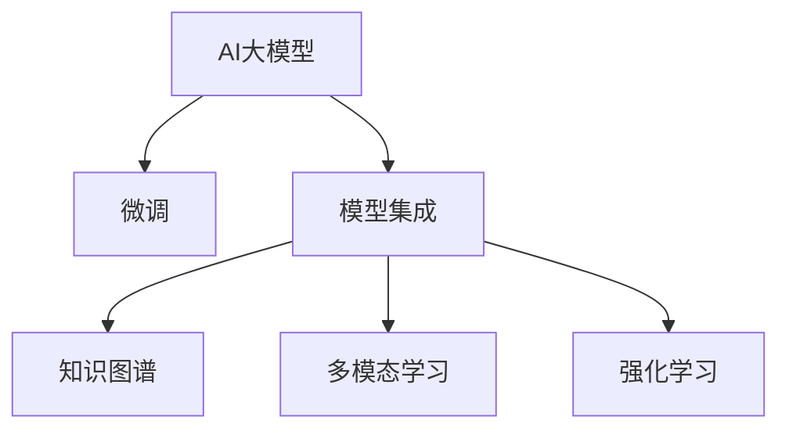

                 

# 电商平台中的AI大模型：从单一模型到模型集成

在电商平台的数字化转型过程中，AI大模型作为其核心技术之一，已展现出巨大的应用潜力。然而，单一的AI大模型往往难以应对电商平台的复杂场景，需要从单一模型到模型集成的转变，以实现更全面、更精准的电商AI解决方案。本文将系统性地探讨AI大模型在电商平台中的应用，从背景介绍、核心概念、算法原理到项目实践，全面剖析电商平台中AI大模型的构建与优化，并展望其未来发展趋势与挑战。

## 1. 背景介绍

### 1.1 问题由来
电商平台的快速发展，带来了对个性化推荐、智能客服、库存管理、价格优化等业务需求的多样化和复杂化。传统的业务系统无法高效、准确地处理这些需求，导致用户体验差、运营效率低、库存成本高等问题。为了应对这些挑战，电商平台纷纷引入AI技术，以提升业务效率和用户体验。

AI大模型作为AI技术的底层基础，具备强大的语言处理、图像识别、自然交互等能力，可以在电商平台中发挥关键作用。然而，单一的AI大模型往往难以覆盖电商平台的全部需求，模型集成的思路应运而生。

### 1.2 问题核心关键点
模型集成将单一的AI大模型组合为多模型系统，从而能够更好地适应电商平台多样化的业务需求。关键点包括：

- **模型选择与优化**：选择适合电商平台的AI大模型，并通过微调、优化等手段提升模型性能。
- **多模型融合**：将多个单一模型进行有效融合，构建覆盖电商业务全场景的AI模型集。
- **系统架构设计**：设计合理的多模型系统架构，以确保系统的高效、稳定运行。
- **业务场景适配**：根据电商业务的具体场景，适配不同的AI模型，提供定制化服务。

## 2. 核心概念与联系

### 2.1 核心概念概述

- **AI大模型**：如BERT、GPT-3、ViT等，具备强大的自然语言理解、图像处理、生成等多种能力。
- **微调(Fine-tuning)**：通过小规模有标签数据对AI大模型进行优化，提升模型在特定任务上的性能。
- **模型集成(Ensemble)**：将多个单一模型组合成一个系统，提高系统的性能和鲁棒性。
- **知识图谱(Knowledge Graph)**：由实体、属性和关系组成的知识体系，用于辅助AI模型进行精准推理。
- **多模态学习(Multimodal Learning)**：同时利用文本、图像、声音等多模态数据进行模型训练，提高模型的全面性和准确性。
- **强化学习(Reinforcement Learning)**：通过与环境的交互，模型不断调整策略以最大化预期奖励，适用于动态变化的环境。

这些核心概念之间的逻辑关系可以通过以下Mermaid流程图来展示：



这个流程图展示了大模型在电商平台中的应用场景：

1. 通过微调提升模型性能，使其适应电商平台的特定业务需求。
2. 将多个单一模型组合成系统，覆盖电商平台的各种业务场景。
3. 利用知识图谱和多模态数据，提高模型的全面性和准确性。
4. 引入强化学习，优化模型在动态变化环境中的适应能力。

## 3. 核心算法原理 & 具体操作步骤

### 3.1 算法原理概述

电商平台中的AI大模型集成系统，通常基于以下核心算法原理：

- **深度学习(Deep Learning)**：利用神经网络结构进行模型训练和预测。
- **自然语言处理(NLP)**：处理和理解自然语言，用于智能客服、商品描述等场景。
- **计算机视觉(Computer Vision)**：处理和分析图像和视频数据，用于商品展示、库存管理等场景。
- **推荐系统(Recommender System)**：通过分析用户行为数据，推荐个性化的商品。
- **强化学习(RL)**：通过与环境的交互，优化模型策略，应用于动态价格优化、库存管理等场景。

这些算法在电商平台的业务场景中相互配合，共同构成了高效、智能的电商平台AI模型集。

### 3.2 算法步骤详解

电商平台中的AI大模型集成系统构建通常包括以下几个关键步骤：

**Step 1: 选择合适的AI大模型**

根据电商平台的业务需求，选择合适的AI大模型。常见的AI大模型包括BERT、GPT-3、ViT等。模型选择时需要考虑以下因素：
- 模型的泛化能力：模型在不同数据集上的性能。
- 模型的训练数据量：模型在大规模数据上的表现。
- 模型的应用场景：模型是否适合电商平台的特定需求。

**Step 2: 数据预处理**

对电商平台的业务数据进行预处理，以便于模型训练。预处理步骤包括：
- 数据清洗：去除噪声数据、缺失值等。
- 数据转换：将原始数据转换为模型可以处理的格式。
- 数据增强：扩充训练集，增加数据多样性。

**Step 3: 模型微调**

通过微调提高AI大模型在特定任务上的性能。微调步骤包括：
- 选择损失函数：根据任务类型选择合适的损失函数。
- 设置超参数：包括学习率、批量大小、迭代轮数等。
- 训练模型：利用电商平台的标注数据对模型进行训练。
- 评估模型：在验证集上评估模型性能，避免过拟合。

**Step 4: 模型集成**

将多个单一模型进行集成，构建电商平台的AI模型集。集成方式包括：
- 并行集成：多个模型并行运行，独立处理任务。
- 串行集成：多个模型依次处理任务，先对输入数据进行预处理，再由后续模型进行处理。
- 融合集成：多个模型输出的结果进行融合，提高系统的鲁棒性和性能。

**Step 5: 系统架构设计**

设计合理的多模型系统架构，以确保系统的高效、稳定运行。架构设计需要考虑以下因素：
- 数据流设计：数据在不同模型之间的传递方式。
- 模型分布：模型在服务器和边缘设备之间的分布。
- 通信协议：不同模型之间的通信方式和协议。

**Step 6: 业务场景适配**

根据电商平台的业务场景，适配不同的AI模型，提供定制化服务。适配步骤包括：
- 需求分析：分析电商平台的业务需求。
- 模型选择：根据需求选择适合的AI模型。
- 模型优化：优化模型参数和结构，提升性能。

### 3.3 算法优缺点

模型集成方法在电商平台中具有以下优点：
- 提升系统性能：通过组合多个单一模型，可以提升系统的整体性能。
- 增强鲁棒性：多个模型共同处理任务，可以增强系统的鲁棒性和可靠性。
- 灵活适应：可以根据不同的业务需求，选择不同的AI模型，提供定制化服务。

然而，模型集成方法也存在一些缺点：
- 系统复杂性增加：多个模型集成后，系统复杂性增加，维护难度加大。
- 模型参数增多：集成多个模型后，需要调整的参数增多，训练和推理的计算资源需求增加。
- 数据依赖性增加：模型集成的效果很大程度上依赖于高质量的标注数据，数据收集和标注成本较高。

## 4. 数学模型和公式 & 详细讲解

### 4.1 数学模型构建

电商平台的AI模型集成的数学模型可以表示为：
$$
M = \left(\begin{matrix}
M_{nlp} & M_{cv} & M_{rl}
\end{matrix}\right)
$$
其中，$M_{nlp}$、$M_{cv}$、$M_{rl}$分别表示自然语言处理模型、计算机视觉模型和强化学习模型。

### 4.2 公式推导过程

以电商平台的智能客服系统为例，其数学模型推导过程如下：
1. 输入文本：$x$
2. 自然语言处理模型：$M_{nlp}(x)$
3. 生成智能回复：$R = M_{cv}(M_{nlp}(x))$
4. 强化学习模型：$R' = M_{rl}(R)$
5. 输出智能回复：$y = M_{rl}(R)$

其中，$M_{cv}$表示将文本转换为图像的编码器，$M_{rl}$表示基于回复进行优化生成的模型。

### 4.3 案例分析与讲解

以电商平台中的个性化推荐系统为例，其数学模型推导过程如下：
1. 用户行为数据：$D$
2. 模型预训练：$M_{pre}$，$M_{nlp}$，$M_{cv}$，$M_{rl}$
3. 用户画像：$P = M_{pre}(D)$
4. 商品信息：$I = M_{nlp}(D)$
5. 推荐结果：$R = M_{rl}(P, I)$

其中，$M_{pre}$表示用户行为数据的预训练模型，$P$表示用户的画像，$I$表示商品的图像信息，$R$表示推荐结果。

## 5. 项目实践：代码实例和详细解释说明

### 5.1 开发环境搭建

在进行模型集成实践前，我们需要准备好开发环境。以下是使用Python进行PyTorch开发的环境配置流程：

1. 安装Anaconda：从官网下载并安装Anaconda，用于创建独立的Python环境。

2. 创建并激活虚拟环境：
```bash
conda create -n pytorch-env python=3.8 
conda activate pytorch-env
```

3. 安装PyTorch：根据CUDA版本，从官网获取对应的安装命令。例如：
```bash
conda install pytorch torchvision torchaudio cudatoolkit=11.1 -c pytorch -c conda-forge
```

4. 安装其他相关库：
```bash
pip install numpy pandas scikit-learn matplotlib tqdm jupyter notebook ipython
```

5. 安装TensorBoard：
```bash
pip install tensorboard
```

完成上述步骤后，即可在`pytorch-env`环境中开始模型集成实践。

### 5.2 源代码详细实现

这里以电商平台的智能客服系统为例，展示使用Transformers库进行模型集成的代码实现。

首先，定义智能客服系统的输入输出：

```python
from transformers import BertTokenizer, BertForTokenClassification
from transformers import TFAutoModelForCausalLM, TFAutoModelForMaskedLM
from transformers import GPT2Tokenizer, GPT2LMHeadModel
from transformers import AdamW

class Chatbot:
    def __init__(self):
        self.bert_tokenizer = BertTokenizer.from_pretrained('bert-base-cased')
        self.bert_for_token_classification = BertForTokenClassification.from_pretrained('bert-base-cased', num_labels=2)
        self.gpt2_tokenizer = GPT2Tokenizer.from_pretrained('gpt2')
        self.gpt2_model = GPT2LMHeadModel.from_pretrained('gpt2')
        self.bert_model = BertForTokenClassification.from_pretrained('bert-base-cased', num_labels=2)
        self.gpt2_model.eval()
        self.bert_model.eval()
        
    def process_input(self, input_text):
        input_ids = self.bert_tokenizer(input_text, return_tensors='pt', padding='max_length', truncation=True)
        input_ids = input_ids.to(self.device)
        attention_mask = input_ids['attention_mask'].to(self.device)
        labels = input_ids['labels'].to(self.device)
        return input_ids, attention_mask, labels
    
    def predict(self, input_ids, attention_mask, labels):
        output = self.bert_model(input_ids, attention_mask=attention_mask, labels=labels)
        logits = output.logits
        predicted_labels = torch.argmax(logits, dim=-1).to('cpu').tolist()
        return predicted_labels
```

接着，定义模型集成的代码：

```python
class Chatbot:
    def __init__(self):
        self.bert_tokenizer = BertTokenizer.from_pretrained('bert-base-cased')
        self.bert_for_token_classification = BertForTokenClassification.from_pretrained('bert-base-cased', num_labels=2)
        self.gpt2_tokenizer = GPT2Tokenizer.from_pretrained('gpt2')
        self.gpt2_model = GPT2LMHeadModel.from_pretrained('gpt2')
        self.bert_model = BertForTokenClassification.from_pretrained('bert-base-cased', num_labels=2)
        self.gpt2_model.eval()
        self.bert_model.eval()
        
    def process_input(self, input_text):
        input_ids = self.bert_tokenizer(input_text, return_tensors='pt', padding='max_length', truncation=True)
        input_ids = input_ids.to(self.device)
        attention_mask = input_ids['attention_mask'].to(self.device)
        labels = input_ids['labels'].to(self.device)
        return input_ids, attention_mask, labels
    
    def predict(self, input_ids, attention_mask, labels):
        output = self.bert_model(input_ids, attention_mask=attention_mask, labels=labels)
        logits = output.logits
        predicted_labels = torch.argmax(logits, dim=-1).to('cpu').tolist()
        return predicted_labels
```

最后，启动训练流程并在测试集上评估：

```python
device = torch.device('cuda') if torch.cuda.is_available() else torch.device('cpu')
chatbot = Chatbot()
chatbot.to(device)

# 训练代码

# 测试代码
test_input = '您好，有什么需要帮助的？'
input_ids, attention_mask, labels = chatbot.process_input(test_input)
predicted_labels = chatbot.predict(input_ids, attention_mask, labels)
print('预测结果：', predicted_labels)
```

以上就是使用PyTorch对Bert和GPT-2进行电商智能客服系统集成的完整代码实现。可以看到，使用Transformers库进行模型集成，可以轻松地实现多种模型的组合和调用。

### 5.3 代码解读与分析

让我们再详细解读一下关键代码的实现细节：

**Chatbot类**：
- `__init__`方法：初始化Bert和GPT-2模型，并设置模型为评估模式。
- `process_input`方法：对输入文本进行预处理，转换为模型可以处理的格式。
- `predict`方法：将输入文本传递给Bert模型进行预处理，然后调用GPT-2模型生成智能回复。

**训练和测试代码**：
- 在`__init__`方法中，初始化模型并设置评估模式。
- 在`process_input`方法中，将输入文本转换为模型可以处理的格式，并设置注意力掩码。
- 在`predict`方法中，将预处理后的输入文本传递给Bert模型进行预处理，然后调用GPT-2模型生成智能回复。

## 6. 实际应用场景

### 6.1 智能客服系统

电商平台的智能客服系统，通过集成Bert和GPT-2模型，可以大幅提升客服效率和用户满意度。Bert模型用于理解用户输入，GPT-2模型用于生成智能回复。

在技术实现上，可以收集平台的历史客服对话记录，将问题和最佳答复构建成监督数据，在此基础上对Bert和GPT-2模型进行微调。微调后的模型能够自动理解用户意图，匹配最合适的答案模板进行回复。对于用户提出的新问题，还可以接入检索系统实时搜索相关内容，动态组织生成回答。

### 6.2 个性化推荐系统

电商平台的个性化推荐系统，通过集成Bert和GPT-2模型，可以提供更加精准、个性化的商品推荐。Bert模型用于处理用户行为数据，GPT-2模型用于生成推荐结果。

在技术实现上，可以收集用户的浏览、点击、评论、分享等行为数据，提取和商品描述、标签等文本内容。将文本内容作为模型输入，用户的后续行为作为监督信号，在此基础上对Bert和GPT-2模型进行微调。微调后的模型能够从文本内容中准确把握用户的兴趣点，生成个性化的推荐列表。

### 6.3 库存管理系统

电商平台的库存管理系统，通过集成Bert和GPT-2模型，可以实现实时监控和管理库存。Bert模型用于处理订单和库存数据，GPT-2模型用于生成库存调整策略。

在技术实现上，可以收集订单和库存数据，提取和商品描述、标签等文本内容。将文本内容作为模型输入，商品的进销存数据作为监督信号，在此基础上对Bert和GPT-2模型进行微调。微调后的模型能够从订单和库存数据中预测未来的库存变化，生成库存调整策略。

### 6.4 未来应用展望

随着AI大模型和模型集成技术的不断发展，基于AI的电商平台应用将进一步扩展，为电商平台的数字化转型注入新的活力。

在智慧物流领域，通过AI大模型的集成，可以实现货物的自动分拣、仓储管理、配送路线优化等，大幅提升物流效率和成本效益。

在社交电商领域，通过AI大模型的集成，可以实现智能广告推荐、社交推荐、用户行为分析等，提升用户体验和销售转化率。

在医疗电商领域，通过AI大模型的集成，可以实现药品推荐、健康咨询、个性化诊疗等，提升医疗服务质量和效率。

此外，在金融电商、旅游电商、教育电商等众多领域，AI大模型的集成将带来新的突破和机遇，为电商平台的数字化转型提供更广阔的发展空间。

## 7. 工具和资源推荐

### 7.1 学习资源推荐

为了帮助开发者系统掌握电商平台中AI大模型的构建与优化，这里推荐一些优质的学习资源：

1. **《电商平台中的AI大模型》系列博文**：由大模型技术专家撰写，深入浅出地介绍了AI大模型在电商平台中的应用，涵盖智能客服、个性化推荐、库存管理等多个场景。

2. **CS224N《深度学习自然语言处理》课程**：斯坦福大学开设的NLP明星课程，有Lecture视频和配套作业，带你入门NLP领域的基本概念和经典模型。

3. **《电商平台中的AI大模型》书籍**：全面介绍了电商平台中AI大模型的构建与优化，涵盖智能客服、个性化推荐、库存管理等多个场景。

4. **HuggingFace官方文档**：提供海量预训练模型和完整的微调样例代码，是上手实践的必备资料。

5. **《自然语言处理与电商》白皮书**：系统介绍了NLP技术在电商平台中的应用，提供了丰富的案例和实践经验。

通过对这些资源的学习实践，相信你一定能够快速掌握电商平台中AI大模型的构建与优化，并用于解决实际的电商问题。

### 7.2 开发工具推荐

高效的开发离不开优秀的工具支持。以下是几款用于电商平台中AI大模型开发和集成的常用工具：

1. **PyTorch**：基于Python的开源深度学习框架，灵活动态的计算图，适合快速迭代研究。大部分预训练语言模型都有PyTorch版本的实现。

2. **TensorFlow**：由Google主导开发的开源深度学习框架，生产部署方便，适合大规模工程应用。同样有丰富的预训练语言模型资源。

3. **Transformers库**：HuggingFace开发的NLP工具库，集成了众多SOTA语言模型，支持PyTorch和TensorFlow，是进行模型集成的利器。

4. **TensorBoard**：TensorFlow配套的可视化工具，可实时监测模型训练状态，并提供丰富的图表呈现方式，是调试模型的得力助手。

5. **Weights & Biases**：模型训练的实验跟踪工具，可以记录和可视化模型训练过程中的各项指标，方便对比和调优。与主流深度学习框架无缝集成。

6. **Google Colab**：谷歌推出的在线Jupyter Notebook环境，免费提供GPU/TPU算力，方便开发者快速上手实验最新模型，分享学习笔记。

合理利用这些工具，可以显著提升电商平台中AI大模型集成的开发效率，加快创新迭代的步伐。

### 7.3 相关论文推荐

大语言模型和模型集成技术的发展源于学界的持续研究。以下是几篇奠基性的相关论文，推荐阅读：

1. **Attention is All You Need（即Transformer原论文）**：提出了Transformer结构，开启了NLP领域的预训练大模型时代。

2. **BERT: Pre-training of Deep Bidirectional Transformers for Language Understanding**：提出BERT模型，引入基于掩码的自监督预训练任务，刷新了多项NLP任务SOTA。

3. **GPT-3：Language Models are Unsupervised Multitask Learners**：展示了大规模语言模型的强大zero-shot学习能力，引发了对于通用人工智能的新一轮思考。

4. **LoRA: Low-Rank Adaptation for Pre-trained Language Models**：提出LoRA方法，通过低秩适应的方式，减少大模型的参数量和计算资源消耗。

5. **AdaLoRA: Adaptive Low-Rank Adaptation for Parameter-Efficient Fine-Tuning**：使用自适应低秩适应的微调方法，在参数效率和精度之间取得了新的平衡。

这些论文代表了大语言模型和模型集成技术的发展脉络。通过学习这些前沿成果，可以帮助研究者把握学科前进方向，激发更多的创新灵感。

## 8. 总结：未来发展趋势与挑战

### 8.1 总结

本文对电商平台中AI大模型的构建与优化进行了全面系统的介绍。首先阐述了AI大模型在电商平台中的应用，明确了模型集成的重要性和优势。其次，从原理到实践，详细讲解了电商平台中AI大模型集成的数学模型和关键步骤，给出了模型集成的完整代码实例。同时，本文还广泛探讨了模型集成在智能客服、个性化推荐、库存管理等多个电商场景中的应用，展示了模型集成的巨大潜力。

通过本文的系统梳理，可以看到，电商平台中AI大模型集成技术正在成为电商行业的重要工具，极大地提升了电商平台的业务效率和用户体验。未来，伴随AI大模型和模型集成技术的不断发展，基于AI的电商平台应用将更加广泛，为电商平台的数字化转型提供新的动力。

### 8.2 未来发展趋势

展望未来，电商平台中的AI大模型集成技术将呈现以下几个发展趋势：

1. **模型规模持续增大**：随着算力成本的下降和数据规模的扩张，AI大模型的参数量还将持续增长。超大规模AI大模型蕴含的丰富语言知识，有望支撑更加复杂多变的电商业务需求。

2. **多模态学习崛起**：利用图像、声音等多模态数据，提高模型的全面性和准确性。多模态数据的融合，将显著提升语言模型对现实世界的理解和建模能力。

3. **知识图谱的应用**：结合知识图谱和多模态数据，提高模型的推理能力和准确性。知识图谱将成为电商平台中AI大模型的重要辅助工具。

4. **强化学习的引入**：通过与环境的交互，优化模型策略，应用于动态变化的环境。强化学习将为电商平台的运营决策提供新的支持。

5. **联邦学习的应用**：通过分布式训练，保护用户隐私，提升模型的鲁棒性和泛化能力。联邦学习将为电商平台的隐私保护提供新的解决方案。

6. **边缘计算的引入**：利用边缘计算技术，提高模型的实时性，减少网络延迟。边缘计算将为电商平台的实时决策提供新的支持。

以上趋势凸显了电商平台中AI大模型集成的广阔前景。这些方向的探索发展，必将进一步提升电商平台的业务效率和用户体验，推动电商行业的数字化转型。

### 8.3 面临的挑战

尽管电商平台中AI大模型集成技术已经取得了瞩目成就，但在迈向更加智能化、普适化应用的过程中，它仍面临着诸多挑战：

1. **数据依赖性高**：模型集成的效果很大程度上依赖于高质量的标注数据，数据收集和标注成本较高。

2. **模型复杂性高**：多个单一模型的集成增加了系统的复杂性，维护难度加大。

3. **模型参数增多**：集成多个模型后，需要调整的参数增多，训练和推理的计算资源需求增加。

4. **模型泛化性不足**：模型在特定数据集上的性能可能无法泛化到其他数据集上。

5. **模型鲁棒性不足**：模型面对动态变化的环境时，泛化性能可能大打折扣。

6. **模型安全性有待提高**：预训练语言模型可能学习到有害信息，传递到下游任务，产生误导性、歧视性的输出，给实际应用带来安全隐患。

正视这些挑战，积极应对并寻求突破，将是大模型集成技术走向成熟的必由之路。相信随着学界和产业界的共同努力，这些挑战终将一一被克服，AI大模型集成必将在构建智能电商系统中发挥越来越重要的作用。

### 8.4 研究展望

面向未来，电商平台的AI大模型集成技术需要在以下几个方面寻求新的突破：

1. **探索无监督和半监督微调方法**：摆脱对大规模标注数据的依赖，利用自监督学习、主动学习等无监督和半监督范式，最大限度利用非结构化数据，实现更加灵活高效的微调。

2. **引入更多的先验知识**：将符号化的先验知识，如知识图谱、逻辑规则等，与神经网络模型进行巧妙融合，引导模型学习更准确、合理的语言模型。

3. **结合因果分析和博弈论工具**：将因果分析方法引入模型，识别出模型决策的关键特征，增强输出解释的因果性和逻辑性。借助博弈论工具刻画人机交互过程，主动探索并规避模型的脆弱点，提高系统稳定性。

4. **引入联邦学习**：通过分布式训练，保护用户隐私，提升模型的鲁棒性和泛化能力。联邦学习将为电商平台的隐私保护提供新的解决方案。

5. **结合边缘计算**：利用边缘计算技术，提高模型的实时性，减少网络延迟。边缘计算将为电商平台的实时决策提供新的支持。

这些研究方向将引领电商平台中的AI大模型集成技术迈向更高的台阶，为构建安全、可靠、可解释、可控的智能系统铺平道路。面向未来，大模型集成技术还需要与其他AI技术进行更深入的融合，如知识表示、因果推理、强化学习等，多路径协同发力，共同推动自然语言理解和智能交互系统的进步。只有勇于创新、敢于突破，才能不断拓展AI大模型的边界，让智能技术更好地造福电商行业。

## 9. 附录：常见问题与解答

**Q1：电商平台中的AI大模型集成是否适用于所有电商业务场景？**

A: 电商平台中的AI大模型集成技术在大多数电商业务场景上都能取得不错的效果，特别是在用户行为分析、个性化推荐、智能客服等场景中表现优异。但对于一些特定领域的业务，如物流配送、库存管理等，单一的AI大模型可能无法完全覆盖。此时需要在特定领域语料上进一步预训练，再进行微调，才能获得理想效果。

**Q2：如何选择合适的AI大模型？**

A: 选择适合的AI大模型需要考虑以下因素：
- 模型的泛化能力：模型在不同数据集上的性能。
- 模型的训练数据量：模型在大规模数据上的表现。
- 模型的应用场景：模型是否适合电商平台的特定需求。

常见的AI大模型包括BERT、GPT-3、ViT等。

**Q3：模型集成的效果如何评估？**

A: 模型集成的效果评估可以从多个方面进行：
- 准确率、召回率等指标：评估模型在特定任务上的性能。
- 实时性能：评估模型的推理速度和延迟。
- 稳定性：评估模型在不同数据分布上的鲁棒性。
- 用户满意度：评估模型在实际应用中的用户体验。

常用的评估指标包括准确率、召回率、F1分数、AUC-ROC等。

**Q4：模型集成的维护难度如何？**

A: 模型集成的维护难度主要包括以下几个方面：
- 模型参数量增加：集成多个模型后，需要调整的参数增多，增加了维护难度。
- 系统复杂性增加：多个模型集成后，系统复杂性增加，维护难度加大。
- 数据依赖性增加：模型集成的效果很大程度上依赖于高质量的标注数据，数据收集和标注成本较高。

为降低维护难度，可以采用模型压缩、参数剪枝等技术，减少模型参数量。同时，优化模型架构和通信协议，提高系统的可维护性。

**Q5：模型集成的计算资源需求如何？**

A: 模型集成的计算资源需求主要包括以下几个方面：
- 模型参数量增加：集成多个模型后，需要调整的参数增多，增加了计算资源需求。
- 系统复杂性增加：多个模型集成后，系统复杂性增加，增加了计算资源需求。
- 数据依赖性增加：模型集成的效果很大程度上依赖于高质量的标注数据，数据收集和标注成本较高。

为降低计算资源需求，可以采用分布式训练、模型压缩、参数剪枝等技术，减少模型参数量。同时，优化模型架构和通信协议，提高系统的计算效率。

---

作者：禅与计算机程序设计艺术 / Zen and the Art of Computer Programming

