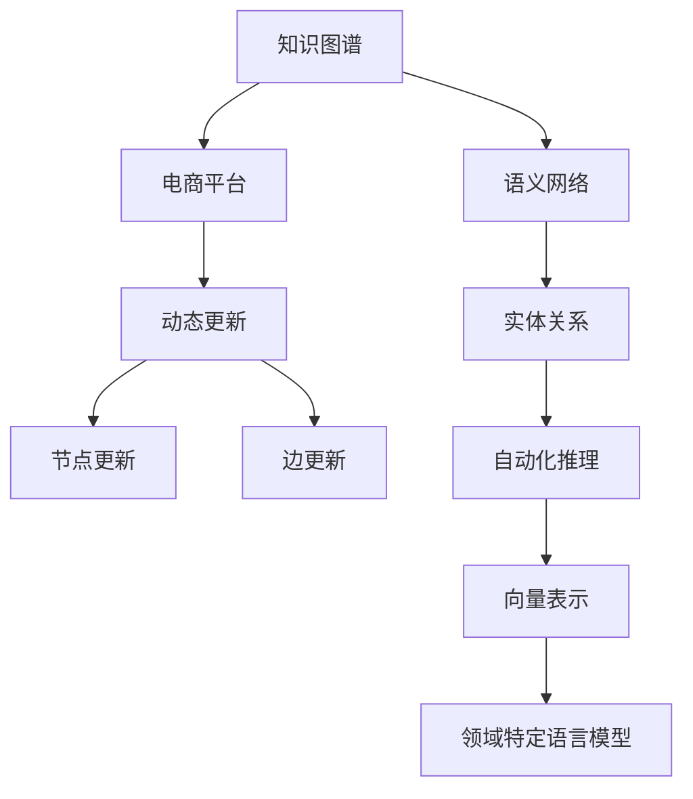

                 

# 电商平台中的商品知识图谱动态更新

> 关键词：知识图谱, 电商平台, 动态更新, 语义网络, 实体关系, 自动化推理, 向量表示, 领域特定语言模型

## 1. 背景介绍

### 1.1 问题由来
在现代电商平台上，商品信息复杂多样，如何高效地组织和管理这些信息，使消费者能够迅速找到所需商品，已成为电商平台面临的重要挑战之一。传统的商品信息管理系统多采用静态的数据存储方式，难以应对商品种类和信息的快速增长。

近年来，随着知识图谱技术的兴起，通过构建商品知识图谱，可以更好地理解商品间的复杂关系，利用深度学习和语义网络技术对商品信息进行精确建模和查询，从而极大地提升电商平台的用户体验。然而，电商平台中的商品知识图谱并不是一成不变的，需要根据业务变化和用户需求，动态地进行更新和维护。

### 1.2 问题核心关键点
知识图谱动态更新的关键在于：
- 如何在保持图谱结构稳定的基础上，高效地更新节点和边。
- 如何利用上下文信息和语义关系，自动构建和优化商品知识图谱。
- 如何确保知识图谱中的信息准确无误，符合实际情况。
- 如何高效地查询商品信息，快速响应用户需求。

本文将深入探讨电商平台中商品知识图谱的动态更新方法，从理论到实践，详细阐述其算法原理、具体操作步骤和实际应用场景。

## 2. 核心概念与联系

### 2.1 核心概念概述

为更好地理解电商平台中商品知识图谱的动态更新方法，本节将介绍几个密切相关的核心概念：

- **知识图谱**：以语义网络的形式，描述实体及其属性、关系的信息库。常见的实体包括商品、品牌、价格、评价等，通过节点和边连接形成网络。
- **电商平台**：以在线交易为核心业务，提供商品展示、购物、支付等服务的应用平台。
- **动态更新**：在业务发展和用户需求变化时，对知识图谱进行增删改操作，以保持其时效性和准确性。
- **语义网络**：通过节点和边的标签，表达实体之间的语义关系，构建精确的语义空间。
- **实体关系**：商品知识图谱中的节点（商品、品牌等）之间的关系，如商品类别、销售关系、评价等。
- **自动化推理**：通过算法自动推导出知识图谱中的隐含关系和事实，丰富图谱内容。
- **向量表示**：使用低维向量空间对实体和关系进行编码，方便计算和查询。
- **领域特定语言模型**：针对特定领域，如电商平台，设计的语言模型，用于自动生成和更新知识图谱。

这些核心概念之间的逻辑关系可以通过以下Mermaid流程图来展示：



这个流程图展示的知识图谱动态更新的核心概念及其之间的关系：

1. 知识图谱作为电商平台的核心数据结构，在动态更新的推动下，能够适应业务变化和用户需求。
2. 电商平台的动态更新包括对节点的添加、修改、删除以及对边的更新操作。
3. 语义网络通过节点和边的标签，表达实体之间的关系，是知识图谱构建的基础。
4. 实体关系如商品类别、销售关系、评价等，是知识图谱的重要组成部分。
5. 自动化推理通过算法推导出图谱中的隐含关系和事实，增强图谱的完备性和准确性。
6. 向量表示通过低维编码，实现对实体和关系的快速计算和查询。
7. 领域特定语言模型针对电商平台的特殊需求，自动生成和更新知识图谱。

这些概念共同构成了电商平台中商品知识图谱动态更新的理论基础，使其能够有效适应不断变化的市场环境和用户需求。

## 3. 核心算法原理 & 具体操作步骤

### 3.1 算法原理概述

电商平台中商品知识图谱的动态更新，本质上是将电商平台中的商品信息转化为语义网络，通过实体关系自动推理，对图谱进行增删改，并利用向量表示和领域特定语言模型进行优化。

具体而言，其动态更新过程包括：

1. 数据采集：从电商平台的各个数据源中收集商品信息，包括商品名称、类别、价格、评价等。
2. 实体抽取与关系构建：从原始数据中抽取实体及其属性，构建商品间的语义关系。
3. 图谱增删改操作：根据业务变化和用户需求，对商品知识图谱进行节点和边添加、修改、删除操作。
4. 自动化推理：通过算法推导出图谱中的隐含关系和事实，丰富图谱内容。
5. 向量表示：将实体和关系转化为向量表示，方便查询和推理。
6. 领域特定语言模型：使用领域特定的语言模型，自动生成和更新知识图谱。

### 3.2 算法步骤详解

以下详细讲解电商平台中商品知识图谱动态更新的主要步骤：

**Step 1: 数据采集**
- 从电商平台的订单、评论、搜索日志等数据源中，抽取商品名称、类别、价格、评价等信息。
- 利用数据清洗和预处理技术，去除噪声数据，保证数据的准确性和完整性。

**Step 2: 实体抽取与关系构建**
- 对采集的数据进行实体抽取，识别商品名称、类别、品牌、价格等关键信息。
- 利用自然语言处理技术，自动构建商品间的语义关系，如类别关系、销售关系、评价关系等。

**Step 3: 图谱增删改操作**
- 根据业务变化和用户需求，对商品知识图谱进行增删改操作。如添加新商品、修改商品类别、删除过时商品等。
- 使用图数据库或知识图谱管理工具，实现高效的图谱操作。

**Step 4: 自动化推理**
- 利用自动化推理算法，推导出图谱中的隐含关系和事实，丰富图谱内容。如根据商品类别自动生成子类别关系，根据销售关系自动生成供应链关系等。
- 常用的自动化推理算法包括基于规则的推理、基于图神经网络的推理等。

**Step 5: 向量表示**
- 将实体和关系转化为低维向量表示，方便查询和推理。
- 常用的向量表示方法包括基于嵌入的方法、基于图神经网络的方法等。

**Step 6: 领域特定语言模型**
- 使用领域特定的语言模型，自动生成和更新知识图谱。
- 常用的领域特定语言模型包括BERT、GPT等，需根据电商平台的具体需求进行模型选择和训练。

### 3.3 算法优缺点

电商平台中商品知识图谱的动态更新，具有以下优点：

- 提高商品信息的准确性和完整性：动态更新能够实时反映商品信息的最新变化，确保图谱的时效性和准确性。
- 优化用户查询体验：利用向量表示和自动化推理技术，快速响应用户查询，提供更精准的搜索结果。
- 支持业务决策：商品知识图谱能够反映商品间的复杂关系，支持电商平台的业务决策和市场分析。

但同时也存在以下局限：

- 数据采集和处理成本较高：需要从多个数据源中抽取和清洗数据，并构建实体关系，增加了维护成本。
- 算法复杂度较高：自动化推理和向量表示等技术复杂度较高，需要较高算力和技术水平。
- 模型泛化能力不足：领域特定语言模型在特定领域效果较好，但在其他领域可能存在泛化能力不足的问题。

### 3.4 算法应用领域

商品知识图谱动态更新技术，在电商平台中得到了广泛应用，包括：

- 商品推荐系统：通过商品知识图谱，自动推导用户兴趣，推荐相关商品。
- 搜索系统：利用知识图谱中的关系和向量表示，快速响应用户查询，提供精准搜索结果。
- 广告投放：根据商品知识图谱中的关系和用户行为，优化广告投放策略，提高广告效果。
- 供应链管理：通过商品知识图谱中的关系，自动生成供应链信息，支持供应链优化和协同管理。

除了上述这些应用外，商品知识图谱动态更新技术还被创新性地应用于更多场景中，如商品分类、库存管理、数据分析等，为电商平台带来了新的业务价值和创新思路。

## 4. 数学模型和公式 & 详细讲解

### 4.1 数学模型构建

为了更好地理解商品知识图谱的动态更新方法，本节将使用数学语言对动态更新过程进行更加严格的刻画。

设电商平台中商品知识图谱为 $G=(V,E)$，其中 $V$ 为节点集合，$E$ 为边集合，$V=\{v_1, v_2, ..., v_n\}$，$E=\{e_1, e_2, ..., e_m\}$。每个节点 $v_i$ 表示一个商品实体，包含商品名称、类别、价格等信息；每条边 $e_j$ 表示商品间的语义关系，如类别关系、销售关系、评价关系等。

定义图谱的实体向量表示为 $\mathbf{v}_i$，关系向量表示为 $\mathbf{e}_j$，节点嵌入向量为 $\mathbf{v}^{\text{emb}}_i$，关系嵌入向量为 $\mathbf{e}^{\text{emb}}_j$。

商品知识图谱的动态更新过程可表示为：

1. 数据采集与预处理：$\mathcal{D} = \{(\mathbf{x}_i, \mathbf{y}_i)\}_{i=1}^N$，其中 $\mathbf{x}_i$ 为原始数据，$\mathbf{y}_i$ 为数据标注。
2. 实体抽取与关系构建：$F_1 = \{(f_i, g_i)\}_{i=1}^N$，其中 $f_i$ 为实体抽取结果，$g_i$ 为关系构建结果。
3. 图谱增删改操作：$F_2 = \{(f_i, g_i)\}_{i=1}^N$，其中 $f_i$ 为节点添加/修改/删除结果，$g_i$ 为边添加/修改/删除结果。
4. 自动化推理：$F_3 = \{(f_i, g_i)\}_{i=1}^N$，其中 $f_i$ 为推理结果，$g_i$ 为关系生成结果。
5. 向量表示：$F_4 = \{(\mathbf{v}_i, \mathbf{e}_j)\}_{i=1}^n$，其中 $\mathbf{v}_i$ 为节点向量表示，$\mathbf{e}_j$ 为关系向量表示。
6. 领域特定语言模型：$F_5 = \{(\mathbf{v}_i, \mathbf{e}_j)\}_{i=1}^n$，其中 $\mathbf{v}_i$ 为节点向量表示，$\mathbf{e}_j$ 为关系向量表示。

### 4.2 公式推导过程

以下我们以商品推荐系统为例，推导向量表示和领域特定语言模型在推荐系统中的应用。

假设推荐系统包含 $N$ 个用户和 $M$ 个商品，每个用户 $u_i$ 和每个商品 $v_j$ 都有一个向量表示 $\mathbf{u}_i$ 和 $\mathbf{v}_j$。根据用户的浏览、点击、购买历史，利用领域特定语言模型生成商品知识图谱。在图谱中，用户 $u_i$ 与商品 $v_j$ 之间的关系表示为 $\mathbf{e}_{u_j v_j}$，其中 $\mathbf{e}_{u_j v_j} = \mathbf{v}_j + \mathbf{u}_i \times \mathbf{W}$，$\mathbf{W}$ 为可学习参数矩阵。

推荐系统根据用户 $u_i$ 和商品 $v_j$ 的向量表示，计算相似度 $s_{u_i v_j} = \mathbf{u}_i \cdot \mathbf{v}_j$，选择相似度最高的商品进行推荐。

将上述过程用公式表示：

$$
\begin{align*}
\mathbf{v}_{u_i} &= \mathbf{u}_i \times \mathbf{W} \\
\mathbf{v}_{v_j} &= \mathbf{v}_j + \mathbf{u}_i \times \mathbf{W} \\
s_{u_i v_j} &= \mathbf{u}_i \cdot \mathbf{v}_{v_j}
\end{align*}
$$

其中，$\mathbf{v}_{u_i}$ 表示用户 $u_i$ 的向量表示，$\mathbf{v}_{v_j}$ 表示商品 $v_j$ 的向量表示，$s_{u_i v_j}$ 表示用户 $u_i$ 和商品 $v_j$ 的相似度。

在实际推荐系统中，还需要考虑用户间的冷启动问题，即新用户或新商品的向量表示难以获取。此时可以通过基于近邻的推荐方法，根据与用户 $u_i$ 或商品 $v_j$ 相似的已知用户或商品向量，计算推荐结果。

### 4.3 案例分析与讲解

以下我们以智能客服系统为例，展示商品知识图谱动态更新技术在智能客服中的应用。

假设智能客服系统包含 $N$ 个用户和 $M$ 个商品，每个用户 $u_i$ 和每个商品 $v_j$ 都有一个向量表示 $\mathbf{u}_i$ 和 $\mathbf{v}_j$。根据用户的查询历史，利用领域特定语言模型生成商品知识图谱。在图谱中，用户 $u_i$ 与商品 $v_j$ 之间的关系表示为 $\mathbf{e}_{u_j v_j}$，其中 $\mathbf{e}_{u_j v_j} = \mathbf{v}_j + \mathbf{u}_i \times \mathbf{W}$，$\mathbf{W}$ 为可学习参数矩阵。

智能客服系统根据用户 $u_i$ 和商品 $v_j$ 的向量表示，计算相似度 $s_{u_i v_j} = \mathbf{u}_i \cdot \mathbf{v}_{v_j}$，选择相似度最高的商品进行回复。

在实际应用中，智能客服系统还需考虑多轮对话的信息整合和上下文理解。利用知识图谱中的关系和向量表示，智能客服系统能够更好地理解用户意图，生成更精准的回复。

例如，用户在客服系统中输入 "我需要一件 T 恤"，系统根据用户之前的购买历史和浏览记录，自动构建商品知识图谱，从图谱中查询出与 T 恤相关的商品信息，并自动生成推荐和回复。

## 5. 项目实践：代码实例和详细解释说明

### 5.1 开发环境搭建

在进行商品知识图谱动态更新实践前，我们需要准备好开发环境。以下是使用Python进行PyTorch开发的环境配置流程：

1. 安装Anaconda：从官网下载并安装Anaconda，用于创建独立的Python环境。

2. 创建并激活虚拟环境：
```bash
conda create -n pytorch-env python=3.8 
conda activate pytorch-env
```

3. 安装PyTorch：根据CUDA版本，从官网获取对应的安装命令。例如：
```bash
conda install pytorch torchvision torchaudio cudatoolkit=11.1 -c pytorch -c conda-forge
```

4. 安装TensorFlow：
```bash
pip install tensorflow==2.7
```

5. 安装各类工具包：
```bash
pip install numpy pandas scikit-learn matplotlib tqdm jupyter notebook ipython
```

完成上述步骤后，即可在`pytorch-env`环境中开始商品知识图谱动态更新的实践。

### 5.2 源代码详细实现

下面我们以智能客服系统为例，给出使用PyTorch对商品知识图谱进行动态更新的PyTorch代码实现。

首先，定义用户和商品的向量表示类：

```python
class UserEmbedding:
    def __init__(self, embed_dim):
        self.embedding = nn.Embedding(num_users, embed_dim)

    def forward(self, user_ids):
        return self.embedding(user_ids)

class ItemEmbedding:
    def __init__(self, embed_dim):
        self.embedding = nn.Embedding(num_items, embed_dim)

    def forward(self, item_ids):
        return self.embedding(item_ids)
```

然后，定义商品关系向量表示类：

```python
class ItemRelationEmbedding:
    def __init__(self, embed_dim):
        self.weight_matrix = nn.Linear(embed_dim * 2, embed_dim)

    def forward(self, user_embeddings, item_embeddings):
        user_item_vectors = torch.cat((user_embeddings, item_embeddings), dim=1)
        relation_vectors = self.weight_matrix(user_item_vectors)
        return relation_vectors
```

接着，定义推荐系统模型：

```python
class RecommendationModel(nn.Module):
    def __init__(self, user_dim, item_dim, relation_dim):
        super(RecommendationModel, self).__init__()
        self.user_embeddings = UserEmbedding(user_dim)
        self.item_embeddings = ItemEmbedding(item_dim)
        self.item_relation_embeddings = ItemRelationEmbedding(relation_dim)

    def forward(self, user_ids, item_ids):
        user_embeddings = self.user_embeddings(user_ids)
        item_embeddings = self.item_embeddings(item_ids)
        relation_vectors = self.item_relation_embeddings(user_embeddings, item_embeddings)
        scores = torch.matmul(user_embeddings, relation_vectors.t())
        return scores
```

最后，定义推荐系统训练函数：

```python
def train_model(model, train_loader, optimizer):
    model.train()
    for batch in train_loader:
        user_ids, item_ids, labels = batch
        optimizer.zero_grad()
        scores = model(user_ids, item_ids)
        loss = nn.BCELoss()(scores, labels)
        loss.backward()
        optimizer.step()
    return loss
```

在实际应用中，还需要考虑商品知识图谱的构建和更新。可以使用图数据库如Neo4j或图神经网络方法，如GraphSAGE、GAT等，构建和更新商品知识图谱。

### 5.3 代码解读与分析

让我们再详细解读一下关键代码的实现细节：

**UserEmbedding类**：
- `__init__`方法：初始化用户向量表示矩阵，使用`nn.Embedding`定义。
- `forward`方法：根据输入的用户ID，计算用户向量表示。

**ItemEmbedding类**：
- `__init__`方法：初始化商品向量表示矩阵，使用`nn.Embedding`定义。
- `forward`方法：根据输入的商品ID，计算商品向量表示。

**ItemRelationEmbedding类**：
- `__init__`方法：初始化关系向量表示矩阵，使用`nn.Linear`定义。
- `forward`方法：根据用户和商品的向量表示，计算关系向量表示。

**RecommendationModel类**：
- `__init__`方法：定义推荐系统模型，包括用户嵌入层、商品嵌入层和关系嵌入层。
- `forward`方法：根据用户和商品的向量表示，计算推荐分数。

**train_model函数**：
- `train_model`函数：根据训练数据，训练推荐系统模型。

在实际应用中，还需要考虑商品知识图谱的构建和更新。可以使用图数据库如Neo4j或图神经网络方法，如GraphSAGE、GAT等，构建和更新商品知识图谱。

### 5.4 运行结果展示

在训练结束后，可以通过以下代码评估推荐系统的性能：

```python
def evaluate_model(model, test_loader):
    model.eval()
    all_scores = []
    all_labels = []
    for batch in test_loader:
        user_ids, item_ids, labels = batch
        with torch.no_grad():
            scores = model(user_ids, item_ids)
        all_scores.append(scores.numpy())
        all_labels.append(labels.numpy())
    all_scores = np.concatenate(all_scores, axis=0)
    all_labels = np.concatenate(all_labels, axis=0)
    accuracy = np.mean((np.round(all_scores) == all_labels).astype(int))
    return accuracy
```

在测试集上评估推荐系统的性能，输出准确率等指标。

## 6. 实际应用场景

### 6.1 智能客服系统

商品知识图谱动态更新技术在智能客服系统中得到了广泛应用。智能客服系统能够自动构建和更新商品知识图谱，根据用户的查询历史和意图，自动推荐相关商品，生成精准回复，提升客户体验。

在技术实现上，可以收集用户的历史查询记录和购买历史，利用领域特定语言模型自动生成商品知识图谱。在图谱中，自动推导用户与商品的关系，并根据这些关系，自动推荐商品和生成回复。例如，用户输入 "我需要一件 T 恤"，智能客服系统自动构建商品知识图谱，从图谱中查询出与 T 恤相关的商品信息，并自动生成推荐和回复。

### 6.2 商品推荐系统

商品推荐系统是电商平台的核心功能之一。利用商品知识图谱动态更新技术，推荐系统能够实时更新商品信息，自动推导商品间的语义关系，生成更精准的推荐结果。

在技术实现上，可以定期收集用户浏览、点击、购买历史等数据，利用领域特定语言模型自动生成商品知识图谱。在图谱中，自动推导用户与商品的关系，并根据这些关系，生成推荐结果。例如，根据用户的历史行为，推荐可能感兴趣的商品，提升用户购物体验。

### 6.3 广告投放系统

广告投放系统需要根据用户行为和商品信息，优化广告投放策略，提升广告效果。利用商品知识图谱动态更新技术，广告投放系统能够实时更新商品信息，自动推导商品间的语义关系，优化广告投放策略。

在技术实现上，可以定期收集用户浏览、点击、购买历史等数据，利用领域特定语言模型自动生成商品知识图谱。在图谱中，自动推导商品间的语义关系，并根据这些关系，优化广告投放策略。例如，根据用户的行为，推荐相关商品广告，提升广告效果。

### 6.4 未来应用展望

随着电商平台的不断发展，商品知识图谱动态更新技术将得到更广泛的应用，为电商平台带来更多新的业务价值。

在智慧零售领域，商品知识图谱动态更新技术将帮助零售商更精准地了解消费者需求，优化商品展示和推荐，提升零售效率。

在供应链管理中，商品知识图谱动态更新技术将帮助供应链企业更准确地了解商品间的供需关系，优化供应链管理，降低成本，提高效率。

在智能制造领域，商品知识图谱动态更新技术将帮助制造商更精确地了解市场需求，优化生产计划和库存管理，提升生产效率。

除了上述这些应用外，商品知识图谱动态更新技术还将被创新性地应用于更多场景中，如智能物流、智能客服、智能分析等，为电商平台带来新的业务价值和创新思路。

## 7. 工具和资源推荐

### 7.1 学习资源推荐

为了帮助开发者系统掌握商品知识图谱动态更新的理论基础和实践技巧，这里推荐一些优质的学习资源：

1. 《Knowledge Graphs for Recommendation Systems》书籍：全面介绍了知识图谱在推荐系统中的应用，包括理论基础和实践方法。

2. 《Practical Recommendation Engines with PyTorch》书籍：详细讲解了基于深度学习的推荐系统开发，包括商品知识图谱构建和更新。

3. 《PyTorch Lightning》教程：学习使用PyTorch进行模型训练和优化，了解推荐系统开发的工具和技术。

4. 《Neo4j Graph Database》官方文档：学习使用Neo4j进行图数据库的构建和查询，了解商品知识图谱的存储和管理。

5. 《TensorFlow Tutorial》：学习使用TensorFlow进行深度学习开发，了解推荐系统开发的工具和技术。

通过对这些资源的学习实践，相信你一定能够快速掌握商品知识图谱动态更新的精髓，并用于解决实际的电商问题。

### 7.2 开发工具推荐

高效的开发离不开优秀的工具支持。以下是几款用于商品知识图谱动态更新开发的常用工具：

1. PyTorch：基于Python的开源深度学习框架，灵活动态的计算图，适合快速迭代研究。大部分预训练语言模型都有PyTorch版本的实现。

2. TensorFlow：由Google主导开发的开源深度学习框架，生产部署方便，适合大规模工程应用。同样有丰富的预训练语言模型资源。

3. Neo4j：领先的图数据库管理系统，支持高效的图数据库构建和查询，适合商品知识图谱的存储和管理。

4. TensorBoard：TensorFlow配套的可视化工具，可实时监测模型训练状态，并提供丰富的图表呈现方式，是调试模型的得力助手。

5. Jupyter Notebook：交互式编程环境，适合数据探索和模型实验，方便开发者快速迭代和验证算法。

合理利用这些工具，可以显著提升商品知识图谱动态更新的开发效率，加快创新迭代的步伐。

### 7.3 相关论文推荐

商品知识图谱动态更新技术的发展源于学界的持续研究。以下是几篇奠基性的相关论文，推荐阅读：

1. "Knowledge-aware Recommender Systems: A Survey"：对知识图谱在推荐系统中的应用进行了全面的综述，提供了丰富的理论基础和实践方法。

2. "Neo4j Graph Database"：Neo4j公司推出的图数据库管理工具，详细介绍图数据库的构建和查询方法。

3. "Semantic Recommendation with Knowledge Graphs"：使用知识图谱进行推荐系统的研究，探讨了如何利用图谱中的语义信息提升推荐效果。

4. "Graph Neural Networks for Recommendation Systems"：利用图神经网络进行推荐系统开发，介绍了图神经网络的构建和优化方法。

5. "Deep Learning for Recommendation Systems"：利用深度学习技术进行推荐系统开发，介绍了常用的深度学习模型和算法。

这些论文代表了大语言模型微调技术的发展脉络。通过学习这些前沿成果，可以帮助研究者把握学科前进方向，激发更多的创新灵感。

## 8. 总结：未来发展趋势与挑战

### 8.1 总结

本文对电商平台中商品知识图谱的动态更新方法进行了全面系统的介绍。首先阐述了商品知识图谱动态更新的背景和意义，明确了动态更新在提升商品信息准确性和用户体验方面的重要价值。其次，从原理到实践，详细讲解了商品知识图谱动态更新的算法原理、具体操作步骤和实际应用场景。最后，本文还广泛探讨了商品知识图谱动态更新技术在电商领域的广泛应用，展示了其巨大潜力。

通过本文的系统梳理，可以看到，商品知识图谱动态更新技术已经成为电商平台的重要支柱，极大地提升了商品信息的管理和利用效率，为用户带来了更好的购物体验。未来，伴随技术的持续演进，商品知识图谱动态更新必将在电商平台中得到更广泛的应用，进一步推动电商平台的智能化发展。

### 8.2 未来发展趋势

展望未来，商品知识图谱动态更新技术将呈现以下几个发展趋势：

1. 技术更加成熟：随着深度学习和大数据技术的进步，商品知识图谱动态更新技术将更加高效、精准，能够更好地反映商品信息的真实情况。

2. 自动化程度提高：利用自动化推理和图神经网络等技术，商品知识图谱的构建和更新将更加自动化，减少人工干预，提高效率。

3. 应用领域拓展：商品知识图谱动态更新技术将不仅仅应用于电商平台，还将拓展到智能制造、智慧零售、智能物流等多个领域，带来新的业务价值和创新思路。

4. 用户体验提升：商品知识图谱动态更新技术将帮助电商平台更好地理解用户需求，优化商品推荐和广告投放策略，提升用户购物体验。

5. 数据融合增强：商品知识图谱将与其他数据源（如社交网络、物联网等）进行融合，提供更全面的数据支持，提升电商平台的智能化水平。

6. 伦理和安全问题重视：随着商品知识图谱的广泛应用，如何保护用户隐私、避免数据滥用等伦理和安全问题，将成为重要研究方向。

以上趋势凸显了商品知识图谱动态更新技术的广阔前景。这些方向的探索发展，必将进一步提升电商平台的用户体验，推动电商平台的智能化发展。

### 8.3 面临的挑战

尽管商品知识图谱动态更新技术已经取得了瞩目成就，但在迈向更加智能化、普适化应用的过程中，它仍面临着诸多挑战：

1. 数据采集和处理成本较高：需要从多个数据源中抽取和清洗数据，并构建实体关系，增加了维护成本。

2. 算法复杂度较高：自动化推理和图神经网络等技术复杂度较高，需要较高算力和技术水平。

3. 模型泛化能力不足：领域特定语言模型在特定领域效果较好，但在其他领域可能存在泛化能力不足的问题。

4. 用户隐私保护：商品知识图谱中的用户数据隐私保护是一个重要问题，如何在保护隐私的前提下，充分利用数据价值，是亟待解决的难题。

5. 技术标准化问题：商品知识图谱的构建和更新缺乏统一标准，不同平台间的知识图谱互操作性较差，亟需标准化技术框架。

6. 数据和模型融合：如何更好地将商品知识图谱与外部数据源、领域特定语言模型进行融合，提高图谱的时效性和准确性，是技术演进的关键。

这些挑战凸显了商品知识图谱动态更新技术的发展瓶颈，亟需进一步的技术突破和标准化工作。相信随着学界和产业界的共同努力，这些挑战终将一一被克服，商品知识图谱动态更新必将在电商领域大放异彩。

### 8.4 研究展望

面对商品知识图谱动态更新所面临的挑战，未来的研究需要在以下几个方面寻求新的突破：

1. 探索无监督和半监督知识图谱更新方法：摆脱对大规模标注数据的依赖，利用自监督学习、主动学习等方法，最大化利用非结构化数据，实现知识图谱的动态更新。

2. 研究高效的商品知识图谱构建和更新算法：开发更高效、更智能的图谱构建和更新算法，减少人工干预，提高自动化程度。

3. 融合多种数据源和模型，提升知识图谱的时效性和准确性：将商品知识图谱与其他数据源（如社交网络、物联网等）进行融合，利用多模态信息提升图谱的时效性和准确性。

4. 加强用户隐私保护，建立数据治理机制：加强用户隐私保护，建立数据治理机制，确保数据使用合规和安全。

5. 开发标准化技术框架，实现图谱互操作性：制定商品知识图谱的标准化技术框架，实现不同平台间的图谱互操作性。

6. 引入伦理和安全约束，构建可信的知识图谱系统：引入伦理和安全约束，构建可信的知识图谱系统，确保图谱的使用符合伦理和社会规范。

这些研究方向的探索，必将引领商品知识图谱动态更新技术迈向更高的台阶，为电商平台带来新的业务价值和创新思路。面向未来，商品知识图谱动态更新技术还需要与其他人工智能技术进行更深入的融合，如知识表示、因果推理、强化学习等，多路径协同发力，共同推动商品知识图谱的进步。只有勇于创新、敢于突破，才能不断拓展知识图谱的边界，让电商平台迈向智能化新高度。

## 9. 附录：常见问题与解答

**Q1：商品知识图谱动态更新对电商平台的价值是什么？**

A: 商品知识图谱动态更新技术在电商平台的价值主要体现在以下几个方面：
1. 提高商品信息的准确性和完整性：动态更新能够实时反映商品信息的最新变化，确保图谱的时效性和准确性。
2. 优化用户查询体验：利用向量表示和自动化推理技术，快速响应用户查询，提供更精准的搜索结果。
3. 支持业务决策：商品知识图谱能够反映商品间的复杂关系，支持电商平台的业务决策和市场分析。

**Q2：如何进行商品知识图谱的构建和更新？**

A: 商品知识图谱的构建和更新主要分为以下几个步骤：
1. 数据采集：从电商平台的各个数据源中收集商品信息，包括商品名称、类别、价格、评价等。
2. 实体抽取与关系构建：从原始数据中抽取实体及其属性，构建商品间的语义关系。
3. 图谱增删改操作：根据业务变化和用户需求，对商品知识图谱进行节点和边添加、修改、删除操作。
4. 自动化推理：利用自动化推理算法，推导出图谱中的隐含关系和事实，丰富图谱内容。
5. 向量表示：将实体和关系转化为低维向量表示，方便查询和推理。
6. 领域特定语言模型：使用领域特定的语言模型，自动生成和更新知识图谱。

**Q3：如何保护用户隐私？**

A: 保护用户隐私是商品知识图谱动态更新的重要问题，以下是几种常见的保护方法：
1. 数据匿名化：对原始数据进行匿名化处理，去除敏感信息，保护用户隐私。
2. 数据加密：对数据进行加密存储和传输，确保数据安全。
3. 访问控制：设置严格的访问权限，确保只有授权用户能够访问和使用数据。
4. 隐私保护算法：使用隐私保护算法，如差分隐私、同态加密等，保护用户隐私。

这些方法可以有效保护用户隐私，确保数据安全。

**Q4：商品知识图谱动态更新面临哪些挑战？**

A: 商品知识图谱动态更新面临以下挑战：
1. 数据采集和处理成本较高：需要从多个数据源中抽取和清洗数据，并构建实体关系，增加了维护成本。
2. 算法复杂度较高：自动化推理和图神经网络等技术复杂度较高，需要较高算力和技术水平。
3. 模型泛化能力不足：领域特定语言模型在特定领域效果较好，但在其他领域可能存在泛化能力不足的问题。
4. 用户隐私保护：商品知识图谱中的用户数据隐私保护是一个重要问题，如何在保护隐私的前提下，充分利用数据价值，是亟待解决的难题。
5. 技术标准化问题：商品知识图谱的构建和更新缺乏统一标准，不同平台间的知识图谱互操作性较差，亟需标准化技术框架。
6. 数据和模型融合：如何更好地将商品知识图谱与外部数据源、领域特定语言模型进行融合，提高图谱的时效性和准确性，是技术演进的关键。

这些挑战凸显了商品知识图谱动态更新技术的发展瓶颈，亟需进一步的技术突破和标准化工作。

**Q5：如何提高商品知识图谱的查询效率？**

A: 提高商品知识图谱的查询效率，可以采取以下方法：
1. 构建高效的数据结构：使用图数据库或图神经网络等高效数据结构，存储和查询商品知识图谱。
2. 优化查询算法：使用高效查询算法，如基于邻接表的查询、基于图神经网络的查询等，提高查询效率。
3. 分布式查询：利用分布式计算框架，将查询任务分解为多个子任务，并行执行，提高查询效率。

通过这些方法，可以有效提高商品知识图谱的查询效率，提升用户体验。

