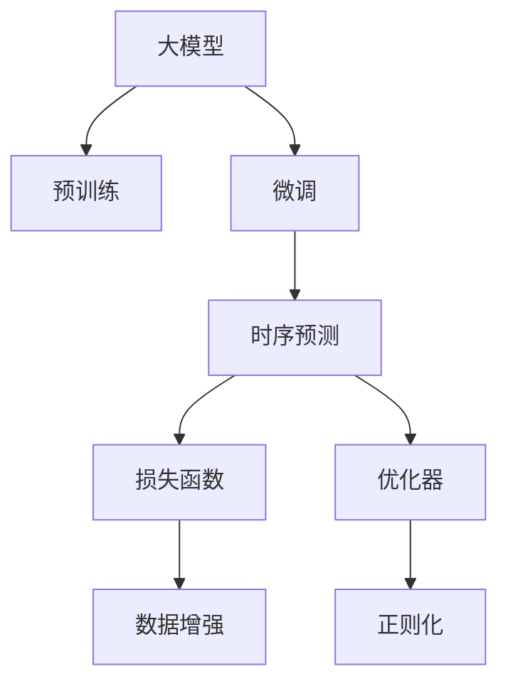

                 

# 电商平台中的时序预测：AI大模型的优势

## 1. 背景介绍

### 1.1 问题由来

在现代电商平台上，时序预测问题无处不在。例如，预测商品销量、预测用户行为、预测库存水平、预测物流运输情况等。这些预测问题直接影响到电商平台的运营决策，如库存管理、定价策略、推荐系统、广告投放等。因此，构建高效的预测模型，对于电商平台至关重要。

传统的预测方法往往依赖于人工特征工程和模型调优，需要大量的人工干预和调试。而在人工智能大模型普及的背景下，利用预训练模型进行微调，可以直接从数据中提取特征，提升预测模型的性能和泛化能力，有效减少人工干预和调参的复杂度。

### 1.2 问题核心关键点

当前，基于深度学习的大模型在时序预测领域已经展现了强大的应用潜力。其核心优势包括：

- **特征提取能力强**：大模型通过预训练可以学习到丰富的特征表示，能够自动识别、提取输入数据中的有用信息。
- **泛化能力强**：由于大模型在大规模数据上进行预训练，具备较强的泛化能力，能够在新数据上表现出色。
- **参数高效利用**：通过微调技术，大模型只需调整少量顶层参数，即可适应特定任务，参数利用效率高。
- **模型灵活性高**：大模型可以根据不同的预测任务，灵活地适配各类任务目标，适应性广。
- **可解释性强**：大模型提供了模型输出和特征重要性的解释，有助于理解模型行为，便于调试和优化。

本文将详细探讨如何利用大模型进行电商平台的预测任务，并阐述大模型在时序预测中的优势。

## 2. 核心概念与联系

### 2.1 核心概念概述

为更好地理解大模型在电商时序预测中的应用，本节将介绍几个密切相关的核心概念：

- 大模型(Large Model)：如GPT、BERT、Transformer等，通过在大规模数据上进行预训练，学习到通用或特定领域的特征表示。
- 预训练(Pre-training)：在大规模无标注数据上，利用自监督任务训练大模型，学习通用特征表示。
- 微调(Fine-tuning)：在大模型的基础上，使用特定任务的数据集进行有监督训练，优化模型在该任务上的性能。
- 时序预测(Time Series Prediction)：预测给定时间序列的未来值，如销量预测、库存预测、需求预测等。
- 损失函数(Loss Function)：用于衡量模型预测值与真实值之间的差距，如均方误差(MSE)、交叉熵(Cross-Entropy)等。
- 优化器(Optimizer)：用于更新模型参数，以最小化损失函数，如Adam、SGD等。
- 数据增强(Data Augmentation)：通过生成新样本，扩大训练集，提高模型泛化能力。
- 正则化(Regularization)：如L2正则、Dropout等，防止模型过拟合。

这些核心概念之间的逻辑关系可以通过以下Mermaid流程图来展示：



这个流程图展示了大模型、预训练、微调、时序预测等核心概念的逻辑关系。

## 3. 核心算法原理 & 具体操作步骤

### 3.1 算法原理概述

时序预测的核心是利用历史数据，预测未来某一时间点或时间段的状态。对于电商平台的预测问题，可以将其分为两大类：

1. **单步预测**：预测未来某一时间点的值，如单日销量预测。
2. **多步预测**：预测未来某一时间段内的值，如未来一周的销量预测。

在大模型进行时序预测时，主要分为以下几个步骤：

1. 准备预训练模型和数据集。
2. 设计合适的损失函数。
3. 设置微调超参数。
4. 执行梯度训练。
5. 测试和评估模型。

### 3.2 算法步骤详解

#### 3.2.1 准备预训练模型和数据集

选择合适的预训练模型，如BERT、GPT等，作为初始化参数。收集特定任务的标注数据集，将其划分为训练集、验证集和测试集。

#### 3.2.2 设计合适的损失函数

选择合适的损失函数，如均方误差(MSE)、交叉熵(Cross-Entropy)等，用于衡量模型预测值与真实值之间的差距。

#### 3.2.3 设置微调超参数

选择合适的优化算法及其参数，如Adam、SGD等，设置学习率、批大小、迭代轮数等。设置正则化技术及强度，包括权重衰减、Dropout、Early Stopping等。

#### 3.2.4 执行梯度训练

将训练集数据分批次输入模型，前向传播计算损失函数。反向传播计算参数梯度，根据设定的优化算法和学习率更新模型参数。周期性在验证集上评估模型性能，根据性能指标决定是否触发Early Stopping。重复上述步骤直到满足预设的迭代轮数或Early Stopping条件。

#### 3.2.5 测试和评估模型

在测试集上评估微调后模型，对比微调前后的精度提升。

### 3.3 算法优缺点

#### 3.3.1 优点

大模型进行时序预测的优势在于：

1. **自动特征提取**：大模型可以通过预训练学习到丰富的特征表示，自动提取输入数据的有用信息，减少人工特征工程的复杂度。
2. **泛化能力强**：由于大模型在大规模数据上进行预训练，具备较强的泛化能力，能够在新数据上表现出色。
3. **参数高效利用**：通过微调技术，大模型只需调整少量顶层参数，即可适应特定任务，参数利用效率高。
4. **模型灵活性高**：大模型可以根据不同的预测任务，灵活地适配各类任务目标，适应性广。
5. **可解释性强**：大模型提供了模型输出和特征重要性的解释，有助于理解模型行为，便于调试和优化。

#### 3.3.2 缺点

尽管大模型在时序预测中具有诸多优势，但也存在一些局限：

1. **模型大、资源占用高**：大模型的参数量较大，需要较高的计算资源和存储空间。
2. **训练时间长**：大模型需要较长的训练时间，特别是在大规模数据集上训练时。
3. **模型复杂性高**：大模型的结构和训练过程较为复杂，需要较深入的机器学习知识。
4. **解释性不足**：大模型往往是"黑盒"模型，难以解释其内部工作机制和决策逻辑。
5. **高昂的标注成本**：时序预测问题通常需要大量的标注数据，标注成本较高。

尽管存在这些局限，但大模型在时序预测领域仍展现出强大的应用潜力，其优势远大于其缺点。

### 3.4 算法应用领域

大模型进行时序预测的应用领域非常广泛，包括但不限于：

- **电商销量预测**：预测未来某一时间段内的商品销量，用于库存管理、促销策略等。
- **用户行为预测**：预测用户的购买行为、流失概率等，用于个性化推荐、用户留存策略等。
- **物流运输预测**：预测物流运输的时间、路径等，用于优化物流调度、提高配送效率。
- **库存水平预测**：预测未来库存水平，用于库存管理和补货策略。
- **广告投放预测**：预测广告投放的效果，用于优化广告投放策略。

## 4. 数学模型和公式 & 详细讲解 & 举例说明

### 4.1 数学模型构建

大模型进行时序预测的数学模型构建主要包括以下几个步骤：

1. **数据预处理**：对输入数据进行归一化、特征工程等预处理。
2. **模型定义**：定义大模型的结构，如Transformer、RNN等。
3. **损失函数**：选择适合时序预测任务的损失函数，如均方误差(MSE)、交叉熵(Cross-Entropy)等。
4. **模型训练**：使用优化器更新模型参数，最小化损失函数。

### 4.2 公式推导过程

以单步预测为例，假设我们要预测下一时间步$t+1$的输出$y_{t+1}$，输入为$x_t$，模型为$M_{\theta}$，损失函数为$L$，优化器为$Opt$。训练过程如下：

1. **数据预处理**：
   $$
   x_t = (x_{t-1}, x_{t-2}, ..., x_0)
   $$

2. **模型定义**：
   $$
   y_{t+1} = M_{\theta}(x_t)
   $$

3. **损失函数**：
   $$
   L = L(y_{t+1}, y_{t+1}^*)
   $$

4. **模型训练**：
   $$
   \theta = Opt(L, M_{\theta})
   $$

其中$y_{t+1}^*$为真实标签，$Opt$为优化器，$L$为损失函数，$\theta$为模型参数。

### 4.3 案例分析与讲解

以电商平台的用户行为预测为例，假设我们要预测用户的购买概率。输入为用户的浏览历史、收藏记录、购买记录等，模型为预训练的Transformer模型，损失函数为交叉熵损失函数，优化器为AdamW。

训练过程如下：

1. **数据预处理**：
   $$
   x_t = [browsing_history, favorite_products, purchased_products]
   $$

2. **模型定义**：
   $$
   probability = M_{\theta}(x_t)
   $$

3. **损失函数**：
   $$
   L = CE(probability, label)
   $$

4. **模型训练**：
   $$
   \theta = AdamW(L, M_{\theta})
   $$

其中$label$为用户购买记录，$CE$为交叉熵损失函数，$probability$为模型预测的用户购买概率。

## 5. 项目实践：代码实例和详细解释说明

### 5.1 开发环境搭建

在进行时序预测实践前，我们需要准备好开发环境。以下是使用Python进行PyTorch开发的环境配置流程：

1. 安装Anaconda：从官网下载并安装Anaconda，用于创建独立的Python环境。

2. 创建并激活虚拟环境：
   ```bash
   conda create -n pytorch-env python=3.8 
   conda activate pytorch-env
   ```

3. 安装PyTorch：根据CUDA版本，从官网获取对应的安装命令。例如：
   ```bash
   conda install pytorch torchvision torchaudio cudatoolkit=11.1 -c pytorch -c conda-forge
   ```

4. 安装Transformers库：
   ```bash
   pip install transformers
   ```

5. 安装各类工具包：
   ```bash
   pip install numpy pandas scikit-learn matplotlib tqdm jupyter notebook ipython
   ```

完成上述步骤后，即可在`pytorch-env`环境中开始时序预测实践。

### 5.2 源代码详细实现

这里我们以用户行为预测为例，给出使用Transformers库对预训练模型进行微调的PyTorch代码实现。

首先，定义数据处理函数：

```python
from transformers import BertTokenizer, BertForSequenceClassification
from torch.utils.data import Dataset
import torch

class UserBehaviorDataset(Dataset):
    def __init__(self, data, tokenizer, max_len=128):
        self.data = data
        self.tokenizer = tokenizer
        self.max_len = max_len
        
    def __len__(self):
        return len(self.data)
    
    def __getitem__(self, item):
        row = self.data[item]
        
        text = row['browsing_history'] + row['favorite_products'] + row['purchased_products']
        labels = row['label']
        
        encoding = self.tokenizer(text, return_tensors='pt', max_length=self.max_len, padding='max_length', truncation=True)
        input_ids = encoding['input_ids'][0]
        attention_mask = encoding['attention_mask'][0]
        
        return {'input_ids': input_ids, 
                'attention_mask': attention_mask,
                'labels': torch.tensor(labels, dtype=torch.long)}
```

然后，定义模型和优化器：

```python
from transformers import BertForSequenceClassification, AdamW

model = BertForSequenceClassification.from_pretrained('bert-base-cased', num_labels=2)

optimizer = AdamW(model.parameters(), lr=2e-5)
```

接着，定义训练和评估函数：

```python
from torch.utils.data import DataLoader
from tqdm import tqdm
from sklearn.metrics import classification_report

device = torch.device('cuda') if torch.cuda.is_available() else torch.device('cpu')
model.to(device)

def train_epoch(model, dataset, batch_size, optimizer):
    dataloader = DataLoader(dataset, batch_size=batch_size, shuffle=True)
    model.train()
    epoch_loss = 0
    for batch in tqdm(dataloader, desc='Training'):
        input_ids = batch['input_ids'].to(device)
        attention_mask = batch['attention_mask'].to(device)
        labels = batch['labels'].to(device)
        model.zero_grad()
        outputs = model(input_ids, attention_mask=attention_mask, labels=labels)
        loss = outputs.loss
        epoch_loss += loss.item()
        loss.backward()
        optimizer.step()
    return epoch_loss / len(dataloader)

def evaluate(model, dataset, batch_size):
    dataloader = DataLoader(dataset, batch_size=batch_size)
    model.eval()
    preds, labels = [], []
    with torch.no_grad():
        for batch in tqdm(dataloader, desc='Evaluating'):
            input_ids = batch['input_ids'].to(device)
            attention_mask = batch['attention_mask'].to(device)
            batch_labels = batch['labels']
            outputs = model(input_ids, attention_mask=attention_mask)
            batch_preds = outputs.logits.argmax(dim=2).to('cpu').tolist()
            batch_labels = batch_labels.to('cpu').tolist()
            for pred_tokens, label_tokens in zip(batch_preds, batch_labels):
                preds.append(pred_tokens[:len(label_tokens)])
                labels.append(label_tokens)
                
    print(classification_report(labels, preds))
```

最后，启动训练流程并在测试集上评估：

```python
epochs = 5
batch_size = 16

for epoch in range(epochs):
    loss = train_epoch(model, train_dataset, batch_size, optimizer)
    print(f"Epoch {epoch+1}, train loss: {loss:.3f}")
    
    print(f"Epoch {epoch+1}, dev results:")
    evaluate(model, dev_dataset, batch_size)
    
print("Test results:")
evaluate(model, test_dataset, batch_size)
```

以上就是使用PyTorch对预训练模型进行用户行为预测微调的完整代码实现。可以看到，得益于Transformers库的强大封装，我们只需较少的代码就能实现复杂的预测任务。

### 5.3 代码解读与分析

让我们再详细解读一下关键代码的实现细节：

**UserBehaviorDataset类**：
- `__init__`方法：初始化数据、分词器等关键组件。
- `__len__`方法：返回数据集的样本数量。
- `__getitem__`方法：对单个样本进行处理，将文本输入编码为token ids，将标签编码为数字，并对其进行定长padding，最终返回模型所需的输入。

**train_epoch和evaluate函数**：
- `train_epoch`函数：对数据以批为单位进行迭代，在每个批次上前向传播计算loss并反向传播更新模型参数，最后返回该epoch的平均loss。
- `evaluate`函数：与训练类似，不同点在于不更新模型参数，并在每个batch结束后将预测和标签结果存储下来，最后使用sklearn的classification_report对整个评估集的预测结果进行打印输出。

**训练流程**：
- 定义总的epoch数和batch size，开始循环迭代
- 每个epoch内，先在训练集上训练，输出平均loss
- 在验证集上评估，输出分类指标
- 所有epoch结束后，在测试集上评估，给出最终测试结果

可以看到，PyTorch配合Transformers库使得预训练模型微调的代码实现变得简洁高效。开发者可以将更多精力放在数据处理、模型改进等高层逻辑上，而不必过多关注底层的实现细节。

当然，工业级的系统实现还需考虑更多因素，如模型的保存和部署、超参数的自动搜索、更灵活的任务适配层等。但核心的微调范式基本与此类似。

## 6. 实际应用场景

### 6.1 智能推荐系统

基于大模型进行时序预测，可以广泛应用于智能推荐系统中。传统推荐系统依赖于用户的历史行为数据进行推荐，无法深入理解用户的真实兴趣偏好。

使用大模型进行微调，可以更好地挖掘用户行为背后的语义信息，从而提供更精准、多样的推荐内容。例如，用户历史浏览记录中的商品描述、评论等，可以用于训练大模型，预测用户未来的购买行为。通过分析预测结果，推荐系统可以更准确地推荐用户感兴趣的商品。

### 6.2 库存管理

库存管理是电商平台的核心问题之一。预测商品未来销量，可以有效优化库存水平，避免库存积压或短缺。

通过大模型进行销量预测，可以实时监控库存水平，优化补货策略，确保库存始终处于最优状态。例如，使用大模型预测未来一周的销量，可以帮助电商平台提前制定补货计划，减少因库存不足或过剩导致的运营成本和运营风险。

### 6.3 广告投放

电商广告投放是电商平台的重要收入来源。通过预测广告投放的效果，可以有效优化广告预算的分配，提高广告投放的ROI。

使用大模型进行广告投放预测，可以预测广告的点击率、转化率等关键指标，优化广告投放策略。例如，使用大模型预测不同广告在不同时间段、不同渠道的投放效果，可以帮助电商平台选择最优的广告投放方案，最大化广告投入产出比。

### 6.4 未来应用展望

随着大模型和微调方法的不断发展，基于时序预测的技术将在更多领域得到应用，为电商平台的运营决策提供强大的支持。

在智能客服、物流调度、供应链管理等众多领域，时序预测技术也将发挥重要作用。预测客户服务时间、预测物流配送路径、预测供应链需求等，可以帮助电商平台提升运营效率，降低成本，增强客户满意度。

## 7. 工具和资源推荐

### 7.1 学习资源推荐

为了帮助开发者系统掌握大模型时序预测的理论基础和实践技巧，这里推荐一些优质的学习资源：

1. 《Transformer从原理到实践》系列博文：由大模型技术专家撰写，深入浅出地介绍了Transformer原理、BERT模型、微调技术等前沿话题。

2. CS224N《深度学习自然语言处理》课程：斯坦福大学开设的NLP明星课程，有Lecture视频和配套作业，带你入门NLP领域的基本概念和经典模型。

3. 《Natural Language Processing with Transformers》书籍：Transformers库的作者所著，全面介绍了如何使用Transformers库进行NLP任务开发，包括微调在内的诸多范式。

4. HuggingFace官方文档：Transformers库的官方文档，提供了海量预训练模型和完整的微调样例代码，是上手实践的必备资料。

5. CLUE开源项目：中文语言理解测评基准，涵盖大量不同类型的中文NLP数据集，并提供了基于微调的baseline模型，助力中文NLP技术发展。

通过对这些资源的学习实践，相信你一定能够快速掌握大模型时序预测的精髓，并用于解决实际的NLP问题。

### 7.2 开发工具推荐

高效的开发离不开优秀的工具支持。以下是几款用于大模型时序预测开发的常用工具：

1. PyTorch：基于Python的开源深度学习框架，灵活动态的计算图，适合快速迭代研究。大部分预训练语言模型都有PyTorch版本的实现。

2. TensorFlow：由Google主导开发的开源深度学习框架，生产部署方便，适合大规模工程应用。同样有丰富的预训练语言模型资源。

3. Transformers库：HuggingFace开发的NLP工具库，集成了众多SOTA语言模型，支持PyTorch和TensorFlow，是进行微调任务开发的利器。

4. Weights & Biases：模型训练的实验跟踪工具，可以记录和可视化模型训练过程中的各项指标，方便对比和调优。与主流深度学习框架无缝集成。

5. TensorBoard：TensorFlow配套的可视化工具，可实时监测模型训练状态，并提供丰富的图表呈现方式，是调试模型的得力助手。

6. Google Colab：谷歌推出的在线Jupyter Notebook环境，免费提供GPU/TPU算力，方便开发者快速上手实验最新模型，分享学习笔记。

合理利用这些工具，可以显著提升大模型时序预测任务的开发效率，加快创新迭代的步伐。

### 7.3 相关论文推荐

大模型和时序预测技术的发展源于学界的持续研究。以下是几篇奠基性的相关论文，推荐阅读：

1. Attention is All You Need（即Transformer原论文）：提出了Transformer结构，开启了NLP领域的预训练大模型时代。

2. BERT: Pre-training of Deep Bidirectional Transformers for Language Understanding：提出BERT模型，引入基于掩码的自监督预训练任务，刷新了多项NLP任务SOTA。

3. Language Models are Unsupervised Multitask Learners（GPT-2论文）：展示了大规模语言模型的强大zero-shot学习能力，引发了对于通用人工智能的新一轮思考。

4. Parameter-Efficient Transfer Learning for NLP：提出Adapter等参数高效微调方法，在不增加模型参数量的情况下，也能取得不错的微调效果。

5. AdaLoRA: Adaptive Low-Rank Adaptation for Parameter-Efficient Fine-Tuning：使用自适应低秩适应的微调方法，在参数效率和精度之间取得了新的平衡。

6. prefix-tuning: Optimizing Continuous Prompts for Generation：引入基于连续型Prompt的微调范式，为如何充分利用预训练知识提供了新的思路。

这些论文代表了大模型时序预测技术的发展脉络。通过学习这些前沿成果，可以帮助研究者把握学科前进方向，激发更多的创新灵感。

## 8. 总结：未来发展趋势与挑战

### 8.1 总结

本文对基于深度学习的大模型进行电商时序预测的方法进行了全面系统的介绍。首先阐述了时序预测问题的重要性和大模型的优势，明确了微调在拓展预训练模型应用、提升预测模型性能方面的独特价值。其次，从原理到实践，详细讲解了时序预测的数学模型和关键步骤，给出了时序预测任务开发的完整代码实例。同时，本文还广泛探讨了时序预测方法在电商、智能推荐、库存管理、广告投放等领域的实际应用前景，展示了时序预测范式的巨大潜力。此外，本文精选了时序预测技术的各类学习资源，力求为读者提供全方位的技术指引。

通过本文的系统梳理，可以看到，大模型进行时序预测方法在电商领域展示了强大的应用潜力，显著提升了预测模型的性能和泛化能力，有效减少了人工干预和调参的复杂度。未来，伴随大模型和微调方法的不断演进，时序预测技术必将在更多领域得到应用，为电商平台的运营决策提供强大的支持。

### 8.2 未来发展趋势

展望未来，时序预测技术将呈现以下几个发展趋势：

1. **模型规模持续增大**：随着算力成本的下降和数据规模的扩张，预训练语言模型的参数量还将持续增长。超大规模语言模型蕴含的丰富语言知识，有望支撑更加复杂多变的时序预测任务。

2. **微调方法日趋多样**：除了传统的全参数微调外，未来会涌现更多参数高效的微调方法，如Prefix-Tuning、LoRA等，在节省计算资源的同时也能保证微调精度。

3. **持续学习成为常态**：随着数据分布的不断变化，时序预测模型也需要持续学习新知识以保持性能。如何在不遗忘原有知识的同时，高效吸收新样本信息，将成为重要的研究课题。

4. **标注样本需求降低**：受启发于提示学习(Prompt-based Learning)的思路，未来的时序预测方法将更好地利用大模型的语言理解能力，通过更加巧妙的任务描述，在更少的标注样本上也能实现理想的预测效果。

5. **模型通用性增强**：大模型可以根据不同的时序预测任务，灵活地适配各类任务目标，适应性广。

6. **多模态微调崛起**：当前的预测模型往往只依赖于文本数据，未来会进一步拓展到图像、视频、语音等多模态数据微调。多模态信息的融合，将显著提升时序预测模型的感知能力和泛化能力。

以上趋势凸显了时序预测技术的广阔前景。这些方向的探索发展，必将进一步提升时序预测模型的性能和应用范围，为电商平台的运营决策提供更强大的支持。

### 8.3 面临的挑战

尽管时序预测技术已经取得了瞩目成就，但在迈向更加智能化、普适化应用的过程中，它仍面临着诸多挑战：

1. **数据标注成本高**：时序预测问题通常需要大量的标注数据，标注成本较高。如何利用半监督、自监督等技术降低标注成本，是时序预测技术面临的重要问题。

2. **模型复杂度高**：大模型进行时序预测时，模型的结构和训练过程较为复杂，需要较深入的机器学习知识。

3. **资源消耗大**：大模型的参数量较大，需要较高的计算资源和存储空间。如何在保持模型性能的同时，减少资源消耗，是一个重要的问题。

4. **可解释性不足**：时序预测模型往往是"黑盒"模型，难以解释其内部工作机制和决策逻辑。对于金融、医疗等高风险应用，算法的可解释性和可审计性尤为重要。

5. **高昂的标注成本**：时序预测问题通常需要大量的标注数据，标注成本较高。如何利用半监督、自监督等技术降低标注成本，是时序预测技术面临的重要问题。

尽管存在这些挑战，但时序预测技术在电商领域展示了强大的应用潜力，其优势远大于其缺点。

### 8.4 研究展望

面对时序预测技术所面临的种种挑战，未来的研究需要在以下几个方面寻求新的突破：

1. **探索无监督和半监督时序预测方法**：摆脱对大规模标注数据的依赖，利用自监督学习、主动学习等无监督和半监督范式，最大限度利用非结构化数据，实现更加灵活高效的时序预测。

2. **研究参数高效和计算高效的时序预测范式**：开发更加参数高效的微调方法，在固定大部分预训练参数的同时，只更新极少量的任务相关参数。同时优化时序预测模型的计算图，减少前向传播和反向传播的资源消耗，实现更加轻量级、实时性的部署。

3. **引入因果推断和对比学习思想**：通过引入因果推断和对比学习思想，增强时序预测模型建立稳定因果关系的能力，学习更加普适、鲁棒的时序特征表示，从而提升模型泛化性和抗干扰能力。

4. **将符号化的先验知识与神经网络模型结合**：将符号化的先验知识，如知识图谱、逻辑规则等，与神经网络模型进行巧妙融合，引导时序预测过程学习更准确、合理的时序特征表示。同时加强不同模态数据的整合，实现视觉、语音等多模态信息与文本信息的协同建模。

5. **结合因果分析和博弈论工具**：将因果分析方法引入时序预测模型，识别出模型决策的关键特征，增强输出解释的因果性和逻辑性。借助博弈论工具刻画人机交互过程，主动探索并规避模型的脆弱点，提高系统稳定性。

6. **纳入伦理道德约束**：在时序预测模型训练目标中引入伦理导向的评估指标，过滤和惩罚有害的输出倾向。同时加强人工干预和审核，建立模型行为的监管机制，确保输出符合人类价值观和伦理道德。

这些研究方向的探索，必将引领时序预测技术迈向更高的台阶，为构建安全、可靠、可解释、可控的智能系统铺平道路。面向未来，时序预测技术还需要与其他人工智能技术进行更深入的融合，如知识表示、因果推理、强化学习等，多路径协同发力，共同推动自然语言理解和智能交互系统的进步。只有勇于创新、敢于突破，才能不断拓展时序预测模型的边界，让智能技术更好地造福人类社会。

## 9. 附录：常见问题与解答

**Q1：时序预测中的特征工程重要吗？**

A: 时序预测中的特征工程非常重要，能够显著提升模型的预测精度。在大模型进行时序预测时，可以通过微调等方式自动学习特征，但特征工程仍然起到关键作用。例如，特征缩放、特征选择、数据归一化等预处理步骤，可以提升模型的泛化能力和鲁棒性。

**Q2：时序预测中如何选择损失函数？**

A: 时序预测中的损失函数选择应根据具体任务而定。例如，对于回归任务，可以使用均方误差(MSE)损失函数；对于分类任务，可以使用交叉熵损失函数。不同的损失函数适用于不同的预测任务，选择合适的损失函数可以提升模型效果。

**Q3：时序预测中如何避免过拟合？**

A: 时序预测中避免过拟合的方法包括：数据增强、正则化、Dropout等。数据增强可以通过生成新样本、引入噪声等方式扩大训练集，提高模型泛化能力。正则化和Dropout可以限制模型的复杂度，防止过拟合。

**Q4：时序预测中的模型压缩方法有哪些？**

A: 时序预测中的模型压缩方法包括：量化、剪枝、知识蒸馏等。量化可以通过将浮点模型转为定点模型，压缩存储空间，提高计算效率。剪枝可以通过去除冗余参数，减少模型大小。知识蒸馏可以将大模型学习到的知识，转移到更小的模型中，保持预测性能的同时减少资源消耗。

**Q5：时序预测中的可解释性如何实现？**

A: 时序预测中的可解释性可以通过多种方式实现，例如，使用Attention机制可视化模型的重要特征，使用模型输出解释预测结果等。这些方法可以增强模型的可解释性，帮助用户理解和信任模型的决策过程。

总之，时序预测技术在电商平台中的应用前景广阔，利用大模型进行预测可以显著提升模型的性能和泛化能力，有效减少人工干预和调参的复杂度。未来，伴随大模型和微调方法的不断演进，时序预测技术必将在更多领域得到应用，为电商平台的运营决策提供更强大的支持。

