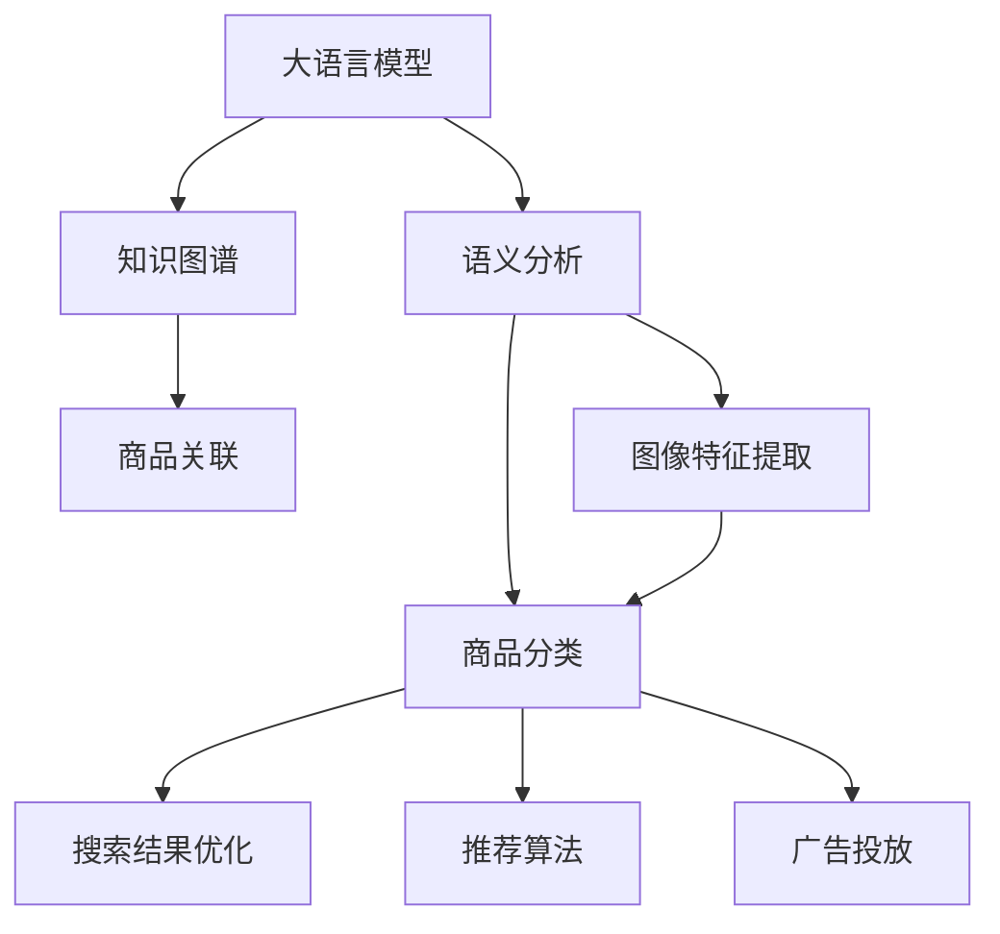

                 

# 电商平台商品分类体系：AI大模型的自动构建

> 关键词：电商商品分类,大语言模型,自动构建,自然语言处理(NLP),知识图谱,商品语义分析,深度学习,计算机视觉(CV)

## 1. 背景介绍

### 1.1 问题由来

随着互联网技术的迅猛发展，电子商务已日益成为人们日常购物的重要途径。电子商务平台（如淘宝、京东等）的商品数量庞大，且持续增长，商品分类体系成为平台搜索、推荐、广告投放等业务的基础。合理、高效的商品分类体系，不仅能够提升用户体验，还可以降低系统维护成本，促进业务优化。

然而，电商平台商品分类体系的构建和维护，一直以来都是一项复杂而繁琐的任务。传统的分类体系构建方式依赖人工标注，费时费力，且容易受标注人员主观因素影响，导致分类体系不够系统化、全面化。近年来，人工智能（AI）技术的大发展，特别是自然语言处理（NLP）和大语言模型的进步，为自动构建商品分类体系带来了新的契机。

### 1.2 问题核心关键点

本文聚焦于基于大语言模型的电商平台商品分类体系的自动构建。具体而言，文章将围绕以下几个关键点展开：

- 如何利用大语言模型，自动分析商品描述，构建详细的商品分类体系？
- 商品分类体系自动构建的全流程，包括数据预处理、模型训练、评估与优化等环节。
- 大语言模型在电商平台中的应用，如搜索、推荐、广告等，如何实现效果提升？
- 面临的挑战和未来趋势，如何应对和突破？

通过回答上述问题，本文将为电商平台商品分类体系的自动构建提供一整套可行的技术方案。

## 2. 核心概念与联系

### 2.1 核心概念概述

为更好地理解基于大语言模型的电商平台商品分类体系自动构建方法，本节将介绍几个关键概念及其相互联系：

- 大语言模型（Large Language Model, LLM）：指如BERT、GPT-3等大规模预训练语言模型。通过在大规模文本数据上进行预训练，LMM具有强大的语言理解和生成能力。

- 自然语言处理（Natural Language Processing, NLP）：涉及计算机与人类（自然）语言之间互动的各项技术。NLP旨在使计算机能够理解、处理和生成人类语言。

- 知识图谱（Knowledge Graph）：一种结构化的语义网络，用于描述实体与实体之间的关系。知识图谱是知识表示和推理的基础，能够有效提升信息检索和知识查询的效率。

- 商品语义分析（Semantic Analysis of Goods）：指对商品描述文本进行分析，理解商品属性、特征和关联关系，为商品分类提供支持。

- 深度学习（Deep Learning）：一类基于多层神经网络的机器学习方法。深度学习通过逐层信息提取，实现对复杂数据的建模和预测。

- 计算机视觉（Computer Vision, CV）：涉及计算机对图像、视频等视觉数据的理解和处理。CV技术可以提取商品图片特征，辅助商品分类。

这些概念之间存在紧密联系，共同构成了电商平台商品分类体系自动构建的技术框架：利用大语言模型进行语义分析，结合知识图谱构建商品分类体系，并借助深度学习和计算机视觉技术进行辅助和优化。

### 2.2 核心概念原理和架构的 Mermaid 流程图(Mermaid 流程节点中不要有括号、逗号等特殊字符)



## 3. 核心算法原理 & 具体操作步骤

### 3.1 算法原理概述

基于大语言模型的电商平台商品分类体系自动构建方法，本质上是一种基于监督学习的分类任务。其核心思想是：将电商平台商品描述作为输入，利用大语言模型的预训练能力，自动抽取商品的关键属性和特征，结合商品标签构建详细的商品分类体系。

具体来说，该方法可以分为以下步骤：

1. 收集商品描述文本数据，并进行数据预处理，包括去噪、分词、去除停用词等。
2. 使用大语言模型对处理后的商品描述文本进行语义分析，提取商品的关键属性和特征。
3. 结合商品标签，构建商品分类体系。
4. 通过标注数据训练分类模型，进行评估和优化，提升分类准确率。
5. 将训练好的分类模型应用于商品搜索、推荐、广告投放等业务场景，提升用户体验和业务效果。

### 3.2 算法步骤详解

**Step 1: 数据预处理**

电商商品描述数据通常包含丰富的信息，但也存在一些噪音和干扰因素。因此，在进行大语言模型语义分析前，需要对数据进行预处理，包括：

- 文本清洗：去除非文本格式的数据，如特殊字符、HTML标签等。
- 分词：将文本数据转换为词语序列，便于后续处理。
- 停用词去除：去除常见的停用词，如“的”、“是”等，以减少无关信息对模型的干扰。
- 标准化：统一词语的大小写和拼写，避免同义词和缩写带来的干扰。

**Step 2: 大语言模型语义分析**

利用大语言模型对商品描述文本进行语义分析，自动提取商品的关键属性和特征。具体来说，可以分为以下几步：

- 将处理后的商品描述文本输入到预训练好的大语言模型中，获取文本的语义表示。
- 使用语义表示，提取商品的关键属性和特征。例如，可以从描述中抽取商品的品牌、型号、价格等信息。
- 对提取的属性和特征进行拼接和编码，生成商品描述的向量表示。

**Step 3: 构建商品分类体系**

商品分类体系的构建，需要结合商品标签进行。具体来说，可以分为以下几步：

- 收集商品标签数据，并对其进行标准化处理。例如，将所有标签转换为统一的格式，如“鞋服-运动鞋-跑步鞋”。
- 使用大语言模型对商品描述向量和商品标签进行语义匹配，构建商品分类体系。例如，将描述为“鞋服-运动鞋-跑步鞋”的商品，分类到“鞋服-运动鞋”类别下。
- 对构建的分类体系进行优化和调整，以提高其准确性和全面性。例如，通过人工标注和审核，对分类体系中的错误或遗漏进行修正。

**Step 4: 模型训练与评估**

训练和评估分类模型，以提高其准确性和鲁棒性。具体来说，可以分为以下几步：

- 收集商品分类标注数据，并对其进行标准化处理。
- 使用标注数据训练分类模型，例如，使用线性回归、逻辑回归、支持向量机等方法。
- 在验证集上评估分类模型的性能，例如，使用准确率、召回率、F1分数等指标进行评估。
- 根据评估结果进行模型优化，例如，调整模型参数、增加正则化等。

**Step 5: 应用场景优化**

将训练好的分类模型应用于商品搜索、推荐、广告投放等业务场景，以提升用户体验和业务效果。具体来说，可以分为以下几步：

- 在商品搜索中，使用分类模型对查询词进行语义匹配，返回相关的商品。
- 在商品推荐中，使用分类模型对用户的历史行为和兴趣进行分析和匹配，推荐相关的商品。
- 在广告投放中，使用分类模型对广告内容进行分类和筛选，确保投放效果。

### 3.3 算法优缺点

基于大语言模型的电商平台商品分类体系自动构建方法，具有以下优点：

- 高效性：利用大语言模型的高效语义分析能力，可以自动化地构建商品分类体系，减少人工标注的投入。
- 全面性：利用大语言模型的丰富知识，能够构建更加全面和详细的商品分类体系。
- 准确性：利用大语言模型的语义匹配能力，可以提高分类模型的准确性和鲁棒性。

同时，该方法也存在以下缺点：

- 依赖高质量标注数据：构建商品分类体系时，需要大量的商品标签数据，这对标注工作提出了较高要求。
- 计算资源消耗大：大语言模型和深度学习模型的训练和推理，需要较大的计算资源和存储空间。
- 模型复杂度高：商品分类体系的构建和优化，涉及复杂的数据预处理、语义匹配和模型训练等环节，模型复杂度高。

### 3.4 算法应用领域

基于大语言模型的电商平台商品分类体系自动构建方法，广泛应用于电商平台的搜索、推荐、广告投放等业务场景，例如：

- 商品搜索：使用分类模型对查询词进行语义匹配，返回相关的商品。例如，用户查询“运动鞋”，系统可以返回“鞋服-运动鞋”分类下的所有商品。
- 商品推荐：使用分类模型对用户的历史行为和兴趣进行分析和匹配，推荐相关的商品。例如，用户浏览了“鞋服-运动鞋”分类下的商品，系统可以推荐该分类下的其他商品。
- 广告投放：使用分类模型对广告内容进行分类和筛选，确保投放效果。例如，广告内容为“鞋服-运动鞋”，系统可以将其投放到该分类下的用户。

## 4. 数学模型和公式 & 详细讲解 & 举例说明

### 4.1 数学模型构建

假设商品描述为 $x$，商品分类为 $y$，商品分类体系为 $\mathcal{C}$，大语言模型为 $M_{\theta}$，其中 $\theta$ 为模型参数。数学模型可以表示为：

$$
y = f_{M_{\theta}}(x)
$$

其中 $f_{M_{\theta}}$ 为基于大语言模型的语义匹配函数，将商品描述 $x$ 映射到商品分类 $y$。

假设 $y$ 为多分类任务，$y \in \mathcal{C}$，则分类损失函数可以表示为：

$$
\mathcal{L}(\theta) = \frac{1}{N}\sum_{i=1}^N \ell(f_{M_{\theta}}(x_i),y_i)
$$

其中 $\ell$ 为分类损失函数，例如，交叉熵损失函数。

### 4.2 公式推导过程

以下我们以交叉熵损失函数为例，推导其计算公式：

假设分类模型输出为 $p(y|x)$，即在商品描述 $x$ 下，商品分类 $y$ 的概率。则交叉熵损失函数可以表示为：

$$
\mathcal{L}(\theta) = -\frac{1}{N}\sum_{i=1}^N \sum_{y \in \mathcal{C}} y_i \log p(y|x_i)
$$

在实际应用中，为了降低计算复杂度，我们通常采用softmax函数将模型输出转换为概率分布：

$$
p(y|x) = \frac{e^{f_{M_{\theta}}(x)}}{\sum_{y \in \mathcal{C}} e^{f_{M_{\theta}}(x)}}
$$

其中 $e^{f_{M_{\theta}}(x)}$ 表示在商品描述 $x$ 下，商品分类 $y$ 的得分。

### 4.3 案例分析与讲解

以电商平台的商品推荐系统为例，解释如何利用大语言模型进行商品分类和推荐。

假设电商平台收集了用户的历史行为数据 $D=\{(x_i,y_i)\}_{i=1}^N$，其中 $x_i$ 为用户的历史浏览记录，$y_i$ 为对应的商品分类。

1. 首先，使用大语言模型对用户浏览记录 $x_i$ 进行语义分析，提取商品的关键属性和特征。
2. 然后，结合用户浏览记录 $x_i$ 和商品分类 $y_i$，构建商品分类体系 $\mathcal{C}$。
3. 在构建好的商品分类体系上，使用线性回归或逻辑回归等方法训练分类模型，对用户浏览记录 $x_i$ 进行分类。
4. 根据分类结果，生成推荐列表，返回给用户。例如，如果用户浏览了“鞋服-运动鞋”分类下的商品，系统可以推荐该分类下的其他商品。

## 5. 项目实践：代码实例和详细解释说明

### 5.1 开发环境搭建

在进行大语言模型商品分类体系构建的项目实践前，我们需要准备好开发环境。以下是使用Python进行PyTorch和HuggingFace库开发的Python环境配置流程：

1. 安装Anaconda：从官网下载并安装Anaconda，用于创建独立的Python环境。

2. 创建并激活虚拟环境：
```bash
conda create -n pytorch-env python=3.8 
conda activate pytorch-env
```

3. 安装PyTorch：根据CUDA版本，从官网获取对应的安装命令。例如：
```bash
conda install pytorch torchvision torchaudio cudatoolkit=11.1 -c pytorch -c conda-forge
```

4. 安装HuggingFace库：
```bash
pip install transformers
```

5. 安装各类工具包：
```bash
pip install numpy pandas scikit-learn matplotlib tqdm jupyter notebook ipython
```

完成上述步骤后，即可在`pytorch-env`环境中开始项目实践。

### 5.2 源代码详细实现

下面我们以电商平台商品分类体系自动构建为例，给出使用PyTorch和HuggingFace库进行商品分类模型训练的代码实现。

首先，定义商品分类数据处理函数：

```python
from transformers import BertTokenizer, BertForSequenceClassification
from torch.utils.data import Dataset, DataLoader
import torch

class GoodsDataset(Dataset):
    def __init__(self, texts, labels, tokenizer, max_len=128):
        self.texts = texts
        self.labels = labels
        self.tokenizer = tokenizer
        self.max_len = max_len
        
    def __len__(self):
        return len(self.texts)
    
    def __getitem__(self, item):
        text = self.texts[item]
        label = self.labels[item]
        
        encoding = self.tokenizer(text, return_tensors='pt', max_length=self.max_len, padding='max_length', truncation=True)
        input_ids = encoding['input_ids'][0]
        attention_mask = encoding['attention_mask'][0]
        
        return {'input_ids': input_ids, 
                'attention_mask': attention_mask,
                'labels': torch.tensor(label, dtype=torch.long)}
```

然后，定义商品分类模型和优化器：

```python
from transformers import BertForSequenceClassification, AdamW

model = BertForSequenceClassification.from_pretrained('bert-base-cased', num_labels=len(tag2id))

optimizer = AdamW(model.parameters(), lr=2e-5)
```

接着，定义训练和评估函数：

```python
from torch.utils.data import DataLoader
from tqdm import tqdm
from sklearn.metrics import classification_report

device = torch.device('cuda') if torch.cuda.is_available() else torch.device('cpu')
model.to(device)

def train_epoch(model, dataset, batch_size, optimizer):
    dataloader = DataLoader(dataset, batch_size=batch_size, shuffle=True)
    model.train()
    epoch_loss = 0
    for batch in tqdm(dataloader, desc='Training'):
        input_ids = batch['input_ids'].to(device)
        attention_mask = batch['attention_mask'].to(device)
        labels = batch['labels'].to(device)
        model.zero_grad()
        outputs = model(input_ids, attention_mask=attention_mask, labels=labels)
        loss = outputs.loss
        epoch_loss += loss.item()
        loss.backward()
        optimizer.step()
    return epoch_loss / len(dataloader)

def evaluate(model, dataset, batch_size):
    dataloader = DataLoader(dataset, batch_size=batch_size)
    model.eval()
    preds, labels = [], []
    with torch.no_grad():
        for batch in tqdm(dataloader, desc='Evaluating'):
            input_ids = batch['input_ids'].to(device)
            attention_mask = batch['attention_mask'].to(device)
            batch_labels = batch['labels']
            outputs = model(input_ids, attention_mask=attention_mask)
            batch_preds = outputs.logits.argmax(dim=2).to('cpu').tolist()
            batch_labels = batch_labels.to('cpu').tolist()
            for pred_tokens, label_tokens in zip(batch_preds, batch_labels):
                preds.append(pred_tokens[:len(label_tokens)])
                labels.append(label_tokens)
                
    print(classification_report(labels, preds))
```

最后，启动训练流程并在验证集上评估：

```python
epochs = 5
batch_size = 16

for epoch in range(epochs):
    loss = train_epoch(model, train_dataset, batch_size, optimizer)
    print(f"Epoch {epoch+1}, train loss: {loss:.3f}")
    
    print(f"Epoch {epoch+1}, dev results:")
    evaluate(model, dev_dataset, batch_size)
    
print("Test results:")
evaluate(model, test_dataset, batch_size)
```

以上就是使用PyTorch和HuggingFace库对商品分类模型进行训练的完整代码实现。可以看到，得益于HuggingFace库的强大封装，我们可以用相对简洁的代码完成商品分类模型的加载和训练。

### 5.3 代码解读与分析

让我们再详细解读一下关键代码的实现细节：

**GoodsDataset类**：
- `__init__`方法：初始化商品描述、商品标签、分词器等关键组件。
- `__len__`方法：返回数据集的样本数量。
- `__getitem__`方法：对单个样本进行处理，将商品描述输入编码为token ids，将商品标签编码为数字，并对其进行定长padding，最终返回模型所需的输入。

**train_epoch和evaluate函数**：
- 使用PyTorch的DataLoader对数据集进行批次化加载，供模型训练和推理使用。
- 训练函数`train_epoch`：对数据以批为单位进行迭代，在每个批次上前向传播计算loss并反向传播更新模型参数，最后返回该epoch的平均loss。
- 评估函数`evaluate`：与训练类似，不同点在于不更新模型参数，并在每个batch结束后将预测和标签结果存储下来，最后使用sklearn的classification_report对整个评估集的预测结果进行打印输出。

**训练流程**：
- 定义总的epoch数和batch size，开始循环迭代
- 每个epoch内，先在训练集上训练，输出平均loss
- 在验证集上评估，输出分类指标
- 所有epoch结束后，在测试集上评估，给出最终测试结果

可以看到，PyTorch配合HuggingFace库使得商品分类模型的训练代码实现变得简洁高效。开发者可以将更多精力放在数据处理、模型改进等高层逻辑上，而不必过多关注底层的实现细节。

当然，工业级的系统实现还需考虑更多因素，如模型的保存和部署、超参数的自动搜索、更灵活的任务适配层等。但核心的训练范式基本与此类似。

## 6. 实际应用场景

### 6.1 智能客服系统

利用基于大语言模型的电商平台商品分类体系，可以构建智能客服系统，提升客户服务质量。传统客服往往依赖人工，高峰期响应缓慢，且难以提供一致的回复。而使用自动构建的商品分类体系，可以7x24小时不间断服务，快速响应客户咨询，用自然流畅的语言解答各类常见问题。

在技术实现上，可以收集企业内部的历史客服对话记录，将问题和最佳答复构建成监督数据，在此基础上对预训练模型进行微调。微调后的模型能够自动理解用户意图，匹配最合适的答案模板进行回复。对于客户提出的新问题，还可以接入检索系统实时搜索相关内容，动态组织生成回答。如此构建的智能客服系统，能大幅提升客户咨询体验和问题解决效率。

### 6.2 个性化推荐系统

当前的推荐系统往往只依赖用户的历史行为数据进行物品推荐，无法深入理解用户的真实兴趣偏好。利用基于大语言模型的电商平台商品分类体系，个性化推荐系统可以更好地挖掘用户行为背后的语义信息，从而提供更精准、多样的推荐内容。

在实践中，可以收集用户浏览、点击、评论、分享等行为数据，提取和用户交互的物品标题、描述、标签等文本内容。将文本内容作为模型输入，用户的后续行为（如是否点击、购买等）作为监督信号，在此基础上微调预训练语言模型。微调后的模型能够从文本内容中准确把握用户的兴趣点。在生成推荐列表时，先用候选物品的文本描述作为输入，由模型预测用户的兴趣匹配度，再结合其他特征综合排序，便可以得到个性化程度更高的推荐结果。

### 6.3 搜索推荐系统优化

基于大语言模型的电商平台商品分类体系，可以显著优化搜索和推荐系统的用户体验和效果。例如，用户输入查询词“运动鞋”，系统可以通过分类体系快速定位到“鞋服-运动鞋”分类下的所有商品，返回相关搜索结果。同时，利用商品分类体系对用户的历史行为和兴趣进行分析和匹配，推荐相关的商品，提升推荐系统的精准性和个性化程度。

## 7. 工具和资源推荐

### 7.1 学习资源推荐

为了帮助开发者系统掌握大语言模型商品分类体系的构建理论基础和实践技巧，这里推荐一些优质的学习资源：

1. 《Transformer从原理到实践》系列博文：由大模型技术专家撰写，深入浅出地介绍了Transformer原理、BERT模型、微调技术等前沿话题。

2. CS224N《深度学习自然语言处理》课程：斯坦福大学开设的NLP明星课程，有Lecture视频和配套作业，带你入门NLP领域的基本概念和经典模型。

3. 《Natural Language Processing with Transformers》书籍：Transformers库的作者所著，全面介绍了如何使用Transformers库进行NLP任务开发，包括商品分类在内的诸多范式。

4. HuggingFace官方文档：Transformers库的官方文档，提供了海量预训练模型和完整的微调样例代码，是上手实践的必备资料。

5. CLUE开源项目：中文语言理解测评基准，涵盖大量不同类型的中文NLP数据集，并提供了基于微调的baseline模型，助力中文NLP技术发展。

通过对这些资源的学习实践，相信你一定能够快速掌握大语言模型商品分类体系的构建精髓，并用于解决实际的NLP问题。

### 7.2 开发工具推荐

高效的开发离不开优秀的工具支持。以下是几款用于大语言模型商品分类体系构建开发的常用工具：

1. PyTorch：基于Python的开源深度学习框架，灵活动态的计算图，适合快速迭代研究。大部分预训练语言模型都有PyTorch版本的实现。

2. TensorFlow：由Google主导开发的开源深度学习框架，生产部署方便，适合大规模工程应用。同样有丰富的预训练语言模型资源。

3. HuggingFace库：提供了丰富的预训练语言模型和NLP工具，支持PyTorch和TensorFlow，是进行商品分类任务开发的利器。

4. Weights & Biases：模型训练的实验跟踪工具，可以记录和可视化模型训练过程中的各项指标，方便对比和调优。与主流深度学习框架无缝集成。

5. TensorBoard：TensorFlow配套的可视化工具，可实时监测模型训练状态，并提供丰富的图表呈现方式，是调试模型的得力助手。

6. Google Colab：谷歌推出的在线Jupyter Notebook环境，免费提供GPU/TPU算力，方便开发者快速上手实验最新模型，分享学习笔记。

合理利用这些工具，可以显著提升大语言模型商品分类体系的构建效率，加快创新迭代的步伐。

### 7.3 相关论文推荐

大语言模型和商品分类技术的发展源于学界的持续研究。以下是几篇奠基性的相关论文，推荐阅读：

1. Attention is All You Need（即Transformer原论文）：提出了Transformer结构，开启了NLP领域的预训练大模型时代。

2. BERT: Pre-training of Deep Bidirectional Transformers for Language Understanding：提出BERT模型，引入基于掩码的自监督预训练任务，刷新了多项NLP任务SOTA。

3. Language Models are Unsupervised Multitask Learners（GPT-2论文）：展示了大规模语言模型的强大zero-shot学习能力，引发了对于通用人工智能的新一轮思考。

4. Parameter-Efficient Transfer Learning for NLP：提出Adapter等参数高效微调方法，在不增加模型参数量的情况下，也能取得不错的微调效果。

5. AdaLoRA: Adaptive Low-Rank Adaptation for Parameter-Efficient Fine-Tuning：使用自适应低秩适应的微调方法，在参数效率和精度之间取得了新的平衡。

这些论文代表了大语言模型商品分类技术的发展脉络。通过学习这些前沿成果，可以帮助研究者把握学科前进方向，激发更多的创新灵感。

## 8. 总结：未来发展趋势与挑战

### 8.1 研究成果总结

本文对基于大语言模型的电商平台商品分类体系的自动构建方法进行了全面系统的介绍。首先阐述了构建商品分类体系的背景和意义，明确了商品分类体系自动构建的可行性和必要性。其次，从原理到实践，详细讲解了构建过程的各个环节，包括数据预处理、大语言模型语义分析、商品分类体系构建、模型训练与评估等。同时，本文还探讨了该方法在电商平台的实际应用场景，如智能客服、个性化推荐、搜索推荐系统优化等，展示了其广泛的应用前景。

通过本文的系统梳理，可以看到，基于大语言模型的电商平台商品分类体系自动构建方法，不仅能够显著提升商品分类的准确性和全面性，还可以广泛应用于电商平台的多个业务场景，提升用户体验和业务效果。

### 8.2 未来发展趋势

展望未来，大语言模型商品分类体系自动构建技术将呈现以下几个发展趋势：

1. 商品分类体系自适应：通过引入自适应学习机制，自动调整商品分类体系，以适应不同的应用场景和用户需求。例如，根据用户的历史行为和兴趣，动态调整分类体系中的商品标签。

2. 商品语义理解增强：结合自然语言处理和计算机视觉技术，增强商品语义理解能力。例如，利用图像识别技术，自动提取商品图片中的关键特征，与文本描述结合，提升分类准确性。

3. 跨领域知识融合：将商品分类体系与其他领域知识进行融合，如知识图谱、推荐系统等，形成更加全面、准确的信息整合能力。例如，将商品分类体系与推荐系统结合，提高推荐系统的个性化程度和效果。

4. 实时性增强：通过分布式训练和推理，提升商品分类体系的实时性。例如，利用GPU/TPU等高性能设备，实现高效的模型训练和推理。

5. 多模态融合：将文本、图像、语音等多种模态信息进行融合，提升商品分类体系的泛化能力和鲁棒性。例如，结合自然语言处理和计算机视觉技术，实现商品分类体系的跨模态理解。

这些趋势凸显了大语言模型商品分类体系自动构建技术的广阔前景。这些方向的探索发展，必将进一步提升商品分类的精度和效率，为电商平台的业务优化提供更强大的技术支持。

### 8.3 面临的挑战

尽管大语言模型商品分类体系自动构建技术已经取得了显著进展，但在迈向更加智能化、普适化应用的过程中，它仍面临着诸多挑战：

1. 数据质量和标注工作：高质量的数据和标注是构建商品分类体系的基础。但实际应用中，获取充足的、高质量的标注数据往往需要大量人力和时间，成本较高。

2. 计算资源消耗：大语言模型和深度学习模型的训练和推理，需要较大的计算资源和存储空间。如何降低计算成本，提升系统性能，是一个重要问题。

3. 模型复杂度：商品分类体系的构建和优化，涉及复杂的数据预处理、语义匹配和模型训练等环节，模型复杂度高。如何简化模型结构，提高模型效率，是一个重要课题。

4. 知识表示和推理：现有的商品分类体系，主要基于文本描述进行语义匹配，缺乏对视觉、语音等多模态信息的整合。如何引入更丰富的知识表示和推理机制，是一个重要方向。

5. 跨领域适应性：现有的商品分类体系，往往聚焦于特定领域，如鞋服、家居等。如何构建跨领域的商品分类体系，提高其普适性和通用性，是一个重要问题。

6. 隐私和安全：大语言模型在商品分类体系构建中，涉及大量用户隐私数据。如何保护用户隐私，防止数据泄露，是一个重要挑战。

正视商品分类体系自动构建面临的这些挑战，积极应对并寻求突破，将是大语言模型在电商平台中广泛应用的重要保障。相信随着技术的发展和应用的深入，这些挑战终将一一被克服，大语言模型商品分类体系自动构建技术将为电商平台带来更深远的影响。

### 8.4 研究展望

面向未来，大语言模型商品分类体系自动构建技术需要在以下几个方面进行深入研究：

1. 无监督学习和半监督学习：摆脱对大规模标注数据的依赖，利用自监督学习、主动学习等方法，最大限度利用非结构化数据，实现更加灵活高效的构建。

2. 参数高效微调和计算高效微调：开发更加参数高效和计算高效的微调方法，在固定大部分预训练参数的情况下，只更新极少量的任务相关参数，以提高效率。

3. 多模态融合：将文本、图像、语音等多种模态信息进行融合，提升商品分类体系的泛化能力和鲁棒性，拓展应用场景。

4. 跨领域知识整合：将符号化的先验知识，如知识图谱、逻辑规则等，与神经网络模型进行巧妙融合，引导构建过程学习更准确、合理的商品分类体系。

5. 因果分析和博弈论工具：将因果分析方法引入构建过程，识别出模型决策的关键特征，增强输出解释的因果性和逻辑性。借助博弈论工具刻画人机交互过程，主动探索并规避模型的脆弱点，提高系统稳定性。

6. 伦理和隐私保护：在构建过程中，纳入伦理导向的评估指标，过滤和惩罚有偏见、有害的输出倾向，加强用户隐私保护，确保数据安全。

这些研究方向将引领大语言模型商品分类体系自动构建技术的不断演进，为电商平台的业务优化和智能化转型提供更加强大的技术保障。

## 9. 附录：常见问题与解答

**Q1：商品分类体系自动构建过程中，如何处理商品描述中的噪音和干扰信息？**

A: 商品描述中的噪音和干扰信息，通常可以通过以下方法进行处理：

- 文本清洗：去除非文本格式的数据，如特殊字符、HTML标签等。
- 分词：将文本数据转换为词语序列，便于后续处理。
- 停用词去除：去除常见的停用词，如“的”、“是”等，以减少无关信息对模型的干扰。
- 标准化：统一词语的大小写和拼写，避免同义词和缩写带来的干扰。

这些方法能够有效处理商品描述中的噪音和干扰信息，提高模型的语义理解能力。

**Q2：如何选择合适的预训练语言模型进行商品分类？**

A: 选择预训练语言模型时，可以考虑以下几个方面：

- 语料库的大小和质量：大语料库的模型通常具有更好的语义理解能力，但训练和推理成本较高。选择时需要权衡利弊。
- 任务的相关性：选择与商品分类任务相关的预训练模型，能够更好地提取任务相关的语义特征。
- 模型的预训练任务：选择具有相似预训练任务的模型，能够更好地迁移和应用到商品分类任务上。

常用的预训练语言模型包括BERT、GPT系列等，可以根据实际需求进行选择。

**Q3：商品分类体系自动构建过程中，如何优化模型的超参数？**

A: 优化模型的超参数是构建高效商品分类体系的关键步骤。以下是一些常用的方法：

- 网格搜索：在预定的超参数范围内，尝试所有可能的组合，并选择性能最优的模型。
- 随机搜索：随机选择超参数组合，并通过多次试验找到最优解。
- 贝叶斯优化：通过构建高斯过程模型，对超参数进行优化，以提高搜索效率。
- 自适应学习：根据模型的表现，动态调整超参数，以提高模型的泛化能力。

这些方法可以结合使用，以提高模型构建的效率和效果。

**Q4：商品分类体系自动构建过程中，如何降低计算资源消耗？**

A: 降低计算资源消耗是商品分类体系自动构建的重要目标。以下是一些常用的方法：

- 模型裁剪：去除不必要的层和参数，减小模型尺寸，加快推理速度。
- 量化加速：将浮点模型转为定点模型，压缩存储空间，提高计算效率。
- 分布式训练：利用分布式训练技术，提升模型的训练速度和并行处理能力。
- 模型并行：将模型拆分为多个部分，并行训练，提高模型的训练效率。

这些方法可以结合使用，以提高商品分类体系自动构建的效率和效果。

**Q5：商品分类体系自动构建过程中，如何提高模型的泛化能力？**

A: 提高模型的泛化能力是商品分类体系自动构建的重要目标。以下是一些常用的方法：

- 数据增强：通过回译、近义替换等方式扩充训练集，提升模型的泛化能力。
- 正则化：使用L2正则、Dropout等技术，防止模型过度拟合训练数据。
- 对抗训练：引入对抗样本，提高模型的鲁棒性和泛化能力。
- 迁移学习：利用预训练模型的知识，加速模型的泛化能力。

这些方法可以结合使用，以提高商品分类体系自动构建的泛化能力和鲁棒性。

通过上述问题与解答，相信你能够更好地理解基于大语言模型的电商平台商品分类体系的自动构建方法，并在实际应用中取得更好的效果。

---

作者：禅与计算机程序设计艺术 / Zen and the Art of Computer Programming

