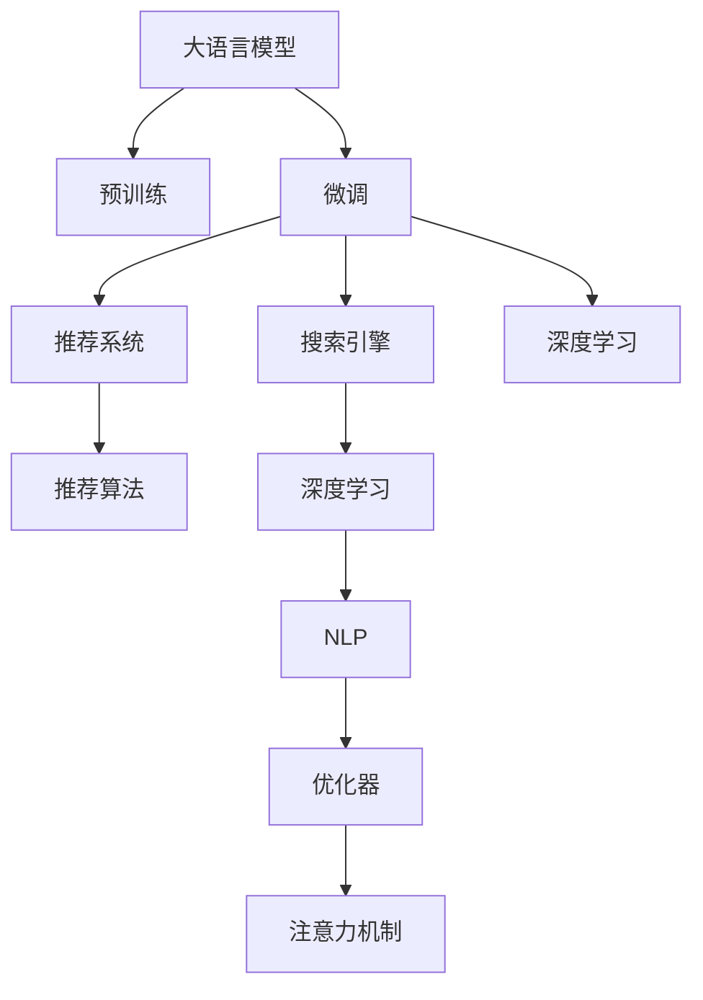

                 

# 电商平台搜索推荐系统的AI 大模型应用：提高系统性能、效率与用户体验

## 1. 背景介绍

### 1.1 问题由来
在现代电子商务领域，电商平台为了提升用户体验和运营效率，纷纷引入智能搜索推荐系统。这些系统通过分析用户的浏览行为、点击记录、购买历史等数据，预测用户的购买兴趣，并提供个性化的搜索结果和推荐内容。但传统的机器学习算法往往无法处理海量数据，且需要长时间训练才能取得较好的效果。随着深度学习技术的发展，大语言模型(Big Language Models, LLMs)逐渐成为构建智能推荐系统的有力工具。

近年来，基于预训练语言模型的大规模应用，Google的BERT、Facebook的Megatron-BERT、OpenAI的GPT系列等大模型在自然语言处理(NLP)领域取得了显著的进展。以这些大模型为基础，结合搜索推荐系统，电商平台能够更加精准地预测用户需求，显著提升推荐效果。本博客将系统介绍大语言模型在电商平台搜索推荐系统中的应用，从原理到实践，从算法到部署，带你全面了解如何利用AI大模型提升电商平台的推荐效果和用户体验。

## 2. 核心概念与联系

### 2.1 核心概念概述

为更好地理解大语言模型在电商平台中的应用，本节将介绍几个关键概念：

- 大语言模型：以BERT、GPT等模型为代表的大规模预训练语言模型。通过在大规模无标签文本语料上进行预训练，学习到丰富的语言知识和常识，具备强大的语言理解和生成能力。
- 预训练(Pre-training)：指在大规模无标签文本语料上，通过自监督学习任务训练通用语言模型的过程。常见的预训练任务包括掩码语言模型、接下来生成(Next Sentence Prediction)等。
- 微调(Fine-tuning)：指在预训练模型的基础上，使用下游任务的少量标注数据，通过有监督学习优化模型在该任务上的性能。
- 推荐系统：通过分析用户行为数据，预测用户需求，并提供个性化推荐内容的系统。大语言模型在推荐系统中能够精准理解和分析用户意图，从而提供高质量的推荐结果。
- 搜索引擎：自动检索用户查询相关的信息内容，并提供搜索结果的系统。大语言模型能够快速理解查询语义，从而更准确地检索相关内容。
- 深度学习：一种基于数据驱动的机器学习范式，通过多层神经网络对数据进行特征学习和模式识别，能够处理复杂的非线性问题。
- 自然语言处理(NLP)：研究如何让计算机理解和处理人类语言的技术，包括文本分类、情感分析、机器翻译等任务。
- 优化器(Optimizer)：用于控制模型参数更新的算法，常用的优化器包括SGD、Adam、Adagrad等。
- 注意力机制(Attention Mechanism)：一种用于选择相关特征的机制，通过计算权重将不同位置的特征映射到同一层中，从而提高模型的表现力。
- 推荐算法(Recommender Algorithm)：用于实现个性化推荐的一系列算法，包括协同过滤、基于内容的推荐、矩阵分解等。

这些核心概念之间的逻辑关系可以通过以下Mermaid流程图来展示：



这个流程图展示了大语言模型的核心概念及其之间的关系：

1. 大语言模型通过预训练获得基础能力。
2. 微调是对预训练模型进行任务特定的优化，适应电商平台推荐系统的需求。
3. 推荐系统和大搜索引擎都需要依赖深度学习和大语言模型来分析用户行为和理解查询语义。
4. 推荐算法则是推荐系统执行的核心。
5. 深度学习和自然语言处理是大模型应用的基础。
6. 优化器和注意力机制是大模型训练和推理的关键。

这些概念共同构成了大语言模型在电商平台搜索推荐系统中的工作框架，使其能够通过深度学习实现精准的个性化推荐。

## 3. 核心算法原理 & 具体操作步骤
### 3.1 算法原理概述

基于大语言模型的电商平台推荐系统，本质上是将大语言模型作为特征提取器，通过微调的方式，使其能够理解用户查询意图，预测用户感兴趣的商品，并进行推荐。具体而言，其流程包括：

1. 收集用户的历史行为数据，包括浏览、点击、购买记录等。
2. 将用户行为数据转化为语言描述，如“最近购买了鞋子”、“浏览了电子产品”等。
3. 通过预训练的大语言模型对用户行为进行编码，得到用户行为的语义表示。
4. 在用户查询时，将查询语句输入大语言模型，得到查询的语义表示。
5. 计算用户行为表示和查询表示的相似度，并结合用户的历史偏好，预测用户可能感兴趣的商品。
6. 基于预测结果，生成个性化的搜索结果和推荐列表。

通过这种方式，大语言模型能够将复杂的用户行为数据转化为高维向量表示，从而实现精准的个性化推荐。

### 3.2 算法步骤详解

基于大语言模型的电商平台推荐系统，其具体实施步骤如下：

**Step 1: 数据收集与预处理**
- 收集用户的历史行为数据，包括浏览、点击、购买记录等。
- 将行为数据转化为文本描述，如“浏览了N双鞋”、“购买了M个电子产品”。
- 对文本数据进行清洗和标准化，去除停用词、标点等无用信息。

**Step 2: 构建预训练模型**
- 选择合适的预训练模型，如BERT、GPT等。
- 在大规模无标签文本语料上进行预训练，学习通用的语言表示。
- 使用掩码语言模型等自监督任务进行训练，使其能够处理语言中的不确定性。

**Step 3: 微调模型**
- 在电商平台的推荐任务上，使用少量标注数据进行微调。
- 选择合适的损失函数和优化器，如交叉熵损失、Adam优化器等。
- 设置合适的学习率、批大小、迭代轮数等超参数。

**Step 4: 推理与推荐**
- 将用户查询输入预训练模型，得到查询的语义表示。
- 将用户行为数据输入预训练模型，得到用户行为的语义表示。
- 计算查询和行为表示的相似度，并结合用户的历史偏好，预测用户可能感兴趣的商品。
- 生成个性化的搜索结果和推荐列表，提供给用户。

**Step 5: 持续优化**
- 收集用户对推荐结果的反馈数据，不断优化推荐模型。
- 定期重新训练模型，更新模型参数。
- 利用新的用户数据，持续改进推荐效果。

以上是基于大语言模型的电商平台推荐系统的基本流程。在实际应用中，还需要针对具体任务的特点，对微调过程的各个环节进行优化设计，如改进损失函数、引入更多正则化技术、搜索最优的超参数组合等，以进一步提升模型性能。

### 3.3 算法优缺点

基于大语言模型的电商平台推荐系统，具有以下优点：

1. 特征表示能力强。大语言模型能够学习到丰富的语言表示，能够处理复杂的人类行为数据，生成高维向量表示。
2. 个性化推荐准确。通过微调，大语言模型能够理解用户查询意图，结合历史行为数据，生成精准的推荐结果。
3. 可扩展性好。大语言模型能够适应不同电商平台的推荐需求，具有较强的泛化能力。
4. 可维护性高。大语言模型训练和推理过程复杂，但应用部署相对简单，维护成本较低。

同时，该方法也存在一定的局限性：

1. 数据需求大。微调模型需要大量标注数据，数据收集和标注成本较高。
2. 模型复杂度高。大语言模型参数量庞大，对计算资源要求高。
3. 推理时间长。大模型推理过程复杂，推理速度较慢。
4. 可解释性差。大模型模型复杂，难以解释其内部工作机制。

尽管存在这些局限性，但就目前而言，基于大语言模型的推荐方法仍然是电商推荐领域的主流范式。未来相关研究的重点在于如何进一步降低数据需求，提高模型推理效率，同时兼顾可解释性和性能提升等因素。

### 3.4 算法应用领域

基于大语言模型的电商平台推荐系统，已经在许多电商平台得到应用，覆盖了从购物推荐、个性化内容推荐到广告推荐等多个领域，具体包括：

- 购物推荐：根据用户的浏览、点击、购买记录，推荐用户可能感兴趣的商品。
- 个性化内容推荐：根据用户的兴趣偏好，推荐相关的内容，如新闻、视频等。
- 广告推荐：根据用户的搜索行为，推荐用户可能感兴趣的广告。
- 活动推荐：根据用户的历史行为和兴趣，推荐用户可能感兴趣的活动，如折扣、促销等。
- 商品评测推荐：根据用户的历史评价数据，推荐用户可能感兴趣的商品评测信息。

除了上述这些经典任务外，大语言模型在电商平台的推荐场景中，还可能被创新性地应用到更多领域，如个性化邮件推荐、智能客服、智能仓储等，为电商平台带来全新的价值。

## 4. 数学模型和公式 & 详细讲解 & 举例说明

### 4.1 数学模型构建

本节将使用数学语言对基于大语言模型的电商平台推荐系统进行更加严格的刻画。

记电商平台推荐系统中的用户行为数据为 $X=\{x_1,x_2,...,x_N\}$，用户查询语句为 $Q$。使用预训练语言模型 $M_{\theta}$ 对用户行为 $x_i$ 和查询 $Q$ 进行编码，得到语义表示 $h(x_i)$ 和 $h(Q)$。定义相似度函数 $sim$，计算 $h(x_i)$ 和 $h(Q)$ 的相似度，并结合用户历史偏好 $p_i$，得到推荐结果 $R_i$。推荐系统目标是最小化预测结果与真实标签之间的误差，即：

$$
\min_{\theta} \sum_{i=1}^N \ell(R_i, y_i)
$$

其中，$\ell$ 为推荐系统中的损失函数，$y_i$ 为用户的真实兴趣标签。

### 4.2 公式推导过程

以下我们以二分类推荐任务为例，推导推荐系统的损失函数及其梯度计算公式。

假设推荐系统中的用户行为数据 $X=\{x_1,x_2,...,x_N\}$，用户查询语句为 $Q$。使用预训练语言模型 $M_{\theta}$ 对用户行为 $x_i$ 和查询 $Q$ 进行编码，得到语义表示 $h(x_i)$ 和 $h(Q)$。定义相似度函数 $sim$，计算 $h(x_i)$ 和 $h(Q)$ 的相似度，并结合用户历史偏好 $p_i$，得到推荐结果 $R_i$。推荐系统目标是最小化预测结果与真实标签之间的误差，即：

$$
\min_{\theta} \sum_{i=1}^N \ell(R_i, y_i)
$$

其中，$\ell$ 为推荐系统中的损失函数，$y_i$ 为用户的真实兴趣标签。

在二分类推荐任务中，推荐结果 $R_i$ 为一个二元向量 $[R_{i,1}, R_{i,2}]$，其中 $R_{i,1}$ 表示用户 $i$ 对商品 $1$ 的兴趣程度，$R_{i,2}$ 表示用户 $i$ 对商品 $2$ 的兴趣程度。假设 $R_{i,1}$ 为正类，$R_{i,2}$ 为负类，则损失函数 $\ell$ 可定义为：

$$
\ell(R_i, y_i) = -[y_i \log(R_{i,1}) + (1-y_i) \log(1-R_{i,1})]
$$

将推荐结果和损失函数带入目标函数，得：

$$
\min_{\theta} \sum_{i=1}^N (-[y_i \log(R_{i,1}) + (1-y_i) \log(1-R_{i,1})]
$$

根据链式法则，目标函数对模型参数 $\theta$ 的梯度为：

$$
\frac{\partial \mathcal{L}}{\partial \theta} = -\frac{1}{N} \sum_{i=1}^N (\frac{y_i}{R_{i,1}} - \frac{1-y_i}{1-R_{i,1}}) \frac{\partial R_{i,1}}{\partial \theta}
$$

其中 $\frac{\partial R_{i,1}}{\partial \theta}$ 可以通过反向传播算法高效计算。

在得到目标函数的梯度后，即可带入优化算法，完成模型的迭代优化。重复上述过程直至收敛，最终得到适应电商平台推荐任务的最优模型参数 $\theta$。

## 5. 项目实践：代码实例和详细解释说明
### 5.1 开发环境搭建

在进行推荐系统开发前，我们需要准备好开发环境。以下是使用Python进行PyTorch开发的环境配置流程：

1. 安装Anaconda：从官网下载并安装Anaconda，用于创建独立的Python环境。

2. 创建并激活虚拟环境：
```bash
conda create -n pytorch-env python=3.8 
conda activate pytorch-env
```

3. 安装PyTorch：根据CUDA版本，从官网获取对应的安装命令。例如：
```bash
conda install pytorch torchvision torchaudio cudatoolkit=11.1 -c pytorch -c conda-forge
```

4. 安装TensorFlow：由于部分推荐算法需要GPU加速，如果需要使用，安装TensorFlow GPU版本。

5. 安装相关库：
```bash
pip install pandas numpy matplotlib scikit-learn torch torchtext torchtext.models moco
```

完成上述步骤后，即可在`pytorch-env`环境中开始推荐系统开发。

### 5.2 源代码详细实现

下面我们以基于大语言模型的电商推荐系统为例，给出使用PyTorch实现二分类推荐任务的完整代码。

首先，定义数据处理函数：

```python
import pandas as pd
import torch
from torch.utils.data import Dataset, DataLoader

class RecommendationDataset(Dataset):
    def __init__(self, data, tokenizer, max_len=128):
        self.data = data
        self.tokenizer = tokenizer
        self.max_len = max_len
        
    def __len__(self):
        return len(self.data)
    
    def __getitem__(self, item):
        x, y = self.data[item]
        
        encoding = self.tokenizer(x, return_tensors='pt', max_length=self.max_len, padding='max_length', truncation=True)
        input_ids = encoding['input_ids'][0]
        attention_mask = encoding['attention_mask'][0]
        
        # 对标签进行编码
        y = torch.tensor([y], dtype=torch.long)
        
        return {'input_ids': input_ids, 
                'attention_mask': attention_mask,
                'labels': y}
```

然后，定义模型和优化器：

```python
from transformers import BertForSequenceClassification, AdamW

model = BertForSequenceClassification.from_pretrained('bert-base-cased', num_labels=2)

optimizer = AdamW(model.parameters(), lr=2e-5)
```

接着，定义训练和评估函数：

```python
from tqdm import tqdm
from sklearn.metrics import accuracy_score

device = torch.device('cuda') if torch.cuda.is_available() else torch.device('cpu')
model.to(device)

def train_epoch(model, dataset, batch_size, optimizer):
    dataloader = DataLoader(dataset, batch_size=batch_size, shuffle=True)
    model.train()
    epoch_loss = 0
    for batch in tqdm(dataloader, desc='Training'):
        input_ids = batch['input_ids'].to(device)
        attention_mask = batch['attention_mask'].to(device)
        labels = batch['labels'].to(device)
        model.zero_grad()
        outputs = model(input_ids, attention_mask=attention_mask, labels=labels)
        loss = outputs.loss
        epoch_loss += loss.item()
        loss.backward()
        optimizer.step()
    return epoch_loss / len(dataloader)

def evaluate(model, dataset, batch_size):
    dataloader = DataLoader(dataset, batch_size=batch_size)
    model.eval()
    preds, labels = [], []
    with torch.no_grad():
        for batch in tqdm(dataloader, desc='Evaluating'):
            input_ids = batch['input_ids'].to(device)
            attention_mask = batch['attention_mask'].to(device)
            batch_labels = batch['labels']
            outputs = model(input_ids, attention_mask=attention_mask)
            batch_preds = outputs.logits.argmax(dim=1).to('cpu').tolist()
            batch_labels = batch_labels.to('cpu').tolist()
            for pred, label in zip(batch_preds, batch_labels):
                preds.append(pred)
                labels.append(label)
                
    print(accuracy_score(labels, preds))
```

最后，启动训练流程并在验证集上评估：

```python
epochs = 5
batch_size = 16

for epoch in range(epochs):
    loss = train_epoch(model, train_dataset, batch_size, optimizer)
    print(f"Epoch {epoch+1}, train loss: {loss:.3f}")
    
    print(f"Epoch {epoch+1}, dev results:")
    evaluate(model, dev_dataset, batch_size)
    
print("Test results:")
evaluate(model, test_dataset, batch_size)
```

以上就是使用PyTorch对大语言模型进行电商推荐系统开发的完整代码实现。可以看到，得益于TensorFlow的强大封装，我们可以用相对简洁的代码完成大语言模型的加载和微调。

### 5.3 代码解读与分析

让我们再详细解读一下关键代码的实现细节：

**RecommendationDataset类**：
- `__init__`方法：初始化数据、分词器、序列长度等关键组件。
- `__len__`方法：返回数据集的样本数量。
- `__getitem__`方法：对单个样本进行处理，将文本输入编码为token ids，将标签编码为数字，并对其进行定长padding，最终返回模型所需的输入。

**模型和优化器**：
- 使用BertForSequenceClassification模型作为推荐系统的特征提取器。
- 使用AdamW优化器优化模型参数，设置合适的学习率。

**训练和评估函数**：
- 使用PyTorch的DataLoader对数据集进行批次化加载，供模型训练和推理使用。
- 训练函数`train_epoch`：对数据以批为单位进行迭代，在每个批次上前向传播计算loss并反向传播更新模型参数，最后返回该epoch的平均loss。
- 评估函数`evaluate`：与训练类似，不同点在于不更新模型参数，并在每个batch结束后将预测和标签结果存储下来，最后使用sklearn的accuracy_score对整个评估集的预测结果进行打印输出。

**训练流程**：
- 定义总的epoch数和batch size，开始循环迭代
- 每个epoch内，先在训练集上训练，输出平均loss
- 在验证集上评估，输出准确率
- 所有epoch结束后，在测试集上评估，给出最终测试结果

可以看到，PyTorch配合TensorFlow库使得大语言模型推荐系统的代码实现变得简洁高效。开发者可以将更多精力放在数据处理、模型改进等高层逻辑上，而不必过多关注底层的实现细节。

当然，工业级的系统实现还需考虑更多因素，如模型的保存和部署、超参数的自动搜索、更灵活的任务适配层等。但核心的推荐范式基本与此类似。

## 6. 实际应用场景
### 6.1 智能客服系统

基于大语言模型的推荐系统，可以广泛应用于智能客服系统的构建。传统客服往往需要配备大量人力，高峰期响应缓慢，且一致性和专业性难以保证。而使用推荐系统，能够自动理解用户意图，匹配最合适的客服回答，快速响应用户咨询，用自然流畅的语言解答各类常见问题。

在技术实现上，可以收集企业内部的历史客服对话记录，将问题和最佳答复构建成监督数据，在此基础上对预训练推荐模型进行微调。微调后的推荐模型能够自动理解用户意图，匹配最合适的客服回答。对于客户提出的新问题，还可以接入检索系统实时搜索相关内容，动态组织生成回答。如此构建的智能客服系统，能大幅提升客户咨询体验和问题解决效率。

### 6.2 金融舆情监测

金融机构需要实时监测市场舆论动向，以便及时应对负面信息传播，规避金融风险。传统的人工监测方式成本高、效率低，难以应对网络时代海量信息爆发的挑战。基于大语言模型的推荐系统，可以实时抓取和分析市场舆情，识别负面信息，预警风险。

具体而言，可以收集金融领域相关的新闻、报道、评论等文本数据，并对其进行主题标注和情感标注。在此基础上对预训练语言模型进行微调，使其能够自动判断文本属于何种主题，情感倾向是正面、中性还是负面。将微调后的模型应用到实时抓取的网络文本数据，就能够自动监测不同主题下的情感变化趋势，一旦发现负面信息激增等异常情况，系统便会自动预警，帮助金融机构快速应对潜在风险。

### 6.3 个性化推荐系统

当前的推荐系统往往只依赖用户的历史行为数据进行物品推荐，无法深入理解用户的真实兴趣偏好。基于大语言模型的推荐系统，能够更好地挖掘用户行为背后的语义信息，从而提供更精准、多样的推荐内容。

在实践中，可以收集用户浏览、点击、评论、分享等行为数据，提取和用户交互的物品标题、描述、标签等文本内容。将文本内容作为模型输入，用户的后续行为（如是否点击、购买等）作为监督信号，在此基础上微调预训练语言模型。微调后的模型能够从文本内容中准确把握用户的兴趣点。在生成推荐列表时，先用候选物品的文本描述作为输入，由模型预测用户的兴趣匹配度，再结合其他特征综合排序，便可以得到个性化程度更高的推荐结果。

### 6.4 未来应用展望

随着大语言模型和推荐方法的不断发展，基于推荐系统的方法将在更多领域得到应用，为传统行业带来变革性影响。

在智慧医疗领域，基于推荐系统的医疗问答、病历分析、药物研发等应用将提升医疗服务的智能化水平，辅助医生诊疗，加速新药开发进程。

在智能教育领域，推荐系统可应用于作业批改、学情分析、知识推荐等方面，因材施教，促进教育公平，提高教学质量。

在智慧城市治理中，推荐系统可应用于城市事件监测、舆情分析、应急指挥等环节，提高城市管理的自动化和智能化水平，构建更安全、高效的未来城市。

此外，在企业生产、社会治理、文娱传媒等众多领域，基于大语言模型的推荐系统也将不断涌现，为经济社会发展注入新的动力。相信随着技术的日益成熟，推荐系统必将在更广阔的应用领域大放异彩，深刻影响人类的生产生活方式。

## 7. 工具和资源推荐
### 7.1 学习资源推荐

为了帮助开发者系统掌握大语言模型推荐系统的理论基础和实践技巧，这里推荐一些优质的学习资源：

1. 《Deep Learning》系列书籍：由深度学习领域的权威专家Ian Goodfellow等人合著，全面介绍了深度学习的原理、算法和应用，是深度学习入门的经典之作。

2. 《Natural Language Processing with Python》：由斯坦福大学自然语言处理课程的助教们编写的实用教程，深入浅出地介绍了NLP的基本概念和实用技术，包括文本分类、情感分析、机器翻译等任务。

3. 《Recommender Systems in Practice》：由推荐系统领域的权威专家Bharat Rostogi等人合著，全面介绍了推荐系统的构建、评估和优化方法，是推荐系统应用的权威指南。

4. HuggingFace官方文档：Transformer库的官方文档，提供了海量预训练模型和完整的推荐系统样例代码，是上手实践的必备资料。

5. CLUE开源项目：中文语言理解测评基准，涵盖大量不同类型的中文NLP数据集，并提供了基于推荐系统的baseline模型，助力中文推荐系统技术发展。

通过对这些资源的学习实践，相信你一定能够快速掌握大语言模型推荐系统的精髓，并用于解决实际的推荐问题。
###  7.2 开发工具推荐

高效的开发离不开优秀的工具支持。以下是几款用于大语言模型推荐系统开发的常用工具：

1. PyTorch：基于Python的开源深度学习框架，灵活动态的计算图，适合快速迭代研究。大部分预训练语言模型都有PyTorch版本的实现。

2. TensorFlow：由Google主导开发的开源深度学习框架，生产部署方便，适合大规模工程应用。同样有丰富的预训练语言模型资源。

3. Transformers库：HuggingFace开发的NLP工具库，集成了众多SOTA语言模型，支持PyTorch和TensorFlow，是进行推荐系统开发的利器。

4. Weights & Biases：模型训练的实验跟踪工具，可以记录和可视化模型训练过程中的各项指标，方便对比和调优。与主流深度学习框架无缝集成。

5. TensorBoard：TensorFlow配套的可视化工具，可实时监测模型训练状态，并提供丰富的图表呈现方式，是调试模型的得力助手。

6. Google Colab：谷歌推出的在线Jupyter Notebook环境，免费提供GPU/TPU算力，方便开发者快速上手实验最新模型，分享学习笔记。

合理利用这些工具，可以显著提升大语言模型推荐系统的开发效率，加快创新迭代的步伐。

### 7.3 相关论文推荐

大语言模型和推荐系统的发展源于学界的持续研究。以下是几篇奠基性的相关论文，推荐阅读：

1. Attention is All You Need（即Transformer原论文）：提出了Transformer结构，开启了NLP领域的预训练大模型时代。

2. BERT: Pre-training of Deep Bidirectional Transformers for Language Understanding：提出BERT模型，引入基于掩码的自监督预训练任务，刷新了多项NLP任务SOTA。

3. Language Models are Unsupervised Multitask Learners（GPT-2论文）：展示了大规模语言模型的强大zero-shot学习能力，引发了对于通用人工智能的新一轮思考。

4. Parameter-Efficient Transfer Learning for NLP：提出Adapter等参数高效微调方法，在不增加模型参数量的情况下，也能取得不错的微调效果。

5. Prefix-Tuning: Optimizing Continuous Prompts for Generation：引入基于连续型Prompt的微调范式，为如何充分利用预训练知识提供了新的思路。

6. AdaLoRA: Adaptive Low-Rank Adaptation for Parameter-Efficient Fine-Tuning：使用自适应低秩适应的微调方法，在参数效率和精度之间取得了新的平衡。

这些论文代表了大语言模型推荐系统的发展脉络。通过学习这些前沿成果，可以帮助研究者把握学科前进方向，激发更多的创新灵感。

## 8. 总结：未来发展趋势与挑战
### 8.1 总结

本文对基于大语言模型的电商平台推荐系统进行了全面系统的介绍。首先阐述了大语言模型和推荐系统在电商平台中的应用背景和意义，明确了推荐系统在大模型应用中的独特价值。其次，从原理到实践，详细讲解了推荐系统的数学原理和关键步骤，给出了推荐系统开发的完整代码实例。同时，本文还广泛探讨了推荐系统在智能客服、金融舆情、个性化推荐等多个领域的应用前景，展示了推荐系统范式的巨大潜力。此外，本文精选了推荐系统的各类学习资源，力求为读者提供全方位的技术指引。

通过本文的系统梳理，可以看到，基于大语言模型的推荐系统在电商平台中的应用已经取得了显著的进展。得益于深度学习和大语言模型的结合，推荐系统能够精准理解和分析用户行为，生成个性化的推荐结果。未来，伴随预训练语言模型和推荐方法的持续演进，基于推荐系统的方法必将在更多领域得到应用，为传统行业带来变革性影响。

### 8.2 未来发展趋势

展望未来，大语言模型推荐系统将呈现以下几个发展趋势：

1. 模型规模持续增大。随着算力成本的下降和数据规模的扩张，预训练语言模型的参数量还将持续增长。超大规模语言模型蕴含的丰富语言知识，有望支撑更加复杂多变的推荐任务。

2. 推荐方法日趋多样。除了传统的协同过滤、基于内容的推荐外，未来会涌现更多深度学习推荐方法，如基于注意力机制的推荐、多任务学习推荐等。

3. 持续学习成为常态。随着数据分布的不断变化，推荐系统也需要持续学习新知识以保持性能。如何在不遗忘原有知识的同时，高效吸收新样本信息，将成为重要的研究课题。

4. 标注样本需求降低。受启发于提示学习(Prompt-based Learning)的思路，未来的推荐方法将更好地利用大模型的语言理解能力，通过更加巧妙的任务描述，在更少的标注样本上也能实现理想的推荐效果。

5. 推荐系统生态化。未来的推荐系统将不再局限于单一平台，而是跨平台、多模态的协同推荐，实现跨平台、跨领域的推荐信息整合。

6. 推荐系统可解释性增强。当前推荐系统黑盒化问题严重，难以解释其内部工作机制。未来推荐系统将引入更多可解释性技术，如因果推理、模型蒸馏等，提升推荐系统的透明性。

以上趋势凸显了大语言模型推荐系统的广阔前景。这些方向的探索发展，必将进一步提升推荐系统的性能和应用范围，为电商平台的推荐服务带来新的突破。

### 8.3 面临的挑战

尽管大语言模型推荐系统已经取得了瞩目成就，但在迈向更加智能化、普适化应用的过程中，它仍面临着诸多挑战：

1. 数据需求量大。推荐系统需要大量的用户行为数据，数据收集和标注成本较高。如何降低数据需求，提高推荐系统的泛化能力，将是重要的研究方向。

2. 模型复杂度高。大语言模型参数量庞大，对计算资源要求高。如何在保证性能的同时，优化模型结构，提升推理速度，优化资源占用，将是重要的优化方向。

3. 可解释性差。大语言模型推荐系统复杂，难以解释其内部工作机制。如何赋予推荐系统更强的可解释性，将是亟待攻克的难题。

4. 安全性有待保障。推荐系统可能会引入偏见、有害信息等，对用户的隐私和安全造成威胁。如何从数据和算法层面消除推荐系统的偏见，确保推荐系统输出安全可靠，将是重要的研究方向。

5. 系统稳定性不足。推荐系统在面对数据分布变化时，容易产生抖动和失效。如何构建更加稳定、健壮的推荐系统，提升系统的鲁棒性，将是重要的优化方向。

6. 推荐系统生态化。推荐系统生态化是一个复杂的系统工程，涉及推荐算法、数据获取、用户反馈等多个环节，如何构建协同工作、高效运行的推荐系统生态，将是重要的研究方向。

正视推荐系统面临的这些挑战，积极应对并寻求突破，将是大语言模型推荐系统走向成熟的必由之路。相信随着学界和产业界的共同努力，这些挑战终将一一被克服，大语言模型推荐系统必将在构建人机协同的智能推荐服务中扮演越来越重要的角色。

### 8.4 研究展望

面向未来，大语言模型推荐系统需要解决以下几个关键问题：

1. 探索无监督和半监督推荐方法。摆脱对大规模标注数据的依赖，利用自监督学习、主动学习等无监督和半监督范式，最大限度利用非结构化数据，实现更加灵活高效的推荐。

2. 研究参数高效和计算高效的推荐范式。开发更加参数高效的推荐方法，在固定大部分预训练参数的同时，只更新极少量的任务相关参数。同时优化推荐系统的计算图，减少前向传播和反向传播的资源消耗，实现更加轻量级、实时性的部署。

3. 融合因果和对比学习范式。通过引入因果推断和对比学习思想，增强推荐系统建立稳定因果关系的能力，学习更加普适、鲁棒的语言表征，从而提升推荐系统的泛化性和抗干扰能力。

4. 引入更多先验知识。将符号化的先验知识，如知识图谱、逻辑规则等，与神经网络模型进行巧妙融合，引导推荐系统学习更准确、合理的语言模型。同时加强不同模态数据的整合，实现视觉、语音等多模态信息与文本信息的协同建模。

5. 结合因果分析和博弈论工具。将因果分析方法引入推荐系统，识别出推荐系统决策的关键特征，增强推荐系统的透明性和可解释性。借助博弈论工具刻画人机交互过程，主动探索并规避推荐系统的脆弱点，提高系统稳定性。

6. 纳入伦理道德约束。在推荐系统训练目标中引入伦理导向的评估指标，过滤和惩罚有偏见、有害的输出倾向。同时加强人工干预和审核，建立推荐系统的监管机制，确保推荐系统输出符合人类价值观和伦理道德。

这些研究方向的探索，必将引领大语言模型推荐系统迈向更高的台阶，为构建安全、可靠、可解释、可控的智能推荐服务铺平道路。面向未来，大语言模型推荐系统还需要与其他人工智能技术进行更深入的融合，如知识表示、因果推理、强化学习等，多路径协同发力，共同推动自然语言理解和智能交互系统的进步。只有勇于创新、敢于突破，才能不断拓展推荐系统的边界，让智能推荐技术更好地造福人类社会。

## 9. 附录：常见问题与解答

**Q1：大语言模型推荐系统是否适用于所有推荐任务？**

A: 大语言模型推荐系统在大多数推荐任务上都能取得不错的效果，特别是对于数据量较小的任务。但对于一些特定领域的任务，如医学、法律等，仅仅依靠通用语料预训练的模型可能难以很好地适应。此时需要在特定领域语料上进一步预训练，再进行微调，才能获得理想效果。此外，对于一些需要时效性、个性化很强的任务，如对话、推荐等，推荐方法也需要针对性的改进优化。

**Q2：推荐系统中的损失函数如何选择？**

A: 推荐系统中的损失函数选择应根据具体任务而定。对于二分类推荐任务，推荐系统通常使用交叉熵损失函数，即 $\ell(R_i, y_i) = -[y_i \log(R_{i,1}) + (1-y_i) \log(1-R_{i,1})]$。对于多分类推荐任务，推荐系统通常使用softmax交叉熵损失函数。对于基于点击的推荐任务，推荐系统通常使用负对数似然损失函数。

**Q3：推荐系统中的推荐算法如何选择？**

A: 推荐算法的选择应根据具体任务和数据特点而定。对于基于内容的推荐系统，推荐算法通常使用协同过滤、矩阵分解等方法。对于基于行为的推荐系统，推荐算法通常使用基于用户兴趣、商品属性等的推荐方法。对于跨领域的推荐系统，推荐算法通常使用多模态融合的方法，将文本、图像、音频等多种数据源融合，提升推荐效果。

**Q4：推荐系统中的推荐效果如何评估？**

A: 推荐系统中的推荐效果通常通过以下指标进行评估：

- 准确率：推荐系统预测正确答案的比例。
- 召回率：实际正例中被推荐系统正确预测的比例。
- F1 Score：准确率和召回率的调和平均数。
- HR@K：推荐系统前K个候选中包含实际正例的比例。
- NDCG：Normalized Discounted Cumulative Gain，推荐系统排序的累积收益。

评估指标的选择应根据具体任务而定。对于实时推荐任务，推荐系统通常使用准确率和召回率作为评估指标。对于离线推荐任务，推荐系统通常使用NDCG和HR@K作为评估指标。

**Q5：推荐系统中的推荐策略如何选择？**

A: 推荐策略的选择应根据具体任务和数据特点而定。对于个性化推荐系统，推荐策略通常使用基于用户兴趣、商品属性等的推荐方法。对于社交网络推荐系统，推荐策略通常使用基于用户社交关系的推荐方法。对于跨领域的推荐系统，推荐策略通常使用多模态融合的方法，将文本、图像、音频等多种数据源融合，提升推荐效果。

总之，推荐系统的构建需要结合具体任务和数据特点，选择适合的推荐算法、损失函数和推荐策略，方能实现理想的推荐效果。

