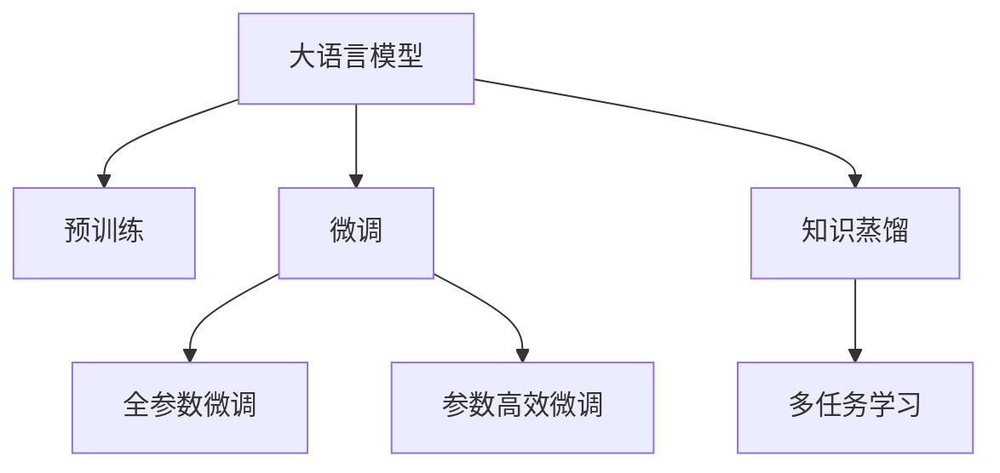

                 

# 电商平台搜索推荐系统的AI 大模型应用：提高转化率、用户体验与忠诚度

## 1. 背景介绍

随着电商平台的兴起，消费者越来越依赖在线购物。然而，如何提升搜索推荐系统的用户体验，提高转化率和用户忠诚度，成为电商平台关注的焦点。传统推荐系统往往依赖于简单的协同过滤、内容推荐等方法，难以全面理解消费者的多维度需求。而AI 大模型的引入，为电商平台带来了全新的推荐可能性，能够更好地匹配用户需求，提供个性化、精准的推荐服务。

### 1.1 问题由来

电商平台推荐系统的主要任务是帮助用户快速找到感兴趣的商品，并推荐相关商品以促进二次购买。然而，传统推荐方法存在诸多局限性：

- **精度不足**：协同过滤等方法通常依赖用户的历史行为数据，而新用户或数据稀疏用户往往无法得到有效的推荐。
- **缺少上下文理解**：缺乏对用户兴趣、商品属性等上下文信息的理解，导致推荐结果泛化能力差。
- **内容单一**：往往只关注商品属性等静态信息，难以捕捉用户动态变化的需求。
- **可扩展性差**：推荐模型通常难以处理海量数据和复杂查询，可扩展性受限。

而基于AI 大模型的推荐系统，能够通过预训练获得丰富的语言知识和语义表示，更好地理解用户需求和商品特征，提供更精准、个性化的推荐服务。

### 1.2 问题核心关键点

基于AI 大模型的推荐系统，核心在于利用预训练模型获得高层次语义表示，通过微调优化模型，使其能够更好地适应电商平台推荐任务。具体核心点包括：

- 选择合适的预训练模型（如BERT、GPT等）。
- 设计下游任务的适配层（如用户意图预测、商品推荐等）。
- 优化微调过程中的超参数（如学习率、批次大小等）。
- 应用正则化技术（如L2正则、Dropout等）防止过拟合。
- 应用数据增强技术（如近义词替换、同义词扩充等）丰富数据集。
- 引入对抗训练技术（如对抗样本生成）提升模型鲁棒性。

## 2. 核心概念与联系

### 2.1 核心概念概述

为更好地理解基于AI 大模型的电商平台推荐系统，本节将介绍几个密切相关的核心概念：

- **大语言模型**：以自回归（如GPT）或自编码（如BERT）模型为代表的通用语言模型。通过在大规模无标签文本数据上进行预训练，学习到丰富的语言知识和语义表示，具备强大的上下文理解能力。
- **预训练**：指在大规模无标签文本语料上，通过自监督学习任务训练通用语言模型的过程。常见的预训练任务包括掩码语言模型、句子相似度等。
- **微调**：指在预训练模型的基础上，使用下游任务的少量标注数据，通过有监督学习优化模型在特定任务上的性能。通常只需要调整顶层分类器或解码器，并以较小的学习率更新全部或部分模型参数。
- **迁移学习**：指将一个领域学习到的知识，迁移应用到另一个不同但相关的领域的学习范式。大模型的预训练-微调过程即是一种典型的迁移学习方式。
- **知识蒸馏**：指将一个大型模型（教师模型）的知识迁移到一个小型模型（学生模型）中，以提高后者的性能。
- **多任务学习**：指同时训练多个相关任务，共享模型的隐式知识，提高模型整体的泛化能力。

这些核心概念之间的逻辑关系可以通过以下Mermaid流程图来展示：



这个流程图展示了大语言模型的核心概念及其之间的关系：

1. 大语言模型通过预训练获得基础能力。
2. 微调是对预训练模型进行任务特定的优化，可以分为全参数微调和参数高效微调（PEFT）。
3. 知识蒸馏是一种提取大模型知识的方式，将老师模型的隐式知识迁移到学生模型中。
4. 多任务学习是一种通过同时训练多个相关任务共享知识的方式，提高模型的泛化能力。

这些概念共同构成了大语言模型的学习和应用框架，使其能够在各种场景下发挥强大的语言理解和生成能力。通过理解这些核心概念，我们可以更好地把握大语言模型的工作原理和优化方向。

## 3. 核心算法原理 & 具体操作步骤

### 3.1 算法原理概述

基于AI 大模型的电商平台推荐系统，本质上是一个有监督的细粒度迁移学习过程。其核心思想是：将预训练的大语言模型视作一个强大的"特征提取器"，通过在电商平台推荐任务的标注数据上进行有监督的微调，使得模型输出能够匹配用户需求，从而获得针对特定任务优化的模型。

形式化地，假设预训练模型为 $M_{\theta}$，其中 $\theta$ 为预训练得到的模型参数。给定电商平台推荐任务 $T$ 的标注数据集 $D=\{(x_i, y_i)\}_{i=1}^N$，微调的目标是找到新的模型参数 $\hat{\theta}$，使得：

$$
\hat{\theta}=\mathop{\arg\min}_{\theta} \mathcal{L}(M_{\theta},D)
$$

其中 $\mathcal{L}$ 为针对任务 $T$ 设计的损失函数，用于衡量模型预测输出与真实标签之间的差异。常见的损失函数包括交叉熵损失、均方误差损失等。

通过梯度下降等优化算法，微调过程不断更新模型参数 $\theta$，最小化损失函数 $\mathcal{L}$，使得模型输出逼近真实标签。由于 $\theta$ 已经通过预训练获得了较好的初始化，因此即便在电商平台推荐数据量较小的条件下，也能较快收敛到理想的模型参数 $\hat{\theta}$。

### 3.2 算法步骤详解

基于AI 大模型的电商平台推荐系统一般包括以下几个关键步骤：

**Step 1: 准备预训练模型和数据集**
- 选择合适的预训练语言模型 $M_{\theta}$ 作为初始化参数，如 BERT、GPT等。
- 准备电商平台推荐任务 $T$ 的标注数据集 $D$，划分为训练集、验证集和测试集。一般要求标注数据与预训练数据的分布不要差异过大。

**Step 2: 添加任务适配层**
- 根据任务类型，在预训练模型顶层设计合适的输出层和损失函数。
- 对于推荐任务，通常使用多类分类器输出用户的兴趣标签，并使用交叉熵损失函数。
- 对于相关商品推荐，通常使用用户-商品相关度模型，如协同过滤、深度神经网络等，并以均方误差为损失函数。

**Step 3: 设置微调超参数**
- 选择合适的优化算法及其参数，如 AdamW、SGD 等，设置学习率、批大小、迭代轮数等。
- 设置正则化技术及强度，包括权重衰减、Dropout、Early Stopping 等。
- 确定冻结预训练参数的策略，如仅微调顶层，或全部参数都参与微调。

**Step 4: 执行梯度训练**
- 将训练集数据分批次输入模型，前向传播计算损失函数。
- 反向传播计算参数梯度，根据设定的优化算法和学习率更新模型参数。
- 周期性在验证集上评估模型性能，根据性能指标决定是否触发 Early Stopping。
- 重复上述步骤直到满足预设的迭代轮数或 Early Stopping 条件。

**Step 5: 测试和部署**
- 在测试集上评估微调后模型 $M_{\hat{\theta}}$ 的性能，对比微调前后的精度提升。
- 使用微调后的模型对新样本进行推理预测，集成到实际的应用系统中。
- 持续收集新的用户行为数据，定期重新微调模型，以适应数据分布的变化。

以上是基于AI 大模型的电商平台推荐系统的一般流程。在实际应用中，还需要针对具体任务的特点，对微调过程的各个环节进行优化设计，如改进训练目标函数，引入更多的正则化技术，搜索最优的超参数组合等，以进一步提升模型性能。

### 3.3 算法优缺点

基于AI 大模型的电商平台推荐系统具有以下优点：

1. **精度高**：通过预训练获得高层次语义表示，能更好地理解用户需求和商品特征，提供更精准的推荐。
2. **泛化能力强**：大模型的预训练能捕捉到广泛的语言知识，适用于多种电商平台推荐任务。
3. **可解释性高**：通过调整适配层，可以更好地解释推荐结果的逻辑。
4. **可扩展性强**：大模型具有良好的通用性，可以应用于多种规模的电商平台。

同时，该方法也存在一定的局限性：

1. **计算资源需求高**：预训练模型通常参数量较大，需要高性能的计算资源和存储。
2. **标注成本高**：电商平台推荐任务需要标注用户行为数据，获取高质量标注数据成本较高。
3. **过拟合风险高**：电商平台数据通常具有高维稀疏性，容易过拟合。
4. **实时性差**：微调模型通常需要较长时间进行训练，难以满足实时性要求。

尽管存在这些局限性，但就目前而言，基于AI 大模型的电商平台推荐方法仍然是大规模推荐系统的重要范式。未来相关研究的重点在于如何进一步降低标注成本，提高模型的泛化能力和实时性，同时兼顾可解释性和伦理安全性等因素。

### 3.4 算法应用领域

基于AI 大模型的电商平台推荐系统已经在多个领域得到了广泛应用，例如：

- **个性化推荐**：根据用户历史行为和兴趣，推荐商品。通常使用协同过滤、深度学习等方法。
- **商品搜索**：根据用户输入的搜索关键词，推荐相关商品。通常使用语义匹配、向量检索等方法。
- **营销活动推荐**：根据用户历史行为，推荐适合的营销活动。通常使用分类模型，如多标签分类器等。
- **广告投放优化**：根据用户行为数据，优化广告投放策略。通常使用CTR预测模型，如神经网络等。
- **用户行为分析**：分析用户行为模式，预测用户需求变化。通常使用序列模型，如RNN、LSTM等。

除了上述这些经典任务外，基于AI 大模型的电商平台推荐技术也被创新性地应用到更多场景中，如个性化内容生成、跨平台推荐、实时推荐等，为电商平台带来了全新的突破。随着预训练模型和推荐方法的不断进步，相信电商平台推荐技术将在更广阔的应用领域大放异彩。

## 4. 数学模型和公式 & 详细讲解 & 举例说明

### 4.1 数学模型构建

本节将使用数学语言对基于AI 大模型的电商平台推荐过程进行更加严格的刻画。

记预训练语言模型为 $M_{\theta}$，其中 $\theta$ 为预训练得到的模型参数。假设电商平台推荐任务为 $T$，用户行为数据集为 $D=\{(x_i, y_i)\}_{i=1}^N$，其中 $x_i$ 为用户行为记录，$y_i$ 为用户兴趣标签。

定义模型 $M_{\theta}$ 在用户行为数据 $(x,y)$ 上的损失函数为 $\ell(M_{\theta}(x),y)$，则在数据集 $D$ 上的经验风险为：

$$
\mathcal{L}(\theta) = \frac{1}{N}\sum_{i=1}^N \ell(M_{\theta}(x_i),y_i)
$$

微调的优化目标是最小化经验风险，即找到最优参数：

$$
\theta^* = \mathop{\arg\min}_{\theta} \mathcal{L}(\theta)
$$

在实践中，我们通常使用基于梯度的优化算法（如SGD、Adam等）来近似求解上述最优化问题。设 $\eta$ 为学习率，$\lambda$ 为正则化系数，则参数的更新公式为：

$$
\theta \leftarrow \theta - \eta \nabla_{\theta}\mathcal{L}(\theta) - \eta\lambda\theta
$$

其中 $\nabla_{\theta}\mathcal{L}(\theta)$ 为损失函数对参数 $\theta$ 的梯度，可通过反向传播算法高效计算。

### 4.2 公式推导过程

以下我们以推荐任务为例，推导交叉熵损失函数及其梯度的计算公式。

假设模型 $M_{\theta}$ 在输入 $x$ 上的输出为 $\hat{y}=M_{\theta}(x) \in [0,1]$，表示用户行为记录 $x$ 对应的兴趣概率。真实标签 $y \in \{0,1\}$。则二分类交叉熵损失函数定义为：

$$
\ell(M_{\theta}(x),y) = -[y\log \hat{y} + (1-y)\log (1-\hat{y})]
$$

将其代入经验风险公式，得：

$$
\mathcal{L}(\theta) = -\frac{1}{N}\sum_{i=1}^N [y_i\log M_{\theta}(x_i)+(1-y_i)\log(1-M_{\theta}(x_i))]
$$

根据链式法则，损失函数对参数 $\theta_k$ 的梯度为：

$$
\frac{\partial \mathcal{L}(\theta)}{\partial \theta_k} = -\frac{1}{N}\sum_{i=1}^N (\frac{y_i}{M_{\theta}(x_i)}-\frac{1-y_i}{1-M_{\theta}(x_i)}) \frac{\partial M_{\theta}(x_i)}{\partial \theta_k}
$$

其中 $\frac{\partial M_{\theta}(x_i)}{\partial \theta_k}$ 可进一步递归展开，利用自动微分技术完成计算。

在得到损失函数的梯度后，即可带入参数更新公式，完成模型的迭代优化。重复上述过程直至收敛，最终得到适应电商平台推荐任务的最优模型参数 $\theta^*$。

## 5. 项目实践：代码实例和详细解释说明

### 5.1 开发环境搭建

在进行推荐系统开发前，我们需要准备好开发环境。以下是使用Python进行PyTorch开发的环境配置流程：

1. 安装Anaconda：从官网下载并安装Anaconda，用于创建独立的Python环境。

2. 创建并激活虚拟环境：
```bash
conda create -n pytorch-env python=3.8 
conda activate pytorch-env
```

3. 安装PyTorch：根据CUDA版本，从官网获取对应的安装命令。例如：
```bash
conda install pytorch torchvision torchaudio cudatoolkit=11.1 -c pytorch -c conda-forge
```

4. 安装Transformers库：
```bash
pip install transformers
```

5. 安装各类工具包：
```bash
pip install numpy pandas scikit-learn matplotlib tqdm jupyter notebook ipython
```

完成上述步骤后，即可在`pytorch-env`环境中开始推荐系统开发。

### 5.2 源代码详细实现

这里我们以电商平台推荐系统为例，给出使用Transformers库对BERT模型进行推荐系统开发的PyTorch代码实现。

首先，定义推荐系统所需的数据处理函数：

```python
from transformers import BertTokenizer
from torch.utils.data import Dataset
import torch

class RecommendationDataset(Dataset):
    def __init__(self, user_beqhaviors, item_features, tokenizer, max_len=128):
        self.user_beqhaviors = user_beqhaviors
        self.item_features = item_features
        self.tokenizer = tokenizer
        self.max_len = max_len
        
    def __len__(self):
        return len(self.user_beqhaviors)
    
    def __getitem__(self, item):
        user_beqhavior = self.user_beqhaviors[item]
        item_feature = self.item_features[item]
        
        # 对用户行为记录进行tokenization
        encoding = self.tokenizer(user_beqhavior, return_tensors='pt', max_length=self.max_len, padding='max_length', truncation=True)
        user_input_ids = encoding['input_ids'][0]
        user_attention_mask = encoding['attention_mask'][0]
        
        # 对商品特征进行tokenization
        encoding = self.tokenizer(item_feature, return_tensors='pt', max_length=self.max_len, padding='max_length', truncation=True)
        item_input_ids = encoding['input_ids'][0]
        item_attention_mask = encoding['attention_mask'][0]
        
        return {'user_input_ids': user_input_ids, 
                'user_attention_mask': user_attention_mask,
                'item_input_ids': item_input_ids,
                'item_attention_mask': item_attention_mask}
```

然后，定义模型和优化器：

```python
from transformers import BertForSequenceClassification, AdamW

model = BertForSequenceClassification.from_pretrained('bert-base-cased', num_labels=2)

optimizer = AdamW(model.parameters(), lr=2e-5)
```

接着，定义训练和评估函数：

```python
from torch.utils.data import DataLoader
from tqdm import tqdm
from sklearn.metrics import classification_report

device = torch.device('cuda') if torch.cuda.is_available() else torch.device('cpu')
model.to(device)

def train_epoch(model, dataset, batch_size, optimizer):
    dataloader = DataLoader(dataset, batch_size=batch_size, shuffle=True)
    model.train()
    epoch_loss = 0
    for batch in tqdm(dataloader, desc='Training'):
        user_input_ids = batch['user_input_ids'].to(device)
        user_attention_mask = batch['user_attention_mask'].to(device)
        item_input_ids = batch['item_input_ids'].to(device)
        item_attention_mask = batch['item_attention_mask'].to(device)
        model.zero_grad()
        outputs = model(user_input_ids, user_attention_mask, item_input_ids, item_attention_mask)
        loss = outputs.loss
        epoch_loss += loss.item()
        loss.backward()
        optimizer.step()
    return epoch_loss / len(dataloader)

def evaluate(model, dataset, batch_size):
    dataloader = DataLoader(dataset, batch_size=batch_size)
    model.eval()
    preds, labels = [], []
    with torch.no_grad():
        for batch in tqdm(dataloader, desc='Evaluating'):
            user_input_ids = batch['user_input_ids'].to(device)
            user_attention_mask = batch['user_attention_mask'].to(device)
            item_input_ids = batch['item_input_ids'].to(device)
            item_attention_mask = batch['item_attention_mask'].to(device)
            batch_labels = batch['labels'].to(device)
            outputs = model(user_input_ids, user_attention_mask, item_input_ids, item_attention_mask)
            batch_preds = outputs.logits.argmax(dim=2).to('cpu').tolist()
            batch_labels = batch_labels.to('cpu').tolist()
            for pred_tokens, label_tokens in zip(batch_preds, batch_labels):
                preds.append(pred_tokens[:len(label_tokens)])
                labels.append(label_tokens)
                
    print(classification_report(labels, preds))
```

最后，启动训练流程并在测试集上评估：

```python
epochs = 5
batch_size = 16

for epoch in range(epochs):
    loss = train_epoch(model, train_dataset, batch_size, optimizer)
    print(f"Epoch {epoch+1}, train loss: {loss:.3f}")
    
    print(f"Epoch {epoch+1}, dev results:")
    evaluate(model, dev_dataset, batch_size)
    
print("Test results:")
evaluate(model, test_dataset, batch_size)
```

以上就是使用PyTorch对BERT进行推荐系统开发的完整代码实现。可以看到，得益于Transformers库的强大封装，我们可以用相对简洁的代码完成BERT模型的加载和推荐系统开发。

### 5.3 代码解读与分析

让我们再详细解读一下关键代码的实现细节：

**RecommendationDataset类**：
- `__init__`方法：初始化用户行为数据、商品特征、分词器等关键组件。
- `__len__`方法：返回数据集的样本数量。
- `__getitem__`方法：对单个样本进行处理，将用户行为记录和商品特征输入编码为token ids，并对其进行定长padding，最终返回模型所需的输入。

**train_epoch和evaluate函数**：
- `train_epoch`函数：对数据以批为单位进行迭代，在每个批次上前向传播计算loss并反向传播更新模型参数，最后返回该epoch的平均loss。
- `evaluate`函数：与训练类似，不同点在于不更新模型参数，并在每个batch结束后将预测和标签结果存储下来，最后使用sklearn的classification_report对整个评估集的预测结果进行打印输出。

**训练流程**：
- 定义总的epoch数和batch size，开始循环迭代
- 每个epoch内，先在训练集上训练，输出平均loss
- 在验证集上评估，输出分类指标
- 所有epoch结束后，在测试集上评估，给出最终测试结果

可以看到，PyTorch配合Transformers库使得BERT推荐系统的代码实现变得简洁高效。开发者可以将更多精力放在数据处理、模型改进等高层逻辑上，而不必过多关注底层的实现细节。

当然，工业级的系统实现还需考虑更多因素，如模型的保存和部署、超参数的自动搜索、更灵活的任务适配层等。但核心的微调范式基本与此类似。

## 6. 实际应用场景
### 6.1 电商平台搜索推荐系统

基于大模型微调的推荐系统可以广泛应用于电商平台搜索推荐。传统推荐系统往往依赖用户的历史行为数据，难以处理新用户或数据稀疏用户。而使用预训练模型作为特征提取器，通过微调优化模型，可以在较小的标注数据下获得更好的推荐效果。

在技术实现上，可以收集用户的历史浏览、点击、购买等行为数据，以及商品的标题、描述、标签等文本内容。将文本内容作为模型输入，用户的后续行为（如是否点击、购买等）作为监督信号，在此基础上微调预训练语言模型。微调后的模型能够从文本内容中准确把握用户的兴趣点，从而提供更精准的推荐结果。

### 6.2 智能客服系统

智能客服系统利用预训练语言模型对用户输入的自然语言进行理解，并基于历史数据和知识库进行回答。在实际应用中，可以通过微调优化模型，使其能够更准确地理解用户意图，生成更自然的对话，提升用户体验。

具体而言，可以收集用户的历史聊天记录和问题记录，将问题和最佳答复构建成监督数据，在此基础上对预训练对话模型进行微调。微调后的对话模型能够自动理解用户意图，匹配最合适的答案模板进行回复。对于用户提出的新问题，还可以接入检索系统实时搜索相关内容，动态组织生成回答。如此构建的智能客服系统，能大幅提升客户咨询体验和问题解决效率。

### 6.3 医疗诊断推荐系统

医疗诊断推荐系统利用预训练语言模型对患者的症状描述进行理解，并基于医生的知识库和经验进行诊断推荐。在实际应用中，可以通过微调优化模型，使其能够更准确地理解症状描述，生成更合理的诊断建议。

具体而言，可以收集患者的症状描述和医生的诊断记录，将症状-诊断对作为微调数据，训练模型学习匹配症状和诊断。微调后的模型能够自动理解患者的症状描述，匹配最合适的诊断建议。在用户输入症状描述后，系统自动给出诊断推荐，并提示用户进行后续的检查和治疗。

### 6.4 未来应用展望

随着大模型和微调方法的不断发展，基于AI 大模型的推荐系统将在更多领域得到应用，为各行各业带来变革性影响。

在智慧医疗领域，基于微调的医疗推荐系统可以提升医生的诊断和治疗建议，提高医疗服务的智能化水平，加速新药开发进程。

在智能教育领域，微调技术可应用于作业批改、学情分析、知识推荐等方面，因材施教，促进教育公平，提高教学质量。

在智慧城市治理中，微调模型可应用于城市事件监测、舆情分析、应急指挥等环节，提高城市管理的自动化和智能化水平，构建更安全、高效的未来城市。

此外，在企业生产、社会治理、文娱传媒等众多领域，基于AI 大模型的推荐系统也将不断涌现，为经济社会发展注入新的动力。相信随着技术的日益成熟，微调方法将成为推荐系统落地的重要范式，推动人工智能技术在垂直行业的规模化落地。总之，微调需要开发者根据具体任务，不断迭代和优化模型、数据和算法，方能得到理想的效果。

## 7. 工具和资源推荐
### 7.1 学习资源推荐

为了帮助开发者系统掌握大语言模型微调的理论基础和实践技巧，这里推荐一些优质的学习资源：

1. 《Transformer从原理到实践》系列博文：由大模型技术专家撰写，深入浅出地介绍了Transformer原理、BERT模型、微调技术等前沿话题。

2. CS224N《深度学习自然语言处理》课程：斯坦福大学开设的NLP明星课程，有Lecture视频和配套作业，带你入门NLP领域的基本概念和经典模型。

3. 《Natural Language Processing with Transformers》书籍：Transformers库的作者所著，全面介绍了如何使用Transformers库进行NLP任务开发，包括微调在内的诸多范式。

4. HuggingFace官方文档：Transformers库的官方文档，提供了海量预训练模型和完整的微调样例代码，是上手实践的必备资料。

5. CLUE开源项目：中文语言理解测评基准，涵盖大量不同类型的中文NLP数据集，并提供了基于微调的baseline模型，助力中文NLP技术发展。

通过对这些资源的学习实践，相信你一定能够快速掌握大语言模型微调的精髓，并用于解决实际的NLP问题。
###  7.2 开发工具推荐

高效的开发离不开优秀的工具支持。以下是几款用于大语言模型微调开发的常用工具：

1. PyTorch：基于Python的开源深度学习框架，灵活动态的计算图，适合快速迭代研究。大部分预训练语言模型都有PyTorch版本的实现。

2. TensorFlow：由Google主导开发的开源深度学习框架，生产部署方便，适合大规模工程应用。同样有丰富的预训练语言模型资源。

3. Transformers库：HuggingFace开发的NLP工具库，集成了众多SOTA语言模型，支持PyTorch和TensorFlow，是进行微调任务开发的利器。

4. Weights & Biases：模型训练的实验跟踪工具，可以记录和可视化模型训练过程中的各项指标，方便对比和调优。与主流深度学习框架无缝集成。

5. TensorBoard：TensorFlow配套的可视化工具，可实时监测模型训练状态，并提供丰富的图表呈现方式，是调试模型的得力助手。

6. Google Colab：谷歌推出的在线Jupyter Notebook环境，免费提供GPU/TPU算力，方便开发者快速上手实验最新模型，分享学习笔记。

合理利用这些工具，可以显著提升大语言模型微调任务的开发效率，加快创新迭代的步伐。

### 7.3 相关论文推荐

大语言模型和微调技术的发展源于学界的持续研究。以下是几篇奠基性的相关论文，推荐阅读：

1. Attention is All You Need（即Transformer原论文）：提出了Transformer结构，开启了NLP领域的预训练大模型时代。

2. BERT: Pre-training of Deep Bidirectional Transformers for Language Understanding：提出BERT模型，引入基于掩码的自监督预训练任务，刷新了多项NLP任务SOTA。

3. Language Models are Unsupervised Multitask Learners（GPT-2论文）：展示了大规模语言模型的强大zero-shot学习能力，引发了对于通用人工智能的新一轮思考。

4. Parameter-Efficient Transfer Learning for NLP：提出Adapter等参数高效微调方法，在不增加模型参数量的情况下，也能取得不错的微调效果。

5. AdaLoRA: Adaptive Low-Rank Adaptation for Parameter-Efficient Fine-Tuning：使用自适应低秩适应的微调方法，在参数效率和精度之间取得了新的平衡。

这些论文代表了大语言模型微调技术的发展脉络。通过学习这些前沿成果，可以帮助研究者把握学科前进方向，激发更多的创新灵感。

## 8. 总结：未来发展趋势与挑战

### 8.1 总结

本文对基于AI 大模型的电商平台推荐系统进行了全面系统的介绍。首先阐述了大语言模型和微调技术的研究背景和意义，明确了微调在拓展预训练模型应用、提升推荐系统精度方面的独特价值。其次，从原理到实践，详细讲解了微调过程的数学模型和关键步骤，给出了推荐系统开发的完整代码实例。同时，本文还广泛探讨了微调方法在电商平台推荐、智能客服、医疗诊断等多个行业领域的应用前景，展示了微调范式的巨大潜力。此外，本文精选了微调技术的各类学习资源，力求为读者提供全方位的技术指引。

通过本文的系统梳理，可以看到，基于AI 大模型的推荐系统正在成为电商平台的推荐推荐系统的核心范式，极大地拓展了预训练模型推荐系统的应用边界，催生了更多的落地场景。受益于大规模语料的预训练，推荐系统在推荐精度、个性化程度等方面取得了显著的提升。未来，伴随预训练语言模型和微调方法的不断进步，相信推荐系统将在更广阔的应用领域大放异彩，深刻影响电商平台的用户体验和忠诚度。

### 8.2 未来发展趋势

展望未来，基于AI 大模型的推荐系统将呈现以下几个发展趋势：

1. **精度提升**：大模型通过预训练获得高层次语义表示，能更好地理解用户需求和商品特征，提供更精准的推荐。未来可以通过引入更多的上下文信息，如商品属性、用户评价等，进一步提升推荐精度。

2. **泛化能力增强**：大模型的预训练能捕捉到广泛的语言知识，适用于多种推荐任务。未来可以通过引入多任务学习，共享模型隐式知识，提高模型的泛化能力。

3. **实时性提升**：微调模型通常需要较长时间进行训练，难以满足实时性要求。未来可以通过模型压缩、模型蒸馏等技术，减小模型规模，提升推理速度，实现实时推荐。

4. **个性化推荐**：基于用户行为数据和上下文信息，提供更个性化、精准的推荐。未来可以通过引入知识图谱、兴趣图谱等，丰富推荐内容的多样性和深度。

5. **多模态推荐**：推荐系统不仅考虑文本信息，还需引入图像、音频等多模态信息，丰富推荐内容的表现形式。

6. **推荐系统自适应**：推荐系统能根据用户反馈实时调整推荐策略，提升用户体验。未来可以通过强化学习、多臂老虎机等算法，提升推荐系统的自适应能力。

以上趋势凸显了基于AI 大模型的推荐系统的广阔前景。这些方向的探索发展，必将进一步提升推荐系统的性能和应用范围，为电商平台带来更多的用户价值。

### 8.3 面临的挑战

尽管基于AI 大模型的推荐系统已经取得了瞩目成就，但在迈向更加智能化、普适化应用的过程中，它仍面临着诸多挑战：

1. **标注成本高**：推荐系统需要标注用户行为数据，获取高质量标注数据成本较高。如何进一步降低标注成本，提高推荐系统的效果，将是重要的研究方向。

2. **数据隐私问题**：推荐系统依赖用户行为数据，涉及隐私保护问题。如何在保护用户隐私的同时，提供优质的推荐服务，将是一个重要的挑战。

3. **模型可解释性差**：推荐系统通常是一个"黑盒"系统，难以解释其内部工作机制和决策逻辑。对于医疗、金融等高风险应用，算法的可解释性和可审计性尤为重要。如何赋予推荐系统更强的可解释性，将是亟待攻克的难题。

4. **鲁棒性不足**：推荐系统在处理噪声、异常数据时表现不佳，容易过拟合。如何提高推荐系统的鲁棒性，防止灾难性遗忘，还需要更多理论和实践的积累。

5. **实时性差**：微调模型通常需要较长时间进行训练，难以满足实时性要求。如何通过模型压缩、模型蒸馏等技术，减小模型规模，提升推理速度，实现实时推荐，将是重要的研究方向。

6. **推荐系统的公平性**：推荐系统容易引入偏见，导致不公平的推荐结果。如何在设计推荐算法时消除偏见，保证推荐公平性，将是重要的研究方向。

这些挑战凸显了基于AI 大模型的推荐系统在实际应用中的困难，需要进一步研究和改进。

### 8.4 研究展望

面对AI 大模型推荐系统面临的挑战，未来的研究需要在以下几个方面寻求新的突破：

1. **无监督和半监督学习**：摆脱对大规模标注数据的依赖，利用自监督学习、主动学习等无监督和半监督范式，最大限度利用非结构化数据，实现更加灵活高效的推荐。

2. **参数高效微调和计算高效微调**：开发更加参数高效的微调方法，在固定大部分预训练参数的同时，只更新极少量的任务相关参数。同时优化微调模型的计算图，减少前向传播和反向传播的资源消耗，实现更加轻量级、实时性的部署。

3. **多任务学习和跨模态学习**：引入更多任务，共享模型隐式知识，提高模型的泛化能力。同时引入多模态信息，丰富推荐内容的表现形式。

4. **增强推荐系统的可解释性和公平性**：在推荐系统设计中引入可解释性导向的评估指标，过滤和惩罚有偏见、有害的推荐结果。同时加强人工干预和审核，建立推荐系统的监管机制。

5. **引入因果推断和强化学习**：通过引入因果推断和强化学习，增强推荐系统建立稳定因果关系的能力，学习更加普适、鲁棒的语言表征，从而提升模型泛化性和抗干扰能力。

这些研究方向将引领AI 大模型推荐系统迈向更高的台阶，为推荐系统带来更多的用户价值。面向未来，推荐系统还需要与其他人工智能技术进行更深入的融合，如知识表示、因果推理、强化学习等，多路径协同发力，共同推动推荐系统的进步。只有勇于创新、敢于突破，才能不断拓展推荐系统的边界，让推荐系统更好地造福人类社会。

## 9. 附录：常见问题与解答

**Q1：大模型微调是否适用于所有电商平台推荐任务？**

A: 大模型微调在大多数电商平台推荐任务上都能取得不错的效果，特别是对于数据量较小的任务。但对于一些特定领域的任务，如医学、法律等，仅仅依靠通用语料预训练的模型可能难以很好地适应。此时需要在特定领域语料上进一步预训练，再进行微调，才能获得理想效果。此外，对于一些需要时效性、个性化很强的任务，如对话、推荐等，微调方法也需要针对性的改进优化。

**Q2：微调过程中如何选择合适的学习率？**

A: 微调的学习率一般要比预训练时小1-2个数量级，如果使用过大的学习率，容易破坏预训练权重，导致过拟合。一般建议从1e-5开始调参，逐步减小学习率，直至收敛。也可以使用warmup策略，在开始阶段使用较小的学习率，再逐渐过渡到预设值。需要注意的是，不同的优化器(如AdamW、Adafactor等)以及不同的学习率调度策略，可能需要设置不同的学习率阈值。

**Q3：采用大模型微调时会面临哪些资源瓶颈？**

A: 目前主流的预训练大模型动辄以亿计的参数规模，对算力、内存、存储都提出了很高的要求。GPU/TPU等高性能设备是必不可少的，但即便如此，超大批次的训练和推理也可能遇到显存不足的问题。因此需要采用一些资源优化技术，如梯度积累、混合精度训练、模型并行等，来突破硬件瓶颈。同时，模型的存储和读取也可能占用大量时间和空间，需要采用模型压缩、稀疏化存储等方法进行优化。

**Q4：如何缓解微调过程中的过拟合问题？**

A: 过拟合是微调面临的主要挑战，尤其是在标注数据不足的情况下。常见的缓解策略包括：
1. 数据增强：通过回译、近义词替换等方式扩充训练集
2. 正则化：使用L2正则、Dropout、Early Stopping等避免过拟合
3. 对抗训练：引入对抗样本，提高模型鲁棒性
4. 参数高效微调：只调整少量参数(如Adapter、Prefix等)，减小过拟合风险
5. 多模型集成：训练多个微调模型，取平均输出，抑制过拟合

这些策略往往需要根据具体任务和数据特点进行灵活组合。只有在数据、模型、训练、推理等各环节进行全面优化，才能最大限度地发挥大模型微调的威力。

**Q5：微调模型在落地部署时需要注意哪些问题？**

A: 将微调模型转化为实际应用，还需要考虑以下因素：
1. 模型裁剪：去除不必要的层和参数，减小模型尺寸，加快推理速度
2. 量化加速：将浮点模型转为定点模型，压缩存储空间，提高计算效率
3. 服务化封装：将模型封装为标准化服务接口，便于集成调用
4. 弹性伸缩：根据请求流量动态调整资源配置，平衡服务质量和成本
5. 监控告警：实时采集系统指标，设置异常告警阈值，确保服务稳定性
6. 安全防护：采用访问鉴权、数据脱敏等措施，保障数据和模型安全

大语言模型微调为电商平台推荐系统带来了全新的推荐可能性，但如何将强大的性能转化为稳定、高效、安全的业务价值，还需要工程实践的不断打磨。唯有从数据、算法、工程、业务等多个维度协同发力，才能真正实现人工智能技术在垂直行业的规模化落地。总之，微调需要开发者根据具体任务，不断迭代和优化模型、数据和算法，方能得到理想的效果。

