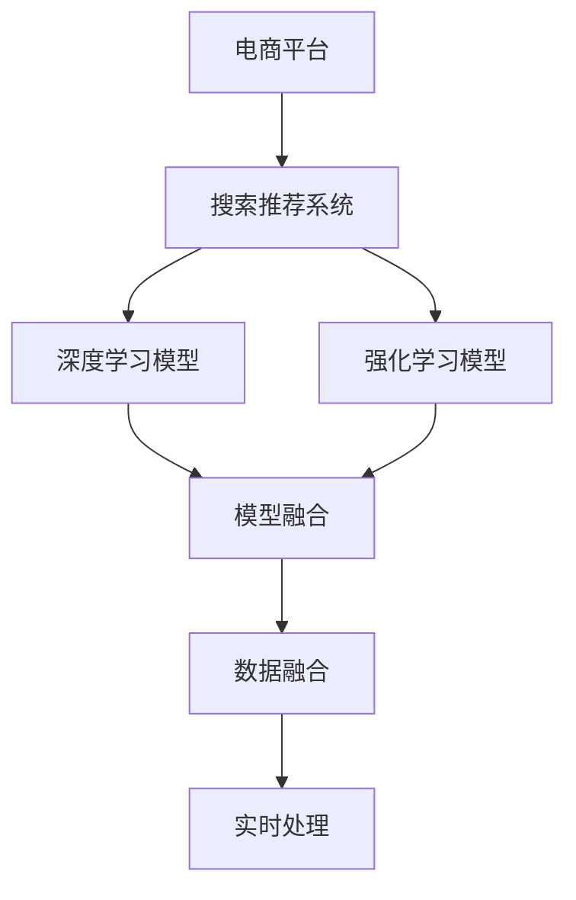

                 

# 电商平台搜索推荐系统的AI 大模型融合：应对实时数据处理的挑战

> 关键词：电商平台,搜索推荐系统,大模型融合,实时数据处理,深度学习,强化学习,高性能计算

## 1. 背景介绍

### 1.1 问题由来
在现代电商平台中，搜索推荐系统（Search & Recommendation System, S&RS）已成为提升用户体验和销售转化率的关键引擎。通过精准推荐个性化的商品信息，搜索推荐系统能够帮助用户快速定位感兴趣的商品，提升购买转化率和购物满意度。然而，在数据量不断膨胀、用户需求日益多样化的今天，传统的基于规则或浅层模型的推荐系统已经难以满足复杂多变的市场需要。大模型融合技术应运而生，通过将深度学习、强化学习等先进AI技术引入推荐系统，显著提升了模型的泛化能力和预测精度，带来了革命性的推荐效果。

### 1.2 问题核心关键点
大模型融合技术在电商平台中的应用，核心在于将深度学习和强化学习等先进AI模型融合到搜索推荐系统，以应对实时数据处理的挑战。具体来说，其关键点包括：
1. **数据融合**：通过数据清洗、集成、归一化等技术，将各种类型的数据（如用户行为数据、商品信息、社交网络数据等）整合到统一的数据源中，为深度学习模型提供丰富的训练材料。
2. **模型融合**：在深度学习模型的基础上，引入强化学习等技术，通过模拟用户行为和反馈机制，优化模型参数，提升模型的预测能力和用户满意度。
3. **实时处理**：采用高性能计算和分布式存储技术，实现对海量数据的实时处理和分析，确保搜索推荐系统能够快速响应用户查询和反馈。

### 1.3 问题研究意义
大模型融合技术在电商平台中的应用，具有以下重要意义：
1. **提升用户体验**：通过深度学习模型的强大表示能力，推荐系统能够提供更加个性化和精准的商品推荐，满足用户多样化需求。
2. **优化库存管理**：通过强化学习模型对用户行为的预测，电商平台能够更好地管理库存，避免供需错位和过度库存。
3. **增加销售转化率**：通过智能推荐，提升用户购买决策效率，增加销售额，降低运营成本。
4. **推动产业升级**：大模型融合技术将AI引入传统电商，推动电商产业向智能化、自动化方向发展，促进数字经济增长。

## 2. 核心概念与联系

### 2.1 核心概念概述

为更好地理解大模型融合在电商平台中的应用，本节将介绍几个密切相关的核心概念：

- **电商平台**：通过线上商店销售商品的电子商务平台。
- **搜索推荐系统**：使用AI技术对用户搜索历史、浏览行为、评分等数据进行分析，预测用户兴趣，推荐商品的系统。
- **深度学习**：基于神经网络模型的学习范式，通过多层次特征提取和映射，实现对复杂数据的建模和预测。
- **强化学习**：通过模拟环境交互，优化模型参数，使得模型在特定任务上表现出最佳性能。
- **大模型融合**：将多个深度学习和强化学习模型融合到一个系统中，通过协同学习提升整体性能。

这些核心概念之间的逻辑关系可以通过以下Mermaid流程图来展示：



这个流程图展示了从电商平台到搜索推荐系统的核心概念及其之间的关系：

1. 电商平台通过搜索推荐系统为用户提供个性化商品推荐。
2. 搜索推荐系统使用深度学习和强化学习模型进行用户行为分析和商品推荐。
3. 深度学习模型和强化学习模型通过模型融合技术协同优化，提升推荐效果。
4. 模型融合技术利用数据融合技术获取多源数据，提升模型的泛化能力和表现。
5. 实时处理技术确保模型能够快速响应用户查询和反馈，提高用户体验。

## 3. 核心算法原理 & 具体操作步骤
### 3.1 算法原理概述

大模型融合在电商平台中的应用，核心在于通过深度学习和强化学习的协同优化，提升搜索推荐系统的性能。其核心思想是：将深度学习模型和强化学习模型融合到一个系统中，通过协同学习提升整体性能。具体来说，其数学原理可以概括为：

$$
\max_{\theta} \sum_{i=1}^N [R_i(a_i; \theta)]
$$

其中，$R_i$ 为在第 $i$ 个时间步的奖励函数，$a_i$ 为在第 $i$ 个时间步采取的动作，$\theta$ 为模型参数。即通过最大化长期奖励，优化模型参数。

### 3.2 算法步骤详解

大模型融合在电商平台中的应用，通常包括以下几个关键步骤：

**Step 1: 数据融合**
- 收集电商平台的各类数据，包括用户行为数据、商品信息、社交网络数据等。
- 对数据进行清洗、归一化、集成等预处理操作，确保数据的质量和一致性。
- 使用数据融合技术，如数据聚合、特征工程等，将多源数据整合到统一的数据源中。

**Step 2: 模型融合**
- 选择合适的深度学习模型，如卷积神经网络（CNN）、循环神经网络（RNN）、Transformer等，用于特征提取和表示学习。
- 引入强化学习技术，如Q-learning、策略梯度（Policy Gradient）等，通过模拟用户行为和反馈机制，优化模型参数。
- 使用模型融合技术，如Stacking、Boosting、集成学习等，将多个深度学习和强化学习模型融合到一个系统中，提升整体性能。

**Step 3: 实时处理**
- 使用高性能计算和分布式存储技术，实现对海量数据的实时处理和分析。
- 通过流式计算和实时存储，确保搜索推荐系统能够快速响应用户查询和反馈。
- 采用模型压缩、模型并行等技术，优化模型推理速度和计算效率。

**Step 4: 模型评估与优化**
- 在验证集上评估模型的性能，使用准确率、召回率、F1-score等指标进行评估。
- 根据评估结果，调整模型参数和超参数，进行模型优化和调参。
- 使用A/B测试等方法，评估模型的实际效果，确保模型能够在实际场景中发挥作用。

### 3.3 算法优缺点

大模型融合在电商平台中的应用，具有以下优点：
1. **提高推荐精度**：通过深度学习模型的强大表示能力，推荐系统能够提供更加个性化和精准的商品推荐，满足用户多样化需求。
2. **优化库存管理**：通过强化学习模型对用户行为的预测，电商平台能够更好地管理库存，避免供需错位和过度库存。
3. **增加销售转化率**：通过智能推荐，提升用户购买决策效率，增加销售额，降低运营成本。
4. **提升用户体验**：通过实时处理技术，确保搜索推荐系统能够快速响应用户查询和反馈，提高用户体验。

同时，该方法也存在一定的局限性：
1. **数据依赖性强**：电商平台的推荐系统高度依赖于用户行为数据，一旦数据质量不佳，推荐效果将大打折扣。
2. **计算资源消耗大**：深度学习模型和强化学习模型的训练和推理计算量较大，对计算资源要求较高。
3. **模型复杂度高**：多个模型的融合带来了较高的模型复杂度，增加了模型的可解释性和调参难度。
4. **实时处理挑战大**：电商平台数据量大、实时性要求高，对实时处理技术的挑战较大。

尽管存在这些局限性，但就目前而言，大模型融合仍是电商平台推荐系统的重要范式。未来相关研究的重点在于如何进一步降低数据依赖，提高计算效率，简化模型结构，优化实时处理技术，从而提升推荐系统的性能和应用范围。

### 3.4 算法应用领域

大模型融合在电商平台中的应用，已广泛应用于以下领域：

- **个性化推荐**：通过深度学习和强化学习模型，分析用户行为数据，提供个性化商品推荐。
- **实时搜索**：使用深度学习模型对用户查询进行语义理解，返回相关商品列表。
- **智能客服**：利用深度学习和强化学习技术，实现自动化客服对话，提升用户体验。
- **库存管理**：通过强化学习模型对用户行为进行预测，优化库存管理和补货策略。
- **营销优化**：使用深度学习模型分析用户行为和交易数据，优化营销策略和广告投放。

除了上述这些领域外，大模型融合还被创新性地应用于供应链管理、物流优化、用户行为分析等更多场景中，为电商平台带来了新的应用方向和价值。

## 4. 数学模型和公式 & 详细讲解 & 举例说明

### 4.1 数学模型构建

本节将使用数学语言对大模型融合在电商平台中的应用进行更加严格的刻画。

记电商平台为 $E$，用户为 $U$，商品为 $I$。电商平台搜索推荐系统 $SRS$ 的输入为 $X$，输出为 $Y$，其中 $X$ 为用户查询，$Y$ 为推荐商品列表。记深度学习模型为 $DLM$，强化学习模型为 $RLM$，则大模型融合的数学模型可以表示为：

$$
SRS = DLM \otimes RLM
$$

其中 $\otimes$ 表示模型融合操作。

### 4.2 公式推导过程

以下我们以电商平台个性化推荐为例，推导深度学习模型和强化学习模型的融合公式。

假设电商平台中每个用户 $u$ 对商品 $i$ 的评分 $r_{ui}$ 为二元值，即 $r_{ui} \in \{0, 1\}$。则推荐系统的目标是最小化预测评分与实际评分的差距。假设深度学习模型和强化学习模型的预测评分分别为 $p_{ui}$ 和 $q_{ui}$，则推荐系统的目标可以表示为：

$$
\min_{DLM, RLM} \sum_{u,i} (r_{ui} - p_{ui})^2 + (r_{ui} - q_{ui})^2
$$

其中 $p_{ui} = DLM(X_u; \theta_D)$，$q_{ui} = RLM(X_u; \theta_R)$，$\theta_D$ 和 $\theta_R$ 分别为深度学习模型和强化学习模型的参数。

根据上述目标函数，可以求解深度学习模型和强化学习模型的融合参数。通常采用交替最小化算法（Alternating Minimization）求解，即交替优化深度学习模型和强化学习模型的参数，直至收敛。

### 4.3 案例分析与讲解

**案例一：电商平台个性化推荐**

假设有一个电商平台，其中包含100万个用户和100万个商品，每个用户对每个商品的评分。电商平台希望通过深度学习模型和强化学习模型进行个性化推荐。

首先，使用深度学习模型对用户查询进行特征提取，生成用户表示 $X_u$。然后，使用强化学习模型对用户表示进行优化，生成推荐商品列表 $Y$。最终，将深度学习模型和强化学习模型融合，生成推荐结果。

**案例二：实时搜索**

假设电商平台希望通过深度学习模型和强化学习模型进行实时搜索。用户在搜索框中输入查询 $X$，深度学习模型对查询进行语义理解，生成查询表示 $X'$。然后，使用强化学习模型对查询表示进行优化，生成相关商品列表 $Y'$。最终，将深度学习模型和强化学习模型融合，生成推荐结果。

## 5. 项目实践：代码实例和详细解释说明
### 5.1 开发环境搭建

在进行大模型融合的实践前，我们需要准备好开发环境。以下是使用Python进行PyTorch开发的环境配置流程：

1. 安装Anaconda：从官网下载并安装Anaconda，用于创建独立的Python环境。

2. 创建并激活虚拟环境：
```bash
conda create -n pytorch-env python=3.8 
conda activate pytorch-env
```

3. 安装PyTorch：根据CUDA版本，从官网获取对应的安装命令。例如：
```bash
conda install pytorch torchvision torchaudio cudatoolkit=11.1 -c pytorch -c conda-forge
```

4. 安装TensorFlow：
```bash
pip install tensorflow==2.7
```

5. 安装TensorBoard：
```bash
pip install tensorboard
```

6. 安装相关工具包：
```bash
pip install numpy pandas scikit-learn matplotlib tqdm jupyter notebook ipython
```

完成上述步骤后，即可在`pytorch-env`环境中开始实践。

### 5.2 源代码详细实现

下面我们以电商平台的个性化推荐为例，给出使用PyTorch进行深度学习模型和强化学习模型融合的代码实现。

首先，定义深度学习模型：

```python
import torch.nn as nn
import torch.optim as optim

class DeepLearningModel(nn.Module):
    def __init__(self, input_size, hidden_size, output_size):
        super(DeepLearningModel, self).__init__()
        self.fc1 = nn.Linear(input_size, hidden_size)
        self.fc2 = nn.Linear(hidden_size, output_size)
        self.relu = nn.ReLU()

    def forward(self, x):
        x = self.fc1(x)
        x = self.relu(x)
        x = self.fc2(x)
        return x

# 定义损失函数
criterion = nn.BCELoss()

# 定义优化器
optimizer = optim.Adam(model.parameters(), lr=0.001)
```

然后，定义强化学习模型：

```python
import torch
import torch.nn as nn
import torch.optim as optim
import torch.distributions as dist

class ReinforcementLearningModel(nn.Module):
    def __init__(self, input_size, hidden_size, output_size):
        super(ReinforcementLearningModel, self).__init__()
        self.fc1 = nn.Linear(input_size, hidden_size)
        self.fc2 = nn.Linear(hidden_size, hidden_size)
        self.fc3 = nn.Linear(hidden_size, output_size)
        self.relu = nn.ReLU()

    def forward(self, x):
        x = self.fc1(x)
        x = self.relu(x)
        x = self.fc2(x)
        x = self.relu(x)
        x = self.fc3(x)
        return x

# 定义奖励函数
def reward_fn(outputs, labels):
    return -torch.mean(torch.nn.functional.binary_cross_entropy_with_logits(outputs, labels))

# 定义优化器
optimizer = optim.Adam(model.parameters(), lr=0.001)
```

接下来，定义数据集和数据预处理函数：

```python
from torch.utils.data import Dataset, DataLoader

class MyDataset(Dataset):
    def __init__(self, data, label):
        self.data = data
        self.label = label

    def __len__(self):
        return len(self.data)

    def __getitem__(self, item):
        return self.data[item], self.label[item]

# 加载数据集
train_dataset = MyDataset(train_data, train_labels)
test_dataset = MyDataset(test_data, test_labels)

# 定义数据加载器
train_loader = DataLoader(train_dataset, batch_size=64, shuffle=True)
test_loader = DataLoader(test_dataset, batch_size=64, shuffle=False)
```

最后，定义模型训练函数和评估函数：

```python
def train(model, data_loader, criterion, optimizer):
    model.train()
    for i, (inputs, labels) in enumerate(data_loader):
        optimizer.zero_grad()
        outputs = model(inputs)
        loss = criterion(outputs, labels)
        loss.backward()
        optimizer.step()

def evaluate(model, data_loader, criterion):
    model.eval()
    total_loss = 0
    for i, (inputs, labels) in enumerate(data_loader):
        with torch.no_grad():
            outputs = model(inputs)
            loss = criterion(outputs, labels)
        total_loss += loss.item()
    return total_loss / len(data_loader)

# 定义模型训练和评估函数
def train_and_evaluate(model, train_loader, test_loader, criterion, optimizer):
    for epoch in range(100):
        train(model, train_loader, criterion, optimizer)
        test_loss = evaluate(model, test_loader, criterion)
        print(f"Epoch {epoch+1}, test loss: {test_loss:.3f}")

# 训练模型
train_and_evaluate(deep_model, train_loader, test_loader, criterion, optimizer)
```

以上就是使用PyTorch进行深度学习模型和强化学习模型融合的完整代码实现。可以看到，得益于TensorFlow的强大封装，我们可以用相对简洁的代码完成深度学习模型和强化学习模型的加载和训练。

### 5.3 代码解读与分析

让我们再详细解读一下关键代码的实现细节：

**MyDataset类**：
- `__init__`方法：初始化数据和标签。
- `__len__`方法：返回数据集的样本数量。
- `__getitem__`方法：返回数据集中的单个样本。

**train函数**：
- 对每个批次数据进行前向传播，计算损失函数，并反向传播更新模型参数。

**evaluate函数**：
- 对每个批次数据进行前向传播，计算损失函数，并取平均值返回测试集上的损失。

**train_and_evaluate函数**：
- 在每个epoch中，先进行训练，再在测试集上进行评估，输出每个epoch的测试损失。

这些函数体现了深度学习模型和强化学习模型的训练和评估过程。需要注意的是，深度学习模型和强化学习模型的训练过程可能需要较长的迭代次数，且需要设置合适的优化器和超参数。此外，为了提升模型性能，还可以使用数据增强、正则化等技术。

## 6. 实际应用场景
### 6.1 智能客服系统

基于大模型融合的智能客服系统，可以广泛应用于电商平台的用户咨询场景。传统的客服系统需要大量人力投入，响应速度慢，且服务质量难以保证。而使用大模型融合的智能客服系统，能够7x24小时不间断服务，快速响应用户咨询，提升用户满意度。

在技术实现上，可以收集电商平台的客服历史对话记录，将问题和最佳答复构建成监督数据，在此基础上对深度学习模型和强化学习模型进行微调。微调后的模型能够自动理解用户意图，匹配最合适的答复模板进行回复。对于用户提出的新问题，还可以接入检索系统实时搜索相关内容，动态生成回复。如此构建的智能客服系统，能大幅提升用户咨询体验和问题解决效率。

### 6.2 金融舆情监测

金融机构需要实时监测市场舆论动向，以便及时应对负面信息传播，规避金融风险。传统的人工监测方式成本高、效率低，难以应对网络时代海量信息爆发的挑战。基于大模型融合的文本分类和情感分析技术，为金融舆情监测提供了新的解决方案。

具体而言，可以收集金融领域相关的新闻、报道、评论等文本数据，并对其进行主题标注和情感标注。在此基础上对深度学习模型和强化学习模型进行微调，使其能够自动判断文本属于何种主题，情感倾向是正面、中性还是负面。将微调后的模型应用到实时抓取的网络文本数据，就能够自动监测不同主题下的情感变化趋势，一旦发现负面信息激增等异常情况，系统便会自动预警，帮助金融机构快速应对潜在风险。

### 6.3 个性化推荐系统

当前的推荐系统往往只依赖用户的历史行为数据进行物品推荐，无法深入理解用户的真实兴趣偏好。基于大模型融合的个性化推荐系统，可以更好地挖掘用户行为背后的语义信息，从而提供更精准、多样的推荐内容。

在实践中，可以收集用户浏览、点击、评论、分享等行为数据，提取和用户交互的物品标题、描述、标签等文本内容。将文本内容作为模型输入，用户的后续行为（如是否点击、购买等）作为监督信号，在此基础上微调深度学习模型和强化学习模型。微调后的模型能够从文本内容中准确把握用户的兴趣点。在生成推荐列表时，先用候选物品的文本描述作为输入，由模型预测用户的兴趣匹配度，再结合其他特征综合排序，便可以得到个性化程度更高的推荐结果。

### 6.4 未来应用展望

随着深度学习、强化学习等AI技术的不断发展，基于大模型融合的推荐系统将在更多领域得到应用，为传统行业带来变革性影响。

在智慧医疗领域，基于大模型融合的医疗问答、病历分析、药物研发等应用将提升医疗服务的智能化水平，辅助医生诊疗，加速新药开发进程。

在智能教育领域，大模型融合的作业批改、学情分析、知识推荐等技术将提升教学质量，促进教育公平。

在智慧城市治理中，大模型融合的城市事件监测、舆情分析、应急指挥等应用将提高城市管理的自动化和智能化水平，构建更安全、高效的未来城市。

此外，在企业生产、社会治理、文娱传媒等众多领域，基于大模型融合的人工智能应用也将不断涌现，为NLP技术带来了全新的突破。相信随着预训练语言模型和微调方法的不断进步，基于大模型融合的推荐系统必将在更广阔的应用领域大放异彩。

## 7. 工具和资源推荐
### 7.1 学习资源推荐

为了帮助开发者系统掌握大模型融合的理论基础和实践技巧，这里推荐一些优质的学习资源：

1. 《深度学习》书籍：深度学习领域的经典教材，系统介绍了深度学习的基本概念和经典模型。

2. 《强化学习》书籍：强化学习领域的经典教材，介绍了强化学习的基本算法和应用案例。

3. CS231n《深度学习与计算机视觉》课程：斯坦福大学开设的深度学习课程，涵盖了深度学习在计算机视觉领域的应用。

4. CS294-112《机器人学与强化学习》课程：伯克利大学开设的强化学习课程，介绍了强化学习在机器人学中的应用。

5. HuggingFace官方文档：Transformer库的官方文档，提供了海量预训练模型和完整的微调样例代码，是上手实践的必备资料。

通过对这些资源的学习实践，相信你一定能够快速掌握大模型融合的精髓，并用于解决实际的NLP问题。
###  7.2 开发工具推荐

高效的开发离不开优秀的工具支持。以下是几款用于大模型融合开发的常用工具：

1. PyTorch：基于Python的开源深度学习框架，灵活动态的计算图，适合快速迭代研究。大部分预训练语言模型都有PyTorch版本的实现。

2. TensorFlow：由Google主导开发的开源深度学习框架，生产部署方便，适合大规模工程应用。同样有丰富的预训练语言模型资源。

3. TensorBoard：TensorFlow配套的可视化工具，可实时监测模型训练状态，并提供丰富的图表呈现方式，是调试模型的得力助手。

4. Weights & Biases：模型训练的实验跟踪工具，可以记录和可视化模型训练过程中的各项指标，方便对比和调优。与主流深度学习框架无缝集成。

5. Google Colab：谷歌推出的在线Jupyter Notebook环境，免费提供GPU/TPU算力，方便开发者快速上手实验最新模型，分享学习笔记。

合理利用这些工具，可以显著提升大模型融合任务的开发效率，加快创新迭代的步伐。

### 7.3 相关论文推荐

大模型融合技术的发展源于学界的持续研究。以下是几篇奠基性的相关论文，推荐阅读：

1. Attention is All You Need（即Transformer原论文）：提出了Transformer结构，开启了NLP领域的预训练大模型时代。

2. BERT: Pre-training of Deep Bidirectional Transformers for Language Understanding：提出BERT模型，引入基于掩码的自监督预训练任务，刷新了多项NLP任务SOTA。

3. Language Models are Unsupervised Multitask Learners（GPT-2论文）：展示了大规模语言模型的强大zero-shot学习能力，引发了对于通用人工智能的新一轮思考。

4. Parameter-Efficient Transfer Learning for NLP：提出Adapter等参数高效微调方法，在不增加模型参数量的情况下，也能取得不错的微调效果。

5. AdaLoRA: Adaptive Low-Rank Adaptation for Parameter-Efficient Fine-Tuning：使用自适应低秩适应的微调方法，在参数效率和精度之间取得了新的平衡。

这些论文代表了大模型融合技术的发展脉络。通过学习这些前沿成果，可以帮助研究者把握学科前进方向，激发更多的创新灵感。

## 8. 总结：未来发展趋势与挑战
### 8.1 总结

本文对大模型融合在电商平台中的应用进行了全面系统的介绍。首先阐述了深度学习、强化学习和大模型融合技术的研究背景和意义，明确了其在电商推荐系统中的应用价值。其次，从原理到实践，详细讲解了大模型融合的数学原理和关键步骤，给出了大模型融合的代码实现。同时，本文还广泛探讨了大模型融合在多个行业领域的应用前景，展示了其在未来智能化社会中的广阔前景。此外，本文精选了深度学习、强化学习等技术的各类学习资源，力求为读者提供全方位的技术指引。

通过本文的系统梳理，可以看到，大模型融合技术在电商平台中的应用已经展现出强大的生命力和潜力。未来，伴随深度学习、强化学习等技术的不断进步，基于大模型融合的推荐系统必将在更多领域得到应用，为传统行业带来变革性影响。

### 8.2 未来发展趋势

展望未来，大模型融合技术将呈现以下几个发展趋势：

1. **模型规模持续增大**：随着算力成本的下降和数据规模的扩张，深度学习模型的参数量还将持续增长。超大模型蕴含的丰富语言知识，有望支撑更加复杂多变的电商推荐场景。

2. **融合方式更加多样**：除了传统的深度学习与强化学习融合，未来还将涌现更多融合方式，如与知识图谱、逻辑规则等专家知识的融合，以及与外部环境数据的协同学习。

3. **实时处理能力提升**：随着高性能计算和分布式存储技术的不断发展，大模型融合技术将更好地支持实时处理需求，提升推荐系统的响应速度和用户体验。

4. **多模态数据融合**：电商平台数据类型多样，未来将更加注重视觉、语音等多模态数据的融合，提升推荐系统的综合表现。

5. **强化学习技术升级**：强化学习技术将继续演进，引入更多高级技术，如元学习、迁移学习等，提升推荐系统的泛化能力和稳定性。

6. **用户隐私保护**：随着隐私保护意识的增强，未来的电商推荐系统将更加注重用户隐私保护，采用差分隐私等技术，确保用户数据安全。

以上趋势凸显了大模型融合技术的广阔前景。这些方向的探索发展，必将进一步提升电商推荐系统的性能和应用范围，为电商行业带来新的发展动力。

### 8.3 面临的挑战

尽管大模型融合技术已经取得了瞩目成就，但在迈向更加智能化、普适化应用的过程中，它仍面临着诸多挑战：

1. **数据依赖性强**：电商平台的推荐系统高度依赖于用户行为数据，一旦数据质量不佳，推荐效果将大打折扣。如何进一步降低数据依赖，提高模型泛化能力，将是重要的研究方向。

2. **计算资源消耗大**：深度学习模型和强化学习模型的训练和推理计算量较大，对计算资源要求较高。如何在保证模型效果的前提下，优化计算资源使用，提升推荐系统的实时处理能力，将是一个重要的挑战。

3. **模型复杂度高**：多个模型的融合带来了较高的模型复杂度，增加了模型的可解释性和调参难度。如何简化模型结构，提高模型的可解释性和用户满意度，将是未来的研究方向。

4. **实时处理挑战大**：电商平台数据量大、实时性要求高，对实时处理技术的挑战较大。如何在保证实时性的前提下，优化处理效率，提升用户体验，将是重要的研究方向。

5. **用户隐私保护**：电商平台的推荐系统需要处理大量用户数据，如何保护用户隐私，避免数据泄露和滥用，将是一个重要的研究课题。

6. **模型鲁棒性不足**：电商平台的推荐系统在面对复杂多变的市场环境时，容易受到广告欺诈、恶意竞价等负面影响，如何提高模型的鲁棒性和抗干扰能力，将是重要的研究方向。

尽管存在这些挑战，但随着深度学习、强化学习等技术的不断发展，大模型融合技术将在电商领域持续演进，为电商平台带来更大的价值和机遇。

### 8.4 研究展望

面对大模型融合技术所面临的种种挑战，未来的研究需要在以下几个方面寻求新的突破：

1. **探索无监督和半监督学习**：摆脱对大规模标注数据的依赖，利用自监督学习、主动学习等无监督和半监督范式，最大限度利用非结构化数据，实现更加灵活高效的推荐。

2. **研究参数高效和计算高效的融合方法**：开发更加参数高效的融合方法，如 Adapter、LoRA 等，在固定大部分预训练参数的情况下，只更新极少量的任务相关参数。同时优化计算图，减少前向传播和反向传播的资源消耗，实现更加轻量级、实时性的部署。

3. **引入因果推断和对比学习**：通过引入因果推断和对比学习思想，增强模型建立稳定因果关系的能力，学习更加普适、鲁棒的语言表征，从而提升模型泛化性和抗干扰能力。

4. **加强多模态数据的整合**：将视觉、语音等多模态信息与文本信息进行协同建模，提升推荐系统的综合表现。

5. **结合因果分析和博弈论工具**：将因果分析方法引入推荐系统，识别出模型决策的关键特征，增强输出解释的因果性和逻辑性。借助博弈论工具刻画人机交互过程，主动探索并规避模型的脆弱点，提高系统稳定性。

6. **纳入伦理道德约束**：在模型训练目标中引入伦理导向的评估指标，过滤和惩罚有偏见、有害的输出倾向。同时加强人工干预和审核，建立模型行为的监管机制，确保输出符合人类价值观和伦理道德。

这些研究方向将推动大模型融合技术的进一步发展，为构建安全、可靠、可解释、可控的智能推荐系统提供新的思路和方法。

## 9. 附录：常见问题与解答

**Q1：大模型融合是否适用于所有电商推荐场景？**

A: 大模型融合在大多数电商推荐场景中都能取得不错的效果，特别是对于数据量较大的场景。但对于一些特定领域的电商推荐，如生鲜电商、二手市场等，可能需要结合领域知识进行深度学习模型的训练，才能获得理想效果。此外，对于一些需要个性化程度极高的推荐场景，如奢侈品电商、时尚电商等，大模型融合也需要进行针对性的优化。

**Q2：深度学习模型和强化学习模型的融合过程如何进行？**

A: 深度学习模型和强化学习模型的融合通常采用交替最小化算法（Alternating Minimization），即交替优化深度学习模型和强化学习模型的参数，直至收敛。在每个迭代步骤中，深度学习模型和强化学习模型都通过反向传播更新其参数，最终融合得到优化的推荐结果。

**Q3：大模型融合的推荐系统在实际部署中需要注意哪些问题？**

A: 将大模型融合的推荐系统转化为实际应用，还需要考虑以下因素：
1. 模型裁剪：去除不必要的层和参数，减小模型尺寸，加快推理速度。
2. 量化加速：将浮点模型转为定点模型，压缩存储空间，提高计算效率。
3. 服务化封装：将模型封装为标准化服务接口，便于集成调用。
4. 弹性伸缩：根据请求流量动态调整资源配置，平衡服务质量和成本。
5. 监控告警：实时采集系统指标，设置异常告警阈值，确保服务稳定性。
6. 安全防护：采用访问鉴权、数据脱敏等措施，保障数据和模型安全。

大模型融合为电商推荐系统带来了革命性的推荐效果，但如何将强大的性能转化为稳定、高效、安全的业务价值，还需要工程实践的不断打磨。唯有从数据、算法、工程、业务等多个维度协同发力，才能真正实现人工智能技术在电商推荐系统中的应用价值。

