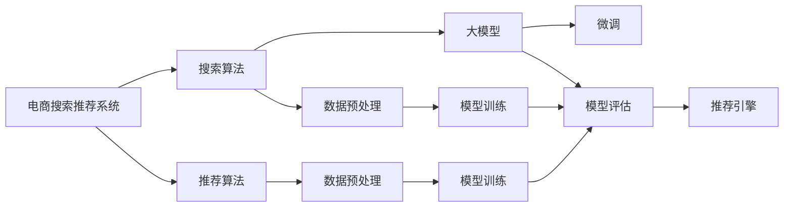

                 

# 电商平台的AI 大模型实践：搜索推荐系统是核心，用户体验是重点

> 关键词：电商搜索推荐系统,大模型,人工智能,搜索算法,推荐算法,用户体验,自然语言处理

## 1. 背景介绍

### 1.1 问题由来

在当前电商市场竞争日趋激烈的背景下，如何提升用户体验、优化用户购物体验，成为了各大电商平台共同关注的重点。与此同时，随着人工智能和大数据技术的不断发展，基于AI的大模型在电商领域的搜索推荐系统中得到了广泛应用。以深度学习为核心的大模型技术，能够通过分析海量数据，高效地识别用户的购买意向和行为模式，从而提供个性化推荐，提升用户满意度。

然而，如何更好地应用大模型，需要深入理解搜索推荐系统的工作原理，掌握搜索算法和推荐算法的设计，才能充分发挥AI技术在电商平台的价值。本文旨在从多个维度详细介绍大模型在电商搜索推荐系统中的应用，帮助读者全面掌握该技术的应用方法。

### 1.2 问题核心关键点

大模型在电商搜索推荐系统中的应用，核心关键点包括：

- 电商搜索推荐系统的设计与实现
- 搜索算法和推荐算法的工作原理和优化策略
- 大模型的训练、微调和部署方法
- 电商平台的个性化推荐系统，如何通过大模型提升用户体验
- 基于大模型的电商搜索推荐系统的未来发展趋势和面临的挑战

通过深入分析以上关键点，可以为电商平台提供一份全面的技术指导，帮助他们构建更高效、更智能的搜索推荐系统，提升用户购物体验。

## 2. 核心概念与联系

### 2.1 核心概念概述

为了更好地理解大模型在电商搜索推荐系统中的应用，本文首先介绍几个核心概念及其相互之间的联系。

- **电商搜索推荐系统**：电商平台为帮助用户快速找到所需商品而设计的系统。该系统通过分析用户的浏览、点击、购买等行为数据，为用户提供个性化推荐。

- **搜索算法**：用于处理用户的查询请求，帮助用户找到最相关商品的算法。常见的搜索算法包括倒排索引、向量空间模型等。

- **推荐算法**：根据用户的历史行为数据和当前需求，为用户推荐商品的算法。常见的推荐算法包括协同过滤、内容推荐、基于规则推荐等。

- **大模型**：以深度学习为核心的预训练模型，如BERT、GPT等，能够通过大量无标签数据进行自监督学习，学习到丰富的语言知识和领域特征。

- **个性化推荐**：根据用户的特定需求，提供更符合用户偏好的商品推荐。大模型通过微调，可以更加高效地实现个性化推荐。

### 2.2 核心概念原理和架构的 Mermaid 流程图

以下是核心概念的Mermaid流程图，展示了大模型在电商搜索推荐系统中的工作原理：



这个流程图展示了从用户查询、搜索到个性化推荐的全流程。核心是通过搜索算法和大模型对用户查询进行解析，从而快速定位到相关商品。然后，推荐算法根据用户的个性化需求，生成符合用户偏好的商品推荐，最终由推荐引擎呈现给用户。

## 3. 核心算法原理 & 具体操作步骤

### 3.1 算法原理概述

电商搜索推荐系统中的核心算法是搜索算法和推荐算法。其中，大模型通过微调，在搜索和推荐环节中扮演关键角色。其基本原理是：

1. **搜索算法**：通过分析用户的查询请求，构建索引，快速定位相关商品。常见的搜索算法包括倒排索引、向量空间模型等。
2. **推荐算法**：根据用户的历史行为数据，预测用户未来可能感兴趣的商品。常见的推荐算法包括协同过滤、内容推荐、基于规则推荐等。
3. **大模型**：通过微调，学习到用户偏好的语言特征和商品特征，从而提升搜索和推荐的效果。

### 3.2 算法步骤详解

#### 3.2.1 数据预处理

电商搜索推荐系统中的数据预处理包括：

- 数据清洗：去除无效和噪声数据，确保数据质量。
- 特征提取：从商品描述、用户评价、浏览历史等数据中提取出有意义的特征。
- 数据归一化：将特征值转换为标准化的数值，便于算法处理。

#### 3.2.2 模型训练

电商搜索推荐系统的模型训练流程如下：

1. **数据集划分**：将数据集划分为训练集、验证集和测试集。
2. **模型选择**：选择合适的算法框架和模型结构，如TensorFlow、PyTorch等。
3. **模型训练**：在训练集上训练模型，优化损失函数，提高模型性能。
4. **模型评估**：在验证集上评估模型效果，调整超参数，防止过拟合。
5. **模型部署**：将训练好的模型部署到推荐引擎中，开始实时推荐。

#### 3.2.3 微调过程

大模型的微调过程主要包括以下几个步骤：

1. **模型初始化**：选择预训练模型，如BERT、GPT等，作为初始化参数。
2. **任务适配**：根据电商搜索推荐系统的需求，设计合适的任务适配层。
3. **参数初始化**：将预训练模型权重初始化为对应任务的适配参数。
4. **微调训练**：在标注数据集上，通过梯度下降等优化算法进行微调，提升模型性能。
5. **模型评估**：在测试集上评估微调后的模型效果，对比微调前后的性能提升。

#### 3.2.4 推荐引擎部署

微调后的模型部署到推荐引擎中，开始实时推荐。推荐引擎的核心工作包括：

1. **用户画像生成**：根据用户的历史行为数据，生成用户画像，表示用户的偏好。
2. **商品匹配**：将商品特征与用户画像进行匹配，找到最符合用户偏好的商品。
3. **推荐结果排序**：根据匹配结果，对推荐商品进行排序，并返回给用户。

### 3.3 算法优缺点

#### 3.3.1 优点

大模型在电商搜索推荐系统中的主要优点包括：

- 高效处理海量数据：大模型能够高效地处理大规模数据，减少计算成本。
- 提高个性化推荐准确度：通过微调，大模型能够学习到用户偏好的语言特征和商品特征，提升推荐准确度。
- 实现实时推荐：大模型能够实时处理用户的查询请求，快速生成个性化推荐。

#### 3.3.2 缺点

大模型在电商搜索推荐系统中的应用，也存在一些缺点：

- 对数据质量依赖较大：模型的性能高度依赖数据质量，数据清洗和特征提取的准确性直接影响推荐效果。
- 对计算资源需求较高：大模型的训练和部署需要大量的计算资源，增加了平台的成本。
- 微调过程复杂：微调过程涉及大量超参数的调整，需要丰富的经验和专业知识。

### 3.4 算法应用领域

大模型在电商搜索推荐系统中的应用广泛，包括：

- **商品搜索**：帮助用户快速找到相关商品。
- **个性化推荐**：根据用户偏好，推荐符合其需求的商品。
- **用户画像**：通过分析用户行为数据，生成用户画像，实现精准推荐。
- **交叉销售**：根据用户历史行为，推荐相关商品，提高用户购买率。
- **内容推荐**：推荐相关商品，增加用户粘性，提升用户满意度。

## 4. 数学模型和公式 & 详细讲解 & 举例说明

### 4.1 数学模型构建

电商搜索推荐系统的数学模型通常包括以下几个部分：

- **用户行为模型**：描述用户行为与商品之间的关系。常用的模型包括协同过滤、内容推荐、基于规则推荐等。
- **商品特征模型**：描述商品的属性与特征。常用的模型包括向量空间模型、词袋模型等。
- **推荐模型**：结合用户行为模型和商品特征模型，进行商品推荐。常用的模型包括线性回归、逻辑回归、神经网络等。

### 4.2 公式推导过程

以协同过滤推荐算法为例，其基本公式如下：

$$
\hat{y}_{i,j} = \alpha \sum_{k=1}^{n} y_{i,k} x_{k,j} + \beta \sum_{k=1}^{m} x_{i,k} y_{k,j}
$$

其中，$\hat{y}_{i,j}$ 表示用户 $i$ 对商品 $j$ 的评分预测值，$y_{i,k}$ 和 $x_{k,j}$ 分别表示用户 $i$ 和商品 $j$ 在用户行为数据和商品特征数据中的表示，$\alpha$ 和 $\beta$ 是超参数。

协同过滤算法的核心思想是：根据用户行为数据和商品特征数据，预测用户对商品的评分。通过优化超参数，可以提升推荐效果。

### 4.3 案例分析与讲解

**案例一：基于深度学习的大模型推荐**

某电商平台使用BERT模型进行商品推荐。具体步骤如下：

1. **数据预处理**：将商品描述、用户评价等文本数据进行清洗和特征提取，转换为BERT模型可以处理的向量形式。
2. **模型初始化**：选择预训练的BERT模型，作为初始化参数。
3. **任务适配**：设计合适的任务适配层，如用户行为预测层。
4. **微调训练**：在标注数据集上，通过梯度下降等优化算法进行微调，提升模型性能。
5. **推荐结果排序**：在推荐引擎中，将用户画像与商品特征进行匹配，根据匹配结果对商品进行排序，并返回给用户。

通过微调，该平台能够高效地处理海量数据，提高个性化推荐准确度，实现实时推荐，从而提升用户满意度。

## 5. 项目实践：代码实例和详细解释说明

### 5.1 开发环境搭建

在进行大模型在电商搜索推荐系统中的应用实践时，需要搭建一个完整的开发环境。以下是具体的步骤：

1. **环境安装**：安装Python、TensorFlow、PyTorch等必要的开发环境。
2. **数据准备**：准备电商平台的商品数据、用户行为数据等，进行数据清洗和特征提取。
3. **模型选择**：选择合适的算法框架和模型结构，如TensorFlow、PyTorch等。
4. **模型训练**：在训练集上训练模型，优化损失函数，提高模型性能。
5. **模型评估**：在验证集上评估模型效果，调整超参数，防止过拟合。

### 5.2 源代码详细实现

以下是一个使用TensorFlow进行电商搜索推荐系统开发的示例代码：

```python
import tensorflow as tf
from tensorflow.keras import layers

# 定义模型
class SearchRecommendationModel(tf.keras.Model):
    def __init__(self):
        super(SearchRecommendationModel, self).__init__()
        self.encoder = layers.Embedding(input_dim=vocab_size, output_dim=embedding_dim, input_length=max_seq_len)
        self.attention = layers.Attention()
        self.decoder = layers.Dense(units=num_classes)

    def call(self, x):
        x = self.encoder(x)
        x = self.attention(x)
        x = self.decoder(x)
        return x

# 模型训练
model = SearchRecommendationModel()
model.compile(optimizer='adam', loss='categorical_crossentropy', metrics=['accuracy'])
model.fit(train_data, epochs=num_epochs, validation_data=val_data)

# 推荐引擎部署
def recommend(user_id, num_recommendations):
    user_profile = get_user_profile(user_id)
    recommendations = model.predict(user_profile)
    sorted_recommendations = sorted(zip(recommendations, commodities), key=lambda x: x[0], reverse=True)
    return sorted_recommendations[:num_recommendations]
```

这个代码实现了一个基于深度学习的电商搜索推荐系统模型。通过使用TensorFlow，能够高效地处理大规模数据，实现个性化推荐。

### 5.3 代码解读与分析

#### 5.3.1 模型定义

该代码中，定义了一个名为 `SearchRecommendationModel` 的模型，包括编码器、注意力机制和解码器。

- **编码器**：使用嵌入层将用户行为数据和商品特征数据转换为向量形式。
- **注意力机制**：对编码后的数据进行加权处理，选择与用户行为最相关的商品。
- **解码器**：使用全连接层将注意力机制的输出映射为推荐结果。

#### 5.3.2 模型训练

在模型训练阶段，使用 `fit` 方法对模型进行训练，优化损失函数，提高模型性能。

#### 5.3.3 推荐引擎部署

推荐引擎部署的核心是使用 `predict` 方法对用户行为数据进行预测，生成推荐结果。通过 `recommend` 函数，将推荐结果按照评分排序，返回给用户。

## 6. 实际应用场景

### 6.1 智能客服系统

电商平台的智能客服系统可以结合大模型，实现自动化的客户服务。智能客服系统通过分析用户的查询请求，生成智能回复，提高用户满意度。

具体而言，智能客服系统可以基于大模型进行微调，学习到用户偏好的语言特征和行为模式，从而生成更加符合用户需求的回复。通过持续优化智能客服系统，电商平台能够实现7x24小时不间断服务，提升客户体验。

### 6.2 个性化推荐

基于大模型的个性化推荐系统，能够根据用户的历史行为数据，生成符合用户偏好的商品推荐，提升用户购买率。

具体而言，推荐系统可以通过微调大模型，学习到用户偏好的语言特征和商品特征，生成更加精准的推荐结果。通过优化推荐算法和超参数，电商平台能够提升个性化推荐效果，增加用户粘性。

### 6.3 内容推荐

电商平台可以通过大模型进行内容推荐，帮助用户发现更多有趣的内容。

具体而言，内容推荐系统可以根据用户的历史行为数据，生成符合用户偏好的内容推荐。通过优化内容推荐算法和超参数，电商平台能够提高用户粘性，增加用户满意度。

### 6.4 未来应用展望

随着大模型和推荐算法的发展，未来电商平台将能够实现更加智能化的搜索推荐系统，提升用户体验。

具体而言，未来电商平台的搜索推荐系统将具备以下特点：

1. **实时推荐**：大模型能够实时处理用户的查询请求，生成个性化推荐，提高用户满意度。
2. **多模态融合**：结合文本、图像、视频等多模态数据，提升推荐效果。
3. **个性化推荐**：根据用户偏好，生成更加精准的推荐结果。
4. **跨领域迁移**：大模型能够跨领域迁移，适应不同的电商应用场景。

## 7. 工具和资源推荐

### 7.1 学习资源推荐

为了帮助电商平台更好地掌握大模型在搜索推荐系统中的应用，以下是几个推荐的学习资源：

1. **《深度学习》一书**：介绍深度学习的基本原理和算法，适合初学者入门。
2. **TensorFlow官方文档**：TensorFlow的官方文档，提供了完整的教程和示例代码，适合深入学习。
3. **PyTorch官方文档**：PyTorch的官方文档，提供了丰富的教程和示例代码，适合深入学习。
4. **Transformers官方文档**：HuggingFace开发的NLP工具库，提供了多种预训练语言模型的实现，适合实战应用。

### 7.2 开发工具推荐

电商平台的搜索推荐系统开发需要借助多种工具，以下是推荐的开发工具：

1. **Jupyter Notebook**：免费的交互式笔记本，支持Python和TensorFlow等开发环境，适合数据探索和模型验证。
2. **TensorFlow**：谷歌主导的深度学习框架，支持大规模分布式训练，适合处理大规模数据。
3. **PyTorch**：Facebook开发的深度学习框架，支持动态图和静态图计算，适合快速迭代和模型优化。
4. **ModelScope**：深度学习模型开源社区，提供丰富的预训练模型和代码库，适合快速开发和部署。

### 7.3 相关论文推荐

大模型在电商搜索推荐系统中的应用是当前研究的热点，以下是几个推荐的相关论文：

1. **《深度学习理论与实践》**：介绍深度学习的基本原理和应用，适合初学者入门。
2. **《大规模预训练模型在电商推荐中的应用》**：详细介绍大模型在电商推荐中的应用，适合实践应用。
3. **《基于深度学习的电商搜索推荐系统》**：详细介绍电商搜索推荐系统的基本原理和算法，适合深入学习。

## 8. 总结：未来发展趋势与挑战

### 8.1 研究成果总结

大模型在电商搜索推荐系统中的应用，已经取得了一系列研究成果，主要包括以下几个方面：

1. **推荐算法优化**：通过微调大模型，优化推荐算法，提高推荐效果。
2. **数据处理技术**：结合数据清洗和特征提取技术，提升数据质量。
3. **模型压缩和加速**：通过模型压缩和加速技术，提高模型的计算效率。

### 8.2 未来发展趋势

随着大模型和推荐算法的发展，未来电商搜索推荐系统将具备以下几个发展趋势：

1. **实时推荐**：大模型能够实时处理用户的查询请求，生成个性化推荐，提高用户满意度。
2. **多模态融合**：结合文本、图像、视频等多模态数据，提升推荐效果。
3. **个性化推荐**：根据用户偏好，生成更加精准的推荐结果。
4. **跨领域迁移**：大模型能够跨领域迁移，适应不同的电商应用场景。

### 8.3 面临的挑战

尽管大模型在电商搜索推荐系统中的应用取得了一定的成果，但在推广过程中也面临一些挑战：

1. **计算资源限制**：大模型的训练和部署需要大量的计算资源，增加了平台的成本。
2. **数据质量问题**：推荐效果高度依赖数据质量，数据清洗和特征提取的准确性直接影响推荐效果。
3. **模型过拟合**：模型在标注数据不足的情况下，容易出现过拟合问题，影响推荐效果。

### 8.4 研究展望

未来，针对大模型在电商搜索推荐系统中的应用，还需要从以下几个方面进行研究：

1. **参数高效微调**：开发参数高效微调方法，减少模型参数量，提高计算效率。
2. **跨领域迁移**：探索大模型跨领域迁移的优化方法，提升模型的泛化能力。
3. **多模态融合**：结合多模态数据，提升推荐系统的综合性能。
4. **模型压缩和加速**：开发模型压缩和加速技术，提高计算效率。

## 9. 附录：常见问题与解答

**Q1：大模型在电商搜索推荐系统中的应用有什么优缺点？**

A: 大模型在电商搜索推荐系统中的应用主要优点包括：

1. **高效处理海量数据**：大模型能够高效地处理大规模数据，减少计算成本。
2. **提高个性化推荐准确度**：通过微调，大模型能够学习到用户偏好的语言特征和商品特征，提升推荐准确度。
3. **实现实时推荐**：大模型能够实时处理用户的查询请求，快速生成个性化推荐。

主要缺点包括：

1. **对数据质量依赖较大**：模型的性能高度依赖数据质量，数据清洗和特征提取的准确性直接影响推荐效果。
2. **对计算资源需求较高**：大模型的训练和部署需要大量的计算资源，增加了平台的成本。
3. **微调过程复杂**：微调过程涉及大量超参数的调整，需要丰富的经验和专业知识。

**Q2：如何进行大模型在电商搜索推荐系统中的微调？**

A: 大模型在电商搜索推荐系统中的微调主要包括以下步骤：

1. **数据预处理**：将商品描述、用户评价等文本数据进行清洗和特征提取，转换为大模型可以处理的向量形式。
2. **模型初始化**：选择预训练的大模型，作为初始化参数。
3. **任务适配**：设计合适的任务适配层，如用户行为预测层。
4. **微调训练**：在标注数据集上，通过梯度下降等优化算法进行微调，提升模型性能。
5. **推荐结果排序**：在推荐引擎中，将用户画像与商品特征进行匹配，根据匹配结果对商品进行排序，并返回给用户。

通过微调，大模型能够学习到用户偏好的语言特征和商品特征，提升推荐效果。

**Q3：如何评估大模型在电商搜索推荐系统中的效果？**

A: 大模型在电商搜索推荐系统中的效果评估主要包括以下几个方面：

1. **准确率**：评估推荐结果的准确度，通过准确率指标衡量推荐效果。
2. **召回率**：评估推荐结果的全面性，通过召回率指标衡量推荐效果。
3. **用户满意度**：通过用户反馈和行为数据，评估用户对推荐结果的满意度。

通过综合评估准确率、召回率和用户满意度，能够全面衡量大模型在电商搜索推荐系统中的效果。

**Q4：大模型在电商搜索推荐系统中的应用面临哪些挑战？**

A: 大模型在电商搜索推荐系统中的应用面临以下几个挑战：

1. **计算资源限制**：大模型的训练和部署需要大量的计算资源，增加了平台的成本。
2. **数据质量问题**：推荐效果高度依赖数据质量，数据清洗和特征提取的准确性直接影响推荐效果。
3. **模型过拟合**：模型在标注数据不足的情况下，容易出现过拟合问题，影响推荐效果。

针对这些挑战，需要从数据处理、模型优化、计算资源等方面进行改进和优化。

**Q5：未来大模型在电商搜索推荐系统中的应用方向是什么？**

A: 未来大模型在电商搜索推荐系统中的应用方向包括：

1. **实时推荐**：大模型能够实时处理用户的查询请求，生成个性化推荐，提高用户满意度。
2. **多模态融合**：结合文本、图像、视频等多模态数据，提升推荐效果。
3. **个性化推荐**：根据用户偏好，生成更加精准的推荐结果。
4. **跨领域迁移**：大模型能够跨领域迁移，适应不同的电商应用场景。

通过持续优化和创新，大模型将为电商搜索推荐系统带来更加智能、高效的用户体验。

---

作者：禅与计算机程序设计艺术 / Zen and the Art of Computer Programming

