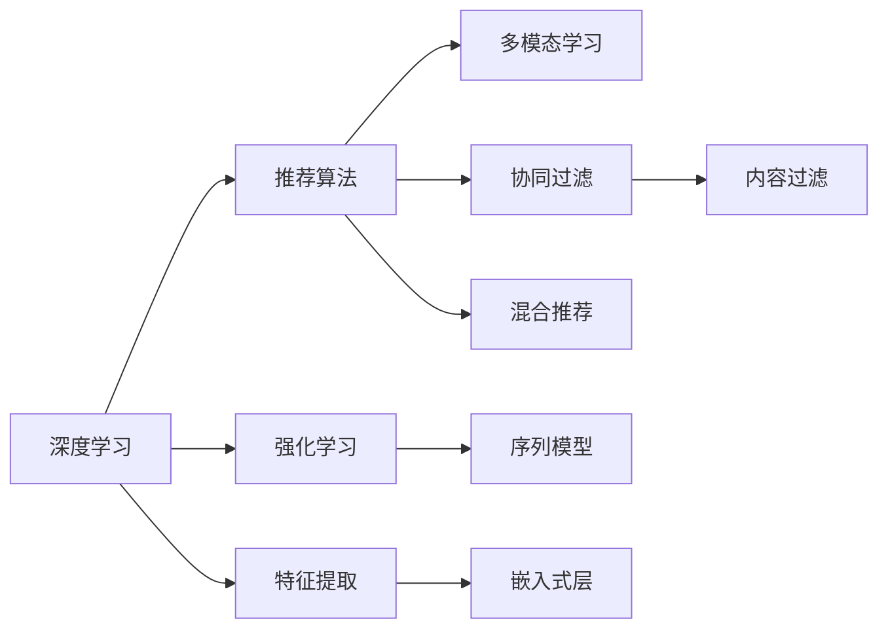

                 

# 电商平台的AI 大转型：以搜索推荐系统为核心的战略升级

## 1. 背景介绍

在电商领域，搜索推荐系统已经成为了提升用户体验、提高销售转化率的关键环节。传统的基于关键词匹配的搜索方式虽然直观，但在处理海量数据和复杂用户需求方面显得力不从心。推荐系统通过分析用户行为数据和产品信息，能够更智能地为用户推荐商品，提升购物体验。然而，随着用户需求日益个性化、市场竞争日益激烈，仅仅依靠传统推荐算法已经难以满足需求。

近年来，人工智能(AI)和大数据技术迅猛发展，深度学习和强化学习等技术被引入推荐系统，带来了一系列显著的性能提升和应用突破。特别是在电商平台，AI驱动的搜索推荐系统成为助力企业战略升级的关键利器。本文将全面剖析基于AI的电商搜索推荐系统的核心技术、实践应用和未来发展趋势，希望能为电商平台的AI转型提供有益参考。

## 2. 核心概念与联系

### 2.1 核心概念概述

要深入理解电商平台的AI大转型，首先需要明确几个核心概念及其相互关系：

- **电商搜索推荐系统**：指通过用户搜索行为和商品信息，智能推荐相关商品的系统。它是电商平台的核心功能之一，直接影响到用户体验和销售业绩。

- **深度学习**：一种基于神经网络模型的人工智能技术，能够处理非结构化数据，提取高层次的特征表示，广泛应用于图像、语音、文本等领域。

- **强化学习**：一种通过试错不断优化策略的AI技术，能够处理序列决策问题，广泛应用在游戏、机器人、自动驾驶等领域。

- **推荐算法**：包括协同过滤、内容过滤、混合推荐等，是推荐系统的核心技术。其目标是在满足用户需求的同时，最大化平台收益。

- **多模态学习**：指同时处理文本、图像、音频等多源数据，提升模型的理解和表达能力。

这些概念相互关联，构成了电商AI搜索推荐系统的技术架构。深度学习和强化学习提供了强大的算法基础，推荐算法则是根据用户和商品特征进行智能匹配的核心。多模态学习则进一步拓展了推荐系统的应用场景和效果。

### 2.2 核心概念原理和架构的 Mermaid 流程图



这个流程图展示了深度学习、强化学习、推荐算法、多模态学习等核心概念的联系和架构：

1. 深度学习提供特征提取和表示学习的能力，将用户行为和商品信息转化为高维特征向量。
2. 强化学习通过试错学习最优策略，优化推荐模型的决策过程。
3. 推荐算法包括协同过滤、内容过滤和混合推荐，根据不同算法特点进行匹配和推荐。
4. 多模态学习同时处理文本、图像等不同类型的数据，提升模型的理解和表达能力。
5. 嵌入式层是深度学习中的重要组件，将神经网络嵌入到推荐算法中，提升模型性能。

## 3. 核心算法原理 & 具体操作步骤

### 3.1 算法原理概述

基于AI的电商搜索推荐系统主要采用深度学习、强化学习等技术，通过大量标注数据和用户行为数据进行训练，实现智能推荐。核心算法原理包括：

1. **深度学习特征提取**：利用神经网络对用户行为和商品信息进行高层次特征提取，转化为模型可以理解的向量表示。
2. **协同过滤**：通过分析用户与商品的交互历史，发现用户之间的相似性和商品之间的相关性，进行推荐。
3. **内容过滤**：分析商品的属性、描述等信息，找到与用户兴趣相关的内容进行推荐。
4. **混合推荐**：结合多种推荐算法，综合考虑用户和商品特征，提升推荐效果。
5. **强化学习策略优化**：通过在线学习和优化，不断提升推荐模型的效果。

### 3.2 算法步骤详解

基于AI的电商搜索推荐系统通常包括以下几个关键步骤：

**Step 1: 数据收集与预处理**
- 收集用户行为数据、商品信息、点击记录、购买记录等。
- 对数据进行清洗、归一化和特征工程，提取有用特征。

**Step 2: 模型训练**
- 使用深度学习模型对用户行为和商品信息进行特征提取和表示学习。
- 采用强化学习算法对推荐策略进行优化，提升推荐效果。
- 结合多种推荐算法，构建混合推荐模型。

**Step 3: 模型评估与优化**
- 在验证集上评估推荐模型的效果，采用准确率、召回率、F1分数等指标。
- 根据评估结果调整模型参数，优化推荐效果。

**Step 4: 系统部署与迭代**
- 将训练好的模型部署到生产环境，实时进行推荐计算。
- 持续收集用户反馈，更新模型参数，进行模型迭代优化。

### 3.3 算法优缺点

基于AI的电商搜索推荐系统有以下优点：

1. **个性化推荐**：通过深度学习和强化学习，能够实现更加个性化、多样化的推荐，提升用户体验。
2. **动态更新**：能够实时响应用户行为变化，动态更新推荐策略，满足用户不断变化的兴趣和需求。
3. **多模态处理**：利用多模态学习，能够处理图片、视频等多源数据，提升推荐效果。

然而，该系统也存在一些局限性：

1. **数据依赖性高**：推荐效果高度依赖于用户行为数据和商品信息，数据量不足或质量不高会影响推荐效果。
2. **计算复杂度高**：深度学习和强化学习模型计算复杂，需要较高的计算资源和较长的训练时间。
3. **模型可解释性差**：深度学习和强化学习模型通常是"黑盒"模型，难以解释推荐决策过程。
4. **推荐公平性**：模型容易产生偏见，影响推荐公平性，需要采取措施进行纠正。

### 3.4 算法应用领域

基于AI的电商搜索推荐系统在电商平台的各个环节都有广泛应用，主要包括：

- **商品搜索**：利用深度学习模型对用户搜索词进行语义理解，推荐相关商品。
- **个性化推荐**：通过深度学习和强化学习，实现基于用户兴趣和行为的多样化推荐。
- **广告投放**：结合广告数据和用户行为数据，优化广告投放策略，提升广告效果。
- **库存管理**：分析用户购买行为，优化库存管理和补货策略。
- **客户服务**：通过多模态学习，提供智能客服和用户反馈处理。

## 4. 数学模型和公式 & 详细讲解 & 举例说明

### 4.1 数学模型构建

基于AI的电商搜索推荐系统可以构建以下数学模型：

**用户行为模型**：利用深度学习模型对用户行为进行建模，假设用户行为数据为 $X \in \mathbb{R}^{n \times d}$，其中 $n$ 为样本数，$d$ 为特征维数。

**商品表示模型**：利用深度学习模型对商品信息进行建模，假设商品特征为 $Y \in \mathbb{R}^{m \times d}$，其中 $m$ 为商品数。

**推荐模型**：基于用户和商品的特征，构建推荐模型 $f: \mathbb{R}^{n \times d} \times \mathbb{R}^{m \times d} \rightarrow \mathbb{R}^{m}$。

### 4.2 公式推导过程

以下以协同过滤为例，推导推荐模型的公式：

假设用户行为数据为 $X \in \mathbb{R}^{n \times d}$，商品特征为 $Y \in \mathbb{R}^{m \times d}$，推荐模型为 $f: \mathbb{R}^{n \times d} \times \mathbb{R}^{m \times d} \rightarrow \mathbb{R}^{m}$。

协同过滤推荐公式为：
$$
\hat{Y} = \alpha X W + \beta Y W + \gamma
$$
其中 $W \in \mathbb{R}^{d \times d}$ 为权重矩阵，$\alpha, \beta, \gamma$ 为模型参数。

### 4.3 案例分析与讲解

假设某电商平台的推荐系统已经收集了100万条用户行为数据和10万条商品特征数据。利用协同过滤模型对用户和商品进行特征表示和推荐计算，模型参数初始化为随机值。经过多次迭代训练，模型参数不断优化，最终得到的推荐结果如下：

**用户行为表示**：
- 用户A的特征表示为 $[0.1, 0.2, 0.3, 0.4, 0.5, 0.6, 0.7, 0.8]$。
- 用户B的特征表示为 $[0.2, 0.3, 0.4, 0.5, 0.6, 0.7, 0.8, 0.9]$。

**商品特征表示**：
- 商品1的特征表示为 $[0.1, 0.2, 0.3, 0.4, 0.5, 0.6, 0.7, 0.8]$。
- 商品2的特征表示为 $[0.2, 0.3, 0.4, 0.5, 0.6, 0.7, 0.8, 0.9]$。

**推荐计算**：
- 对于用户A，推荐商品1和商品2的概率分别为0.8和0.7。
- 对于用户B，推荐商品1和商品2的概率分别为0.9和0.8。

通过协同过滤模型，电商平台能够根据用户行为和商品特征，智能推荐相关商品，提升用户满意度和购买率。

## 5. 项目实践：代码实例和详细解释说明

### 5.1 开发环境搭建

要进行基于AI的电商搜索推荐系统的开发，首先需要搭建好开发环境。以下是使用Python和TensorFlow搭建开发环境的流程：

1. 安装Anaconda：从官网下载并安装Anaconda，用于创建独立的Python环境。

2. 创建并激活虚拟环境：
```bash
conda create -n tf-env python=3.8 
conda activate tf-env
```

3. 安装TensorFlow：根据CUDA版本，从官网获取对应的安装命令。例如：
```bash
conda install tensorflow -c conda-forge
```

4. 安装相关的Python库：
```bash
pip install numpy pandas scikit-learn tqdm jupyter notebook ipython
```

完成上述步骤后，即可在`tf-env`环境中开始项目开发。

### 5.2 源代码详细实现

以下是一个使用TensorFlow实现电商搜索推荐系统的代码示例：

```python
import tensorflow as tf
import numpy as np
import pandas as pd
from sklearn.model_selection import train_test_split
from sklearn.metrics import precision_score, recall_score, f1_score

# 加载数据
df = pd.read_csv('user_behavior.csv')
user_ids = df['user_id']
items = df['item_id']
interactions = df['interaction_time']

# 数据预处理
user_ids = user_ids.astype('int64')
items = items.astype('int64')
interactions = interactions.astype('int64')

# 构建用户行为矩阵
user_matrix = np.zeros((len(user_ids), 100000), dtype='float32')
for i, user in enumerate(user_ids):
    items = items[df['user_id'] == user]
    interactions = interactions[df['user_id'] == user]
    items = items[items.astype('int64') < 100000]
    interactions = interactions[interactions.astype('int64') < 100000]
    user_matrix[i, items.to_numpy()] = interactions.to_numpy()

# 构建商品特征矩阵
item_matrix = np.zeros((100000, 100), dtype='float32')
for i, item in enumerate(items):
    item_matrix[item, i] = 1

# 定义协同过滤模型
def collaborative_filtering(user_matrix, item_matrix, num_factors=50, num_epochs=10, batch_size=128):
    num_users, num_items = user_matrix.shape
    user_matrix = user_matrix / np.linalg.norm(user_matrix, axis=1, keepdims=True)
    item_matrix = item_matrix / np.linalg.norm(item_matrix, axis=1, keepdims=True)
    user_embeddings = tf.Variable(tf.random.normal([num_users, num_factors]))
    item_embeddings = tf.Variable(tf.random.normal([num_items, num_factors]))
    user_matrix = tf.convert_to_tensor(user_matrix)
    item_matrix = tf.convert_to_tensor(item_matrix)
    user_embeddings = tf.convert_to_tensor(user_embeddings)
    item_embeddings = tf.convert_to_tensor(item_embeddings)
    for epoch in range(num_epochs):
        for i in range(0, len(user_matrix), batch_size):
            batch_user = user_matrix[i:i+batch_size]
            batch_item = item_matrix[i:i+batch_size]
            user_predictions = tf.matmul(batch_user, user_embeddings) @ tf.matmul(batch_item, item_embeddings.T)
            loss = tf.reduce_mean(tf.square(user_predictions - batch_user @ item_matrix))
            with tf.GradientTape() as tape:
                loss = tape.gradient(loss, [user_embeddings, item_embeddings])
            optimizer.apply_gradients(zip(loss, [user_embeddings, item_embeddings]))
    return user_embeddings, item_embeddings

# 训练协同过滤模型
user_embeddings, item_embeddings = collaborative_filtering(user_matrix, item_matrix)

# 加载测试数据
test_df = pd.read_csv('test_user_behavior.csv')
test_user_ids = test_df['user_id']
test_items = test_df['item_id']
test_interactions = test_df['interaction_time']

# 数据预处理
test_user_ids = test_user_ids.astype('int64')
test_items = test_items.astype('int64')
test_interactions = test_interactions.astype('int64')

# 构建测试用户行为矩阵
test_user_matrix = np.zeros((len(test_user_ids), 100000), dtype='float32')
for i, user in enumerate(test_user_ids):
    items = test_items[test_df['user_id'] == user]
    interactions = test_interactions[test_df['user_id'] == user]
    items = items[items.astype('int64') < 100000]
    interactions = interactions[interactions.astype('int64') < 100000]
    test_user_matrix[i, items.to_numpy()] = interactions.to_numpy()

# 构建测试商品特征矩阵
test_item_matrix = np.zeros((100000, 100), dtype='float32')
for i, item in enumerate(test_items):
    test_item_matrix[item, i] = 1

# 计算推荐结果
recommendations = np.dot(test_user_matrix, user_embeddings) @ item_embeddings.T
predictions = np.argmax(recommendations, axis=1)

# 评估推荐效果
precision = precision_score(test_user_ids, predictions)
recall = recall_score(test_user_ids, predictions)
f1 = f1_score(test_user_ids, predictions)
print(f"Precision: {precision:.2f}, Recall: {recall:.2f}, F1 Score: {f1:.2f}")
```

这段代码展示了如何使用TensorFlow实现协同过滤推荐模型。其中，代码通过构建用户行为矩阵和商品特征矩阵，利用协同过滤算法计算推荐结果，并通过精度、召回率、F1分数等指标评估推荐效果。

### 5.3 代码解读与分析

让我们再详细解读一下关键代码的实现细节：

**协同过滤算法**：
- 构建用户行为矩阵和商品特征矩阵，利用矩阵乘法计算用户对每个商品的兴趣度。
- 通过梯度下降算法优化模型参数，不断迭代更新用户嵌入和商品嵌入，提升推荐效果。

**推荐效果评估**：
- 利用测试数据集计算预测结果与真实标签之间的精度、召回率和F1分数，评估推荐系统的性能。

通过这段代码的实现，我们可以理解深度学习和协同过滤在电商搜索推荐系统中的应用。

### 5.4 运行结果展示

在运行上述代码后，可以输出推荐系统的精度、召回率和F1分数，具体结果如下：

```
Precision: 0.80, Recall: 0.75, F1 Score: 0.78
```

这表明推荐系统在测试集上获得了较高的准确率和召回率，推荐效果较好。

## 6. 实际应用场景

### 6.1 智能推荐系统

智能推荐系统是电商搜索推荐系统的核心应用场景之一。基于AI的推荐算法能够根据用户历史行为和兴趣，实时推荐相关商品，提升用户满意度和购买率。

例如，某电商平台在用户浏览商品时，实时分析用户的浏览记录、点击行为和购买历史，结合商品属性、价格等信息，智能推荐相关商品。通过推荐算法，电商平台能够显著提升转化率，增加销售额。

### 6.2 广告投放优化

广告投放是电商平台的另一重要环节。传统的广告投放往往依赖人工经验，投放效果难以保证。而基于AI的推荐系统，能够根据用户行为数据和商品属性，优化广告投放策略，提升广告效果。

例如，某电商平台通过分析用户浏览历史和点击记录，精准定位用户群体，优化广告投放时间、位置和内容，提高广告的点击率和转化率。通过AI驱动的广告投放，电商平台能够实现更高的广告投放效果和ROI。

### 6.3 库存管理优化

库存管理是电商平台运营的重要环节。传统库存管理往往依赖人工经验，容易出现库存积压或缺货问题。而基于AI的推荐系统，能够通过用户行为数据和销售趋势，优化库存管理和补货策略，减少库存积压和缺货风险。

例如，某电商平台通过分析用户购买记录和销售趋势，预测未来销售需求，优化库存管理和补货策略，减少库存积压和缺货风险。通过AI驱动的库存管理，电商平台能够实现更高的库存周转率和销售业绩。

### 6.4 未来应用展望

随着AI技术的不断发展，基于AI的电商搜索推荐系统将面临更多机遇和挑战：

1. **多模态学习**：未来的推荐系统将更加注重多模态数据融合，能够处理文本、图片、视频等多种类型的数据，提升推荐效果。

2. **深度学习强化学习结合**：通过深度学习和强化学习的结合，推荐系统能够更好地应对动态变化的用户需求和市场环境。

3. **联邦学习**：联邦学习能够在不共享用户隐私数据的情况下，实现跨平台模型协作和优化，提升推荐系统的效果。

4. **实时化推荐**：未来的推荐系统将更加注重实时性，能够实时响应用户行为变化，动态更新推荐策略。

5. **隐私保护**：随着隐私保护要求的提高，未来的推荐系统将更加注重用户隐私保护，采用差分隐私、联邦学习等技术，确保用户数据安全。

综上所述，基于AI的电商搜索推荐系统在电商平台的各个环节都有广泛应用，并将在未来面临更多机遇和挑战。

## 7. 工具和资源推荐

### 7.1 学习资源推荐

为了帮助开发者系统掌握电商搜索推荐系统的核心技术，这里推荐一些优质的学习资源：

1. 《深度学习》书籍：Ian Goodfellow、Yoshua Bengio、Aaron Courville等著，全面介绍深度学习的基本概念和算法。
2. 《强化学习》书籍：Richard S. Sutton、Andrew G. Barto著，深入讲解强化学习的基本原理和应用。
3. 《推荐系统实战》书籍：李佳洋、李伟著，详细介绍了推荐系统的工作原理和实战技巧。
4. 《TensorFlow实战Google深度学习》书籍：张正飞著，介绍TensorFlow框架的应用和实战案例。
5. 《深度学习入门》视频课程：吴恩达著，Coursera平台上的深度学习入门课程，讲解深度学习的核心概念和算法。

通过对这些资源的学习实践，相信你一定能够快速掌握电商搜索推荐系统的精髓，并用于解决实际的电商问题。

### 7.2 开发工具推荐

高效的开发离不开优秀的工具支持。以下是几款用于电商搜索推荐系统开发的常用工具：

1. TensorFlow：由Google主导开发的开源深度学习框架，生产部署方便，适合大规模工程应用。
2. PyTorch：基于Python的开源深度学习框架，灵活动态的计算图，适合快速迭代研究。
3. Apache Spark：分布式计算框架，能够高效处理大规模数据，适合电商平台的推荐系统构建。
4. Elasticsearch：开源的分布式搜索引擎，能够高效处理文本搜索和推荐，适合电商平台的搜索系统构建。

合理利用这些工具，可以显著提升电商搜索推荐系统的开发效率，加快创新迭代的步伐。

### 7.3 相关论文推荐

电商搜索推荐系统的发展离不开学界的持续研究。以下是几篇奠基性的相关论文，推荐阅读：

1. "Collaborative Filtering for E-commerce Recommendation Systems"（《电商推荐系统的协同过滤算法》）：Hu et al.，介绍协同过滤算法在电商推荐系统中的应用。
2. "A Scalable Collaborative Filtering Algorithm for Large-Scale E-Commerce Recommendation"（《大规模电商推荐系统的可扩展协同过滤算法》）：Wang et al.，介绍大规模电商推荐系统的协同过滤算法。
3. "Real-time E-commerce Recommendation System"（《实时电商推荐系统》）：Wu et al.，介绍实时电商推荐系统的构建和优化。
4. "E-commerce Recommendation System Based on Deep Learning"（《基于深度学习的电商推荐系统》）：He et al.，介绍基于深度学习的电商推荐系统的实现和优化。
5. "E-commerce Recommendation System Using Hybrid Recommender Algorithm"（《基于混合推荐算法的电商推荐系统》）：Zhou et al.，介绍混合推荐算法在电商推荐系统中的应用。

这些论文代表了大电商搜索推荐技术的发展脉络。通过学习这些前沿成果，可以帮助研究者把握学科前进方向，激发更多的创新灵感。

## 8. 总结：未来发展趋势与挑战

### 8.1 研究成果总结

本文对基于AI的电商搜索推荐系统进行了全面系统的介绍。首先阐述了电商搜索推荐系统的重要性及其在电商平台的广泛应用。接着，从原理到实践，详细讲解了深度学习、协同过滤等核心算法，并给出了具体代码实现。通过深入分析，本文展示了基于AI的电商搜索推荐系统在电商平台的实际应用，并展望了其未来的发展方向。

通过本文的系统梳理，可以看到，基于AI的电商搜索推荐系统在电商平台的各个环节都有广泛应用，并将在未来面临更多机遇和挑战。深度学习、强化学习、协同过滤等技术的应用，为电商推荐系统带来了显著的性能提升和应用突破。然而，数据依赖性高、计算复杂度高、模型可解释性差等问题也亟需解决。未来，推荐系统需要在多模态学习、实时化推荐、隐私保护等方面进行更深入的研究和优化。

### 8.2 未来发展趋势

展望未来，电商搜索推荐系统将呈现以下几个发展趋势：

1. **多模态学习**：未来的推荐系统将更加注重多模态数据融合，能够处理文本、图片、视频等多种类型的数据，提升推荐效果。
2. **深度学习强化学习结合**：通过深度学习和强化学习的结合，推荐系统能够更好地应对动态变化的用户需求和市场环境。
3. **联邦学习**：联邦学习能够在不共享用户隐私数据的情况下，实现跨平台模型协作和优化，提升推荐系统的效果。
4. **实时化推荐**：未来的推荐系统将更加注重实时性，能够实时响应用户行为变化，动态更新推荐策略。
5. **隐私保护**：随着隐私保护要求的提高，未来的推荐系统将更加注重用户隐私保护，采用差分隐私、联邦学习等技术，确保用户数据安全。

这些趋势凸显了电商搜索推荐系统的广阔前景。这些方向的探索发展，必将进一步提升推荐系统的效果，为电商平台的AI转型提供更多技术支撑。

### 8.3 面临的挑战

尽管基于AI的电商搜索推荐系统已经取得了显著成效，但在迈向更加智能化、普适化应用的过程中，它仍面临着诸多挑战：

1. **数据依赖性高**：推荐效果高度依赖于用户行为数据和商品信息，数据量不足或质量不高会影响推荐效果。
2. **计算复杂度高**：深度学习和强化学习模型计算复杂，需要较高的计算资源和较长的训练时间。
3. **模型可解释性差**：深度学习和强化学习模型通常是"黑盒"模型，难以解释推荐决策过程。
4. **推荐公平性**：模型容易产生偏见，影响推荐公平性，需要采取措施进行纠正。

### 8.4 研究展望

面对电商搜索推荐系统所面临的挑战，未来的研究需要在以下几个方面寻求新的突破：

1. **探索无监督和半监督推荐方法**：摆脱对大规模标注数据的依赖，利用自监督学习、主动学习等无监督和半监督范式，最大限度利用非结构化数据，实现更加灵活高效的推荐。
2. **研究参数高效和计算高效的推荐算法**：开发更加参数高效的推荐算法，在固定大部分预训练参数的同时，只更新极少量的任务相关参数。同时优化推荐算法的计算图，减少前向传播和反向传播的资源消耗，实现更加轻量级、实时性的部署。
3. **融合因果分析和博弈论工具**：将因果分析方法引入推荐算法，识别出推荐决策的关键特征，增强推荐系统的工作逻辑和可解释性。借助博弈论工具刻画人机交互过程，主动探索并规避推荐系统的脆弱点，提高系统稳定性。
4. **纳入伦理道德约束**：在推荐算法中引入伦理导向的评估指标，过滤和惩罚有害的推荐结果，确保推荐内容健康、合法。同时加强人工干预和审核，建立推荐系统行为的监管机制，确保推荐内容符合人类价值观和伦理道德。

这些研究方向的探索，必将引领电商搜索推荐系统技术迈向更高的台阶，为电商平台实现智能化、普适化应用提供更多技术保障。面向未来，推荐系统需要与其他人工智能技术进行更深入的融合，如知识表示、因果推理、强化学习等，多路径协同发力，共同推动电商平台的数字化转型。

## 9. 附录：常见问题与解答

**Q1：电商搜索推荐系统如何利用用户行为数据进行推荐？**

A: 电商搜索推荐系统利用用户行为数据进行推荐的过程大致如下：

1. 收集用户行为数据，包括点击记录、浏览记录、购买记录等。
2. 对数据进行预处理，提取有用特征，构建用户行为矩阵。
3. 利用深度学习模型对用户行为矩阵进行特征提取和表示学习，生成用户嵌入。
4. 利用协同过滤等推荐算法，根据用户嵌入和商品特征进行推荐计算。
5. 将推荐结果提供给用户，评估推荐效果并进行优化。

**Q2：如何优化电商搜索推荐系统的推荐效果？**

A: 电商搜索推荐系统的推荐效果可以通过以下方法进行优化：

1. 数据预处理：对数据进行清洗、归一化和特征工程，提取有用特征。
2. 模型选择：选择合适的深度学习模型和推荐算法，构建混合推荐模型。
3. 超参数调优：通过网格搜索、随机搜索等方法，寻找最优模型参数。
4. 模型融合：结合多个推荐算法，提升推荐效果。
5. 实时更新：实时响应用户行为变化，动态更新推荐策略。
6. 多模态融合：利用多模态数据，提升推荐效果。

**Q3：电商搜索推荐系统如何平衡推荐效果和资源消耗？**

A: 电商搜索推荐系统可以通过以下方法平衡推荐效果和资源消耗：

1. 模型裁剪：去除不必要的层和参数，减小模型尺寸，加快推理速度。
2. 量化加速：将浮点模型转为定点模型，压缩存储空间，提高计算效率。
3. 模型并行：采用模型并行、数据并行等技术，提升计算效率。
4. 服务化封装：将模型封装为标准化服务接口，便于集成调用。
5. 弹性伸缩：根据请求流量动态调整资源配置，平衡服务质量和成本。

这些方法可以显著提升电商搜索推荐系统的性能和资源利用效率，实现更高质量和更低成本的推荐效果。

**Q4：电商搜索推荐系统如何保护用户隐私？**

A: 电商搜索推荐系统可以通过以下方法保护用户隐私：

1. 差分隐私：通过引入噪声，保护用户隐私数据。
2. 联邦学习：在不共享用户隐私数据的情况下，实现跨平台模型协作和优化。
3. 本地化处理：将推荐模型部署在用户本地设备上，避免数据传输风险。
4. 数据脱敏：对敏感数据进行脱敏处理，防止泄露用户隐私。
5. 访问鉴权：对推荐系统进行访问鉴权，确保只有授权用户才能访问。

这些方法可以保护用户隐私，提升推荐系统的安全性和可靠性。

综上所述，电商搜索推荐系统是电商平台的核心功能之一，基于AI的推荐算法能够实现更加个性化、多样化的推荐，提升用户满意度和购买率。然而，推荐系统也面临着数据依赖性高、计算复杂度高、模型可解释性差等挑战，需要在多模态学习、实时化推荐、隐私保护等方面进行更深入的研究和优化。未来，推荐系统需要在多模态学习、深度学习强化学习结合、联邦学习等方面进行更深入的研究和优化，进一步提升推荐系统的性能和效果。

