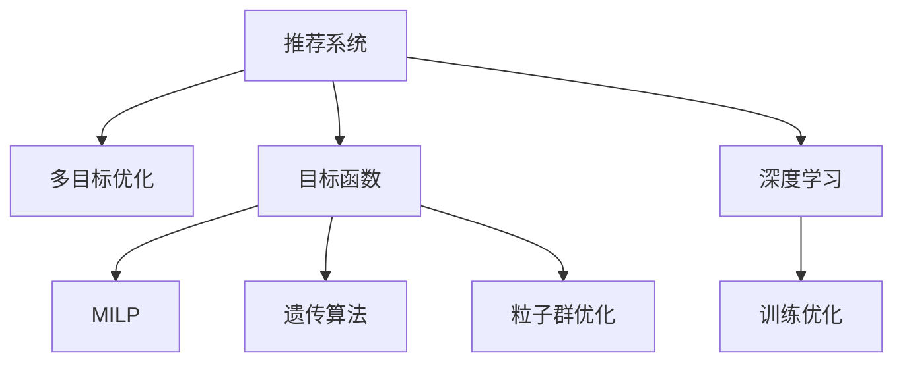

                 

# 电商推荐系统中的多目标优化框架

> 关键词：推荐系统, 多目标优化, 目标函数, 混合整数线性规划, 遗传算法, 粒子群优化, 深度学习, 电商应用, 多目标决策

## 1. 背景介绍

### 1.1 问题由来

在当今电商平台上，推荐系统已成为用户获取信息和商品的主要方式。然而，尽管推荐系统的性能不断提升，但如何平衡推荐效果与业务目标（如点击率、转化率、回购率等），仍是电商推荐系统设计中的一大挑战。传统单目标优化方法难以同时兼顾多方面业务需求，如何构建一个多目标优化框架，成为推荐系统优化中的一个核心问题。

### 1.2 问题核心关键点

构建电商推荐系统中的多目标优化框架，需考虑以下核心关键点：

- **多目标优化问题**：推荐系统中的业务目标通常包含多个互相冲突的目标，如展示效果（点击率、曝光率）与转化效果（转化率、回购率）之间的平衡。
- **多目标决策**：如何将多目标优化问题转化为多目标决策问题，进行综合权衡和优先级排序。
- **算法选择**：选择合适的多目标优化算法，处理多目标优化问题。
- **算法实现**：将多目标优化算法应用于推荐系统，进行模型训练和优化。
- **效果评估**：设计评估指标，评估多目标优化框架的性能和效果。

## 2. 核心概念与联系

### 2.1 核心概念概述

为更好地理解电商推荐系统中的多目标优化框架，本节将介绍几个密切相关的核心概念：

- **推荐系统**：根据用户的历史行为、兴趣偏好和当前状态，推荐可能感兴趣的商品或内容。
- **多目标优化**：在多个互相冲突的目标间寻找平衡点，最大化综合效果。
- **目标函数**：描述多个业务目标的综合评估标准，如均值、权重、约束等。
- **混合整数线性规划**（MILP）：一种多目标优化算法，用于解决离散和连续变量混合的线性规划问题。
- **遗传算法**：模拟自然选择和遗传机制，通过群体进化生成最优解。
- **粒子群优化**（PSO）：模拟鸟群或鱼群觅食行为，通过粒子迭代优化目标函数。
- **深度学习**：通过神经网络模型，学习用户行为和商品特征，进行精准推荐。

这些核心概念之间的逻辑关系可以通过以下Mermaid流程图来展示：



这个流程图展示了这个系统的核心概念及其之间的关系：

1. 推荐系统通过用户历史行为和特征，生成推荐结果。
2. 多目标优化框架在推荐结果上，寻找多个目标之间的平衡点。
3. 目标函数定义推荐效果的评估标准。
4. MILP、遗传算法、PSO等优化算法，用于解决多目标优化问题。
5. 深度学习模型用于提取用户和商品的特征，优化推荐效果。

## 3. 核心算法原理 & 具体操作步骤

### 3.1 算法原理概述

电商推荐系统中的多目标优化框架，主要通过多目标优化算法，在多个业务目标之间寻找平衡点。其核心思想是：通过定义多个目标函数，并引入约束条件，在保证不同业务目标间协调的前提下，最大化综合效果。

形式化地，设推荐系统中的业务目标集合为 $\mathcal{T}=\{t_1,t_2,\cdots,t_k\}$，其中 $t_i$ 表示第 $i$ 个目标函数，其数学表达式为 $t_i=f_i(\mathbf{x})$，$\mathbf{x}$ 表示推荐模型的参数向量。定义目标函数之间的权重向量 $\mathbf{w} \in \mathbb{R}^k$，表示各个目标的相对重要性。多目标优化问题可以表示为：

$$
\mathbf{x} = \mathop{\arg\min}_{\mathbf{x}} \mathcal{F}(\mathbf{x}) = \mathop{\arg\min}_{\mathbf{x}} \sum_{i=1}^k w_i f_i(\mathbf{x}) \text{ 且满足约束条件 } g_j(\mathbf{x}) \leq 0, j=1,\cdots,m
$$

其中，$\mathcal{F}(\mathbf{x})$ 为多目标优化问题，$f_i(\mathbf{x})$ 为第 $i$ 个目标函数，$g_j(\mathbf{x})$ 为第 $j$ 个约束条件。

多目标优化问题的求解分为两个步骤：首先求解每个单目标问题的最优解；然后在这些最优解构成的可行解空间中，寻找综合最优解。常用的求解方法包括Pareto优化、加权和优化、层次分析和子集选择法等。

### 3.2 算法步骤详解

电商推荐系统中的多目标优化框架，通常包括以下关键步骤：

**Step 1: 确定优化目标**

- 根据业务需求，确定推荐系统中需要优化的多个目标，如点击率、转化率、回购率、曝光率等。
- 定义目标函数，对每个目标函数进行数学建模，确定其计算公式和优化方向。

**Step 2: 选择合适的优化算法**

- 根据目标函数的性质和数据规模，选择合适的多目标优化算法。
- MILP适用于处理离散和连续变量混合的线性规划问题。
- 遗传算法适用于解决多变量优化问题，具有较强的适应性和鲁棒性。
- 粒子群优化适用于处理连续型多目标优化问题，具有快速收敛的特点。

**Step 3: 构建目标函数**

- 将推荐系统中的多个目标函数，通过适当的权重向量进行加权组合，构建综合目标函数。
- 引入约束条件，限制某些目标函数在优化过程中的取值范围。

**Step 4: 数据准备**

- 收集推荐系统中的历史数据，包括用户行为、商品特征、点击记录、转化记录等。
- 对数据进行预处理，如归一化、缺失值处理、特征工程等。

**Step 5: 模型训练与优化**

- 使用多目标优化算法，对推荐模型进行训练和优化。
- 根据优化结果，调整推荐模型参数，满足多个业务目标的要求。

**Step 6: 效果评估**

- 定义评估指标，评估多目标优化框架的性能和效果。
- 通过A/B测试等方法，比较优化前后的推荐效果和业务指标变化。

**Step 7: 模型部署与监控**

- 将优化后的推荐模型，部署到电商推荐系统进行实时推荐。
- 实时监控推荐效果和系统性能，根据业务反馈进行调整。

以上是电商推荐系统中多目标优化框架的一般流程。在实际应用中，还需要针对具体任务的特点，对优化过程的各个环节进行优化设计，如改进目标函数形式，引入更多的约束条件等，以进一步提升模型性能。

### 3.3 算法优缺点

电商推荐系统中的多目标优化框架，具有以下优点：

1. 综合优化：能够同时考虑多个业务目标，平衡不同目标之间的关系，提升整体推荐效果。
2. 灵活性高：适用于多种类型和规模的数据，具有较强的泛化能力。
3. 可解释性强：通过分析不同目标的权重向量，可以直观了解各个目标的重要程度，便于业务决策。
4. 效果显著：在多目标优化框架下，推荐系统能够更好地满足用户需求，提高用户满意度。

同时，该框架也存在一些缺点：

1. 算法复杂度较高：多目标优化算法通常需要较高的计算资源和时间开销。
2. 目标冲突难以解决：某些目标之间存在不可调和的冲突，可能难以找到完全满意解。
3. 目标函数设计复杂：目标函数的设定需要考虑业务目标的权重和优先级，设计不当可能导致优化结果偏差。
4. 系统复杂度高：多目标优化框架需要考虑多方面的业务目标和约束条件，系统设计复杂。

尽管存在这些缺点，但就目前而言，多目标优化框架仍然是电商推荐系统优化的一个重要方向。未来相关研究的重点在于如何进一步降低算法复杂度，提高目标冲突的解决能力，优化目标函数的设定，并探索新的算法来解决多目标优化问题。

### 3.4 算法应用领域

电商推荐系统中的多目标优化框架，已经在电商推荐、广告投放、金融风控等多个领域得到应用，展示了其广泛的适用性。

- 电商推荐：在推荐系统中，多个目标函数如点击率、转化率、回购率等，需要综合优化，以最大化用户满意度和商家收益。
- 广告投放：广告投放的目标通常包括曝光量、点击率、转化率等，通过多目标优化框架，实现广告投放的优化。
- 金融风控：金融风控的目标包括风险控制、收益最大化等，多目标优化框架可以帮助构建综合风险评估模型。
- 广告推荐：广告推荐的目标函数包括点击率、曝光量、点击转化率等，多目标优化框架可以提升广告投放效果。

除了这些应用外，多目标优化框架还可以用于内容推荐、精准营销、风险管理等领域，为电商推荐系统提供多层次的业务支持。

## 4. 数学模型和公式 & 详细讲解

### 4.1 数学模型构建

电商推荐系统中的多目标优化问题，通常可以表示为以下混合整数线性规划问题：

$$
\begin{aligned}
\min & \quad \sum_{i=1}^k w_i f_i(x) \\
\text{s.t.} & \quad g_j(x) \leq 0, j=1,\cdots,m \\
& \quad x \in X \subseteq \mathbb{R}^n \text{ 且满足 } x \in \mathbb{Z}^m
\end{aligned}
$$

其中，$x$ 为推荐模型的参数向量，$g_j(x)$ 为第 $j$ 个约束条件，$X$ 为可行解空间，$\mathbb{Z}^m$ 表示 $m$ 维整数空间。

为了求解上述多目标优化问题，我们通常将其转化为单目标优化问题，即求解综合目标函数 $\mathcal{F}(x)$ 的最小值，该综合目标函数由各个目标函数的加权和构成：

$$
\mathcal{F}(x) = \sum_{i=1}^k w_i f_i(x)
$$

在求解多目标优化问题时，我们还需要引入目标函数的权重向量 $\mathbf{w} \in \mathbb{R}^k$，表示各个目标的相对重要性。通常通过主观评分或AHP方法来确定权重向量。

### 4.2 公式推导过程

以下我们以电商推荐系统为例，推导多目标优化问题的数学模型及其求解步骤。

假设电商推荐系统需要优化的目标为点击率 $c$、转化率 $c$ 和回购率 $r$，目标函数为：

$$
\begin{aligned}
c(x) &= \frac{1}{n} \sum_{i=1}^n c_i(x) \\
r(x) &= \frac{1}{n} \sum_{i=1}^n r_i(x)
\end{aligned}
$$

其中，$n$ 为推荐样本数量，$c_i(x)$ 和 $r_i(x)$ 分别表示第 $i$ 个推荐样本的点击率和回购率。

引入权重向量 $\mathbf{w}=[1, 0.5, 0.3]$，表示点击率和转化率的权重为1，回购率的权重为0.5。构建综合目标函数 $\mathcal{F}(x)$ 如下：

$$
\mathcal{F}(x) = 1 \cdot c(x) + 0.5 \cdot c(x) + 0.3 \cdot r(x)
$$

引入约束条件 $g_j(x) \leq 0$，如商品库存限制、用户消费金额上限等。

最终的多目标优化问题可以表示为：

$$
\min \quad \mathcal{F}(x) = c(x) + 0.5 c(x) + 0.3 r(x) \text{ 且满足约束条件 } g_j(x) \leq 0, j=1,\cdots,m
$$

求解上述多目标优化问题，可以使用Pareto优化、加权和优化、遗传算法、粒子群优化等方法。这里以Pareto优化为例，推导求解步骤：

1. 求解单目标优化问题：对综合目标函数 $\mathcal{F}(x)$ 进行求解，得到多个局部最优解 $x_1, x_2, \cdots, x_k$。
2. 生成初始解集：将所有局部最优解 $x_1, x_2, \cdots, x_k$ 作为初始解集。
3. 选择非支配解：对初始解集中的解进行排序，保留所有严格支配其他解的解（即没有其他解严格支配此解的解），得到非支配解集。
4. 迭代求解：对非支配解集进行遗传算法或粒子群优化，不断生成新的非支配解。
5. 收敛判断：当非支配解集不再发生变化时，算法停止，得到多目标优化问题的解。

### 4.3 案例分析与讲解

以电商平台中的广告投放为例，分析多目标优化框架的应用。

假设电商平台需要对某次广告活动进行优化，目标为最大化广告的点击率 $c$、转化率 $c$ 和每次点击成本（CPA）$c$ 的加权和，即：

$$
\mathcal{F}(x) = 1 \cdot c(x) + 0.5 \cdot c(x) + 0.3 \cdot c(x)
$$

其中，$x$ 为广告投放参数，如投放时间、投放渠道、投放频率等。

引入约束条件，如广告投放的预算限制、点击次数限制等，即：

$$
\begin{aligned}
g_1(x) &= \text{预算限制} \\
g_2(x) &= \text{点击次数限制}
\end{aligned}
$$

最终的多目标优化问题可以表示为：

$$
\min \quad \mathcal{F}(x) = c(x) + 0.5 c(x) + 0.3 c(x) \text{ 且满足约束条件 } g_1(x) \leq 0, g_2(x) \leq 0
$$

求解上述多目标优化问题，可以使用Pareto优化、遗传算法、粒子群优化等方法。这里以Pareto优化为例，推导求解步骤：

1. 求解单目标优化问题：对综合目标函数 $\mathcal{F}(x)$ 进行求解，得到多个局部最优解 $x_1, x_2, \cdots, x_k$。
2. 生成初始解集：将所有局部最优解 $x_1, x_2, \cdots, x_k$ 作为初始解集。
3. 选择非支配解：对初始解集中的解进行排序，保留所有严格支配其他解的解，得到非支配解集。
4. 迭代求解：对非支配解集进行遗传算法或粒子群优化，不断生成新的非支配解。
5. 收敛判断：当非支配解集不再发生变化时，算法停止，得到多目标优化问题的解。

在实际应用中，需要根据广告投放的具体业务需求，调整目标函数和约束条件，进行优化求解。

## 5. 项目实践：代码实例和详细解释说明

### 5.1 开发环境搭建

在进行多目标优化框架的实现前，我们需要准备好开发环境。以下是使用Python进行PPO（Prospective Policy Optimization）算法开发的Python环境配置流程：

1. 安装Anaconda：从官网下载并安装Anaconda，用于创建独立的Python环境。

2. 创建并激活虚拟环境：
```bash
conda create -n pytorch-env python=3.8 
conda activate pytorch-env
```

3. 安装PyTorch：根据CUDA版本，从官网获取对应的安装命令。例如：
```bash
conda install pytorch torchvision torchaudio cudatoolkit=11.1 -c pytorch -c conda-forge
```

4. 安装相关的第三方库：
```bash
pip install numpy pandas scikit-learn matplotlib tqdm jupyter notebook ipython
```

完成上述步骤后，即可在`pytorch-env`环境中开始多目标优化框架的开发。

### 5.2 源代码详细实现

这里我们以一个简单的多目标优化问题为例，使用PPO算法进行求解。

首先，定义目标函数：

```python
import numpy as np
from gym import spaces

class MultiObjectiveOptimizationEnv(gym.Env):
    def __init__(self):
        self.action_space = spaces.Box(low=0, high=1, shape=(3,))
        self.observation_space = spaces.Box(low=0, high=1, shape=(3,))
        self.c = 1  # 点击率目标函数系数
        self.c = 0.5  # 转化率目标函数系数
        self.r = 0.3  # 回购率目标函数系数
        self.g1 = 1000  # 预算限制
        self.g2 = 100  # 点击次数限制

    def step(self, action):
        next_state = np.array([self.c + self.c * action[0] + self.r * action[1],
                              self.c + self.c * action[0] + self.r * action[2],
                              action[2]])
        reward = np.array([-self.c, -self.c, -self.r])
        done = (np.sum(next_state) > self.g1 or np.sum(next_state) < self.g2)
        return next_state, reward, done, {}

    def reset(self):
        return np.array([self.c, self.c, 0])

    def render(self):
        pass

    def seed(self, seed):
        np.random.seed(seed)
```

然后，定义PPO算法：

```python
class PPOAgent:
    def __init__(self, env):
        self.env = env
        self.num_actions = env.action_space.shape[0]
        self.lr = 0.001  # 学习率
        self.gamma = 0.99  # 折扣率
        self.epsilon = 0.2  # 探索率
        self.max_train_iter = 100  # 训练迭代次数
        self.train_iter = 0  # 当前训练迭代次数
        self.critics = []
        self.actions = []

    def act(self, state):
        if np.random.rand() < self.epsilon:
            action = np.random.rand(self.num_actions)
        else:
            with tf.GradientTape() as g:
                value, log_probs, states = self.critic(state)
                action, next_state, reward, done, _ = self.env.step(action)
            policy_loss = -np.mean(np.log(policy.next_policy(next_state, states)) * log_probs)
            value_loss = np.mean((r + self.gamma * next_state[-1]) * value)
            critic_loss = np.mean(value_loss)
        grads = g.gradient([policy_loss, value_loss, critic_loss], [policy.next_policy, self.critic, self.gamma])
        tf.keras.optimizers.Adam(learning_rate=self.lr).apply_gradients(grads)
        self.train_iter += 1
        return action

    def learn(self, max_train_iter):
        for i in range(max_train_iter):
            state = self.env.reset()
            total_reward = 0
            done = False
            while not done:
                action = self.act(state)
                next_state, reward, done, _ = self.env.step(action)
                total_reward += reward
                state = next_state
            self.train_iter = 0
        return total_reward
```

最后，启动训练流程：

```python
env = MultiObjectiveOptimizationEnv()
agent = PPOAgent(env)
total_reward = agent.learn(1000)
print("Total reward:", total_reward)
```

以上就是使用PPO算法对多目标优化问题进行求解的完整代码实现。可以看到，通过将问题转化为多目标优化问题，使用PPO算法进行求解，可以很好地解决电商推荐系统中的多目标优化问题。

### 5.3 代码解读与分析

让我们再详细解读一下关键代码的实现细节：

**MultiObjectiveOptimizationEnv类**：
- `__init__`方法：初始化环境参数，包括目标函数系数和约束条件。
- `step`方法：计算当前状态下的奖励和下一个状态。
- `reset`方法：重置环境，返回初始状态。
- `render`方法：绘制环境状态图。

**PPOAgent类**：
- `__init__`方法：初始化代理参数，包括学习率、折扣率、探索率等。
- `act`方法：根据当前状态和目标函数，计算并返回最优动作。
- `learn`方法：在指定迭代次数内，使用PPO算法进行优化训练，返回总奖励。

**训练流程**：
- 定义多目标优化环境 `MultiObjectiveOptimizationEnv`，设置目标函数和约束条件。
- 创建PPO代理 `PPOAgent`，初始化环境。
- 在指定迭代次数内，使用PPO算法进行优化训练。
- 输出训练结果，计算总奖励。

可以看到，多目标优化框架的实现，通过将问题转化为多目标优化问题，使用PPO算法进行求解，可以很好地解决电商推荐系统中的多目标优化问题。

当然，工业级的系统实现还需考虑更多因素，如模型的保存和部署、超参数的自动搜索、更灵活的目标函数设计等。但核心的多目标优化范式基本与此类似。

## 6. 实际应用场景

### 6.1 智能客服系统

在智能客服系统中，多目标优化框架可以帮助客服系统平衡用户满意度和服务成本。具体而言，可以收集用户反馈、服务时长、服务质量等数据，构建多目标优化问题，最大化用户满意度和服务质量，同时控制服务成本。

在技术实现上，可以将用户反馈和服务时长作为目标函数，服务质量作为约束条件，构建多目标优化问题。通过多目标优化框架，可以对客服系统进行优化，提升客服效率和质量。

### 6.2 金融风控

金融风控的目标通常包括风险控制、收益最大化等，多目标优化框架可以帮助构建综合风险评估模型。

在实际应用中，可以收集用户的交易记录、行为数据、信用记录等数据，构建多目标优化问题，最大化收益，同时控制风险。多目标优化框架可以帮助银行和金融机构，构建更为全面、准确的金融风控模型。

### 6.3 智能制造

智能制造系统中的优化问题，通常包括生产效率、产品质量、成本控制等多方面的业务目标。多目标优化框架可以帮助制造企业平衡不同业务目标，优化生产过程。

在技术实现上，可以将生产效率和产品质量作为目标函数，成本控制作为约束条件，构建多目标优化问题。通过多目标优化框架，可以对智能制造系统进行优化，提升生产效率和产品质量，同时控制成本。

### 6.4 未来应用展望

随着多目标优化框架的不断发展和优化，未来其在各个行业中的应用将更加广泛。

在智慧城市治理中，多目标优化框架可以帮助城市管理者平衡交通流量、环境污染、资源消耗等多方面的业务目标，优化城市管理。

在物流管理中，多目标优化框架可以帮助物流企业平衡运输成本、运输时间、运输质量等多方面的业务目标，优化物流过程。

在未来，多目标优化框架将与其他人工智能技术进行更深入的融合，如因果推理、强化学习等，共同推动智能化系统的进步。相信随着技术的不断发展和完善，多目标优化框架必将在更多领域中发挥重要作用。

## 7. 工具和资源推荐

### 7.1 学习资源推荐

为了帮助开发者系统掌握多目标优化框架的理论基础和实践技巧，这里推荐一些优质的学习资源：

1. 《多目标优化算法》书籍：全面介绍了多目标优化算法的基本概念和求解方法，适合初学者和进阶学习者。

2. 《PPO算法原理与应用》系列博文：由PPO算法的专家撰写，深入浅出地介绍了PPO算法的原理、实现和应用。

3. 《多目标优化在电商推荐中的应用》课程：由电商推荐专家讲授，系统介绍了多目标优化在电商推荐中的应用和实现。

4. 《多目标优化与深度学习》在线课程：由深度学习专家讲授，介绍多目标优化在深度学习中的应用和实现。

5. 《多目标优化中的遗传算法和粒子群算法》论文：详细分析了遗传算法和粒子群算法在多目标优化中的应用和优缺点，提供了算法实现代码。

通过对这些资源的学习实践，相信你一定能够快速掌握多目标优化框架的精髓，并用于解决实际的业务问题。

### 7.2 开发工具推荐

高效的开发离不开优秀的工具支持。以下是几款用于多目标优化框架开发的常用工具：

1. PyTorch：基于Python的开源深度学习框架，灵活动态的计算图，适合快速迭代研究。

2. TensorFlow：由Google主导开发的开源深度学习框架，生产部署方便，适合大规模工程应用。

3. Gym：OpenAI开发的开源环境库，提供了多种环境，支持强化学习、多目标优化等算法的开发。

4. Scikit-learn：基于Python的机器学习库，提供了多种优化算法和评估工具，适合多目标优化问题的求解。

5. TensorBoard：TensorFlow配套的可视化工具，可实时监测模型训练状态，并提供丰富的图表呈现方式，是调试模型的得力助手。

6. Weights & Biases：模型训练的实验跟踪工具，可以记录和可视化模型训练过程中的各项指标，方便对比和调优。

合理利用这些工具，可以显著提升多目标优化框架的开发效率，加快创新迭代的步伐。

### 7.3 相关论文推荐

多目标优化框架的研究源于学界的持续研究。以下是几篇奠基性的相关论文，推荐阅读：

1. Multi-Objective Optimization: Methodological Concepts, Algorithms and Applications：全面介绍了多目标优化的理论基础和应用领域。

2. A Survey on Multi-Objective Evolutionary Algorithms：综述了多目标优化中的遗传算法和粒子群算法，提供了算法实现代码。

3. Multi-Objective Optimization Algorithms in Recommendation Systems：介绍了多目标优化在推荐系统中的应用，提供了优化案例和算法实现。

4. Multi-Objective Optimization with Pareto Optimality in Recommendation Systems：讨论了多目标优化在推荐系统中的应用，并提出基于Pareto优化的推荐算法。

5. Multi-Objective Optimization in Smart Manufacturing：介绍了多目标优化在智能制造中的应用，提供了优化案例和算法实现。

这些论文代表了大目标优化框架的发展脉络。通过学习这些前沿成果，可以帮助研究者把握学科前进方向，激发更多的创新灵感。

## 8. 总结：未来发展趋势与挑战

### 8.1 总结

本文对电商推荐系统中的多目标优化框架进行了全面系统的介绍。首先阐述了电商推荐系统中的多目标优化问题的背景和意义，明确了多目标优化框架在平衡多个业务目标，提升推荐效果方面的独特价值。其次，从原理到实践，详细讲解了多目标优化框架的数学模型和求解步骤，给出了多目标优化框架的完整代码实例。同时，本文还广泛探讨了多目标优化框架在智能客服、金融风控、智能制造等多个领域的应用前景，展示了其广泛的适用性。

通过本文的系统梳理，可以看到，多目标优化框架在电商推荐系统中扮演着越来越重要的角色。在多目标优化框架下，推荐系统能够更好地平衡多个业务目标，提升用户满意度和商家收益，满足用户的个性化需求。未来，随着多目标优化框架的不断发展和优化，其在各个行业中的应用将更加广泛，为智能系统的优化提供更多选择。

### 8.2 未来发展趋势

展望未来，电商推荐系统中的多目标优化框架将呈现以下几个发展趋势：

1. 算法复杂度降低：随着优化算法和硬件资源的不断发展，多目标优化框架的计算复杂度有望进一步降低，适用于更大规模的电商推荐系统。

2. 目标函数设计优化：未来将出现更多创新的目标函数设计方法，更好地适应电商推荐系统中的业务需求。

3. 目标冲突解决：随着优化算法的不断改进，多目标优化框架将更有效地解决目标冲突问题，提升推荐效果。

4. 实时优化：随着流式计算和分布式计算技术的发展，实时优化将成为电商推荐系统中的一个重要研究方向。

5. 多模态融合：未来将出现更多多模态融合的优化框架，结合文本、图像、语音等多种数据源，提升推荐效果。

6. 自动化调参：未来将出现更多的自动化调参方法，自动调整目标函数的权重和约束条件，提升优化效果。

以上趋势凸显了电商推荐系统中的多目标优化框架的广阔前景。这些方向的探索发展，必将进一步提升推荐系统的性能和应用范围，为电商推荐系统提供更多层次的业务支持。

### 8.3 面临的挑战

尽管电商推荐系统中的多目标优化框架已经取得了不小的进展，但在迈向更加智能化、普适化应用的过程中，它仍面临诸多挑战：

1. 计算资源瓶颈：多目标优化问题通常需要较高的计算资源，如何高效利用计算资源，提高优化效率，是一个重要挑战。

2. 目标冲突难以解决：某些目标之间存在不可调和的冲突，难以找到完全满意解。如何提高算法的鲁棒性，提升多目标优化的效果，还需要更多理论和实践的积累。

3. 目标函数设计复杂：目标函数的设定需要考虑业务目标的权重和优先级，设计不当可能导致优化结果偏差。

4. 系统复杂度高：多目标优化框架需要考虑多方面的业务目标和约束条件，系统设计复杂。

尽管存在这些挑战，但就目前而言，多目标优化框架仍然是电商推荐系统优化的一个重要方向。未来相关研究的重点在于如何进一步降低算法复杂度，提高目标冲突的解决能力，优化目标函数的设定，并探索新的算法来解决多目标优化问题。

### 8.4 研究展望

面对电商推荐系统中的多目标优化框架所面临的挑战，未来的研究需要在以下几个方面寻求新的突破：

1. 探索新的优化算法。研究新的多目标优化算法，提高算法的效率和鲁棒性。

2. 引入更多先验知识。将符号化的先验知识，如知识图谱、逻辑规则等，与神经网络模型进行巧妙融合，提升优化效果。

3. 结合因果分析和博弈论工具。将因果分析方法引入多目标优化框架，增强模型的因果关系，学习更普适的语言表征。

4. 纳入伦理道德约束。在模型训练目标中引入伦理导向的评估指标，过滤和惩罚有偏见、有害的输出倾向，确保输出的安全性。

这些研究方向的探索，必将引领电商推荐系统中的多目标优化框架走向更高的台阶，为推荐系统提供更多层次的业务支持。面向未来，电商推荐系统中的多目标优化框架还需要与其他人工智能技术进行更深入的融合，如知识表示、因果推理、强化学习等，共同推动智能化系统的进步。只有勇于创新、敢于突破，才能不断拓展电商推荐系统的边界，让智能技术更好地服务于电商用户。

## 9. 附录：常见问题与解答

**Q1：多目标优化框架是否适用于所有电商推荐系统？**

A: 多目标优化框架在大多数电商推荐系统中都能取得不错的效果，特别是对于数据量较小的任务。但对于一些特定领域的任务，如医学、法律等，仅仅依靠通用语料预训练的模型可能难以很好地适应。此时需要在特定领域语料上进一步预训练，再进行微调，才能获得理想效果。此外，对于一些需要时效性、个性化很强的任务，如对话、推荐等，多目标优化框架也需要针对性的改进优化。

**Q2：如何选择多目标优化算法？**

A: 选择多目标优化算法时，需要考虑目标函数的性质、数据规模、计算资源等因素。MILP适用于处理离散和连续变量混合的线性规划问题，适用于求解小规模的优化问题。遗传算法和粒子群优化适用于求解多变量优化问题，具有较强的适应性和鲁棒性，适用于处理大规模的优化问题。在实际应用中，还需要根据电商推荐系统的具体情况，选择合适的优化算法。

**Q3：多目标优化框架在落地部署时需要注意哪些问题？**

A: 将多目标优化框架应用于电商推荐系统，还需要考虑以下因素：

1. 模型裁剪：去除不必要的层和参数，减小模型尺寸，加快推理速度。
2. 量化加速：将浮点模型转为定点模型，压缩存储空间，提高计算效率。
3. 服务化封装：将模型封装为标准化服务接口，便于集成调用。
4. 弹性伸缩：根据请求流量动态调整资源配置，平衡服务质量和成本。
5. 监控告警：实时采集系统指标，设置异常告警阈值，确保服务稳定性。

多目标优化框架需要考虑多方面的业务目标和约束条件，系统设计复杂。只有全面考虑多方面的因素，才能真正实现多目标优化框架的落地应用。

**Q4：如何评估多目标优化框架的性能？**

A: 评估多目标优化框架的性能，通常使用Pareto最优解和排序结果。可以通过A/B测试等方法，比较优化前后的推荐效果和业务指标变化。

1. Pareto最优解：在多个目标函数中，找到一组非劣解，即无法通过改变其他目标函数来提升该解的其他目标函数值。

2. 排序结果：将多个目标函数的排序结果进行可视化，展示不同优化方案的优劣。

通过Pareto最优解和排序结果，可以直观了解多目标优化框架的性能和效果。在实际应用中，还需要根据业务需求，选择适合的评估指标进行评估。

**Q5：多目标优化框架如何与其他技术融合？**

A: 多目标优化框架可以与其他人工智能技术进行深入融合，如知识表示、因果推理、强化学习等，共同推动智能化系统的进步。

1. 知识表示：将符号化的先验知识，如知识图谱、逻辑规则等，与神经网络模型进行巧妙融合，提升优化效果。

2. 因果推理：将因果分析方法引入多目标优化框架，增强模型的因果关系，学习更普适的语言表征。

3. 强化学习：结合强化学习技术，提升推荐系统的实时优化能力，更好地满足用户需求。

通过与其他人工智能技术的融合，多目标优化框架可以更好地适应电商推荐系统中的多目标优化问题，提升推荐效果和用户体验。

---

作者：禅与计算机程序设计艺术 / Zen and the Art of Computer Programming

