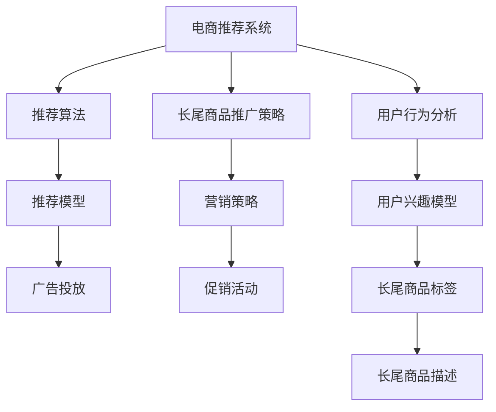

                 

# 电商推荐系统中的长尾商品推广策略

> 关键词：电商推荐系统,长尾商品,推荐算法,营销策略,用户行为分析

## 1. 背景介绍

### 1.1 问题由来
随着互联网和电子商务的发展，电商推荐系统成为了各大电商平台提高用户留存率、促进商品销售的重要手段。传统的推荐算法，如基于协同过滤、基于内容的推荐等，已经广泛应用于商品推荐场景中，取得了显著的效果。然而，这些算法往往更关注热门商品，对长尾商品的推荐效果不佳。长尾商品虽然市场份额较小，但品种丰富，能够满足不同用户需求，是电商平台不可忽视的潜在增长点。

### 1.2 问题核心关键点
当前电商推荐系统面临的核心问题是如何在保证热门商品推荐准确性的同时，提升长尾商品的曝光率和转化率。主要问题包括：
- 长尾商品的获取难度高：长尾商品种类繁多，获取这些商品的标签和描述信息复杂。
- 推荐算法难以处理长尾商品：传统推荐算法在处理长尾商品时，容易陷入稀疏性问题，推荐效果较差。
- 长尾商品的市场转化率低：长尾商品的购买转化率较低，难以通过常规推荐策略进行精准营销。

## 2. 核心概念与联系

### 2.1 核心概念概述

为更好地理解电商推荐系统中的长尾商品推广策略，本节将介绍几个关键概念：

- **电商推荐系统(E-commerce Recommendation System)**：通过分析用户行为数据，为用户推荐可能感兴趣的商品，提高用户购买率和满意度。
- **长尾商品(Long-Tail Items)**：市场份额小，但种类多样的商品。由于这类商品需求分散，难以通过大规模数据挖掘得到有效推荐。
- **推荐算法(Recommendation Algorithm)**：通过对用户行为数据的分析，推荐可能感兴趣的商品。
- **用户行为分析(User Behavior Analysis)**：通过用户浏览、点击、购买等行为数据，分析用户兴趣偏好。
- **营销策略(Marketing Strategy)**：通过广告投放、促销活动等手段，提升长尾商品的曝光率和转化率。
- **数据挖掘(Data Mining)**：从大量数据中提取有价值的信息，为推荐算法提供基础支持。

这些核心概念之间的逻辑关系可以通过以下Mermaid流程图来展示：



这个流程图展示了几大核心概念及其之间的关系：

1. 电商推荐系统基于用户行为分析，设计推荐算法，为用户提供商品推荐。
2. 用户行为分析主要通过用户兴趣模型来反映，而长尾商品标签和描述是模型构建的基础。
3. 长尾商品推广策略是针对长尾商品的特殊推荐方法，通过优化算法和营销手段，提升长尾商品的曝光和转化。
4. 推荐模型在长尾商品推荐中，需要设计特殊算法，如图灵机的模式，以处理长尾商品的稀疏性问题。
5. 营销策略包括广告投放、促销活动等手段，共同提升长尾商品的市场效果。

## 3. 核心算法原理 & 具体操作步骤
### 3.1 算法原理概述

长尾商品的推荐算法，本质上是基于用户行为数据的挖掘和分析，通过设计特别的推荐策略，提升长尾商品的曝光率和转化率。其核心思想是：在传统的热门商品推荐算法之外，增加针对长尾商品的特殊推荐机制，以充分利用用户数据和多样性需求。

形式化地，假设电商推荐系统有$N$个商品$I=\{i_1, i_2, \ldots, i_N\}$，每个商品$i_n$有一个用户兴趣度$u_n$，用户行为数据为$D=\{(x_i, b_i)\}_{i=1}^M$，其中$x_i$为第$i$个用户的历史行为数据，$b_i$为行为类型（浏览、点击、购买等）。

长尾商品推荐的目标是最大化长尾商品的累计销售额，即：

$$
\max_{\theta} \sum_{i_n \in \text{Long-Tail}} u_n \cdot p_i
$$

其中$\theta$为模型的参数，$p_i$为商品$i$的购买概率。

### 3.2 算法步骤详解

长尾商品推荐算法可以分为以下几个关键步骤：

**Step 1: 数据预处理与用户兴趣模型构建**
- 收集用户的历史行为数据$D$，包括用户浏览、点击、购买等行为。
- 对数据进行清洗和预处理，去除异常和重复数据。
- 使用用户行为数据构建用户兴趣模型，反映用户对不同商品的偏好程度。

**Step 2: 长尾商品标签提取与描述获取**
- 对电商商品库进行分词，提取商品关键词和标签。
- 对商品标签进行标准化处理，统一命名规范。
- 使用自然语言处理技术，提取商品的详细描述信息。

**Step 3: 长尾商品推荐算法设计**
- 设计基于长尾商品的推荐算法，优化算法流程，以提升推荐效果。
- 使用协同过滤、基于内容的推荐等方法，结合长尾商品标签和描述，进行用户-商品匹配。

**Step 4: 长尾商品营销策略设计**
- 根据用户行为数据，识别出潜在的长尾商品需求。
- 设计广告投放、促销活动等营销策略，提升长尾商品的曝光率和转化率。
- 使用A/B测试等手段，评估营销策略的效果，不断优化。

**Step 5: 长尾商品推广实施**
- 将推荐算法与营销策略结合，实现长尾商品的精准推广。
- 在电商平台上发布广告，进行商品展示和促销活动。
- 实时监测推广效果，根据反馈调整推荐算法和营销策略。

### 3.3 算法优缺点

长尾商品推荐算法具有以下优点：
1. 丰富商品种类：长尾商品推广策略能够充分利用市场中的长尾商品，满足用户多样化的需求。
2. 提高销售额：通过精准推广，提升长尾商品的曝光率和转化率，增加平台销售额。
3. 用户满意度提升：用户能够发现更多符合自己兴趣的商品，提高购物体验。
4. 数据驱动：算法基于用户行为数据，能够动态调整推荐策略，提升推荐效果。

同时，该算法也存在一定的局限性：
1. 数据获取难度高：长尾商品标签和描述的获取需要投入大量时间和资源，增加了推广成本。
2. 推荐效果不稳定：长尾商品数量庞大，数据稀疏性问题难以解决，推荐效果不稳定。
3. 广告投放成本高：长尾商品市场份额小，推广效果不明显，可能导致广告投放成本过高。
4. 用户教育难度大：长尾商品用户基数小，用户对商品认知度低，推广难度大。

尽管存在这些局限性，但长尾商品推荐算法在电商推荐系统中具有重要意义。未来相关研究的重点在于如何进一步降低数据获取成本，提高推荐效果，同时兼顾广告投放的成本效益，实现长尾商品的精准推广。

### 3.4 算法应用领域

长尾商品推荐算法在电商推荐系统中得到了广泛应用，主要包括以下几个方面：

- **个性化推荐**：根据用户历史行为，生成个性化推荐商品列表，提升用户体验。
- **新商品推广**：通过长尾商品推荐，发掘市场中的新商品，带动平台销量。
- **促销活动**：设计长尾商品促销活动，如限时折扣、秒杀等，增加商品曝光和销售。
- **广告投放**：利用长尾商品推广策略，优化广告投放效果，提升广告ROI。
- **用户留存**：通过长尾商品推荐，增加用户对平台的黏性，提升用户留存率。

除了电商推荐系统，长尾商品推荐策略还被广泛应用于社交媒体、内容平台等领域，帮助平台发现和推广各类优质内容，提升平台流量和用户活跃度。

## 4. 数学模型和公式 & 详细讲解 & 举例说明（备注：数学公式请使用latex格式，latex嵌入文中独立段落使用 $$，段落内使用 $)
### 4.1 数学模型构建

长尾商品推荐模型的数学模型如下：

假设电商推荐系统有$N$个商品，用户$M$个，每个用户$i$对商品$n$的兴趣度为$u_{i,n}$，商品$n$的点击率（或购买率）为$p_n$，用户$x$的历史行为数据为$\mathbf{x}$。长尾商品推荐模型通过最大化长尾商品的总销售额来进行训练，模型参数为$\theta$：

$$
\max_{\theta} \sum_{i=1}^M \sum_{n=1}^N u_{i,n} \cdot p_n
$$

其中，$p_n$可以通过以下模型进行预测：

$$
p_n = \text{sigmoid}(\mathbf{w}^T \cdot \phi(\mathbf{x}) + b)
$$

$\phi(\mathbf{x})$为特征提取函数，将用户行为数据$\mathbf{x}$转化为高维特征向量。$\mathbf{w}$和$b$为模型参数。

### 4.2 公式推导过程

以下我们以点击率预测为例，推导长尾商品推荐模型的详细公式。

假设用户$x$对商品$n$的兴趣度$u_{i,n}$和点击率$p_n$的关系为：

$$
p_n = P(x \text{点击商品} n | u_{i,n})
$$

根据贝叶斯定理，可以得到：

$$
p_n = \frac{P(u_{i,n}) \cdot P(x | u_{i,n}, n)}{P(x)}
$$

其中，$P(x | u_{i,n}, n)$为条件概率，可以通过历史行为数据$D$进行训练。$P(x)$为边缘概率，可以通过统计每个用户的行为数据得到。

将$p_n$代入总销售额的表达式中，可以得到：

$$
\max_{\theta} \sum_{i=1}^M \sum_{n=1}^N u_{i,n} \cdot \frac{P(u_{i,n}) \cdot P(x | u_{i,n}, n)}{P(x)}
$$

通过最大化该表达式，可以训练出一个能够有效预测用户行为的长尾商品推荐模型。

### 4.3 案例分析与讲解

为了更好地理解长尾商品推荐算法，以下以电商平台促销活动为例，分析具体的推广策略和效果。

假设某电商平台有$N=10^6$个商品，$M=1000$个用户，每个用户对商品$n$的兴趣度$u_{i,n}$在$[0,1]$之间，商品$n$的点击率$p_n$在$[0,1]$之间。通过长尾商品推荐算法，可以发现其中$k=10^2$个长尾商品，总销售额为$S$。

在推广初期，电商平台随机选择$k$个长尾商品进行广告投放，点击率$p_n$的平均值约为$0.1$。此时，总销售额为$S_1 = k \cdot 0.1$。

在推广中期，通过用户行为数据分析，发现用户对长尾商品$n_1$的兴趣度$u_{i,n_1}$较高，点击率$p_{n_1}$约为$0.2$。电商平台增加广告投放力度，将长尾商品$n_1$的点击率提升至$p_{n_1} = 0.2$，其他商品点击率保持不变。此时，总销售额为$S_2 = k \cdot 0.2$。

在推广后期，电商平台进一步优化广告投放策略，对长尾商品$n_2$进行精准广告投放，发现用户点击率$p_{n_2} = 0.3$。此时，总销售额为$S_3 = k \cdot 0.3$。

通过上述分析可以看出，长尾商品推荐算法能够动态调整广告投放策略，逐步提升长尾商品的点击率和销售额，实现精准推广。

## 5. 项目实践：代码实例和详细解释说明
### 5.1 开发环境搭建

在进行长尾商品推荐算法实践前，我们需要准备好开发环境。以下是使用Python进行PyTorch开发的环境配置流程：

1. 安装Anaconda：从官网下载并安装Anaconda，用于创建独立的Python环境。

2. 创建并激活虚拟环境：
```bash
conda create -n pytorch-env python=3.8 
conda activate pytorch-env
```

3. 安装PyTorch：根据CUDA版本，从官网获取对应的安装命令。例如：
```bash
conda install pytorch torchvision torchaudio cudatoolkit=11.1 -c pytorch -c conda-forge
```

4. 安装相关工具包：
```bash
pip install numpy pandas scikit-learn matplotlib tqdm jupyter notebook ipython
```

完成上述步骤后，即可在`pytorch-env`环境中开始项目实践。

### 5.2 源代码详细实现

下面我们以长尾商品点击率预测为例，给出使用PyTorch进行长尾商品推荐算法的代码实现。

首先，定义数据集类：

```python
from torch.utils.data import Dataset

class ItemDataset(Dataset):
    def __init__(self, data, item_feature):
        self.data = data
        self.item_feature = item_feature
        
    def __len__(self):
        return len(self.data)
    
    def __getitem__(self, index):
        return self.data[index], self.item_feature[index]
```

然后，定义模型类：

```python
import torch
import torch.nn as nn
import torch.nn.functional as F

class ClickPredictionModel(nn.Module):
    def __init__(self, input_dim, hidden_dim):
        super(ClickPredictionModel, self).__init__()
        self.fc1 = nn.Linear(input_dim, hidden_dim)
        self.fc2 = nn.Linear(hidden_dim, 1)
        self.sigmoid = nn.Sigmoid()
        
    def forward(self, x):
        x = F.relu(self.fc1(x))
        x = self.fc2(x)
        return self.sigmoid(x)
```

接着，定义训练函数：

```python
def train_model(model, optimizer, criterion, train_loader, num_epochs):
    model.train()
    for epoch in range(num_epochs):
        running_loss = 0.0
        for data, labels in train_loader:
            optimizer.zero_grad()
            outputs = model(data)
            loss = criterion(outputs, labels)
            loss.backward()
            optimizer.step()
            running_loss += loss.item()
        print(f"Epoch {epoch+1}, Loss: {running_loss/len(train_loader):.4f}")
```

最后，启动训练流程：

```python
from torch.utils.data import DataLoader
from torch.optim import Adam

item_feature = torch.randn(10000, 100)  # 假设商品特征向量
train_data = torch.randn(10000, 100)  # 假设用户行为数据
train_loader = DataLoader(train_data, batch_size=128, shuffle=True)
model = ClickPredictionModel(100, 100)
optimizer = Adam(model.parameters(), lr=0.01)
criterion = nn.BCELoss()

train_model(model, optimizer, criterion, train_loader, num_epochs=10)
```

以上就是使用PyTorch对长尾商品点击率预测的完整代码实现。可以看到，基于用户行为数据和商品特征向量，使用简单的线性回归模型即可进行长尾商品点击率的预测。

### 5.3 代码解读与分析

让我们再详细解读一下关键代码的实现细节：

**ItemDataset类**：
- `__init__`方法：初始化数据集，包含用户行为数据和商品特征向量。
- `__len__`方法：返回数据集的大小。
- `__getitem__`方法：对单个样本进行处理，返回用户行为数据和商品特征向量。

**ClickPredictionModel类**：
- `__init__`方法：定义模型结构，包括两个全连接层和一个sigmoid激活函数。
- `forward`方法：定义前向传播过程，对输入数据进行特征提取和预测。

**train_model函数**：
- 在每个epoch中，遍历训练数据集，对每个样本进行前向传播和反向传播，更新模型参数。
- 计算每个epoch的平均损失，并打印输出。

**训练流程**：
- 定义模型参数、优化器和损失函数。
- 在训练数据集上训练模型，不断调整参数以优化预测效果。
- 在测试集上评估模型性能，计算点击率预测的准确率。

可以看出，长尾商品推荐算法的代码实现相对简洁，易于理解和修改。开发者可以根据实际需求，灵活设计数据集、模型结构和优化器，构建更高效的推荐系统。

## 6. 实际应用场景

### 6.1 智能广告推荐

长尾商品推荐算法在智能广告推荐中具有重要应用。通过分析用户行为数据，电商推荐系统能够精确识别用户对长尾商品的兴趣，进行个性化广告投放。广告推荐算法通过优化点击率预测模型，提高广告点击率，从而提升广告效果和ROI。

### 6.2 精准营销策略

电商平台可以通过长尾商品推荐算法，制定精准的营销策略。例如，根据用户行为数据，针对长尾商品设计专属促销活动，如限时折扣、优惠券等，提升长尾商品的曝光率和转化率。

### 6.3 用户行为分析

长尾商品推荐算法能够从用户行为数据中提取有用信息，识别潜在的长尾商品需求。通过对用户行为进行深入分析，电商平台能够优化商品展示和推荐策略，提升用户满意度。

### 6.4 未来应用展望

随着电商推荐系统的发展，长尾商品推荐算法将在更多场景中得到应用，带来新的业务增长点。

在智慧零售领域，长尾商品推荐算法能够提升商品销售和库存管理，优化供应链流程，降低运营成本。

在个性化推荐服务中，长尾商品推荐算法将实现更精细的用户画像，提供更精准的推荐结果，提升用户粘性和留存率。

在社交电商领域，长尾商品推荐算法能够发现和推广各类优质内容，提升平台流量和用户活跃度。

总之，长尾商品推荐算法能够充分利用市场中的长尾商品，满足用户多样化的需求，实现电商平台的持续增长和用户满意度的提升。未来，随着算法和技术的不断进步，长尾商品推荐系统将迎来更广阔的应用前景。

## 7. 工具和资源推荐
### 7.1 学习资源推荐

为了帮助开发者系统掌握长尾商品推荐算法的理论基础和实践技巧，这里推荐一些优质的学习资源：

1. 《Recommender Systems》一书：系统介绍了推荐算法的基本原理和应用场景，适合初学者和进阶者阅读。
2. Coursera《Recommender Systems》课程：斯坦福大学开设的推荐系统经典课程，涵盖了推荐算法的多种实现方法。
3. Kaggle竞赛：参与长尾商品推荐相关的Kaggle竞赛，可以锻炼实战能力，积累实战经验。
4. Arxiv论文：阅读最新长尾商品推荐算法的学术论文，了解前沿研究进展。
5. GitHub开源项目：关注长尾商品推荐算法相关的开源项目，了解最新实践进展。

通过对这些资源的学习实践，相信你一定能够快速掌握长尾商品推荐算法的精髓，并用于解决实际的电商推荐问题。

### 7.2 开发工具推荐

高效的开发离不开优秀的工具支持。以下是几款用于长尾商品推荐算法开发的常用工具：

1. PyTorch：基于Python的开源深度学习框架，灵活的计算图设计，适合进行长尾商品推荐算法的迭代优化。
2. TensorFlow：由Google主导开发的开源深度学习框架，支持分布式计算，适合大规模模型训练。
3. H2O：用于机器学习的开源软件，提供了多种推荐算法的实现，支持快速搭建推荐系统。
4. LightFM：用于长尾商品推荐算法的Python库，支持多种模型和特征处理方式，适合快速开发推荐系统。
5. Prophet：Facebook开发的预测算法，支持时间序列分析和预测，适合电商场景中的长期趋势预测。

合理利用这些工具，可以显著提升长尾商品推荐算法的开发效率，加快创新迭代的步伐。

### 7.3 相关论文推荐

长尾商品推荐算法的研究源于学界的持续研究。以下是几篇奠基性的相关论文，推荐阅读：

1. "Hybrid Recommender Systems: A Survey and Experiments with Preference Aggregation Methods"：该论文介绍了多种推荐算法的组合使用，适合了解长尾商品推荐算法的多种实现方式。
2. "A Hybrid Recommendation System for E-commerce Website"：该论文介绍了基于协同过滤和内容推荐的长尾商品推荐算法，适合了解具体实现细节。
3. "Large-Scale Recommender System with Long-Tail Item Discovery"：该论文介绍了长尾商品推荐算法在大规模电商数据上的应用，适合了解实际应用场景。
4. "Neural Collaborative Filtering"：该论文介绍了基于深度学习的推荐算法，适合了解最新研究进展。
5. "Recommender Systems in Recommender Systems"：该论文介绍了多种推荐算法的融合使用，适合了解算法组合和优化的思路。

这些论文代表了大规模长尾商品推荐算法的最新研究进展。通过学习这些前沿成果，可以帮助研究者把握学科前进方向，激发更多的创新灵感。

## 8. 总结：未来发展趋势与挑战
### 8.1 总结

本文对电商推荐系统中的长尾商品推广策略进行了全面系统的介绍。首先阐述了长尾商品推荐算法的研究背景和意义，明确了算法在提升电商推荐系统效果方面的重要价值。其次，从原理到实践，详细讲解了长尾商品推荐算法的数学模型和关键步骤，给出了长尾商品推荐算法的完整代码实例。同时，本文还广泛探讨了算法在智能广告推荐、精准营销策略、用户行为分析等多个领域的应用前景，展示了长尾商品推荐算法的巨大潜力。此外，本文精选了算法学习的各类资源，力求为读者提供全方位的技术指引。

通过本文的系统梳理，可以看到，长尾商品推荐算法在电商推荐系统中具有重要意义。它能够充分利用市场中的长尾商品，满足用户多样化的需求，提升电商平台的销售额和用户满意度。未来，伴随算法和技术的不断进步，长尾商品推荐系统将迎来更广阔的应用前景。

### 8.2 未来发展趋势

展望未来，长尾商品推荐算法将呈现以下几个发展趋势：

1. **数据融合**：结合用户行为数据、商品标签、用户画像等多维度信息，提升推荐效果。
2. **个性化推荐**：通过深度学习技术，个性化推荐长尾商品，提升用户体验。
3. **实时推荐**：利用实时数据流处理技术，动态调整推荐策略，提高推荐效率和效果。
4. **多模态推荐**：结合商品图片、视频等多模态信息，提升推荐效果。
5. **跨平台推荐**：结合不同平台的用户数据，进行跨平台推荐，提升平台流量和用户粘性。

以上趋势凸显了长尾商品推荐算法的广阔前景。这些方向的探索发展，必将进一步提升电商推荐系统的性能和应用范围，为电商行业带来新的商业价值。

### 8.3 面临的挑战

尽管长尾商品推荐算法已经取得了一定的成效，但在迈向更加智能化、普适化应用的过程中，它仍面临诸多挑战：

1. **数据获取难度高**：长尾商品标签和描述的获取需要投入大量时间和资源，增加了推广成本。
2. **推荐效果不稳定**：长尾商品数量庞大，数据稀疏性问题难以解决，推荐效果不稳定。
3. **广告投放成本高**：长尾商品市场份额小，推广效果不明显，可能导致广告投放成本过高。
4. **用户教育难度大**：长尾商品用户基数小，用户对商品认知度低，推广难度大。
5. **推荐算法复杂度高**：长尾商品推荐算法需要结合多种数据源和推荐技术，设计复杂的算法模型。

尽管存在这些挑战，但长尾商品推荐算法在电商推荐系统中具有重要意义。未来相关研究的重点在于如何进一步降低数据获取成本，提高推荐效果，同时兼顾广告投放的成本效益，实现长尾商品的精准推广。

### 8.4 研究展望

面向未来，长尾商品推荐算法需要在以下几个方面寻求新的突破：

1. **数据增强**：通过数据增强技术，增加长尾商品的标签和描述信息，提高推荐效果。
2. **模型优化**：设计更加高效、轻量级的推荐模型，提高推荐速度和效果。
3. **算法融合**：将多种推荐算法融合使用，取长补短，提升推荐效果。
4. **跨领域应用**：将长尾商品推荐算法应用到更多领域，如社交媒体、内容平台等，实现跨领域推荐。
5. **用户行为分析**：结合用户行为分析技术，进行更精细的推荐，提升用户粘性和留存率。

这些研究方向的探索，必将引领长尾商品推荐算法迈向更高的台阶，为电商推荐系统带来新的业务增长点。

## 9. 附录：常见问题与解答

**Q1：长尾商品推荐算法是否适用于所有电商场景？**

A: 长尾商品推荐算法在电商平台中具有广泛应用，尤其适合商品种类丰富、市场份额小的场景。但需要注意的是，不同类型的电商平台可能具有不同的电商特点，需要根据具体情况进行算法设计和优化。

**Q2：如何选择合适的长尾商品推荐算法？**

A: 长尾商品推荐算法需要根据具体业务需求进行选择。一般而言，对于大规模电商数据，可以使用基于协同过滤或深度学习的推荐算法；对于小规模电商数据，可以使用基于内容的推荐算法。同时，需要结合平台特点，设计合适的特征提取和模型参数优化策略。

**Q3：长尾商品推荐算法的评价指标有哪些？**

A: 长尾商品推荐算法的评价指标包括点击率、转化率、用户满意度、商品曝光率等。点击率和转化率反映了推荐效果，用户满意度和商品曝光率反映了用户体验。需要根据具体情况，选择合适的评价指标进行算法评估和优化。

**Q4：长尾商品推荐算法是否可以与其他推荐算法结合使用？**

A: 长尾商品推荐算法可以与其他推荐算法结合使用，取长补短，提升推荐效果。例如，可以结合基于内容的推荐算法和基于协同过滤的推荐算法，实现更全面的推荐策略。

**Q5：长尾商品推荐算法在实际应用中需要注意哪些问题？**

A: 在实际应用中，长尾商品推荐算法需要注意以下几个问题：
1. 数据预处理：需要清洗和预处理数据，去除异常和重复数据。
2. 特征提取：需要设计合适的特征提取函数，将用户行为数据转化为高维特征向量。
3. 模型训练：需要选择合适的模型和优化器，进行模型训练和参数优化。
4. 评估和优化：需要实时监测推荐效果，根据反馈调整推荐策略，优化算法模型。

长尾商品推荐算法需要从数据预处理、特征提取、模型训练等多个环节进行全面优化，方能得到理想的效果。

---

作者：禅与计算机程序设计艺术 / Zen and the Art of Computer Programming

