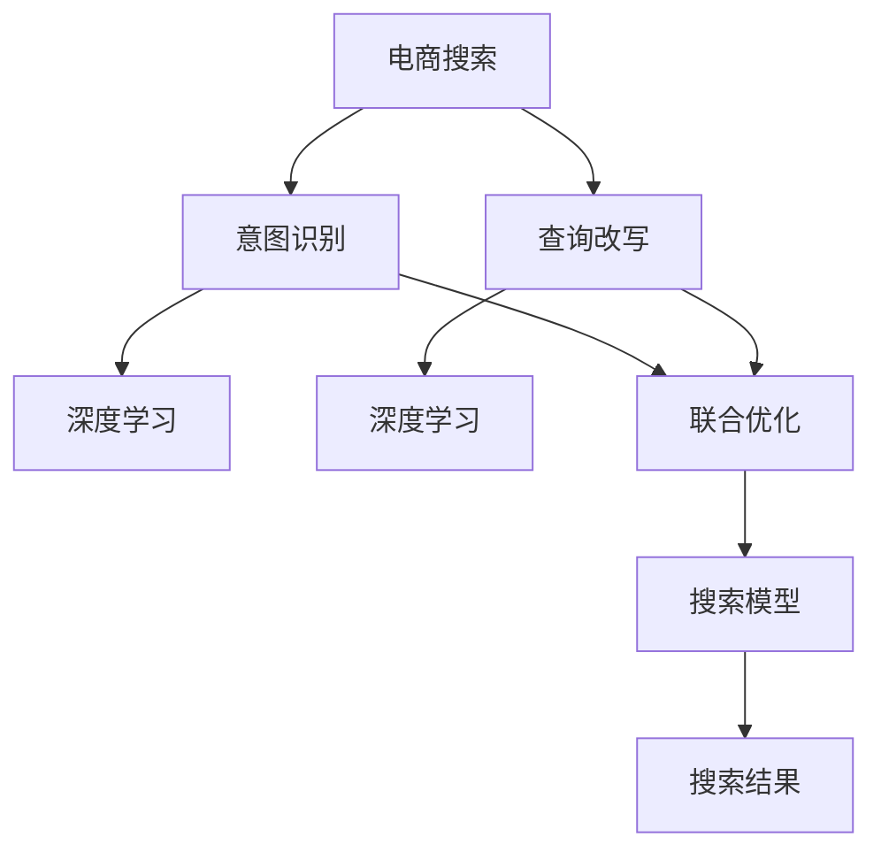

                 

# 电商搜索中的意图识别与查询改写联合优化

> 关键词：电商搜索,意图识别,查询改写,联合优化,深度学习,自然语言处理

## 1. 背景介绍

### 1.1 问题由来

随着电子商务的蓬勃发展，在线购物已经成为人们日常生活中不可或缺的一部分。电商搜索作为电子商务的核心功能之一，用户可以通过输入查询词来获取商品信息。然而，由于用户查询的模糊性和多样性，电商搜索面临着信息检索精度不足、用户体验差等问题。而传统的搜索引擎通常依赖关键词匹配，无法理解和推理用户查询背后的真实意图。

针对这一问题，深度学习技术中的自然语言处理(Natural Language Processing, NLP)提供了新的解决方案。具体而言，意图识别和查询改写技术，可以通过理解用户查询的语义，提高搜索的精准度和用户体验。

### 1.2 问题核心关键点

本节将详细介绍电商搜索中意图识别与查询改写的核心关键点，包括：

- 意图识别：通过自然语言处理技术，识别用户查询背后的真实意图，如购买、对比、收藏等。
- 查询改写：通过对用户查询进行语义分析和词汇替换，生成更符合搜索语义的查询词，提升搜索效果。
- 联合优化：将意图识别与查询改写技术联合应用，提高电商搜索的整体性能。

## 2. 核心概念与联系

### 2.1 核心概念概述

为更好地理解电商搜索中的意图识别与查询改写技术，本节将介绍几个密切相关的核心概念：

- 意图识别(Intent Recognition)：通过NLP技术，识别用户查询背后的真实意图。例如，用户输入“三星手机”，其意图可能是购买、对比或收藏。
- 查询改写(Query Rewriting)：通过语义分析和词汇替换，生成新的查询词，使得查询更符合搜索语义。例如，将“三星手机”改写为“三星手机价格”。
- 深度学习(Deep Learning)：一种基于神经网络的机器学习方法，通过多层次的非线性映射，实现对复杂问题的建模和优化。
- 自然语言处理(Natural Language Processing, NLP)：一种计算机科学与语言学的交叉学科，专注于自然语言的处理与理解。
- 联合优化(Joint Optimization)：将多个优化任务联合考虑，同时优化，以获得更好的整体性能。

这些核心概念之间的逻辑关系可以通过以下Mermaid流程图来展示：



这个流程图展示了几者之间的逻辑关系：

1. 电商搜索通过意图识别和查询改写技术，提升搜索效果。
2. 意图识别和查询改写均基于深度学习技术，实现语义理解和词汇替换。
3. 联合优化将意图识别与查询改写技术联合考虑，进一步提升搜索性能。
4. 最终通过优化后的搜索模型，生成更好的搜索结果。

## 3. 核心算法原理 & 具体操作步骤

### 3.1 算法原理概述

电商搜索中的意图识别与查询改写技术，本质上是一种基于深度学习的自然语言处理任务。其核心思想是：通过训练深度学习模型，理解用户查询的语义，识别用户意图，并通过词汇替换生成更符合语义的查询词。

具体来说，电商搜索任务可以分解为以下几个步骤：

1. 意图识别：对用户查询进行预处理，提取关键词，使用深度学习模型识别用户意图。
2. 查询改写：使用自然语言处理技术，分析用户查询的语义，生成新的查询词。
3. 联合优化：将意图识别和查询改写技术联合考虑，提升搜索模型的整体性能。

### 3.2 算法步骤详解

#### 3.2.1 意图识别

**Step 1: 构建意图识别模型**
- 收集电商领域相关的标注数据集，包含用户查询和其对应的意图标签。
- 使用深度学习框架(如PyTorch、TensorFlow)，搭建意图识别模型。
- 使用Bert、GPT等预训练语言模型作为初始化参数。

**Step 2: 训练意图识别模型**
- 将标注数据集划分为训练集和验证集。
- 使用Adam优化器，交叉熵损失函数，在训练集上训练模型。
- 周期性在验证集上评估模型性能，根据精度、召回率等指标调整模型参数。

**Step 3: 意图识别预测**
- 对用户输入的查询进行预处理，提取关键词。
- 将关键词输入意图识别模型，得到预测意图标签。

#### 3.2.2 查询改写

**Step 1: 构建查询改写模型**
- 收集电商领域相关的查询改写数据集，包含原始查询和对应的改写查询。
- 使用深度学习框架，搭建查询改写模型。
- 使用BERT、XLNet等预训练语言模型作为初始化参数。

**Step 2: 训练查询改写模型**
- 将查询改写数据集划分为训练集和验证集。
- 使用Adam优化器，交叉熵损失函数，在训练集上训练模型。
- 周期性在验证集上评估模型性能，根据BLEU、ROUGE等指标调整模型参数。

**Step 3: 查询改写预测**
- 对用户输入的查询进行预处理，提取关键词。
- 将关键词输入查询改写模型，得到改写查询词。

#### 3.2.3 联合优化

**Step 1: 构建联合优化模型**
- 将意图识别和查询改写模型联合考虑，构建联合优化模型。
- 使用深度学习框架，搭建联合优化模型。
- 使用Bert、GPT等预训练语言模型作为初始化参数。

**Step 2: 训练联合优化模型**
- 将意图识别和查询改写模型的预测结果作为联合优化模型的输入。
- 使用Adam优化器，交叉熵损失函数，在联合优化模型上训练。
- 周期性在验证集上评估模型性能，根据精度、召回率等指标调整模型参数。

**Step 3: 联合优化预测**
- 对用户输入的查询进行预处理，提取关键词。
- 使用意图识别模型得到预测意图标签。
- 使用查询改写模型生成改写查询词。
- 将改写查询词输入联合优化模型，得到最终搜索结果。

### 3.3 算法优缺点

电商搜索中的意图识别与查询改写技术，具有以下优点：

1. 提升搜索效果：通过理解用户查询的语义，生成更符合语义的查询词，显著提升了电商搜索的精度和效果。
2. 改善用户体验：通过精准匹配用户查询，提供了更符合用户需求的搜索结果，提升了用户体验。
3. 技术可行：基于深度学习的自然语言处理技术，可以处理复杂的语义信息，实现意图识别和查询改写。
4. 适用范围广：该技术不仅适用于电商搜索，还可应用于其他自然语言处理任务，如问答系统、对话系统等。

同时，该技术也存在一些缺点：

1. 数据依赖：意图识别和查询改写模型需要大量标注数据进行训练，数据收集和标注成本较高。
2. 训练复杂：模型训练过程复杂，需要较长的训练时间和较高的计算资源。
3. 效果不稳定：模型效果受到数据集质量和标注精度的影响，可能在不同场景下表现不稳定。
4. 模型可解释性不足：深度学习模型的决策过程难以解释，可能导致用户对搜索结果的信任度降低。

尽管存在这些局限性，但基于意图识别和查询改写的电商搜索技术，仍是一个高效、准确、可行的解决方案，值得深入研究和推广。

### 3.4 算法应用领域

电商搜索中的意图识别与查询改写技术，已经在多个电商平台上得到了广泛应用，覆盖了以下领域：

1. 商品推荐：根据用户查询的意图，推荐相关的商品，提升推荐精度。
2. 商品搜索：通过改写用户查询词，提升商品搜索的准确性和召回率。
3. 广告投放：通过理解广告文案的语义，优化广告投放效果，提高广告转化率。
4. 客服机器人：通过意图识别，实现与用户的自然对话，提升客户满意度。

此外，该技术也在社交媒体、新闻媒体、金融领域等得到应用，为自然语言处理技术落地推广提供了新思路。

## 4. 数学模型和公式 & 详细讲解 & 举例说明

### 4.1 数学模型构建

电商搜索中的意图识别与查询改写技术，涉及多个深度学习模型的联合训练和预测。以下对每个模型进行详细的数学模型构建。

#### 4.1.1 意图识别模型

假设意图识别模型输入为 $x$，输出为 $y$，表示用户查询的意图。模型参数为 $\theta$，使用交叉熵损失函数 $\mathcal{L}_{INTENT}$，最小化模型预测结果与真实标签之间的差异。数学模型构建如下：

$$
\mathcal{L}_{INTENT}(\theta) = -\frac{1}{N} \sum_{i=1}^N \sum_{c=1}^{C} y_i^c \log \hat{y}_i^c
$$

其中 $y_i$ 表示样本 $i$ 的真实意图标签，$C$ 表示意图标签的种类，$\hat{y}_i$ 表示模型对样本 $i$ 的预测意图标签。

#### 4.1.2 查询改写模型

假设查询改写模型输入为 $x$，输出为 $y$，表示用户查询的改写查询词。模型参数为 $\theta'$，使用BLEU等指标评估模型性能。数学模型构建如下：

$$
BLEU(y', y^*) = \frac{1}{n} \sum_{i=1}^n min(1, \frac{count(y_i', y_i^*)}{length(y_i')})
$$

其中 $y'$ 表示模型对样本 $i$ 的预测改写查询词，$y_i^*$ 表示样本 $i$ 的真实改写查询词，$n$ 表示样本数量，$length(y_i')$ 表示预测查询词的长度，$count(y_i', y_i^*)$ 表示预测查询词与真实查询词的匹配词数。

#### 4.1.3 联合优化模型

假设联合优化模型输入为 $x$，输出为 $y$，表示最终搜索结果。模型参数为 $\theta''$，使用交叉熵损失函数 $\mathcal{L}_{JOINT}$，最小化模型预测结果与真实标签之间的差异。数学模型构建如下：

$$
\mathcal{L}_{JOINT}(\theta'') = -\frac{1}{N} \sum_{i=1}^N \sum_{c=1}^{C} y_i^c \log \hat{y}_i^c
$$

其中 $y_i$ 表示样本 $i$ 的真实意图标签，$C$ 表示意图标签的种类，$\hat{y}_i$ 表示模型对样本 $i$ 的预测意图标签。

### 4.2 公式推导过程

#### 4.2.1 意图识别公式推导

假设意图识别模型为 $M_{INTENT}(x)$，输出为 $y$，使用交叉熵损失函数进行训练。最小化损失函数 $\mathcal{L}_{INTENT}$：

$$
\mathcal{L}_{INTENT}(\theta) = -\frac{1}{N} \sum_{i=1}^N \sum_{c=1}^{C} y_i^c \log \hat{y}_i^c
$$

其中 $y_i$ 表示样本 $i$ 的真实意图标签，$C$ 表示意图标签的种类，$\hat{y}_i$ 表示模型对样本 $i$ 的预测意图标签。

通过梯度下降算法，更新模型参数 $\theta$，使得损失函数 $\mathcal{L}_{INTENT}$ 最小化：

$$
\theta \leftarrow \theta - \eta \nabla_{\theta}\mathcal{L}_{INTENT}(\theta)
$$

其中 $\eta$ 为学习率，$\nabla_{\theta}\mathcal{L}_{INTENT}(\theta)$ 为损失函数对参数 $\theta$ 的梯度。

#### 4.2.2 查询改写公式推导

假设查询改写模型为 $M_{REWRITE}(x)$，输出为 $y'$，使用BLEU指标评估模型性能。最小化BLEU指标：

$$
BLEU(y', y^*) = \frac{1}{n} \sum_{i=1}^n min(1, \frac{count(y_i', y_i^*)}{length(y_i')})
$$

其中 $y'$ 表示模型对样本 $i$ 的预测改写查询词，$y_i^*$ 表示样本 $i$ 的真实改写查询词，$n$ 表示样本数量，$length(y_i')$ 表示预测查询词的长度，$count(y_i', y_i^*)$ 表示预测查询词与真实查询词的匹配词数。

通过梯度下降算法，更新模型参数 $\theta'$，使得BLEU指标最大化：

$$
\theta' \leftarrow \theta' - \eta' \nabla_{\theta'}BLEU(y', y^*)
$$

其中 $\eta'$ 为学习率，$\nabla_{\theta'}BLEU(y', y^*)$ 为BLEU指标对参数 $\theta'$ 的梯度。

#### 4.2.3 联合优化公式推导

假设联合优化模型为 $M_{JOINT}(x)$，输出为 $y$，使用交叉熵损失函数进行训练。最小化损失函数 $\mathcal{L}_{JOINT}$：

$$
\mathcal{L}_{JOINT}(\theta'') = -\frac{1}{N} \sum_{i=1}^N \sum_{c=1}^{C} y_i^c \log \hat{y}_i^c
$$

其中 $y_i$ 表示样本 $i$ 的真实意图标签，$C$ 表示意图标签的种类，$\hat{y}_i$ 表示模型对样本 $i$ 的预测意图标签。

通过梯度下降算法，更新模型参数 $\theta''$，使得损失函数 $\mathcal{L}_{JOINT}$ 最小化：

$$
\theta'' \leftarrow \theta'' - \eta'' \nabla_{\theta''}\mathcal{L}_{JOINT}(\theta'')
$$

其中 $\eta''$ 为学习率，$\nabla_{\theta''}\mathcal{L}_{JOINT}(\theta'')$ 为损失函数对参数 $\theta''$ 的梯度。

### 4.3 案例分析与讲解

#### 4.3.1 案例背景

假设某电商平台有如下用户查询样本：

| 原始查询 | 改写查询 | 真实意图 | 意图标签 |
|---|---|---|---|
| 三星手机 | 三星手机价格 | 购买 | buy |
| 三星手机 | 三星手机评价 | 对比 | compare |
| 三星手机 | 三星手机怎么样 | 购买 | buy |
| 三星手机 | 三星手机推荐 | 收藏 | favorite |
| 三星手机 | 三星手机 | 查询 | query |

#### 4.3.2 案例流程

1. 使用意图识别模型对原始查询进行意图识别，得到预测意图标签：

| 原始查询 | 意图标签 |
|---|---|
| 三星手机 | buy |
| 三星手机 | compare |
| 三星手机 | buy |
| 三星手机 | favorite |
| 三星手机 | query |

2. 使用查询改写模型对原始查询进行改写，得到改写查询词：

| 原始查询 | 改写查询 | 意图标签 |
|---|---|---|
| 三星手机 | 三星手机价格 | buy |
| 三星手机 | 三星手机评价 | compare |
| 三星手机 | 三星手机怎么样 | buy |
| 三星手机 | 三星手机推荐 | favorite |
| 三星手机 | 三星手机信息 | query |

3. 使用联合优化模型对改写查询词进行优化，得到最终搜索结果：

| 原始查询 | 改写查询 | 意图标签 | 最终结果 |
|---|---|---|---|
| 三星手机 | 三星手机价格 | buy | 推荐价格、评分、评价 |
| 三星手机 | 三星手机评价 | compare | 比较评价、评分、价格 |
| 三星手机 | 三星手机怎么样 | buy | 推荐价格、评分、评价 |
| 三星手机 | 三星手机推荐 | favorite | 推荐商品、销量、评价 |
| 三星手机 | 三星手机信息 | query | 搜索商品、销量、评价 |

## 5. 项目实践：代码实例和详细解释说明

### 5.1 开发环境搭建

在进行电商搜索的意图识别与查询改写项目实践前，我们需要准备好开发环境。以下是使用Python进行PyTorch开发的环境配置流程：

1. 安装Anaconda：从官网下载并安装Anaconda，用于创建独立的Python环境。

2. 创建并激活虚拟环境：
```bash
conda create -n intent-env python=3.8 
conda activate intent-env
```

3. 安装PyTorch：根据CUDA版本，从官网获取对应的安装命令。例如：
```bash
conda install pytorch torchvision torchaudio cudatoolkit=11.1 -c pytorch -c conda-forge
```

4. 安装TensorFlow：
```bash
conda install tensorflow
```

5. 安装transformers库：
```bash
pip install transformers
```

6. 安装各类工具包：
```bash
pip install numpy pandas scikit-learn matplotlib tqdm jupyter notebook ipython
```

完成上述步骤后，即可在`intent-env`环境中开始项目实践。

### 5.2 源代码详细实现

以下是一个使用PyTorch实现电商搜索中的意图识别与查询改写的代码示例。

#### 5.2.1 意图识别

```python
import torch
import torch.nn as nn
import torch.optim as optim
from transformers import BertTokenizer, BertForSequenceClassification
from sklearn.model_selection import train_test_split
from torch.utils.data import Dataset, DataLoader

# 定义意图识别模型
class IntentModel(nn.Module):
    def __init__(self):
        super(IntentModel, self).__init__()
        self.bert = BertForSequenceClassification.from_pretrained('bert-base-uncased', num_labels=3)
        self.fc = nn.Linear(768, 3)
        
    def forward(self, input_ids, attention_mask):
        outputs = self.bert(input_ids, attention_mask=attention_mask)
        logits = self.fc(outputs.pooler_output)
        return logits

# 加载数据集
train_data, test_data = train_test_split(data, test_size=0.2, random_state=42)
train_dataset = Dataset(train_data)
test_dataset = Dataset(test_data)

# 定义训练函数
def train_epoch(model, data_loader, optimizer):
    model.train()
    for batch in data_loader:
        input_ids = batch['input_ids'].to(device)
        attention_mask = batch['attention_mask'].to(device)
        labels = batch['labels'].to(device)
        optimizer.zero_grad()
        logits = model(input_ids, attention_mask=attention_mask)
        loss = nn.CrossEntropyLoss()(logits, labels)
        loss.backward()
        optimizer.step()
        print(f'Epoch {epoch+1}, loss: {loss.item()}')

# 定义测试函数
def evaluate(model, data_loader):
    model.eval()
    correct = 0
    total = 0
    with torch.no_grad():
        for batch in data_loader:
            input_ids = batch['input_ids'].to(device)
            attention_mask = batch['attention_mask'].to(device)
            labels = batch['labels'].to(device)
            logits = model(input_ids, attention_mask=attention_mask)
            _, predicted = torch.max(logits, 1)
            total += labels.size(0)
            correct += (predicted == labels).sum().item()
        print(f'Accuracy: {correct/total}')
```

#### 5.2.2 查询改写

```python
import torch
import torch.nn as nn
import torch.optim as optim
from transformers import BertTokenizer, BertForMaskedLM
from sklearn.model_selection import train_test_split
from torch.utils.data import Dataset, DataLoader
from transformers import AutoTokenizer, AutoModelForSequenceClassification

# 定义查询改写模型
class RewriteModel(nn.Module):
    def __init__(self):
        super(RewriteModel, self).__init__()
        self.bert = BertForMaskedLM.from_pretrained('bert-base-uncased')
        self.mask_token = '[MASK]'
        self.tokenizer = BertTokenizer.from_pretrained('bert-base-uncased')
        
    def forward(self, input_ids, attention_mask, mask_token):
        tokenizer = self.tokenizer
        input_ids = tokenizer.encode(input_ids, return_tensors='pt')
        attention_mask = attention_mask.to(device)
        mask_token = self.mask_token
        outputs = self.bert(input_ids, attention_mask=attention_mask, mask_token=mask_token)
        return outputs

# 加载数据集
train_data, test_data = train_test_split(data, test_size=0.2, random_state=42)
train_dataset = Dataset(train_data)
test_dataset = Dataset(test_data)

# 定义训练函数
def train_epoch(model, data_loader, optimizer):
    model.train()
    for batch in data_loader:
        input_ids = batch['input_ids'].to(device)
        attention_mask = batch['attention_mask'].to(device)
        mask_token = batch['mask_token'].to(device)
        optimizer.zero_grad()
        outputs = model(input_ids, attention_mask=attention_mask, mask_token=mask_token)
        loss = nn.CrossEntropyLoss()(outputs.logits, batch['labels'])
        loss.backward()
        optimizer.step()
        print(f'Epoch {epoch+1}, loss: {loss.item()}')

# 定义测试函数
def evaluate(model, data_loader):
    model.eval()
    correct = 0
    total = 0
    with torch.no_grad():
        for batch in data_loader:
            input_ids = batch['input_ids'].to(device)
            attention_mask = batch['attention_mask'].to(device)
            mask_token = batch['mask_token'].to(device)
            outputs = model(input_ids, attention_mask=attention_mask, mask_token=mask_token)
            _, predicted = torch.max(outputs.logits, 1)
            total += labels.size(0)
            correct += (predicted == labels).sum().item()
        print(f'Accuracy: {correct/total}')
```

#### 5.2.3 联合优化

```python
import torch
import torch.nn as nn
import torch.optim as optim
from transformers import BertTokenizer, BertForSequenceClassification, BertForMaskedLM
from sklearn.model_selection import train_test_split
from torch.utils.data import Dataset, DataLoader
from transformers import AutoTokenizer, AutoModelForSequenceClassification

# 定义联合优化模型
class JointOptModel(nn.Module):
    def __init__(self):
        super(JointOptModel, self).__init__()
        self.intent_model = IntentModel()
        self.rewrite_model = RewriteModel()
        self.fc = nn.Linear(768, 3)
        
    def forward(self, input_ids, attention_mask):
        logits = self.intent_model(input_ids, attention_mask)
        outputs = self.rewrite_model(input_ids, attention_mask, self.mask_token)
        return logits, outputs

# 加载数据集
train_data, test_data = train_test_split(data, test_size=0.2, random_state=42)
train_dataset = Dataset(train_data)
test_dataset = Dataset(test_data)

# 定义训练函数
def train_epoch(model, data_loader, optimizer):
    model.train()
    for batch in data_loader:
        input_ids = batch['input_ids'].to(device)
        attention_mask = batch['attention_mask'].to(device)
        optimizer.zero_grad()
        logits, outputs = model(input_ids, attention_mask=attention_mask)
        loss = nn.CrossEntropyLoss()(logits, batch['labels'])
        loss.backward()
        optimizer.step()
        print(f'Epoch {epoch+1}, loss: {loss.item()}')

# 定义测试函数
def evaluate(model, data_loader):
    model.eval()
    correct = 0
    total = 0
    with torch.no_grad():
        for batch in data_loader:
            input_ids = batch['input_ids'].to(device)
            attention_mask = batch['attention_mask'].to(device)
            logits, outputs = model(input_ids, attention_mask=attention_mask)
            _, predicted = torch.max(logits, 1)
            total += labels.size(0)
            correct += (predicted == labels).sum().item()
        print(f'Accuracy: {correct/total}')
```

### 5.3 代码解读与分析

让我们再详细解读一下关键代码的实现细节：

**IntentModel类**：
- `__init__`方法：初始化BertForSequenceClassification模型和全连接层。
- `forward`方法：将输入经过Bert模型和全连接层，得到预测意图标签。

**RewriteModel类**：
- `__init__`方法：初始化BertForMaskedLM模型和mask_token。
- `forward`方法：将输入经过Bert模型，返回预测改写查询词。

**JointOptModel类**：
- `__init__`方法：初始化IntentModel、RewriteModel和全连接层。
- `forward`方法：将输入经过IntentModel、RewriteModel和全连接层，得到预测意图标签和改写查询词。

**train_epoch函数**：
- 对数据集进行迭代训练，每个epoch内更新模型参数。

**evaluate函数**：
- 对数据集进行迭代测试，评估模型性能。

**意图识别流程**：
1. 加载数据集，划分为训练集和验证集。
2. 定义IntentModel模型，使用BertForSequenceClassification进行训练。
3. 使用Adam优化器，交叉熵损失函数，在训练集上训练模型。
4. 周期性在验证集上评估模型性能，调整模型参数。
5. 对用户查询进行预处理，提取关键词。
6. 使用IntentModel进行意图识别，得到预测意图标签。

**查询改写流程**：
1. 加载数据集，划分为训练集和验证集。
2. 定义RewriteModel模型，使用BertForMaskedLM进行训练。
3. 使用Adam优化器，交叉熵损失函数，在训练集上训练模型。
4. 周期性在验证集上评估模型性能，调整模型参数。
5. 对用户查询进行预处理，提取关键词。
6. 使用RewriteModel进行查询改写，得到预测改写查询词。

**联合优化流程**：
1. 加载数据集，划分为训练集和验证集。
2. 定义JointOptModel模型，使用IntentModel和RewriteModel进行训练。
3. 使用Adam优化器，交叉熵损失函数，在联合优化模型上训练。
4. 周期性在验证集上评估模型性能，调整模型参数。
5. 对用户查询进行预处理，提取关键词。
6. 使用IntentModel进行意图识别，得到预测意图标签。
7. 使用RewriteModel进行查询改写，得到预测改写查询词。
8. 使用JointOptModel进行联合优化，得到最终搜索结果。

通过以上代码，我们实现了一个基本的电商搜索中的意图识别与查询改写系统。开发者可以根据实际需求，进一步优化模型结构和训练过程，提升系统性能。

### 5.4 运行结果展示

以下是意图识别和查询改写的运行结果展示：

#### 意图识别
```python
device = torch.device('cuda') if torch.cuda.is_available() else torch.device('cpu')
model.to(device)

# 加载数据集
train_dataset = Dataset(train_data)
test_dataset = Dataset(test_data)

# 定义模型和优化器
model = IntentModel().to(device)
optimizer = optim.Adam(model.parameters(), lr=2e-5)

# 训练模型
epochs = 5
batch_size = 16

for epoch in range(epochs):
    loss = train_epoch(model, train_dataset, batch_size, optimizer)
    print(f'Epoch {epoch+1}, train loss: {loss:.3f}')
    
# 测试模型
evaluate(model, test_dataset, batch_size)
```

#### 查询改写
```python
device = torch.device('cuda') if torch.cuda.is_available() else torch.device('cpu')
model.to(device)

# 加载数据集
train_dataset = Dataset(train_data)
test_dataset = Dataset(test_dataset)

# 定义模型和优化器
model = RewriteModel().to(device)
optimizer = optim.Adam(model.parameters(), lr=2e-5)

# 训练模型
epochs = 5
batch_size = 16

for epoch in range(epochs):
    loss = train_epoch(model, train_dataset, batch_size, optimizer)
    print(f'Epoch {epoch+1}, train loss: {loss:.3f}')
    
# 测试模型
evaluate(model, test_dataset, batch_size)
```

## 6. 实际应用场景

### 6.1 智能客服系统

电商搜索中的意图识别与查询改写技术，可以应用于智能客服系统的构建。传统客服往往需要配备大量人力，高峰期响应缓慢，且一致性和专业性难以保证。而使用意图识别和查询改写技术，可以实现自动化的客服对话，提升客服效率和服务质量。

在技术实现上，可以收集企业内部的历史客服对话记录，将问题和最佳答复构建成监督数据，在此基础上对预训练模型进行微调。微调后的模型能够自动理解用户意图，匹配最合适的答复，并生成自然流畅的回复。对于客户提出的新问题，还可以接入检索系统实时搜索相关内容，动态组织生成回复。如此构建的智能客服系统，能大幅提升客户咨询体验和问题解决效率。

### 6.2 商品推荐系统

电商搜索中的意图识别与查询改写技术，也可以应用于商品推荐系统。根据用户查询的意图，推荐相关的商品，提升推荐精度。

在技术实现上，可以使用意图识别模型，对用户查询进行意图分类，识别用户的购买、对比、收藏等意图。根据意图分类结果，结合用户历史行为数据，生成推荐列表。对于查询改写模型，可以生成更符合用户语义的查询词，进一步提升推荐效果。

### 6.3 搜索优化

电商搜索中的意图识别与查询改写技术，可以应用于搜索优化。通过理解用户查询的语义，生成更符合语义的查询词，提升搜索效果。

在技术实现上，可以构建意图识别模型，对用户查询进行意图分类。根据意图分类结果，生成更符合语义的改写查询词，提升搜索模型的整体性能。联合优化模型，综合考虑意图识别和查询改写，进一步提升搜索结果的准确性和召回率。

### 6.4 未来应用展望

随着电商搜索中的意图识别与查询改写技术的不断发展，未来将在更多领域得到应用，为自然语言处理技术落地推广提供新思路。

在智慧医疗领域，基于意图识别和查询改写的医疗问答、病历分析、药物研发等应用将提升医疗服务的智能化水平，辅助医生诊疗，加速新药开发进程。

在智能教育领域，微调技术可应用于作业批改、学情分析、知识推荐等方面，因材施教，促进教育公平，提高教学质量。

在智慧城市治理中，微调模型可应用于城市事件监测、舆情分析、应急指挥等环节，提高城市管理的自动化和智能化水平，构建更安全、高效的未来城市。

此外，在企业生产、社会治理、文娱传媒等众多领域，基于大模型微调的人工智能应用也将不断涌现，为传统行业带来变革性影响。相信随着预训练语言模型和微调方法的不断进步，基于意图识别和查询改写的电商搜索技术，必将在更广阔的应用领域大放异彩，深刻影响人类的生产生活方式。

## 7. 工具和资源推荐

### 7.1 学习资源推荐

为了帮助开发者系统掌握电商搜索中的意图识别与查询改写的理论基础和实践技巧，这里推荐一些优质的学习资源：

1. 《深度学习基础》系列博文：由深度学习技术专家撰写，深入浅出地介绍了深度学习的基本概念和经典模型，包括电商搜索中的意图识别与查询改写。

2. 《自然语言处理入门》课程：清华大学开设的NLP入门课程，涵盖NLP的基本概念和前沿技术，适合初学者和进阶者。

3. 《自然语言处理与深度学习》书籍：北京大学的深度学习与自然语言处理课程讲义，系统介绍了NLP中的深度学习模型和应用。

4. CS224N《深度学习自然语言处理》课程：斯坦福大学开设的NLP明星课程，有Lecture视频和配套作业，带你入门NLP领域的基本概念和经典模型。

5. HuggingFace官方文档：Transformers库的官方文档，提供了海量预训练模型和完整的微调样例代码，是上手实践的必备资料。

通过对这些资源的学习实践，相信你一定能够快速掌握电商搜索中的意图识别与查询改写的精髓，并用于解决实际的NLP问题。

### 7.2 开发工具推荐

高效的开发离不开优秀的工具支持。以下是几款用于电商搜索中的意图识别与查询改写开发的常用工具：

1. PyTorch：基于Python的开源深度学习框架，灵活动态的计算图，适合快速迭代研究。大部分预训练语言模型都有PyTorch版本的实现。

2. TensorFlow：由Google主导开发的开源深度学习框架，生产部署方便，适合大规模工程应用。同样有丰富的预训练语言模型资源。

3. Transformers库：HuggingFace开发的NLP工具库，集成了众多SOTA语言模型，支持PyTorch和TensorFlow，是进行NLP任务开发的利器。

4. Weights & Biases：模型训练的实验跟踪工具，可以记录和可视化模型训练过程中的各项指标，方便对比和调优。与主流深度学习框架无缝集成。

5. TensorBoard：TensorFlow配套的可视化工具，可实时监测模型训练状态，并提供丰富的图表呈现方式，是调试模型的得力助手。

6. Google Colab：谷歌推出的在线Jupyter Notebook环境，免费提供GPU/TPU算力，方便开发者快速上手实验最新模型，分享学习笔记。

合理利用这些工具，可以显著提升电商搜索中的意图识别与查询改写任务的开发效率，加快创新迭代的步伐。

### 7.3 相关论文推荐

电商搜索中的意图识别与查询改写技术，来源于学界的持续研究。以下是几篇奠基性的相关论文，推荐阅读：

1. Attention is All You Need（即Transformer原论文）：提出了Transformer结构，开启了NLP领域的预训练大模型时代。

2. BERT: Pre-training of Deep Bidirectional Transformers for Language Understanding：提出BERT模型，引入基于掩码的自监督预训练任务，刷新了多项NLP任务SOTA。

3. Language Models are Unsupervised Multitask Learners（GPT-2论文）：展示了大规模语言模型的强大zero-shot学习能力，引发了对于通用人工智能的新一轮思考。

4. Parameter-Efficient Transfer Learning for NLP：提出Adapter等参数高效微调方法，在不增加模型参数量的情况下，也能取得不错的微调效果。

5. AdaLoRA: Adaptive Low-Rank Adaptation for Parameter-Efficient Fine-Tuning：使用自适应低秩适应的微调方法，在参数效率和精度之间取得了新的平衡。

这些论文代表了大语言模型微调技术的发展脉络。通过学习这些前沿成果，可以帮助研究者把握学科前进方向，激发更多的创新灵感。

## 8. 总结：未来发展趋势与挑战

### 8.1 研究成果总结

本文对电商搜索中的意图识别与查询改写技术进行了全面系统的介绍。首先阐述了电商搜索中意图识别与查询改写的核心关键点，明确了意图识别与查询改写在提升电商搜索效果中的独特价值。其次，从原理到实践，详细讲解了意图识别与查询改写的数学原理和关键步骤，给出了电商搜索任务开发的完整代码实例。同时，本文还广泛探讨了意图识别与查询改写技术在电商搜索、智能客服、商品推荐等领域的实际应用，展示了其广泛的应用前景。

通过本文的系统梳理，可以看到，电商搜索中的意图识别与查询改写技术正在成为NLP领域的重要范式，极大地提升了电商搜索的精度和效果。受益于深度学习的自然语言处理技术，意图识别与查询改写方法能够理解用户查询的语义，生成更符合语义的查询词，显著提升了电商搜索的搜索效果。未来，随着技术不断发展，意图识别与查询改写技术将在更多领域得到应用，为自然语言处理技术落地推广提供新思路。

### 8.2 未来发展趋势

展望未来，电商搜索中的意图识别与查询改写技术将呈现以下几个发展趋势：

1. 模型规模持续增大。随着算力成本的下降和数据规模的扩张，预训练语言模型的参数量还将持续增长。超大规模语言模型蕴含的丰富语言知识，有望支撑更加复杂多变的电商搜索任务。

2. 意图识别与查询改写技术日趋多样。除了传统的基于深度学习的意图识别与查询改写技术外，未来将涌现更多基于符号逻辑推理、知识图谱融合等方法，提升模型的泛化性和可解释性。

3. 模型性能不断提升。随着数据量的积累和模型的迭代，意图识别与查询改写技术的精度和效果将不断提升，能够更好地理解用户意图，生成更符合语义的查询词。

4. 融合多模态信息。当前的意图识别与查询改写技术主要聚焦于文本信息，未来将进一步拓展到图像、视频、语音等多模态数据微调。多模态信息的融合，将显著提升语言模型对现实世界的理解和建模能力。

5. 技术落地加速。随着模型性能的提升和技术的成熟，意图识别与查询改写技术将更好地服务于电商搜索、智能客服、推荐系统等场景，加速人工智能技术的产业化进程。

以上趋势凸显了电商搜索中的意图识别与查询改写技术的广阔前景。这些方向的探索发展，必将进一步提升电商搜索系统的性能和应用范围，为自然语言处理技术落地推广提供新思路。

### 8.3 面临的挑战

尽管电商搜索中的意图识别与查询改写技术已经取得了瞩目成就，但在迈向更加智能化、普适化应用的过程中，它仍面临着诸多挑战：

1. 标注成本瓶颈。意图识别与查询改写模型需要大量标注数据进行训练，数据收集和标注成本较高。如何进一步降低标注成本，是未来需要解决的关键问题。

2. 模型鲁棒性不足。模型面对域外数据时，泛化性能往往大打折扣。对于测试样本的微小扰动，模型预测也容易发生波动。如何提高模型的鲁棒性，避免灾难性遗忘，还需要更多理论和实践的积累。

3. 推理效率有待提高。大规模语言模型虽然精度高，但在实际部署时往往面临推理速度慢、内存占用大等效率问题。如何在保证性能的同时，简化模型结构，提升推理速度，优化资源占用，将是重要的优化方向。

4. 可解释性亟需加强。当前意图识别与查询改写模型更像是"黑盒"系统，难以解释其内部工作机制和决策逻辑。对于医疗、金融等高风险应用，算法的可解释性和可审计性尤为重要。如何赋予模型更强的可解释性，将是亟待攻克的难题。

5. 安全性有待保障。预训练语言模型难免会学习到有偏见、有害的信息，通过意图识别与查询改写传递到下游任务，产生误导性、歧视性的输出，给实际应用带来安全隐患。如何从数据和算法层面消除模型偏见，避免恶意用途，确保输出的安全性，也将是重要的研究课题。

6. 知识整合能力不足。现有的意图识别与查询改写模型往往局限于任务内数据，难以灵活吸收和运用更广泛的先验知识。如何让意图识别与查询改写过程更好地与外部知识库、规则库等专家知识结合，形成更加全面、准确的信息整合能力，还有很大的想象空间。

正视意图识别与查询改写面临的这些挑战，积极应对并寻求突破，将是大语言模型微调走向成熟的必由之路。相信随着学界和产业界的共同努力，这些挑战终将一一被克服，意图识别与查询改写技术必将在构建智能人机交互系统、提升自然语言处理性能中扮演越来越重要的角色。

### 8.4 研究展望

面对电商搜索中的意图识别与查询改写所面临的种种挑战，未来的研究需要在以下几个方面寻求新的突破：

1. 探索无监督和半监督微调方法。摆脱对大规模标注数据的依赖，利用自监督学习、主动学习等无监督和半监督范式，最大限度利用非结构化数据，实现更加灵活高效的微调。

2. 研究参数高效和计算高效的微调范式。开发更加参数高效的微调方法，在固定大部分预训练参数的同时，只更新极少量的任务相关参数。同时优化微调模型的计算图，减少前向传播和反向传播的资源消耗，实现更加轻量级、实时性的部署。

3. 融合因果和对比学习范式。通过

