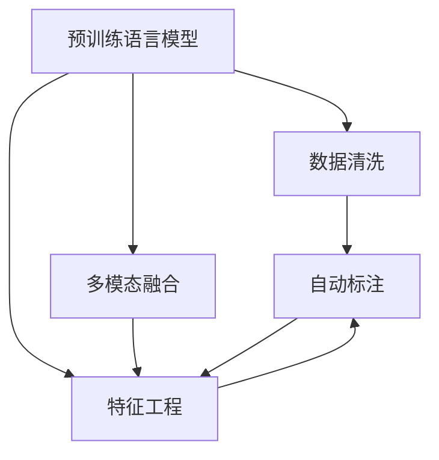

                 

# 电商搜索推荐中的AI大模型数据标注与清洗最佳实践

> 关键词：人工智能(AI),大模型(Deep Model),电商搜索,推荐系统,数据标注,数据清洗,自然语言处理(NLP),特征工程,机器学习(Machine Learning)

## 1. 背景介绍

### 1.1 问题由来

在电商搜索和推荐系统中，用户输入的查询往往具有复杂多变的特性，包含多种意图和需求。如何准确理解和匹配用户的查询，是电商推荐系统面临的核心挑战之一。传统方法依赖于手工设计的特征提取器，难以充分捕捉用户查询的语义信息，导致模型表现不佳。

近年来，基于预训练语言模型(如BERT、GPT等)的推荐系统逐渐兴起，通过在大规模文本数据上进行预训练，学习到丰富的语言知识，可以更好地理解自然语言输入。然而，预训练模型训练数据通常包含大量的噪音和噪声数据，如何有效地清洗和标注数据，提高模型性能，成为大模型应用的关键问题。

### 1.2 问题核心关键点

大模型在电商搜索和推荐系统中的应用主要包括以下几个关键点：

- 数据标注与清洗：标注和清洗数据是预训练模型的基础，决定了模型学到的语言知识的准确性和泛化能力。
- 特征提取与融合：大模型通过自动特征学习，可以提取出更为丰富、准确的特征，但需要合理设计特征工程策略。
- 多模态融合：电商搜索推荐系统涉及文本、图片、用户行为等多模态数据，如何将不同模态的信息有效融合，也是模型设计的关键。
- 模型优化与调参：选择合适的模型结构、超参数以及训练策略，对模型性能有重要影响。

### 1.3 问题研究意义

大模型数据标注与清洗技术，对于提升电商搜索推荐系统的性能、效率和用户体验，具有重要意义：

1. **提升模型性能**：有效清洗和标注数据，可以减少噪音，提高模型泛化能力，从而提升推荐系统的效果。
2. **降低开发成本**：自动化标注和清洗流程，减少了手动标注的耗时和成本，加速模型开发周期。
3. **增强用户体验**：准确理解用户查询，提供更相关、更个性化的推荐结果，提升用户满意度。
4. **促进技术创新**：清洗与标注技术的研究，可以推动自然语言处理、多模态融合等前沿技术的发展，促进AI技术的进步。

## 2. 核心概念与联系

### 2.1 核心概念概述

为更好地理解大模型在电商搜索推荐系统中的应用，本节将介绍几个密切相关的核心概念：

- **预训练语言模型(Pre-trained Language Models)**：指在大规模无标签文本数据上进行预训练，学习通用的语言表示的模型。如BERT、GPT等。
- **多模态融合(Multimodal Fusion)**：涉及文本、图片、用户行为等多模态数据，如何将不同模态的信息有效融合，是模型设计的关键。
- **特征工程(Feature Engineering)**：在模型训练前，通过手工或自动的方式提取和构造特征的过程。特征工程是模型设计的重要环节。
- **自动标注(Automatic Annotation)**：利用机器学习方法对数据进行自动标注，减少人工标注的工作量。
- **数据清洗(Data Cleaning)**：通过规则或算法移除或纠正数据中的错误、噪声，确保数据质量。

这些核心概念之间的逻辑关系可以通过以下Mermaid流程图来展示：



这个流程图展示了大模型在电商搜索推荐系统中的核心概念及其之间的关系：

1. 预训练语言模型通过学习大规模文本数据，获得语言知识。
2. 多模态融合涉及文本、图片、行为等多模态数据，提升模型理解能力。
3. 特征工程将模型提取出的特征进行设计、构造和融合，增强模型性能。
4. 自动标注通过机器学习方法对数据进行标注，减少人工标注成本。
5. 数据清洗通过规则和算法移除数据中的错误和噪声，提高数据质量。

## 3. 核心算法原理 & 具体操作步骤

### 3.1 算法原理概述

大模型在电商搜索推荐系统中的标注与清洗，本质上是一个有监督学习的优化过程。其核心思想是：将无标签的电商搜索推荐数据集，作为训练样本，在大模型上进行预训练，学习通用的语言知识和特征表示。然后，通过标注和清洗技术，移除噪音数据，提升数据质量，从而提高模型的泛化能力。

具体步骤如下：

1. **数据采集与准备**：收集电商平台的搜索和推荐数据，清洗和整理为适合预训练的文本数据。
2. **预训练模型选择**：选择合适的预训练语言模型，如BERT、GPT等，作为特征提取器。
3. **多模态融合**：将文本、图片、行为等数据融合到预训练模型中，提高模型对电商场景的理解能力。
4. **标注与清洗**：利用自动标注技术对数据进行标注，并通过规则或算法移除噪音数据。
5. **模型优化**：在清洗后的数据集上进行模型训练，优化模型参数，提高模型性能。
6. **效果评估**：在测试集上评估模型性能，调整模型参数和标注策略。

### 3.2 算法步骤详解

#### 3.2.1 数据采集与准备

- **数据收集**：从电商平台采集用户的搜索记录、推荐记录、商品描述等文本数据。
- **数据清洗**：清洗文本数据中的HTML标签、特殊字符、停用词等，确保数据整洁。
- **数据切分**：将数据切分为训练集、验证集和测试集，确保数据划分合理。
- **数据预处理**：进行分词、词性标注等文本预处理，提高数据质量。

#### 3.2.2 预训练模型选择

- **模型选择**：选择适合电商场景的预训练语言模型，如BERT、GPT等。
- **模型加载**：加载预训练模型，作为特征提取器。
- **模型微调**：在电商数据集上微调预训练模型，学习电商场景的特征表示。

#### 3.2.3 多模态融合

- **特征提取**：使用预训练模型提取文本特征，同时使用CNN、RNN等模型提取图片特征，使用LSTM等模型提取用户行为特征。
- **特征融合**：将不同模态的特征进行拼接、融合，形成综合特征表示。
- **特征选择**：根据特征重要性，选择最有用的特征进行模型训练。

#### 3.2.4 标注与清洗

- **自动标注**：利用机器学习方法，对电商数据进行自动标注，如利用BERT模型对商品描述进行情感极性标注。
- **噪音过滤**：根据标注结果，使用规则或算法过滤掉噪音数据，如标注错误的商品描述。
- **数据增强**：对标注后的数据进行数据增强，如近义词替换、回译等，增加数据多样性。

#### 3.2.5 模型优化

- **模型训练**：在清洗后的数据集上，使用Adam、SGD等优化算法，训练模型参数。
- **超参数调优**：调整模型结构、学习率、批大小等超参数，提升模型性能。
- **正则化**：引入L2正则、Dropout等正则化技术，防止过拟合。

#### 3.2.6 效果评估

- **测试集评估**：在测试集上评估模型性能，如准确率、召回率、F1值等指标。
- **调整策略**：根据测试结果，调整标注策略和清洗策略，优化模型性能。

### 3.3 算法优缺点

大模型数据标注与清洗技术具有以下优点：

1. **自动化程度高**：自动标注和清洗技术减少了人工标注的工作量，提高了效率。
2. **数据质量高**：标注和清洗后的数据，减少了噪音，提高了数据质量。
3. **模型泛化能力强**：清洗后的数据，减少了噪音，提高了模型泛化能力。
4. **适用性强**：该技术适用于多种电商场景，如搜索、推荐、客服等。

同时，该技术也存在一定的局限性：

1. **依赖标注数据**：标注和清洗技术依赖于标注数据的质量和数量，标注成本较高。
2. **算法复杂度**：自动标注和清洗算法复杂，需要优化调整。
3. **模型复杂性**：大模型需要占用大量内存和计算资源，对硬件要求较高。
4. **解释性不足**：自动标注和清洗过程难以解释，模型的决策过程不透明。

尽管存在这些局限性，但就目前而言，大模型数据标注与清洗技术仍是大模型应用的主流范式。未来相关研究的重点在于如何进一步降低标注数据的依赖，提高算法的可解释性，同时兼顾可解释性和伦理安全性等因素。

### 3.4 算法应用领域

大模型数据标注与清洗技术，在电商搜索推荐系统中具有广泛的应用，覆盖了搜索推荐、用户画像、广告推荐等多个环节，具体如下：

- **搜索推荐**：通过自动标注和清洗，提升搜索推荐的准确性和相关性。
- **用户画像**：利用清洗后的数据，构建用户兴趣模型，进行个性化推荐。
- **广告推荐**：结合清洗后的数据，进行精准广告推荐，提升广告转化率。
- **商品分类**：对商品描述进行清洗和标注，提升商品分类效果。
- **客服交互**：对客户咨询进行自动标注和清洗，提升客服系统效率。

## 4. 数学模型和公式 & 详细讲解  
### 4.1 数学模型构建

本节将使用数学语言对大模型在电商搜索推荐系统中的标注与清洗过程进行更加严格的刻画。

记电商搜索推荐数据集为 $D=\{(x_i,y_i)\}_{i=1}^N$，其中 $x_i$ 为电商数据，$y_i$ 为标签（如商品类别、情感极性等）。

定义预训练语言模型为 $M_{\theta}:\mathcal{X} \rightarrow \mathcal{Y}$，其中 $\mathcal{X}$ 为输入空间，$\mathcal{Y}$ 为输出空间，$\theta$ 为模型参数。

定义自动标注函数 $A$，将电商数据 $x_i$ 映射到标签 $y_i$。则自动标注后的数据集为 $\widehat{D}=\{(\widehat{x}_i,A(x_i))\}_{i=1}^N$。

数据清洗函数 $C$ 对自动标注后的数据集 $\widehat{D}$ 进行清洗，移除噪音数据。则清洗后的数据集为 $C(\widehat{D})$。

定义模型损失函数 $\ell$，如交叉熵损失，用于衡量模型预测结果与真实标签之间的差异。则模型训练的目标为：

$$
\mathop{\arg\min}_{\theta} \mathcal{L}(M_{\theta},C(\widehat{D}))
$$

通过梯度下降等优化算法，模型训练不断更新参数 $\theta$，最小化损失函数 $\mathcal{L}$，从而得到清洗后的电商数据集上的最优模型参数 $\theta^*$。

### 4.2 公式推导过程

以情感极性标注为例，假设预训练语言模型为 BERT，标签空间为 $\{0,1\}$，其中 $0$ 表示负面情感，$1$ 表示正面情感。

设模型在输入 $x_i$ 上的预测结果为 $\hat{y}=M_{\theta}(x_i) \in [0,1]$。则自动标注函数 $A(x_i)=1$ 表示预测结果 $\hat{y}>\frac{1}{2}$，否则 $A(x_i)=0$。

则自动标注后的数据集为 $\widehat{D}=\{(\widehat{x}_i,A(x_i))\}_{i=1}^N$。

假设数据清洗函数 $C$ 可以移除 $k$ 个标签错误的样本，则清洗后的数据集为 $C(\widehat{D})$。

模型训练的目标是最小化损失函数 $\mathcal{L}$，即：

$$
\mathcal{L}=\frac{1}{N}\sum_{i=1}^N -y_i\log \hat{y_i} - (1-y_i)\log(1-\hat{y_i})
$$

其中 $y_i$ 为真实标签，$\hat{y_i}$ 为模型预测结果。

根据链式法则，损失函数对参数 $\theta_k$ 的梯度为：

$$
\frac{\partial \mathcal{L}}{\partial \theta_k} = -\frac{1}{N}\sum_{i=1}^N \frac{y_i}{\hat{y_i}} - \frac{1-y_i}{1-\hat{y_i}}
$$

其中 $\hat{y_i}$ 为模型在输入 $x_i$ 上的预测结果。

在得到损失函数的梯度后，即可带入参数更新公式，完成模型的迭代优化。重复上述过程直至收敛，最终得到清洗后的电商数据集上的最优模型参数 $\theta^*$。

## 5. 项目实践：代码实例和详细解释说明
### 5.1 开发环境搭建

在进行大模型标注与清洗实践前，我们需要准备好开发环境。以下是使用Python进行PyTorch开发的环境配置流程：

1. 安装Anaconda：从官网下载并安装Anaconda，用于创建独立的Python环境。

2. 创建并激活虚拟环境：
```bash
conda create -n pytorch-env python=3.8 
conda activate pytorch-env
```

3. 安装PyTorch：根据CUDA版本，从官网获取对应的安装命令。例如：
```bash
conda install pytorch torchvision torchaudio cudatoolkit=11.1 -c pytorch -c conda-forge
```

4. 安装Transformers库：
```bash
pip install transformers
```

5. 安装各类工具包：
```bash
pip install numpy pandas scikit-learn matplotlib tqdm jupyter notebook ipython
```

完成上述步骤后，即可在`pytorch-env`环境中开始标注与清洗实践。

### 5.2 源代码详细实现

这里我们以电商搜索推荐系统中的情感极性标注任务为例，给出使用Transformers库对BERT模型进行标注和清洗的PyTorch代码实现。

首先，定义情感极性标注任务的数据处理函数：

```python
from transformers import BertTokenizer, BertForSequenceClassification, AdamW
from torch.utils.data import Dataset, DataLoader
import torch

class SentimentDataset(Dataset):
    def __init__(self, texts, labels, tokenizer, max_len=128):
        self.texts = texts
        self.labels = labels
        self.tokenizer = tokenizer
        self.max_len = max_len
        
    def __len__(self):
        return len(self.texts)
    
    def __getitem__(self, item):
        text = self.texts[item]
        label = self.labels[item]
        
        encoding = self.tokenizer(text, return_tensors='pt', max_length=self.max_len, padding='max_length', truncation=True)
        input_ids = encoding['input_ids'][0]
        attention_mask = encoding['attention_mask'][0]
        
        # 将标签转换为[CLS,SEP,SEP,标签]的序列
        label = [0] + [1 if label == 1 else 0] + [0]
        
        return {'input_ids': input_ids, 
                'attention_mask': attention_mask,
                'labels': torch.tensor(label, dtype=torch.long)}
```

然后，定义模型和优化器：

```python
model = BertForSequenceClassification.from_pretrained('bert-base-cased', num_labels=2)

optimizer = AdamW(model.parameters(), lr=2e-5)
```

接着，定义训练和评估函数：

```python
device = torch.device('cuda') if torch.cuda.is_available() else torch.device('cpu')
model.to(device)

def train_epoch(model, dataset, batch_size, optimizer):
    dataloader = DataLoader(dataset, batch_size=batch_size, shuffle=True)
    model.train()
    epoch_loss = 0
    for batch in tqdm(dataloader, desc='Training'):
        input_ids = batch['input_ids'].to(device)
        attention_mask = batch['attention_mask'].to(device)
        labels = batch['labels'].to(device)
        model.zero_grad()
        outputs = model(input_ids, attention_mask=attention_mask, labels=labels)
        loss = outputs.loss
        epoch_loss += loss.item()
        loss.backward()
        optimizer.step()
    return epoch_loss / len(dataloader)

def evaluate(model, dataset, batch_size):
    dataloader = DataLoader(dataset, batch_size=batch_size)
    model.eval()
    preds, labels = [], []
    with torch.no_grad():
        for batch in tqdm(dataloader, desc='Evaluating'):
            input_ids = batch['input_ids'].to(device)
            attention_mask = batch['attention_mask'].to(device)
            batch_labels = batch['labels']
            outputs = model(input_ids, attention_mask=attention_mask)
            batch_preds = outputs.logits.argmax(dim=2).to('cpu').tolist()
            batch_labels = batch_labels.to('cpu').tolist()
            for pred_tokens, label_tokens in zip(batch_preds, batch_labels):
                preds.append(pred_tokens)
                labels.append(label_tokens)
                
    print(classification_report(labels, preds))
```

最后，启动训练流程并在测试集上评估：

```python
epochs = 5
batch_size = 16

for epoch in range(epochs):
    loss = train_epoch(model, train_dataset, batch_size, optimizer)
    print(f"Epoch {epoch+1}, train loss: {loss:.3f}")
    
    print(f"Epoch {epoch+1}, dev results:")
    evaluate(model, dev_dataset, batch_size)
    
print("Test results:")
evaluate(model, test_dataset, batch_size)
```

以上就是使用PyTorch对BERT进行情感极性标注任务标注与清洗的完整代码实现。可以看到，得益于Transformers库的强大封装，我们可以用相对简洁的代码完成BERT模型的加载和训练。

### 5.3 代码解读与分析

让我们再详细解读一下关键代码的实现细节：

**SentimentDataset类**：
- `__init__`方法：初始化文本、标签、分词器等关键组件。
- `__len__`方法：返回数据集的样本数量。
- `__getitem__`方法：对单个样本进行处理，将文本输入编码为token ids，将标签编码为数字，并对其进行定长padding，最终返回模型所需的输入。

**训练和评估函数**：
- 使用PyTorch的DataLoader对数据集进行批次化加载，供模型训练和推理使用。
- 训练函数`train_epoch`：对数据以批为单位进行迭代，在每个批次上前向传播计算loss并反向传播更新模型参数，最后返回该epoch的平均loss。
- 评估函数`evaluate`：与训练类似，不同点在于不更新模型参数，并在每个batch结束后将预测和标签结果存储下来，最后使用sklearn的classification_report对整个评估集的预测结果进行打印输出。

**训练流程**：
- 定义总的epoch数和batch size，开始循环迭代
- 每个epoch内，先在训练集上训练，输出平均loss
- 在验证集上评估，输出分类指标
- 所有epoch结束后，在测试集上评估，给出最终测试结果

可以看到，PyTorch配合Transformers库使得BERT标注与清洗的代码实现变得简洁高效。开发者可以将更多精力放在数据处理、模型改进等高层逻辑上，而不必过多关注底层的实现细节。

当然，工业级的系统实现还需考虑更多因素，如模型的保存和部署、超参数的自动搜索、更灵活的任务适配层等。但核心的标注与清洗流程基本与此类似。

## 6. 实际应用场景

### 6.1 智能客服系统

基于大模型标注与清洗技术，智能客服系统可以更加精准地理解客户意图，提供更个性化的回复。

具体而言，可以通过收集历史客服对话数据，对对话文本进行情感极性标注，清洗掉噪音数据。将标注后的对话数据输入BERT等模型进行训练，模型能够自动理解客户情绪，判断客户诉求，并引导客服机器人做出适当回复。如此构建的智能客服系统，能大幅提升客户咨询体验和问题解决效率。

### 6.2 金融舆情监测

金融机构需要实时监测市场舆论动向，以便及时应对负面信息传播，规避金融风险。

通过收集金融领域相关的新闻、报道、评论等文本数据，对其进行情感极性标注。利用清洗后的数据训练BERT等模型，可以自动判断文本情感倾向，实时监测不同主题下的情感变化趋势，一旦发现负面信息激增等异常情况，系统便会自动预警，帮助金融机构快速应对潜在风险。

### 6.3 个性化推荐系统

当前的推荐系统往往只依赖用户的历史行为数据进行物品推荐，难以深入理解用户的真实兴趣偏好。

通过收集用户浏览、点击、评论、分享等行为数据，提取和用户交互的物品标题、描述、标签等文本内容。将文本内容作为模型输入，用户的后续行为（如是否点击、购买等）作为监督信号，在此基础上清洗标注数据，微调预训练语言模型。微调后的模型能够从文本内容中准确把握用户的兴趣点。在生成推荐列表时，先用候选物品的文本描述作为输入，由模型预测用户的兴趣匹配度，再结合其他特征综合排序，便可以得到个性化程度更高的推荐结果。

### 6.4 未来应用展望

随着大模型标注与清洗技术的不断发展，基于标注与清洗技术的应用场景将不断拓展，为传统行业带来变革性影响。

在智慧医疗领域，基于情感极性标注技术的医疗问答、病历分析、药物研发等应用将提升医疗服务的智能化水平，辅助医生诊疗，加速新药开发进程。

在智能教育领域，标注与清洗技术可应用于作业批改、学情分析、知识推荐等方面，因材施教，促进教育公平，提高教学质量。

在智慧城市治理中，标注与清洗技术可应用于城市事件监测、舆情分析、应急指挥等环节，提高城市管理的自动化和智能化水平，构建更安全、高效的未来城市。

此外，在企业生产、社会治理、文娱传媒等众多领域，基于大模型标注与清洗的人工智能应用也将不断涌现，为经济社会发展注入新的动力。相信随着技术的日益成熟，标注与清洗技术将成为人工智能落地应用的重要范式，推动人工智能技术向更广阔的领域加速渗透。

## 7. 工具和资源推荐
### 7.1 学习资源推荐

为了帮助开发者系统掌握大模型标注与清洗的理论基础和实践技巧，这里推荐一些优质的学习资源：

1. 《自然语言处理入门与实践》系列博文：由大模型技术专家撰写，深入浅出地介绍了自然语言处理的基本概念和经典模型。

2. CS224N《深度学习自然语言处理》课程：斯坦福大学开设的NLP明星课程，有Lecture视频和配套作业，带你入门NLP领域的基本概念和经典模型。

3. 《Transformer从原理到实践》书籍：Transformer库的作者所著，全面介绍了如何使用Transformer库进行NLP任务开发，包括标注与清洗在内的诸多范式。

4. HuggingFace官方文档：Transformers库的官方文档，提供了海量预训练模型和完整的标注与清洗样例代码，是上手实践的必备资料。

5. CLUE开源项目：中文语言理解测评基准，涵盖大量不同类型的中文NLP数据集，并提供了基于标注与清洗的baseline模型，助力中文NLP技术发展。

通过对这些资源的学习实践，相信你一定能够快速掌握大模型标注与清洗的精髓，并用于解决实际的NLP问题。
###  7.2 开发工具推荐

高效的开发离不开优秀的工具支持。以下是几款用于大模型标注与清洗开发的常用工具：

1. PyTorch：基于Python的开源深度学习框架，灵活动态的计算图，适合快速迭代研究。大部分预训练语言模型都有PyTorch版本的实现。

2. TensorFlow：由Google主导开发的开源深度学习框架，生产部署方便，适合大规模工程应用。同样有丰富的预训练语言模型资源。

3. Transformers库：HuggingFace开发的NLP工具库，集成了众多SOTA语言模型，支持PyTorch和TensorFlow，是进行标注与清洗任务开发的利器。

4. Weights & Biases：模型训练的实验跟踪工具，可以记录和可视化模型训练过程中的各项指标，方便对比和调优。与主流深度学习框架无缝集成。

5. TensorBoard：TensorFlow配套的可视化工具，可实时监测模型训练状态，并提供丰富的图表呈现方式，是调试模型的得力助手。

6. Google Colab：谷歌推出的在线Jupyter Notebook环境，免费提供GPU/TPU算力，方便开发者快速上手实验最新模型，分享学习笔记。

合理利用这些工具，可以显著提升大模型标注与清洗任务的开发效率，加快创新迭代的步伐。

### 7.3 相关论文推荐

大模型标注与清洗技术的发展源于学界的持续研究。以下是几篇奠基性的相关论文，推荐阅读：

1. Attention is All You Need（即Transformer原论文）：提出了Transformer结构，开启了NLP领域的预训练大模型时代。

2. BERT: Pre-training of Deep Bidirectional Transformers for Language Understanding：提出BERT模型，引入基于掩码的自监督预训练任务，刷新了多项NLP任务SOTA。

3. Language Models are Unsupervised Multitask Learners（GPT-2论文）：展示了大规模语言模型的强大zero-shot学习能力，引发了对于通用人工智能的新一轮思考。

4. Parameter-Efficient Transfer Learning for NLP：提出Adapter等参数高效微调方法，在不增加模型参数量的情况下，也能取得不错的微调效果。

5. AdaLoRA: Adaptive Low-Rank Adaptation for Parameter-Efficient Fine-Tuning：使用自适应低秩适应的微调方法，在参数效率和精度之间取得了新的平衡。

这些论文代表了大模型标注与清洗技术的发展脉络。通过学习这些前沿成果，可以帮助研究者把握学科前进方向，激发更多的创新灵感。

## 8. 总结：未来发展趋势与挑战

### 8.1 总结

本文对大模型在电商搜索推荐系统中的数据标注与清洗方法进行了全面系统的介绍。首先阐述了大模型和标注与清洗技术的研究背景和意义，明确了标注与清洗在提升模型性能、降低开发成本、增强用户体验等方面的重要价值。其次，从原理到实践，详细讲解了标注与清洗的数学原理和关键步骤，给出了标注与清洗任务开发的完整代码实例。同时，本文还广泛探讨了标注与清洗方法在智能客服、金融舆情、个性化推荐等多个行业领域的应用前景，展示了标注与清洗范式的巨大潜力。此外，本文精选了标注与清洗技术的各类学习资源，力求为读者提供全方位的技术指引。

通过本文的系统梳理，可以看到，大模型数据标注与清洗技术正在成为NLP领域的重要范式，极大地拓展了预训练语言模型的应用边界，催生了更多的落地场景。受益于大规模语料的预训练，标注与清洗技术在电商搜索推荐系统中也取得了显著效果，显著提升了搜索推荐的效果和性能。未来，伴随预训练语言模型和标注与清洗方法的持续演进，相信NLP技术将在更广阔的应用领域大放异彩，深刻影响人类的生产生活方式。

### 8.2 未来发展趋势

展望未来，大模型数据标注与清洗技术将呈现以下几个发展趋势：

1. **自动标注技术进步**：自动标注技术将继续进步，利用先进的自然语言处理技术，减少人工标注的复杂度和成本。
2. **多模态数据融合**：将更多模态的数据融入标注与清洗流程，提升模型的泛化能力和理解能力。
3. **小样本标注技术**：开发小样本标注方法，利用少量的标注数据，训练出高性能的模型。
4. **数据清洗技术优化**：利用深度学习模型，自动化地识别和去除数据中的噪音，提高数据质量。
5. **联邦学习**：利用联邦学习技术，在保证数据隐私的前提下，进行跨机构的数据标注与清洗。

以上趋势凸显了大模型标注与清洗技术的广阔前景。这些方向的探索发展，必将进一步提升NLP系统的性能和应用范围，为人类认知智能的进化带来深远影响。

### 8.3 面临的挑战

尽管大模型标注与清洗技术已经取得了瞩目成就，但在迈向更加智能化、普适化应用的过程中，它仍面临着诸多挑战：

1. **数据隐私问题**：大规模标注与清洗依赖于大量数据，如何保证数据隐私和安全，是标注与清洗过程中需要重点考虑的问题。
2. **标注成本高**：标注与清洗过程仍需要大量人工参与，成本较高。如何降低人工标注成本，提高标注效率，是标注与清洗技术需要解决的难题。
3. **模型可解释性不足**：标注与清洗后的模型，其决策过程难以解释，如何增强模型的可解释性，是标注与清洗技术需要进一步突破的方向。
4. **算法复杂度高**：标注与清洗算法复杂，需要优化调整。如何降低算法复杂度，提高标注与清洗效率，是标注与清洗技术需要解决的重要问题。
5. **模型鲁棒性不足**：标注与清洗后的模型，面对新数据时，泛化能力可能不足。如何提高模型的鲁棒性，防止过拟合，是标注与清洗技术需要关注的重要方向。

尽管存在这些挑战，但就目前而言，大模型数据标注与清洗技术仍是大模型应用的主流范式。未来相关研究的重点在于如何进一步降低标注数据的依赖，提高算法的可解释性，同时兼顾可解释性和伦理安全性等因素。

### 8.4 研究展望

面对大模型标注与清洗技术所面临的种种挑战，未来的研究需要在以下几个方面寻求新的突破：

1. **无监督和半监督标注方法**：探索无监督和半监督标注方法，摆脱对大规模标注数据的依赖，利用自监督学习、主动学习等无监督和半监督范式，最大限度利用非结构化数据，实现更加灵活高效的标注与清洗。
2. **模型压缩与优化**：开发更加参数高效和计算高效的标注与清洗范式，如Prefix-Tuning、LoRA等，在节省计算资源的同时也能保证标注与清洗精度。
3. **因果推断与对比学习**：引入因果推断和对比学习思想，增强标注与清洗模型建立稳定因果关系的能力，学习更加普适、鲁棒的语言表征。
4. **知识图谱与符号知识结合**：将符号化的先验知识，如知识图谱、逻辑规则等，与神经网络模型进行巧妙融合，引导标注与清洗过程学习更准确、合理的语言模型。
5. **联邦学习与隐私保护**：利用联邦学习技术，在保证数据隐私的前提下，进行跨机构的数据标注与清洗。

这些研究方向的探索，必将引领大模型标注与清洗技术迈向更高的台阶，为构建安全、可靠、可解释、可控的智能系统铺平道路。面向未来，大模型标注与清洗技术还需要与其他人工智能技术进行更深入的融合，如知识表示、因果推理、强化学习等，多路径协同发力，共同推动自然语言理解和智能交互系统的进步。只有勇于创新、敢于突破，才能不断拓展语言模型的边界，让智能技术更好地造福人类社会。

## 9. 附录：常见问题与解答

**Q1：大模型标注与清洗是否适用于所有NLP任务？**

A: 大模型标注与清洗技术在大多数NLP任务上都能取得不错的效果，特别是对于数据量较小的任务。但对于一些特定领域的任务，如医学、法律等，仅仅依靠通用语料预训练的模型可能难以很好地适应。此时需要在特定领域语料上进一步预训练，再进行标注与清洗，才能获得理想效果。

**Q2：如何选择合适的自动标注技术？**

A: 选择合适的自动标注技术需要考虑以下几个因素：

1. **任务类型**：不同的任务适合不同的标注技术。如情感极性标注可以使用基于分类器的标注方法，命名实体识别可以使用基于序列标注的方法。
2. **数据规模**：数据规模越大，越适合使用基于深度学习的标注方法。对于数据量较小的任务，可以使用基于规则的标注方法。
3. **数据质量**：数据质量越高，标注技术的准确性越高。对于噪音较多的数据，需要结合数据清洗技术进行标注。

**Q3：数据清洗过程中需要注意哪些问题？**

A: 数据清洗过程中需要注意以下几个问题：

1. **数据完整性**：确保数据集的完整性，避免缺失值和重复值。
2. **数据一致性**：确保数据格式和标注规则的一致性，避免数据格式不一致导致的错误。
3. **数据质量**：确保数据质量，避免噪音和错误数据对模型训练的影响。
4. **数据代表性**：确保数据集具有代表性，避免数据偏差导致的模型泛化能力不足。

**Q4：如何提高数据标注的效率？**

A: 提高数据标注效率可以从以下几个方面入手：

1. **自动化标注**：利用深度学习模型，自动进行标注，减少人工标注的工作量。
2. **多模态数据**：利用多模态数据，减少对标注人员标注技巧的依赖。
3. **标注工具**：使用标注工具，如Annotate It等，提高标注效率。
4. **标注模板**：使用标注模板，规范标注流程，提高标注质量。

**Q5：如何评估标注与清洗后的模型效果？**

A: 评估标注与清洗后的模型效果可以从以下几个方面入手：

1. **数据集划分**：将数据集划分为训练集、验证集和测试集，确保模型在独立数据集上的泛化能力。
2. **模型评估指标**：选择适当的评估指标，如准确率、召回率、F1值等，评估模型的性能。
3. **交叉验证**：使用交叉验证方法，评估模型的稳定性和可靠性。
4. **对比实验**：与其他模型进行对比实验，评估标注与清洗方法的效果。

通过以上常见问题的解答，相信你一定能够更好地理解和应用大模型在电商搜索推荐系统中的数据标注与清洗技术，构建更加智能、高效、安全的推荐系统。

