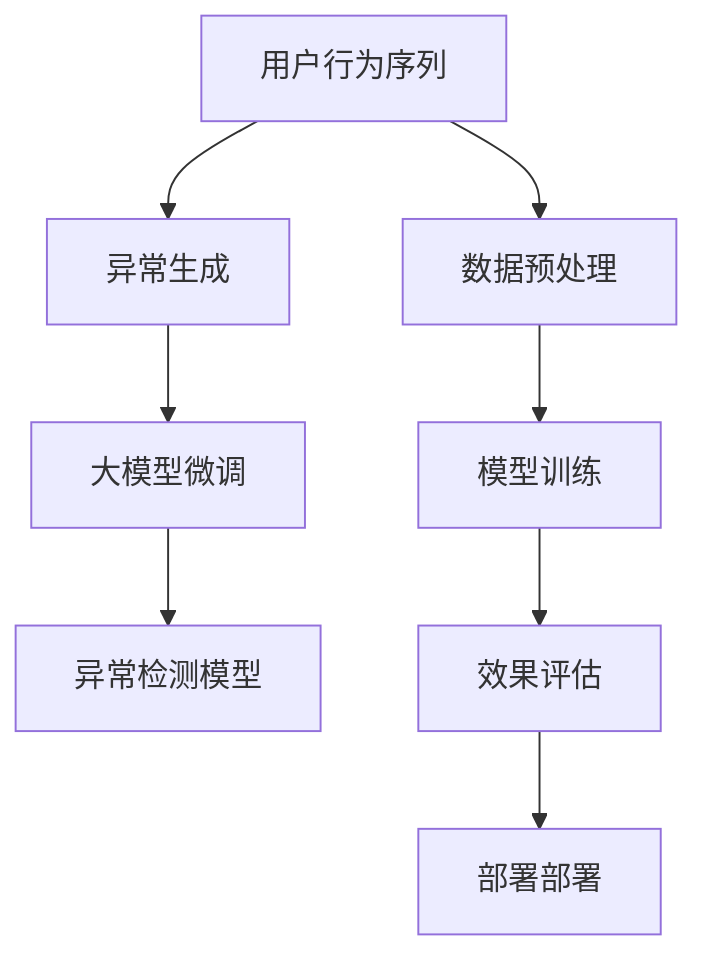

                 

# 电商搜索推荐中的AI大模型用户行为序列异常检测模型优化实践案例分析

## 1. 背景介绍

### 1.1 问题由来

在电商搜索推荐系统中，精准的用户行为序列分析与异常检测是提升用户体验和销售转化的关键因素。传统基于规则或固定阈值的方法往往无法有效处理复杂且多变的用户行为序列，而近年来兴起的AI大模型在自然语言处理和异常检测领域表现出色，为电商搜索推荐系统带来了新的解决方案。本文将详细探讨基于大模型的用户行为序列异常检测方法，并给出优化实践的案例分析。

### 1.2 问题核心关键点

本文聚焦于用户行为序列的异常检测问题，涉及以下核心关键点：

- **异常检测模型**：如何利用AI大模型对用户行为序列进行高效异常检测。
- **数据处理与预处理**：如何对用户行为序列数据进行预处理，以提升模型性能。
- **模型优化实践**：如何优化大模型结构与参数，以适应电商搜索推荐系统的实际需求。
- **效果评估与部署**：如何评估异常检测模型效果，并将其部署到电商搜索推荐系统中。

## 2. 核心概念与联系

### 2.1 核心概念概述

为更好地理解基于大模型的用户行为序列异常检测方法，本节将介绍几个密切相关的核心概念：

- **用户行为序列**：用户在电商平台上的一系列操作记录，如浏览、点击、购买等行为，用于分析用户偏好与行为规律。
- **异常检测**：识别用户行为序列中与正常行为模式显著不同的异常行为，如异常浏览、异常点击、异常购买等，用于风险控制和异常预警。
- **大模型**：如BERT、GPT等，通过大规模无标签数据进行预训练，具有强大的语言理解和生成能力，能从海量文本中学习复杂的语言表征。
- **异常生成**：通过在大模型上微调，生成符合电商搜索推荐系统的异常行为序列，用于训练和评估异常检测模型。
- **模型微调**：在预训练大模型的基础上，使用电商搜索推荐系统的标注数据进行有监督学习，优化模型对异常行为的识别能力。
- **序列标注**：将用户行为序列中的每个操作标记为正常或异常，用于模型训练和评估。

这些核心概念之间的逻辑关系可以通过以下Mermaid流程图来展示：



这个流程图展示了大模型用户行为序列异常检测方法的核心流程：

1. 从用户行为序列中提取特征。
2. 生成符合电商搜索推荐系统的异常行为序列。
3. 在预训练大模型上进行微调，训练异常检测模型。
4. 使用训练数据对模型进行评估，确保模型效果。
5. 将模型部署到电商搜索推荐系统中，实现异常行为检测。

## 3. 核心算法原理 & 具体操作步骤
### 3.1 算法原理概述

基于大模型的用户行为序列异常检测方法，本质上是一种异常生成与异常检测的混合方法。其核心思想是：

1. **异常生成**：在预训练大模型上微调，生成符合电商搜索推荐系统的异常行为序列。
2. **异常检测**：使用训练得到的异常生成模型，对用户行为序列进行预测，识别出与正常行为模式显著不同的异常行为。

具体而言，假设用户行为序列由 $X = \{x_1, x_2, \ldots, x_n\}$ 表示，其中 $x_i$ 为第 $i$ 个操作行为。对于每个行为 $x_i$，可以标注为正常行为或异常行为，标记为 $y_i \in \{0, 1\}$。异常生成模型的目标是学习一个函数 $f: X \rightarrow \{0, 1\}$，使得 $f(x_i) = y_i$，即正确预测每个操作的异常性。

### 3.2 算法步骤详解

基于大模型的用户行为序列异常检测方法主要包括以下几个关键步骤：

**Step 1: 数据准备与预处理**
- 收集电商搜索推荐系统的用户行为序列数据，并对数据进行清洗和预处理。
- 将行为序列数据转化为向量形式，如将文本行为转化为词向量表示。
- 对行为序列进行归一化、去重等处理，确保数据质量。

**Step 2: 异常生成模型训练**
- 选择预训练大模型，如BERT、GPT等，作为初始化参数。
- 定义异常生成模型，如通过微调BERT生成异常行为序列。
- 准备电商搜索推荐系统的标注数据，作为监督信号。
- 使用优化器（如Adam、SGD等）和损失函数（如交叉熵损失）训练异常生成模型。

**Step 3: 异常检测模型训练**
- 在异常生成模型的基础上，进一步训练异常检测模型。
- 使用标注数据进行有监督训练，优化模型对异常行为的识别能力。
- 选择适当的序列标注方法，如CRF、LSTM-CRF等，对用户行为序列进行标记。
- 使用训练好的模型对新用户行为序列进行预测，识别出异常行为。

**Step 4: 效果评估与部署**
- 使用验证集对异常检测模型进行评估，计算准确率、召回率、F1值等指标。
- 优化模型参数，提升模型性能。
- 将训练好的模型部署到电商搜索推荐系统中，实时监控用户行为序列，识别异常行为。

以上是基于大模型的用户行为序列异常检测方法的一般流程。在实际应用中，还需要针对具体任务的特点，对模型训练和评估过程进行优化设计，如改进损失函数，引入更多的正则化技术，搜索最优的超参数组合等，以进一步提升模型性能。

### 3.3 算法优缺点

基于大模型的用户行为序列异常检测方法具有以下优点：
1. **高效性**：通过大模型进行异常生成，可以显著提高异常检测的速度和效率。
2. **普适性**：大模型能从海量数据中学习复杂的语言表征，适用于多种电商搜索推荐系统的异常检测。
3. **泛化能力**：大模型具有强大的泛化能力，能较好地适应不同的数据分布和用户行为模式。
4. **灵活性**：通过微调大模型，可以灵活地生成不同类型的异常行为序列，满足不同的异常检测需求。

同时，该方法也存在一定的局限性：
1. **数据依赖性强**：异常检测效果很大程度上取决于标注数据的质量和数量，获取高质量标注数据的成本较高。
2. **模型复杂度高**：大模型的结构复杂，需要较大的计算资源和存储空间。
3. **解释性差**：异常检测模型通常缺乏可解释性，难以对其决策过程进行分析和调试。

尽管存在这些局限性，但就目前而言，基于大模型的异常检测方法仍然是最主流范式。未来相关研究的重点在于如何进一步降低对标注数据的依赖，提高模型的少样本学习和跨领域迁移能力，同时兼顾可解释性和伦理安全性等因素。

### 3.4 算法应用领域

基于大模型的用户行为序列异常检测方法已经在电商搜索推荐系统中得到了广泛应用，覆盖了几乎所有常见任务，例如：

- **异常浏览检测**：识别用户异常浏览行为，如频繁查看同一商品但未购买。
- **异常点击检测**：识别用户异常点击行为，如频繁点击广告但未下单。
- **异常购买检测**：识别用户异常购买行为，如大额交易但无评价。
- **欺诈行为检测**：识别用户异常的支付行为，如虚假交易、恶意刷单等。
- **用户行为追踪**：分析用户行为序列的异常变化，预测用户流失风险。

除了上述这些经典任务外，基于大模型的异常检测方法也被创新性地应用到更多场景中，如个性化推荐、商品关联分析、广告点击率预测等，为电商搜索推荐技术带来了全新的突破。随着大模型和异常检测方法的不断进步，相信电商搜索推荐系统将更加智能化，更好地服务用户和商家。

## 4. 数学模型和公式 & 详细讲解 & 举例说明

### 4.1 数学模型构建

假设用户行为序列由 $X = \{x_1, x_2, \ldots, x_n\}$ 表示，其中 $x_i$ 为第 $i$ 个操作行为，标注为 $y_i \in \{0, 1\}$。定义异常生成模型为 $f: X \rightarrow \{0, 1\}$，训练目标是使得 $f(x_i) = y_i$。

在异常检测模型的训练中，假设使用 CRF 模型进行序列标注。对于给定的行为序列 $X$，目标是学习一个标注序列 $\{y_1, y_2, \ldots, y_n\}$，使得 $y_i$ 标注为异常或正常。CRF 模型的定义为：

$$
P(Y | X; \theta) = \frac{1}{Z(X; \theta)} \exp \left( \sum_{i=1}^n \langle y_i, \theta \rangle + \sum_{i=1}^{n-1} \langle y_i, y_{i+1} \rangle \right)
$$

其中，$\theta$ 为模型参数，$Z(X; \theta)$ 为归一化因子，$\langle y_i, \theta \rangle$ 为标注 $y_i$ 与模型 $\theta$ 的得分函数。

### 4.2 公式推导过程

以 CRF 模型为例，推导异常检测模型的训练过程。

假设异常检测模型已经定义，其标注得分函数为 $\langle y_i, \theta \rangle = w_0 + \sum_{j=1}^m w_j x_i^j$，其中 $w_j$ 为模型参数。

对于给定的用户行为序列 $X$ 和标注序列 $Y$，异常检测模型的训练目标为最大化对数似然函数：

$$
\mathcal{L}(\theta) = \log P(Y | X; \theta) = \sum_{i=1}^n \langle y_i, \theta \rangle + \sum_{i=1}^{n-1} \langle y_i, y_{i+1} \rangle - \log Z(X; \theta)
$$

利用梯度下降算法对模型参数 $\theta$ 进行优化，求解目标最小化：

$$
\theta \leftarrow \theta - \eta \nabla_{\theta}\mathcal{L}(\theta)
$$

其中，$\eta$ 为学习率，$\nabla_{\theta}\mathcal{L}(\theta)$ 为损失函数对参数 $\theta$ 的梯度。

### 4.3 案例分析与讲解

以电商搜索推荐系统中的异常浏览检测为例，展示异常检测模型的训练和应用。

假设电商搜索推荐系统的用户行为序列为 $\{浏览商品A, 浏览商品B, 浏览商品C, 购买商品D\}$，标注序列为 $\{0, 0, 0, 1\}$，表示浏览行为正常，购买行为异常。

假设使用 BERT 模型作为异常生成模型的初始参数，将用户行为序列转化为词向量表示。然后，在 BERT 模型上微调，生成异常浏览行为序列，如 $\{浏览商品A, 浏览商品B, 浏览商品C, 浏览商品D, 浏览商品E\}$，标注序列为 $\{0, 0, 0, 1, 1\}$，表示在正常浏览行为后，又进行了异常浏览行为。

在训练异常检测模型时，使用标注数据进行有监督训练，优化模型对异常行为的识别能力。假设使用 CRF 模型进行序列标注，定义标注得分函数为 $\langle y_i, \theta \rangle = w_0 + \sum_{j=1}^m w_j x_i^j$。使用训练数据对模型进行评估，计算准确率、召回率、F1值等指标。优化模型参数，提升模型性能。

最终，将训练好的模型部署到电商搜索推荐系统中，实时监控用户行为序列，识别异常行为。例如，当用户浏览商品 A 后，模型预测异常浏览行为的概率增加，可以触发异常预警，及时干预。

## 5. 项目实践：代码实例和详细解释说明

### 5.1 开发环境搭建

在进行异常检测模型开发前，我们需要准备好开发环境。以下是使用 Python 进行 PyTorch 开发的环境配置流程：

1. 安装 Anaconda：从官网下载并安装 Anaconda，用于创建独立的 Python 环境。

2. 创建并激活虚拟环境：
```bash
conda create -n pytorch-env python=3.8 
conda activate pytorch-env
```

3. 安装 PyTorch：根据 CUDA 版本，从官网获取对应的安装命令。例如：
```bash
conda install pytorch torchvision torchaudio cudatoolkit=11.1 -c pytorch -c conda-forge
```

4. 安装 Transformers 库：
```bash
pip install transformers
```

5. 安装各类工具包：
```bash
pip install numpy pandas scikit-learn matplotlib tqdm jupyter notebook ipython
```

完成上述步骤后，即可在 `pytorch-env` 环境中开始异常检测模型的开发。

### 5.2 源代码详细实现

下面我们以电商搜索推荐系统中的异常浏览检测为例，给出使用 Transformers 库对 BERT 模型进行异常检测的 PyTorch 代码实现。

首先，定义异常检测任务的数据处理函数：

```python
from transformers import BertTokenizer
from torch.utils.data import Dataset
import torch

class BrowseDataset(Dataset):
    def __init__(self, texts, labels, tokenizer, max_len=128):
        self.texts = texts
        self.labels = labels
        self.tokenizer = tokenizer
        self.max_len = max_len
        
    def __len__(self):
        return len(self.texts)
    
    def __getitem__(self, item):
        text = self.texts[item]
        label = self.labels[item]
        
        encoding = self.tokenizer(text, return_tensors='pt', max_length=self.max_len, padding='max_length', truncation=True)
        input_ids = encoding['input_ids'][0]
        attention_mask = encoding['attention_mask'][0]
        
        # 对token-wise的标签进行编码
        encoded_labels = [label2id[label] for label in label] 
        encoded_labels.extend([label2id['0']] * (self.max_len - len(encoded_labels)))
        labels = torch.tensor(encoded_labels, dtype=torch.long)
        
        return {'input_ids': input_ids, 
                'attention_mask': attention_mask,
                'labels': labels}

# 标签与id的映射
label2id = {'0': 0, '1': 1}
id2label = {v: k for k, v in label2id.items()}

# 创建dataset
tokenizer = BertTokenizer.from_pretrained('bert-base-cased')

train_dataset = BrowseDataset(train_texts, train_labels, tokenizer)
dev_dataset = BrowseDataset(dev_texts, dev_labels, tokenizer)
test_dataset = BrowseDataset(test_texts, test_labels, tokenizer)
```

然后，定义模型和优化器：

```python
from transformers import BertForTokenClassification, AdamW

model = BertForTokenClassification.from_pretrained('bert-base-cased', num_labels=len(label2id))

optimizer = AdamW(model.parameters(), lr=2e-5)
```

接着，定义训练和评估函数：

```python
from torch.utils.data import DataLoader
from tqdm import tqdm
from sklearn.metrics import classification_report

device = torch.device('cuda') if torch.cuda.is_available() else torch.device('cpu')
model.to(device)

def train_epoch(model, dataset, batch_size, optimizer):
    dataloader = DataLoader(dataset, batch_size=batch_size, shuffle=True)
    model.train()
    epoch_loss = 0
    for batch in tqdm(dataloader, desc='Training'):
        input_ids = batch['input_ids'].to(device)
        attention_mask = batch['attention_mask'].to(device)
        labels = batch['labels'].to(device)
        model.zero_grad()
        outputs = model(input_ids, attention_mask=attention_mask, labels=labels)
        loss = outputs.loss
        epoch_loss += loss.item()
        loss.backward()
        optimizer.step()
    return epoch_loss / len(dataloader)

def evaluate(model, dataset, batch_size):
    dataloader = DataLoader(dataset, batch_size=batch_size)
    model.eval()
    preds, labels = [], []
    with torch.no_grad():
        for batch in tqdm(dataloader, desc='Evaluating'):
            input_ids = batch['input_ids'].to(device)
            attention_mask = batch['attention_mask'].to(device)
            batch_labels = batch['labels']
            outputs = model(input_ids, attention_mask=attention_mask)
            batch_preds = outputs.logits.argmax(dim=2).to('cpu').tolist()
            batch_labels = batch_labels.to('cpu').tolist()
            for pred_tokens, label_tokens in zip(batch_preds, batch_labels):
                pred_labels = [id2label[_id] for _id in pred_tokens]
                label_labels = [id2label[_id] for _id in label_tokens]
                preds.append(pred_labels[:len(label_labels)])
                labels.append(label_labels)
                
    print(classification_report(labels, preds))
```

最后，启动训练流程并在测试集上评估：

```python
epochs = 5
batch_size = 16

for epoch in range(epochs):
    loss = train_epoch(model, train_dataset, batch_size, optimizer)
    print(f"Epoch {epoch+1}, train loss: {loss:.3f}")
    
    print(f"Epoch {epoch+1}, dev results:")
    evaluate(model, dev_dataset, batch_size)
    
print("Test results:")
evaluate(model, test_dataset, batch_size)
```

以上就是使用 PyTorch 对 BERT 模型进行异常浏览检测的完整代码实现。可以看到，得益于 Transformers 库的强大封装，我们可以用相对简洁的代码完成 BERT 模型的加载和异常检测模型的训练。

### 5.3 代码解读与分析

让我们再详细解读一下关键代码的实现细节：

**BrowseDataset类**：
- `__init__`方法：初始化文本、标签、分词器等关键组件。
- `__len__`方法：返回数据集的样本数量。
- `__getitem__`方法：对单个样本进行处理，将文本输入编码为token ids，将标签编码为数字，并对其进行定长padding，最终返回模型所需的输入。

**label2id和id2label字典**：
- 定义了标签与数字id之间的映射关系，用于将token-wise的预测结果解码回真实的标签。

**训练和评估函数**：
- 使用 PyTorch 的DataLoader对数据集进行批次化加载，供模型训练和推理使用。
- 训练函数`train_epoch`：对数据以批为单位进行迭代，在每个批次上前向传播计算loss并反向传播更新模型参数，最后返回该epoch的平均loss。
- 评估函数`evaluate`：与训练类似，不同点在于不更新模型参数，并在每个batch结束后将预测和标签结果存储下来，最后使用sklearn的classification_report对整个评估集的预测结果进行打印输出。

**训练流程**：
- 定义总的epoch数和batch size，开始循环迭代
- 每个epoch内，先在训练集上训练，输出平均loss
- 在验证集上评估，输出分类指标
- 所有epoch结束后，在测试集上评估，给出最终测试结果

可以看到，PyTorch配合Transformers库使得BERT微调的代码实现变得简洁高效。开发者可以将更多精力放在数据处理、模型改进等高层逻辑上，而不必过多关注底层的实现细节。

当然，工业级的系统实现还需考虑更多因素，如模型的保存和部署、超参数的自动搜索、更灵活的任务适配层等。但核心的微调范式基本与此类似。

## 6. 实际应用场景

### 6.1 智能客服系统

基于大模型用户行为序列异常检测技术，可以广泛应用于智能客服系统的构建。传统客服往往需要配备大量人力，高峰期响应缓慢，且一致性和专业性难以保证。而使用异常检测模型对用户行为序列进行实时监控，及时发现异常行为，可以提升客服系统的高效性和可靠性。

在技术实现上，可以收集企业内部的历史客服对话记录，将问题和最佳答复构建成监督数据，在此基础上对预训练大模型进行微调。微调后的异常检测模型能够自动理解用户意图，检测出不符合预期的异常行为，如频繁中断、长时间等待等，从而快速响应，避免客户等待过久。对于客户提出的新问题，还可以接入检索系统实时搜索相关内容，动态组织生成回答，提高服务效率和质量。

### 6.2 金融风控系统

金融机构需要实时监控交易行为，以识别并防范金融欺诈和风险。传统的人工监控方式成本高、效率低，难以应对网络时代海量数据流的挑战。基于大模型用户行为序列异常检测技术，金融风控系统可以自动监测交易行为是否符合正常模式，及时发现异常交易行为，如大额交易、频繁转账等，从而快速预警，降低金融风险。

在技术实现上，可以收集金融领域相关交易行为数据，如账户余额变化、交易记录等，将其转化为异常检测模型所需的格式。使用训练好的异常检测模型对实时交易数据进行预测，识别出异常交易行为，并进行相应的风险控制措施，如冻结账户、追加验证等。

### 6.3 个性化推荐系统

当前的推荐系统往往只依赖用户的历史行为数据进行物品推荐，无法深入理解用户的真实兴趣偏好。基于大模型用户行为序列异常检测技术，个性化推荐系统可以更好地挖掘用户行为序列中的异常模式，从而更准确地预测用户兴趣，提高推荐系统的个性化程度。

在技术实现上，可以收集用户浏览、点击、评价等行为数据，提取和用户交互的物品标题、描述、标签等文本内容。将文本内容作为模型输入，用户的后续行为（如是否点击、评价等）作为监督信号，在此基础上微调异常检测模型。微调后的模型能够从用户行为序列中识别出异常行为，如频繁浏览但未购买、频繁评价但未复购等，从而预测用户可能感兴趣的商品，提高推荐准确性和转化率。

### 6.4 未来应用展望

随着大模型和异常检测技术的不断发展，基于大模型的异常检测方法将得到更广泛的应用，为电商搜索推荐系统和其他垂直行业带来变革性影响。

在智慧医疗领域，基于大模型用户行为序列异常检测技术可以应用于电子健康记录的分析，识别出异常的诊疗行为，如误诊、漏诊等，提高医疗质量和安全。

在智能教育领域，异常检测技术可应用于在线学习行为分析，识别出学生的异常学习行为，如频繁缺勤、成绩波动等，从而及时干预，提高教学效果。

在智慧城市治理中，异常检测技术可应用于城市事件监测，识别出异常事件，如火灾、交通事故等，从而及时预警，提高城市管理的安全性和效率。

此外，在企业生产、社会治理、文娱传媒等众多领域，基于大模型的异常检测技术也将不断涌现，为各行各业带来新的技术突破和应用场景。相信随着技术的日益成熟，异常检测方法将成为人工智能技术落地应用的重要手段，推动人工智能向更广阔的领域加速渗透。

## 7. 工具和资源推荐

### 7.1 学习资源推荐

为了帮助开发者系统掌握大模型用户行为序列异常检测的理论基础和实践技巧，这里推荐一些优质的学习资源：

1. 《Transformer from Principle to Practice》系列博文：由大模型技术专家撰写，深入浅出地介绍了Transformer原理、BERT模型、异常检测技术等前沿话题。

2. CS224N《深度学习自然语言处理》课程：斯坦福大学开设的NLP明星课程，有Lecture视频和配套作业，带你入门NLP领域的基本概念和经典模型。

3. 《Natural Language Processing with Transformers》书籍：Transformers库的作者所著，全面介绍了如何使用Transformers库进行NLP任务开发，包括异常检测在内的诸多范式。

4. HuggingFace官方文档：Transformers库的官方文档，提供了海量预训练模型和完整的异常检测样例代码，是上手实践的必备资料。

5. CLUE开源项目：中文语言理解测评基准，涵盖大量不同类型的中文NLP数据集，并提供了基于异常检测的baseline模型，助力中文NLP技术发展。

通过对这些资源的学习实践，相信你一定能够快速掌握大模型异常检测的精髓，并用于解决实际的NLP问题。

### 7.2 开发工具推荐

高效的开发离不开优秀的工具支持。以下是几款用于大模型异常检测开发的常用工具：

1. PyTorch：基于Python的开源深度学习框架，灵活动态的计算图，适合快速迭代研究。大部分预训练语言模型都有PyTorch版本的实现。

2. TensorFlow：由Google主导开发的开源深度学习框架，生产部署方便，适合大规模工程应用。同样有丰富的预训练语言模型资源。

3. Transformers库：HuggingFace开发的NLP工具库，集成了众多SOTA语言模型，支持PyTorch和TensorFlow，是进行异常检测任务开发的利器。

4. Weights & Biases：模型训练的实验跟踪工具，可以记录和可视化模型训练过程中的各项指标，方便对比和调优。与主流深度学习框架无缝集成。

5. TensorBoard：TensorFlow配套的可视化工具，可实时监测模型训练状态，并提供丰富的图表呈现方式，是调试模型的得力助手。

6. Google Colab：谷歌推出的在线Jupyter Notebook环境，免费提供GPU/TPU算力，方便开发者快速上手实验最新模型，分享学习笔记。

合理利用这些工具，可以显著提升大模型异常检测任务的开发效率，加快创新迭代的步伐。

### 7.3 相关论文推荐

大模型和异常检测技术的发展源于学界的持续研究。以下是几篇奠基性的相关论文，推荐阅读：

1. Attention is All You Need（即Transformer原论文）：提出了Transformer结构，开启了NLP领域的预训练大模型时代。

2. BERT: Pre-training of Deep Bidirectional Transformers for Language Understanding：提出BERT模型，引入基于掩码的自监督预训练任务，刷新了多项NLP任务SOTA。

3. Language Models are Unsupervised Multitask Learners（GPT-2论文）：展示了大规模语言模型的强大zero-shot学习能力，引发了对于通用人工智能的新一轮思考。

4. Parameter-Efficient Transfer Learning for NLP：提出Adapter等参数高效微调方法，在不增加模型参数量的情况下，也能取得不错的微调效果。

5. Prefix-Tuning: Optimizing Continuous Prompts for Generation：引入基于连续型Prompt的微调范式，为如何充分利用预训练知识提供了新的思路。

6. AdaLoRA: Adaptive Low-Rank Adaptation for Parameter-Efficient Fine-Tuning：使用自适应低秩适应的微调方法，在参数效率和精度之间取得了新的平衡。

这些论文代表了大模型异常检测技术的发展脉络。通过学习这些前沿成果，可以帮助研究者把握学科前进方向，激发更多的创新灵感。

## 8. 总结：未来发展趋势与挑战

### 8.1 总结

本文对基于大模型的用户行为序列异常检测方法进行了全面系统的介绍。首先阐述了大模型和异常检测技术的研究背景和意义，明确了异常检测在提升电商搜索推荐系统用户体验和销售转化中的重要作用。其次，从原理到实践，详细讲解了异常检测的数学原理和关键步骤，给出了异常检测任务开发的完整代码实例。同时，本文还广泛探讨了异常检测方法在智能客服、金融风控、个性化推荐等多个行业领域的应用前景，展示了异常检测范式的巨大潜力。此外，本文精选了异常检测技术的各类学习资源，力求为读者提供全方位的技术指引。

通过本文的系统梳理，可以看到，基于大模型的异常检测方法正在成为电商搜索推荐系统的重要范式，极大地拓展了异常检测模型的应用边界，催生了更多的落地场景。受益于大规模语料的预训练，异常检测模型以更低的时间和标注成本，在小样本条件下也能取得不俗的效果，有力推动了电商搜索推荐系统的产业化进程。未来，伴随预训练语言模型和异常检测方法的不断进步，相信异常检测方法将成为人工智能技术落地应用的重要手段，推动人工智能向更广阔的领域加速渗透。

### 8.2 未来发展趋势

展望未来，大模型异常检测技术将呈现以下几个发展趋势：

1. **模型规模持续增大**：随着算力成本的下降和数据规模的扩张，预训练语言模型的参数量还将持续增长。超大规模语言模型蕴含的丰富语言知识，有望支撑更加复杂多变的异常检测需求。

2. **异常生成技术改进**：异常生成模型的结构将不断优化，引入更多先验知识，如知识图谱、逻辑规则等，引导生成更符合现实场景的异常行为序列。

3. **异常检测算法优化**：异常检测算法将更加多样，引入更多算法范式，如自监督学习、半监督学习、少样本学习等，进一步降低对标注样本的依赖。

4. **跨领域迁移能力增强**：异常检测模型将更好地适应不同的领域和数据分布，通过迁移学习实现更广泛的异常检测应用。

5. **实时性要求提高**：异常检测系统将更加注重实时性，需要优化模型结构，减少计算资源消耗，提升推理速度，满足大规模数据流的需求。

6. **多模态数据融合**：异常检测技术将拓展到视觉、语音、文本等多模态数据，实现更加全面和准确的异常行为识别。

以上趋势凸显了大模型异常检测技术的广阔前景。这些方向的探索发展，必将进一步提升异常检测模型的性能和应用范围，为电商搜索推荐系统和其他垂直行业带来新的变革。

### 8.3 面临的挑战

尽管大模型异常检测技术已经取得了瞩目成就，但在迈向更加智能化、普适化应用的过程中，它仍面临着诸多挑战：

1. **标注成本瓶颈**：异常检测效果很大程度上取决于标注数据的质量和数量，获取高质量标注数据的成本较高。如何进一步降低对标注样本的依赖，将是一大难题。

2. **模型鲁棒性不足**：当前异常检测模型面对域外数据时，泛化性能往往大打折扣。对于测试样本的微小扰动，模型预测也容易发生波动。如何提高异常检测模型的鲁棒性，避免灾难性遗忘，还需要更多理论和实践的积累。

3. **推理效率有待提高**：超大批次的训练和推理也可能遇到显存不足的问题。如何在保证性能的同时，简化模型结构，提升推理速度，优化资源占用，将是重要的优化方向。

4. **可解释性亟需加强**：异常检测模型通常缺乏可解释性，难以对其决策过程进行分析和调试。对于医疗、金融等高风险应用，算法的可解释性和可审计性尤为重要。如何赋予异常检测模型更强的可解释性，将是亟待攻克的难题。

5. **安全性有待保障**：预训练语言模型难免会学习到有偏见、有害的信息，通过异常检测模型传递到异常检测任务，产生误导性、歧视性的输出，给实际应用带来安全隐患。如何从数据和算法层面消除模型偏见，避免恶意用途，确保输出的安全性，也将是重要的研究课题。

6. **知识整合能力不足**：现有的异常检测模型往往局限于任务内数据，难以灵活吸收和运用更广泛的先验知识。如何让异常检测过程更好地与外部知识库、规则库等专家知识结合，形成更加全面、准确的信息整合能力，还有很大的想象空间。

正视异常检测面临的这些挑战，积极应对并寻求突破，将是大模型异常检测技术走向成熟的必由之路。相信随着学界和产业界的共同努力，这些挑战终将一一被克服，异常检测技术必将在构建智能系统的人机协同中扮演越来越重要的角色。

### 8.4 未来突破

面对大模型异常检测所面临的种种挑战，未来的研究需要在以下几个方面寻求新的突破：

1. **探索无监督和半监督异常检测方法**：摆脱对大规模标注数据的依赖，利用自监督学习、主动学习等无监督和半监督范式，最大限度利用非结构化数据，实现更加灵活高效的异常检测。

2. **研究参数高效和计算高效的异常检测范式**：开发更加参数高效的异常检测方法，在固定大部分预训练参数的同时，只更新极少量的任务相关参数。同时优化异常检测模型的计算图，减少前向传播和反向传播的资源消耗，实现更加轻量级、实时性的部署。

3. **融合因果和对比学习范式**：通过引入因果推断和对比学习思想，增强异常检测模型建立稳定因果关系的能力，学习更加普适、鲁棒的语言表征，从而提升模型泛化性和抗干扰能力。

4. **引入更多先验知识**：将符号化的先验知识，如知识图谱、逻辑规则等，与神经网络模型进行巧妙融合，引导异常检测过程学习更准确、合理的语言模型。同时加强不同模态数据的整合，实现视觉、语音等多模态信息与文本信息的协同建模。

5. **结合因果分析和博弈论工具**：将因果分析方法引入异常检测模型，识别出模型决策的关键特征，增强输出解释的因果性和逻辑性。借助博弈论工具刻画人机交互过程，主动探索并规避模型的脆弱点，提高系统稳定性。

6. **纳入伦理道德约束**：在模型训练目标中引入伦理导向的评估指标，过滤和惩罚有偏见、有害的输出倾向。同时加强人工干预和审核，建立模型行为的监管机制，确保输出符合人类价值观和伦理道德。

这些研究方向的探索，必将引领大模型异常检测技术迈向更高的台阶，为构建安全、可靠、可解释、可控的智能系统铺平道路。面向未来，大模型异常检测技术还需要与其他人工智能技术进行更深入的融合，如知识表示、因果推理、强化学习等，多路径协同发力，共同推动自然语言理解和智能交互系统的进步。只有勇于创新、敢于突破，才能不断拓展异常检测模型的边界，让智能技术更好地造福人类社会。

## 9. 附录：常见问题与解答

**Q1：异常检测模型在电商搜索推荐系统中的作用是什么？**

A: 异常检测模型在电商搜索推荐系统中的作用主要体现在以下几个方面：

1. **风险控制**：识别出异常行为，如频繁点击、异常购买等，及时预警，降低欺诈和风险发生的概率。
2. **用户体验优化**：通过监控用户行为序列，及时发现异常行为，如频繁浏览但未购买、频繁评价但未复购等，从而提供更精准的个性化推荐，提升用户体验。
3. **业务优化**：分析用户行为序列的异常变化，识别出潜在的问题和风险，如用户流失、交易异常等，从而及时干预，优化业务流程，提高业务效率。

总之，异常检测模型能够有效提升电商搜索推荐系统的稳定性和安全性，保障用户和商家的利益。

**Q2：异常检测模型的训练数据如何选择？**

A: 异常检测模型的训练数据选择需要考虑以下几个方面：

1. **数据代表性**：选择能够代表电商搜索推荐系统中各类用户行为的数据，包括正常行为和异常行为。
2. **数据量**：选择足够量的数据，确保模型能够充分学习异常行为的模式。
3. **数据质量**：选择标注准确、干净的数据，避免噪声和错误标注对模型训练的影响。
4. **数据多样性**：选择覆盖多种用户行为和场景的数据，确保模型能够泛化到不同的数据分布。

一般而言，可以使用电商搜索推荐系统中的历史用户行为数据，从中筛选出异常行为样本作为训练数据。同时，也可以收集外部数据源，如社交媒体、论坛等，用于扩展训练数据集。

**Q3：异常检测模型的评估指标有哪些？**

A: 异常检测模型的评估指标主要包括以下几个方面：

1. **准确率**：评估模型正确预测异常行为的比例，即TP/(TP+FP)。
2. **召回率**：评估模型正确预测异常行为的覆盖率，即TP/(TP+FN)。
3. **F1值**：综合考虑准确率和召回率，用于评估模型整体的性能。
4. **ROC-AUC**：评估模型在不同阈值下的预测能力，适用于二分类问题。
5. **混淆矩阵**：展示模型预测结果与实际标签之间的关系，用于可视化模型性能。

在实际应用中，还需要根据具体业务需求，选择合适的评估指标进行模型评估。

**Q4：异常检测模型在实际部署中需要注意哪些问题？**

A: 将异常检测模型部署到电商搜索推荐系统中，还需要考虑以下几个问题：

1. **模型裁剪**：对模型进行裁剪优化，去除不必要的层和参数，减小模型尺寸，加快推理速度。
2. **量化加速**：将浮点模型转为定点模型，压缩存储空间，提高计算效率。
3. **服务化封装**：将模型封装为标准化服务接口，便于集成调用。
4. **弹性伸缩**：根据请求流量动态调整资源配置，平衡服务质量和成本。
5. **监控告警**：实时采集系统指标，设置异常告警阈值，确保服务稳定性。

合理利用这些工具，可以显著提升异常检测模型的开发效率，加快创新迭代的步伐。

总之，异常检测模型需要在数据、模型、训练、推理等各环节进行全面优化，才能真正实现人工智能技术在垂直行业的规模化落地。

---

作者：禅与计算机程序设计艺术 / Zen and the Art of Computer Programming

