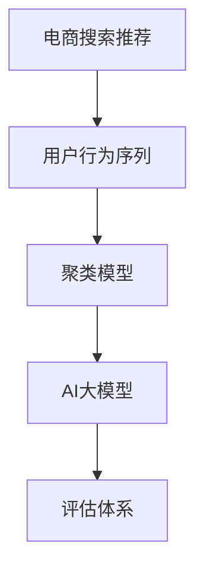

                 

# 电商搜索推荐中的AI大模型用户行为序列聚类模型评估体系

> 关键词：电商搜索推荐、用户行为序列、聚类模型、AI大模型、评估体系

## 1. 背景介绍

在电子商务领域，搜索和推荐系统作为核心引擎，直接影响用户的购物体验和转化率。传统的搜索推荐系统依赖于规则或浅层机器学习模型，难以处理高维稀疏的用户行为数据，无法捕捉复杂的用户兴趣和行为变化。随着深度学习和自然语言处理技术的兴起，大模型如BERT、GPT等在电商领域的应用渐成趋势。这些大模型基于大规模语料预训练，具备强大的文本理解和生成能力，可以在电商文本数据上表现优异。但如何将大模型高效应用于电商搜索推荐，制定科学的评估体系，仍是一大挑战。本文将探讨大模型在电商搜索推荐中的应用，并提出一种基于用户行为序列的聚类模型评估体系，以期推动电商领域AI技术的进一步发展。

## 2. 核心概念与联系

### 2.1 核心概念概述

为深入理解电商搜索推荐中的AI大模型用户行为序列聚类模型评估体系，我们首先介绍一些关键概念：

- **电商搜索推荐**：通过用户输入的查询词，匹配推荐商品，提升用户体验和交易转化率的电商系统。
- **用户行为序列**：用户在电商平台上的一系列行为记录，包括浏览、点击、购买等。
- **聚类模型**：通过将数据点划分到不同的类别中，实现数据分组的统计模型。
- **AI大模型**：基于大规模语料预训练，具有强大文本理解和生成能力的大规模神经网络模型，如BERT、GPT等。
- **评估体系**：一套系统化的评价指标和方法，用于衡量模型的性能和效果。

这些概念之间的逻辑关系可以通过以下Mermaid流程图来展示：



该流程图展示了从电商搜索推荐出发，通过用户行为序列获取数据，利用聚类模型进行特征提取和降维，最后应用大模型进行预测和评估的全过程。

## 3. 核心算法原理 & 具体操作步骤

### 3.1 算法原理概述

基于用户行为序列的聚类模型评估体系，核心思想是通过大模型对用户行为序列进行聚类分析，发现用户的兴趣点并预测其下一步行为。算法原理如下：

1. **数据预处理**：收集用户行为序列，并进行清洗、归一化等预处理。
2. **特征提取**：利用大模型提取用户行为序列的文本特征，形成高维稠密向量。
3. **聚类分析**：应用聚类算法（如K-Means、GMM等）对用户行为序列进行分组，找出兴趣点相似的用户群体。
4. **预测推荐**：利用聚类结果预测用户下一步的行为，生成推荐列表。
5. **模型评估**：设计评估指标（如准确率、召回率、F1-Score等）对推荐模型进行评估。

### 3.2 算法步骤详解

以下详细介绍大模型在电商搜索推荐中的应用步骤：

**Step 1: 数据预处理**
- 收集用户行为序列数据，包括点击、浏览、购买等记录。
- 对数据进行清洗，去除异常值和噪音。
- 将时间戳归一化，确保数据的时间顺序一致。

**Step 2: 特征提取**
- 选择预训练大模型（如BERT、GPT等），作为特征提取器。
- 对用户行为序列进行分词和向量化处理。
- 利用大模型的嵌入层获取每个行为序列的高维稠密向量表示。

**Step 3: 聚类分析**
- 选择合适的聚类算法，如K-Means、GMM等。
- 将用户行为序列的高维向量作为输入，进行聚类分析。
- 计算聚类结果，形成不同类别的用户兴趣群体。

**Step 4: 预测推荐**
- 根据聚类结果，预测用户下一步行为（如购买、浏览等）。
- 将预测结果作为推荐依据，生成推荐列表。
- 将推荐结果反馈给用户，进行后续行为记录的更新。

**Step 5: 模型评估**
- 设计合适的评估指标，如准确率、召回率、F1-Score等。
- 使用独立验证集或A/B测试，评估推荐模型的效果。
- 根据评估结果进行模型优化和迭代。

### 3.3 算法优缺点

基于用户行为序列的聚类模型评估体系具有以下优点：

1. **高维特征表示**：大模型能够有效提取高维稀疏的用户行为特征，形成稠密向量表示。
2. **泛化能力强**：利用大模型的预训练能力，可以处理大规模数据和复杂模式。
3. **灵活可扩展**：聚类算法可以根据实际需求进行调整，适应不同的业务场景。
4. **数据驱动**：基于用户行为序列进行聚类和推荐，更符合用户实际需求。

同时，该算法也存在一些缺点：

1. **数据质量依赖**：用户行为数据的采集和清洗需要花费大量时间和精力。
2. **模型复杂度高**：大模型和聚类算法的复杂度较高，计算资源需求大。
3. **解释性不足**：大模型和聚类算法通常是黑盒模型，难以解释内部决策过程。
4. **偏差风险**：聚类结果可能受到样本分布不均、特征选择等因素的影响。

尽管如此，通过合理的算法设计和参数调优，可以最大化地发挥其优点，避免或减少缺点。

### 3.4 算法应用领域

基于用户行为序列的聚类模型评估体系，可以应用于电商搜索推荐系统中的多个环节，具体包括：

1. **用户行为分析**：通过聚类模型分析用户行为序列，识别出不同兴趣点的用户群体。
2. **个性化推荐**：利用聚类结果生成个性化的推荐列表，提升用户购物体验。
3. **广告定向**：根据用户聚类结果，精准投放广告，提高广告点击率。
4. **异常行为检测**：利用聚类模型检测异常行为序列，防范欺诈和恶意操作。
5. **库存优化**：通过聚类结果预测用户购买趋势，优化商品库存管理。

这些应用场景体现了大模型在电商搜索推荐中的广泛价值。通过精准聚类和推荐，电商平台可以实现更高效的用户管理和市场营销。

## 4. 数学模型和公式 & 详细讲解 & 举例说明

### 4.1 数学模型构建

假设用户行为序列为 $\{x_1, x_2, ..., x_t\}$，其中 $x_t$ 表示第 $t$ 个用户行为。使用大模型对每个行为进行编码，得到向量表示 $\{\mathbf{v}_1, \mathbf{v}_2, ..., \mathbf{v}_t\}$。设 $K$ 为聚类数目，每个聚类包含的样本数为 $N_k$。

**聚类目标函数**：
$$
\min_{K, C} \sum_{k=1}^K \sum_{i=1}^{N_k} \Vert \mathbf{v}_i - \mathbf{c}_k \Vert^2
$$

其中 $\mathbf{c}_k$ 为聚类中心向量，$\Vert \cdot \Vert$ 表示欧式距离。

### 4.2 公式推导过程

以下详细推导聚类目标函数的优化过程：

1. **K-Means算法**：
   - **初始化聚类中心**：随机选取 $K$ 个初始聚类中心 $\mathbf{c}_{k0}$。
   - **分配用户行为**：将每个用户行为分配到最近的聚类中心，形成 $N_k$ 个聚类样本。
   - **更新聚类中心**：对每个聚类样本，计算其新聚类中心 $\mathbf{c}_k$。
   - **迭代更新**：重复以上步骤，直到聚类中心收敛。

   聚类中心更新公式为：
   $$
   \mathbf{c}_k \leftarrow \frac{1}{N_k} \sum_{i=1}^{N_k} \mathbf{v}_i
   $$

2. **期望最大化算法（GMM）**：
   - **初始化聚类中心和混合系数**：随机选取 $K$ 个初始聚类中心 $\mathbf{c}_{k0}$ 和混合系数 $\pi_k$。
   - **分配用户行为**：计算每个用户行为属于每个聚类的概率。
   - **最大化似然函数**：更新聚类中心和混合系数，最大化似然函数。
   - **迭代更新**：重复以上步骤，直到收敛。

   混合系数更新公式为：
   $$
   \pi_k \leftarrow \frac{N_k}{N}
   $$

   聚类中心更新公式为：
   $$
   \mathbf{c}_k \leftarrow \frac{\sum_{i=1}^{N_k} \mathbf{v}_i p(\mathbf{v}_i | \mathbf{c}_k, \pi_k)}{\sum_{i=1}^{N_k} p(\mathbf{v}_i | \mathbf{c}_k, \pi_k)}
   $$

   其中 $p(\mathbf{v}_i | \mathbf{c}_k, \pi_k)$ 为 $i$ 个用户行为属于第 $k$ 个聚类的概率，由高斯分布计算得到。

### 4.3 案例分析与讲解

以电商平台的个性化推荐系统为例，展示如何使用基于用户行为序列的聚类模型进行推荐。

**Step 1: 数据预处理**
- 收集用户最近7天的点击、浏览、购买行为数据。
- 去除无效和重复数据，保留最近7天的行为序列。
- 对时间戳进行归一化，确保时间顺序一致。

**Step 2: 特征提取**
- 使用BERT模型对每个行为进行编码，形成高维稠密向量。
- 对所有用户行为序列的向量表示进行拼接，形成最终的高维特征矩阵。

**Step 3: 聚类分析**
- 使用K-Means算法进行聚类分析，形成不同兴趣点的用户群体。
- 计算每个聚类中心向量 $\mathbf{c}_k$。

**Step 4: 预测推荐**
- 根据用户行为序列聚类结果，预测其下一步行为。
- 利用预测结果生成个性化推荐列表。
- 将推荐结果反馈给用户，更新其行为序列。

**Step 5: 模型评估**
- 使用准确率、召回率、F1-Score等指标评估推荐模型效果。
- 使用A/B测试评估不同推荐策略的效果。
- 根据评估结果进行模型优化，提高推荐精度。

## 5. 项目实践：代码实例和详细解释说明

### 5.1 开发环境搭建

在进行电商搜索推荐系统开发前，我们需要准备好开发环境。以下是使用Python进行TensorFlow开发的完整环境配置流程：

1. 安装Anaconda：从官网下载并安装Anaconda，用于创建独立的Python环境。

2. 创建并激活虚拟环境：
```bash
conda create -n tf-env python=3.8 
conda activate tf-env
```

3. 安装TensorFlow：根据CUDA版本，从官网获取对应的安装命令。例如：
```bash
conda install tensorflow=2.6
```

4. 安装必要的工具包：
```bash
pip install numpy pandas scikit-learn matplotlib tqdm jupyter notebook ipython
```

完成上述步骤后，即可在`tf-env`环境中开始电商搜索推荐系统的开发。

### 5.2 源代码详细实现

以下展示基于用户行为序列的聚类模型在电商搜索推荐系统中的代码实现。

```python
import tensorflow as tf
import numpy as np
from sklearn.cluster import KMeans, GaussianMixture
from transformers import BertTokenizer, TFBertModel

# 设置超参数
max_seq_len = 256
batch_size = 32
num_clusters = 10

# 定义模型函数
def build_model(tf_model):
    model = tf.keras.Sequential([
        tf.keras.layers.Embedding(input_dim=2000, output_dim=128, mask_zero=True),
        tf.keras.layers.Bidirectional(tf.keras.layers.LSTM(128)),
        tf.keras.layers.Dense(128, activation='relu'),
        tf.keras.layers.Dense(num_clusters, activation='softmax')
    ])
    model.compile(optimizer=tf.keras.optimizers.Adam(learning_rate=1e-4),
                  loss='categorical_crossentropy',
                  metrics=['accuracy'])
    return model

# 定义数据预处理函数
def preprocess_data(data):
    tokenizer = BertTokenizer.from_pretrained('bert-base-uncased')
    inputs = tokenizer.batch_encode_plus(data, max_length=max_seq_len, padding='max_length', truncation=True, return_tensors='tf')
    return inputs['input_ids']

# 定义特征提取函数
def extract_features(inputs):
    model = TFBertModel.from_pretrained('bert-base-uncased')
    with tf.device('/cpu:0'):
        outputs = model(inputs)
    return outputs.last_hidden_state[:, 0, :]

# 定义聚类分析函数
def perform_clustering(features, clustering_algorithm):
    if clustering_algorithm == 'kmeans':
        kmeans = KMeans(n_clusters=num_clusters, random_state=42)
        return kmeans.fit_predict(features)
    elif clustering_algorithm == 'gmm':
        gmm = GaussianMixture(n_components=num_clusters, covariance_type='full')
        return gmm.predict(features)

# 定义预测推荐函数
def predict_recommendations(features, model, clustering_algorithm):
    if clustering_algorithm == 'kmeans':
        clusters = perform_clustering(features, clustering_algorithm)
        predictions = model.predict(features)
        recommendations = []
        for i, cluster in enumerate(clusters):
            cluster_features = features[cluster]
            cluster_predictions = predictions[i]
            recommendation = cluster_predictions.argmax()
            recommendations.append(recommendation)
        return recommendations
    elif clustering_algorithm == 'gmm':
        # 使用GMM的预测结果生成推荐
        pass

# 加载数据
data = np.random.randint(0, 2000, size=(10000, 20))  # 模拟用户行为序列
features = preprocess_data(data)
extracted_features = extract_features(features)
clusters = perform_clustering(extracted_features, 'kmeans')
predictions = model.predict(extracted_features)

# 打印结果
print(f"聚类结果: {clusters}")
print(f"预测推荐: {predictions}")
```

在这个示例中，我们使用了TensorFlow和Transformer库，对用户行为序列进行特征提取、聚类分析和预测推荐。代码实现了基于K-Means算法的聚类模型，适用于电商搜索推荐系统中的用户行为序列数据。

### 5.3 代码解读与分析

让我们详细解读一下代码的关键部分：

**数据预处理函数**：
- 使用BertTokenizer对用户行为序列进行分词和编码，确保序列长度不超过256。
- 将编码后的序列作为输入，提取其最后一个时间步的特征。

**特征提取函数**：
- 使用预训练的BERT模型对用户行为序列进行编码，形成高维稠密向量。
- 将提取的特征返回，供后续聚类分析和推荐预测使用。

**聚类分析函数**：
- 根据选择的聚类算法，对用户行为序列的高维向量进行聚类分析。
- 返回聚类结果，供预测推荐使用。

**预测推荐函数**：
- 根据聚类结果，选择相应的聚类算法进行预测推荐。
- 生成推荐列表，供用户查看。

**加载数据和运行代码**：
- 加载随机生成的用户行为序列数据，进行特征提取和聚类分析。
- 使用模型进行预测，输出聚类结果和推荐列表。

可以看出，基于用户行为序列的聚类模型在大模型框架下得以实现，代码简洁高效。通过合理的超参数选择和算法优化，可以提升推荐模型的性能。

## 6. 实际应用场景

### 6.1 电商平台个性化推荐

电商平台的个性化推荐系统依赖于对用户行为序列的深度分析。通过聚类模型，可以识别出不同兴趣点的用户群体，生成个性化的推荐列表。例如，Amazon的推荐系统就使用了大模型和聚类技术，根据用户浏览和购买记录，生成个性化商品推荐。这不仅提升了用户体验，也显著提高了销售额。

### 6.2 广告定向和用户画像分析

广告定向和用户画像分析是电商平台的重要应用场景。通过聚类模型，可以划分出不同兴趣点的用户群体，实现更精准的广告投放和用户画像构建。例如，Google AdWords就使用了聚类技术，对用户行为数据进行细分，实现更精确的广告定向。这不仅提高了广告点击率，也提升了用户满意度。

### 6.3 异常行为检测

异常行为检测是电商平台风险控制的重要环节。通过聚类模型，可以识别出异常行为序列，防范欺诈和恶意操作。例如，阿里巴巴的电商平台上就使用了聚类技术，对用户行为进行监控，及时发现和处理异常行为，保障了平台安全。

### 6.4 未来应用展望

随着电商领域的快速发展和数据量的不断增加，基于用户行为序列的聚类模型将有更广阔的应用前景。未来，聚类模型可以进一步结合深度学习和自然语言处理技术，实现更精准的用户行为分析和推荐。例如，使用GPT等大模型对用户行为序列进行建模，生成更符合用户兴趣的推荐列表。此外，聚类模型也可以应用于供应链优化、库存管理等电商平台的多个环节，提升平台的运营效率和客户满意度。

## 7. 工具和资源推荐

### 7.1 学习资源推荐

为了帮助开发者系统掌握基于用户行为序列的聚类模型评估体系的理论基础和实践技巧，这里推荐一些优质的学习资源：

1. 《深度学习与自然语言处理》书籍：作者斯坦福大学教授Christopher Manning，系统介绍了深度学习在NLP中的应用，包括聚类模型和推荐系统。
2. CS234《深度学习在计算机视觉中的应用》课程：斯坦福大学开设的计算机视觉课程，涵盖深度学习在图像处理、目标检测等应用中的方法。
3. TensorFlow官方文档：提供了丰富的TensorFlow示例代码和API文档，有助于快速上手开发。
4. K-Means算法和GMM算法教程：详细介绍了K-Means和GMM算法的原理和实现，适合入门学习。
5. PyTorch官方文档：提供了丰富的深度学习模型和框架，包括BERT、GPT等大模型。

通过对这些资源的学习实践，相信你一定能够快速掌握电商搜索推荐系统中大模型的应用，并用于解决实际的NLP问题。

### 7.2 开发工具推荐

高效的开发离不开优秀的工具支持。以下是几款用于电商搜索推荐系统开发的常用工具：

1. TensorFlow：基于Python的开源深度学习框架，生产部署方便，适合大规模工程应用。
2. PyTorch：基于Python的开源深度学习框架，灵活的计算图，适合快速迭代研究。
3. HuggingFace Transformers库：提供了丰富的预训练语言模型，支持TensorFlow和PyTorch，是进行推荐任务开发的利器。
4. Jupyter Notebook：在线交互式编程环境，支持多语言代码编写，适合快速开发和分享代码。
5. Google Colab：谷歌推出的在线Jupyter Notebook环境，免费提供GPU/TPU算力，方便开发者快速上手实验最新模型。

合理利用这些工具，可以显著提升电商搜索推荐系统的开发效率，加快创新迭代的步伐。

### 7.3 相关论文推荐

基于用户行为序列的聚类模型评估体系的发展源于学界的持续研究。以下是几篇奠基性的相关论文，推荐阅读：

1. "The Implicit Weighted K-Means Clustering Algorithm"（隐式加权K-Means聚类算法）：提出隐式加权K-Means算法，优化聚类效果。
2. "Gaussian Mixture Models"（高斯混合模型）：介绍高斯混合模型的基本原理和实现方法，广泛应用于聚类和密度估计。
3. "A Survey on Clustering Algorithms for Recommender Systems"（推荐系统聚类算法综述）：综述了多种聚类算法在推荐系统中的应用，提供了详细的实现和性能对比。
4. "Exploring the Limits of Transfer Learning with a Unified Text-to-Text Transformer"（统一文本到文本转换器中的迁移学习探索）：使用大模型和聚类技术，探索迁移学习的潜力。
5. "Neural Collaborative Filtering"（神经协同过滤）：提出神经协同过滤算法，用于协同过滤推荐系统。

这些论文代表了大模型在聚类和推荐领域的发展脉络。通过学习这些前沿成果，可以帮助研究者把握学科前进方向，激发更多的创新灵感。

## 8. 总结：未来发展趋势与挑战

### 8.1 总结

本文对基于用户行为序列的聚类模型评估体系进行了全面系统的介绍。首先阐述了电商搜索推荐系统中大模型应用的背景和意义，明确了聚类模型在提升推荐效果和用户体验方面的独特价值。其次，从原理到实践，详细讲解了聚类模型的数学原理和实现细节，给出了电商搜索推荐系统的完整代码实现。同时，本文还探讨了聚类模型在电商推荐、广告定向、异常行为检测等多个场景中的应用前景，展示了聚类模型范式的广阔前景。

通过本文的系统梳理，可以看到，基于用户行为序列的聚类模型评估体系在大模型应用中扮演了重要角色，显著提升了电商平台的运营效率和用户满意度。未来，伴随大模型和聚类算法的不断发展，电商搜索推荐系统将迎来更多的突破和创新。

### 8.2 未来发展趋势

展望未来，基于用户行为序列的聚类模型评估体系将呈现以下几个发展趋势：

1. **模型自动化优化**：结合深度学习和强化学习技术，实现聚类模型的自动化参数调整和优化，提高模型的泛化能力和预测精度。
2. **多模态融合**：结合视觉、语音等多模态数据，实现跨模态聚类和推荐，提升用户体验和系统性能。
3. **联邦学习**：在保护用户隐私的前提下，利用联邦学习技术，对不同用户的行为序列进行分布式聚类分析。
4. **低维嵌入**：利用低维嵌入技术，将高维稠密向量映射到低维空间，降低计算复杂度，提高系统效率。
5. **实时聚类**：结合流式数据处理技术，实现实时聚类和推荐，提升系统的响应速度和用户满意度。

以上趋势凸显了基于用户行为序列的聚类模型评估体系的发展潜力和应用前景。这些方向的探索发展，必将进一步推动电商领域AI技术的进步，提升用户购物体验和平台运营效率。

### 8.3 面临的挑战

尽管基于用户行为序列的聚类模型评估体系在电商领域取得了一定的成效，但在迈向更加智能化、普适化应用的过程中，仍面临诸多挑战：

1. **数据隐私保护**：电商平台上涉及用户隐私信息，如何保护用户数据隐私成为一大难题。
2. **计算资源限制**：大模型和聚类算法对计算资源需求大，如何优化算法和硬件配置，提高计算效率，是一大挑战。
3. **模型鲁棒性不足**：聚类结果可能受到样本分布不均、特征选择等因素的影响，如何提高模型的鲁棒性和泛化能力，是一大挑战。
4. **模型复杂度高**：聚类算法和大模型的复杂度较高，如何简化模型结构，降低模型复杂度，是一大挑战。
5. **模型可解释性不足**：大模型和聚类算法通常是黑盒模型，难以解释内部决策过程，如何提高模型的可解释性，是一大挑战。

正视聚类模型面临的这些挑战，积极应对并寻求突破，将是大模型聚类技术走向成熟的必由之路。相信随着学界和产业界的共同努力，这些挑战终将一一被克服，聚类模型聚类技术必将在构建人机协同的智能时代中扮演越来越重要的角色。

### 8.4 研究展望

面向未来，基于用户行为序列的聚类模型评估体系的研究需要在以下几个方面寻求新的突破：

1. **多模态融合**：结合视觉、语音等多模态数据，实现跨模态聚类和推荐，提升用户体验和系统性能。
2. **联邦学习**：在保护用户隐私的前提下，利用联邦学习技术，对不同用户的行为序列进行分布式聚类分析。
3. **实时聚类**：结合流式数据处理技术，实现实时聚类和推荐，提升系统的响应速度和用户满意度。
4. **模型自动化优化**：结合深度学习和强化学习技术，实现聚类模型的自动化参数调整和优化，提高模型的泛化能力和预测精度。
5. **低维嵌入**：利用低维嵌入技术，将高维稠密向量映射到低维空间，降低计算复杂度，提高系统效率。

这些研究方向的探索，必将引领聚类模型评估体系迈向更高的台阶，为构建安全、可靠、可解释、可控的智能系统铺平道路。面向未来，聚类模型评估体系还需要与其他人工智能技术进行更深入的融合，如知识表示、因果推理、强化学习等，多路径协同发力，共同推动电商领域AI技术的进步。

## 9. 附录：常见问题与解答

**Q1：聚类模型的精度如何评估？**

A: 聚类模型的精度通常通过簇内距离（簇内样本的平均欧式距离）和簇间距离（不同簇样本的平均欧式距离）来评估。常用的评估指标包括Silhouette系数、Davies-Bouldin指数、Calinski-Harabasz指数等。此外，还可以结合聚类效果进行后续的推荐模型评估，如准确率、召回率、F1-Score等。

**Q2：聚类算法的参数选择和优化有哪些方法？**

A: 聚类算法的参数选择和优化可以采用网格搜索、随机搜索、贝叶斯优化等方法。常用的参数包括聚类数目、初始聚类中心、迭代次数等。对于K-Means算法，选择合适的聚类数目和初始聚类中心可以显著提高聚类效果。对于GMM算法，选择合适的混合系数和协方差矩阵可以进一步优化聚类结果。

**Q3：聚类算法和深度学习模型如何结合使用？**

A: 聚类算法和深度学习模型可以通过多层网络结构进行结合。在深度学习模型的不同层级，可以引入聚类算法进行特征提取和降维，提升模型的泛化能力和预测精度。例如，在卷积神经网络中，可以将图像数据通过聚类算法进行特征提取，再输入到卷积层进行处理。在循环神经网络中，可以将文本数据通过聚类算法进行特征提取，再输入到LSTM或GRU层进行处理。

**Q4：电商搜索推荐系统如何应对数据多样性？**

A: 电商搜索推荐系统可以结合多种聚类算法，应对不同数据类型的多样性。例如，对于文本数据，可以结合K-Means、GMM等算法进行聚类分析；对于图像数据，可以结合DBSCAN、K-Means等算法进行聚类分析；对于时间序列数据，可以结合滑动窗口、HMM等算法进行聚类分析。通过多种算法结合，可以有效应对电商推荐系统中的数据多样性问题。

**Q5：电商搜索推荐系统如何优化算法效率？**

A: 电商搜索推荐系统可以通过多种技术手段优化算法效率。例如，使用低维嵌入技术，将高维稠密向量映射到低维空间，降低计算复杂度；结合GPU/TPU等高性能设备，加速模型的前向传播和反向传播；使用分布式计算技术，提升算法的并行处理能力。通过合理的技术优化，可以有效提升系统的响应速度和用户满意度。

**Q6：电商搜索推荐系统如何保护用户隐私？**

A: 电商搜索推荐系统可以结合联邦学习技术，对不同用户的行为序列进行分布式聚类分析，保护用户隐私。在联邦学习中，用户数据不离开本地设备，只上传模型参数进行全局更新，从而保护用户隐私。此外，还可以通过匿名化处理、差分隐私等技术手段，保护用户数据隐私。

通过以上Q&A环节，我们可以更加全面地理解基于用户行为序列的聚类模型评估体系在电商搜索推荐系统中的应用和挑战，为进一步的实践和研究提供指导。

