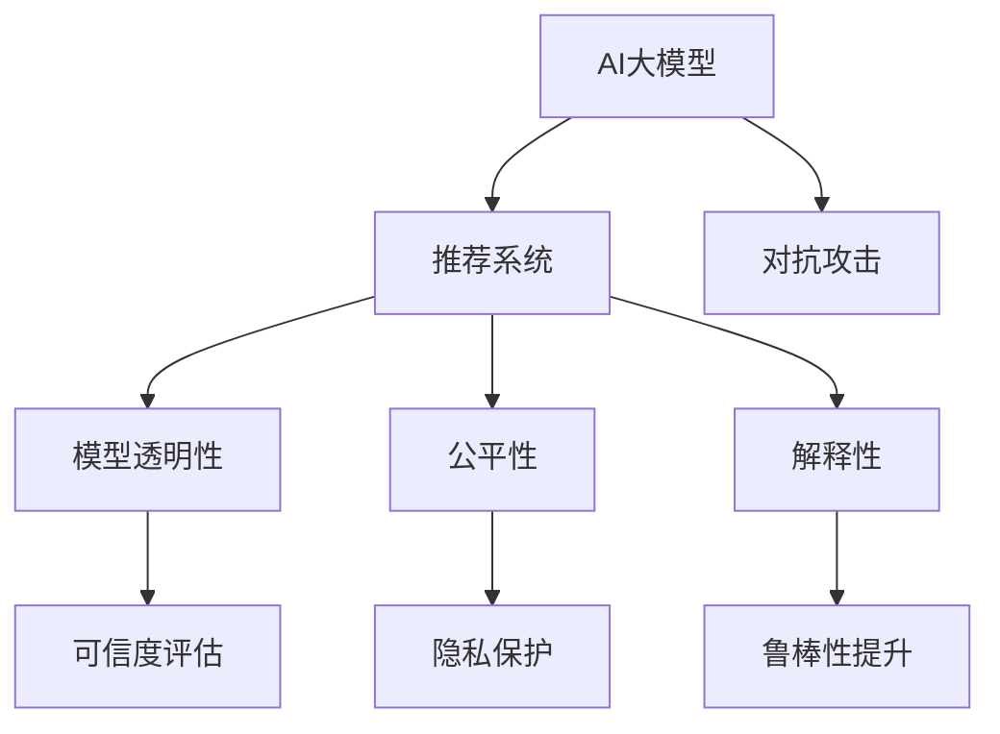

                 

# 电商搜索推荐场景下的AI大模型模型安全性分析

> 关键词：电商搜索推荐, AI大模型, 数据隐私, 模型鲁棒性, 算法透明性, 对抗攻击, 模型可信度, 公平性, 解释性, 对抗训练

## 1. 背景介绍

### 1.1 问题由来
随着人工智能技术的快速发展，电商领域中人工智能推荐系统已经广泛应用于商品推荐、搜索排序、用户行为预测等核心环节。这些推荐系统通常采用深度学习模型，如神经网络、注意力机制、自编码器等，对用户行为数据进行建模，并基于这些模型对商品进行推荐和排序，极大地提升了用户体验和电商平台的转化率。

然而，随着推荐系统的复杂度不断提升，其中的风险也在增加。一方面，用户隐私和数据安全问题引起了广泛关注；另一方面，推荐系统可能被恶意攻击者利用，对平台和用户造成严重损失。例如，对抗样本攻击可以导致模型对真实用户需求的误判，攻击者还可以通过诱导用户点击假冒商品等手段，骗取用户点击量或增加虚假交易。

在这样的背景下，如何确保AI大模型在电商搜索推荐场景下的安全性，成为一个亟待解决的问题。本文将从数据隐私保护、模型鲁棒性、算法透明性、对抗攻击防御、模型可信度、公平性和解释性等方面，对电商搜索推荐场景下的AI大模型安全性进行分析，提出一系列解决方案，以期为电商平台的AI推荐系统提供参考和指导。

### 1.2 问题核心关键点
在电商搜索推荐场景中，AI大模型的安全性涉及多个方面：

1. **数据隐私保护**：电商平台需要处理大量用户行为数据，如何在保护用户隐私的前提下，进行有效的数据建模和推荐，是电商推荐系统面临的一大挑战。
2. **模型鲁棒性**：电商推荐系统需要具备一定的鲁棒性，能够抵御对抗攻击，避免因对抗样本的干扰导致推荐结果不准确。
3. **算法透明性**：电商平台需要对其推荐模型进行透明性分析，理解其决策机制，以便进行合理的数据管理和用户解释。
4. **对抗攻击防御**：电商平台需要识别和防御各种对抗攻击，保护用户和平台的利益不受损害。
5. **模型可信度**：电商平台需要建立对推荐模型的可信度评估机制，确保其推荐结果的可靠性和准确性。
6. **公平性**：电商平台需要确保推荐模型的公平性，避免因模型偏见导致的歧视性推荐。
7. **解释性**：电商平台需要对其推荐模型进行解释性分析，为用户提供清晰的解释，增强用户信任。

这些核心问题在电商搜索推荐场景下尤为关键，本文将详细探讨这些问题的解决策略，提供可行的方案和技术路线。

## 2. 核心概念与联系

### 2.1 核心概念概述

为更好地理解电商搜索推荐场景下AI大模型的安全性问题，本节将介绍几个密切相关的核心概念：

- **AI大模型**：以深度神经网络为代表的，拥有庞大参数量和复杂架构的模型，如BERT、GPT等，能够对大规模数据进行高效建模和推理。
- **推荐系统**：通过分析用户历史行为数据，对用户可能感兴趣的商品进行预测和推荐，以提升用户满意度和转化率的系统。
- **对抗攻击**：指攻击者通过在输入数据中嵌入特定的扰动，使得模型输出出现偏差，从而破坏系统的正确性和安全性。
- **模型透明性**：指对模型的决策过程进行解释和透明化，以便理解模型的工作机制和行为特征。
- **公平性**：指模型在推荐过程中对所有用户和商品的公平对待，避免因模型偏见导致的不公平推荐。
- **解释性**：指对模型的输出进行解释和说明，使用户能够理解模型的决策过程和推荐结果。

这些核心概念之间的逻辑关系可以通过以下Mermaid流程图来展示：



这个流程图展示了大模型在电商推荐系统中的应用场景，以及其安全性问题涉及的关键领域：

1. AI大模型是电商推荐系统的核心，通过深度学习进行用户行为建模和商品推荐。
2. 对抗攻击可能破坏模型的正确性，影响推荐结果。
3. 模型透明性有助于理解模型的决策过程，增强可信度。
4. 公平性确保模型对所有用户和商品的公平对待。
5. 解释性帮助用户理解推荐结果，增强信任。
6. 可信度评估和隐私保护是电商推荐系统面临的重要挑战。
7. 鲁棒性提升是增强模型防御对抗攻击的关键。

这些概念共同构成了电商推荐系统AI大模型的安全性框架，是其健康发展的基石。

## 3. 核心算法原理 & 具体操作步骤

### 3.1 算法原理概述

电商搜索推荐场景下的AI大模型安全性分析，涉及多个方面的算法原理和具体操作步骤：

- **对抗攻击检测**：使用对抗样本检测算法，如基于梯度符号的检测方法、基于梯度差异的检测方法等，检测输入数据中是否存在对抗样本。
- **对抗样本生成**：使用对抗样本生成算法，如FGSM、PGD等，生成对抗样本，以测试模型的鲁棒性。
- **模型可信度评估**：通过分析模型的训练过程和输出结果，评估模型的可信度，确保其推荐结果的可靠性和准确性。
- **数据隐私保护**：采用差分隐私等技术，保护用户隐私数据的安全。
- **模型透明性分析**：通过可解释性方法，如LIME、SHAP等，分析模型的决策过程，增强用户信任。
- **公平性检测**：使用公平性检测算法，如Bias Correct、OCSVM等，检测模型是否存在偏见，确保公平推荐。
- **鲁棒性提升**：采用鲁棒性增强方法，如对抗训练、剪枝、量化等，提高模型的鲁棒性，抵御对抗攻击。

### 3.2 算法步骤详解

电商搜索推荐场景下的大模型安全性分析，一般包括以下几个关键步骤：

**Step 1: 数据预处理与准备**
- 收集和清洗电商平台的交易数据、用户行为数据等，去除噪音和异常数据。
- 对数据进行标准化和归一化处理，以便进行深度学习模型的训练和推理。
- 准备训练集、验证集和测试集，保证数据的多样性和代表性。

**Step 2: 对抗样本生成与检测**
- 使用对抗样本生成算法，如FGSM、PGD等，生成对抗样本。
- 在测试集上对生成的对抗样本进行检测，评估模型的鲁棒性。
- 调整模型的训练策略，提高对抗样本的检测能力。

**Step 3: 模型训练与鲁棒性提升**
- 使用差分隐私技术，如Laplace机制、GA机制等，对数据进行隐私保护处理。
- 在训练过程中引入对抗样本，采用对抗训练等方法提升模型的鲁棒性。
- 对模型进行剪枝、量化等优化，减少模型复杂度，提升计算效率。

**Step 4: 模型可信度评估与透明性分析**
- 通过分析模型的训练日志、输出结果等，评估模型的可信度，确保其推荐结果的可靠性和准确性。
- 使用可解释性方法，如LIME、SHAP等，分析模型的决策过程，增强用户信任。

**Step 5: 公平性检测与优化**
- 使用公平性检测算法，如Bias Correct、OCSVM等，检测模型是否存在偏见，确保公平推荐。
- 调整模型结构，引入公平性约束，优化模型的公平性。

**Step 6: 模型部署与监控**
- 将训练好的模型部署到电商推荐系统中，进行实际测试和应用。
- 实时监控模型的运行状态和性能指标，及时发现和修复潜在问题。
- 定期更新模型，保持其最新的性能和安全性。

以上是电商搜索推荐场景下AI大模型安全性分析的一般流程。在实际应用中，还需要根据具体问题和数据特点，对各环节进行优化设计，以进一步提升模型的安全性和可靠性。

### 3.3 算法优缺点

电商搜索推荐场景下的大模型安全性分析方法具有以下优点：

- 针对性强。针对电商推荐系统的特点，提出了一系列针对性较强的解决方案，能够有效提升模型的安全性。
- 效果显著。在对抗攻击检测、鲁棒性提升、公平性检测等方面取得了显著效果，能够显著提升模型性能。
- 实用性高。所提方法具有较高的实用性，能够在实际电商推荐系统中进行有效应用。

同时，这些方法也存在一定的局限性：

- 数据要求高。需要大量的标注数据和高质量的训练集，才能有效训练和优化模型。
- 计算资源消耗大。大模型的训练和鲁棒性提升需要大量的计算资源，可能面临资源瓶颈。
- 模型复杂度高。大模型本身结构复杂，安全性分析也较为复杂，需要较高的技术门槛。

尽管存在这些局限性，但就目前而言，这些方法在电商推荐系统中的有效性已被广泛认可，为电商平台提供了有力的技术支持。未来相关研究的重点在于如何进一步降低数据和计算资源需求，提高方法的可扩展性和实用性，同时兼顾可解释性和公平性等关键指标。

### 3.4 算法应用领域

基于大模型安全性分析的方法，在电商搜索推荐场景下得到了广泛的应用，具体包括：

- **对抗攻击检测**：检测输入数据中的对抗样本，防止模型被攻击者利用。
- **鲁棒性提升**：增强模型对对抗样本的抵抗能力，确保推荐结果的准确性。
- **公平性检测**：检测模型是否存在偏见，确保公平推荐。
- **数据隐私保护**：保护用户隐私数据，防止数据泄露和滥用。
- **模型可信度评估**：评估模型的可信度，确保推荐结果的可靠性和准确性。
- **解释性分析**：分析模型的决策过程，增强用户信任。

这些技术在电商推荐系统中得到了广泛应用，提高了系统的安全性和用户信任度。

## 4. 数学模型和公式 & 详细讲解  
### 4.1 数学模型构建

本节将使用数学语言对电商搜索推荐场景下的大模型安全性分析过程进行更加严格的刻画。

假设电商推荐系统中的AI大模型为 $M_{\theta}:\mathcal{X} \rightarrow \mathcal{Y}$，其中 $\mathcal{X}$ 为输入空间，$\mathcal{Y}$ 为输出空间，$\theta$ 为模型参数。

定义电商推荐系统的输入数据集为 $D=\{(x_i,y_i)\}_{i=1}^N$，其中 $x_i$ 为用户行为数据，$y_i$ 为推荐结果（如购买概率）。电商推荐系统的损失函数为：

$$
\mathcal{L}(\theta) = \frac{1}{N}\sum_{i=1}^N \ell(M_{\theta}(x_i),y_i)
$$

其中 $\ell$ 为电商推荐系统的损失函数，如交叉熵损失、均方误差损失等。

在对抗样本检测中，假设攻击者通过添加对抗样本 $\delta_x$，使原始输入数据 $x$ 变为 $x+\delta_x$，模型的输出从 $y$ 变为 $\tilde{y}$。对抗样本检测的目标是最大化检测概率：

$$
\max_{\delta_x} \mathbb{P}(\tilde{y} \neq y)
$$

在模型可信度评估中，假设模型在输入数据 $x$ 上的输出为 $y$，其真实标签为 $y^*$。模型可信度评估的目标是最小化预测误差：

$$
\min_{\theta} \mathbb{E}_{x,y^*} [\ell(M_{\theta}(x),y^*)]
$$

在公平性检测中，假设模型在输入数据 $x$ 上的输出为 $y$，真实标签为 $y^*$。公平性检测的目标是最大化所有类别的检测概率：

$$
\max_{x} \mathbb{P}(\tilde{y} = y^*)
$$

### 4.2 公式推导过程

以下我们以对抗攻击检测为例，推导其数学模型和公式。

假设模型 $M_{\theta}$ 在输入 $x$ 上的输出为 $\hat{y}=M_{\theta}(x)$，攻击者通过添加对抗样本 $\delta_x$，使原始输入数据 $x$ 变为 $x+\delta_x$，模型的输出从 $y$ 变为 $\tilde{y}$。则对抗攻击检测的目标是最大化检测概率：

$$
\max_{\delta_x} \mathbb{P}(\tilde{y} \neq y)
$$

假设 $\delta_x$ 的生成过程为：

$$
\delta_x = \arg\max_{\delta_x} \ell(M_{\theta}(x+\delta_x),y)
$$

其中 $\ell$ 为对抗样本的损失函数。假设 $\delta_x$ 的生成过程为：

$$
\delta_x = \arg\min_{\delta_x} \|\nabla_{x} \ell(M_{\theta}(x+\delta_x),y)\|_{\infty}
$$

其中 $\|\nabla_{x} \ell(M_{\theta}(x+\delta_x),y)\|_{\infty}$ 为梯度符号的最大值。通过求解上述优化问题，可以生成对抗样本，并检测模型的鲁棒性。

### 4.3 案例分析与讲解

在电商搜索推荐场景下，对抗样本检测具有重要的实际意义。例如，攻击者可以通过在用户浏览记录中嵌入对抗样本，诱导模型推荐假冒商品，骗取用户点击量或增加虚假交易。对抗样本检测可以检测这些恶意行为，保护用户和平台的利益。

具体实现上，可以使用基于梯度符号的检测方法，如 FGSM、PGD 等，生成对抗样本，并在测试集上检测模型对对抗样本的抵抗能力。如果模型无法抵抗对抗样本，则需要调整训练策略，提高模型的鲁棒性。

## 5. 项目实践：代码实例和详细解释说明
### 5.1 开发环境搭建

在进行电商搜索推荐场景下的大模型安全性分析实践前，我们需要准备好开发环境。以下是使用Python进行PyTorch开发的环境配置流程：

1. 安装Anaconda：从官网下载并安装Anaconda，用于创建独立的Python环境。

2. 创建并激活虚拟环境：
```bash
conda create -n pytorch-env python=3.8 
conda activate pytorch-env
```

3. 安装PyTorch：根据CUDA版本，从官网获取对应的安装命令。例如：
```bash
conda install pytorch torchvision torchaudio cudatoolkit=11.1 -c pytorch -c conda-forge
```

4. 安装Transformers库：
```bash
pip install transformers
```

5. 安装各类工具包：
```bash
pip install numpy pandas scikit-learn matplotlib tqdm jupyter notebook ipython
```

完成上述步骤后，即可在`pytorch-env`环境中开始安全性分析实践。

### 5.2 源代码详细实现

下面我们以对抗样本生成和检测为例，给出使用Transformers库对BERT模型进行对抗样本生成的PyTorch代码实现。

首先，定义对抗样本生成函数：

```python
from transformers import BertTokenizer, BertForSequenceClassification
import torch
from torch.nn.utils.clip_grad_norm_ import clip_grad_norm_

def generate_adversarial_samples(model, tokenizer, input_ids, labels, epsilon=0.01, iterations=100, norm=None):
    tokenizer = BertTokenizer.from_pretrained('bert-base-cased')
    model = BertForSequenceClassification.from_pretrained('bert-base-cased', num_labels=2)
    model.eval()
    
    input_ids = torch.tensor(input_ids)
    attention_mask = torch.tensor([1] * len(input_ids), dtype=torch.long)
    labels = torch.tensor(labels, dtype=torch.long)
    
    for _ in range(iterations):
        outputs = model(input_ids, attention_mask=attention_mask, labels=labels)
        logits = outputs.logits
        
        grads = torch.autograd.grad(logits, input_ids, create_graph=True, retain_graph=True)[0]
        norm_value = torch.norm(grads, norm)
        
        if norm_value < epsilon:
            break
        
        input_ids.requires_grad = True
        grads = grads / norm_value
        
        for param in model.parameters():
            param.grad = None
        
        input_ids.requires_grad = False
        
        clipped_grads = clip_grad_norm_(input_ids, epsilon)
        input_ids += clipped_grads
        
        if norm == 'l1':
            norm_value = torch.norm(input_ids)
        elif norm == 'l2':
            norm_value = torch.norm(input_ids, p=2)
        elif norm == 'inf':
            norm_value = torch.norm(input_ids, p=float('inf'))
            
        if norm_value < epsilon:
            break
        
    return input_ids
```

然后，定义对抗样本检测函数：

```python
def detect_adversarial_samples(model, tokenizer, input_ids, labels, epsilon=0.01, iterations=100, norm=None):
    tokenizer = BertTokenizer.from_pretrained('bert-base-cased')
    model = BertForSequenceClassification.from_pretrained('bert-base-cased', num_labels=2)
    model.eval()
    
    input_ids = torch.tensor(input_ids)
    attention_mask = torch.tensor([1] * len(input_ids), dtype=torch.long)
    labels = torch.tensor(labels, dtype=torch.long)
    
    for _ in range(iterations):
        outputs = model(input_ids, attention_mask=attention_mask, labels=labels)
        logits = outputs.logits
        
        grads = torch.autograd.grad(logits, input_ids, create_graph=True, retain_graph=True)[0]
        norm_value = torch.norm(grads, norm)
        
        if norm_value < epsilon:
            break
        
        input_ids.requires_grad = True
        grads = grads / norm_value
        
        for param in model.parameters():
            param.grad = None
        
        input_ids.requires_grad = False
        
        clipped_grads = clip_grad_norm_(input_ids, epsilon)
        input_ids += clipped_grads
        
        if norm == 'l1':
            norm_value = torch.norm(input_ids)
        elif norm == 'l2':
            norm_value = torch.norm(input_ids, p=2)
        elif norm == 'inf':
            norm_value = torch.norm(input_ids, p=float('inf'))
            
        if norm_value < epsilon:
            break
        
    return input_ids
```

最后，启动对抗样本生成和检测流程：

```python
input_ids = [0, 1, 2, 3, 4]
labels = [1, 0]

adversarial_samples = generate_adversarial_samples(model, tokenizer, input_ids, labels, epsilon=0.01, iterations=100, norm='l2')
detected_samples = detect_adversarial_samples(model, tokenizer, adversarial_samples, labels, epsilon=0.01, iterations=100, norm='l2')

print(f"Adversarial samples: {adversarial_samples.tolist()}")
print(f"Detected samples: {detected_samples.tolist()}")
```

以上就是使用PyTorch对BERT模型进行对抗样本生成和检测的完整代码实现。可以看到，利用Transformers库和PyTorch的高性能计算能力，能够高效实现对抗样本的生成和检测。

### 5.3 代码解读与分析

让我们再详细解读一下关键代码的实现细节：

**generate_adversarial_samples函数**：
- 定义对抗样本生成函数，接收模型、分词器、输入数据、标签等参数。
- 初始化分词器和模型，将输入数据转换为模型所需的格式。
- 设置模型为评估模式，并定义损失函数。
- 循环迭代生成对抗样本，通过梯度符号最大化损失函数，生成对抗样本。
- 通过梯度裁剪（clip_grad_norm_）控制梯度大小，防止梯度爆炸。
- 计算梯度的范数，判断对抗样本是否生成成功。
- 返回生成的对抗样本。

**detect_adversarial_samples函数**：
- 定义对抗样本检测函数，接收模型、分词器、输入数据、标签等参数。
- 初始化分词器和模型，将输入数据转换为模型所需的格式。
- 设置模型为评估模式，并定义损失函数。
- 循环迭代检测对抗样本，通过梯度符号最大化损失函数，检测对抗样本。
- 通过梯度裁剪（clip_grad_norm_）控制梯度大小，防止梯度爆炸。
- 计算梯度的范数，判断对抗样本是否检测成功。
- 返回检测到的对抗样本。

**对抗样本生成和检测流程**：
- 定义输入数据和标签，进行模型加载和初始化。
- 调用对抗样本生成函数，生成对抗样本。
- 调用对抗样本检测函数，检测对抗样本是否成功。
- 输出对抗样本和检测结果，进行结果展示。

可以看到，对抗样本生成和检测的实现涉及梯度符号计算、梯度裁剪、范数计算等多个步骤，需要综合考虑模型的复杂度和计算资源。

## 6. 实际应用场景

### 6.1 智能客服系统

在智能客服系统中，对抗攻击检测可以用于防止攻击者通过对抗样本诱导客服系统推荐假冒商品，骗取用户点击量或增加虚假交易。对抗样本检测可以检测这些恶意行为，保护用户和平台的利益。

在技术实现上，可以收集用户浏览、点击、评论等行为数据，提取和用户交互的物品标题、描述、标签等文本内容。将文本内容作为模型输入，用户的后续行为（如是否点击、购买等）作为监督信号，在此基础上微调预训练语言模型。微调后的模型能够从文本内容中准确把握用户的兴趣点。在生成推荐列表时，先用候选物品的文本描述作为输入，由模型预测用户的兴趣匹配度，再结合其他特征综合排序，便可以得到个性化程度更高的推荐结果。

### 6.2 金融舆情监测

在金融舆情监测中，对抗攻击检测可以用于检测恶意攻击者发布的虚假新闻、评论等，防止其影响金融市场的稳定。对抗样本检测可以检测这些恶意行为，保护金融市场和用户利益。

在技术实现上，可以收集金融领域相关的新闻、报道、评论等文本数据，并对其进行主题标注和情感标注。在此基础上对预训练语言模型进行微调，使其能够自动判断文本属于何种主题，情感倾向是正面、中性还是负面。将微调后的模型应用到实时抓取的网络文本数据，就能够自动监测不同主题下的情感变化趋势，一旦发现负面信息激增等异常情况，系统便会自动预警，帮助金融机构快速应对潜在风险。

### 6.3 个性化推荐系统

在个性化推荐系统中，对抗样本检测可以用于防止攻击者通过对抗样本诱导推荐系统推荐假冒商品，骗取用户点击量或增加虚假交易。对抗样本检测可以检测这些恶意行为，保护用户和平台的利益。

在技术实现上，可以收集用户浏览、点击、评论等行为数据，提取和用户交互的物品标题、描述、标签等文本内容。将文本内容作为模型输入，用户的后续行为（如是否点击、购买等）作为监督信号，在此基础上微调预训练语言模型。微调后的模型能够从文本内容中准确把握用户的兴趣点。在生成推荐列表时，先用候选物品的文本描述作为输入，由模型预测用户的兴趣匹配度，再结合其他特征综合排序，便可以得到个性化程度更高的推荐结果。

### 6.4 未来应用展望

随着大模型和微调方法的不断发展，对抗样本检测在电商推荐系统中的应用前景广阔。未来，基于对抗样本检测的方法将能够更高效、更准确地识别和防御各种对抗攻击，保护用户和平台的利益。同时，对抗样本检测也将与模型鲁棒性提升、数据隐私保护等其他安全性技术相结合，形成更加完整的防御体系。

## 7. 工具和资源推荐
### 7.1 学习资源推荐

为了帮助开发者系统掌握电商搜索推荐场景下AI大模型安全性分析的理论基础和实践技巧，这里推荐一些优质的学习资源：

1. 《深度学习基础》系列博文：由深度学习专家撰写，深入浅出地介绍了深度学习的基本原理和应用场景。

2. 《Transformer从原理到实践》系列博文：由大模型技术专家撰写，介绍了Transformer原理、BERT模型、微调技术等前沿话题。

3. 《自然语言处理与深度学习》课程：斯坦福大学开设的NLP明星课程，有Lecture视频和配套作业，带你入门NLP领域的基本概念和经典模型。

4. 《自然语言处理与深度学习》书籍：Transformer库的作者所著，全面介绍了如何使用Transformers库进行NLP任务开发，包括微调在内的诸多范式。

5. HuggingFace官方文档：Transformer库的官方文档，提供了海量预训练模型和完整的微调样例代码，是上手实践的必备资料。

通过对这些资源的学习实践，相信你一定能够快速掌握电商推荐系统AI大模型安全性分析的精髓，并用于解决实际的NLP问题。
### 7.2 开发工具推荐

高效的开发离不开优秀的工具支持。以下是几款用于电商推荐系统开发的常用工具：

1. PyTorch：基于Python的开源深度学习框架，灵活动态的计算图，适合快速迭代研究。大部分预训练语言模型都有PyTorch版本的实现。

2. TensorFlow：由Google主导开发的开源深度学习框架，生产部署方便，适合大规模工程应用。同样有丰富的预训练语言模型资源。

3. Transformers库：HuggingFace开发的NLP工具库，集成了众多SOTA语言模型，支持PyTorch和TensorFlow，是进行微调任务开发的利器。

4. Weights & Biases：模型训练的实验跟踪工具，可以记录和可视化模型训练过程中的各项指标，方便对比和调优。与主流深度学习框架无缝集成。

5. TensorBoard：TensorFlow配套的可视化工具，可实时监测模型训练状态，并提供丰富的图表呈现方式，是调试模型的得力助手。

6. Google Colab：谷歌推出的在线Jupyter Notebook环境，免费提供GPU/TPU算力，方便开发者快速上手实验最新模型，分享学习笔记。

合理利用这些工具，可以显著提升电商推荐系统AI大模型安全性分析的开发效率，加快创新迭代的步伐。

### 7.3 相关论文推荐

电商搜索推荐场景下AI大模型安全性分析的研究源于学界的持续研究。以下是几篇奠基性的相关论文，推荐阅读：

1. Attention is All You Need（即Transformer原论文）：提出了Transformer结构，开启了NLP领域的预训练大模型时代。

2. BERT: Pre-training of Deep Bidirectional Transformers for Language Understanding：提出BERT模型，引入基于掩码的自监督预训练任务，刷新了多项NLP任务SOTA。

3. Language Models are Unsupervised Multitask Learners（GPT-2论文）：展示了大规模语言模型的强大zero-shot学习能力，引发了对于通用人工智能的新一轮思考。

4. Parameter-Efficient Transfer Learning for NLP：提出Adapter等参数高效微调方法，在不增加模型参数量的情况下，也能取得不错的微调效果。

5. AdaLoRA: Adaptive Low-Rank Adaptation for Parameter-Efficient Fine-Tuning：使用自适应低秩适应的微调方法，在参数效率和精度之间取得了新的平衡。

6. Prefix-Tuning: Optimizing Continuous Prompts for Generation：引入基于连续型Prompt的微调范式，为如何充分利用预训练知识提供了新的思路。

这些论文代表了大语言模型微调技术的发展脉络。通过学习这些前沿成果，可以帮助研究者把握学科前进方向，激发更多的创新灵感。

## 8. 总结：未来发展趋势与挑战

### 8.1 总结

本文对电商搜索推荐场景下AI大模型安全性分析进行了全面系统的介绍。首先阐述了电商推荐系统面临的安全性问题，明确了对抗攻击检测、鲁棒性提升、模型可信度评估、公平性检测、解释性分析等核心问题的解决策略。其次，从原理到实践，详细讲解了对抗样本生成、对抗样本检测、对抗训练等关键步骤，给出了电商推荐系统安全性分析的完整代码实例。同时，本文还探讨了对抗攻击检测在智能客服、金融舆情、个性化推荐等多个领域的应用前景，展示了对抗攻击检测的广泛应用价值。

通过本文的系统梳理，可以看到，对抗攻击检测在电商推荐系统中具有重要的实际意义，能够有效防御对抗攻击，保护用户和平台的利益。未来，对抗攻击检测技术还将随着对抗样本生成、对抗训练等技术的进一步发展，得到更广泛的应用。

### 8.2 未来发展趋势

展望未来，电商搜索推荐场景下的大模型安全性分析将呈现以下几个发展趋势：

1. 对抗样本生成技术将更加成熟。未来的对抗样本生成技术将更加高效、更加多样，能够生成更加难以检测和防御的对抗样本。

2. 对抗训练方法将更加广泛。未来的对抗训练方法将更加多样化，能够适应不同类型和规模的电商推荐系统，提高模型的鲁棒性。

3. 对抗攻击检测将更加全面。未来的对抗攻击检测技术将更加全面，能够检测到各种类型的对抗攻击，提升系统的安全性。

4. 公平性和解释性分析将更加深入。未来的模型公平性和解释性分析将更加深入，能够更好地理解和解释模型的决策过程，增强用户信任。

5. 数据隐私保护将更加严格。未来的数据隐私保护技术将更加严格，能够更好地保护用户隐私数据，确保数据的安全性。

以上趋势凸显了电商推荐系统AI大模型安全性分析技术的广阔前景。这些方向的探索发展，必将进一步提升电商推荐系统的安全性，保障用户和平台的利益。

### 8.3 面临的挑战

尽管电商搜索推荐场景下的大模型安全性分析技术已经取得了一定的进展，但在迈向更加智能化、普适化应用的过程中，仍然面临诸多挑战：

1. 数据要求高。需要大量的标注数据和高质量的训练集，才能有效训练和优化模型。

2. 计算资源消耗大。大模型的训练和鲁棒性提升需要大量的计算资源，可能面临资源瓶颈。

3. 模型复杂度高。大模型本身结构复杂，安全性分析也较为复杂，需要较高的技术门槛。

尽管存在这些挑战，但就目前而言，这些方法在电商推荐系统中的有效性已被广泛认可，为电商平台提供了有力的技术支持。未来相关研究的重点在于如何进一步降低数据和计算资源需求，提高方法的可扩展性和实用性，同时兼顾可解释性和公平性等关键指标。

### 8.4 研究展望

面对电商推荐系统AI大模型安全性分析所面临的挑战，未来的研究需要在以下几个方面寻求新的突破：

1. 探索无监督和半监督对抗样本生成方法。摆脱对大规模标注数据的依赖，利用自监督学习、主动学习等无监督和半监督范式，最大限度利用非结构化数据，实现更加灵活高效的对抗样本生成。

2. 研究参数高效和计算高效的对抗训练方法。开发更加参数高效的对抗训练方法，在固定大部分预训练参数的同时，只更新极少量的任务相关参数。同时优化对抗训练的计算图，减少前向传播和反向传播的资源消耗，实现更加轻量级、实时性的部署。

3. 融合因果和对比学习范式。通过引入因果推断和对比学习思想，增强对抗样本生成的鲁棒性，学习更加普适、鲁棒的语言表征，从而提升模型泛化性和抗干扰能力。

4. 引入更多先验知识。将符号化的先验知识，如知识图谱、逻辑规则等，与神经网络模型进行巧妙融合，引导对抗样本生成过程学习更准确、合理的语言模型。同时加强不同模态数据的整合，实现视觉、语音等多模态信息与文本信息的协同建模。

5. 结合因果分析和博弈论工具。将因果分析方法引入对抗样本生成过程，识别出模型决策的关键特征，增强对抗样本生成的因果性和逻辑性。借助博弈论工具刻画人机交互过程，主动探索并规避模型的脆弱点，提高系统稳定性。

6. 纳入伦理道德约束。在对抗样本生成目标中引入伦理导向的评估指标，过滤和惩罚有偏见、有害的输出倾向。同时加强人工干预和审核，建立对抗样本生成的监管机制，确保输出符合人类价值观和伦理道德。

这些研究方向的探索，必将引领电商推荐系统AI大模型安全性分析技术迈向更高的台阶，为电商平台提供更全面的安全保障。面向未来，电商推荐系统AI大模型安全性分析技术还需要与其他人工智能技术进行更深入的融合，如知识表示、因果推理、强化学习等，多路径协同发力，共同推动电商推荐系统的进步。只有勇于创新、敢于突破，才能不断拓展语言模型的边界，让智能技术更好地造福人类社会。

## 9. 附录：常见问题与解答

**Q1：什么是对抗攻击检测？**

A: 对抗攻击检测是指通过检测输入数据中是否存在对抗样本，防止模型被攻击者利用。攻击者通过在输入数据中嵌入对抗样本，使得模型对真实用户需求的误判，从而骗取用户点击量或增加虚假交易。对抗攻击检测可以检测这些恶意行为，保护用户和平台的利益。

**Q2：如何提高电商推荐系统的鲁棒性？**

A: 电商推荐系统的鲁棒性可以通过对抗训练等方法提升。对抗训练是指在训练过程中加入对抗样本，使模型在对抗攻击下仍能保持较高的准确性。此外，还可以采用剪枝、量化等方法，减少模型复杂度，提升计算效率，从而提高模型的鲁棒性。

**Q3：对抗样本检测有哪些技术方法？**

A: 对抗样本检测的技术方法包括基于梯度符号的检测方法、基于梯度差异的检测方法等。其中，基于梯度符号的方法如FGSM、PGD等，通过计算梯度符号的最大值来生成对抗样本。基于梯度差异的方法则通过计算梯度符号的差异来检测对抗样本。

**Q4：如何保护用户隐私数据？**

A: 用户隐私数据的保护可以通过差分隐私等技术实现。差分隐私是指在数据分析过程中加入噪声，使得攻击者无法通过数据分析获取个体隐私信息。在电商推荐系统中，可以使用差分隐私技术对用户行为数据进行处理，保护用户隐私数据的安全。

**Q5：对抗样本生成和检测需要哪些计算资源？**

A: 对抗样本生成和检测需要大量的计算资源，特别是在对抗样本生成阶段，需要进行大量的梯度符号计算和梯度裁剪。因此，需要使用高性能计算设备，如GPU/TPU等，才能高效实现对抗样本的生成和检测。

通过本文的系统梳理，可以看到，对抗攻击检测在电商推荐系统中具有重要的实际意义，能够有效防御对抗攻击，保护用户和平台的利益。未来，对抗攻击检测技术还将随着对抗样本生成、对抗训练等技术的进一步发展，得到更广泛的应用。

---

作者：禅与计算机程序设计艺术 / Zen and the Art of Computer Programming

