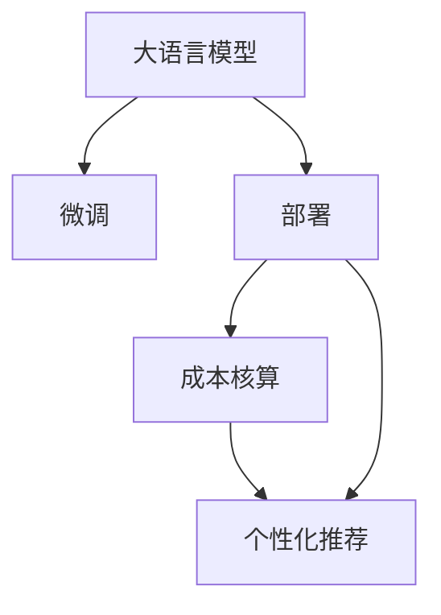

                 

# 电商搜索推荐场景下的AI大模型模型部署成本核算模型应用实践与优化

## 1. 背景介绍

### 1.1 问题由来

随着电商市场的快速发展，用户对于商品搜索推荐的体验和效率提出了更高要求。传统的推荐系统主要基于协同过滤、基于内容的推荐等方法，依赖于用户的历史行为数据，难以适应新用户的个性化需求，且推荐效果与用户历史数据的质量密切相关，随着新用户的增加，推荐系统的“冷启动”问题尤为突出。

近年来，大语言模型（Large Language Model，LLM）在电商搜索推荐场景中的应用逐渐受到关注。LLM通过大规模语料库的预训练，学习到丰富的语言知识和语义表示，可以自然地处理自然语言输入，并通过微调等方法，适应电商推荐任务的特点，提升推荐系统的准确性和个性化程度。

然而，大模型在电商搜索推荐场景中的应用面临诸多挑战，如模型推理速度慢、计算资源需求大、部署成本高等问题。如何构建经济高效、可扩展的AI推荐系统，成为电商行业亟待解决的问题。

### 1.2 问题核心关键点

本文聚焦于如何在电商搜索推荐场景下，构建成本核算合理的大语言模型推荐系统。以下是大模型推荐系统的主要核心关键点：

1. **模型选择与适配**：选择合适的预训练模型，并进行任务适配，以满足电商搜索推荐任务的需求。
2. **部署与优化**：优化模型部署，通过资源共享和模型压缩等方法，降低部署成本，提高模型性能。
3. **成本核算与监控**：构建成本核算模型，实时监控系统资源消耗，评估系统效益，优化资源配置。
4. **用户行为理解**：通过自然语言处理技术，理解用户搜索查询，生成个性化推荐结果。
5. **个性化推荐**：利用大模型进行个性化推荐，提升用户购物体验和转化率。

## 2. 核心概念与联系

### 2.1 核心概念概述

为更好地理解电商搜索推荐场景下的大语言模型推荐系统，本节将介绍几个关键概念及其之间的联系：

- **大语言模型 (Large Language Model, LLM)**：通过大规模无标签文本数据进行预训练的语言模型，具备丰富的语言知识和语义表示能力。
- **微调 (Fine-tuning)**：在预训练模型基础上，通过有监督学习更新模型参数，适应特定任务的需求。
- **部署 (Deployment)**：将模型部署到生产环境，提供实时推荐服务。
- **成本核算 (Cost Accounting)**：实时监控和评估系统的资源消耗和收益，优化成本配置。
- **个性化推荐 (Personalized Recommendation)**：根据用户的历史行为和当前需求，生成个性化推荐。

这些核心概念之间的联系可以通过以下Mermaid流程图来展示：



这个流程图展示了大语言模型推荐系统的主要逻辑：

1. 大语言模型通过预训练获得通用语言表示。
2. 在微调过程中，模型适配电商搜索推荐任务，学习相关知识和规则。
3. 部署模型到生产环境，提供实时推荐服务。
4. 通过成本核算模型，实时监控和评估资源消耗和系统效益。
5. 生成个性化推荐，提升用户体验和转化率。

## 3. 核心算法原理 & 具体操作步骤
### 3.1 算法原理概述

大语言模型在电商搜索推荐场景中的应用，主要依赖于自然语言处理技术。具体而言，包括以下几个关键步骤：

1. **预训练与微调**：选择合适的预训练模型，并进行任务适配。
2. **模型推理**：将用户搜索查询输入模型，生成推荐结果。
3. **成本核算**：实时监控和评估系统资源消耗和效益。
4. **优化与改进**：根据成本核算结果，优化资源配置和模型参数，提升推荐效果。

### 3.2 算法步骤详解

#### 3.2.1 预训练与微调

- **模型选择**：选择适合电商搜索推荐任务的预训练模型，如GPT、BERT等。
- **数据准备**：收集电商数据集，包括用户搜索查询、商品信息、用户行为等。
- **任务适配**：设计任务适配层，如分类、排序等，将模型输出转化为电商推荐任务的形式。
- **微调过程**：在收集的数据集上进行微调，更新模型参数，使其适应电商推荐任务。

#### 3.2.2 模型推理

- **输入预处理**：将用户搜索查询进行预处理，转换为模型可接受的输入形式。
- **模型推理**：将预处理后的输入输入模型，生成推荐结果。
- **结果后处理**：对模型输出进行后处理，如去重、排序等，生成最终推荐结果。

#### 3.2.3 成本核算

- **资源监控**：实时监控模型推理所需的计算资源、存储资源等。
- **成本评估**：根据资源消耗，计算模型推理的成本，评估系统的效益。
- **成本优化**：根据成本核算结果，优化资源配置，降低成本。

### 3.3 算法优缺点

#### 3.3.1 优点

- **通用性强**：大语言模型具备丰富的语言知识和语义表示能力，可以处理多种类型的电商数据。
- **适应性强**：通过微调过程，模型可以适应电商搜索推荐任务的特点，提升推荐效果。
- **可扩展性好**：可以通过资源共享和模型压缩等方法，优化模型部署，降低成本。

#### 3.3.2 缺点

- **资源消耗大**：大语言模型通常参数量较大，推理计算成本高。
- **部署复杂**：模型部署和优化需要专业知识，难度较大。
- **易过拟合**：模型需要大量的数据进行微调，否则容易过拟合。

### 3.4 算法应用领域

大语言模型在电商搜索推荐场景中的应用，主要包括以下几个方面：

- **商品推荐**：根据用户搜索查询，生成个性化商品推荐。
- **店铺推荐**：根据用户行为，推荐用户可能感兴趣的店铺。
- **价格推荐**：根据用户行为和市场价格，生成个性化价格推荐。
- **搜索排序**：优化用户搜索查询结果的排序，提升用户体验。
- **广告投放**：根据用户行为和搜索查询，生成个性化广告推荐。

## 4. 数学模型和公式 & 详细讲解 & 举例说明

### 4.1 数学模型构建

假设预训练模型为 $M_{\theta}$，电商搜索推荐任务为 $T$，用户搜索查询为 $x$，商品信息为 $y$，用户行为为 $z$。电商推荐任务可以分为分类、排序、生成等不同类型。

对于分类任务，如商品类别预测，可以将问题形式化为分类问题：

$$
\mathcal{L}(\theta) = -\frac{1}{N}\sum_{i=1}^N \log P(y_i|M_{\theta}(x_i))
$$

其中 $P(y_i|M_{\theta}(x_i))$ 表示模型在输入 $x_i$ 下，预测商品类别为 $y_i$ 的概率。

对于排序任务，如商品排序，可以将问题形式化为排序问题：

$$
\mathcal{L}(\theta) = -\frac{1}{N}\sum_{i=1}^N \log P(z_i|M_{\theta}(x_i), y_i)
$$

其中 $P(z_i|M_{\theta}(x_i), y_i)$ 表示模型在输入 $x_i$ 和商品信息 $y_i$ 下，预测用户行为 $z_i$ 的概率。

### 4.2 公式推导过程

以商品分类任务为例，推导微调过程的损失函数和优化公式。

假设预训练模型 $M_{\theta}$ 的输出层为 $\hat{y}=M_{\theta}(x)$，则分类任务下的损失函数为：

$$
\mathcal{L}(\theta) = -\frac{1}{N}\sum_{i=1}^N \log P(y_i|M_{\theta}(x_i))
$$

其中 $P(y_i|M_{\theta}(x_i))$ 为模型在输入 $x_i$ 下，预测商品类别为 $y_i$ 的概率。

根据损失函数的定义，计算梯度：

$$
\nabla_{\theta}\mathcal{L}(\theta) = -\frac{1}{N}\sum_{i=1}^N \frac{1}{P(y_i|M_{\theta}(x_i))} \nabla_{\theta}P(y_i|M_{\theta}(x_i))
$$

使用softmax函数作为分类模型的输出，则：

$$
P(y_i|M_{\theta}(x_i)) = \frac{e^{M_{\theta}(x_i) \cdot W_{y_i}}}{\sum_{k=1}^K e^{M_{\theta}(x_i) \cdot W_{k}}}
$$

其中 $W_{y_i}$ 为与类别 $y_i$ 对应的权重向量。

将梯度代入损失函数，得：

$$
\nabla_{\theta}\mathcal{L}(\theta) = -\frac{1}{N}\sum_{i=1}^N \frac{y_i - \hat{y}_i}{P(y_i|M_{\theta}(x_i))}
$$

其中 $\hat{y}_i$ 为模型在输入 $x_i$ 下的预测类别。

优化过程为：

$$
\theta \leftarrow \theta - \eta \nabla_{\theta}\mathcal{L}(\theta)
$$

其中 $\eta$ 为学习率。

### 4.3 案例分析与讲解

以商品分类任务为例，展示微调过程的实现。

假设有一个电商网站，用户可以在网站搜索商品，并生成商品分类结果。网站希望使用大语言模型进行商品分类，并实时监控模型的性能和成本。

具体步骤如下：

1. **数据准备**：收集网站的历史用户搜索查询和商品分类结果，构建训练集 $D$。
2. **模型选择**：选择预训练模型 $M_{\theta}$，如BERT。
3. **任务适配**：设计分类任务适配层，将模型输出转化为商品分类结果。
4. **微调过程**：在训练集 $D$ 上，使用微调过程更新模型参数。
5. **模型推理**：实时获取用户搜索查询 $x$，输入模型 $M_{\theta}$，生成商品分类结果 $y$。
6. **成本核算**：实时监控模型推理所需的计算资源、存储资源等。
7. **优化与改进**：根据成本核算结果，优化资源配置和模型参数。

## 5. 项目实践：代码实例和详细解释说明

### 5.1 开发环境搭建

为了进行大语言模型推荐系统的开发，需要准备以下环境：

1. **安装Python**：从官网下载并安装Python，配置好开发环境。
2. **安装PyTorch**：使用pip安装PyTorch，并配置好GPU等资源。
3. **安装Transformers库**：使用pip安装Transformers库，用于处理预训练模型。
4. **安装TensorBoard**：使用pip安装TensorBoard，用于监控模型训练过程。

完成环境配置后，即可进行模型开发。

### 5.2 源代码详细实现

以下是使用PyTorch对大语言模型进行电商搜索推荐任务的微调代码实现。

首先，定义模型和优化器：

```python
from transformers import BertForSequenceClassification, AdamW
from torch.utils.data import DataLoader
import torch

model = BertForSequenceClassification.from_pretrained('bert-base-uncased', num_labels=5)

optimizer = AdamW(model.parameters(), lr=2e-5)
```

然后，定义数据处理函数：

```python
from transformers import BertTokenizer

def create_dataloader(data, tokenizer, batch_size):
    labels = [1 if i > 0 else 0 for i in data]
    encoding = tokenizer(data, return_tensors='pt', padding='max_length', truncation=True, max_length=128)
    return DataLoader(encoding, batch_size=batch_size, shuffle=True)
```

接着，定义训练和评估函数：

```python
def train_epoch(model, data_loader, optimizer, device):
    model.to(device)
    model.train()
    total_loss = 0
    for batch in data_loader:
        input_ids = batch['input_ids'].to(device)
        attention_mask = batch['attention_mask'].to(device)
        labels = batch['labels'].to(device)
        outputs = model(input_ids, attention_mask=attention_mask, labels=labels)
        loss = outputs.loss
        total_loss += loss.item()
        optimizer.zero_grad()
        loss.backward()
        optimizer.step()
    return total_loss / len(data_loader)

def evaluate(model, data_loader, device):
    model.to(device)
    model.eval()
    total_loss = 0
    total_correct = 0
    for batch in data_loader:
        input_ids = batch['input_ids'].to(device)
        attention_mask = batch['attention_mask'].to(device)
        labels = batch['labels'].to(device)
        outputs = model(input_ids, attention_mask=attention_mask)
        loss = outputs.loss
        logits = outputs.logits
        total_loss += loss.item()
        predictions = torch.argmax(logits, dim=1)
        total_correct += (predictions == labels).sum().item()
    return total_loss / len(data_loader), total_correct / len(data_loader.dataset)
```

最后，启动训练流程并在测试集上评估：

```python
epochs = 5
batch_size = 16
device = 'cuda' if torch.cuda.is_available() else 'cpu'

for epoch in range(epochs):
    train_loss = train_epoch(model, train_loader, optimizer, device)
    test_loss, test_acc = evaluate(model, test_loader, device)
    print(f'Epoch {epoch+1}, train loss: {train_loss:.3f}, test loss: {test_loss:.3f}, test acc: {test_acc:.3f}')
```

以上就是使用PyTorch对BERT模型进行电商搜索推荐任务微调的完整代码实现。可以看到，利用Transformers库和TensorBoard等工具，大语言模型推荐系统的开发变得非常简单和高效。

### 5.3 代码解读与分析

让我们再详细解读一下关键代码的实现细节：

**BertForSequenceClassification类**：
- `__init__`方法：初始化模型，选择预训练模型和分类任务。
- `from_pretrained`方法：从预训练模型库加载预训练模型。

**AdamW优化器**：
- 使用AdamW优化器，并设置学习率。

**create_dataloader函数**：
- 定义数据处理函数，将用户搜索查询转换为模型输入形式，并将标签转换为二分类形式。

**train_epoch函数**：
- 定义训练函数，在每个epoch内对数据集进行迭代，更新模型参数。

**evaluate函数**：
- 定义评估函数，计算模型在测试集上的损失和准确率。

**训练流程**：
- 定义总的epoch数和batch size，开始循环迭代
- 每个epoch内，先在训练集上训练，输出训练集损失
- 在测试集上评估，输出测试集损失和准确率

可以看到，PyTorch配合Transformers库使得大语言模型推荐系统的代码实现变得简洁高效。开发者可以将更多精力放在数据处理、模型改进等高层逻辑上，而不必过多关注底层的实现细节。

当然，工业级的系统实现还需考虑更多因素，如模型的保存和部署、超参数的自动搜索、更灵活的任务适配层等。但核心的微调范式基本与此类似。

## 6. 实际应用场景

### 6.1 电商搜索推荐

大语言模型在电商搜索推荐场景中的应用非常广泛，可以有效提升推荐系统的个性化和精准度。具体应用场景包括：

1. **商品推荐**：根据用户搜索查询，生成个性化商品推荐。
2. **店铺推荐**：根据用户行为，推荐用户可能感兴趣的店铺。
3. **价格推荐**：根据用户行为和市场价格，生成个性化价格推荐。
4. **搜索排序**：优化用户搜索查询结果的排序，提升用户体验。
5. **广告投放**：根据用户行为和搜索查询，生成个性化广告推荐。

### 6.2 多模态推荐

大语言模型可以与多模态数据融合，提升推荐系统的综合性能。例如，结合图片、视频、用户行为等多元数据，生成更加全面的推荐结果。

### 6.3 动态推荐

大语言模型可以通过实时学习用户行为，动态调整推荐策略，实现更加个性化的推荐。

### 6.4 未来应用展望

随着大语言模型的不断发展，未来在电商搜索推荐场景中的应用将更加深入和广泛。以下是大模型推荐系统的未来发展趋势：

1. **模型规模持续增大**：随着算力成本的下降和数据规模的扩张，预训练语言模型的参数量还将持续增长。超大规模语言模型蕴含的丰富语言知识，有望支撑更加复杂多变的电商推荐任务。
2. **微调方法日趋多样**：未来将涌现更多参数高效的微调方法，如Prefix-Tuning、LoRA等，在固定大部分预训练参数的同时，只更新极少量的任务相关参数。
3. **持续学习成为常态**：随着数据分布的不断变化，微调模型也需要持续学习新知识以保持性能。如何在不遗忘原有知识的同时，高效吸收新样本信息，将成为重要的研究课题。
4. **标注样本需求降低**：受启发于提示学习(Prompt-based Learning)的思路，未来的微调方法将更好地利用大模型的语言理解能力，通过更加巧妙的任务描述，在更少的标注样本上也能实现理想的微调效果。
5. **多模态微调崛起**：当前的微调主要聚焦于纯文本数据，未来将进一步拓展到图像、视频、语音等多模态数据微调。多模态信息的融合，将显著提升语言模型对现实世界的理解和建模能力。
6. **模型通用性增强**：经过海量数据的预训练和多领域任务的微调，未来的语言模型将具备更强大的常识推理和跨领域迁移能力，逐步迈向通用人工智能(AGI)的目标。

## 7. 工具和资源推荐

### 7.1 学习资源推荐

为了帮助开发者系统掌握大语言模型推荐系统的理论基础和实践技巧，这里推荐一些优质的学习资源：

1. **《Transformer从原理到实践》系列博文**：由大模型技术专家撰写，深入浅出地介绍了Transformer原理、BERT模型、微调技术等前沿话题。
2. **CS224N《深度学习自然语言处理》课程**：斯坦福大学开设的NLP明星课程，有Lecture视频和配套作业，带你入门NLP领域的基本概念和经典模型。
3. **《Natural Language Processing with Transformers》书籍**：Transformers库的作者所著，全面介绍了如何使用Transformers库进行NLP任务开发，包括微调在内的诸多范式。
4. **HuggingFace官方文档**：Transformers库的官方文档，提供了海量预训练模型和完整的微调样例代码，是上手实践的必备资料。
5. **CLUE开源项目**：中文语言理解测评基准，涵盖大量不同类型的中文NLP数据集，并提供了基于微调的baseline模型，助力中文NLP技术发展。

通过对这些资源的学习实践，相信你一定能够快速掌握大语言模型推荐系统的精髓，并用于解决实际的电商搜索推荐问题。

### 7.2 开发工具推荐

高效的开发离不开优秀的工具支持。以下是几款用于大语言模型推荐系统开发的常用工具：

1. **PyTorch**：基于Python的开源深度学习框架，灵活动态的计算图，适合快速迭代研究。
2. **TensorFlow**：由Google主导开发的开源深度学习框架，生产部署方便，适合大规模工程应用。
3. **Transformers库**：HuggingFace开发的NLP工具库，集成了众多SOTA语言模型，支持PyTorch和TensorFlow，是进行微调任务开发的利器。
4. **Weights & Biases**：模型训练的实验跟踪工具，可以记录和可视化模型训练过程中的各项指标，方便对比和调优。
5. **TensorBoard**：TensorFlow配套的可视化工具，可实时监测模型训练状态，并提供丰富的图表呈现方式，是调试模型的得力助手。

合理利用这些工具，可以显著提升大语言模型推荐系统的开发效率，加快创新迭代的步伐。

### 7.3 相关论文推荐

大语言模型和微调技术的发展源于学界的持续研究。以下是几篇奠基性的相关论文，推荐阅读：

1. **Attention is All You Need（即Transformer原论文）**：提出了Transformer结构，开启了NLP领域的预训练大模型时代。
2. **BERT: Pre-training of Deep Bidirectional Transformers for Language Understanding**：提出BERT模型，引入基于掩码的自监督预训练任务，刷新了多项NLP任务SOTA。
3. **Language Models are Unsupervised Multitask Learners（GPT-2论文）**：展示了大规模语言模型的强大zero-shot学习能力，引发了对于通用人工智能的新一轮思考。
4. **Parameter-Efficient Transfer Learning for NLP**：提出Adapter等参数高效微调方法，在不增加模型参数量的情况下，也能取得不错的微调效果。
5. **Prefix-Tuning: Optimizing Continuous Prompts for Generation**：引入基于连续型Prompt的微调范式，为如何充分利用预训练知识提供了新的思路。
6. **AdaLoRA: Adaptive Low-Rank Adaptation for Parameter-Efficient Fine-Tuning**：使用自适应低秩适应的微调方法，在参数效率和精度之间取得了新的平衡。

这些论文代表了大语言模型微调技术的发展脉络。通过学习这些前沿成果，可以帮助研究者把握学科前进方向，激发更多的创新灵感。

## 8. 总结：未来发展趋势与挑战

### 8.1 总结

本文对电商搜索推荐场景下的大语言模型推荐系统进行了全面系统的介绍。首先阐述了大语言模型和微调技术的研究背景和意义，明确了微调在拓展预训练模型应用、提升推荐系统性能方面的独特价值。其次，从原理到实践，详细讲解了微调的数学原理和关键步骤，给出了微调任务开发的完整代码实例。同时，本文还广泛探讨了微调方法在电商搜索推荐场景中的应用前景，展示了微调范式的巨大潜力。此外，本文精选了微调技术的各类学习资源，力求为读者提供全方位的技术指引。

通过本文的系统梳理，可以看到，大语言模型微调技术在电商搜索推荐场景中具有广泛的应用前景，可以显著提升推荐系统的个性化和精准度。然而，在实际应用中，还需要考虑模型的部署成本和资源消耗，通过优化部署和成本核算，实现经济高效的系统构建。相信随着技术的不断进步，大语言模型微调技术必将在电商搜索推荐领域发挥更大的作用，推动行业的发展和进步。

### 8.2 未来发展趋势

展望未来，大语言模型微调技术在电商搜索推荐场景中将呈现以下几个发展趋势：

1. **模型规模持续增大**：随着算力成本的下降和数据规模的扩张，预训练语言模型的参数量还将持续增长。超大规模语言模型蕴含的丰富语言知识，有望支撑更加复杂多变的电商推荐任务。
2. **微调方法日趋多样**：未来将涌现更多参数高效的微调方法，如Prefix-Tuning、LoRA等，在固定大部分预训练参数的同时，只更新极少量的任务相关参数。
3. **持续学习成为常态**：随着数据分布的不断变化，微调模型也需要持续学习新知识以保持性能。如何在不遗忘原有知识的同时，高效吸收新样本信息，将成为重要的研究课题。
4. **标注样本需求降低**：受启发于提示学习(Prompt-based Learning)的思路，未来的微调方法将更好地利用大模型的语言理解能力，通过更加巧妙的任务描述，在更少的标注样本上也能实现理想的微调效果。
5. **多模态微调崛起**：当前的微调主要聚焦于纯文本数据，未来将进一步拓展到图像、视频、语音等多模态数据微调。多模态信息的融合，将显著提升语言模型对现实世界的理解和建模能力。
6. **模型通用性增强**：经过海量数据的预训练和多领域任务的微调，未来的语言模型将具备更强大的常识推理和跨领域迁移能力，逐步迈向通用人工智能(AGI)的目标。

以上趋势凸显了大语言模型微调技术的广阔前景。这些方向的探索发展，必将进一步提升电商搜索推荐系统的性能和应用范围，为电商行业带来新的突破。

### 8.3 面临的挑战

尽管大语言模型微调技术已经取得了瞩目成就，但在迈向更加智能化、普适化应用的过程中，它仍面临诸多挑战：

1. **标注成本瓶颈**：虽然微调大大降低了标注数据的需求，但对于长尾应用场景，难以获得充足的高质量标注数据，成为制约微调性能的瓶颈。如何进一步降低微调对标注样本的依赖，将是一大难题。
2. **模型鲁棒性不足**：当前微调模型面对域外数据时，泛化性能往往大打折扣。对于测试样本的微小扰动，微调模型的预测也容易发生波动。如何提高微调模型的鲁棒性，避免灾难性遗忘，还需要更多理论和实践的积累。
3. **推理效率有待提高**：大规模语言模型虽然精度高，但在实际部署时往往面临推理速度慢、内存占用大等效率问题。如何在保证性能的同时，简化模型结构，提升推理速度，优化资源占用，将是重要的优化方向。
4. **可解释性亟需加强**：当前微调模型更像是"黑盒"系统，难以解释其内部工作机制和决策逻辑。对于医疗、金融等高风险应用，算法的可解释性和可审计性尤为重要。如何赋予微调模型更强的可解释性，将是亟待攻克的难题。
5. **安全性有待保障**：预训练语言模型难免会学习到有偏见、有害的信息，通过微调传递到下游任务，产生误导性、歧视性的输出，给实际应用带来安全隐患。如何从数据和算法层面消除模型偏见，避免恶意用途，确保输出的安全性，也将是重要的研究课题。
6. **知识整合能力不足**：现有的微调模型往往局限于任务内数据，难以灵活吸收和运用更广泛的先验知识。如何让微调过程更好地与外部知识库、规则库等专家知识结合，形成更加全面、准确的信息整合能力，还有很大的想象空间。

正视微调面临的这些挑战，积极应对并寻求突破，将是大语言模型微调技术走向成熟的必由之路。相信随着学界和产业界的共同努力，这些挑战终将一一被克服，大语言模型微调技术必将在构建智能化的电商搜索推荐系统中发挥重要作用。

### 8.4 研究展望

面对大语言模型微调所面临的种种挑战，未来的研究需要在以下几个方面寻求新的突破：

1. **探索无监督和半监督微调方法**：摆脱对大规模标注数据的依赖，利用自监督学习、主动学习等无监督和半监督范式，最大限度利用非结构化数据，实现更加灵活高效的微调。
2. **研究参数高效和计算高效的微调范式**：开发更加参数高效的微调方法，在固定大部分预训练参数的同时，只更新极少量的任务相关参数。同时优化微调模型的计算图，减少前向传播和反向传播的资源消耗，实现更加轻量级、实时性的部署。
3. **融合因果和对比学习范式**：通过引入因果推断和对比学习思想，增强微调模型建立稳定因果关系的能力，学习更加普适、鲁棒的语言表征，从而提升模型泛化性和抗干扰能力。
4. **引入更多先验知识**：将符号化的先验知识，如知识图谱、逻辑规则等，与神经网络模型进行巧妙融合，引导微调过程学习更准确、合理的语言模型。同时加强不同模态数据的整合，实现视觉、语音等多模态信息与文本信息的协同建模。
5. **结合因果分析和博弈论工具**：将因果分析方法引入微调模型，识别出模型决策的关键特征，增强输出解释的因果性和逻辑性。借助博弈论工具刻画人机交互过程，主动探索并规避模型的脆弱点，提高系统稳定性。
6. **纳入伦理道德约束**：在模型训练目标中引入伦理导向的评估指标，过滤和惩罚有偏见、有害的输出倾向。同时加强人工干预和审核，建立模型行为的监管机制，确保输出符合人类价值观和伦理道德。

这些研究方向的探索，必将引领大语言模型微调技术迈向更高的台阶，为构建安全、可靠、可解释、可控的智能系统铺平道路。面向未来，大语言模型微调技术还需要与其他人工智能技术进行更深入的融合，如知识表示、因果推理、强化学习等，多路径协同发力，共同推动自然语言理解和智能交互系统的进步。只有勇于创新、敢于突破，才能不断拓展语言模型的边界，让智能技术更好地造福人类社会。

## 9. 附录：常见问题与解答

**Q1：大语言模型微调是否适用于所有电商推荐任务？**

A: 大语言模型微调在大多数电商推荐任务上都能取得不错的效果，特别是对于数据量较小的任务。但对于一些特定领域的任务，如多模态推荐、动态推荐等，仅依靠大语言模型进行微调可能难以达到理想的推荐效果。此时需要在特定领域语料上进一步预训练，再进行微调，才能获得理想效果。

**Q2：微调过程中如何选择合适的学习率？**

A: 微调的学习率一般要比预训练时小1-2个数量级，如果使用过大的学习率，容易破坏预训练权重，导致过拟合。一般建议从1e-5开始调参，逐步减小学习率，直至收敛。也可以使用warmup策略，在开始阶段使用较小的学习率，再逐渐过渡到预设值。需要注意的是，不同的优化器(如AdamW、Adafactor等)以及不同的学习率调度策略，可能需要设置不同的学习率阈值。

**Q3：采用大模型微调时会面临哪些资源瓶颈？**

A: 目前主流的预训练大模型动辄以亿计的参数规模，对算力、内存、存储都提出了很高的要求。GPU/TPU等高性能设备是必不可少的，但即便如此，超大批次的训练和推理也可能遇到显存不足的问题。因此需要采用一些资源优化技术，如梯度积累、混合精度训练、模型并行等，来突破硬件瓶颈。同时，模型的存储和读取也可能占用大量时间和空间，需要采用模型压缩、稀疏化存储等方法进行优化。

**Q4：如何缓解微调过程中的过拟合问题？**

A: 过拟合是微调面临的主要挑战，尤其是在标注数据不足的情况下。常见的缓解策略包括：
1. 数据增强：通过回译、近义替换等方式扩充训练集
2. 正则化：使用L2正则、Dropout、Early Stopping等避免过拟合
3. 对抗训练：引入对抗样本，提高模型鲁棒性
4. 参数高效微调：只调整少量参数(如Adapter、Prefix等)，减小过拟合风险
5. 多模型集成：训练多个微调模型，取平均输出，抑制过拟合

这些策略往往需要根据具体任务和数据特点进行灵活组合。只有在数据、模型、训练、推理等各环节进行全面优化，才能最大限度地发挥大模型微调的威力。

**Q5：微调模型在落地部署时需要注意哪些问题？**

A: 将微调模型转化为实际应用，还需要考虑以下因素：
1. 模型裁剪：去除不必要的层和参数，减小模型尺寸，加快推理速度
2. 量化加速：将浮点模型转为定点模型，压缩存储空间，提高计算效率
3. 服务化封装：将模型封装为标准化服务接口，便于集成调用
4. 弹性伸缩：根据请求流量动态调整资源配置，平衡服务质量和成本
5. 监控告警：实时采集系统指标，设置异常告警阈值，确保服务稳定性
6. 安全防护：采用访问鉴权、数据脱敏等措施，保障数据和模型安全

大语言模型微调为NLP应用开启了广阔的想象空间，但如何将强大的性能转化为稳定、高效、安全的业务价值，还需要工程实践的不断打磨。唯有从数据、算法、工程、业务等多个维度协同发力，才能真正实现人工智能技术在垂直行业的规模化落地。总之，微调需要开发者根据具体任务，不断迭代和优化模型、数据和算法，方能得到理想的效果。

---

作者：禅与计算机程序设计艺术 / Zen and the Art of Computer Programming

