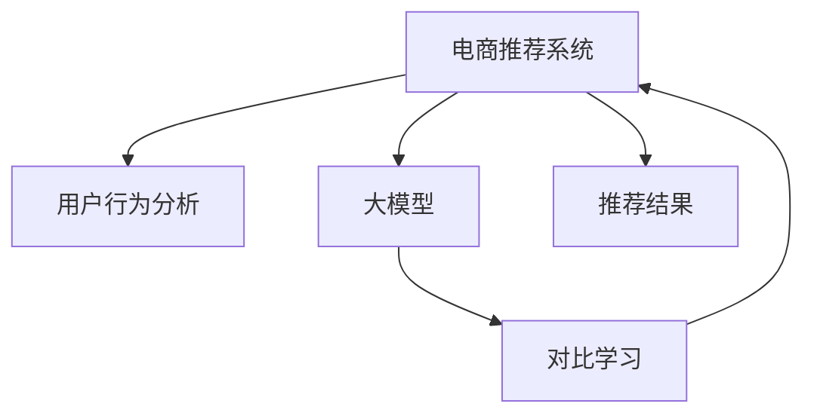

                 

# 电商行业中的对比学习：大模型的实践与挑战

> 关键词：对比学习,电商,大模型,推荐系统,个性化推荐,用户行为分析

## 1. 背景介绍

在电商行业中，推荐系统是一个至关重要的组成部分，其核心目标是帮助用户发现感兴趣的商品，提升购物体验，同时也为商家带来了可观的销售收益。随着电商数据的爆发性增长，传统基于规则、协同过滤的推荐算法面临数据稀疏性、泛化能力差等挑战，难以满足用户多样化的需求。而近年来，基于大模型的推荐算法，尤其是采用对比学习的方法，因其出色的泛化能力和高效性，逐步在电商推荐领域展现出巨大潜力。

### 1.1 问题由来

传统推荐算法主要依赖用户行为数据进行推荐，如浏览历史、购买记录、评分等。这些数据往往存在数据稀疏、动态性强的特点，导致推荐系统难以覆盖长尾商品，同时模型的冷启动问题也较严重。此外，协同过滤方法容易出现"协同过滤冷落"现象，即用户历史行为相似的推荐结果集聚，导致多样性不足。

为了解决这些问题，研究人员开始探索采用深度学习技术，特别是基于大模型的推荐算法。这类算法通过自监督学习任务预训练模型，学习到通用的用户和商品表示，然后利用微调方法适应具体电商场景，生成个性化的推荐结果。其中，对比学习(Contrastive Learning)因其简单高效，逐渐成为研究热点。

### 1.2 问题核心关键点

对比学习是一种无需标注数据的自监督学习方法，它通过最大化相似样本和负样本之间的差异，自动学习数据隐含的表示关系。具体到电商推荐系统，对比学习通常通过构建正负样本对，利用相似用户-商品对和不同用户-商品对的相对距离来优化模型。这种方法具有以下特点：
1. 无需标注数据，适用于数据稀疏的电商场景。
2. 能够捕捉用户商品之间的复杂关系，提升推荐准确性。
3. 可以处理用户行为数据的时序性和动态性。
4. 学习得到的表示具有较好的泛化能力，适用于多种推荐任务。

## 2. 核心概念与联系

### 2.1 核心概念概述

为更好地理解对比学习在电商推荐中的应用，我们首先介绍几个关键概念：

- 电商推荐系统：通过分析用户历史行为数据，推荐系统为用户生成个性化商品列表。推荐系统是电商企业的重要工具，其效果直接关系到用户购物体验和商家销售收益。
- 对比学习(Contrastive Learning)：一种无需标注数据的自监督学习方法，通过最大化相似样本和负样本之间的差异，学习数据隐含的表示关系。对比学习广泛应用于图像、文本、音频等多个领域。
- 大模型：以Transformer模型为代表的大规模预训练模型，如BERT、GPT等。大模型通过在海量无标签数据上进行预训练，学习到丰富的语言或图像知识，在特定任务上微调后能够获得优异的性能。
- 用户行为分析：通过分析用户的点击、浏览、购买等行为数据，理解用户兴趣和需求，用于生成个性化的推荐结果。

这些核心概念之间的逻辑关系可以通过以下Mermaid流程图来展示：



这个流程图展示了电商推荐系统的核心组件及其相互作用：

1. 电商推荐系统通过用户行为分析，生成个性化商品列表。
2. 大模型通过预训练学习通用用户和商品表示，用于提升推荐系统的性能。
3. 对比学习在大模型的基础上，进一步优化模型的表示能力。
4. 最终生成的推荐结果，满足用户个性化需求，提升电商系统的销售效果。

## 3. 核心算法原理 & 具体操作步骤
### 3.1 算法原理概述

对比学习在电商推荐系统中的核心思想是，通过最大化相似样本和负样本之间的差异，自动学习用户商品之间的隐含关系。具体来说，假设用户-商品对为 $(x_u,y_u)$，其中 $x_u$ 为用户的点击记录，$y_u$ 为用户购买记录。则一个正样本对为 $(u_i, p_i)$，其中 $u_i$ 为特定用户 $u_i$，$p_i$ 为用户 $u_i$ 的点击记录 $x_i$ 中的商品 $p_i$。负样本对为 $(u_j, q_j)$，其中 $u_j$ 为任意其他用户 $u_j$，$q_j$ 为用户 $u_j$ 的点击记录 $x_j$ 中的任意商品 $q_j$，且 $p_i$ 和 $q_j$ 不是同一商品。

对比学习的目标函数可以表示为：

$$
\mathcal{L} = \frac{1}{N}\sum_{i=1}^N [f(x_u, y_u, x_i, y_i)^2 - f(x_u, y_u, x_j, y_j)^2]
$$

其中 $f$ 为相似度函数，如余弦相似度或欧式距离。目标函数旨在最大化正样本对之间的相似度，同时最小化负样本对的相似度。

### 3.2 算法步骤详解

基于对比学习的电商推荐系统可以分为以下几个关键步骤：

**Step 1: 构建正负样本对**
- 收集用户点击记录 $x_u$，并将其中商品 $y_u$ 作为正样本。
- 将用户点击记录 $x_u$ 与任意其他用户点击记录 $x_j$ 中的商品 $q_j$ 配对，构建负样本对。

**Step 2: 预训练大模型**
- 选择预训练大模型（如BERT、GPT等），并对其进行微调，使其能够生成用户和商品的表示。

**Step 3: 设计相似度函数**
- 根据任务特点，选择合适的相似度函数（如余弦相似度、欧式距离等），用于计算用户和商品之间的相似度。

**Step 4: 训练对比学习模型**
- 定义对比学习损失函数，并使用梯度下降等优化算法进行训练。
- 不断调整相似度函数和损失函数的超参数，直到模型收敛。

**Step 5: 生成推荐结果**
- 将新用户输入模型，生成其感兴趣的商品表示。
- 根据用户历史行为数据，计算与用户最相似的商品，生成个性化推荐结果。

### 3.3 算法优缺点

对比学习在电商推荐系统中的优缺点如下：

**优点**
1. 无需标注数据，适用于数据稀疏的电商场景。
2. 能够捕捉用户商品之间的复杂关系，提升推荐准确性。
3. 可以处理用户行为数据的时序性和动态性。
4. 学习得到的表示具有较好的泛化能力，适用于多种推荐任务。

**缺点**
1. 模型复杂度高，训练和推理速度较慢。
2. 相似度函数的选择可能影响推荐效果，需要精心设计。
3. 负样本的构建可能存在噪声，影响模型的泛化能力。
4. 大模型的预训练和微调过程较为耗时，对计算资源要求高。

### 3.4 算法应用领域

对比学习在电商推荐系统中的应用已较为成熟，适用于多种推荐任务，包括但不限于：

- 个性化推荐：根据用户历史行为数据，生成个性化商品列表。
- 推荐排序：根据商品之间的相似度，对商品进行排序推荐。
- 实时推荐：实时分析用户行为数据，动态生成推荐结果。
- 多模态推荐：将文本、图像、视频等多模态数据融合，提升推荐效果。
- 交叉推荐：根据用户行为数据，推荐与其兴趣相似的其他用户可能喜欢的商品。

## 4. 数学模型和公式 & 详细讲解  
### 4.1 数学模型构建

假设用户 $u_i$ 的点击记录为 $x_i$，购买记录为 $y_i$。则电商推荐系统中的对比学习模型可以表示为：

$$
f(x_u, y_u, x_i, y_i) = \langle W_u \cdot x_i + b_u, W_y \cdot y_i + b_y \rangle
$$

其中 $W_u, b_u$ 为用户的表示参数，$W_y, b_y$ 为商品的表示参数。

对比学习的损失函数为：

$$
\mathcal{L} = \frac{1}{N}\sum_{i=1}^N [f(x_u, y_u, x_i, y_i)^2 - f(x_u, y_u, x_j, y_j)^2]
$$

### 4.2 公式推导过程

对比学习的损失函数推导如下：

$$
\begin{aligned}
\mathcal{L} &= \frac{1}{N}\sum_{i=1}^N [f(x_u, y_u, x_i, y_i)^2 - f(x_u, y_u, x_j, y_j)^2] \\
&= \frac{1}{N}\sum_{i=1}^N [(W_u \cdot x_i + b_u)^T(W_y \cdot y_i + b_y) - (W_u \cdot x_j + b_u)^T(W_y \cdot y_j + b_y)]^2
\end{aligned}
$$

该损失函数的目标是最大化相似样本对之间的相似度，同时最小化负样本对的相似度。通过不断优化模型的参数，使模型能够更好地捕捉用户和商品之间的隐含关系。

### 4.3 案例分析与讲解

以下是一个简单的案例分析，以帮助读者更好地理解对比学习在电商推荐系统中的应用。

假设某电商平台上的用户 $u_i$ 最近浏览了两个商品 $p_i$ 和 $q_i$，且 $p_i$ 和 $q_i$ 是两个不同的商品。模型的目标是通过最大化 $p_i$ 和 $q_i$ 的相似度，最小化任意其他商品 $q_j$ 的相似度，训练出一个能够预测用户购买意向的模型。

具体步骤为：
1. 将用户 $u_i$ 的点击记录 $x_i$ 和购买记录 $y_i$ 输入模型，得到用户 $u_i$ 和商品 $p_i$ 的表示。
2. 将任意其他用户 $u_j$ 的点击记录 $x_j$ 中的商品 $q_j$ 输入模型，得到用户 $u_j$ 和商品 $q_j$ 的表示。
3. 计算用户 $u_i$ 和商品 $p_i$ 的相似度，计算用户 $u_j$ 和商品 $q_j$ 的相似度。
4. 计算相似度差的平方，并加入损失函数中，不断更新模型参数。
5. 重复以上步骤，直到模型收敛。

通过对比学习，模型能够自动学习用户和商品之间的隐含关系，提升推荐系统的准确性和个性化水平。

## 5. 项目实践：代码实例和详细解释说明
### 5.1 开发环境搭建

在进行电商推荐系统开发前，我们需要准备好开发环境。以下是使用Python进行PyTorch开发的环境配置流程：

1. 安装Anaconda：从官网下载并安装Anaconda，用于创建独立的Python环境。

2. 创建并激活虚拟环境：
```bash
conda create -n recsys-env python=3.8 
conda activate recsys-env
```

3. 安装PyTorch：根据CUDA版本，从官网获取对应的安装命令。例如：
```bash
conda install pytorch torchvision torchaudio cudatoolkit=11.1 -c pytorch -c conda-forge
```

4. 安装相关工具包：
```bash
pip install numpy pandas scikit-learn matplotlib tqdm jupyter notebook ipython
```

完成上述步骤后，即可在`recsys-env`环境中开始推荐系统开发。

### 5.2 源代码详细实现

下面我们以一个简单的电商推荐系统为例，给出使用Transformers库对BERT模型进行对比学习训练的PyTorch代码实现。

首先，定义电商推荐系统的数据处理函数：

```python
from transformers import BertTokenizer
from torch.utils.data import Dataset
import torch

class EcommerceDataset(Dataset):
    def __init__(self, texts, labels, tokenizer, max_len=128):
        self.texts = texts
        self.labels = labels
        self.tokenizer = tokenizer
        self.max_len = max_len
        
    def __len__(self):
        return len(self.texts)
    
    def __getitem__(self, item):
        text = self.texts[item]
        label = self.labels[item]
        
        encoding = self.tokenizer(text, return_tensors='pt', max_length=self.max_len, padding='max_length', truncation=True)
        input_ids = encoding['input_ids'][0]
        attention_mask = encoding['attention_mask'][0]
        
        # 对label进行编码
        encoded_label = [label2id[label] for label in self.labels] 
        encoded_label.extend([label2id['O']] * (self.max_len - len(encoded_label)))
        labels = torch.tensor(encoded_label, dtype=torch.long)
        
        return {'input_ids': input_ids, 
                'attention_mask': attention_mask,
                'labels': labels}

# 标签与id的映射
label2id = {'O': 0, 'Purchased': 1}
id2label = {v: k for k, v in label2id.items()}

# 创建dataset
tokenizer = BertTokenizer.from_pretrained('bert-base-cased')

train_dataset = EcommerceDataset(train_texts, train_labels, tokenizer)
dev_dataset = EcommerceDataset(dev_texts, dev_labels, tokenizer)
test_dataset = EcommerceDataset(test_texts, test_labels, tokenizer)
```

然后，定义模型和优化器：

```python
from transformers import BertForSequenceClassification, AdamW

model = BertForSequenceClassification.from_pretrained('bert-base-cased', num_labels=len(label2id))

optimizer = AdamW(model.parameters(), lr=2e-5)
```

接着，定义训练和评估函数：

```python
from torch.utils.data import DataLoader
from tqdm import tqdm
from sklearn.metrics import classification_report

device = torch.device('cuda') if torch.cuda.is_available() else torch.device('cpu')
model.to(device)

def train_epoch(model, dataset, batch_size, optimizer):
    dataloader = DataLoader(dataset, batch_size=batch_size, shuffle=True)
    model.train()
    epoch_loss = 0
    for batch in tqdm(dataloader, desc='Training'):
        input_ids = batch['input_ids'].to(device)
        attention_mask = batch['attention_mask'].to(device)
        labels = batch['labels'].to(device)
        model.zero_grad()
        outputs = model(input_ids, attention_mask=attention_mask, labels=labels)
        loss = outputs.loss
        epoch_loss += loss.item()
        loss.backward()
        optimizer.step()
    return epoch_loss / len(dataloader)

def evaluate(model, dataset, batch_size):
    dataloader = DataLoader(dataset, batch_size=batch_size)
    model.eval()
    preds, labels = [], []
    with torch.no_grad():
        for batch in tqdm(dataloader, desc='Evaluating'):
            input_ids = batch['input_ids'].to(device)
            attention_mask = batch['attention_mask'].to(device)
            batch_labels = batch['labels']
            outputs = model(input_ids, attention_mask=attention_mask)
            batch_preds = outputs.logits.argmax(dim=2).to('cpu').tolist()
            batch_labels = batch_labels.to('cpu').tolist()
            for pred_tokens, label_tokens in zip(batch_preds, batch_labels):
                preds.append(pred_tokens[:len(label_tokens)])
                labels.append(label_tokens)
                
    print(classification_report(labels, preds))
```

最后，启动训练流程并在测试集上评估：

```python
epochs = 5
batch_size = 16

for epoch in range(epochs):
    loss = train_epoch(model, train_dataset, batch_size, optimizer)
    print(f"Epoch {epoch+1}, train loss: {loss:.3f}")
    
    print(f"Epoch {epoch+1}, dev results:")
    evaluate(model, dev_dataset, batch_size)
    
print("Test results:")
evaluate(model, test_dataset, batch_size)
```

以上就是使用PyTorch对BERT进行电商推荐系统训练的完整代码实现。可以看到，得益于Transformers库的强大封装，我们可以用相对简洁的代码完成BERT模型的加载和训练。

### 5.3 代码解读与分析

让我们再详细解读一下关键代码的实现细节：

**EcommerceDataset类**：
- `__init__`方法：初始化文本、标签、分词器等关键组件。
- `__len__`方法：返回数据集的样本数量。
- `__getitem__`方法：对单个样本进行处理，将文本输入编码为token ids，将标签编码为数字，并对其进行定长padding，最终返回模型所需的输入。

**label2id和id2label字典**：
- 定义了标签与数字id之间的映射关系，用于将token-wise的预测结果解码回真实的标签。

**训练和评估函数**：
- 使用PyTorch的DataLoader对数据集进行批次化加载，供模型训练和推理使用。
- 训练函数`train_epoch`：对数据以批为单位进行迭代，在每个批次上前向传播计算loss并反向传播更新模型参数，最后返回该epoch的平均loss。
- 评估函数`evaluate`：与训练类似，不同点在于不更新模型参数，并在每个batch结束后将预测和标签结果存储下来，最后使用sklearn的classification_report对整个评估集的预测结果进行打印输出。

**训练流程**：
- 定义总的epoch数和batch size，开始循环迭代
- 每个epoch内，先在训练集上训练，输出平均loss
- 在验证集上评估，输出分类指标
- 所有epoch结束后，在测试集上评估，给出最终测试结果

可以看到，PyTorch配合Transformers库使得BERT电商推荐系统的代码实现变得简洁高效。开发者可以将更多精力放在数据处理、模型改进等高层逻辑上，而不必过多关注底层的实现细节。

当然，工业级的系统实现还需考虑更多因素，如模型的保存和部署、超参数的自动搜索、更灵活的任务适配层等。但核心的对比学习范式基本与此类似。

## 6. 实际应用场景
### 6.1 智能推荐引擎

基于对比学习的电商推荐系统，可以应用于智能推荐引擎的构建。智能推荐引擎能够实时分析用户行为数据，动态生成个性化商品推荐列表，极大地提升用户体验和销售效果。

在技术实现上，可以收集用户浏览、点击、购买等行为数据，构建用户-商品点击记录。将点击记录作为模型输入，通过对比学习优化模型，学习用户-商品之间的隐含关系。在生成推荐结果时，先计算新用户与历史用户的相似度，再根据相似度匹配商品推荐列表，动态生成个性化推荐结果。

### 6.2 广告定向投放

广告定向投放是电商平台的重要业务之一。通过对比学习，电商平台可以构建精准的用户画像，对广告进行精准投放。

具体而言，可以收集用户的历史浏览记录、购买记录、行为数据等，构建用户-商品点击记录。将点击记录作为模型输入，通过对比学习优化模型，学习用户-商品之间的隐含关系。在广告投放时，根据广告主的需求，选择与目标用户最相似的广告，实现精准投放。

### 6.3 个性化内容推荐

电商平台除了商品推荐，还提供了大量内容推荐功能，如新闻资讯、文章视频等。通过对比学习，电商平台可以构建内容推荐系统，提升用户粘性和平台留存率。

具体而言，可以收集用户的历史浏览记录、互动数据等，构建用户-内容点击记录。将点击记录作为模型输入，通过对比学习优化模型，学习用户-内容之间的隐含关系。在内容推荐时，根据用户兴趣和行为数据，动态生成个性化内容推荐列表，提升用户体验。

### 6.4 未来应用展望

随着对比学习方法的不断发展，基于对比学习的电商推荐系统将在更多领域得到应用，为电商平台带来新的发展机遇。

在智慧城市治理中，基于对比学习的推荐系统可以用于智能交通、智慧能源等场景，提升城市管理和公共服务的智能化水平。

在金融行业，基于对比学习的推荐系统可以用于个性化理财、智能投顾等应用，提升金融服务的智能化水平。

在医疗领域，基于对比学习的推荐系统可以用于个性化治疗方案推荐、智能诊断等应用，提升医疗服务的智能化水平。

总之，基于对比学习的电商推荐系统具有广阔的应用前景，未来将会在更多领域发挥重要作用。

## 7. 工具和资源推荐
### 7.1 学习资源推荐

为了帮助开发者系统掌握大模型和对比学习的理论基础和实践技巧，这里推荐一些优质的学习资源：

1. 《深度学习推荐系统：原理与算法》书籍：全面介绍了深度学习推荐系统的原理和算法，涵盖了多种推荐任务和模型。

2. CS234《深度学习与强化学习》课程：斯坦福大学开设的深度学习课程，介绍了多种深度学习算法和应用，包括推荐系统。

3. 《推荐系统实践》书籍：总结了推荐系统的工程实践经验，包括数据处理、模型训练、系统部署等环节。

4. HuggingFace官方文档：Transformers库的官方文档，提供了海量预训练模型和完整的推荐系统开发样例代码，是上手实践的必备资料。

5. Kaggle推荐系统竞赛：Kaggle平台上举办的多场推荐系统竞赛，提供了丰富的数据集和模型框架，可供学习和研究。

通过对这些资源的学习实践，相信你一定能够快速掌握大模型和对比学习的精髓，并用于解决实际的电商推荐问题。

### 7.2 开发工具推荐

高效的开发离不开优秀的工具支持。以下是几款用于大模型和对比学习推荐系统开发的常用工具：

1. PyTorch：基于Python的开源深度学习框架，灵活动态的计算图，适合快速迭代研究。大部分预训练语言模型都有PyTorch版本的实现。

2. TensorFlow：由Google主导开发的开源深度学习框架，生产部署方便，适合大规模工程应用。同样有丰富的预训练语言模型资源。

3. Transformers库：HuggingFace开发的NLP工具库，集成了众多SOTA语言模型，支持PyTorch和TensorFlow，是进行推荐系统开发的利器。

4. Weights & Biases：模型训练的实验跟踪工具，可以记录和可视化模型训练过程中的各项指标，方便对比和调优。与主流深度学习框架无缝集成。

5. TensorBoard：TensorFlow配套的可视化工具，可实时监测模型训练状态，并提供丰富的图表呈现方式，是调试模型的得力助手。

6. Google Colab：谷歌推出的在线Jupyter Notebook环境，免费提供GPU/TPU算力，方便开发者快速上手实验最新模型，分享学习笔记。

合理利用这些工具，可以显著提升大模型和对比学习推荐系统的开发效率，加快创新迭代的步伐。

### 7.3 相关论文推荐

大模型和对比学习的发展源于学界的持续研究。以下是几篇奠基性的相关论文，推荐阅读：

1. SimCLR: A Simple Framework for Consistent Learning: https://arxiv.org/abs/2002.05709
2. BYOL: Learning Better Representations by Simulating Self-supervision: https://arxiv.org/abs/2006.07733
3. MoCo: Momentum Contrast for Unsupervised Visual Representation Learning: https://arxiv.org/abs/1911.05722
4. RepLaku: Learning Task-specific Representations with Noisy Sampling: https://arxiv.org/abs/2006.04729
5. AutoAugment: Learning Augmentation Strategies from Data: https://arxiv.org/abs/1805.09501

这些论文代表了对比学习和大模型推荐系统的前沿技术，可以帮助研究者掌握最新的理论和实践进展。

## 8. 总结：未来发展趋势与挑战

### 8.1 总结

本文对基于对比学习的大模型电商推荐系统进行了全面系统的介绍。首先阐述了大模型和对比学习的核心概念，明确了其研究背景和在电商推荐系统中的重要地位。其次，从原理到实践，详细讲解了对比学习在大模型电商推荐系统中的应用，并给出了完整的代码实现。同时，本文还探讨了对比学习在实际应用中的场景和未来发展趋势，提供了丰富的学习资源和工具推荐。

通过本文的系统梳理，可以看到，基于对比学习的大模型电商推荐系统不仅能够提升推荐效果，还能适应电商场景的多样性和动态性，具有广阔的应用前景。未来，随着对比学习和大模型的不断演进，相信其在电商推荐领域将发挥更大的作用，为电商平台带来更高的用户满意度和商业收益。

### 8.2 未来发展趋势

展望未来，大模型和对比学习在电商推荐系统中的发展趋势如下：

1. 模型规模持续增大。随着算力成本的下降和数据规模的扩张，预训练语言模型的参数量还将持续增长。超大规模语言模型蕴含的丰富语言知识，有望支撑更加复杂多变的电商推荐任务。

2. 对比学习范式不断丰富。除了传统的自监督对比学习外，未来将会出现更多参数高效、计算高效的对比学习方法，如SEM（Self-supervised Enhancement via Masking）、MIM（Masked Image Modeling）等，这些方法能够在保持高效性的同时，提升模型的泛化能力。

3. 融合更多先验知识。将符号化的先验知识，如知识图谱、逻辑规则等，与神经网络模型进行巧妙融合，引导对比学习过程学习更准确、合理的语言表示。同时加强不同模态数据的整合，实现视觉、语音等多模态信息与文本信息的协同建模。

4. 结合因果分析和博弈论工具。将因果分析方法引入对比学习模型，识别出模型决策的关键特征，增强输出解释的因果性和逻辑性。借助博弈论工具刻画人机交互过程，主动探索并规避模型的脆弱点，提高系统稳定性。

5. 纳入伦理道德约束。在模型训练目标中引入伦理导向的评估指标，过滤和惩罚有偏见、有害的输出倾向。同时加强人工干预和审核，建立模型行为的监管机制，确保输出符合人类价值观和伦理道德。

这些趋势凸显了大模型和对比学习电商推荐系统的广阔前景。这些方向的探索发展，必将进一步提升电商推荐系统的性能和应用范围，为电商平台带来更多的商业价值。

### 8.3 面临的挑战

尽管大模型和对比学习在电商推荐系统中的应用已取得显著成效，但仍面临诸多挑战：

1. 计算资源消耗大。大模型和对比学习算法对计算资源的需求较高，训练和推理过程耗时较长，难以满足实时性要求。如何优化模型结构，提高计算效率，是未来研究的重要方向。

2. 数据隐私问题。电商平台需要处理大量用户行为数据，数据隐私和安全问题不容忽视。如何在保证用户隐私的前提下，合理利用数据进行模型训练和推荐，需要制定严格的数据隐私保护策略。

3. 模型鲁棒性不足。对比学习模型在面对新商品、新用户等未知数据时，泛化能力有限，可能出现推荐结果不稳定的情况。如何提高模型的鲁棒性，增强模型对新数据的适应能力，是未来研究的关键点。

4. 用户体验不足。对比学习模型生成的推荐结果可能存在冷启动、推荐同质化等问题，导致用户体验不佳。如何改进模型设计，增强推荐多样性和个性化，是未来研究的重要方向。

5. 实际落地困难。尽管对比学习在大模型电商推荐系统中的效果显著，但在实际落地应用时，仍需考虑模型部署、调优、监控等多个环节，存在一定的技术门槛。

这些挑战需要研究者共同攻克，才能充分发挥大模型和对比学习在电商推荐系统中的潜力，推动其向更高效、更智能、更安全的方向发展。

### 8.4 研究展望

面对大模型和对比学习在电商推荐系统中的诸多挑战，未来的研究需要在以下几个方面寻求新的突破：

1. 探索更加高效的对比学习方法。开发更加参数高效、计算高效的对比学习算法，在保持高效性的同时，提升模型的泛化能力。

2. 开发自适应对比学习算法。根据电商场景的特性，开发自适应对比学习算法，针对不同电商任务优化模型性能。

3. 引入更多先验知识。将符号化的先验知识，如知识图谱、逻辑规则等，与神经网络模型进行巧妙融合，引导对比学习过程学习更准确、合理的语言表示。

4. 结合因果分析和博弈论工具。将因果分析方法引入对比学习模型，识别出模型决策的关键特征，增强输出解释的因果性和逻辑性。借助博弈论工具刻画人机交互过程，主动探索并规避模型的脆弱点，提高系统稳定性。

5. 纳入伦理道德约束。在模型训练目标中引入伦理导向的评估指标，过滤和惩罚有偏见、有害的输出倾向。同时加强人工干预和审核，建立模型行为的监管机制，确保输出符合人类价值观和伦理道德。

这些研究方向的探索，必将引领大模型和对比学习电商推荐系统迈向更高的台阶，为电商平台带来更高的用户满意度和商业收益。

## 9. 附录：常见问题与解答

**Q1：大模型和对比学习是否适用于所有电商推荐任务？**

A: 大模型和对比学习在大多数电商推荐任务上都能取得不错的效果，特别是对于数据量较小的任务。但对于一些特定领域的任务，如医学、法律等，仅仅依靠通用语料预训练的模型可能难以很好地适应。此时需要在特定领域语料上进一步预训练，再进行对比学习微调，才能获得理想效果。此外，对于一些需要时效性、个性化很强的任务，如实时推荐、多模态推荐等，对比学习方法也需要针对性的改进优化。

**Q2：大模型和对比学习在训练过程中需要注意哪些问题？**

A: 大模型和对比学习在训练过程中需要注意以下几个问题：
1. 数据预处理：处理缺失值、异常值等，确保数据质量。
2. 超参数调优：合理设置学习率、批大小、优化器等超参数。
3. 模型裁剪：去除不必要的层和参数，减小模型尺寸，加快推理速度。
4. 量化加速：将浮点模型转为定点模型，压缩存储空间，提高计算效率。
5. 服务化封装：将模型封装为标准化服务接口，便于集成调用。
6. 监控告警：实时采集系统指标，设置异常告警阈值，确保服务稳定性。
7. 安全防护：采用访问鉴权、数据脱敏等措施，保障数据和模型安全。

这些步骤是确保大模型和对比学习电商推荐系统稳定运行的关键，需要仔细考虑和实施。

**Q3：大模型和对比学习在电商推荐中能够带来哪些实际效果？**

A: 大模型和对比学习在电商推荐中能够带来以下实际效果：
1. 提升推荐精度：通过学习用户商品之间的隐含关系，生成更准确的推荐结果。
2. 增强推荐多样性：生成个性化的推荐列表，提升用户粘性和平台留存率。
3. 提高用户满意度：通过精准的商品推荐，提升用户体验，增加用户转化率。
4. 优化广告投放：根据广告主的需求，精准投放广告，提升广告投放效果。
5. 提升销售效果：通过个性化推荐和精准广告投放，提升电商平台的销售效果。

通过大模型和对比学习，电商平台能够提供更精准、多样、个性化的推荐服务，提升用户体验和销售效果，为电商业务带来新的增长点。

---

作者：禅与计算机程序设计艺术 / Zen and the Art of Computer Programming

