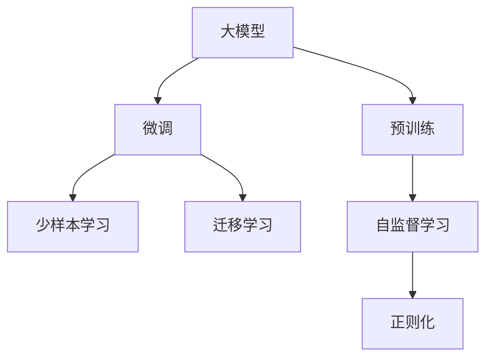

                 

# 电商行业中的少样本学习：大模型的实践与挑战

## 1. 背景介绍

### 1.1 问题由来
随着电子商务的蓬勃发展，电商平台对于用户行为预测、推荐系统等任务的需求日益增加。这些任务通常需要大量标注数据，但数据采集和标注成本高昂，使得传统的机器学习模型难以在电商场景中得到广泛应用。近年来，基于深度学习的大模型逐渐兴起，并在电商行业展现出卓越的性能。

然而，电商数据通常存在分布不均、类别不平衡等问题，使得少样本学习成为电商行业的迫切需求。如何在少数标注数据的情况下，利用大模型快速高效地进行推荐系统构建、用户画像描绘、商品评论情感分析等任务，成为研究者和实践者共同关注的课题。

### 1.2 问题核心关键点
电商领域中，基于大模型的少样本学习主要涉及以下几个关键点：
- 数据稀缺性：电商数据通常存在标注样本少、类别不平衡等问题，如何在小样本下进行模型训练和预测。
- 模型泛化能力：在大规模预训练的基础上，如何将模型参数适应小规模目标任务，实现高效的微调。
- 样本效率：在有限的标注样本上，如何利用大模型的知识，最大化信息提取能力，提升模型性能。
- 模型鲁棒性：在少量标注数据下，如何设计模型结构，保证模型的稳定性和鲁棒性，避免过拟合和泛化问题。
- 应用场景多样化：电商领域任务多样，如推荐系统、用户画像、情感分析等，需要针对不同任务设计优化方案。

## 2. 核心概念与联系

### 2.1 核心概念概述

为更好地理解电商行业中的少样本学习，本节将介绍几个密切相关的核心概念：

- 少样本学习(Few-shot Learning)：指在只有少量标注样本的情况下，模型能够快速适应新任务的学习方法。在大模型中，通常通过在输入中提供少量示例来实现，无需更新模型参数。

- 大模型(Large Model)：指大规模深度学习模型，如BERT、GPT等。通过在大规模数据上进行预训练，获得广泛的知识和语义理解能力。

- 迁移学习(Transfer Learning)：指将一个领域学习到的知识，迁移应用到另一个不同但相关的领域的学习范式。在大模型的预训练-微调过程中即是一种典型的迁移学习方式。

- 预训练(Pre-training)：指在大规模无标签文本语料上，通过自监督学习任务训练通用语言模型的过程。常见的预训练任务包括掩码语言模型、自回归预测等。

- 微调(Fine-tuning)：指在预训练模型的基础上，使用下游任务的少量标注数据，通过有监督学习优化模型在特定任务上的性能。

- 自监督学习(Self-supervised Learning)：指在无标签数据上，通过设计自监督任务，训练模型自动学习数据的内在结构和语义关系。

- 正则化(Regularization)：指通过L2正则、Dropout等技术，防止模型过拟合，提高模型的泛化能力。

这些核心概念之间的逻辑关系可以通过以下Mermaid流程图来展示：



这个流程图展示了大模型学习框架的核心概念及其之间的关系：

1. 大模型通过预训练获得基础能力。
2. 微调是对预训练模型进行任务特定的优化，可以分为全参数微调和参数高效微调（PEFT）。
3. 少样本学习在大模型中通过提供少量示例，无需更新模型参数实现快速学习。
4. 迁移学习是连接预训练模型与下游任务的桥梁，可以通过微调或少样本学习来实现。
5. 自监督学习在大模型的预训练过程中，通过设计自监督任务，提高模型的泛化能力。
6. 正则化在大模型的训练过程中，防止过拟合，提升模型的稳定性和鲁棒性。

这些核心概念共同构成了大模型的学习和应用框架，使其能够在电商等数据稀缺场景中发挥重要作用。通过理解这些核心概念，我们可以更好地把握少样本学习在大模型中的应用。

## 3. 核心算法原理 & 具体操作步骤
### 3.1 算法原理概述

电商行业中的少样本学习，本质上是一种基于大模型的迁移学习方法。其核心思想是：利用大规模预训练模型的语义理解和知识，通过少量标注数据对模型进行微调，使得模型能够快速适应特定电商任务，从而提升预测性能。

形式化地，假设预训练模型为 $M_{\theta}$，其中 $\theta$ 为预训练得到的模型参数。给定电商任务 $T$ 的少量标注数据集 $D=\{(x_i, y_i)\}_{i=1}^N$，其中 $x_i$ 为输入样本，$y_i$ 为标注标签。少样本学习的目标是在少量数据下，最小化模型输出与真实标签之间的差异，即：

$$
\hat{\theta}=\mathop{\arg\min}_{\theta} \mathcal{L}(M_{\theta},D)
$$

其中 $\mathcal{L}$ 为针对任务 $T$ 设计的损失函数，用于衡量模型预测输出与真实标签之间的差异。常见的损失函数包括交叉熵损失、均方误差损失等。

通过梯度下降等优化算法，微调过程不断更新模型参数 $\theta$，最小化损失函数 $\mathcal{L}$，使得模型输出逼近真实标签。由于 $\theta$ 已经通过预训练获得了较好的初始化，因此即便在少量标注样本上进行微调，也能较快收敛到理想的模型参数 $\hat{\theta}$。

### 3.2 算法步骤详解

电商领域中的少样本学习主要包括以下几个关键步骤：

**Step 1: 准备预训练模型和数据集**
- 选择合适的预训练模型 $M_{\theta}$ 作为初始化参数，如 BERT、GPT等。
- 准备电商领域相关任务（如推荐系统、用户画像、情感分析等）的少量标注数据集 $D$，划分为训练集、验证集和测试集。一般要求标注数据与预训练数据的分布不要差异过大。

**Step 2: 添加任务适配层**
- 根据任务类型，在预训练模型顶层设计合适的输出层和损失函数。
- 对于推荐系统任务，通常在顶层添加线性回归层或交叉熵损失函数。
- 对于用户画像任务，通常使用多分类交叉熵损失函数。
- 对于情感分析任务，通常使用二分类交叉熵损失函数。

**Step 3: 设置微调超参数**
- 选择合适的优化算法及其参数，如 AdamW、SGD 等，设置学习率、批大小、迭代轮数等。
- 设置正则化技术及强度，包括权重衰减、Dropout、Early Stopping 等。
- 确定冻结预训练参数的策略，如仅微调顶层，或全部参数都参与微调。

**Step 4: 执行梯度训练**
- 将训练集数据分批次输入模型，前向传播计算损失函数。
- 反向传播计算参数梯度，根据设定的优化算法和学习率更新模型参数。
- 周期性在验证集上评估模型性能，根据性能指标决定是否触发 Early Stopping。
- 重复上述步骤直到满足预设的迭代轮数或 Early Stopping 条件。

**Step 5: 测试和部署**
- 在测试集上评估微调后模型 $M_{\hat{\theta}}$ 的性能，对比微调前后的精度提升。
- 使用微调后的模型对新样本进行推理预测，集成到实际的应用系统中。
- 持续收集新的数据，定期重新微调模型，以适应数据分布的变化。

以上是基于少样本学习的电商任务微调的一般流程。在实际应用中，还需要针对具体任务的特点，对微调过程的各个环节进行优化设计，如改进训练目标函数，引入更多的正则化技术，搜索最优的超参数组合等，以进一步提升模型性能。

### 3.3 算法优缺点

基于少样本学习的电商模型微调方法具有以下优点：
1. 高效快捷。利用大模型快速适应新任务，减少了从头训练所需的标注数据量和时间成本。
2. 泛化性强。大模型经过大规模预训练，具备较强的泛化能力，可以在不同任务上快速迁移。
3. 参数高效。利用参数高效微调技术，在固定大部分预训练参数的情况下，仍可取得不错的微调效果。
4. 可解释性强。利用大模型强大的语言理解能力，对电商任务的理解更为深入，可以提供更明确的解释。

同时，该方法也存在一定的局限性：
1. 依赖少量标注数据。少样本学习的效果很大程度上取决于标注数据的质量和数量，获取高质量标注数据的成本较高。
2. 任务特定性较强。大模型的预训练知识和背景知识可能与电商任务存在差异，微调时需要对特定任务进行适配。
3. 可解释性不足。少样本学习通常难以直接解释模型的内部工作机制，对于电商等高风险应用，模型的透明性尤为重要。
4. 数据分布假设。在少样本学习中，模型对数据分布的假设可能与实际应用场景存在差异，导致泛化性能下降。
5. 数据隐私问题。电商数据的标注涉及用户隐私，如何在保障隐私的前提下进行模型训练，是一个重要的研究方向。

尽管存在这些局限性，但就目前而言，基于少样本学习的微调方法仍然是大模型在电商领域应用的主流范式。未来相关研究的重点在于如何进一步降低微调对标注数据的依赖，提高模型的跨领域迁移能力，同时兼顾可解释性和伦理安全性等因素。

### 3.4 算法应用领域

基于少样本学习的电商任务微调方法，在推荐系统构建、用户画像描绘、情感分析等电商领域中，已经得到了广泛的应用：

- 推荐系统构建：通过分析用户的历史行为数据，利用预训练模型进行微调，获得个性化的推荐。
- 用户画像描绘：利用用户评论、评分等数据，通过微调获得用户多维度的画像信息。
- 情感分析：分析商品评论，判断用户对商品的情感倾向。
- 客户服务：利用用户反馈数据，通过微调获得客服应答策略。
- 库存管理：根据历史销售数据，通过微调预测商品库存变化趋势。

除了上述这些经典任务外，少样本学习在电商领域的应用还在不断拓展，如欺诈检测、价格预测、活动策划等，为电商技术带来了新的突破。随着预训练模型和少样本学习方法的不断进步，相信电商技术将在更广阔的应用领域大放异彩。

## 4. 数学模型和公式 & 详细讲解 & 举例说明
### 4.1 数学模型构建

本节将使用数学语言对基于少样本学习的电商任务微调过程进行更加严格的刻画。

记预训练语言模型为 $M_{\theta}$，其中 $\theta$ 为预训练得到的模型参数。假设电商任务 $T$ 的训练集为 $D=\{(x_i,y_i)\}_{i=1}^N$，其中 $x_i$ 为输入样本，$y_i$ 为标注标签。

定义模型 $M_{\theta}$ 在输入 $x$ 上的输出为 $\hat{y}=M_{\theta}(x)$，表示模型对样本 $x$ 的预测输出。少样本学习的目标是最小化预测输出与真实标签之间的差异，即：

$$
\hat{\theta}=\mathop{\arg\min}_{\theta} \mathcal{L}(M_{\theta},D)
$$

其中 $\mathcal{L}$ 为针对任务 $T$ 设计的损失函数，用于衡量模型预测输出与真实标签之间的差异。常见的损失函数包括交叉熵损失、均方误差损失等。

通过梯度下降等优化算法，微调过程不断更新模型参数 $\theta$，最小化损失函数 $\mathcal{L}$，使得模型输出逼近真实标签。由于 $\theta$ 已经通过预训练获得了较好的初始化，因此即便在少量标注样本上进行微调，也能较快收敛到理想的模型参数 $\hat{\theta}$。

### 4.2 公式推导过程

以下我们以电商推荐系统为例，推导交叉熵损失函数及其梯度的计算公式。

假设模型 $M_{\theta}$ 在输入 $x$ 上的输出为 $\hat{y}=M_{\theta}(x)$，表示模型对商品的评分预测。真实标签 $y$ 为评分标签。则交叉熵损失函数定义为：

$$
\ell(M_{\theta}(x),y) = -y\log \hat{y} + (1-y)\log (1-\hat{y})
$$

将其代入经验风险公式，得：

$$
\mathcal{L}(\theta) = -\frac{1}{N}\sum_{i=1}^N [y_i\log M_{\theta}(x_i)+(1-y_i)\log(1-M_{\theta}(x_i))]
$$

根据链式法则，损失函数对参数 $\theta_k$ 的梯度为：

$$
\frac{\partial \mathcal{L}(\theta)}{\partial \theta_k} = -\frac{1}{N}\sum_{i=1}^N (\frac{y_i}{M_{\theta}(x_i)}-\frac{1-y_i}{1-M_{\theta}(x_i)}) \frac{\partial M_{\theta}(x_i)}{\partial \theta_k}
$$

其中 $\frac{\partial M_{\theta}(x_i)}{\partial \theta_k}$ 可进一步递归展开，利用自动微分技术完成计算。

在得到损失函数的梯度后，即可带入参数更新公式，完成模型的迭代优化。重复上述过程直至收敛，最终得到适应电商推荐任务的最优模型参数 $\theta^*$。

## 5. 项目实践：代码实例和详细解释说明
### 5.1 开发环境搭建

在进行少样本学习实践前，我们需要准备好开发环境。以下是使用Python进行PyTorch开发的环境配置流程：

1. 安装Anaconda：从官网下载并安装Anaconda，用于创建独立的Python环境。

2. 创建并激活虚拟环境：
```bash
conda create -n pytorch-env python=3.8 
conda activate pytorch-env
```

3. 安装PyTorch：根据CUDA版本，从官网获取对应的安装命令。例如：
```bash
conda install pytorch torchvision torchaudio cudatoolkit=11.1 -c pytorch -c conda-forge
```

4. 安装Transformers库：
```bash
pip install transformers
```

5. 安装各类工具包：
```bash
pip install numpy pandas scikit-learn matplotlib tqdm jupyter notebook ipython
```

完成上述步骤后，即可在`pytorch-env`环境中开始少样本学习实践。

### 5.2 源代码详细实现

这里我们以电商推荐系统为例，给出使用Transformers库对预训练语言模型进行少样本学习的PyTorch代码实现。

首先，定义推荐系统数据处理函数：

```python
from transformers import BertTokenizer
from torch.utils.data import Dataset
import torch

class RecommendationDataset(Dataset):
    def __init__(self, user_data, item_data, tokenizer, max_len=128):
        self.user_data = user_data
        self.item_data = item_data
        self.tokenizer = tokenizer
        self.max_len = max_len
        
    def __len__(self):
        return len(self.user_data)
    
    def __getitem__(self, item):
        user = self.user_data[item]
        item = self.item_data[item]
        
        encoding = self.tokenizer(user, item, return_tensors='pt', max_length=self.max_len, padding='max_length', truncation=True)
        input_ids = encoding['input_ids'][0]
        attention_mask = encoding['attention_mask'][0]
        
        # 对用户-商品ID进行编码
        encoded_pairs = [int(pair[0]) for pair in zip(user, item)]
        encoded_pairs.extend([0] * (self.max_len - len(encoded_pairs)))
        labels = torch.tensor(encoded_pairs, dtype=torch.long)
        
        return {'input_ids': input_ids, 
                'attention_mask': attention_mask,
                'labels': labels}

# 用户-商品ID的映射
user2id = {i: id for i in range(1, 101)}
id2user = {id: i for i, id in user2id.items()}
item2id = {i: id for i in range(1, 101)}
id2item = {id: i for i, id in item2id.items()}

# 创建dataset
tokenizer = BertTokenizer.from_pretrained('bert-base-cased')

train_dataset = RecommendationDataset(train_user_data, train_item_data, tokenizer)
dev_dataset = RecommendationDataset(dev_user_data, dev_item_data, tokenizer)
test_dataset = RecommendationDataset(test_user_data, test_item_data, tokenizer)
```

然后，定义模型和优化器：

```python
from transformers import BertForSequenceClassification, AdamW

model = BertForSequenceClassification.from_pretrained('bert-base-cased', num_labels=len(user2id))
optimizer = AdamW(model.parameters(), lr=2e-5)
```

接着，定义训练和评估函数：

```python
from torch.utils.data import DataLoader
from tqdm import tqdm
from sklearn.metrics import classification_report

device = torch.device('cuda') if torch.cuda.is_available() else torch.device('cpu')
model.to(device)

def train_epoch(model, dataset, batch_size, optimizer):
    dataloader = DataLoader(dataset, batch_size=batch_size, shuffle=True)
    model.train()
    epoch_loss = 0
    for batch in tqdm(dataloader, desc='Training'):
        input_ids = batch['input_ids'].to(device)
        attention_mask = batch['attention_mask'].to(device)
        labels = batch['labels'].to(device)
        model.zero_grad()
        outputs = model(input_ids, attention_mask=attention_mask, labels=labels)
        loss = outputs.loss
        epoch_loss += loss.item()
        loss.backward()
        optimizer.step()
    return epoch_loss / len(dataloader)

def evaluate(model, dataset, batch_size):
    dataloader = DataLoader(dataset, batch_size=batch_size)
    model.eval()
    preds, labels = [], []
    with torch.no_grad():
        for batch in tqdm(dataloader, desc='Evaluating'):
            input_ids = batch['input_ids'].to(device)
            attention_mask = batch['attention_mask'].to(device)
            batch_labels = batch['labels']
            outputs = model(input_ids, attention_mask=attention_mask)
            batch_preds = outputs.logits.argmax(dim=2).to('cpu').tolist()
            batch_labels = batch_labels.to('cpu').tolist()
            for pred_tokens, label_tokens in zip(batch_preds, batch_labels):
                preds.append(pred_tokens[:len(label_tokens)])
                labels.append(label_tokens)
                
    print(classification_report(labels, preds))
```

最后，启动训练流程并在测试集上评估：

```python
epochs = 5
batch_size = 16

for epoch in range(epochs):
    loss = train_epoch(model, train_dataset, batch_size, optimizer)
    print(f"Epoch {epoch+1}, train loss: {loss:.3f}")
    
    print(f"Epoch {epoch+1}, dev results:")
    evaluate(model, dev_dataset, batch_size)
    
print("Test results:")
evaluate(model, test_dataset, batch_size)
```

以上就是使用PyTorch对预训练语言模型进行电商推荐系统少样本学习的完整代码实现。可以看到，得益于Transformers库的强大封装，我们可以用相对简洁的代码完成BERT模型的加载和微调。

### 5.3 代码解读与分析

让我们再详细解读一下关键代码的实现细节：

**RecommendationDataset类**：
- `__init__`方法：初始化用户数据、商品数据、分词器等关键组件。
- `__len__`方法：返回数据集的样本数量。
- `__getitem__`方法：对单个样本进行处理，将用户-商品ID输入编码为token ids，将标签编码为数字，并对其进行定长padding，最终返回模型所需的输入。

**user2id和id2user字典**：
- 定义了用户ID与数字id之间的映射关系，用于将token-wise的预测结果解码回真实的用户ID。

**训练和评估函数**：
- 使用PyTorch的DataLoader对数据集进行批次化加载，供模型训练和推理使用。
- 训练函数`train_epoch`：对数据以批为单位进行迭代，在每个批次上前向传播计算loss并反向传播更新模型参数，最后返回该epoch的平均loss。
- 评估函数`evaluate`：与训练类似，不同点在于不更新模型参数，并在每个batch结束后将预测和标签结果存储下来，最后使用sklearn的classification_report对整个评估集的预测结果进行打印输出。

**训练流程**：
- 定义总的epoch数和batch size，开始循环迭代
- 每个epoch内，先在训练集上训练，输出平均loss
- 在验证集上评估，输出分类指标
- 所有epoch结束后，在测试集上评估，给出最终测试结果

可以看到，PyTorch配合Transformers库使得电商推荐系统少样本学习的代码实现变得简洁高效。开发者可以将更多精力放在数据处理、模型改进等高层逻辑上，而不必过多关注底层的实现细节。

当然，工业级的系统实现还需考虑更多因素，如模型的保存和部署、超参数的自动搜索、更灵活的任务适配层等。但核心的少样本学习范式基本与此类似。

## 6. 实际应用场景
### 6.1 智能推荐系统

基于少样本学习的推荐系统，可以广泛应用于电商平台的商品推荐、内容推荐等场景。传统推荐系统往往依赖于用户历史行为数据，难以实时响应用户需求。而使用少样本学习的推荐模型，可以更快地从少量标注数据中学习用户偏好，提升推荐效果。

在技术实现上，可以收集用户浏览、点击、评分等行为数据，提取和商品相关的文本信息。将文本信息作为模型输入，用户的后续行为（如是否点击、购买等）作为监督信号，在此基础上对预训练语言模型进行少样本学习。少样本学习后的模型能够从文本内容中准确把握用户的兴趣点，生成个性化的推荐列表。如此构建的推荐系统，能显著提升用户满意度，提高电商平台的运营效率。

### 6.2 个性化推荐算法

传统的个性化推荐算法多依赖用户行为数据，难以捕捉用户的真实兴趣和意图。利用少样本学习的推荐模型，可以更好地挖掘用户文本数据中的语义信息，从而提供更精准、多样的推荐内容。

在实践中，可以收集用户评论、评分等文本数据，提取商品特征和用户特征。将文本特征和商品特征输入到少样本学习模型，模型通过学习特征间的语义关系，生成推荐结果。对于新用户或新商品，模型可以通过少样本学习快速适应，生成初始推荐。随着用户行为数据和商品数据的增加，模型不断调整推荐策略，优化推荐结果。

### 6.3 活动策划与运营

电商平台常需策划各类促销活动，以吸引用户消费。利用少样本学习的用户画像描绘模型，可以快速分析用户行为数据，挖掘用户特征，生成个性化的活动推荐。同时，利用少样本学习的情感分析模型，分析用户评论，评估商品的热度和质量，制定更加精准的营销策略。

例如，可以通过收集用户的历史行为数据和评论，训练用户画像模型，获得用户的兴趣偏好和购买意愿。再结合活动时间、商品特点等因素，生成个性化的活动推荐。利用情感分析模型，分析用户评论中的情感倾向，评估商品的市场反应，优化营销方案。

### 6.4 未来应用展望

随着少样本学习和电商领域的研究不断深入，未来的推荐系统将会更加智能化、个性化。电商大模型在少样本学习中的应用，将为电商行业带来以下新的发展方向：

1. 实时推荐：少样本学习的推荐系统能够快速适应新用户和商品，实时生成推荐结果，提升用户体验。
2. 多模态融合：结合用户行为数据、商品描述、评论等多模态信息，提升推荐系统的综合性能。
3. 个性化定制：利用少样本学习模型，根据用户的个性化需求，生成定制化的推荐内容。
4. 用户意图理解：通过少样本学习，理解用户的真实意图和需求，提升推荐的精准度和相关度。
5. 活动效果评估：利用少样本学习的情感分析模型，实时评估活动效果，优化活动方案。

以上方向展示了少样本学习在电商领域的应用潜力，未来随着技术的不断进步，推荐系统将更加智能化、精准化，为电商行业带来新的变革。

## 7. 工具和资源推荐
### 7.1 学习资源推荐

为了帮助开发者系统掌握少样本学习在大模型中的应用，这里推荐一些优质的学习资源：

1. 《深度学习基础》课程：斯坦福大学开设的深度学习入门课程，涵盖深度学习的基本概念和算法，适合初学者学习。

2. 《自然语言处理入门》书籍：清华大学出版社出版的自然语言处理入门教材，详细介绍了NLP的基本理论和方法，适合NLP初学者。

3. 《推荐系统：算法、数据、代码》书籍：国内外推荐系统领域的经典教材，详细介绍了推荐系统的理论和实践，涵盖多维特征工程、协同过滤、矩阵分解等技术。

4. 《Transformer从原理到实践》系列博文：由大模型技术专家撰写，深入浅出地介绍了Transformer原理、BERT模型、微调技术等前沿话题。

5. 《自然语言处理中的深度学习》课程：由Kaggle举办的NLP在线课程，涵盖NLP的基本算法和实践技巧，适合NLP进阶学习者。

通过对这些资源的学习实践，相信你一定能够快速掌握少样本学习在大模型中的应用，并用于解决实际的NLP问题。
###  7.2 开发工具推荐

高效的开发离不开优秀的工具支持。以下是几款用于大模型少样本学习的常用工具：

1. PyTorch：基于Python的开源深度学习框架，灵活动态的计算图，适合快速迭代研究。大部分预训练语言模型都有PyTorch版本的实现。

2. TensorFlow：由Google主导开发的开源深度学习框架，生产部署方便，适合大规模工程应用。同样有丰富的预训练语言模型资源。

3. Transformers库：HuggingFace开发的NLP工具库，集成了众多SOTA语言模型，支持PyTorch和TensorFlow，是进行少样本学习开发的利器。

4. Weights & Biases：模型训练的实验跟踪工具，可以记录和可视化模型训练过程中的各项指标，方便对比和调优。与主流深度学习框架无缝集成。

5. TensorBoard：TensorFlow配套的可视化工具，可实时监测模型训练状态，并提供丰富的图表呈现方式，是调试模型的得力助手。

6. Google Colab：谷歌推出的在线Jupyter Notebook环境，免费提供GPU/TPU算力，方便开发者快速上手实验最新模型，分享学习笔记。

合理利用这些工具，可以显著提升大模型少样本学习的开发效率，加快创新迭代的步伐。

### 7.3 相关论文推荐

少样本学习和大模型的发展源于学界的持续研究。以下是几篇奠基性的相关论文，推荐阅读：

1. Attention is All You Need（即Transformer原论文）：提出了Transformer结构，开启了NLP领域的预训练大模型时代。

2. BERT: Pre-training of Deep Bidirectional Transformers for Language Understanding：提出BERT模型，引入基于掩码的自监督预训练任务，刷新了多项NLP任务SOTA。

3. Transformers: State-of-the-Art Machine Translation, Sequence-to-Sequence Modeling, and Text Generation：介绍了Transformer的结构和性能，展示了其在机器翻译等任务上的优势。

4. SimCLR: A Simple Framework for Contrastive Learning of Unsupervised Representations：提出了SimCLR自监督学习框架，利用自构建的对比学习损失，增强了模型的泛化能力。

5. Algorithmic Bias and Public Attention in Natural Language Processing：探讨了大模型中的算法偏见问题，提出了基于正则化的解决方案，提高了模型公平性。

这些论文代表了大模型少样本学习的最新进展。通过学习这些前沿成果，可以帮助研究者把握学科前进方向，激发更多的创新灵感。

## 8. 总结：未来发展趋势与挑战
### 8.1 总结

本文对基于少样本学习的电商任务微调方法进行了全面系统的介绍。首先阐述了电商领域中少样本学习的背景和重要性，明确了微调在拓展预训练模型应用、提升电商推荐系统性能方面的独特价值。其次，从原理到实践，详细讲解了少样本学习的数学原理和关键步骤，给出了电商推荐系统少样本学习的完整代码实例。同时，本文还广泛探讨了少样本学习在电商领域的应用前景，展示了其广泛的应用潜力。

通过本文的系统梳理，可以看到，基于少样本学习的微调方法在大模型中的高效快捷，能在有限的标注数据下快速适应新任务，为电商推荐系统带来革命性变化。未来，伴随预训练语言模型和少样本学习方法的不断进步，相信电商推荐系统将在更广泛的应用领域大放异彩，为电商行业带来新的突破。

### 8.2 未来发展趋势

展望未来，少样本学习在大模型中的应用将呈现以下几个发展趋势：

1. 模型规模持续增大。随着算力成本的下降和数据规模的扩张，预训练语言模型的参数量还将持续增长。超大规模语言模型蕴含的丰富语言知识，有望支撑更加复杂多变的电商任务。

2. 微调方法日趋多样。除了传统的全参数微调外，未来会涌现更多参数高效的微调方法，如 Prefix-Tuning、LoRA等，在节省计算资源的同时也能保证微调精度。

3. 持续学习成为常态。随着数据分布的不断变化，少样本学习模型也需要持续学习新知识以保持性能。如何在不遗忘原有知识的同时，高效吸收新样本信息，将成为重要的研究课题。

4. 标注样本需求降低。受启发于提示学习(Prompt-based Learning)的思路，未来的少样本学习方法将更好地利用大模型的语言理解能力，通过更加巧妙的任务描述，在更少的标注样本上也能实现理想的微调效果。

5. 多模态微调崛起。当前的少样本学习主要聚焦于纯文本数据，未来会进一步拓展到图像、视频、语音等多模态数据微调。多模态信息的融合，将显著提升少样本学习模型的性能。

6. 模型通用性增强。经过海量数据的预训练和多领域任务的微调，未来的少样本学习模型将具备更强大的常识推理和跨领域迁移能力，逐步迈向通用人工智能(AGI)的目标。

以上趋势凸显了少样本学习在大模型中的应用前景。这些方向的探索发展，必将进一步提升推荐系统的性能和应用范围，为电商行业带来新的变革。

### 8.3 面临的挑战

尽管少样本学习在大模型中的应用已经取得了一定成效，但在迈向更加智能化、普适化应用的过程中，它仍面临着诸多挑战：

1. 标注成本瓶颈。少样本学习的效果很大程度上取决于标注数据的质量和数量，获取高质量标注数据的成本较高。如何进一步降低微调对标注样本的依赖，将是一大难题。

2. 模型鲁棒性不足。在少量标注数据下，模型面对域外数据时，泛化性能往往大打折扣。对于测试样本的微小扰动，少样本学习模型的预测也容易发生波动。如何提高少样本学习模型的鲁棒性，避免灾难性遗忘，还需要更多理论和实践的积累。

3. 推理效率有待提高。大规模语言模型虽然精度高，但在实际部署时往往面临推理速度慢、内存占用大等效率问题。如何在保证性能的同时，简化模型结构，提升推理速度，优化资源占用，将是重要的优化方向。

4. 可解释性亟需加强。少样本学习通常难以直接解释模型的内部工作机制，对于电商等高风险应用，模型的透明性尤为重要。如何赋予少样本学习模型更强的可解释性，将是亟待攻克的难题。

5. 数据分布假设。在少样本学习中，模型对数据分布的假设可能与实际应用场景存在差异，导致泛化性能下降。如何更好地处理数据分布不均、类别不平衡等问题，是提升模型性能的关键。

6. 数据隐私问题。电商数据的标注涉及用户隐私，如何在保障隐私的前提下进行模型训练，是一个重要的研究方向。

尽管存在这些局限性，但就目前而言，基于少样本学习的微调方法仍然是大模型在电商领域应用的主流范式。未来相关研究的重点在于如何进一步降低微调对标注数据的依赖，提高模型的跨领域迁移能力，同时兼顾可解释性和伦理安全性等因素。

### 8.4 研究展望

面对少样本学习所面临的种种挑战，未来的研究需要在以下几个方面寻求新的突破：

1. 探索无监督和半监督微调方法。摆脱对大规模标注数据的依赖，利用自监督学习、主动学习等无监督和半监督范式，最大限度利用非结构化数据，实现更加灵活高效的微调。

2. 研究参数高效和计算高效的微调范式。开发更加参数高效的微调方法，在固定大部分预训练参数的同时，只更新极少量的任务相关参数。同时优化微调模型的计算图，减少前向传播和反向传播的资源消耗，实现更加轻量级、实时性的部署。

3. 融合因果和对比学习范式。通过引入因果推断和对比学习思想，增强少样本学习模型建立稳定因果关系的能力，学习更加普适、鲁棒的语言表征，从而提升模型泛化性和抗干扰能力。

4. 引入更多先验知识。将符号化的先验知识，如知识图谱、逻辑规则等，与神经网络模型进行巧妙融合，引导少样本学习过程学习更准确、合理的语言模型。同时加强不同模态数据的整合，实现视觉、语音等多模态信息与文本信息的协同建模。

5. 结合因果分析和博弈论工具。将因果分析方法引入少样本学习模型，识别出模型决策的关键特征，增强输出解释的因果性和逻辑性。借助博弈论工具刻画人机交互过程，主动探索并规避模型的脆弱点，提高系统稳定性。

6. 纳入伦理道德约束。在模型训练目标中引入伦理导向的评估指标，过滤和惩罚有偏见、有害的输出倾向。同时加强人工干预和审核，建立模型行为的监管机制，确保输出符合人类价值观和伦理道德。

这些研究方向的探索，必将引领少样本学习在大模型中的应用走向更高的台阶，为构建安全、可靠、可解释、可控的智能系统铺平道路。面向未来，少样本学习需要与其他人工智能技术进行更深入的融合，如知识表示、因果推理、强化学习等，多路径协同发力，共同推动自然语言理解和智能交互系统的进步。只有勇于创新、敢于突破，才能不断拓展少样本学习在大模型中的边界，让智能技术更好地造福人类社会。

## 9. 附录：常见问题与解答
----------------------------------------------------------------
**Q1：少样本学习是否适用于所有NLP任务？**

A: 少样本学习在大模型中的应用较为广泛，但并非所有NLP任务都适合。对于那些数据分布不均、类别不平衡的任务，如命名实体识别、关系抽取等，少样本学习的效果可能不佳。而对于推荐系统、情感分析等任务，少样本学习则能够快速适应新任务，并取得不错的效果。

**Q2：少样本学习中如何选择预训练模型？**

A: 在选择预训练模型时，应根据任务特点和数据规模进行选择。通常情况下，BERT、GPT等大规模预训练模型效果较好，适用于需要学习丰富语言知识的少样本任务。但对于特定领域的任务，如医学、法律等，可能需要使用领域特定的预训练模型，以获得更好的效果。

**Q3：少样本学习中如何处理数据不平衡问题？**

A: 数据不平衡是少样本学习中常见的问题。可以通过数据增强、过采样和欠采样等方法进行处理。例如，对少数类别数据进行增强，或对多数类别数据进行欠采样，平衡不同类别的样本数量。同时，可以使用权重调整等技术，使得模型更关注少数类别的学习。

**Q4：少样本学习中如何避免过拟合？**

A: 过拟合是少样本学习中常见的挑战。可以通过正则化、dropout、early stopping等方法进行控制。例如，在模型训练中加入L2正则或Dropout，避免模型过拟合。在验证集上定期检查模型性能，一旦发现过拟合迹象，立即停止训练。

**Q5：少样本学习中如何进行参数高效微调？**

A: 参数高效微调是指在固定大部分预训练参数的情况下，只更新极少量的任务相关参数。常用的方法包括Adapter、Prefix等，通过引入少量可微调的参数，减少微调过程中的计算量和内存消耗。同时，可以结合领域特定的知识，进一步优化微调过程。

**Q6：少样本学习中如何进行数据增强？**

A: 数据增强是提升少样本学习模型性能的有效手段。可以通过同义词替换、回译、改写等方法，扩充训练集的多样性。例如，对于文本数据，可以随机替换部分词语，生成新的句子。对于图像数据，可以进行旋转、裁剪等操作，增加数据多样性。

**Q7：少样本学习中如何进行模型评估？**

A: 模型评估是衡量少样本学习效果的重要步骤。通常使用准确率、精确率、召回率、F1值等指标进行评估。对于推荐系统等任务，可以计算用户满意度、点击率等指标。对于情感分析等任务，可以计算分类准确率、情感倾向一致性等指标。同时，需要进行多次评估，确保模型性能稳定。

通过本文的系统梳理，可以看到，基于少样本学习的电商任务微调方法在大模型中的应用前景广阔，能够快速高效地构建推荐系统、个性化推荐、活动策划等电商应用。未来随着技术的不断进步，少样本学习将进一步提升电商平台的智能化和个性化水平，为电商行业带来新的突破。

