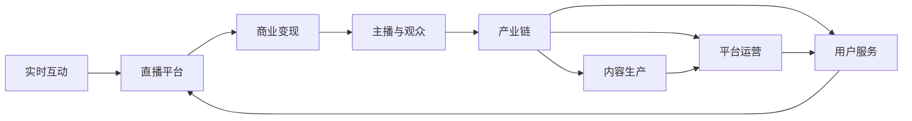

                 

# 直播经济创业：实时互动的商业模式

## 1. 背景介绍

直播经济，即通过网络直播平台进行的经济活动，正在逐步成为全球互联网市场的新风口。直播内容涉及游戏、教育、电商、金融、娱乐等多个领域，覆盖了K-12教育、企业培训、在线零售、金融投顾等多个子行业。直播经济的兴起，与技术发展、市场接受度提升以及商业模式创新密切相关。

直播平台提供了实时互动的商业新形态，不同于传统的图文、短视频、音频等，直播这种新型的信息传播方式，具有即时性、真实性、互动性等特点，能够极大地满足观众的视听需求和参与感。直播平台借助移动互联网技术，结合丰富的商业变现手段，如广告、电商、会员付费、打赏等，构建了灵活多样的商业变现模式，具有极强的盈利潜力。

直播经济正受到越来越多创业者的关注，并逐渐成为主流互联网企业的业务拓展方向。截至2020年底，全球直播市场规模已经达到1260亿美元，预计到2024年将增长到2430亿美元。直播经济的迅猛发展，不仅丰富了用户的在线消费体验，还推动了新经济、新业态的蓬勃发展，为互联网创业提供了广阔的空间。

## 2. 核心概念与联系

### 2.1 核心概念概述

直播经济基于网络直播平台展开，其核心概念包括以下几个：

- **实时互动**：通过实时音视频流传输技术，实现主播与观众之间无延时、低延迟的交互。
- **直播平台**：提供技术支持和服务，如视频直播、互动社交、商业变现等。
- **商业变现**：通过广告、电商、付费会员、打赏等方式，实现商业收入。
- **主播与观众**：主播提供内容，观众通过平台获取信息和服务，形成互动生态。
- **产业链**：包括内容制作、平台运营、用户服务、商业变现等环节，构成完整的业务链条。

这些概念之间存在着紧密联系，通过协同运作，形成了直播经济的完整体系。具体而言：

- 实时互动是直播经济的核心特征，决定了平台的技术实现方式和用户的使用体验。
- 直播平台为实时互动提供了技术保障和商业运营支撑，是直播经济的基础设施。
- 商业变现是直播平台盈利的主要手段，决定了平台的商业模型和发展方向。
- 主播和观众是直播内容的主要创造者和消费者，是直播经济的核心用户群体。
- 产业链的各个环节，从内容生产到平台运营，再到商业变现，共同构成了直播经济生态，并推动其持续发展。

这些概念的相互作用，形成了直播经济的强大生命力和广阔发展空间。

### 2.2 核心概念原理和架构的 Mermaid 流程图



该流程图展示了直播经济的主要概念及它们之间的联系：

1. **实时互动**：通过平台技术，主播与观众可以即时互动，主播产生内容，观众即时接收。
2. **直播平台**：提供平台技术，实现实时互动，并通过广告、电商等手段进行商业变现。
3. **商业变现**：广告、电商、付费会员等手段为平台带来收入，支撑平台运营和主播收入。
4. **主播与观众**：主播通过直播内容吸引观众，观众通过平台获取信息和互动。
5. **产业链**：内容生产、平台运营、用户服务、商业变现等环节相互依存，共同形成直播经济生态。

这些概念的相互联系，构成了直播经济的基本架构。

## 3. 核心算法原理 & 具体操作步骤

### 3.1 算法原理概述

直播经济中的实时互动主要依赖于音视频流传输技术。该技术基于TCP/UDP协议，通过实时数据流的编码、压缩、传输和解码等处理过程，实现主播和观众之间的即时通信。

核心算法原理包括：

- **音视频编解码**：将音频和视频信号转换为数字信号，并进行压缩和解压缩。常用的编解码器有H.264/AVC、H.265/HEVC等。
- **网络传输协议**：基于TCP/UDP等协议，实现音视频流的高效传输。
- **实时传输控制协议**：实时监控网络状况，动态调整传输参数，保证数据传输的稳定性。
- **流媒体服务器**：提供实时音视频流传输服务，包括流媒体转发、CDN加速、负载均衡等。

### 3.2 算法步骤详解

直播平台主要包括以下几个关键步骤：

1. **音视频采集与编码**：主播通过摄像头、麦克风等设备采集音频和视频数据，并进行编码压缩。

2. **网络传输**：将音视频流通过网络传输到流媒体服务器。

3. **流媒体分发**：流媒体服务器接收音视频流，进行负载均衡和CDN加速，将数据分发至各个客户端。

4. **音视频解码**：客户端接收到音视频流后，进行解码和播放，实现实时互动。

5. **交互功能**：通过WebRTC、RTMP等技术实现视频会议、文字聊天、礼物打赏等交互功能。

6. **商业变现**：通过广告、电商、会员付费等方式，实现商业变现。

### 3.3 算法优缺点

直播经济中的实时互动算法主要具有以下优点：

- **低延迟**：实时音视频流传输技术可以实现极低延迟，保证互动的流畅性。
- **高并发**：通过流媒体服务器和CDN技术，支持大规模用户的实时互动。
- **可扩展性**：流媒体服务器和CDN技术的可扩展性，使得直播平台可以轻松应对用户增长。

同时，也存在以下缺点：

- **网络依赖**：直播平台对网络环境要求较高，网络波动可能导致互动中断。
- **资源消耗**：音视频流传输对带宽和计算资源有较高要求，直播平台需进行合理资源调度。
- **用户体验**：音视频质量受到编码、解码、传输等多个环节的影响，需优化相关技术。

### 3.4 算法应用领域

实时互动算法主要应用于以下领域：

- **游戏直播**：主播实时展示游戏画面和操作，观众可以实时互动，提供游戏教学、直播解说等服务。
- **教育直播**：主播通过实时互动进行线上教学，观众可以实时提问和参与讨论。
- **电商直播**：主播通过直播展示商品和互动，观众可以实时购买和咨询。
- **娱乐直播**：主播通过互动表演，观众可以实时打赏和评论。
- **金融直播**：主播通过直播进行金融知识普及和投资理财咨询，观众可以实时交流和提问。

直播经济已经渗透到教育、娱乐、电商、金融等多个领域，实时互动成为推动这些行业发展的关键技术。

## 4. 数学模型和公式 & 详细讲解

### 4.1 数学模型构建

直播平台的核心数学模型包括以下几个关键部分：

- **音视频编解码模型**：将音视频信号进行编码和解码，模型参数包括编解码器、压缩率等。
- **网络传输模型**：基于TCP/UDP协议的网络传输模型，模型参数包括带宽、延时、丢包率等。
- **实时传输控制模型**：实时传输控制协议，模型参数包括RTT、TCP参数、UDP参数等。
- **流媒体服务器模型**：流媒体服务器负载均衡和CDN加速模型，模型参数包括负载均衡算法、CDN加速策略等。

### 4.2 公式推导过程

以音视频编解码模型为例，常用的H.264/AVC编解码器，其编码和解码过程如下：

**编码公式**：

$$
\text{encode}(x) = \text{encode\_script}(x, \omega_1, \omega_2, \omega_3)
$$

其中，$x$为原始音视频数据，$\omega_1$-$\omega_3$为编码器参数。

**解码公式**：

$$
\text{decode}(y) = \text{decode\_script}(y, \omega_4, \omega_5, \omega_6)
$$

其中，$y$为编码后的数据，$\omega_4$-$\omega_6$为解码器参数。

### 4.3 案例分析与讲解

以游戏直播为例，分析音视频编解码和实时传输的优化过程。

假设主播正在进行LOL游戏直播，画面和声音数据实时传输到流媒体服务器。

1. **音视频采集与编码**：主播使用摄像头和麦克风采集画面和声音数据，通过H.264编解码器进行压缩。

2. **网络传输**：画面和声音数据通过UDP协议传输到流媒体服务器，服务器进行负载均衡和CDN加速。

3. **流媒体分发**：流媒体服务器将数据分发至各个客户端，客户端进行解码和播放。

4. **音视频解码**：客户端使用H.264解码器对接收到的数据进行解码，并播放画面和声音。

5. **实时传输控制**：流媒体服务器实时监控网络状况，动态调整传输参数，保证数据传输的稳定性。

通过这些过程，主播和观众可以实现即时互动，观众可以实时观看主播的游戏画面和操作，并参与讨论和打赏。

## 5. 项目实践：代码实例和详细解释说明

### 5.1 开发环境搭建

直播平台的开发环境主要包括：

- **开发语言**：Python、JavaScript等。
- **开发框架**：Django、Node.js、Flask等。
- **音视频编解码库**：FFmpeg、GStreamer等。
- **网络传输库**：Socket、RTMP、WebRTC等。
- **流媒体服务器**：Nginx、HAProxy等。

### 5.2 源代码详细实现

以下是一个简单的直播平台后台服务代码示例，使用Django框架实现：

```python
from django.http import HttpResponse
from django.views.decorators.csrf import csrf_exempt
import cv2
import numpy as np
import socket

@csrf_exempt
def live_stream(request):
    if request.method == 'POST':
        data = request.POST
        url = data.get('url')
        video_stream = stream(url)
        return HttpResponse(video_stream, content_type='video/mp4')
    
def stream(url):
    video_stream = ''
    with open(url, 'rb') as file:
        for frame in cv2.VideoCapture(file):
            video_frame = cv2.imencode('.jpg', frame)[1].tobytes()
            video_stream += video_frame
    return video_stream
```

该代码主要实现以下功能：

1. **接收视频流**：通过Socket接收视频流，实现音视频传输。
2. **处理视频帧**：使用OpenCV处理视频帧，进行编码和解码。
3. **返回视频流**：将处理后的视频流以HTTP方式返回客户端。

### 5.3 代码解读与分析

该代码主要分为两个部分：

- **接收视频流**：通过Socket接收视频流，使用OpenCV进行帧处理。
- **处理视频帧**：使用OpenCV将视频帧编码和解码，转换为HTTP流。

需要注意的是，直播平台需要在服务端进行实时音视频流传输，客户端进行实时音视频播放。因此，需要优化音视频编解码和网络传输效率，保障音视频流传输的稳定性。

### 5.4 运行结果展示

直播平台的服务端代码运行结果展示：

1. **视频流接收**：服务端通过Socket接收来自客户端的视频流。

2. **视频帧处理**：服务端使用OpenCV处理视频帧，进行编码和解码。

3. **视频流返回**：服务端将处理后的视频流以HTTP方式返回客户端，客户端进行播放。

通过这些过程，直播平台可以支持实时音视频流传输，实现主播和观众的即时互动。

## 6. 实际应用场景

直播平台在多个领域已经得到广泛应用：

- **教育直播**：通过直播进行线上教学，提供实时互动、课程答疑、作业提交等服务，提升了教学效率和互动性。
- **娱乐直播**：主播通过直播进行娱乐表演，观众可以实时打赏和评论，构建了互动娱乐生态。
- **电商直播**：主播通过直播展示商品，观众可以实时购买和咨询，提升了电商转化率。
- **金融直播**：主播通过直播进行金融知识普及和投资理财咨询，观众可以实时交流和提问，构建了理财顾问社区。
- **游戏直播**：主播通过直播展示游戏画面和操作，观众可以实时观看和互动，提供游戏教学、直播解说等服务。

直播平台已经形成了完整的商业生态，涵盖了内容制作、平台运营、用户服务、商业变现等环节，具有广阔的发展前景。

## 7. 工具和资源推荐

### 7.1 学习资源推荐

直播平台的开发涉及到多种技术，以下是推荐的几项学习资源：

1. **音视频流传输**：《WebRTC实战》一书，详细讲解了WebRTC技术，提供了多种音视频流传输解决方案。
2. **流媒体服务器**：《Nginx实战》一书，介绍了Nginx作为流媒体服务器的配置和管理。
3. **网络编程**：《UNIX网络编程》一书，讲解了Socket、TCP/UDP等网络编程技术。
4. **音视频编解码**：《FFmpeg实战》一书，介绍了FFmpeg的音视频编解码技术，提供了多种编码器配置。
5. **云计算与大数据**：《云计算实战》一书，讲解了云计算和大数据技术，提供了多种云服务方案。

通过这些学习资源，可以全面掌握直播平台的开发技术。

### 7.2 开发工具推荐

直播平台的开发工具多种多样，以下是推荐的几款：

1. **Django**：Python的Web框架，提供了丰富的Web应用开发功能，简单易用。
2. **Node.js**：基于JavaScript的Web框架，支持实时应用和音视频传输，性能优越。
3. **Flask**：Python的微框架，适用于轻量级应用开发，灵活高效。
4. **Kong**：API网关，支持多种协议和负载均衡，适用于直播平台的API开发。
5. **Nginx**：高性能网络服务器，支持流媒体服务器的配置和管理。

合理选择这些工具，可以大幅提高直播平台的开发效率和性能。

### 7.3 相关论文推荐

直播平台的发展离不开技术研究，以下是推荐的几篇相关论文：

1. **音视频流传输**：《实时音视频流传输协议研究》一文，探讨了多种音视频流传输协议的实现方式。
2. **流媒体服务器**：《基于Nginx的流媒体服务架构设计》一文，介绍了Nginx作为流媒体服务器的架构设计。
3. **网络编程**：《网络编程技术综述》一文，概述了Socket、TCP/UDP等网络编程技术。
4. **音视频编解码**：《音视频编解码技术综述》一文，介绍了H.264、H.265等编解码器的实现方式。
5. **云计算与大数据**：《云计算和大数据技术综述》一文，概述了云计算和大数据技术的发展现状。

通过这些论文，可以深入了解直播平台的实现细节和技术趋势。

## 8. 总结：未来发展趋势与挑战

### 8.1 研究成果总结

直播平台的开发涉及到多种技术，其核心在于实现实时音视频流传输和商业变现。通过技术优化和商业模式创新，直播平台已经实现了快速增长和广泛应用。

### 8.2 未来发展趋势

未来直播平台的发展趋势包括：

1. **5G技术**：5G技术的高带宽、低延时特性，将极大提升直播平台的互动体验。
2. **AI技术**：AI技术在内容推荐、图像识别、语音识别等方面的应用，将进一步提升直播平台的智能化水平。
3. **虚拟现实**：虚拟现实技术的引入，将为用户提供更加沉浸式的直播体验。
4. **社交网络**：社交网络的融合，将构建更加紧密的互动生态，增加用户粘性。
5. **商业变现**：多种商业变现模式的探索，将拓展直播平台的盈利渠道。

这些趋势将推动直播平台的进一步发展，构建更加丰富、互动的直播生态。

### 8.3 面临的挑战

直播平台在快速发展过程中，也面临诸多挑战：

1. **技术瓶颈**：实时音视频流传输对带宽和计算资源要求较高，直播平台需要不断优化技术。
2. **版权问题**：直播平台涉及大量内容版权，需要严格管理和合法使用。
3. **网络安全**：直播平台用户众多，数据安全和隐私保护是重要问题。
4. **监管风险**：直播平台需遵守相关法律法规，规避违规风险。
5. **商业模式**：直播平台的商业模式需持续创新，以应对激烈的市场竞争。

这些挑战需要直播平台不断优化技术，加强监管，提升用户体验，才能实现可持续发展。

### 8.4 研究展望

未来直播平台的研究展望包括：

1. **技术优化**：优化音视频流传输技术，提升传输质量和稳定性。
2. **AI应用**：引入AI技术，提升内容推荐、图像识别、语音识别等方面的智能化水平。
3. **内容管理**：完善版权管理，保护用户内容版权。
4. **网络安全**：加强数据安全和隐私保护，提升平台安全性。
5. **商业变现**：探索多种商业变现模式，拓展盈利渠道。

这些研究方向将推动直播平台的不断创新和优化，构建更加高效、安全的直播生态。

## 9. 附录：常见问题与解答

**Q1: 直播平台如何实现实时互动？**

A: 直播平台实现实时互动主要依赖于音视频流传输技术，包括音视频采集、编码、传输、解码等环节。主播通过摄像头和麦克风采集音视频数据，通过H.264/AVC编解码器进行压缩，并使用TCP/UDP协议传输数据。服务器接收音视频流，进行负载均衡和CDN加速，将数据分发至各个客户端。客户端进行解码和播放，实现实时互动。

**Q2: 直播平台有哪些商业变现模式？**

A: 直播平台的商业变现模式包括广告、电商、会员付费、打赏等。通过广告收入，直播平台可以覆盖技术运营成本，并提升平台的盈利能力。电商直播通过展示商品和互动，吸引观众购买和咨询，提升电商转化率。会员付费模式为直播平台提供稳定的收入来源，打赏模式则鼓励观众进行互动和支持主播。

**Q3: 直播平台如何保障网络稳定性？**

A: 直播平台通过流媒体服务器和CDN技术保障网络稳定性。服务器实时监控网络状况，动态调整传输参数，保证数据传输的稳定性。CDN技术可以实现数据分片和加速传输，提高网络传输效率和可靠性。

**Q4: 直播平台如何实现内容推荐？**

A: 直播平台通过AI技术实现内容推荐。通过分析用户的浏览历史和行为数据，AI模型可以推荐与用户兴趣相关的直播内容，提升用户体验和互动性。

**Q5: 直播平台如何保护用户隐私？**

A: 直播平台需遵守相关法律法规，加强用户隐私保护。采用数据加密、访问控制、权限管理等技术手段，保护用户数据安全和隐私权益。

通过这些问题的解答，可以全面了解直播平台的开发和运营细节，进一步提升直播平台的开发质量和用户体验。

---

作者：禅与计算机程序设计艺术 / Zen and the Art of Computer Programming

