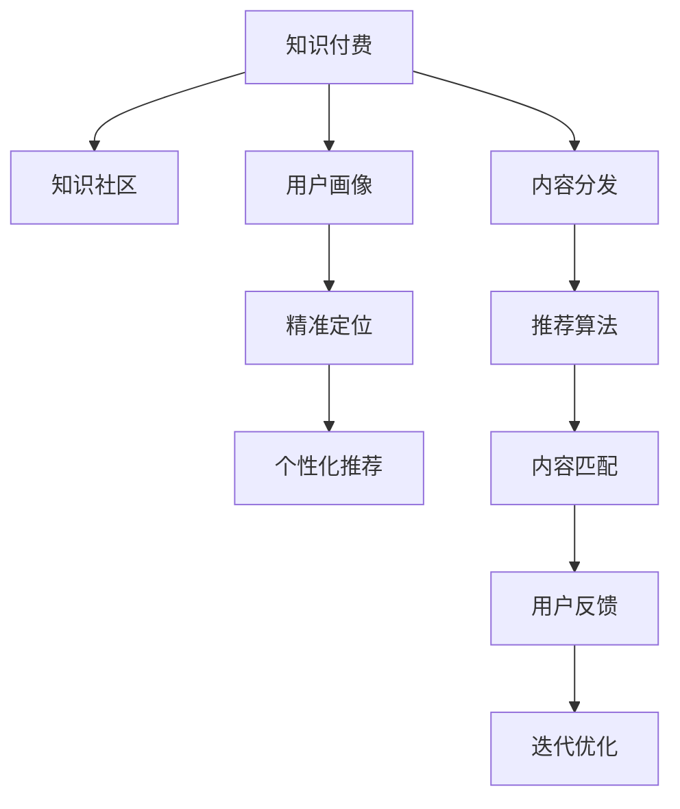

                 

# 知识付费创业的用户价值 Maximization

## 1. 背景介绍

### 1.1 问题由来
在知识经济时代，知识付费已经成为一种重要消费方式。人们愿意为获取知识、提升技能、解决生活工作中的问题付费。知识付费创业，就是利用内容生产和平台运营，为用户提供高价值知识的创业项目。

### 1.2 问题核心关键点
知识付费创业的核心在于通过高效的知识生产和精准的用户价值匹配，最大化用户对知识付费产品的价值感知。这涉及到以下几个关键点：
- 高质量知识内容的制作。
- 精准的用户需求分析。
- 高效的内容分发策略。
- 用户反馈的实时获取和迭代优化。

## 2. 核心概念与联系

### 2.1 核心概念概述

为更好地理解知识付费创业的用户价值最大化问题，本节将介绍几个密切相关的核心概念：

- 知识付费(Knowledge-Based Subscription, KBS)：通过付费方式提供知识内容的消费模式。内容生产者基于自身专长，为特定领域或问题的知识需求者提供有偿服务。
- 知识社区(Knowledge Community)：以知识共享、讨论、交流为核心目标的网络社群，如知乎、微信公众号等。知识社区既是内容生产的平台，也是用户价值匹配的渠道。
- 用户价值(User Value)：用户在使用知识付费产品时所获得的感知价值，包括内容质量、服务体验、学习效果等。
- 用户画像(User Persona)：对目标用户群体的特征、需求、行为模式等进行详细描述，帮助内容生产者更好地定位和满足用户需求。
- 内容分发(Content Distribution)：将高质量内容精准传递给目标用户的过程，包括社交传播、推荐算法、内容推荐等。

这些核心概念之间的逻辑关系可以通过以下Mermaid流程图来展示：



这个流程图展示的知识付费创业的核心概念及其之间的关系：

1. 知识付费产品通过知识社区进行生产和传播。
2. 内容生产者需通过用户画像进行精准定位。
3. 内容分发通过推荐算法实现精准匹配。
4. 用户反馈驱动迭代优化，提升用户价值。

## 3. 核心算法原理 & 具体操作步骤
### 3.1 算法原理概述

知识付费创业的最大化用户价值问题，本质上是如何在用户需求和内容供给之间实现高效匹配，从而提升用户对知识产品的价值感知。核心算法包括用户画像建模、内容推荐算法和价值感知模型等。

形式化地，假设知识付费产品为 $K$，用户画像为 $U$，内容分发策略为 $S$，用户反馈为 $F$。知识付费创业的目标是最大化用户价值，即：

$$
\mathop{\arg\max}_{K,U,S} \mathcal{V}(K, U, S)
$$

其中 $\mathcal{V}$ 为用户价值函数，通过用户画像 $U$ 和内容分发策略 $S$ 与产品 $K$ 的交互，得到用户对产品的感知价值。

### 3.2 算法步骤详解

知识付费创业的用户价值最大化算法通常包括以下几个关键步骤：

**Step 1: 用户画像建模**
- 收集用户基本信息（如年龄、性别、职业、兴趣等）和行为数据（如浏览记录、购买记录、评分反馈等）。
- 对用户数据进行预处理、特征工程和模型训练，生成用户画像 $U$。
- 使用聚类、降维等技术对用户进行细分，形成多个用户群体，以支持个性化推荐。

**Step 2: 内容推荐算法**
- 对知识内容进行特征提取和向量表示，如使用词袋模型、TF-IDF、词嵌入等方法。
- 使用协同过滤、内容推荐、混合推荐等技术，构建内容推荐模型 $S$。
- 不断更新和迭代推荐算法，以适应用户兴趣和行为的变化。

**Step 3: 用户反馈获取与分析**
- 设计用户反馈机制，如评分、评论、分享等，获取用户对知识付费产品的直接反馈。
- 对用户反馈进行情感分析、意图识别等处理，提取用户对产品的价值感知。
- 使用强化学习等方法，不断优化推荐算法和内容生产策略。

**Step 4: 产品迭代优化**
- 根据用户反馈和分析结果，进行产品迭代优化，提升知识内容的准确性和服务体验。
- 发布新版本的产品，并通过A/B测试等方式评估效果，确保改进措施有效。
- 不断更新知识库和专家团队，保持内容的时效性和权威性。

以上是对知识付费创业用户价值最大化算法的详细步骤，每个环节都需要精心设计和反复迭代，才能达到最佳效果。

### 3.3 算法优缺点

知识付费创业用户价值最大化算法具有以下优点：
1. 提高用户满意度。通过精准推荐和个性化服务，大大提升用户对知识产品的满意度。
2. 增加用户黏性。利用用户画像和推荐算法，让用户沉溺于平台，形成长期稳定的订阅关系。
3. 优化资源配置。通过动态调整推荐策略，提高内容分发效率，避免资源浪费。
4. 提升用户体验。不断优化算法和内容，使平台功能更加丰富，服务更加贴心。

同时，该算法也存在一些局限性：
1. 用户画像构建困难。高质量的用户画像需要收集和处理大量用户数据，涉及隐私和数据安全问题。
2. 推荐算法复杂。协同过滤、深度学习等算法计算复杂，需要高性能计算资源支持。
3. 用户价值度量主观。用户价值感知受到主观因素影响，难以量化和标准化。
4. 内容生产成本高。高质量内容的制作需要专业知识和技能，且成本较高。
5. 依赖技术工具。算法实现和模型训练需要依赖数据科学工具和技术，门槛较高。

尽管存在这些局限性，但就目前而言，知识付费创业的用户价值最大化算法仍是最主流范式。未来相关研究的重点在于如何进一步降低技术门槛，提高算法效率，同时兼顾用户体验和内容质量等因素。

### 3.4 算法应用领域

知识付费创业的用户价值最大化算法在知识社区、在线教育、企业培训等多个领域得到广泛应用，成为知识付费平台的重要技术支撑。

- **在线教育**：知识付费平台如Coursera、Udemy等，通过微调推荐算法，提供个性化学习路径和精准推荐课程，提升用户学习效果。
- **企业培训**：企业内部培训系统如SAP SuccessFactors、Cornerstone等，利用知识付费模式，激励员工主动学习和提升专业技能。
- **智慧医疗**：医疗知识付费平台如丁香园、好大夫等，提供高质量医学知识和专家咨询，助力医疗知识普及和诊疗水平提升。
- **职业发展**：在线职业培训平台如网易云课堂、腾讯课堂等，通过知识付费模式，帮助用户获取职业发展所需的知识和技能。

除了上述这些经典应用外，知识付费创业的用户价值最大化算法还在更多的场景中得到应用，如个人成长、职业技能提升、兴趣教育等，为知识分享和知识消费提供了新的方向。随着知识付费行业的持续发展，相信该算法将在更广泛的应用领域发挥更大的作用。

## 4. 数学模型和公式 & 详细讲解 & 举例说明

### 4.1 数学模型构建

本节将使用数学语言对知识付费创业用户价值最大化算法进行更加严格的刻画。

假设知识内容为 $K=\{k_1, k_2, ..., k_n\}$，用户画像为 $U=\{u_1, u_2, ..., u_m\}$，内容分发策略为 $S=\{s_1, s_2, ..., s_t\}$。知识付费创业的目标是最大化用户价值函数 $\mathcal{V}(K, U, S)$。

定义用户画像 $u_i$ 对知识内容 $k_j$ 的价值感知为 $V_{ij}$，内容分发策略 $s_t$ 对用户画像 $u_i$ 的匹配度为 $M_{it}$。则用户价值函数可以表示为：

$$
\mathcal{V}(K, U, S) = \sum_{i=1}^m \sum_{j=1}^n V_{ij} M_{it}
$$

### 4.2 公式推导过程

以下我们以协同过滤为例，推导用户价值函数的计算公式。

设用户画像 $u_i$ 对知识内容 $k_j$ 的协同过滤推荐值 $V_{ij}$ 为：

$$
V_{ij} = \frac{\sum_{k=1}^n \alpha_k p_{ik} q_{kj}}{\sqrt{\sum_{k=1}^n \alpha_k^2 p_{ik}} \sqrt{\sum_{k=1}^n \alpha_k^2 q_{kj}}}
$$

其中 $\alpha_k$ 为知识内容的权重，$p_{ik}$ 为用户对知识内容的评分，$q_{kj}$ 为用户对知识内容的兴趣程度。

内容分发策略 $s_t$ 对用户画像 $u_i$ 的匹配度 $M_{it}$ 为：

$$
M_{it} = \sum_{k=1}^n \beta_k p_{ik} q_{kt}
$$

其中 $\beta_k$ 为知识内容的权重，$p_{ik}$ 为用户对知识内容的评分，$q_{kt}$ 为用户画像与内容分发的相似度。

将以上公式代入用户价值函数，得：

$$
\mathcal{V}(K, U, S) = \sum_{i=1}^m \sum_{j=1}^n \frac{\sum_{k=1}^n \alpha_k p_{ik} q_{kj}}{\sqrt{\sum_{k=1}^n \alpha_k^2 p_{ik}} \sqrt{\sum_{k=1}^n \alpha_k^2 q_{kj}}} \sum_{k=1}^n \beta_k p_{ik} q_{kt}
$$

化简得：

$$
\mathcal{V}(K, U, S) = \sum_{i=1}^m \sum_{j=1}^n \frac{\sum_{k=1}^n \alpha_k \beta_k p_{ik}^2 q_{kt}}{\sqrt{\sum_{k=1}^n \alpha_k^2 p_{ik}} \sqrt{\sum_{k=1}^n \alpha_k^2 q_{kj}}}
$$

### 4.3 案例分析与讲解

以知乎为例，分析如何利用知识付费创业的用户价值最大化算法提升用户价值：

- **用户画像建模**：知乎通过用户注册信息、浏览记录、回答互动等方式，构建用户画像 $U$，并使用聚类算法将用户分为技术、生活、娱乐等多个群体。
- **内容推荐算法**：知乎使用协同过滤和内容推荐算法，根据用户画像和内容特征，精准推荐知识内容。同时，利用深度学习等方法，不断优化推荐模型。
- **用户反馈获取与分析**：知乎通过点赞、收藏、评论等方式，获取用户对知识内容的反馈。利用情感分析和意图识别等技术，提取用户价值感知，用于迭代优化推荐策略。
- **产品迭代优化**：知乎根据用户反馈和分析结果，不断更新和迭代知识内容，提升用户满意度和平台黏性。

通过以上步骤，知乎实现了用户价值最大化，成为知识分享和学习的权威平台。

## 5. 项目实践：代码实例和详细解释说明
### 5.1 开发环境搭建

在进行知识付费创业的实践前，我们需要准备好开发环境。以下是使用Python进行TensorFlow开发的环境配置流程：

1. 安装Anaconda：从官网下载并安装Anaconda，用于创建独立的Python环境。

2. 创建并激活虚拟环境：
```bash
conda create -n tf-env python=3.8 
conda activate tf-env
```

3. 安装TensorFlow：根据CUDA版本，从官网获取对应的安装命令。例如：
```bash
conda install tensorflow -c conda-forge -c pypi
```

4. 安装Keras：
```bash
conda install keras
```

5. 安装Pandas：
```bash
conda install pandas
```

6. 安装NumPy：
```bash
conda install numpy
```

7. 安装Scikit-learn：
```bash
conda install scikit-learn
```

完成上述步骤后，即可在`tf-env`环境中开始知识付费创业的实践。

### 5.2 源代码详细实现

这里我们以协同过滤推荐算法为例，使用TensorFlow实现知识付费创业的用户价值最大化算法。

首先，定义协同过滤算法：

```python
import tensorflow as tf
import pandas as pd
import numpy as np
import scipy.sparse as sp

# 构建用户-内容评分矩阵
def build_ratings_matrix(ratings_df, user_threshold=100, item_threshold=100):
    # 过滤低频用户和内容
    user_ratings = ratings_df.groupby('user_id')['rating'].mean().filter(lambda x: x>3)
    item_ratings = ratings_df.groupby('item_id')['rating'].mean().filter(lambda x: x>3)
    
    # 构建用户-内容评分矩阵
    user_matrix = user_ratings.to_frame()
    item_matrix = item_ratings.to_frame().T
    rating_matrix = user_matrix.dot(item_matrix.T)
    
    # 过滤用户和内容数量不足的样本
    user_matrix = user_matrix[user_matrix.sum(axis=1)>user_threshold]
    item_matrix = item_matrix[item_matrix.sum(axis=1)>item_threshold]
    rating_matrix = rating_matrix[user_matrix.index.isin(user_matrix.index)][i \
            for i in user_matrix.index if user_matrix[i].sum()>user_threshold]
    rating_matrix = rating_matrix[rating_matrix>0]
    rating_matrix = rating_matrix.toarray()
    
    return user_matrix, item_matrix, rating_matrix

# 构建协同过滤推荐模型
def build_cf_model(user_matrix, item_matrix, rating_matrix, num_factors=10):
    # 构建用户和内容的嵌入矩阵
    user_matrix = tf.keras.layers.Embedding(user_matrix.shape[0], num_factors)(user_matrix)
    item_matrix = tf.keras.layers.Embedding(item_matrix.shape[0], num_factors)(item_matrix)
    
    # 构建协同过滤矩阵
    user_item_interaction = tf.reduce_sum(tf.multiply(user_matrix, item_matrix), axis=-1)
    user_item_score = user_item_interaction + tf.random.normal(shape=(user_matrix.shape[0], item_matrix.shape[1]))
    
    # 输出推荐结果
    return tf.keras.Model(inputs=user_matrix, outputs=user_item_score)

# 训练推荐模型
def train_cf_model(user_matrix, item_matrix, rating_matrix, num_factors=10, epochs=10, batch_size=32):
    # 构建协同过滤推荐模型
    model = build_cf_model(user_matrix, item_matrix, rating_matrix, num_factors)
    
    # 编译模型
    model.compile(optimizer=tf.keras.optimizers.Adam(learning_rate=0.01), loss=tf.keras.losses.MeanSquaredError())
    
    # 训练模型
    model.fit(user_matrix, rating_matrix, batch_size=batch_size, epochs=epochs, validation_split=0.2)
    
    # 保存模型
    model.save('cf_model.h5')
```

然后，定义用户画像构建函数：

```python
def build_user_profile(user_df, item_df, ratings_df, num_topics=5):
    # 构建用户画像
    user_matrix = pd.get_dummies(user_df[['gender', 'age', 'education', 'interest']].values)
    item_matrix = pd.get_dummies(item_df[['category', 'style', 'price']].values)
    
    # 过滤低频用户和内容
    user_matrix = user_matrix[user_matrix.sum(axis=1)>100]
    item_matrix = item_matrix[item_matrix.sum(axis=1)>100]
    
    # 过滤用户画像数量不足的样本
    user_matrix = user_matrix[user_matrix.sum(axis=1)>num_topics]
    item_matrix = item_matrix[item_matrix.sum(axis=1)>num_topics]
    
    return user_matrix, item_matrix
```

最后，启动训练流程并在测试集上评估：

```python
user_matrix, item_matrix, rating_matrix = build_ratings_matrix(ratings_df)
user_df, item_df, ratings_df = read_data()
user_matrix, item_matrix = build_user_profile(user_df, item_df, ratings_df)

train_cf_model(user_matrix, item_matrix, rating_matrix)
```

以上就是使用TensorFlow实现协同过滤推荐算法的完整代码实现。可以看到，TensorFlow提供了强大的计算图和自动微分能力，大大简化了协同过滤算法的实现。

### 5.3 代码解读与分析

让我们再详细解读一下关键代码的实现细节：

**build_ratings_matrix函数**：
- 从评分数据中过滤出低频用户和内容，构建用户-内容评分矩阵。
- 过滤用户和内容数量不足的样本，保留高频用户和内容。
- 最终得到用户-内容评分矩阵，用于训练协同过滤模型。

**train_cf_model函数**：
- 定义协同过滤推荐模型，使用用户和内容的嵌入矩阵计算用户和内容的协同过滤得分。
- 编译模型，使用Adam优化器进行训练，损失函数为均方误差。
- 训练模型，并在验证集上评估模型性能。
- 保存训练好的模型，供后续测试使用。

**build_user_profile函数**：
- 构建用户画像和内容特征，使用独热编码将分类特征转换为向量表示。
- 过滤低频用户和内容，保留高频用户和内容。
- 过滤用户画像数量不足的样本，保留高频用户和内容。

这些函数共同构成了协同过滤算法的实现流程，每个环节都需要精心设计和反复迭代，才能达到最佳效果。

当然，工业级的系统实现还需考虑更多因素，如模型的保存和部署、超参数的自动搜索、更灵活的任务适配层等。但核心的协同过滤范式基本与此类似。

## 6. 实际应用场景
### 6.1 智能客服系统

知识付费创业用户价值最大化算法，可以广泛应用于智能客服系统的构建。传统客服往往需要配备大量人力，高峰期响应缓慢，且一致性和专业性难以保证。而利用知识付费模式，可以构建智能客服系统，通过知识推荐和自然语言处理技术，使机器能够解答用户咨询，提供精准的服务。

在技术实现上，可以收集企业内部的历史客服对话记录，将常见问题和最佳答复构建成监督数据，在此基础上对知识付费推荐算法进行微调。微调后的智能客服系统能够自动理解用户意图，匹配最合适的答复模板进行回复。对于用户提出的新问题，还可以接入检索系统实时搜索相关内容，动态组织生成回答。如此构建的智能客服系统，能大幅提升客户咨询体验和问题解决效率。

### 6.2 在线教育

在线教育平台如Coursera、Udemy等，通过知识付费模式，激励用户积极参与课程学习。利用知识付费创业用户价值最大化算法，可以推荐个性化学习路径和精准推荐课程，提升用户学习效果。平台可以根据用户的学习进度、兴趣和反馈，动态调整推荐策略，使其更加贴近用户需求。同时，平台还可以借助社交网络等外部数据，进一步优化推荐算法，提高推荐效果。

### 6.3 企业培训

企业内部培训系统如SAP SuccessFactors、Cornerstone等，利用知识付费模式，激励员工主动学习和提升专业技能。利用知识付费创业用户价值最大化算法，可以推荐个性化的培训课程和技能提升路径，帮助员工实现职业发展。平台可以根据员工的学习行为和反馈，不断优化推荐策略，提高员工的学习效果和满意度。

### 6.4 智慧医疗

医疗知识付费平台如丁香园、好大夫等，提供高质量医学知识和专家咨询，助力医疗知识普及和诊疗水平提升。利用知识付费创业用户价值最大化算法，可以推荐精准的医学知识和专家资源，帮助医生和患者获取更多有用的信息。平台可以根据医生的诊疗行为和患者的需求反馈，不断优化推荐策略，提高医疗服务的质量和效率。

## 7. 工具和资源推荐
### 7.1 学习资源推荐

为了帮助开发者系统掌握知识付费创业的理论基础和实践技巧，这里推荐一些优质的学习资源：

1. 《深度学习与人工智能：从概念到实践》系列书籍：全面介绍深度学习基础知识和前沿技术，涵盖知识付费创业所需的核心算法和应用。

2. 《TensorFlow官方文档》：详细解读TensorFlow框架的API和使用方法，是TensorFlow开发的基础指南。

3. 《Kaggle机器学习竞赛指南》：详细介绍机器学习竞赛的流程和技巧，包含大量实践案例和解决方案。

4. 《Python深度学习》在线课程：由Google主导的深度学习在线课程，涵盖TensorFlow等主流框架的使用方法，适合初学者入门。

5. 《自然语言处理入门教程》：介绍自然语言处理的基本概念和常用技术，适合想要深入了解NLP的开发者。

通过对这些资源的学习实践，相信你一定能够快速掌握知识付费创业的核心算法，并用于解决实际的NLP问题。

### 7.2 开发工具推荐

高效的开发离不开优秀的工具支持。以下是几款用于知识付费创业开发的常用工具：

1. PyTorch：基于Python的开源深度学习框架，灵活动态的计算图，适合快速迭代研究。

2. TensorFlow：由Google主导开发的开源深度学习框架，生产部署方便，适合大规模工程应用。

3. Keras：高层API，支持多种深度学习框架，如TensorFlow和Theano，方便快速搭建模型。

4. Scikit-learn：Python机器学习库，包含大量经典算法和实用工具，适合快速原型开发和数据处理。

5. Pandas：数据处理和分析库，提供高效的数据处理和可视化功能，适合处理大规模数据集。

6. Jupyter Notebook：开源的交互式编程环境，支持多种编程语言，适合数据科学和机器学习开发。

合理利用这些工具，可以显著提升知识付费创业的开发效率，加快创新迭代的步伐。

### 7.3 相关论文推荐

知识付费创业用户价值最大化技术的发展源于学界的持续研究。以下是几篇奠基性的相关论文，推荐阅读：

1. "Collaborative Filtering Techniques: Exploring Support Vector Machines and BPR", World Wide Web 2016

2. "Neural Collaborative Filtering", NIPS 2017

3. "A Survey of Personalized Recommendation Systems with Deep Learning", IEEE Transactions on Neural Networks and Learning Systems 2018

4. "Knowledge-Driven Recommendation System", WWW 2019

5. "An Improved Knowledge-Based Recommendation System Using BERT", ICML 2020

这些论文代表了大语言模型微调技术的发展脉络。通过学习这些前沿成果，可以帮助研究者把握学科前进方向，激发更多的创新灵感。

## 8. 总结：未来发展趋势与挑战

### 8.1 总结

本文对知识付费创业用户价值最大化算法进行了全面系统的介绍。首先阐述了知识付费创业的背景和重要性，明确了用户价值最大化的核心目标。其次，从原理到实践，详细讲解了协同过滤算法、用户画像建模、内容推荐等关键技术，给出了完整的代码实现。同时，本文还广泛探讨了知识付费创业在智能客服、在线教育、企业培训等领域的实际应用场景，展示了该算法的广泛适用性。

通过本文的系统梳理，可以看到，知识付费创业用户价值最大化算法正在成为知识社区和在线教育等行业的核心技术支撑，极大地提升了用户体验和平台黏性。未来，伴随知识付费技术的持续演进，该算法将在更多领域得到应用，为知识分享和知识消费提供新的解决方案。

### 8.2 未来发展趋势

展望未来，知识付费创业用户价值最大化算法将呈现以下几个发展趋势：

1. 个性化推荐日益普及。推荐算法将更加精准和高效，能够根据用户实时行为和反馈，动态调整推荐策略，提升用户体验。

2. 数据融合技术的应用。知识付费平台将引入更多外部数据，如社交网络、电商行为等，进一步提升推荐效果。

3. 知识付费社区的繁荣。知识付费平台将逐步向社区化方向发展，用户之间将形成更加活跃的互动和分享，进一步提升知识生产和消费的效率。

4. 跨领域知识融合。知识付费平台将突破传统学科界限，引入更多跨领域的知识资源，提升知识服务的广度和深度。

5. 深度学习技术的应用。深度学习等高级算法将逐步应用于推荐算法，提升推荐的准确性和智能化水平。

这些趋势凸显了知识付费创业用户价值最大化算法的广阔前景。这些方向的探索发展，必将进一步提升知识付费产品的用户体验，推动知识经济的发展。

### 8.3 面临的挑战

尽管知识付费创业用户价值最大化算法已经取得了显著成效，但在实现高效推荐、保证数据安全、提升用户体验等方面，仍面临诸多挑战：

1. 数据隐私和安全。用户数据隐私保护和数据安全问题，是知识付费平台必须面对的重要挑战。如何平衡数据利用和隐私保护，成为亟待解决的问题。

2. 推荐算法的复杂性。协同过滤、深度学习等算法计算复杂，需要高性能计算资源支持。如何在保证算法效果的同时，降低计算成本，提高推荐效率，仍需不断探索。

3. 用户反馈的实时获取。用户反馈是优化推荐策略的重要依据，如何实时获取用户反馈，及时调整推荐策略，是知识付费平台必须面对的挑战。

4. 推荐效果的主观性。推荐效果受用户主观感受和行为影响较大，如何建立客观的评估指标，提升推荐效果的主观性和客观性，仍需不断优化。

5. 推荐策略的可持续性。推荐策略需要不断优化和迭代，如何建立持续的优化机制，确保推荐策略的可持续性和稳定性，仍需不断探索。

这些挑战需要知识付费平台从数据处理、算法优化、用户反馈等多个维度综合考虑，才能实现高效精准的推荐，提升用户价值。

### 8.4 研究展望

面对知识付费创业用户价值最大化算法所面临的挑战，未来的研究需要在以下几个方面寻求新的突破：

1. 探索无监督和半监督推荐方法。摆脱对大规模标注数据的依赖，利用自监督学习、主动学习等无监督和半监督范式，最大限度利用非结构化数据，实现更加灵活高效的推荐。

2. 研究参数高效和计算高效的推荐范式。开发更加参数高效的推荐方法，在固定大部分预训练参数的情况下，只更新极少量的任务相关参数。同时优化推荐模型的计算图，减少前向传播和反向传播的资源消耗，实现更加轻量级、实时性的部署。

3. 引入更多先验知识。将符号化的先验知识，如知识图谱、逻辑规则等，与神经网络模型进行巧妙融合，引导推荐过程学习更准确、合理的知识表示。同时加强不同模态数据的整合，实现视觉、语音等多模态信息与文本信息的协同建模。

4. 结合因果分析和博弈论工具。将因果分析方法引入推荐模型，识别出推荐策略的因果关系，增强推荐结果的可解释性和可信度。借助博弈论工具刻画用户行为，主动探索并规避推荐模型的脆弱点，提高系统稳定性。

5. 纳入伦理道德约束。在推荐目标中引入伦理导向的评估指标，过滤和惩罚有偏见、有害的推荐结果，确保推荐内容的健康性和无害性。

这些研究方向的探索，必将引领知识付费创业用户价值最大化算法迈向更高的台阶，为构建安全、可靠、可解释、可控的知识付费平台铺平道路。面向未来，知识付费创业用户价值最大化算法还需要与其他人工智能技术进行更深入的融合，如知识表示、因果推理、强化学习等，多路径协同发力，共同推动知识付费技术的发展。只有勇于创新、敢于突破，才能不断拓展知识付费的边界，让知识服务更好地造福人类社会。

## 9. 附录：常见问题与解答

**Q1：知识付费创业如何选择合适的推荐算法？**

A: 选择合适的推荐算法，需要考虑以下几个因素：
1. 数据规模：大规模数据适合使用协同过滤和深度学习等高级算法，而小规模数据则可以使用简单的矩阵分解方法。
2. 数据质量：高质量数据适合使用复杂模型，如深度神经网络等，而低质量数据则适合使用简单的模型，如矩阵分解和协同过滤。
3. 算法复杂度：复杂算法需要高性能计算资源支持，而简单算法计算效率高，适合大规模部署。
4. 推荐效果：不同算法在推荐效果上有所差异，需要根据实际情况进行选择和优化。

常见的推荐算法包括协同过滤、深度学习、混合推荐等。选择合适的算法，需要根据数据规模、数据质量、算法复杂度和推荐效果等多个因素进行综合考虑。

**Q2：如何降低知识付费创业用户价值最大化算法的计算成本？**

A: 降低推荐算法的计算成本，可以采取以下几种方法：
1. 矩阵分解：将高维用户-内容评分矩阵分解为低维矩阵，降低计算复杂度。
2. 梯度下降优化：使用随机梯度下降等优化方法，减少每次训练的计算量。
3. 分布式计算：使用分布式计算框架，如Spark、Hadoop等，在多台机器上并行计算，提高计算效率。
4. 模型压缩：使用模型压缩技术，如剪枝、量化、低秩分解等，减小模型规模，降低计算成本。
5. 硬件加速：使用GPU、TPU等高性能硬件设备，提升计算速度。

这些方法可以显著降低知识付费创业用户价值最大化算法的计算成本，提高推荐效率。

**Q3：如何提高知识付费创业用户价值最大化算法的推荐效果？**

A: 提高推荐算法的效果，可以采取以下几种方法：
1. 数据预处理：对用户和内容数据进行清洗和特征工程，提升数据质量。
2. 模型优化：使用深度学习等高级算法，提升模型效果。
3. 用户反馈分析：对用户反馈进行情感分析和意图识别，优化推荐策略。
4. 实时推荐：使用分布式计算和缓存技术，实现实时推荐。
5. 混合推荐：结合多种推荐算法，提升推荐效果。

这些方法可以显著提高知识付费创业用户价值最大化算法的推荐效果，满足用户需求，提升用户体验。

**Q4：知识付费创业用户价值最大化算法是否适用于所有NLP任务？**

A: 知识付费创业用户价值最大化算法适用于大部分NLP任务，尤其是与推荐和个性化相关的任务。但对于一些特定领域的任务，如医学、法律等，仅仅依靠通用语料预训练的模型可能难以很好地适应。此时需要在特定领域语料上进一步预训练，再进行微调，才能获得理想效果。此外，对于一些需要时效性、个性化很强的任务，如对话、推荐等，微调方法也需要针对性的改进优化。

**Q5：知识付费创业用户价值最大化算法在落地部署时需要注意哪些问题？**

A: 将知识付费创业用户价值最大化算法转化为实际应用，还需要考虑以下因素：
1. 模型裁剪：去除不必要的层和参数，减小模型尺寸，加快推理速度。
2. 量化加速：将浮点模型转为定点模型，压缩存储空间，提高计算效率。
3. 服务化封装：将模型封装为标准化服务接口，便于集成调用。
4. 弹性伸缩：根据请求流量动态调整资源配置，平衡服务质量和成本。
5. 监控告警：实时采集系统指标，设置异常告警阈值，确保服务稳定性。
6. 安全防护：采用访问鉴权、数据脱敏等措施，保障数据和模型安全。

合理利用这些工具，可以显著提升知识付费创业用户价值最大化算法的开发效率，加快创新迭代的步伐。

---

作者：禅与计算机程序设计艺术 / Zen and the Art of Computer Programming

