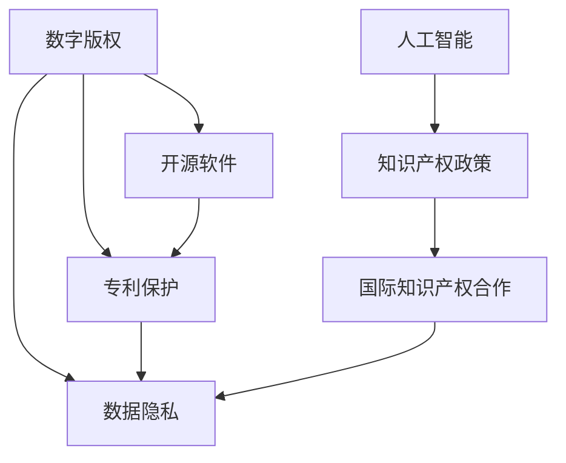

                 

# 知识产权在数字时代的挑战与机遇

> 关键词：数字版权,开源软件,专利保护,知识产权政策,人工智能,知识产权法律

## 1. 背景介绍

### 1.1 问题由来

随着信息技术的迅猛发展和数字经济的蓬勃兴起，数字技术和知识产权之间的关系也变得愈发紧密。一方面，数字技术极大地提高了知识产权的创造、传播和利用效率，为知识创新提供了新动力；另一方面，数字技术也对传统知识产权制度带来了前所未有的挑战。如何在这双重背景下，有效保护数字时代的知识产权，是一个亟待解答的时代课题。

### 1.2 问题核心关键点

1. **数字版权管理**：互联网的开放特性带来了盗版和侵权问题的蔓延，如何有效保护数字作品版权，成为一大难题。
2. **开源软件的专利争议**：开源软件在促进技术共享的同时，也引发了关于专利权保护和商业利益分配的争议。
3. **数据隐私保护**：大数据和人工智能的崛起，使得个人信息和隐私数据面临被滥用的风险，如何平衡创新和隐私保护成为焦点。
4. **跨领域知识产权政策**：数字技术跨越了传统领域，如医疗、教育、金融等，如何在不同领域制定和执行统一的知识产权政策。
5. **人工智能的知识产权归属**：AI模型的训练和优化依赖大量数据和计算资源，如何界定这些资源的知识产权归属，成为新的法律挑战。
6. **国际知识产权合作**：数字技术的应用跨越国界，国际间的知识产权保护和合作变得愈发重要，但各国知识产权法律的差异带来了新的挑战。

### 1.3 问题研究意义

研究知识产权在数字时代的挑战与机遇，对于确保创新激励、促进知识共享、保障数字经济健康发展具有重要意义：

1. **确保创新激励**：明确数字时代的知识产权法律框架，可以稳定投资预期，鼓励创新。
2. **促进知识共享**：平衡开放和保护，在促进技术共享的同时，保障创作者利益。
3. **保障数字经济健康发展**：知识产权保护可以规范市场秩序，保护消费者利益，促进数字市场健康发展。
4. **应对国际竞争**：在国际舞台上，有效的知识产权保护和合作是提升国家竞争力的重要手段。

## 2. 核心概念与联系

### 2.1 核心概念概述

为更好地理解数字时代知识产权保护的原理和实践，本节将介绍几个关键概念及其相互联系：

- **数字版权**：指在数字形式存在的作品上，如软件、音乐、视频等，所享有的版权保护。
- **开源软件**：采用开源许可证发布的计算机软件，用户可以自由使用、修改和分发。
- **专利保护**：通过对技术创新给予有限的垄断权，保护发明人对其技术创新的专有权。
- **数据隐私**：指个人在数字活动中产生的数据信息，以及对其数据的处理和保护。
- **人工智能**：通过算法和模型，使计算机模拟人类智能过程的技术。
- **知识产权政策**：政府和国际组织制定的，旨在保护知识产权的法律、规则和指导原则。
- **国际知识产权合作**：各国政府和国际组织在知识产权保护和法律适用方面的合作与协调。

这些概念之间的逻辑关系可以通过以下Mermaid流程图来展示：



这个流程图展示了大数字时代中各个概念之间的联系：

1. 数字版权、开源软件、专利保护和数据隐私都是知识产权保护的重要领域。
2. 人工智能的应用涉及这些领域，同时推动了知识产权政策的发展。
3. 国际知识产权合作旨在解决不同国家之间知识产权保护法律的差异，促进全球知识创新。

## 3. 核心算法原理 & 具体操作步骤
### 3.1 算法原理概述

数字时代的知识产权保护，本质上是一个多学科交叉的复杂问题，涉及法律、技术、经济等多个层面。其核心算法原理可概括为以下几个方面：

1. **版权管理算法**：通过数字水印、区块链等技术手段，确保数字作品的真实性和不可篡改性。
2. **开源软件管理算法**：设计合理的开源许可证，平衡开放和保护，确保贡献者权益。
3. **专利管理算法**：通过专利审查和侵权检测，保护技术创新。
4. **数据隐私保护算法**：使用数据匿名化、差分隐私等技术，确保数据处理过程中的隐私保护。
5. **人工智能管理算法**：设计合理的知识产权归属机制，确保AI模型的创新性。
6. **国际合作算法**：通过国际条约和协议，协调各国知识产权法律差异，促进国际合作。

### 3.2 算法步骤详解

以下详细介绍数字时代知识产权保护的核心算法步骤：

**Step 1: 确定保护对象**

1. 对数字作品、开源软件、数据集、AI模型等各类资源进行识别和分类。
2. 根据资源类型，确定适用的知识产权保护方式，如版权、专利、商标等。

**Step 2: 获取法律支持**

1. 制定和完善知识产权法律框架，确保法律的适应性和前瞻性。
2. 向国际组织提交知识产权保护要求，寻求国际合作。

**Step 3: 实施技术保护**

1. 使用数字水印、区块链等技术，对数字作品和数据进行保护。
2. 设计符合开源许可证的代码和协议，保护开源软件的贡献者权益。
3. 利用专利审查和侵权检测技术，保护技术创新。
4. 采用数据匿名化和差分隐私技术，确保数据隐私。
5. 定义清晰的知识产权归属机制，保护AI模型的创新性。

**Step 4: 监测和执行**

1. 建立监测系统，实时监控知识产权保护状态。
2. 设立维权机制，对侵权行为进行快速反应和处理。
3. 与执法部门合作，加强知识产权保护。

**Step 5: 持续优化**

1. 定期评估知识产权保护效果，识别和改进不足之处。
2. 根据技术发展和新趋势，调整保护策略。

### 3.3 算法优缺点

数字时代的知识产权保护算法具有以下优点：

1. **高效性**：技术手段的应用，提高了知识产权保护的效率和效果。
2. **普适性**：技术手段不局限于特定领域，适用于多种类型的知识产权保护。
3. **适应性**：技术手段能够适应数字时代快速变化的环境。

同时，也存在一些局限性：

1. **技术依赖**：过度依赖技术手段，可能忽视法律和伦理层面的保护。
2. **复杂性**：多种技术手段的结合使用，增加了实施的复杂度。
3. **成本问题**：技术手段的实施需要较高成本，可能对中小企业和小规模项目构成挑战。

### 3.4 算法应用领域

数字时代的知识产权保护算法广泛应用于多个领域，如：

- **数字媒体和出版**：使用数字水印技术保护数字作品版权。
- **软件开发**：通过开源许可证和代码审计，保护开源软件贡献者权益。
- **人工智能应用**：采用AI模型训练的知识产权归属机制，保护技术创新。
- **医疗数据**：使用数据匿名化和差分隐私技术，确保患者隐私保护。
- **金融交易**：利用区块链技术，确保交易数据的真实性和不可篡改性。
- **国际合作**：通过国际条约和协议，协调各国知识产权法律差异，促进全球知识创新。

## 4. 数学模型和公式 & 详细讲解  
### 4.1 数学模型构建

本节将使用数学语言对数字时代知识产权保护的核心算法进行更加严格的刻画。

设数字版权保护对象为 $O$，开源软件为 $S$，专利为 $P$，数据隐私为 $D$，人工智能为 $AI$，国际合作为 $IC$。

则数字时代知识产权保护的整体框架可表示为：

$$
\text{Protection}(O, S, P, D, AI, IC) = f(\text{Legislation}, \text{Technology}, \text{Economics}, \text{Policy})
$$

其中，$f$ 表示综合考虑法律、技术、经济和政策等多因素的复杂函数。

### 4.2 公式推导过程

以下是几个核心算法的数学模型及其推导过程：

**数字版权保护算法**

设数字版权保护对象为 $O$，其版权保护强度为 $P_{O}$，则版权保护强度可表示为：

$$
P_{O} = f(\text{Digital Watermarking}, \text{Blockchain})
$$

其中，$f$ 表示根据数字水印和区块链技术的保护效果，综合评估版权强度。

**开源软件管理算法**

设开源软件 $S$ 的许可证为 $L$，其开源程度为 $P_{S}$，则开源程度可表示为：

$$
P_{S} = f(\text{Open Source License}, \text{Code Audit})
$$

其中，$f$ 表示根据开源许可证和代码审计的效果，综合评估开源程度。

**专利管理算法**

设专利 $P$ 的审查通过率为 $P_{P}$，则专利审查通过率可表示为：

$$
P_{P} = f(\text{Patent Review}, \text{Patent Detection})
$$

其中，$f$ 表示根据专利审查和检测的效果，综合评估专利审查通过率。

**数据隐私保护算法**

设数据隐私保护对象为 $D$，其隐私保护程度为 $P_{D}$，则隐私保护程度可表示为：

$$
P_{D} = f(\text{Data Anonymization}, \text{Differential Privacy})
$$

其中，$f$ 表示根据数据匿名化和差分隐私的效果，综合评估隐私保护程度。

**人工智能管理算法**

设人工智能模型 $AI$ 的创新性为 $P_{AI}$，则创新性可表示为：

$$
P_{AI} = f(\text{Intellectual Property Ownership}, \text{Training Data})
$$

其中，$f$ 表示根据知识产权归属和训练数据的创新性，综合评估人工智能模型的创新性。

**国际合作算法**

设国际合作对象为 $IC$，其合作程度为 $P_{IC}$，则合作程度可表示为：

$$
P_{IC} = f(\text{International Treaties}, \text{International Agreements})
$$

其中，$f$ 表示根据国际条约和协议的效果，综合评估国际合作程度。

### 4.3 案例分析与讲解

**案例1: 数字媒体版权保护**

某数字媒体公司生产了大量数字作品，包括视频、音频等。为了保护这些作品的版权，公司决定采用数字水印技术，并在区块链上记录作品的发布信息和交易记录。通过这样的技术手段，可以确保作品的真实性和不可篡改性，同时，通过区块链的分布式特性，可以追踪作品的传播路径，防止盗版和侵权。

**案例2: 开源软件保护**

某开源软件项目吸引了大量贡献者参与，为了平衡开放和保护，项目组决定使用开源许可证（如Apache 2.0），同时对代码进行严格审计，确保所有贡献的代码都是高质量和无安全漏洞的。通过这种技术和管理手段的结合，既保障了开源软件的贡献者权益，又促进了技术共享。

**案例3: 人工智能模型保护**

某公司开发了一个AI模型，用于图像识别。为了保护模型的知识产权，公司对训练数据进行了加密处理，并在模型发布时附带了知识产权声明，明确了模型训练和优化的归属。这种措施可以防止他人未经授权使用模型，保护公司的技术创新。

## 5. 项目实践：代码实例和详细解释说明
### 5.1 开发环境搭建

在进行知识产权保护算法实践前，我们需要准备好开发环境。以下是使用Python进行OpenSSL开发的简单环境配置流程：

1. 安装OpenSSL：
```bash
sudo apt-get update
sudo apt-get install openssl
```

2. 安装相关工具包：
```bash
pip install cryptography
```

完成上述步骤后，即可在本地环境中开始实践。

### 5.2 源代码详细实现

这里我们以数字水印为例，给出使用OpenSSL进行数字水印保护的PyTorch代码实现。

首先，准备要加密的数据：

```python
import openSSL.crypto

# 创建密钥对
private_key = openSSL.crypto.load_private_key(fileobj=open('private_key.pem'))
public_key = openSSL.crypto.load_public_key(fileobj=open('public_key.pem'))

# 创建加密算法
def encrypt(data, public_key):
    encrypted = public_key.encrypt(data, 256)
    return encrypted

# 加密数据
encrypted_data = encrypt(b'Hello, World!', public_key)
```

然后，进行解密：

```python
def decrypt(encrypted_data, private_key):
    decrypted = private_key.decrypt(encrypted_data)
    return decrypted

# 解密数据
decrypted_data = decrypt(encrypted_data, private_key)
print(decrypted_data)
```

### 5.3 代码解读与分析

让我们再详细解读一下关键代码的实现细节：

**加密算法**

1. 使用OpenSSL库创建密钥对，将私钥和公钥分别存入文件 `private_key.pem` 和 `public_key.pem`。
2. 定义加密函数 `encrypt`，将数据加密后返回密文。
3. 定义解密函数 `decrypt`，将密文解密后返回明文。

**解密算法**

1. 通过私钥解密密文，得到原始数据。
2. 输出解密后的数据。

**代码运行**

1. 加密数据 `Hello, World!`。
2. 使用私钥解密密文，输出原始数据。

可以看到，使用OpenSSL库可以轻松实现数字水印的保护，这为数字作品提供了额外的安全保障。

当然，实际应用中，需要更复杂的算法和更全面的保护措施，如区块链记录、分布式审计等，以确保知识产权的安全性和可追溯性。

## 6. 实际应用场景
### 6.1 数字媒体版权保护

在数字媒体领域，数字版权保护尤为重要。数字作品往往面临着盗版、侵权和非法传播的风险。通过数字水印和区块链等技术手段，可以有效保护数字作品的版权。

例如，某数字音乐平台可以将音乐作品的版权信息写入数字水印，通过区块链记录版权交易信息，确保音乐的版权归属和合法传播。一旦发现盗版或侵权行为，可以通过区块链的分布式特性，快速追踪到侵权源头，并进行法律追责。

### 6.2 开源软件管理

开源软件在促进技术共享的同时，也面临着开源许可证设计和代码审计的挑战。通过合理设计开源许可证，如Apache 2.0、GPL等，可以平衡开放和保护，确保贡献者权益。

例如，某开源项目组采用了Apache 2.0许可证，同时对代码进行严格审计，确保所有贡献的代码都是高质量和无安全漏洞的。这样既能保证代码的开放共享，又能保障项目组对代码的控制权。

### 6.3 数据隐私保护

数据隐私保护在数字时代变得尤为重要。大数据和人工智能的应用，使得个人信息和隐私数据面临被滥用的风险。

例如，某医疗机构在进行患者数据共享时，使用了差分隐私技术，对数据进行匿名化和扰动处理，确保患者隐私不被泄露。同时，通过区块链记录数据共享过程，保障数据共享的透明性和可追溯性。

### 6.4 未来应用展望

随着技术的不断进步，数字时代的知识产权保护将呈现更多新的应用场景：

1. **区块链版权交易平台**：利用区块链技术，构建版权交易平台，确保版权交易的透明性和不可篡改性。
2. **智能合约管理**：通过智能合约，自动化处理版权授权、收益分配等事务，提高管理效率和透明度。
3. **AI模型训练数据保护**：采用差分隐私和联邦学习技术，保护AI模型训练数据的隐私，避免数据泄露和滥用。
4. **跨境知识产权保护**：通过国际知识产权合作，解决跨境知识产权保护的法律差异，促进全球知识创新。
5. **开源软件生态治理**：利用区块链和智能合约技术，构建开源软件生态，确保开源贡献者的权益和项目管理的规范性。

这些应用场景展示了数字时代知识产权保护技术的前景，为构建更安全、高效、透明的数字经济提供了新的可能性。

## 7. 工具和资源推荐
### 7.1 学习资源推荐

为了帮助开发者系统掌握数字时代知识产权保护的理论基础和实践技巧，这里推荐一些优质的学习资源：

1. 《数字版权管理》书籍：深入介绍数字版权保护的技术和法律，适合学术研究和工程实践。
2. 《开源软件许可证管理》课程：介绍开源许可证的设计和应用，帮助理解开源软件的法律和伦理问题。
3. 《专利审查与侵权检测》课程：讲解专利审查和侵权检测的技术手段，适用于专利法从业者和技术开发人员。
4. 《数据隐私保护》书籍：涵盖数据隐私保护的最新技术和管理方法，适合数据科学家和安全专家。
5. 《人工智能知识产权管理》课程：探讨人工智能模型的知识产权归属和保护策略，适用于AI开发者和管理者。
6. 《国际知识产权合作》论文集：收录国际知识产权保护的最新研究，适合研究国际法和跨国企业的法律顾问。

通过对这些资源的学习实践，相信你一定能够全面掌握数字时代知识产权保护的理论和实践，为未来的工作提供坚实的基础。
###  7.2 开发工具推荐

高效的开发离不开优秀的工具支持。以下是几款用于数字时代知识产权保护开发的常用工具：

1. OpenSSL：开源的加密和安全协议库，用于实现数字签名、加密等安全功能。
2. Python：简单易学的编程语言，具有丰富的第三方库，适合快速迭代研究。
3. Open Source Management Tools：如Apache JIRA、GitHub等，用于管理和审计开源软件。
4. Data Privacy Tools：如Google Differential Privacy、OpenDP等，用于实现数据隐私保护。
5. AI Model Management Tools：如Weights & Biases、TensorBoard等，用于管理和监控AI模型的训练和推理。

合理利用这些工具，可以显著提升数字时代知识产权保护任务的开发效率，加快创新迭代的步伐。

### 7.3 相关论文推荐

数字时代知识产权保护的研究源于学界的持续研究。以下是几篇奠基性的相关论文，推荐阅读：

1. 《数字版权管理：原理与实践》：由版权专家撰写，详细介绍了数字版权管理的技术和法律。
2. 《开源软件许可证设计》：探讨了开源许可证的设计原则和实施方法，适合开源社区的开发者和管理者。
3. 《专利审查与侵权检测算法》：介绍专利审查和侵权检测的最新技术，适用于专利法从业者和技术开发者。
4. 《数据隐私保护技术》：涵盖数据隐私保护的最新研究成果，适合数据科学家和安全专家。
5. 《人工智能知识产权归属》：探讨了人工智能模型的知识产权归属问题，适用于AI开发者和管理者。
6. 《国际知识产权合作框架》：介绍国际知识产权合作的最新进展，适合国际法和跨国企业的法律顾问。

这些论文代表了大数字时代知识产权保护的发展脉络。通过学习这些前沿成果，可以帮助研究者把握学科前进方向，激发更多的创新灵感。

## 8. 总结：未来发展趋势与挑战
### 8.1 总结

本文对数字时代知识产权保护的原理和实践进行了全面系统的介绍。首先阐述了数字技术对知识产权保护带来的挑战和机遇，明确了知识产权法律框架、技术手段和国际合作的重要作用。其次，从原理到实践，详细讲解了数字时代知识产权保护的核心算法和操作步骤，给出了代码实例和详细解释。同时，本文还广泛探讨了数字时代知识产权保护在多个行业领域的应用前景，展示了其广阔的发展空间。此外，本文精选了数字时代知识产权保护的学习资源和工具，力求为读者提供全方位的技术指引。

通过本文的系统梳理，可以看到，数字时代知识产权保护技术正在不断演进，成为保障数字经济健康发展的关键手段。受益于数字技术的进步，知识产权保护也展现出新的可能性和机遇，值得各方共同关注和投入。

### 8.2 未来发展趋势

展望未来，数字时代知识产权保护技术将呈现以下几个发展趋势：

1. **技术手段的融合**：未来将更多融合区块链、人工智能、智能合约等新兴技术，提升知识产权保护的效率和安全性。
2. **法律和政策的完善**：随着技术的发展，知识产权法律和政策也将不断更新，以适应新的应用场景和需求。
3. **全球合作加强**：国际知识产权合作将进一步加强，通过全球范围内的协调和共识，提升知识产权保护的整体水平。
4. **人工智能模型的保护**：随着AI技术的发展，对AI模型的知识产权保护将成为一个新的研究热点。
5. **开源软件的社区治理**：开源社区将更加注重开源许可证的设计和管理，促进社区的健康发展和贡献者的权益保护。

### 8.3 面临的挑战

尽管数字时代知识产权保护技术已经取得了显著进展，但在迈向更加智能化、普适化应用的过程中，仍面临诸多挑战：

1. **技术复杂性**：新技术的应用增加了知识产权保护的复杂度，需要更多的技术支持和资源投入。
2. **法律和伦理问题**：数字时代的技术创新带来了新的法律和伦理挑战，需要在保护创新和尊重隐私之间找到平衡。
3. **国际差异**：不同国家和地区的知识产权法律差异，增加了跨国知识产权保护的难度。
4. **资源分配**：大规模数字技术应用所需的计算资源和数据资源，对资源分配和成本控制提出了更高要求。
5. **用户信任**：如何在保障技术创新的同时，确保用户的信任和隐私安全，是一个需要长期关注的问题。

### 8.4 研究展望

面对数字时代知识产权保护所面临的挑战，未来的研究需要在以下几个方面寻求新的突破：

1. **技术手段的简化**：寻找更简单、高效的技术手段，降低知识产权保护的实施门槛。
2. **法律和政策的协调**：制定和完善适应数字时代的新法律和政策，确保法律的普适性和稳定性。
3. **国际合作机制**：通过国际合作，建立统一的技术标准和法律框架，促进全球知识创新。
4. **数据隐私保护**：探索更有效的数据隐私保护技术，保障用户数据的安全和隐私。
5. **人工智能模型管理**：研究AI模型的知识产权归属和保护策略，确保技术创新的公平和透明。

这些研究方向的探索，必将引领数字时代知识产权保护技术迈向更高的台阶，为构建安全、高效、透明的数字经济提供新的动力。总之，数字时代的知识产权保护需要各方共同努力，不断创新和优化，方能实现知识创新的可持续发展和数字经济的繁荣。

## 9. 附录：常见问题与解答

**Q1: 数字时代如何平衡开放与保护？**

A: 数字时代需要寻找开放和保护的平衡点，以促进技术共享和保护贡献者权益。一种有效的方式是采用合适的开源许可证，如Apache 2.0、GPL等，确保代码的开放共享，同时保障贡献者对代码的控制权。此外，通过代码审计和代码质量保证，确保开源项目的健康发展。

**Q2: 如何确保数据隐私不被滥用？**

A: 确保数据隐私不被滥用的关键在于数据收集和使用过程中采取严格的数据隐私保护措施。可以使用数据匿名化、差分隐私等技术，对数据进行处理和扰动，确保用户隐私信息不被泄露。同时，通过区块链技术记录数据处理过程，保障数据的透明性和可追溯性。

**Q3: 人工智能模型的知识产权归属如何界定？**

A: 人工智能模型的知识产权归属需要考虑训练数据的来源、模型的创新性以及开发过程中的贡献者。通常，模型训练使用的公开数据集和算法不属于任何个人或组织的知识产权，但训练数据中可能包含商业秘密或个人隐私，需要特别保护。在开发过程中，对模型的改进和优化是开发者和技术团队的工作成果，可以申请相关专利或获得版权保护。

**Q4: 国际知识产权保护如何应对法律差异？**

A: 国际知识产权保护需要应对不同国家和地区的法律差异，通过国际条约和协议，协调各国的知识产权法律，确保全球范围内的知识创新和保护。例如，世界知识产权组织(WIPO)和区域性知识产权组织（如欧盟、亚太经合组织等）在制定和执行知识产权保护方面发挥着重要作用。

**Q5: 数字版权保护技术如何应对盗版和侵权？**

A: 数字版权保护技术可以通过数字水印和区块链等手段，确保数字作品的真实性和不可篡改性。一旦发现盗版或侵权行为，可以通过区块链的分布式特性，快速追踪到侵权源头，并进行法律追责。此外，还可以通过在线版权监测平台，对数字作品的传播和使用进行实时监控，及时发现和处理侵权行为。

---

作者：禅与计算机程序设计艺术 / Zen and the Art of Computer Programming

