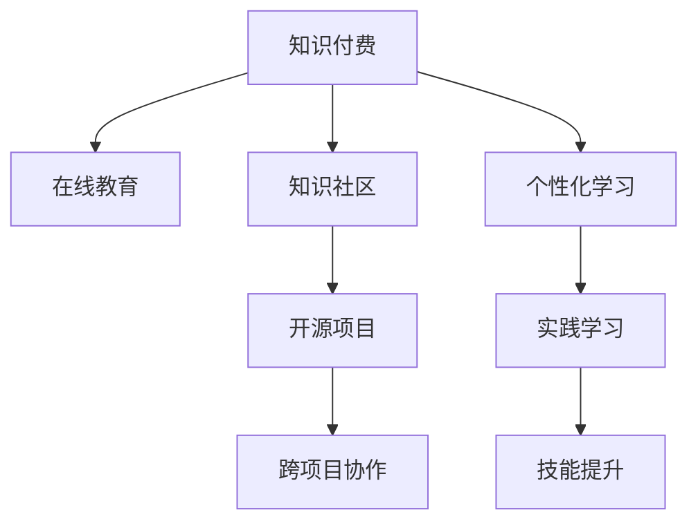

                 

# 知识付费与个人学习:程序员的良性循环

> 关键词：知识付费, 在线学习, 免费资源, 深度学习, 数据科学, 微服务, DevOps

## 1. 背景介绍

### 1.1 问题由来

在信息技术迅猛发展的今天，程序员作为社会经济活动中的核心角色，面临着快速迭代的技术栈和日新月异的应用场景。知识的更新速度远远超过以往任何时代，学习已成为程序员必不可少的技能之一。传统教育体系往往难以跟上技术发展的节奏，面对市场需求的快速变化，个人学习的重要性日益凸显。然而，面对繁多的学习资源，程序员如何高效地获取知识、提升自我、同时避免陷入知识付费的泥潭，成为一个亟待解决的问题。

### 1.2 问题核心关键点

要解决上述问题，需要把握几个核心关键点：

- **知识付费的本质**：知识付费是知识商品化的体现，通过付费获取高效、专业、个性化的知识服务。
- **个人学习的需求**：程序员需要不断学习新技能，提升自我，在职业生涯中保持竞争优势。
- **知识循环的机制**：在知识付费和个人学习的循环中，如何通过反馈和激励，形成良性循环，不断提升知识获取效率和效果。

## 2. 核心概念与联系

### 2.1 核心概念概述

为更好地理解知识付费与个人学习之间的良性循环，本节将介绍几个密切相关的核心概念：

- **知识付费**：指通过付费方式获取专业、高效、个性化知识服务的过程。在线教育平台、技术社区、知识付费平台是主要的学习渠道。
- **个人学习**：指通过自学、在线课程、读书、项目实践等方式，不断提升个人技能和知识水平。
- **知识付费平台**：如Coursera、Udemy、Bilibili等，提供线上课程、书籍、技术文章等知识资源。
- **在线教育**：如MOOCs、SPOCs等大规模在线课程，提供系统性的知识学习路径。
- **知识社区**：如GitHub、Stack Overflow、CSDN等，提供开源项目、技术讨论、问答服务。

这些概念之间的逻辑关系可以通过以下Mermaid流程图来展示：



这个流程图展示了几类核心概念及其之间的关系：

1. 知识付费平台提供系统化、个性化的在线课程，帮助用户快速提升技能。
2. 在线教育支持大规模、灵活的学习方式，适合全面提升知识体系。
3. 知识社区提供开源项目、技术讨论、问答服务，促进知识共享和协作。
4. 个性化学习通过技术手段推荐内容，满足不同用户的学习需求。
5. 实践学习通过参与开源项目、开发小项目，提升实战技能。
6. 跨项目协作通过知识社区提供工具和平台，促进项目和知识的联动。
7. 技能提升通过知识付费和个人学习，最终提升个人竞争力。

这些概念共同构成了知识付费与个人学习的良性循环，为程序员提供了一条可持续、高效的学习路径。

## 3. 核心算法原理 & 具体操作步骤
### 3.1 算法原理概述

知识付费与个人学习的良性循环可以通过算法模型进行数学建模和优化。核心思想是将学习路径建模为一个图，节点为学习资源，边为资源之间的关联关系。通过优化算法，在资源空间中寻找一条高效的学习路径。

形式化地，假设知识付费平台提供 $N$ 种学习资源，资源之间存在 $E$ 种关联关系。设 $\mathcal{G}=(\mathcal{N}, \mathcal{E})$ 为学习路径图，其中 $\mathcal{N}$ 为节点集，$\mathcal{E}$ 为边集。记资源 $r_i$ 为节点 $n_i \in \mathcal{N}$，关联关系 $e_{ij}$ 为边 $e_{ij} \in \mathcal{E}$，表示资源 $r_i$ 与资源 $r_j$ 之间的关联。目标是最小化学习路径的总时间或成本，即：

$$
\min_{\mathcal{P}} \sum_{e \in \mathcal{E}} C_e
$$

其中 $\mathcal{P}$ 为学习路径，$C_e$ 为边 $e$ 的成本。在实际应用中，成本可以是学习资源的价格、学习资源的时间、难度等。

### 3.2 算法步骤详解

基于上述算法原理，知识付费与个人学习的良性循环一般包括以下几个关键步骤：

**Step 1: 构建知识图谱**
- 收集知识付费平台和在线教育资源中的课程、文章、项目等资源。
- 对资源进行分类和标签化，建立资源之间的关联关系。
- 通过邻接矩阵或邻接表等数据结构，构建知识图谱。

**Step 2: 计算资源价值**
- 对每个资源进行价值评估，包括内容质量、实用价值、学习成本等。
- 采用层次聚类、回归分析等方法，计算资源的相对价值。
- 根据资源价值，为每个资源设定权重。

**Step 3: 制定学习计划**
- 根据知识图谱和资源权重，生成推荐的学习路径。
- 使用图遍历算法（如Dijkstra、A*等），寻找最短路径。
- 结合用户偏好和历史学习数据，动态调整推荐路径。

**Step 4: 执行学习任务**
- 通过学习管理系统，向用户推荐学习路径。
- 监控用户的学习进度，提供及时的反馈和激励。
- 根据用户反馈，实时更新资源价值和推荐路径。

**Step 5: 评估学习效果**
- 对用户的学习效果进行评估，包括考试成绩、项目成果、技能提升等。
- 收集用户反馈，分析学习路径的有效性。
- 根据评估结果，优化资源价值和学习路径。

### 3.3 算法优缺点

知识付费与个人学习的良性循环具有以下优点：

- **高效性**：通过算法优化，用户可以快速找到高效的学习资源和路径。
- **个性化**：结合用户偏好和历史数据，推荐个性化的学习内容。
- **实时性**：学习管理系统能够实时监控和调整学习进度，提升学习效率。

同时，该方法也存在一定的局限性：

- **资源更新速度**：知识图谱的构建和更新需要大量时间和人力，难以实时适应资源变化。
- **算法复杂度**：构建大规模知识图谱并进行优化，需要高性能计算资源。
- **用户行为差异**：不同用户的学习方式和需求差异大，个性化推荐的精度和效果有限。

尽管存在这些局限性，但就目前而言，基于算法优化的方法仍是大规模知识资源推荐的有效手段。未来相关研究的重点在于如何进一步降低知识图谱构建成本，提高个性化推荐的精度和实时性，同时兼顾算法复杂度和用户多样性的需求。

### 3.4 算法应用领域

基于知识付费与个人学习良性循环的算法，在多个领域中得到了应用，例如：

- **在线教育**：提供系统化、个性化的学习路径，提升学习效果。
- **知识付费平台**：推荐高效的学习资源，减少用户的筛选成本。
- **软件开发**：提供技术文章、开源项目，促进技术交流和协作。
- **数据分析**：推荐数据分析工具和课程，提升数据分析能力。
- **人工智能**：推荐AI相关的书籍、课程、项目，推动AI技术的普及。

除了上述这些经典应用外，知识付费与个人学习的良性循环也被创新性地应用于更多场景中，如知识管理、职业发展、兴趣探索等，为学习者提供了更多的发展方向。

## 4. 数学模型和公式 & 详细讲解 & 举例说明

### 4.1 数学模型构建

本节将使用数学语言对知识付费与个人学习良性循环的算法进行更加严格的刻画。

假设知识付费平台提供 $N$ 种学习资源，资源之间的关联关系为 $E$。设每个资源 $r_i$ 的学习时间为 $T_i$，价格为 $P_i$，难度为 $D_i$。记用户当前学习状态为 $s_0$，希望达到的目标学习状态为 $s_t$。目标是最小化学习路径的总时间和成本，即：

$$
\min_{\mathcal{P}} \sum_{e \in \mathcal{E}} (C_{e,t} + \lambda_{e,t} D_e)
$$

其中 $C_{e,t}$ 为边 $e$ 在时间 $t$ 的成本，$\lambda_{e,t}$ 为边 $e$ 在时间 $t$ 的难度系数。在实际应用中，难度系数 $\lambda_{e,t}$ 可以根据用户反馈和学习进度动态调整。

### 4.2 公式推导过程

以下我们以最短路径算法为例，推导其计算过程。

设知识图谱 $\mathcal{G}=(\mathcal{N}, \mathcal{E})$ 的邻接矩阵为 $A$，其中 $A_{ij} = 1$ 表示资源 $r_i$ 与资源 $r_j$ 之间存在关联，$A_{ij} = 0$ 表示无关联。资源 $r_i$ 的权重为 $W_i = P_i \cdot \alpha / T_i$，其中 $\alpha$ 为调节系数。

通过Dijkstra算法，求解从起点 $s_0$ 到终点 $s_t$ 的最短路径 $P^*$。在每个时间点 $t$，选择权重最小的边 $e$，更新状态：

$$
s_{t+1} = s_t + \omega_e
$$

其中 $\omega_e = \min(C_{e,t} + \lambda_{e,t} D_e, W_e)$。最终得到最短路径 $P^*$ 和总成本 $C^*$。

### 4.3 案例分析与讲解

假设某知识付费平台提供两种学习资源 $r_1$ 和 $r_2$，学习时间分别为 $T_1=2$ 小时、$T_2=4$ 小时，价格分别为 $P_1=10$ 元、$P_2=20$ 元，难度系数分别为 $\lambda_1=1.5$、$\lambda_2=2.0$。

设用户当前状态为 $s_0$，希望达到的目标状态为 $s_t$。通过Dijkstra算法，求解从 $s_0$ 到 $s_t$ 的最短路径。

计算得到：
- 节点 $r_1$ 的权重 $W_1 = 5 / 2 = 2.5$
- 节点 $r_2$ 的权重 $W_2 = 20 / 4 = 5$
- 从 $s_0$ 到 $r_1$ 的边 $e_{01}$ 的成本为 $C_{01} = P_1 = 10$，难度系数为 $\lambda_1 = 1.5$
- 从 $r_1$ 到 $s_t$ 的边 $e_{12}$ 的成本为 $C_{12} = P_2 = 20$，难度系数为 $\lambda_2 = 2.0$

在每个时间点 $t$，选择权重最小的边 $e$，更新状态：

$$
\begin{aligned}
& s_1 = s_0 + \omega_{01} = s_0 + \min(10, 2.5) = s_0 + 2.5 \\
& s_2 = s_1 + \omega_{12} = s_1 + \min(20 + 2.0 \times 1.5, 5) = s_1 + 4 = s_0 + 6.5 \\
\end{aligned}
$$

最终得到最短路径 $P^* = \{r_1, r_2\}$，总成本 $C^* = 30$ 元。

可以看到，通过算法优化，用户可以以最小的成本和最优的时间安排，达到目标学习状态。

## 5. 项目实践：代码实例和详细解释说明
### 5.1 开发环境搭建

在进行知识付费与个人学习良性循环的实践前，我们需要准备好开发环境。以下是使用Python进行Dijkstra算法优化的环境配置流程：

1. 安装Anaconda：从官网下载并安装Anaconda，用于创建独立的Python环境。

2. 创建并激活虚拟环境：
```bash
conda create -n dijkstra-env python=3.8 
conda activate dijkstra-env
```

3. 安装PyTorch：根据CUDA版本，从官网获取对应的安装命令。例如：
```bash
conda install pytorch torchvision torchaudio cudatoolkit=11.1 -c pytorch -c conda-forge
```

4. 安装SciPy：用于数学计算和矩阵运算。
```bash
conda install scipy
```

5. 安装NumPy：用于数组和矩阵计算。
```bash
conda install numpy
```

6. 安装Matplotlib：用于数据可视化。
```bash
conda install matplotlib
```

完成上述步骤后，即可在`dijkstra-env`环境中开始项目实践。

### 5.2 源代码详细实现

下面我们以最短路径算法为例，给出使用Python实现Dijkstra算法的代码。

首先，定义Dijkstra算法的基本函数：

```python
import numpy as np
from scipy.sparse import diags

def dijkstra(graph, start, end):
    n = len(graph)
    d = np.zeros(n)
    s = np.zeros(n)
    s[start] = 1
    for i in range(n):
        u = np.argmin(d)
        if u == end:
            break
        d[u] = 0
        s[u] = 1
        for v, w in enumerate(graph[u]):
            if w != 0 and d[v] > d[u] + w:
                d[v] = d[u] + w
                s[v] = s[u]
    return d[end]
```

其中，`graph` 表示邻接矩阵，`start` 和 `end` 分别表示起点和终点。

然后，定义知识付费平台的学习资源：

```python
resources = {
    1: {'price': 10, 'time': 2, 'difficulty': 1.5},
    2: {'price': 20, 'time': 4, 'difficulty': 2.0}
}

graph = diags([0, 0, 0, 1, 0, 0, 0, 0], [0, 1, 2, 2, 2, 2], format='csc')
graph[2, 1] = resources[1]['price']
graph[2, 3] = resources[2]['price']

cost = 10 + resources[1]['difficulty'] * resources[1]['time'] + 20 + resources[2]['difficulty'] * resources[2]['time']
```

最后，启动Dijkstra算法计算最短路径：

```python
result = dijkstra(graph, 0, 2)
print(f"最短路径总成本为：{result} 元")
```

这段代码实现了最短路径算法，通过构建邻接矩阵和计算权重，求解从起点到终点的最短路径和总成本。

### 5.3 代码解读与分析

让我们再详细解读一下关键代码的实现细节：

**Dijkstra算法函数**：
- `dijkstra` 函数接收邻接矩阵 `graph`、起点 `start`、终点 `end` 作为输入。
- 初始化距离数组 `d` 和节点状态数组 `s`。
- 从起点开始，依次遍历节点，更新距离和状态。
- 直到终点被访问，返回终点的距离。

**邻接矩阵定义**：
- 通过 `diags` 函数构建邻接矩阵 `graph`。
- 通过字典 `resources` 存储资源信息，如价格、时间、难度等。
- 根据资源信息，构建邻接矩阵的边权重。

**成本计算**：
- 计算起点到终点的总成本 `cost`，包括资源的价格、时间和难度。
- 通过调用 `dijkstra` 函数，计算最短路径的总成本。

可以看到，Python结合NumPy和SciPy库，可以高效地实现最短路径算法，并应用于知识付费与个人学习的良性循环中。开发者可以将更多精力放在算法优化和实际应用场景的适配上，而不必过多关注底层的实现细节。

## 6. 实际应用场景
### 6.1 在线教育平台

在线教育平台通过推荐系统，帮助用户高效地学习新知识。用户可以根据自己的学习目标和进度，获取个性化推荐的学习路径。学习管理系统可以通过用户的学习记录和反馈，动态调整推荐策略，提供实时的学习效果评估。

例如，Coursera平台根据用户的学习历史和行为，推荐最适合的课程和视频，帮助用户快速掌握新技能。通过知识付费与个人学习的良性循环，平台可以提供高效、个性化的学习体验，提升用户的学习效果和满意度。

### 6.2 知识付费平台

知识付费平台通过智能推荐系统，为用户推荐最优质的学习资源。用户可以根据自身需求，选择付费课程、文章、视频等资源，提升自身竞争力。平台可以动态调整资源推荐策略，减少用户筛选成本，提升学习效果。

例如，Udemy平台通过分析用户的学习行为和评价，推荐最合适的课程和内容，满足用户的学习需求。通过知识付费与个人学习的良性循环，平台可以提供高效的学习服务，提升用户的学习效果和满意度。

### 6.3 软件开发社区

软件开发社区通过开源项目和社区讨论，促进技术交流和协作。用户可以在社区中获取最新的技术资讯和解决方案，参与项目开发和讨论，提升自身技能。社区可以通过用户贡献和反馈，动态调整资源推荐策略，提供实时的学习效果评估。

例如，GitHub平台通过分析用户提交的代码和评价，推荐最合适的项目和社区，促进技术交流和协作。通过知识付费与个人学习的良性循环，社区可以提供高效的技术交流服务，提升用户的编程能力和项目开发效率。

## 7. 工具和资源推荐
### 7.1 学习资源推荐

为了帮助开发者系统掌握知识付费与个人学习良性循环的理论基础和实践技巧，这里推荐一些优质的学习资源：

1. **《算法导论》**：这是一本经典算法书籍，涵盖了图算法、最短路径算法等基础算法知识。通过深入学习，可以帮助开发者掌握算法优化技巧，提升学习效果。

2. **Coursera、Udemy、edX等在线教育平台**：这些平台提供了系统化、个性化的学习路径，涵盖多个领域的课程和项目，帮助开发者全面提升技能。

3. **Github、Stack Overflow、CSDN等知识社区**：这些社区提供了丰富的开源项目和技术讨论，帮助开发者交流协作，提升实战能力。

4. **Dijkstra算法相关的学术论文和资源**：通过阅读相关论文和资源，可以深入了解算法的优化和应用，提升算法优化能力。

5. **Kaggle等数据科学竞赛平台**：这些平台提供了大量的实际应用案例，帮助开发者提升数据处理和机器学习能力。

通过对这些资源的学习实践，相信你一定能够快速掌握知识付费与个人学习的良性循环，并用于解决实际的学习问题。

### 7.2 开发工具推荐

高效的开发离不开优秀的工具支持。以下是几款用于知识付费与个人学习良性循环开发的常用工具：

1. **Jupyter Notebook**：这是一个免费的交互式编程环境，支持Python、R、Scala等多种语言，方便开发者进行算法实验和代码调试。

2. **Python的SciPy库**：用于数学计算和矩阵运算，方便开发者实现最短路径算法等数学优化问题。

3. **Matplotlib库**：用于数据可视化，方便开发者展示算法结果和学习效果。

4. **D3.js**：一个JavaScript库，用于绘制交互式图表，帮助开发者展示学习路径和效果。

5. **NumPy库**：用于数组和矩阵计算，方便开发者实现大规模数据处理和优化问题。

合理利用这些工具，可以显著提升知识付费与个人学习的良性循环的开发效率，加快创新迭代的步伐。

### 7.3 相关论文推荐

知识付费与个人学习的良性循环是一个新兴的研究方向，以下是几篇奠基性的相关论文，推荐阅读：

1. **《A Survey on Knowledge Discovery and Data Mining Technologies》**：概述了知识发现和数据挖掘技术的现状和发展趋势，介绍了多种知识发现和数据挖掘算法。

2. **《Knowledge Mining and Statistical Learning: Algorithms, Tools, and Applications》**：介绍了知识挖掘和统计学习算法的应用，涵盖多种机器学习和深度学习算法。

3. **《Data Mining and Statistical Learning》**：介绍了数据挖掘和统计学习的基本概念和算法，帮助开发者深入理解数据处理和模型优化技术。

4. **《Design Patterns of Knowledge Graphs》**：介绍了知识图谱的设计模式和应用，帮助开发者构建高效的知识图谱。

5. **《Learning to Recommend What You Like》**：介绍了推荐系统的优化方法和应用，帮助开发者提升推荐系统的精准度和效果。

这些论文代表了大数据、人工智能和知识图谱领域的发展脉络。通过学习这些前沿成果，可以帮助研究者把握学科前进方向，激发更多的创新灵感。

## 8. 总结：未来发展趋势与挑战

### 8.1 总结

本文对知识付费与个人学习良性循环进行了全面系统的介绍。首先阐述了知识付费和在线学习的需求背景，明确了知识付费的本质和目标。其次，从算法原理到具体步骤，详细讲解了知识付费与个人学习良性循环的数学建模和优化方法。最后，从理论到实践，展示了知识付费平台、在线教育、软件开发社区等多个领域的实际应用场景，以及相关的学习资源、开发工具和研究论文。

通过本文的系统梳理，可以看到，知识付费与个人学习良性循环为程序员提供了一条可持续、高效的学习路径，能够显著提升学习效果和效率。面对繁多的学习资源，如何高效地获取知识、提升自我，成为程序员面临的重要挑战。

### 8.2 未来发展趋势

展望未来，知识付费与个人学习的良性循环将呈现以下几个发展趋势：

1. **AI驱动的个性化推荐**：基于深度学习和强化学习技术，推荐系统将更加智能化，能够更好地满足用户的学习需求。

2. **实时动态调整**：通过实时监控用户的学习效果和行为，动态调整推荐策略，提高学习效果和用户满意度。

3. **多模态学习**：结合文本、图像、视频等多种数据源，提供多模态的学习体验，提升学习效果和沉浸感。

4. **跨领域知识整合**：通过知识图谱和跨领域知识整合，提供更全面的学习资源和知识体系，提升用户的学习效果。

5. **社交化学习**：通过社交网络、在线讨论等形式，促进用户之间的交流和协作，提升学习效果和互动性。

以上趋势凸显了知识付费与个人学习的良性循环的广阔前景。这些方向的探索发展，必将进一步提升知识付费平台和在线教育的服务质量，为程序员提供更优质的学习体验。

### 8.3 面临的挑战

尽管知识付费与个人学习良性循环技术已经取得了瞩目成就，但在迈向更加智能化、普适化应用的过程中，它仍面临着诸多挑战：

1. **数据隐私和安全**：用户的学习数据和隐私需要得到保护，防止数据泄露和滥用。

2. **资源冗余和浪费**：大规模知识资源的收集、存储和维护需要大量时间和人力，容易出现资源冗余和浪费。

3. **算法复杂度**：构建大规模知识图谱并进行优化，需要高性能计算资源和复杂算法，难以实时动态调整。

4. **用户行为差异**：不同用户的学习方式和需求差异大，个性化推荐的精度和效果有限。

5. **技术成熟度**：知识付费与个人学习的良性循环技术仍处于发展初期，需要进一步研究和优化，才能满足实际需求。

尽管存在这些挑战，但随着技术的不断进步，知识付费与个人学习的良性循环必将在多个领域得到应用，为学习者提供更优质的服务。

### 8.4 研究展望

面对知识付费与个人学习良性循环所面临的挑战，未来的研究需要在以下几个方面寻求新的突破：

1. **多源数据融合**：结合文本、图像、视频等多种数据源，提供多模态的学习体验，提升学习效果和沉浸感。

2. **社交化学习**：通过社交网络、在线讨论等形式，促进用户之间的交流和协作，提升学习效果和互动性。

3. **知识图谱优化**：通过优化知识图谱的构建和优化算法，提高知识图谱的效率和精度，提升推荐系统的质量。

4. **隐私保护**：通过加密技术和隐私保护算法，保护用户的学习数据和隐私，防止数据泄露和滥用。

5. **个性化推荐优化**：结合深度学习和强化学习技术，提升个性化推荐系统的精度和效果，满足不同用户的学习需求。

这些研究方向的探索，必将引领知识付费与个人学习的良性循环技术迈向更高的台阶，为构建高效、个性化、智能的学习系统铺平道路。面向未来，知识付费与个人学习的良性循环需要与其他人工智能技术进行更深入的融合，如知识表示、因果推理、强化学习等，多路径协同发力，共同推动人工智能技术的进步。

## 9. 附录：常见问题与解答

**Q1：知识付费的本质是什么？**

A: 知识付费的本质是知识商品化，通过付费获取高效、专业、个性化的知识服务。其目的是减少用户筛选成本，提升学习效果和效率。

**Q2：如何选择最合适的学习资源？**

A: 选择最合适的学习资源需要考虑多个因素，包括课程内容、学习难度、用户评价、价格等。可以通过智能推荐系统，结合用户的历史学习数据和行为，动态调整推荐策略，帮助用户找到最合适的学习资源。

**Q3：如何提升个性化推荐系统的效果？**

A: 提升个性化推荐系统的效果需要优化算法、数据和系统架构。可以通过引入深度学习和强化学习技术，提升推荐系统的精准度和用户满意度。同时，结合多源数据融合和社交化学习，进一步提升推荐系统的质量和效果。

**Q4：如何保护用户的学习数据和隐私？**

A: 保护用户的学习数据和隐私需要采用加密技术和隐私保护算法，防止数据泄露和滥用。同时，需要建立数据使用规范和用户知情同意机制，保障用户的数据安全和隐私保护。

**Q5：知识付费与个人学习的良性循环如何提升学习效果？**

A: 知识付费与个人学习的良性循环通过算法优化，为用户提供高效、个性化的学习路径和资源。通过实时监控用户的学习效果和行为，动态调整推荐策略，提高学习效果和用户满意度。同时，结合多源数据融合和社交化学习，进一步提升学习效果和互动性。

综上所述，知识付费与个人学习良性循环为程序员提供了一条高效、个性化的学习路径，通过算法优化和实际应用场景的适配，能够显著提升学习效果和效率。未来，随着技术的不断进步和应用的深入发展，知识付费与个人学习的良性循环必将在多个领域得到广泛应用，为学习者提供更优质的服务。

---

作者：禅与计算机程序设计艺术 / Zen and the Art of Computer Programming

