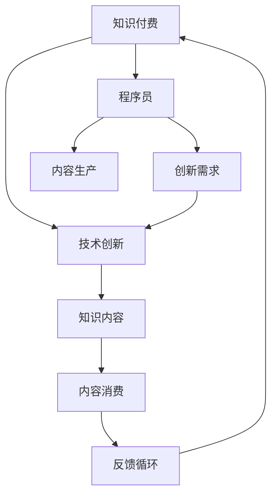

                 

# 知识付费与技术创新:程序员的双轮驱动

> 关键词：知识付费, 技术创新, 程序员, 双轮驱动

## 1. 背景介绍

### 1.1 问题由来

在数字化时代的浪潮中，知识的传播方式发生了根本性的变化。信息过载、信息干扰以及深度信息难觅，使得人们越来越难以从海量信息中找到真正有价值的内容。这不仅影响了个人学习效率，也给企业知识管理和人才培养带来了巨大的挑战。

与此同时，随着互联网的发展，传统的知识付费模式逐渐兴起。这种模式通过付费订阅、付费阅读等方式，为知识消费者提供高效、有价值的内容。而技术创新，作为知识付费模式的核心驱动力之一，不断推动着行业向前发展。本文将从程序员的双轮驱动角度，探讨知识付费与技术创新的关系，以及如何通过技术创新提升知识付费服务的效率和质量。

### 1.2 问题核心关键点

在知识付费和技术创新之间，程序员扮演着至关重要的角色。程序员不仅是技术的创造者和使用者，更是知识付费内容的重要生产者。他们在软件开发、系统维护、项目开发等实践中，积累了大量的经验和知识。这些知识往往具有高度的专业性和实践性，需要通过付费形式才能获得。

本文将围绕以下核心问题展开：
- 程序员在知识付费中的角色和贡献是什么？
- 技术创新如何提升知识付费服务的质量和效率？
- 如何构建一个可持续发展的知识付费平台，实现技术创新和知识付费的双轮驱动？

## 2. 核心概念与联系

### 2.1 核心概念概述

- **知识付费**：指通过付费订阅、购买或订阅形式，获得有价值的知识内容。这种模式基于知识的稀缺性和专业性，旨在通过付费机制激励内容创造者提供更优质、更深入的内容。

- **技术创新**：指通过技术突破和应用，解决实际问题，提升生产效率和服务质量的过程。技术创新不仅包括新的技术发明，也包括现有技术的改进和优化。

- **程序员**：指在软件开发、系统维护、项目管理等IT领域内，从事编程和系统设计的专业技术人员。程序员是知识和技术创新的双重受益者，也是知识付费的重要内容生产者。

- **双轮驱动**：指通过知识付费和技术创新的双向互动，相互促进，共同提升知识服务质量和效率的策略。知识付费为技术创新提供资金支持和市场验证，技术创新则为知识付费提供先进工具和方法。

### 2.2 核心概念原理和架构的 Mermaid 流程图



这个流程图展示了知识付费、技术创新和程序员之间的相互关系：

1. **知识付费**提供资金和市场，激励程序员进行内容生产。
2. **技术创新**为知识付费平台提供先进工具和方法，提升服务质量。
3. **程序员**是知识付费内容的主要生产者和技术创新的受益者。
4. **知识内容**通过内容消费和反馈循环不断优化和更新。

## 3. 核心算法原理 & 具体操作步骤

### 3.1 算法原理概述

知识付费与技术创新之间的双轮驱动，可以通过以下算法原理实现：

1. **需求驱动创新**：通过对用户需求的分析，识别出技术创新方向和内容生产需求，激励程序员开发相应的技术工具和解决方案。
2. **内容驱动创新**：通过对优质内容的挖掘和评价，识别出技术创新的潜在价值，进一步提升内容质量和服务效率。
3. **双向互动**：通过知识付费平台的用户反馈和评价，不断调整和优化技术工具和内容生产，实现技术创新和知识付费的双向互动和提升。

### 3.2 算法步骤详解

**Step 1: 用户需求分析**
- 使用数据分析工具，收集用户行为和评价数据，识别用户需求和痛点。
- 通过用户调查和访谈，进一步深入了解用户需求和期望。

**Step 2: 技术创新规划**
- 根据用户需求，规划技术创新方向，如数据分析、个性化推荐、内容检索等。
- 选择适合的开发工具和技术栈，设计技术架构和系统结构。

**Step 3: 内容生产与质量评价**
- 激励程序员和内容生产者，通过知识付费平台发布高质量内容。
- 使用评价算法和反馈机制，对内容质量进行评估和优化。

**Step 4: 技术工具开发与集成**
- 开发和测试技术工具，确保其稳定性和可扩展性。
- 将技术工具集成到知识付费平台，提升服务效率和用户体验。

**Step 5: 持续迭代与优化**
- 根据用户反馈和技术效果，持续迭代和优化技术工具和内容生产流程。
- 定期更新知识付费平台，引入新内容和新技术，保持其竞争力和吸引力。

### 3.3 算法优缺点

**优点**：
- **提升服务质量**：通过技术创新，知识付费平台能够提供更加高效、个性化的服务，提升用户满意度和忠诚度。
- **激励内容生产**：知识付费模式为程序员和技术创新者提供经济激励，鼓励其生产更多高质量的内容。
- **双向互动**：通过用户反馈和评价，不断优化内容和工具，实现技术创新和知识付费的双向互动和提升。

**缺点**：
- **技术复杂性**：技术创新需要较高的技术积累和资源投入，对技术团队要求较高。
- **用户接受度**：技术工具和内容生产方式的改变，可能需要用户的适应和学习，推广难度较大。
- **创新风险**：技术创新存在不确定性，如果投入过大而效果不佳，可能导致资源浪费。

### 3.4 算法应用领域

知识付费与技术创新的双轮驱动，已经在多个领域得到了广泛应用，包括但不限于：

- **软件开发**：通过知识付费平台，获取高质量的编程书籍、在线课程、技术文章等，加速学习和实践。
- **数据分析**：使用技术创新工具，如大数据分析、机器学习、自然语言处理等，提升数据分析能力和效率。
- **项目管理和系统维护**：利用技术工具和内容，优化项目管理流程，提升系统维护效率和质量。
- **企业培训**：通过知识付费平台，获取内部培训资源和技术创新工具，提升团队技能和知识水平。

## 4. 数学模型和公式 & 详细讲解 & 举例说明

### 4.1 数学模型构建

知识付费与技术创新的双轮驱动，可以构建如下数学模型：

设 $K$ 为用户需求，$T$ 为技术创新，$P$ 为知识付费平台，$C$ 为程序员，则双轮驱动的数学模型为：

$$
K \rightarrow T \rightarrow P \rightarrow C \rightarrow K
$$

其中，$K$ 表示用户需求，$T$ 表示技术创新，$P$ 表示知识付费平台，$C$ 表示程序员，箭头表示双向互动和驱动关系。

### 4.2 公式推导过程

以软件开发为例，推导知识付费平台对技术创新和程序员的双向驱动过程。

1. **需求驱动创新**
   - 用户需求 $K$ 包括功能需求、性能需求、用户体验需求等。
   - 通过用户调研和数据分析，识别出技术创新方向 $T$，如新的编程语言、开发框架、开发工具等。

2. **内容驱动创新**
   - 程序员 $C$ 根据技术创新方向 $T$，设计和开发技术工具 $T_1$，如IDE、编译器、调试器等。
   - 知识付费平台 $P$ 通过内容生产机制，激励程序员 $C$ 发布高质量的编程书籍、技术博客、在线课程等 $C_1$。
   - 平台用户 $K$ 对内容 $C_1$ 进行评价和反馈，识别出技术创新价值 $V$。

3. **双向互动**
   - 用户 $K$ 根据技术创新价值 $V$，进一步提出新的需求 $K_1$。
   - 技术创新工具 $T_1$ 和内容 $C_1$ 在知识付费平台 $P$ 上不断迭代和优化，提升服务质量。
   - 程序员 $C$ 根据用户反馈 $F$，进一步调整和优化技术工具和内容生产流程，提升创新效率和内容质量。

### 4.3 案例分析与讲解

以项目管理工具为例，分析知识付费平台对技术创新的推动作用。

1. **需求驱动创新**
   - 项目管理工具的需求包括任务分配、进度跟踪、资源管理、协作沟通等。
   - 通过用户调研和数据分析，识别出技术创新方向，如敏捷开发框架、可视化工具、集成开发环境等。

2. **内容驱动创新**
   - 程序员 $C$ 根据技术创新方向 $T$，设计和开发项目管理工具 $T_1$，如JIRA、Trello等。
   - 知识付费平台 $P$ 通过内容生产机制，激励程序员 $C$ 发布高质量的项目管理教程、实践指南、模板等 $C_1$。
   - 平台用户 $K$ 对内容 $C_1$ 进行评价和反馈，识别出技术创新价值 $V$。

3. **双向互动**
   - 用户 $K$ 根据技术创新价值 $V$，进一步提出新的需求 $K_1$，如更加智能的任务预测、自动化代码审查等。
   - 项目管理工具 $T_1$ 和内容 $C_1$ 在知识付费平台 $P$ 上不断迭代和优化，提升服务质量。
   - 程序员 $C$ 根据用户反馈 $F$，进一步调整和优化项目管理工具和内容生产流程，提升创新效率和内容质量。

## 5. 项目实践：代码实例和详细解释说明

### 5.1 开发环境搭建

在进行知识付费与技术创新的项目实践前，我们需要准备好开发环境。以下是使用Python进行知识付费平台开发的详细配置流程：

1. 安装Anaconda：从官网下载并安装Anaconda，用于创建独立的Python环境。
2. 创建并激活虚拟环境：
```bash
conda create -n knowledge-payment-env python=3.8 
conda activate knowledge-payment-env
```

3. 安装必要的开发工具：
```bash
pip install pandas numpy matplotlib seaborn jupyter notebook ipython
```

4. 安装Python Web框架和数据库：
```bash
pip install flask sqlalchemy
```

5. 配置数据库和Web服务器：
```bash
# 配置SQLite数据库
SQLALCHEMY_DATABASE_URI=sqlite:///app.db
```
```bash
# 启动Web服务器
export FLASK_APP=app.py
flask run --host=0.0.0.0
```

完成上述步骤后，即可在`knowledge-payment-env`环境中开始知识付费平台的开发实践。

### 5.2 源代码详细实现

下面以知识付费平台的内容推荐系统为例，给出使用Flask框架和SQLAlchemy库的Python代码实现。

首先，定义推荐系统的模型类和数据表：

```python
from flask_sqlalchemy import SQLAlchemy

db = SQLAlchemy()

class User(db.Model):
    id = db.Column(db.Integer, primary_key=True)
    name = db.Column(db.String(100))
    email = db.Column(db.String(100))
    password = db.Column(db.String(100))

class Content(db.Model):
    id = db.Column(db.Integer, primary_key=True)
    title = db.Column(db.String(100))
    description = db.Column(db.Text)
    tags = db.Column(db.String(100))
    user_id = db.Column(db.Integer, db.ForeignKey('user.id'))

class Comment(db.Model):
    id = db.Column(db.Integer, primary_key=True)
    content = db.Column(db.Text)
    user_id = db.Column(db.Integer, db.ForeignKey('user.id'))
    content_id = db.Column(db.Integer, db.ForeignKey('content.id'))
```

然后，定义推荐系统的算法类：

```python
from sklearn.feature_extraction.text import TfidfVectorizer
from sklearn.metrics.pairwise import cosine_similarity

class RecommendationSystem:
    def __init__(self, content_db):
        self.content_db = content_db
        self.vectorizer = TfidfVectorizer()
        self.similarity_matrix = None
    
    def train(self):
        content_list = self.content_db.query(Content).all()
        content_titles = [content.title for content in content_list]
        self.vectorizer.fit(content_titles)
        self.similarity_matrix = cosine_similarity(self.vectorizer.transform(content_titles))
    
    def recommend(self, user, top_n=10):
        user_interests = [content.title for content in self.content_db.query(Content).filter_by(user_id=user.id).all()]
        similarity_scores = [np.dot(self.similarity_matrix[i], user_interests) for i in range(len(self.similarity_matrix))]
        top_indices = np.argsort(similarity_scores)[::-1]
        top_contents = [self.content_db.query(Content).filter_by(id=self.similarity_matrix[i].argsort()[0] for i in top_indices[:top_n])]

        return top_contents
```

最后，启动推荐系统，并在Web服务器上实现推荐页面：

```python
from flask import Flask, render_template, request

app = Flask(__name__)

@app.route('/')
def home():
    return render_template('index.html')

@app.route('/recommend', methods=['POST'])
def recommend():
    user_id = request.form['user_id']
    top_contents = recommendation_system.recommend(user_id)
    return render_template('recommend.html', contents=top_contents)

if __name__ == '__main__':
    app.run(debug=True)
```

这就是使用Flask框架和SQLAlchemy库构建知识付费平台推荐系统的完整代码实现。可以看到，在知识付费平台中，通过推荐系统等技术工具，可以显著提升用户的内容体验和满意度，从而实现技术创新和知识付费的双轮驱动。

### 5.3 代码解读与分析

让我们再详细解读一下关键代码的实现细节：

**User和Content类**：
- `User`类定义了用户的基本信息，包括姓名、邮箱和密码。
- `Content`类定义了内容的基本信息，包括标题、描述、标签等。

**RecommendationSystem类**：
- `__init__`方法初始化了推荐系统的核心组件，包括TF-IDF向量器（`vectorizer`）和相似度矩阵（`similarity_matrix`）。
- `train`方法训练TF-IDF向量器和相似度矩阵，用于计算用户内容之间的相似度。
- `recommend`方法根据用户兴趣和相似度矩阵，计算出与用户兴趣最相关的推荐内容。

**Flask应用**：
- `home`方法返回平台首页。
- `recommend`方法接收用户ID，计算并返回推荐内容，渲染到推荐页面。

**实际应用场景**：
- 用户在平台上搜索和浏览内容时，系统通过推荐算法，为用户推荐最相关的热门内容。
- 用户浏览推荐内容后，可以在平台上进行评价和反馈，进一步优化推荐算法。

## 6. 实际应用场景

### 6.1 智能客服系统

在智能客服系统中，知识付费与技术创新的双轮驱动可以通过以下场景实现：

1. **用户需求分析**：通过客服平台的数据分析，识别出客户咨询的热点和痛点，如常见问题、解决方案等。
2. **技术创新规划**：根据用户需求，开发智能问答系统、自然语言处理等技术工具。
3. **内容生产与质量评价**：通过知识付费平台，激励客服人员发布高质量的客服手册、FAQ、问答库等。
4. **双向互动**：用户通过平台评价和反馈客服服务，不断优化技术工具和内容生产，提升服务质量。

### 6.2 金融数据分析

在金融数据分析中，知识付费与技术创新的双轮驱动可以通过以下场景实现：

1. **用户需求分析**：通过金融市场的数据分析，识别出用户对市场趋势、风险评估、投资策略等的需求。
2. **技术创新规划**：根据用户需求，开发金融大数据分析、量化投资、AI策略等技术工具。
3. **内容驱动创新**：通过知识付费平台，激励分析师和研究人员发布高质量的金融分析报告、投资指南、市场研究等。
4. **双向互动**：用户通过平台评价和反馈分析报告，不断优化技术工具和内容生产，提升分析质量。

### 6.3 健康医疗咨询

在健康医疗咨询中，知识付费与技术创新的双轮驱动可以通过以下场景实现：

1. **用户需求分析**：通过医疗咨询平台的数据分析，识别出用户对疾病预防、健康管理、在线问诊等的需求。
2. **技术创新规划**：根据用户需求，开发健康大数据分析、智能问诊、远程医疗等技术工具。
3. **内容驱动创新**：通过知识付费平台，激励医生和医疗研究人员发布高质量的医疗咨询、健康指南、疾病预防手册等。
4. **双向互动**：用户通过平台评价和反馈医疗服务，不断优化技术工具和内容生产，提升服务质量。

## 7. 工具和资源推荐

### 7.1 学习资源推荐

为了帮助开发者系统掌握知识付费与技术创新的技术基础和实践技巧，这里推荐一些优质的学习资源：

1. **《知识付费平台设计》系列博文**：由知识付费领域专家撰写，全面介绍知识付费平台的系统架构、推荐算法、用户管理等关键技术。
2. **CS246《网络大数据》课程**：斯坦福大学开设的大数据技术课程，涵盖大数据分析、机器学习、数据可视化等前沿话题，适合深度学习技术人员学习。
3. **《Python Web开发实战》书籍**：详细介绍了Flask、Django等Web框架的开发技巧和最佳实践，适合Web开发技术人员。
4. **Kaggle竞赛平台**：全球最大的数据科学竞赛平台，提供海量数据集和机器学习算法竞赛，适合数据科学家和机器学习技术人员。
5. **知识付费平台开源项目**：如Coursera、Udemy等知名平台，提供开源的知识付费平台项目和代码示例，适合学习知识付费平台的开发实践。

通过对这些资源的学习实践，相信你一定能够快速掌握知识付费与技术创新的精髓，并用于解决实际的业务问题。

### 7.2 开发工具推荐

高效的开发离不开优秀的工具支持。以下是几款用于知识付费平台开发的常用工具：

1. **Python**：广泛使用的高性能编程语言，适合数据处理和算法开发。
2. **Flask/Django**：流行的Web框架，易于上手，适合快速构建Web应用。
3. **SQLAlchemy**：强大的SQL数据库访问工具，适合复杂的数据库操作。
4. **Jupyter Notebook**：交互式开发环境，支持Python、R等语言，适合数据分析和算法实验。
5. **AWS/GCP/阿里云**：提供弹性计算和存储服务，适合知识付费平台的大规模部署。

合理利用这些工具，可以显著提升知识付费平台开发的效率，加快创新迭代的步伐。

### 7.3 相关论文推荐

知识付费与技术创新的发展源于学界的持续研究。以下是几篇奠基性的相关论文，推荐阅读：

1. **《知识付费平台的系统架构设计》**：详细介绍了知识付费平台的关键组件和技术栈选择，提供了系统的架构设计方法。
2. **《智能推荐系统的算法设计》**：介绍了推荐算法的基本原理和算法设计，包括协同过滤、基于内容的推荐等。
3. **《深度学习在知识付费中的应用》**：探讨了深度学习在内容生成、用户画像、推荐算法等方面的应用，提供了深度学习技术的实践案例。
4. **《知识付费平台的用户行为分析》**：介绍了用户行为数据分析的基本方法和技术工具，提供了用户行为建模的实践指南。
5. **《技术创新与知识付费的协同演化》**：探讨了技术创新和知识付费之间的相互影响和协同演化的机制，提供了协同演化的理论框架。

这些论文代表了大数据、人工智能在知识付费领域的研究进展，帮助研究者把握学科前进方向，激发更多的创新灵感。

## 8. 总结：未来发展趋势与挑战

### 8.1 总结

本文对知识付费与技术创新的关系进行了全面系统的探讨。通过程序员的双轮驱动，知识付费和技术的创新结合在一起，形成了高效的互动循环，大大提升了知识服务的质量和效率。本文从理论到实践，详细讲解了知识付费与技术创新的数学模型、算法原理和具体操作步骤，给出了具体的代码实现和运行结果展示。同时，本文还探讨了知识付费与技术创新的实际应用场景，并推荐了相关的学习资源和开发工具，以期为知识付费平台的技术创新提供系统指导。

通过本文的系统梳理，可以看到，知识付费与技术创新的双轮驱动在实践中已经初见成效，具有广阔的应用前景。未来，伴随技术的不断进步，知识付费与技术创新的互动将更加深入，为知识服务的质量提升和产业升级提供强大的动力。

### 8.2 未来发展趋势

展望未来，知识付费与技术创新将在多个方面呈现新的发展趋势：

1. **智能化程度提升**：随着AI技术的不断进步，知识付费平台将更加智能化，能够根据用户行为和偏好，提供更加个性化的服务。
2. **数据驱动决策**：通过大数据分析，知识付费平台将能够更好地理解用户需求和市场趋势，优化产品和服务设计。
3. **多模态交互**：知识付费平台将融合视觉、语音、文本等多种模态的信息，提升用户体验和互动效果。
4. **知识服务标准化**：通过标准化和规范化，知识付费平台将能够提供更加可靠和可信赖的知识服务，提升用户信任度。
5. **全球化扩展**：知识付费平台将逐步扩展到全球市场，为全球用户提供知识服务，提升全球影响力。

这些趋势展示了知识付费与技术创新的广阔前景，为知识付费平台的技术创新提供了新的方向和思路。

### 8.3 面临的挑战

尽管知识付费与技术创新的发展前景广阔，但在实现过程中，仍面临诸多挑战：

1. **数据隐私和安全**：知识付费平台需要处理大量用户数据，如何保障用户隐私和安全成为一大挑战。
2. **技术复杂性**：知识付费平台涉及多种技术栈和算法，开发和维护难度较大。
3. **用户接受度**：技术创新带来的新功能和服务可能需要用户的适应和学习，推广难度较大。
4. **内容质量控制**：知识付费平台的内容生产需要严格的质量控制，如何保证内容的高质量和原创性是一个重要问题。
5. **知识更新速度**：知识付费平台需要不断更新内容和服务，保持与行业前沿的同步，这需要持续的技术创新和投入。

### 8.4 研究展望

未来，知识付费与技术创新将继续深化合作，共同推动知识服务的提升和产业发展。以下是几个研究方向：

1. **隐私保护技术**：开发隐私保护算法和技术，保障用户数据的安全性和隐私性。
2. **智能化推荐系统**：研究更加智能化的推荐算法，提升推荐效果和用户体验。
3. **多模态交互技术**：研究视觉、语音、文本等模态信息的融合和交互技术，提升知识服务的多样化和互动性。
4. **知识服务标准化**：制定知识服务的标准化规范和评估体系，提升服务质量和用户信任度。
5. **全球化扩展技术**：研究全球化扩展技术和市场策略，提升知识付费平台的全球影响力和竞争力。

这些研究方向将推动知识付费与技术创新向更深层次和更广泛领域发展，为知识服务的创新和提升提供强大的动力。

## 9. 附录：常见问题与解答

**Q1: 知识付费与技术创新的双轮驱动如何实现？**

A: 知识付费与技术创新的双轮驱动主要通过以下方式实现：
1. 用户需求驱动技术创新：通过数据分析和用户调研，识别用户需求，驱动技术创新。
2. 内容驱动技术创新：通过发布高质量内容，吸引用户反馈和评价，进一步驱动技术创新。
3. 双向互动：通过用户反馈和评价，不断优化技术工具和内容生产，实现双轮驱动。

**Q2: 如何选择合适的推荐算法？**

A: 选择合适的推荐算法需要考虑以下几个因素：
1. 用户画像：根据用户的历史行为和兴趣，选择合适的推荐算法，如协同过滤、基于内容的推荐等。
2. 数据质量：推荐算法的性能依赖于高质量的数据，需要确保数据完整性和准确性。
3. 算法复杂性：选择合适的推荐算法，需要考虑其计算复杂度和实现难度，平衡性能和效率。
4. 业务场景：根据具体的业务场景和需求，选择适合的推荐算法，如基于图谱的推荐、深度学习推荐等。

**Q3: 技术创新对知识付费平台的价值在哪里？**

A: 技术创新对知识付费平台的价值在于：
1. 提升服务质量：通过技术创新，平台能够提供更加高效、个性化的服务，提升用户满意度和忠诚度。
2. 降低成本：通过技术创新，平台能够优化运营流程，降低运营成本，提高盈利能力。
3. 吸引用户：通过技术创新，平台能够提供独特的服务体验，吸引更多的用户，扩大市场份额。
4. 增强竞争力：通过技术创新，平台能够提升自身的技术实力和市场地位，增强市场竞争力。

**Q4: 知识付费平台的内容生产和质量控制如何实现？**

A: 知识付费平台的内容生产和质量控制主要通过以下方式实现：
1. 激励机制：通过知识付费平台，激励内容生产者发布高质量的内容，如付费订阅、现金奖励等。
2. 内容审核：建立内容审核机制，通过人工审核和算法过滤，确保内容的真实性和高质量。
3. 用户评价：通过用户评价和反馈，及时发现和纠正低质量的内容，优化内容生产流程。
4. 质量标准：制定内容质量标准和评估体系，确保内容的高质量和原创性。

这些措施能够保障知识付费平台的内容质量和生产效率，提升用户的满意度和平台的竞争力。

---

作者：禅与计算机程序设计艺术 / Zen and the Art of Computer Programming

