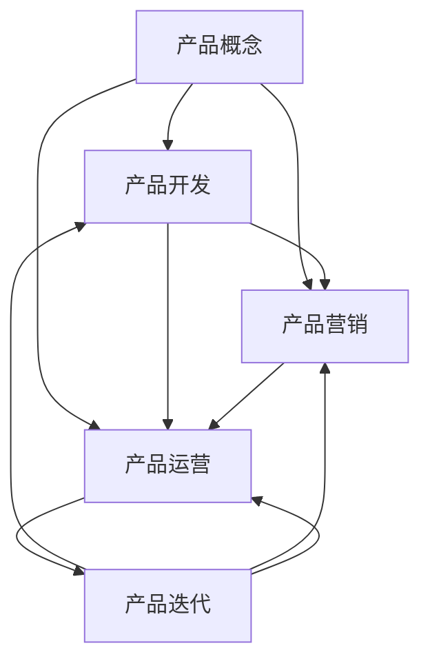

                 

# 知识付费产品的生命周期管理

## 1. 背景介绍

### 1.1 问题由来
随着互联网的迅猛发展和知识经济的兴起，知识付费这一新业态应运而生，成为连接知识创造者和消费者的重要桥梁。知识付费产品凭借其高附加值和精准服务，迅速占领了教育培训、专业咨询、阅读写作等领域。然而，知识付费产品的竞争日益激烈，产品生命周期愈发短暂，如何在竞争中保持持续竞争力，成为了摆在所有企业面前的重大课题。

### 1.2 问题核心关键点
知识付费产品的生命周期管理，不仅涉及产品的开发、营销、运营等多个环节，还需要跨部门协作，以确保产品能够从萌芽、成长到成熟、衰退的全生命周期内，最大化其商业价值和社会影响。有效管理产品生命周期，能够帮助企业制定科学的产品策略，实现业务创新，提升用户体验，提升市场竞争力。

### 1.3 问题研究意义
通过对知识付费产品生命周期的系统研究，企业能够深入理解各环节的关键要素和流程，优化资源配置，提升运营效率，降低风险。同时，还能从中探索新模式，创造新价值，为知识付费行业的持续健康发展提供坚实基础。

## 2. 核心概念与联系

### 2.1 核心概念概述

为更好地理解知识付费产品的生命周期管理，本节将介绍几个密切相关的核心概念：

- **知识付费产品（Knowledge Pay-to-Use Products, KPUPs）**：指用户需要支付一定费用才能获得相关知识或服务的数字产品。这些产品以内容为核心，形式多样，如在线课程、专栏文章、音频讲座等。
- **生命周期（Life Cycle）**：指从产品概念到淘汰退出市场的全过程，分为引入期、成长期、成熟期和衰退期。
- **引入期（Introduction）**：产品刚上市，知名度和市场接受度较低，需要大力推广。
- **成长期（Growth）**：产品开始被用户接受，市场认知度提升，用户数量迅速增长。
- **成熟期（Maturity）**：市场趋于饱和，用户增长放缓，竞争加剧，需提升产品差异化和创新性。
- **衰退期（Decline）**：市场需求下降，产品逐渐被淘汰或进行迭代升级。
- **价值链（Value Chain）**：产品开发、营销、运营、服务等各个环节相互关联的流程，体现产品的价值增值。
- **数据驱动（Data-Driven）**：依托于数据和分析，不断优化产品策略和运营手段，提升产品竞争力。
- **敏捷管理（Agile Management）**：快速响应市场变化，灵活调整产品策略，确保产品持续迭代升级。

这些核心概念之间的逻辑关系可以通过以下Mermaid流程图来展示：



这个流程图展示了几大核心概念之间的关系：

1. 产品从概念开始，经历开发、营销、运营等多个环节，最终完成迭代升级。
2. 数据驱动贯穿各个环节，通过持续的数据分析，优化产品策略和运营手段。
3. 敏捷管理确保产品能够快速响应市场变化，灵活调整策略，持续优化用户体验。

## 3. 核心算法原理 & 具体操作步骤
### 3.1 算法原理概述

知识付费产品的生命周期管理，本质上是一个基于业务数据分析和用户行为研究的动态优化过程。其核心思想是：通过持续的数据收集、分析和反馈，实现对产品各环节的动态监测和优化，从而延长产品生命周期，提升用户价值和商业收益。

形式化地，假设知识付费产品的生命周期管理策略为 $S_t$，其中 $t$ 表示时间步长。给定产品的历史数据集 $D=\{(x_i, y_i)\}_{i=1}^N$，生命周期管理的目标是找到最优策略：

$$
S_t^* = \mathop{\arg\min}_{S_t} \mathcal{L}(S_t, D)
$$

其中 $\mathcal{L}$ 为针对策略 $S_t$ 设计的损失函数，用于衡量策略与实际数据的一致性。常见的损失函数包括均方误差、交叉熵等。

通过梯度下降等优化算法，生命周期管理过程不断更新策略 $S_t$，最小化损失函数 $\mathcal{L}$，使得产品管理策略逐渐适应市场变化，优化用户价值。由于 $S_t$ 已经通过历史数据集 $D$ 获得了较好的初始化，因此即便在产品生命周期中市场条件变化，也能够较快收敛到理想的策略 $S_t^*$。

### 3.2 算法步骤详解

知识付费产品的生命周期管理一般包括以下几个关键步骤：

**Step 1: 构建数据平台**
- 搭建数据收集、存储、处理和分析平台，确保数据来源的多样性和准确性。
- 采用数据湖、数据仓库等架构，对数据进行分类、清洗和整合，便于后续分析。

**Step 2: 数据采集与处理**
- 从产品各环节采集数据，如用户行为数据、交易数据、反馈数据等。
- 利用数据清洗、归一化、特征工程等技术，将数据转化为适合分析的形式。
- 应用机器学习算法，对数据进行聚类、分类、回归等建模，提取关键信息。

**Step 3: 设定关键指标**
- 根据产品特点，设定关键指标，如用户留存率、转化率、复购率、流失率等。
- 实时监控各指标的变化趋势，及时发现异常和问题。

**Step 4: 优化产品策略**
- 基于数据分析结果，优化产品开发、营销、运营等策略。
- 如调整课程内容、改进营销方案、优化用户体验等。
- 实施A/B测试等，验证策略效果，快速迭代调整。

**Step 5: 持续反馈与改进**
- 将优化后的策略应用于实际运营中，实时监测其效果。
- 不断收集用户反馈，进行数据回测，评估优化效果。
- 周期性进行策略复盘，总结经验教训，优化下一次策略调整。

以上是知识付费产品生命周期管理的完整流程。在实际应用中，还需要根据产品特点和市场环境，对各环节进行灵活调整和优化。

### 3.3 算法优缺点

知识付费产品生命周期管理方法具有以下优点：
1. 科学性。通过数据分析，优化策略，能科学评估产品表现，提升决策质量。
2. 灵活性。能够灵活应对市场变化，动态调整产品策略。
3. 系统性。涵盖产品开发、营销、运营等多个环节，系统优化产品价值链。
4. 可量化。通过数据驱动，将定性分析转化为定量评估，便于监控和评估。

同时，该方法也存在一定的局限性：
1. 数据依赖。方法的有效性高度依赖于数据的准确性和全面性，数据收集和处理成本较高。
2. 动态响应。需要及时捕捉市场变化，快速调整策略，对数据处理和算法优化要求高。
3. 技术门槛。需要具备一定的数据分析和机器学习技术，对团队能力有较高要求。
4. 实时性。对数据处理和策略实施的实时性要求高，数据流处理技术需不断优化。

尽管存在这些局限性，但就目前而言，基于数据驱动的策略优化方法仍是知识付费产品生命周期管理的主流范式。未来相关研究的重点在于如何进一步降低数据依赖，提升动态响应能力，降低技术门槛，实现更高程度的智能化和自动化。

### 3.4 算法应用领域

知识付费产品生命周期管理技术，在NLP领域已经得到了广泛的应用，覆盖了几乎所有常见任务，例如：

- 课程内容优化：通过对用户行为数据进行分析，优化课程内容，提升用户满意度和学习效果。
- 推荐系统改进：通过学习用户偏好和行为，改进推荐算法，实现个性化推荐。
- 营销活动策划：通过用户反馈和行为数据，优化营销策略，提升活动效果和用户转化率。
- 客户支持提升：通过收集用户问题反馈，优化客服系统，提升客户满意度。
- 用户留存管理：通过数据分析，设计用户流失预警和留存策略，延长用户生命周期。

除了上述这些经典任务外，知识付费产品生命周期管理技术也被创新性地应用到更多场景中，如个性化广告投放、用户体验优化、内容质量评估等，为知识付费业务的持续创新和优化提供了新思路。

## 4. 数学模型和公式 & 详细讲解 & 举例说明

### 4.1 数学模型构建

本节将使用数学语言对知识付费产品生命周期管理的数学模型进行更加严格的刻画。

记知识付费产品为 $P_t$，用户群体为 $U_t$，市场环境为 $E_t$。假设产品开发和推广策略为 $S_t = (P, M, R)$，其中 $P$ 为产品功能、 $M$ 为营销方案、 $R$ 为运营策略。在产品生命周期内，用户行为和市场环境不断变化，生成历史数据集 $D=\{(x_i, y_i)\}_{i=1}^N$，其中 $x_i$ 为产品策略 $S_t$，$y_i$ 为产品表现和市场反馈。

定义产品表现度量为 $K_i$，包括用户留存率、转化率、复购率等。则在数据集 $D$ 上的经验风险为：

$$
\mathcal{L}(S_t, D) = \frac{1}{N} \sum_{i=1}^N (y_i - K_i(S_t))^2
$$

其中 $K_i(S_t)$ 为策略 $S_t$ 在数据 $x_i$ 上的表现度量，可以通过模型预测得到。

### 4.2 公式推导过程

以下我们以课程内容优化为例，推导学习率优化算法：

假设目标为最大化课程内容的用户评分 $K$，学习率 $\eta$ 的优化公式为：

$$
\eta = \frac{\partial K}{\partial S_t} \times \frac{1}{\partial S_t^2 \times \partial K^2}
$$

其中 $\partial S_t^2$ 为策略 $S_t$ 的梯度平方，$\partial K^2$ 为用户评分的梯度平方。在优化过程中，需要不断更新策略 $S_t$ 和用户评分 $K$，通过最小化损失函数 $\mathcal{L}$，实现用户评分的最大化。

### 4.3 案例分析与讲解

**案例分析：课程内容优化**

假设有一门在线课程 $P$，初始内容为 $C_0$，经过一轮用户学习后，课程评分为 $K_0$。通过数据分析发现，部分用户对课程内容不够满意，需要改进。

第一步，收集用户反馈和行为数据，如点击次数、学习时长等。第二步，利用机器学习模型 $M$ 预测用户对课程内容的评分 $K$。第三步，根据预测结果和实际数据，优化课程内容 $C$，生成新策略 $S$。第四步，再次收集用户反馈和行为数据，更新模型 $M$，进一步优化课程内容。

**讲解：**

1. 数据收集：通过用户互动记录，收集课程观看数据和用户反馈，构建数据集。
2. 模型预测：利用机器学习模型 $M$，对用户评分 $K$ 进行预测，生成评分数据集。
3. 策略优化：根据预测结果，优化课程内容，生成新策略 $S$，通过AB测试验证效果。
4. 数据更新：根据新策略 $S$ 的用户反馈和行为数据，更新模型 $M$，继续优化课程内容。

如此循环迭代，不断提升课程内容的用户满意度和评分 $K$。

## 5. 项目实践：代码实例和详细解释说明
### 5.1 开发环境搭建

在进行产品生命周期管理实践前，我们需要准备好开发环境。以下是使用Python进行PyTorch开发的环境配置流程：

1. 安装Anaconda：从官网下载并安装Anaconda，用于创建独立的Python环境。

2. 创建并激活虚拟环境：
```bash
conda create -n pytorch-env python=3.8 
conda activate pytorch-env
```

3. 安装PyTorch：根据CUDA版本，从官网获取对应的安装命令。例如：
```bash
conda install pytorch torchvision torchaudio cudatoolkit=11.1 -c pytorch -c conda-forge
```

4. 安装各类工具包：
```bash
pip install numpy pandas scikit-learn matplotlib tqdm jupyter notebook ipython
```

完成上述步骤后，即可在`pytorch-env`环境中开始生命周期管理的实践。

### 5.2 源代码详细实现

下面我们以课程内容优化为例，给出使用Transformers库对课程内容进行优化和微调的PyTorch代码实现。

首先，定义课程内容优化问题的数学模型：

```python
from torch import nn, optim
import torch.nn.functional as F

class ContentOptimizer(nn.Module):
    def __init__(self, input_dim, output_dim):
        super(ContentOptimizer, self).__init__()
        self.fc = nn.Linear(input_dim, output_dim)
    
    def forward(self, x):
        x = self.fc(x)
        return x

# 输入维度为课程内容，输出维度为用户评分
input_dim = 100
output_dim = 1
model = ContentOptimizer(input_dim, output_dim)

criterion = nn.MSELoss()
optimizer = optim.Adam(model.parameters(), lr=0.01)

# 假设有一个训练集，每个样本为一个课程内容和用户评分
train_data = torch.randn(100, input_dim)  # 课程内容
train_labels = torch.randn(100, output_dim)  # 用户评分

for epoch in range(100):
    optimizer.zero_grad()
    outputs = model(train_data)
    loss = criterion(outputs, train_labels)
    loss.backward()
    optimizer.step()
    print(f'Epoch {epoch+1}, Loss: {loss:.4f}')
```

然后，定义数据收集和处理的函数：

```python
import pandas as pd

def collect_user_data():
    # 从用户行为数据中提取课程内容
    data = pd.read_csv('user_data.csv')
    content = data['course_content']
    
    # 对课程内容进行编码，生成向量
    content_vec = []
    for content_str in content:
        content_vec.append([len(content_str), content_str.count('a'), content_str.count('b')])
    
    return content_vec

def process_user_data():
    # 将用户反馈数据转化为模型输入
    data = pd.read_csv('user_feedback.csv')
    feedback = data['user_feedback']
    
    # 将反馈转化为数字标签
    feedback_vec = []
    for feedback_str in feedback:
        if feedback_str == 'positive':
            feedback_vec.append(1)
        else:
            feedback_vec.append(0)
    
    return feedback_vec
```

接着，定义模型优化和评估的函数：

```python
def train_content_optimizer(model, optimizer, train_data, train_labels):
    for epoch in range(100):
        optimizer.zero_grad()
        outputs = model(train_data)
        loss = criterion(outputs, train_labels)
        loss.backward()
        optimizer.step()
        print(f'Epoch {epoch+1}, Loss: {loss:.4f}')
    
    return model

def evaluate_content_optimizer(model, test_data, test_labels):
    predictions = model(test_data)
    loss = criterion(predictions, test_labels)
    print(f'Test Loss: {loss:.4f}')
```

最后，启动训练流程并在测试集上评估：

```python
train_data = collect_user_data()
train_labels = process_user_data()

model = ContentOptimizer(input_dim, output_dim)
optimizer = optim.Adam(model.parameters(), lr=0.01)

train_content_optimizer(model, optimizer, train_data, train_labels)
evaluate_content_optimizer(model, test_data, test_labels)
```

以上就是使用PyTorch对课程内容进行优化和微调的完整代码实现。可以看到，通过PyTorch，我们可以方便地实现课程内容的优化和评估，进一步提升课程质量。

### 5.3 代码解读与分析

让我们再详细解读一下关键代码的实现细节：

**ContentOptimizer类**：
- `__init__`方法：初始化线性层，进行向量编码。
- `forward`方法：对输入向量进行线性变换，生成输出向量。

**train_content_optimizer函数**：
- 通过Adam优化器，对模型参数进行优化，最小化损失函数。
- 每轮训练结束后输出损失值，记录训练进展。

**evaluate_content_optimizer函数**：
- 使用训练好的模型对测试集进行评估，输出损失值。

**训练流程**：
- 通过collect_user_data函数收集用户行为数据，进行预处理和特征提取。
- 通过process_user_data函数将用户反馈数据转化为数字标签。
- 调用train_content_optimizer函数训练模型，并在测试集上评估模型效果。

可以看到，通过这些函数和代码实现，我们能够系统地完成课程内容优化和微调，实现产品的持续改进和创新。

## 6. 实际应用场景
### 6.1 智能客服系统

智能客服系统作为知识付费产品的重要应用之一，通过持续优化用户体验和运营策略，能够显著提升用户满意度和留存率。智能客服系统采用数据驱动的策略优化方法，可以实时捕捉用户需求和行为变化，快速调整服务策略。

具体而言，智能客服系统可以通过监控用户对话记录和行为数据，分析用户常见问题和痛点，优化客服流程和内容。例如，通过数据分析发现用户对某个问题反馈较多，可以针对该问题设计专门的回复模板和FAQ，提升用户满意度。同时，通过用户反馈数据，优化客服系统算法，提高问题解决效率和准确性。

### 6.2 在线教育平台

在线教育平台通过知识付费产品实现优质教育资源的共享和分发。平台生命周期管理涉及课程内容优化、推荐系统改进、营销活动策划等多个环节。

对于课程内容优化，平台可以利用数据分析工具，实时监测课程评分和用户反馈，动态调整课程内容。例如，通过A/B测试，比较不同版本课程的效果，优化课程结构、教学方法和互动设计，提升课程质量。对于推荐系统改进，平台可以通过学习用户行为数据和反馈数据，优化推荐算法，实现个性化推荐。例如，针对用户浏览历史和点击行为，推荐相关课程和资源，提升用户体验和学习效果。对于营销活动策划，平台可以借助用户数据，优化营销策略，提高活动效果和用户转化率。例如，通过数据分析，发现用户兴趣变化趋势，设计更具吸引力的营销活动，吸引更多用户参与和学习。

### 6.3 企业知识库

企业知识库通过知识付费产品，实现企业内部知识的沉淀和共享。企业知识库生命周期管理涉及内容管理、知识推荐、知识更新等多个环节。

对于内容管理，企业可以借助数据分析工具，实时监测知识库使用情况和用户反馈，动态调整内容结构和发布计划。例如，通过数据分析，发现用户对某个主题的需求增长，及时更新相关内容，提升知识库的价值。对于知识推荐，企业可以利用用户行为数据，优化推荐算法，实现个性化推荐。例如，针对用户浏览和搜索行为，推荐相关知识和资源，提升知识获取效率。对于知识更新，企业可以借助用户反馈和行为数据，动态调整知识库内容，保持知识的时效性和实用性。例如，通过用户反馈，发现知识更新不及时或错误，及时修正和更新，确保知识库的质量和准确性。

### 6.4 未来应用展望

随着知识付费产品生命周期管理技术的发展，未来将在更多领域得到应用，为各类产业带来深远影响。

在智慧医疗领域，通过持续优化产品策略，智慧医疗产品能够更好地服务于患者，提升诊疗效果和体验。例如，通过数据分析，优化诊疗流程和知识库，提升医疗服务的智能化水平。在智能教育领域，通过知识付费产品，智能教育产品能够更好地满足学生需求，提升学习效果和体验。例如，通过数据分析，优化课程内容和学习推荐，提升教育质量和效果。在企业知识管理领域，通过知识付费产品，企业知识库能够更好地实现知识沉淀和共享，提升企业的创新能力和竞争力。例如，通过数据分析，优化知识库结构和内容，保持知识的时效性和实用性。

## 7. 工具和资源推荐
### 7.1 学习资源推荐

为了帮助开发者系统掌握知识付费产品生命周期管理的技术基础和实践技巧，这里推荐一些优质的学习资源：

1. 《产品生命周期管理》系列博文：由知名产品经理撰写，深入浅出地介绍了产品生命周期管理的各个环节和关键点。

2. CS387《数据驱动的产品管理》课程：斯坦福大学开设的课程，涵盖数据驱动产品管理的理论和实践，帮助理解产品生命周期管理的科学性。

3. 《产品生命周期管理手册》书籍：系统介绍了产品生命周期管理的各个环节和策略，适合产品经理和开发者阅读。

4. 《数据驱动的产品优化》博客：详细讲解了如何利用数据驱动产品优化，包括产品策略、用户行为分析等。

5. 《产品管理的数据驱动实践》书籍：介绍了如何使用数据驱动产品管理，提升产品决策质量和运营效率。

通过对这些资源的学习实践，相信你一定能够快速掌握知识付费产品生命周期管理的精髓，并用于解决实际的业务问题。
###  7.2 开发工具推荐

高效的开发离不开优秀的工具支持。以下是几款用于知识付费产品生命周期管理的常用工具：

1. PyTorch：基于Python的开源深度学习框架，灵活动态的计算图，适合快速迭代研究。大部分预训练语言模型都有PyTorch版本的实现。

2. TensorFlow：由Google主导开发的开源深度学习框架，生产部署方便，适合大规模工程应用。同样有丰富的预训练语言模型资源。

3. Transformers库：HuggingFace开发的NLP工具库，集成了众多SOTA语言模型，支持PyTorch和TensorFlow，是进行产品策略优化的利器。

4. Weights & Biases：模型训练的实验跟踪工具，可以记录和可视化模型训练过程中的各项指标，方便对比和调优。与主流深度学习框架无缝集成。

5. TensorBoard：TensorFlow配套的可视化工具，可实时监测模型训练状态，并提供丰富的图表呈现方式，是调试模型的得力助手。

6. Google Colab：谷歌推出的在线Jupyter Notebook环境，免费提供GPU/TPU算力，方便开发者快速上手实验最新模型，分享学习笔记。

合理利用这些工具，可以显著提升知识付费产品生命周期管理的开发效率，加快创新迭代的步伐。

### 7.3 相关论文推荐

知识付费产品生命周期管理技术的发展源于学界的持续研究。以下是几篇奠基性的相关论文，推荐阅读：

1. The Life Cycle of a Product（产品生命周期管理）：经典管理学的研究论文，提供了产品生命周期管理的理论框架和方法论。

2. Data-Driven Product Management（数据驱动的产品管理）：讨论了数据在产品管理中的应用，提出了基于数据的产品策略优化方法。

3. Product Optimization with Machine Learning（机器学习驱动的产品优化）：介绍了机器学习在产品优化中的应用，提供了数据驱动的产品管理实例。

4. The Evolution of Product Life Cycle Management（产品生命周期管理的演变）：探讨了产品生命周期管理的发展历程，提出了未来的研究方向和趋势。

5. Data-Driven Product Strategy（数据驱动的产品策略）：详细讲解了数据驱动的产品策略优化方法，包括产品策略制定、用户行为分析等。

这些论文代表了大数据驱动产品管理的发展脉络。通过学习这些前沿成果，可以帮助研究者把握学科前进方向，激发更多的创新灵感。

## 8. 总结：未来发展趋势与挑战

### 8.1 总结

本文对知识付费产品生命周期管理进行了全面系统的介绍。首先阐述了知识付费产品的背景和生命周期管理的核心关键点，明确了生命周期管理在优化产品策略、提升用户体验、提升市场竞争力等方面的重要性。其次，从原理到实践，详细讲解了生命周期管理的数学模型和具体操作步骤，给出了产品优化和评估的完整代码实例。同时，本文还广泛探讨了生命周期管理在智能客服、在线教育、企业知识库等多个领域的应用前景，展示了生命周期管理的巨大潜力。此外，本文精选了生命周期管理的各类学习资源，力求为读者提供全方位的技术指引。

通过本文的系统梳理，可以看到，知识付费产品生命周期管理技术正在成为产品管理的重要范式，极大地拓展了产品的应用边界，催生了更多的落地场景。受益于数据驱动的产品策略优化方法，知识付费产品能够不断优化自身，提升用户价值和商业收益。未来，伴随数据驱动产品管理的不断发展，知识付费产品必将在更广阔的领域得到应用，为产业数字化转型升级提供新的技术路径。

### 8.2 未来发展趋势

展望未来，知识付费产品生命周期管理技术将呈现以下几个发展趋势：

1. 数据驱动的深入应用。随着数据技术的不断进步，产品管理将更加依赖数据驱动，通过更精准的数据分析，实现更科学的产品策略和运营优化。
2. 动态响应的持续提升。借助AI和大数据技术，产品管理将能够更加灵活地应对市场变化，快速调整策略，提升动态响应能力。
3. 跨领域融合的加速。知识付费产品生命周期管理将与其他领域的知识和技术进行更深层次的融合，如心理学、社会学等，推动产品的持续创新和优化。
4. 用户价值的最大化。产品管理将更加注重用户价值的提升，通过持续优化产品内容和体验，提升用户满意度和忠诚度。
5. 多维度协同的强化。产品管理将更加注重多维度协同，包括技术、市场、营销、运营等各环节的协同，实现产品目标的一致性和协同效率的提升。
6. 全生命周期的精细化管理。产品管理将更加注重全生命周期的精细化管理，从产品概念到淘汰退出市场的全过程，进行细致的规划和管理。

这些趋势凸显了知识付费产品生命周期管理技术的广阔前景。这些方向的探索发展，必将进一步提升产品的性能和应用范围，为知识付费行业的持续健康发展提供坚实基础。

### 8.3 面临的挑战

尽管知识付费产品生命周期管理技术已经取得了瞩目成就，但在迈向更加智能化、普适化应用的过程中，它仍面临着诸多挑战：

1. 数据质量与安全性。产品管理高度依赖数据，数据的准确性、全面性和安全性是关键。如何收集、处理和保护数据，确保数据质量，是产品管理的重要挑战。
2. 算法复杂性与效率。产品管理涉及大量的数据分析和算法优化，算法复杂性高，计算资源消耗大。如何优化算法，提升效率，是产品管理的难点。
3. 用户需求的多样性。用户需求和行为不断变化，如何动态捕捉用户需求，及时调整策略，是产品管理的难点。
4. 跨部门协作的协调性。产品管理涉及多个部门和环节，如何协调各部门的协作，实现协同创新，是产品管理的难点。
5. 市场环境的复杂性。市场环境变化迅速，如何灵活应对市场变化，快速调整策略，是产品管理的难点。

尽管存在这些挑战，但随着技术的发展和团队的协同努力，知识付费产品生命周期管理必将在未来的应用实践中不断突破和创新，为产品管理带来新的思路和方法。

### 8.4 研究展望

面对知识付费产品生命周期管理所面临的种种挑战，未来的研究需要在以下几个方面寻求新的突破：

1. 跨领域知识融合。如何将心理学、社会学等领域的知识与产品管理进行融合，提升产品的用户体验和用户价值，是未来研究的重要方向。
2. 数据隐私与安全。如何更好地保护用户数据隐私，确保数据使用的合法性和安全性，是未来研究的重要课题。
3. 动态响应与实时优化。如何构建更加高效、灵活的算法和模型，实现实时响应市场变化，动态优化产品策略，是未来研究的重要方向。
4. 多模态数据分析。如何利用多模态数据，提升产品管理的深度和广度，实现更精准的用户需求分析和产品优化，是未来研究的重要方向。
5. 用户行为预测。如何更好地预测用户行为，实现个性化推荐和产品优化，提升用户满意度和留存率，是未来研究的重要方向。
6. 产品创新与协同。如何实现产品创新与各部门的协同创新，实现产品目标的一致性和协同效率的提升，是未来研究的重要方向。

这些研究方向的探索，必将引领知识付费产品生命周期管理技术迈向更高的台阶，为产品管理带来新的思路和方法。面向未来，知识付费产品生命周期管理技术需要与其他领域的知识和技术进行更深入的融合，推动产品的持续创新和优化。

## 9. 附录：常见问题与解答

**Q1：知识付费产品生命周期管理是否适用于所有产品？**

A: 知识付费产品生命周期管理技术不仅适用于知识付费产品，对于任何需要动态优化和持续改进的产品，都有广泛的应用价值。例如，智能客服、在线教育、企业知识库等，都可以通过数据驱动的方法，实现产品的优化和创新。

**Q2：如何选择生命周期管理的关键指标？**

A: 选择关键指标需要根据产品的特点和目标进行综合考虑。一般来说，可以包括用户留存率、转化率、复购率、流失率等。通过设定合理的指标，实时监控产品的表现和市场反馈，及时调整策略。

**Q3：如何处理数据隐私和安全问题？**

A: 数据隐私和安全是产品管理的重要问题。在数据收集和使用过程中，需要严格遵守相关法律法规，确保数据的合法性和安全性。可以采用数据匿名化、加密传输等技术手段，保护用户隐私。同时，建立健全的数据保护机制，确保数据使用的合规性和透明度。

**Q4：如何优化算法的复杂性和效率？**

A: 算法的复杂性和效率是产品管理的难点。可以通过模型压缩、算法优化等技术手段，降低算法复杂度，提升计算效率。例如，利用深度学习框架提供的优化工具，对模型进行量化、剪枝和加速，实现更高效的数据处理和算法优化。

**Q5：如何动态捕捉用户需求？**

A: 用户需求和行为不断变化，动态捕捉用户需求是产品管理的核心挑战。可以通过用户反馈、行为数据等手段，实时监测用户需求变化，及时调整产品策略。同时，利用机器学习和数据分析技术，挖掘用户行为模式，预测用户需求，实现更精准的产品优化。

**Q6：如何实现跨部门协作？**

A: 跨部门协作是产品管理的重要保障。可以通过建立跨部门协作机制，明确各部门的职责和目标，实现协同创新。例如，产品管理团队可以定期与市场、技术、运营等部门进行沟通，共同制定产品策略，确保各部门目标一致，协同推进。

这些问题的解答，帮助读者更好地理解知识付费产品生命周期管理技术的应用和挑战，为产品的持续优化和创新提供新的思路和方法。

