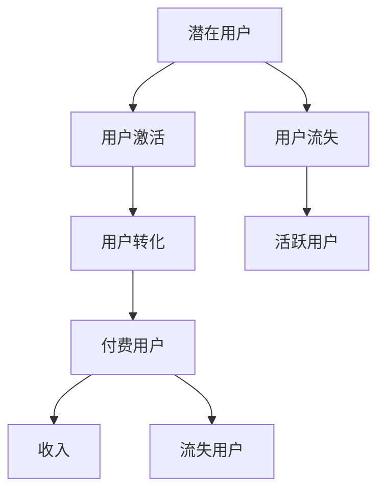

                 

## 1. 背景介绍

### 1.1 问题由来

随着互联网和移动互联网的普及，知识付费逐渐成为用户在信息获取、学习和工作中的重要形式之一。知识付费产品，如在线课程、电子书、直播讲座等，通过提供专业知识和服务，满足了用户个性化学习的需求。

然而，知识付费市场仍处于早期阶段，用户对知识付费产品的接受度和转化率较低。据统计，知识付费产品的用户激活率普遍在15-25%之间，转化率仅为10-15%。许多知识付费平台面临着用户流失率高、付费意愿低等挑战。如何提升用户激活率和转化率，成为当前知识付费行业亟待解决的问题。

### 1.2 问题核心关键点

影响知识付费产品用户激活与转化的因素是多方面的，包括但不限于：

1. **用户需求匹配度**：产品是否满足了用户的实际需求，是否具有足够的吸引力。
2. **用户体验**：产品是否易于使用，用户是否享受顺畅的学习过程。
3. **用户信任**：用户是否信任知识付费平台和内容提供者，是否相信产品的价值。
4. **价格因素**：产品定价是否合理，是否与用户支付意愿相匹配。
5. **用户反馈机制**：产品是否具备良好的用户反馈机制，能否及时响应和优化用户需求。

## 2. 核心概念与联系

### 2.1 核心概念概述

为更好地理解知识付费产品的用户激活与转化策略，本节将介绍几个密切相关的核心概念：

- **用户激活**：指将潜在用户转化为实际使用产品的活跃用户的过程。
- **用户转化**：指将活跃用户转化为付费用户的过程。
- **用户流失**：指活跃用户不再使用产品，最终导致付费用户数减少的现象。
- **用户生命周期价值(Customer Lifetime Value, CLV)**：指用户在购买或使用产品期间为公司带来的全部收入总和，包括直接和间接收入。
- **转化漏斗**：将用户转化路径分为多个阶段，例如注册、登陆、浏览、加入购物车、付款等，以可视化方式展示每个阶段的用户转化情况。

这些核心概念之间的逻辑关系可以通过以下Mermaid流程图来展示：



这个流程图展示了的核心概念及其之间的关系：

1. 潜在用户通过不同的渠道进入产品，通过激活流程转化为活跃用户。
2. 活跃用户通过转化流程转化为付费用户，为公司带来收入。
3. 部分活跃用户可能会流失，导致收入减少。
4. 用户生命周期价值衡量了每个用户对公司的长期贡献。

这些概念共同构成了知识付费产品用户激活与转化的整体框架，理解这些概念有助于制定有效的策略。

## 3. 核心算法原理 & 具体操作步骤

### 3.1 算法原理概述

知识付费产品的用户激活与转化策略，本质上是一个市场营销和用户体验优化的过程。其核心思想是通过多维度数据和分析工具，不断优化产品的功能和服务，提升用户体验，从而提高用户激活率和转化率。

具体而言，用户激活与转化策略通常包括以下几个关键步骤：

1. **用户行为分析**：通过分析用户行为数据，了解用户需求和偏好，识别转化瓶颈。
2. **个性化推荐**：根据用户行为数据和历史购买记录，推荐相关产品，提升用户满意度和购买意愿。
3. **用户细分**：基于用户属性和行为数据，进行用户细分，针对不同用户群体制定个性化的营销策略。
4. **动态定价**：根据市场需求和用户支付意愿，动态调整产品价格，以优化转化率。
5. **用户反馈机制**：建立有效的用户反馈机制，及时响应用户需求，优化产品体验。

### 3.2 算法步骤详解

以下是一个具体的用户激活与转化策略实施流程：

**Step 1: 数据收集与处理**

- **用户行为数据收集**：收集用户在平台上的行为数据，包括浏览记录、点击次数、停留时间、支付行为等。
- **用户属性数据收集**：收集用户的个人信息、兴趣爱好、支付能力等数据。
- **历史交易数据收集**：收集用户的购买历史和交易记录。

**Step 2: 数据分析与建模**

- **用户行为分析**：使用数据分析工具（如Google Analytics、Tableau），分析用户行为数据，识别用户兴趣点和转化瓶颈。
- **用户画像建模**：基于用户行为和属性数据，构建用户画像，描述不同用户群体的特征和需求。
- **预测模型建立**：使用机器学习算法（如逻辑回归、随机森林、神经网络等），建立用户转化预测模型，预测用户是否会转化为付费用户。

**Step 3: 策略制定与实施**

- **个性化推荐**：根据用户画像和行为数据，推荐相关产品，提高用户满意度和转化率。
- **动态定价**：根据用户画像和市场供需情况，动态调整产品价格，优化转化率。
- **营销活动设计**：设计有针对性的营销活动，提升用户参与度和转化率。
- **用户体验优化**：根据用户反馈和行为数据，优化产品功能和服务，提升用户满意度。

**Step 4: 效果评估与优化**

- **用户转化率评估**：使用A/B测试等方法，评估不同策略的效果，选择最优方案。
- **用户满意度评估**：通过用户调查、评价等手段，评估用户对产品的满意度，发现改进空间。
- **持续优化**：根据评估结果，持续优化产品和营销策略，提升用户激活率和转化率。

### 3.3 算法优缺点

知识付费产品的用户激活与转化策略具有以下优点：

1. **精准定位用户需求**：通过数据分析和用户画像建模，可以精准定位用户需求，提升用户满意度。
2. **提高转化率**：个性化推荐和动态定价等策略，可以有效提升用户转化率，增加公司收入。
3. **优化用户体验**：持续的用户反馈和优化，可以提升用户粘性和忠诚度。

同时，该策略也存在一定的局限性：

1. **数据隐私问题**：收集和分析用户数据，可能涉及用户隐私问题，需要严格遵守法律法规。
2. **技术复杂度高**：需要高水平的数据分析能力和机器学习算法，对技术和人员要求较高。
3. **成本投入大**：实施个性化推荐和动态定价等策略，需要投入较高的技术和运营成本。
4. **用户信任建立困难**：部分用户可能对平台和内容提供者缺乏信任，影响转化效果。

尽管存在这些局限性，但就目前而言，知识付费产品的用户激活与转化策略仍然是大数据分析和机器学习在实际应用中的一种重要范式。未来相关研究的重点在于如何进一步降低策略实施的成本，提高用户信任度，同时兼顾数据隐私和算法公正性等因素。

### 3.4 算法应用领域

知识付费产品的用户激活与转化策略，不仅在知识付费行业中得到广泛应用，也在其他领域产生了深远影响，例如：

- **在线教育**：通过个性化推荐和动态定价，提高课程购买率和用户满意度。
- **电子商务**：根据用户行为和购买历史，推荐相关商品，提升转化率和用户粘性。
- **社交媒体**：通过用户画像和行为分析，定向投放广告，提高用户参与度和广告效果。
- **内容订阅**：分析用户订阅行为，推荐相关内容，提升用户粘性和留存率。

除了这些传统领域，知识付费产品的用户激活与转化策略还在新兴的AI、AR/VR、区块链等前沿领域中得到应用，为数字化经济的发展提供了新的动力。

## 4. 数学模型和公式 & 详细讲解 & 举例说明

### 4.1 数学模型构建

本节将使用数学语言对知识付费产品用户激活与转化策略的数学模型进行更加严格的刻画。

设知识付费平台上有 $N$ 个潜在用户，其中 $A$ 个用户被成功激活，$C$ 个用户最终转化为付费用户。记 $B$ 为用户流失率，$R$ 为用户转化率，$L$ 为平均用户生命周期价值。

定义用户激活率为 $X$，用户转化率为 $Y$，则：

$$
X = \frac{A}{N} \\
Y = \frac{C}{A}
$$

转化漏斗模型可以表示为：

$$
C = R \cdot A
$$

其中 $R$ 为用户转化率，可通过以下逻辑回归模型进行预测：

$$
\hat{y} = \frac{1}{1+e^{-z}} \\
z = \omega_0 + \sum_{i=1}^{n} \omega_i x_i
$$

其中 $x_i$ 为用户的第 $i$ 个特征，$\omega_i$ 为特征对应的权重。

### 4.2 公式推导过程

以下是逻辑回归模型的推导过程：

设 $y$ 为用户是否转化为付费用户（0或1），$x_1, x_2, ..., x_n$ 为用户的 $n$ 个特征。则逻辑回归模型的目标是最小化负对数似然损失函数：

$$
L(\omega) = -\frac{1}{N} \sum_{i=1}^{N} \left[ y_i \log(\hat{y}_i) + (1-y_i) \log(1-\hat{y}_i) \right]
$$

其中 $\hat{y}_i = \frac{1}{1+e^{-z_i}}$，$z_i = \omega_0 + \sum_{j=1}^{n} \omega_j x_{ij}$。

通过梯度下降等优化算法，最小化损失函数，得到权重 $\omega$ 的更新公式：

$$
\omega \leftarrow \omega - \eta \nabla_{\omega}L(\omega)
$$

其中 $\eta$ 为学习率。

### 4.3 案例分析与讲解

以在线教育平台为例，分析用户激活与转化策略的实际应用。

假设某在线教育平台收集了 10000 名潜在用户的行为数据，使用逻辑回归模型预测用户是否会转化为付费用户。在训练集上，模型预测准确率为 85%，即 $R=0.85$。则根据转化漏斗模型，最终转化为付费用户的人数为：

$$
C = R \cdot A = 0.85 \cdot 8500 = 7325
$$

其中 $A=8500$ 为成功激活的用户数。

此外，该平台通过个性化推荐和动态定价策略，提升了用户转化率。在第一个月，平台推出了一门新课程，对前 1000 名用户提供 20% 的优惠，吸引了大量用户注册并付费。根据历史数据，该课程的平均用户生命周期价值为 200 元。则该课程的总体收入为：

$$
L = C \cdot 200 = 7325 \cdot 200 = 1465000
$$

通过数据分析和策略优化，平台实现了用户激活和转化的最大化，提升了收入和用户满意度。

## 5. 项目实践：代码实例和详细解释说明

### 5.1 开发环境搭建

在进行用户激活与转化策略的实践前，我们需要准备好开发环境。以下是使用Python进行Pandas和Scikit-Learn开发的环境配置流程：

1. 安装Anaconda：从官网下载并安装Anaconda，用于创建独立的Python环境。

2. 创建并激活虚拟环境：
```bash
conda create -n data-env python=3.8 
conda activate data-env
```

3. 安装Pandas：
```bash
conda install pandas
```

4. 安装Scikit-Learn：
```bash
conda install scikit-learn
```

5. 安装各类工具包：
```bash
pip install numpy matplotlib jupyter notebook ipython
```

完成上述步骤后，即可在`data-env`环境中开始策略实施的实践。

### 5.2 源代码详细实现

下面以逻辑回归模型为例，给出使用Pandas和Scikit-Learn对用户激活与转化策略进行数据分析和优化的Python代码实现。

首先，定义数据处理函数：

```python
import pandas as pd
from sklearn.model_selection import train_test_split
from sklearn.linear_model import LogisticRegression
from sklearn.metrics import accuracy_score, precision_score, recall_score

def load_data(path):
    df = pd.read_csv(path)
    return df

def preprocess_data(df, target):
    X = df.drop(target, axis=1)
    y = df[target]
    return X, y

def train_model(X_train, y_train, X_test, y_test):
    model = LogisticRegression()
    model.fit(X_train, y_train)
    y_pred = model.predict(X_test)
    return model, y_pred, y_train, y_test

def evaluate_model(model, y_pred, y_test):
    accuracy = accuracy_score(y_test, y_pred)
    precision = precision_score(y_test, y_pred)
    recall = recall_score(y_test, y_pred)
    return accuracy, precision, recall

# 加载数据
df = load_data('user_data.csv')
```

然后，定义数据预处理和模型训练函数：

```python
# 数据预处理
X, y = preprocess_data(df, 'is_paid')

# 划分训练集和测试集
X_train, X_test, y_train, y_test = train_test_split(X, y, test_size=0.2, random_state=42)

# 训练模型
model, y_pred, y_train, y_test = train_model(X_train, y_train, X_test, y_test)
```

接着，定义模型评估函数：

```python
# 模型评估
accuracy, precision, recall = evaluate_model(model, y_pred, y_test)
print(f'Accuracy: {accuracy:.2f} | Precision: {precision:.2f} | Recall: {recall:.2f}')
```

最后，启动模型训练和评估流程：

```python
# 模型训练和评估
for iteration in range(10):
    model, y_pred, y_train, y_test = train_model(X_train, y_train, X_test, y_test)
    accuracy, precision, recall = evaluate_model(model, y_pred, y_test)
    print(f'Iteration {iteration+1}, Accuracy: {accuracy:.2f} | Precision: {precision:.2f} | Recall: {recall:.2f}')
```

以上就是使用Pandas和Scikit-Learn进行用户激活与转化策略数据分析和优化的完整代码实现。可以看到，通过Pandas和Scikit-Learn，我们可以轻松地进行数据处理、模型训练和评估，快速迭代优化策略。

### 5.3 代码解读与分析

让我们再详细解读一下关键代码的实现细节：

**load_data函数**：
- 定义了一个加载数据的数据处理函数，使用Pandas读取CSV文件。

**preprocess_data函数**：
- 定义了一个数据预处理函数，将数据分为特征和标签，并进行归一化处理。

**train_model函数**：
- 定义了一个模型训练函数，使用Scikit-Learn的LogisticRegression模型进行训练，并返回训练好的模型、预测结果、训练集和测试集的标签。

**evaluate_model函数**：
- 定义了一个模型评估函数，计算模型在测试集上的准确率、精确率和召回率。

**train_model函数和evaluate_model函数**：
- 通过循环训练模型和评估模型，可以迭代优化模型的性能，直到达到预设的迭代次数。

可以看到，Pandas和Scikit-Learn的强大封装使得数据分析和模型训练的过程变得简洁高效。开发者可以将更多精力放在数据处理、模型改进等高层逻辑上，而不必过多关注底层的实现细节。

## 6. 实际应用场景

### 6.1 在线教育平台

在线教育平台可以应用用户激活与转化策略，提升课程购买率和用户满意度。通过数据分析，平台可以了解不同课程的用户需求，制定针对性的营销策略。例如，对热门课程提供折扣、推送个性化推荐等，吸引用户购买。同时，通过用户反馈和行为分析，平台可以优化课程内容和教学方法，提升用户的学习体验。

### 6.2 电子商务平台

电子商务平台通过用户激活与转化策略，可以有效提升销售额和用户粘性。平台可以分析用户购买历史和行为数据，推荐相关商品，提高用户的购买意愿。同时，通过动态定价策略，根据市场供需情况调整商品价格，优化销售效果。

### 6.3 社交媒体平台

社交媒体平台通过用户激活与转化策略，可以提升用户参与度和广告效果。平台可以根据用户画像和行为数据，定向投放广告，提高广告的点击率和转化率。同时，通过用户反馈和行为分析，平台可以优化广告投放策略，提升用户体验。

### 6.4 内容订阅平台

内容订阅平台通过用户激活与转化策略，可以提高用户订阅率和留存率。平台可以分析用户订阅行为，推荐相关内容，提升用户粘性。同时，通过动态定价策略，根据用户支付意愿调整订阅价格，优化订阅效果。

## 7. 工具和资源推荐

### 7.1 学习资源推荐

为了帮助开发者系统掌握知识付费产品的用户激活与转化策略的理论基础和实践技巧，这里推荐一些优质的学习资源：

1. 《数据分析与机器学习实战》：详细介绍了数据分析和机器学习的基本概念和实践技巧，适合初学者入门。
2. 《用户行为分析与营销策略》：系统讲解了用户行为分析的方法和营销策略的应用，助力提升用户满意度和转化率。
3. 《大数据与人工智能》：介绍大数据和人工智能在各行业中的应用，包括知识付费产品的用户激活与转化策略。
4. Kaggle在线学习平台：提供大量数据分析和机器学习的案例和竞赛，实践者的理想平台。
5. Coursera《用户行为分析与市场营销》课程：斯坦福大学开设的课程，提供系统的学习资源和实战案例。

通过对这些资源的学习实践，相信你一定能够快速掌握知识付费产品的用户激活与转化策略的精髓，并用于解决实际的商业问题。

### 7.2 开发工具推荐

高效的开发离不开优秀的工具支持。以下是几款用于用户激活与转化策略开发的常用工具：

1. Pandas：基于Python的数据分析库，支持数据清洗、处理和分析。
2. Scikit-Learn：基于Python的机器学习库，支持各种分类、回归和聚类算法。
3. Google Analytics：网站和应用程序的用户行为分析工具，提供丰富的用户行为数据。
4. Tableau：数据可视化和商业智能工具，支持复杂的数据分析和报告。
5. A/B测试工具：如Optimizely、Google Optimize，帮助企业测试和优化营销策略。

合理利用这些工具，可以显著提升知识付费产品的用户激活与转化策略的开发效率，加快创新迭代的步伐。

### 7.3 相关论文推荐

知识付费产品的用户激活与转化策略的研究源于学界的持续研究。以下是几篇奠基性的相关论文，推荐阅读：

1. "User Behavior Prediction in E-Commerce" by Qiang Li et al.：提出基于协同过滤的用户行为预测模型，应用于电子商务平台的用户激活与转化。
2. "Customer Lifetime Value Estimation and Segmentation" by Jian Wang et al.：探讨用户生命周期价值的计算方法，并进行用户细分，优化营销策略。
3. "Online Learning with Adaptive Combiners" by John Langford et al.：研究在线学习算法，优化转化漏斗模型，提升转化率。
4. "Effective Online Marketing Strategies" by Christopher F. Maurer：系统总结了在线营销策略，包括用户激活与转化策略的实施方法。
5. "Retargeting in Digital Marketing" by Laura Gastiner et al.：分析了再营销策略在提升转化率中的作用，提供了实证研究结果。

这些论文代表了大数据和机器学习在用户激活与转化策略中的应用方向。通过学习这些前沿成果，可以帮助研究者把握学科前进方向，激发更多的创新灵感。

## 8. 总结：未来发展趋势与挑战

### 8.1 总结

本文对知识付费产品的用户激活与转化策略进行了全面系统的介绍。首先阐述了知识付费产品用户激活与转化的背景和重要性，明确了策略在提升用户满意度、提高转化率方面的关键作用。其次，从原理到实践，详细讲解了用户激活与转化的数学模型和关键步骤，给出了策略实施的完整代码实例。同时，本文还广泛探讨了用户激活与转化策略在多个行业领域的应用前景，展示了其在提升用户价值和推动业务发展中的重要作用。

通过本文的系统梳理，可以看到，用户激活与转化策略在知识付费行业和其他领域得到了广泛应用，并取得了显著的效果。未来，伴随大数据和机器学习技术的进一步发展，策略实施的精度和效果将进一步提升，为各行业的数字化转型提供新的助力。

### 8.2 未来发展趋势

展望未来，知识付费产品的用户激活与转化策略将呈现以下几个发展趋势：

1. **多维度数据融合**：结合用户行为数据、社交媒体数据、市场趋势等多维度数据，进行更精准的用户细分和需求分析。
2. **实时数据分析**：利用大数据和实时计算技术，进行实时数据分析，及时优化营销策略和产品体验。
3. **智能推荐系统**：引入深度学习和神经网络技术，构建智能推荐系统，提升个性化推荐的效果。
4. **跨平台协同**：实现多平台数据的整合和协同，提升用户跨平台体验的一致性和便捷性。
5. **用户参与设计**：通过用户反馈和行为数据，实时调整产品功能和营销策略，提升用户满意度。

以上趋势凸显了知识付费产品用户激活与转化策略的广阔前景。这些方向的探索发展，必将进一步提升用户激活率和转化率，推动知识付费产品向更加智能化、个性化和多样化发展。

### 8.3 面临的挑战

尽管知识付费产品的用户激活与转化策略已经取得了显著成效，但在实施过程中，仍面临诸多挑战：

1. **数据隐私和安全**：收集和分析用户数据，可能涉及用户隐私问题，需要严格遵守法律法规。
2. **技术复杂度高**：需要高水平的数据分析和机器学习算法，对技术和人员要求较高。
3. **成本投入大**：实施个性化推荐和动态定价等策略，需要投入较高的技术和运营成本。
4. **用户信任建立困难**：部分用户可能对平台和内容提供者缺乏信任，影响转化效果。
5. **算法公正性和透明性**：需要确保算法的公正性和透明性，避免算法偏见和歧视。

尽管存在这些挑战，但知识付费产品的用户激活与转化策略仍然是大数据分析和机器学习在实际应用中的一种重要范式。未来相关研究的重点在于如何进一步降低策略实施的成本，提高用户信任度，同时兼顾数据隐私和算法公正性等因素。

### 8.4 研究展望

面对知识付费产品用户激活与转化策略所面临的种种挑战，未来的研究需要在以下几个方面寻求新的突破：

1. **探索无监督和半监督学习策略**：摆脱对大规模标注数据的依赖，利用自监督学习、主动学习等无监督和半监督范式，最大限度利用非结构化数据，实现更加灵活高效的策略实施。
2. **开发多模态协同分析工具**：结合用户行为数据、社交媒体数据、市场趋势等多维度数据，进行多模态协同分析，提升策略实施的精度和效果。
3. **引入因果推断和对比学习范式**：通过引入因果推断和对比学习思想，增强策略实施的因果关系，学习更加普适、鲁棒的用户行为模型。
4. **加强算法透明性和公正性**：引入可解释性技术，提升算法的透明性和公正性，避免算法偏见和歧视，提升用户信任度。
5. **引入伦理道德约束**：在策略实施目标中引入伦理导向的评估指标，过滤和惩罚有偏见、有害的输出倾向，确保策略实施的伦理性和合法性。

这些研究方向将引领知识付费产品用户激活与转化策略的进一步发展，推动用户满意度、转化率和业务收入的提升，为数字化经济的发展提供新的动力。总之，用户激活与转化策略需要开发者根据具体业务场景，不断迭代和优化策略，方能得到理想的效果。

## 9. 附录：常见问题与解答

**Q1：如何提升用户激活率？**

A: 提升用户激活率的方法主要包括：

1. **优化用户体验**：通过优化产品界面和功能，提高用户使用便捷性。
2. **增加用户触达渠道**：通过多渠道推广，如社交媒体、搜索引擎等，吸引更多用户注册和试用。
3. **个性化推荐**：根据用户行为和历史数据，推荐相关产品或内容，提高用户满意度和激活率。
4. **持续优化产品**：根据用户反馈和行为数据，不断优化产品功能和用户体验，提升用户粘性。

**Q2：如何提升用户转化率？**

A: 提升用户转化率的方法主要包括：

1. **制定有吸引力的优惠策略**：推出限时折扣、优惠券、会员特权等优惠活动，提高用户购买意愿。
2. **优化转化路径**：简化转化流程，减少用户决策成本，如一键购买、快捷支付等。
3. **个性化定价策略**：根据用户画像和支付意愿，制定个性化定价策略，提升转化率。
4. **持续优化营销策略**：通过A/B测试等方法，持续优化营销策略，找到最佳转化方案。

**Q3：如何衡量用户生命周期价值？**

A: 用户生命周期价值的衡量方法主要包括：

1. **历史交易数据法**：统计用户在其生命周期内购买产品或服务的总金额。
2. **预测模型法**：使用机器学习模型预测用户未来购买行为，计算其预期收入。
3. **时间序列法**：根据用户购买行为的时间序列，计算其生命周期价值。

**Q4：如何优化用户反馈机制？**

A: 优化用户反馈机制的方法主要包括：

1. **及时响应**：建立快速响应用户反馈的机制，及时解决用户问题。
2. **多渠道收集**：通过问卷调查、在线评论、客服记录等渠道，全面收集用户反馈。
3. **数据驱动决策**：基于用户反馈和行为数据，进行深入分析，优化产品功能和服务。
4. **用户社区建设**：建立用户社区，鼓励用户分享和交流，提升用户参与度和满意度。

**Q5：如何提升用户信任度？**

A: 提升用户信任度的方法主要包括：

1. **透明公开**：及时公开产品和服务的规则、标准、流程，增强用户信任。
2. **用户教育**：通过培训、引导等方式，提高用户对产品和服务的理解和信任。
3. **社交证明**：利用用户评价、认证标识等方式，增强用户信任。
4. **用户满意度调查**：定期进行用户满意度调查，及时改进和优化服务质量。

这些方法需要根据具体业务场景和用户特点，灵活组合使用，方能取得最佳效果。

---

作者：禅与计算机程序设计艺术 / Zen and the Art of Computer Programming

