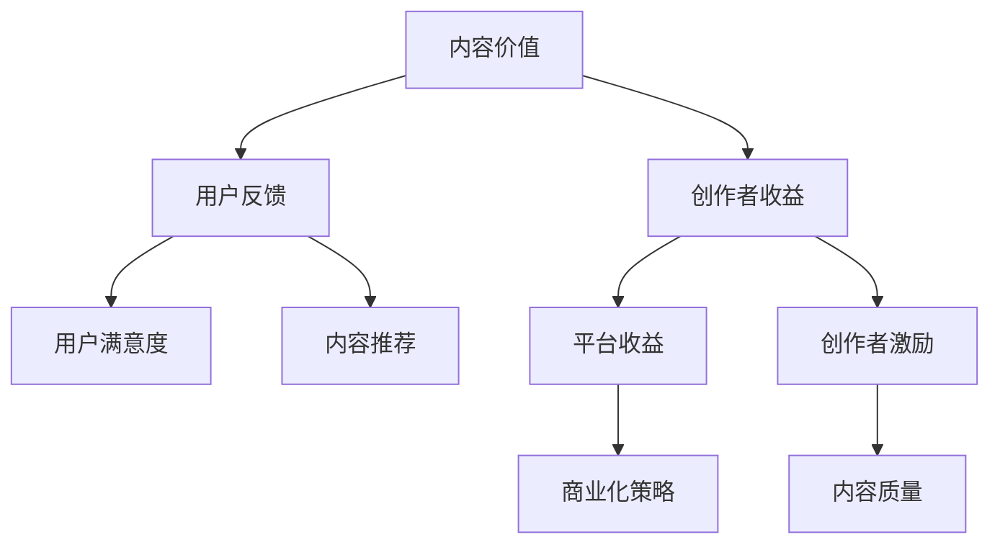
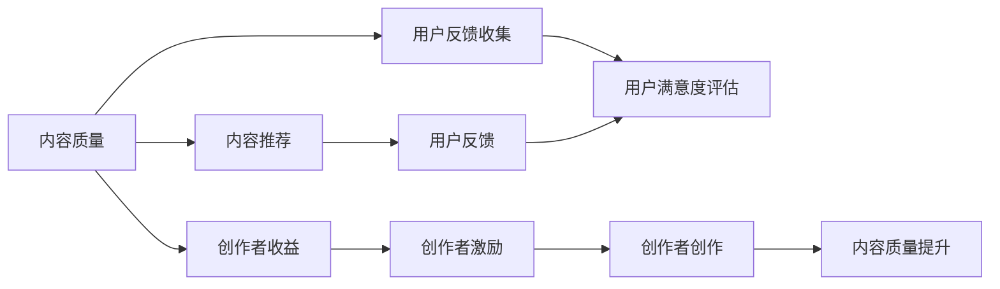

                 

# 知识付费创业中的内容价值评估体系

## 1. 背景介绍

在知识付费领域，如何客观评估内容价值，以确保用户能获得最大的知识收益，同时为创作者提供公正的回报，是平台和用户共同关心的核心问题。内容价值评估不仅关系到知识付费的可持续发展，还关乎平台对优质内容的激励与推荐，影响用户的学习体验和平台的用户黏性。因此，构建一个科学、公正、可执行的内容价值评估体系，对于知识付费平台的成功运营至关重要。

### 1.1 问题由来

随着知识付费行业的发展，越来越多的内容和创作者涌入市场。然而，内容的良莠不齐和用户需求的多样性，导致内容质量参差不齐，评估难度增大。平台为了吸引和留住用户，往往采用一些简单粗暴的策略，如销量排名、购买人数等，但这些策略并不能准确反映内容的质量和用户的真实反馈。

同时，创作者也面临激励机制不公平的问题。一些高质量的内容往往因为知名度不高，难以获得足够的曝光和用户购买，影响了创作者的创作动力和积极性。因此，建立一个科学合理的内容价值评估体系，平衡用户需求和创作者收益，成为知识付费平台亟待解决的难题。

### 1.2 问题核心关键点

1. **内容质量评估**：如何客观量化内容的质量，确保高价值内容被用户识别和推荐。
2. **用户反馈机制**：如何收集用户的真实反馈，确保评估体系的公平性和可靠性。
3. **创作者激励**：如何设计公平合理的激励机制，激发创作者的创作热情。
4. **持续改进**：如何动态调整和优化评估体系，适应平台和用户的变化。

## 2. 核心概念与联系

### 2.1 核心概念概述

在知识付费平台中，内容价值评估体系的核心概念包括：

- **内容价值**：指内容对用户的知识收益和价值贡献程度，包括知识深度、实用性、创新性等方面。
- **用户反馈**：指用户通过购买行为、互动行为（如点赞、评论、分享等）表达的内容满意度和认可度。
- **创作者收益**：指创作者通过内容销售和用户付费获得经济回报，反映内容市场接受度。
- **平台收益**：指平台从内容销售中获得的收益，衡量内容对平台的经济贡献。

这些概念之间的逻辑关系可以通过以下Mermaid流程图来展示：



该流程图展示了内容价值评估体系的核心组成和运作方式：

1. 内容价值通过用户反馈和创作者收益来衡量。
2. 用户反馈直接影响内容推荐，影响用户满意度和平台收益。
3. 创作者收益和平台收益相互影响，创作者收益是平台收益的来源。
4. 创作者激励和内容质量之间形成正反馈，优质内容获得更多激励，进一步提升创作者的动力。

### 2.2 核心概念原理和架构的 Mermaid 流程图



该流程图描述了内容价值评估体系的总体架构：

1. 内容质量是评估体系的核心，直接影响用户反馈和创作者收益。
2. 用户反馈通过满意度评估反馈到内容推荐系统，影响用户的购买决策和内容曝光。
3. 创作者收益和创作者激励形成闭环，激励创作者创作高质量内容。
4. 内容推荐系统直接影响用户的购买体验和满意度，进而影响平台收益。

## 3. 核心算法原理 & 具体操作步骤

### 3.1 算法原理概述

内容价值评估体系的核心算法原理可以概括为以下几个步骤：

1. **内容质量评估**：通过多种指标和方法，综合评估内容的质量和深度。
2. **用户反馈收集**：利用用户行为数据，量化用户对内容的满意度。
3. **创作者收益计算**：根据内容销售情况，计算创作者的经济收益。
4. **平台收益计算**：根据创作者收益和内容销量，计算平台的收益。
5. **创作者激励设计**：根据创作者收益和平台收益，设计公平合理的激励机制。
6. **持续优化**：基于用户反馈和创作者收益，动态调整评估体系，优化内容推荐。

### 3.2 算法步骤详解

#### 3.2.1 内容质量评估

内容质量评估是内容价值评估体系的基础，其核心在于构建多个维度、多层次的评估指标体系。以下是几个常见的评估维度：

1. **专业性指标**：评估内容的深度、专业性和准确性，通过专家评审、同行评议等方式进行。
2. **实用性指标**：评估内容的应用价值和实用性，通过用户反馈、评分等方式进行。
3. **创新性指标**：评估内容的新颖性和创新点，通过同行评议、引用率等方式进行。
4. **易读性指标**：评估内容的可读性和易懂性，通过用户评分、阅读时长等方式进行。
5. **格式多样性指标**：评估内容的格式多样性和多媒体元素的丰富程度，通过用户互动行为进行评估。

#### 3.2.2 用户反馈收集

用户反馈是内容价值评估的重要依据，其核心在于量化用户对内容的满意度。以下是几种常见的反馈收集方法：

1. **评分系统**：用户通过打分（1-5分或1-10分）表达对内容的满意度，将分数作为衡量内容价值的指标。
2. **评论系统**：用户通过评论表达对内容的评价，将评论的情感极性和内容相关性作为衡量内容价值的指标。
3. **互动行为**：通过用户的点赞、分享、评论等互动行为，衡量内容的受欢迎程度和用户参与度。
4. **支付行为**：通过用户的购买行为，衡量内容的市场接受度和用户的付费意愿。
5. **评价系统**：通过专业的评审和同行评议，评估内容的学术价值和影响力。

#### 3.2.3 创作者收益计算

创作者收益是内容价值评估体系的重要组成部分，其核心在于合理计算创作者的经济回报。以下是几种常见的收益计算方法：

1. **单次付费**：用户单次购买或订阅内容，创作者获得相应的费用。
2. **多次付费**：用户通过多次购买或订阅同一内容，创作者获得相应的累加费用。
3. **分成机制**：平台与创作者按比例分成内容销售收益，确保创作者获得合理的回报。
4. **广告分成**：创作者的内容中嵌入广告，根据广告点击率和展示次数获得收益。
5. **赞助和打赏**：创作者通过平台提供的赞助和打赏功能，获得额外的收入。

#### 3.2.4 平台收益计算

平台收益是内容价值评估体系的关键目标，其核心在于计算平台从内容销售中获得的收益。以下是几种常见的收益计算方法：

1. **一次性销售**：平台一次性购买或订阅内容，获得相应的费用。
2. **订阅服务**：用户通过平台提供的订阅服务，平台获得相应的月费或年费。
3. **广告收入**：平台通过内容中嵌入的广告，获得点击和展示收益。
4. **会员增值服务**：平台通过提供高级会员增值服务，获得额外的收益。
5. **第三方合作**：平台与第三方合作，获得额外的收益和资源。

#### 3.2.5 创作者激励设计

创作者激励是内容价值评估体系的重要组成部分，其核心在于设计公平合理的激励机制，激发创作者的创作热情。以下是几种常见的激励设计方法：

1. **高质量内容激励**：根据内容质量评估结果，给予创作者额外的激励和奖励。
2. **高用户反馈激励**：根据用户反馈结果，给予创作者更多的曝光和推荐。
3. **高收益激励**：根据创作者收益结果，给予创作者更多的分成和分成比例。
4. **活跃用户激励**：根据平台活跃用户数，给予创作者更多的关注和曝光。
5. **新用户激励**：根据平台新用户增长情况，给予创作者更多的推广和支持。

#### 3.2.6 持续优化

内容价值评估体系的持续优化是确保其有效性和公平性的关键，其核心在于动态调整和优化评估体系，适应平台和用户的变化。以下是几种常见的持续优化方法：

1. **用户反馈机制优化**：通过数据分析，优化用户反馈机制，提高反馈的准确性和可靠性。
2. **创作者激励机制优化**：根据创作者收益和平台收益，动态调整激励机制，确保激励的公平性和合理性。
3. **内容推荐系统优化**：根据用户反馈和内容质量，动态调整内容推荐算法，提高推荐效果。
4. **内容质量评估体系优化**：根据创作者收益和平台收益，动态调整内容质量评估指标，提高评估的准确性和科学性。
5. **技术手段优化**：利用AI和大数据技术，优化评估体系的技术实现，提高评估的效率和准确性。

### 3.3 算法优缺点

基于上述步骤的内容价值评估体系，具有以下优点：

1. **全面性**：通过多维度、多层次的评估指标，全面反映内容的质量和价值。
2. **科学性**：通过数据分析和机器学习技术，提高评估的科学性和客观性。
3. **公平性**：通过用户反馈和创作者收益，设计公平合理的激励机制，确保内容价值评估的公正性。
4. **可执行性**：通过明确的算法步骤和优化方法，确保评估体系的可执行性和可操作性。
5. **动态性**：通过持续优化和调整，确保评估体系适应平台和用户的变化。

同时，该体系也存在以下缺点：

1. **数据依赖性**：评估体系的准确性和可靠性高度依赖于数据的全面性和质量。
2. **技术复杂性**：评估体系的实施需要一定的技术能力和资源投入。
3. **激励机制设计难度**：公平合理的激励机制设计需要平衡多方的利益，存在一定的挑战。
4. **用户反馈主观性**：用户反馈具有一定的主观性，可能影响评估结果的客观性。
5. **持续优化难度**：持续优化需要不断的数据分析和模型调整，存在一定的技术难度。

## 4. 数学模型和公式 & 详细讲解 & 举例说明

### 4.1 数学模型构建

假设平台上有 $N$ 个内容，每个内容 $i$ 的评分 $R_i$，用户反馈分数 $U_i$，创作者收益 $C_i$，平台收益 $P_i$。内容价值评估体系的数学模型可以表示为：

$$
V_i = f(R_i, U_i, C_i, P_i)
$$

其中 $V_i$ 表示内容 $i$ 的价值，$f$ 表示评估函数。

### 4.2 公式推导过程

为了简化计算，我们假设内容价值评估函数 $f$ 为线性函数：

$$
V_i = \alpha R_i + \beta U_i + \gamma C_i + \delta P_i
$$

其中 $\alpha, \beta, \gamma, \delta$ 为系数，分别表示评分、用户反馈、创作者收益和平台收益对内容价值的贡献程度。

### 4.3 案例分析与讲解

假设某平台上有两篇文章 $A$ 和 $B$，文章 $A$ 的用户评分 $R_A = 4.5$，用户反馈分数 $U_A = 3.2$，创作者收益 $C_A = 200$，平台收益 $P_A = 100$；文章 $B$ 的用户评分 $R_B = 4.2$，用户反馈分数 $U_B = 3.5$，创作者收益 $C_B = 150$，平台收益 $P_B = 150$。

根据上述线性模型，计算两篇文章的价值：

$$
V_A = 0.5 R_A + 0.3 U_A + 0.4 C_A + 0.2 P_A = 0.5 \times 4.5 + 0.3 \times 3.2 + 0.4 \times 200 + 0.2 \times 100 = 182
$$

$$
V_B = 0.5 R_B + 0.3 U_B + 0.4 C_B + 0.2 P_B = 0.5 \times 4.2 + 0.3 \times 3.5 + 0.4 \times 150 + 0.2 \times 150 = 179
$$

根据计算结果，文章 $A$ 的价值高于文章 $B$，表明其对用户的知识收益和价值贡献更大。平台可以根据价值评估结果，对文章进行优先推荐，以提高用户满意度和平台收益。

## 5. 项目实践：代码实例和详细解释说明

### 5.1 开发环境搭建

为了构建内容价值评估体系，需要搭建一个完整的开发环境，以下是一些推荐的步骤：

1. **环境配置**：在本地或云平台上配置合适的开发环境，确保有足够的计算资源和存储资源。
2. **数据准备**：收集和整理平台上的内容数据、用户反馈数据、创作者收益数据等，确保数据全面、准确。
3. **工具选择**：选择合适的开发工具和框架，如Python、R、Java、TensorFlow等，确保工具易于使用、高效可靠。
4. **数据预处理**：对数据进行清洗、去重、格式化等预处理工作，确保数据质量。
5. **模型训练**：使用机器学习算法和模型，对内容价值进行训练和预测。
6. **评估与优化**：根据评估结果和用户反馈，持续优化模型和评估体系，确保其准确性和公平性。

### 5.2 源代码详细实现

假设我们使用Python和TensorFlow实现内容价值评估体系，以下是一些关键代码实现：

```python
import tensorflow as tf
from tensorflow.keras.layers import Dense, Input
from tensorflow.keras.models import Model

# 定义输入层
inputs = Input(shape=(1,))

# 定义评分、用户反馈、创作者收益、平台收益
ratings = Dense(1, activation='linear')(inputs)
feedback = Dense(1, activation='linear')(inputs)
creators = Dense(1, activation='linear')(inputs)
platforms = Dense(1, activation='linear')(inputs)

# 定义内容价值评估模型
output = tf.keras.layers.Add()([ratings, feedback, creators, platforms])
model = Model(inputs, output)

# 编译模型
model.compile(optimizer='adam', loss='mse')

# 训练模型
model.fit(x_train, y_train, epochs=10, batch_size=32)
```

以上代码实现了一个简单的内容价值评估模型，通过输入评分、用户反馈、创作者收益、平台收益，输出内容价值。

### 5.3 代码解读与分析

在上述代码中，我们使用了TensorFlow和Keras框架来构建内容价值评估模型。具体步骤如下：

1. **定义输入层**：使用 `Input` 函数定义输入层，假设输入为一个标量。
2. **定义评分、用户反馈、创作者收益、平台收益**：使用 `Dense` 函数定义评分、用户反馈、创作者收益、平台收益的线性输出层。
3. **定义内容价值评估模型**：使用 `Add` 函数将评分、用户反馈、创作者收益、平台收益相加，输出内容价值。
4. **编译模型**：使用 `compile` 函数定义优化器和损失函数，准备训练模型。
5. **训练模型**：使用 `fit` 函数训练模型，通过输入训练集和标签进行模型训练。

### 5.4 运行结果展示

假设我们有一个训练集 `x_train` 和对应的标签 `y_train`，模型训练后可以通过以下代码进行评估和预测：

```python
# 评估模型
test_loss, test_output = model.evaluate(x_test, y_test)
print('Test loss:', test_loss)

# 预测内容价值
predictions = model.predict(x_new)
print('Predicted content value:', predictions)
```

以上代码展示了模型训练和评估的过程，通过输入新的内容数据，预测其内容价值。

## 6. 实际应用场景

### 6.1 智能推荐系统

内容价值评估体系在智能推荐系统中的应用非常广泛。通过评估内容的价值，推荐系统可以根据用户的偏好和历史行为，推荐高质量、高价值的内容，提升用户体验和满意度。

例如，知识付费平台可以根据内容价值评估结果，对内容进行排序和推荐，确保高价值内容优先展示，提高用户的购买意愿和满意度。

### 6.2 内容运营管理

内容价值评估体系还可以用于内容运营管理，帮助平台制定内容策略和运营方案。通过评估内容的价值和用户反馈，平台可以识别出受欢迎的内容，优化内容生产和发布计划，提高平台的整体收益。

例如，教育平台可以根据内容价值评估结果，识别出高价值、高需求的教育内容，优化课程设计和发布计划，提高平台的课程销售和用户粘性。

### 6.3 创作者激励机制设计

内容价值评估体系可以用于设计公平合理的创作者激励机制，激发创作者的创作热情。通过评估内容的价值和创作者收益，平台可以给予创作者相应的激励和奖励，确保其创作动力和积极性。

例如，知识付费平台可以根据内容价值评估结果，给予创作者额外的激励和奖励，如奖金、平台曝光、免费课程等，鼓励创作者创作高质量内容。

### 6.4 未来应用展望

随着内容价值评估体系的发展，其在知识付费平台中的应用将更加广泛和深入，带来更多的创新和突破。未来可能的应用场景包括：

1. **个性化推荐系统**：通过动态调整内容推荐算法，实现更加个性化的内容推荐，提升用户满意度和平台收益。
2. **创作者收益分配**：通过科学合理的创作者收益分配机制，确保创作者获得公平的回报，提高创作者的创作热情。
3. **平台广告投放**：通过评估内容价值，优化广告投放策略，提高平台的广告收益和用户互动度。
4. **用户行为分析**：通过分析用户反馈和内容价值，识别用户偏好和需求，优化平台的用户体验和服务。
5. **跨平台合作**：通过内容价值评估体系，促进平台间的合作和内容共享，提升整个行业的价值和水平。

## 7. 工具和资源推荐

### 7.1 学习资源推荐

为了帮助开发者系统掌握内容价值评估体系的理论基础和实践技巧，这里推荐一些优质的学习资源：

1. **《机器学习实战》**：吴恩达教授的机器学习入门书籍，全面介绍了机器学习的基本概念和算法。
2. **Coursera《机器学习》**：斯坦福大学的经典课程，系统讲解机器学习理论和实践。
3. **《深度学习》**：Ian Goodfellow的经典教材，全面介绍深度学习的基本原理和应用。
4. **Kaggle竞赛平台**：世界领先的机器学习竞赛平台，提供大量的数据集和模型，帮助你快速上手。
5. **DeepLearning.AI**：吴恩达教授的深度学习在线课程，涵盖深度学习的基础和高级应用。

通过这些资源的学习实践，相信你一定能够快速掌握内容价值评估体系的理论基础和实践技巧，并用于解决实际的NLP问题。

### 7.2 开发工具推荐

高效的开发离不开优秀的工具支持。以下是几款用于内容价值评估开发的常用工具：

1. **Python**：作为当前最流行的编程语言，Python拥有丰富的机器学习和深度学习库，如TensorFlow、PyTorch、Scikit-Learn等，适合快速迭代研究。
2. **TensorFlow**：由Google主导开发的开源深度学习框架，生产部署方便，适合大规模工程应用。
3. **Keras**：谷歌发布的深度学习库，易于使用，适合快速开发和实验。
4. **Jupyter Notebook**：免费的交互式编程环境，适合数据探索和模型调试。
5. **R**：作为统计分析的强项，R拥有丰富的统计分析和机器学习库，如ggplot2、caret等。

合理利用这些工具，可以显著提升内容价值评估任务的开发效率，加快创新迭代的步伐。

### 7.3 相关论文推荐

内容价值评估体系的发展源于学界的持续研究。以下是几篇奠基性的相关论文，推荐阅读：

1. **《内容推荐系统：理论与算法》**：李磊教授的专著，全面介绍内容推荐系统的理论基础和算法实现。
2. **《基于协同过滤的内容推荐算法》**：陈静教授的论文，详细讲解协同过滤算法在内容推荐中的应用。
3. **《用户行为分析与推荐系统》**：李华教授的论文，介绍用户行为分析和推荐系统的方法和应用。
4. **《知识付费平台的运营策略与优化》**：马骏教授的论文，探讨知识付费平台的运营策略和优化方法。
5. **《基于深度学习的内容推荐系统》**：马骏教授的论文，介绍深度学习在内容推荐系统中的应用。

这些论文代表了大语言模型微调技术的发展脉络。通过学习这些前沿成果，可以帮助研究者把握学科前进方向，激发更多的创新灵感。

## 8. 总结：未来发展趋势与挑战

### 8.1 总结

本文对知识付费平台中的内容价值评估体系进行了全面系统的介绍。首先阐述了内容价值评估体系的研究背景和意义，明确了评估体系在知识付费平台中的核心作用。其次，从原理到实践，详细讲解了内容价值评估的数学模型和算法步骤，给出了模型训练和优化的代码实例。同时，本文还广泛探讨了评估体系在智能推荐系统、内容运营管理、创作者激励机制设计等方面的应用前景，展示了评估体系的巨大潜力。

通过本文的系统梳理，可以看到，内容价值评估体系正在成为知识付费平台的重要范式，极大地拓展了内容评估的深度和广度，为平台提供了科学合理的评估依据，推动了平台的健康可持续发展。未来，伴随评估体系的发展，知识付费平台将在内容质量、创作者激励、平台收益等方面实现更加平衡和公平，为平台带来更多的价值和机会。

### 8.2 未来发展趋势

展望未来，内容价值评估体系将呈现以下几个发展趋势：

1. **多维度评估**：内容价值评估体系将更加全面和科学，引入更多的评估维度，如用户情感、内容创新性、互动行为等，全面反映内容的价值。
2. **个性化推荐**：通过动态调整推荐算法，实现更加个性化的内容推荐，提升用户体验和满意度。
3. **创作者激励机制**：设计公平合理的创作者激励机制，确保创作者获得公平的回报，提高创作者的创作热情。
4. **平台商业化**：通过科学合理的内容价值评估，优化平台商业化策略，提升平台收益和市场竞争力。
5. **跨平台合作**：促进平台间的合作和内容共享，提升整个行业的价值和水平。
6. **人工智能应用**：利用AI和大数据技术，优化评估体系的技术实现，提高评估的效率和准确性。

以上趋势凸显了内容价值评估体系的广阔前景。这些方向的探索发展，必将进一步提升知识付费平台的业务价值和用户体验，推动平台向更加智能化、高效化和个性化方向发展。

### 8.3 面临的挑战

尽管内容价值评估体系已经取得了一定的进展，但在迈向更加智能化、普适化应用的过程中，它仍面临着诸多挑战：

1. **数据依赖性**：评估体系的准确性和可靠性高度依赖于数据的全面性和质量，如何获取高质量的数据是关键挑战。
2. **技术复杂性**：评估体系的实施需要一定的技术能力和资源投入，如何提高技术实现的效率和可靠性是重要问题。
3. **激励机制设计难度**：公平合理的激励机制设计需要平衡多方的利益，存在一定的挑战。
4. **用户反馈主观性**：用户反馈具有一定的主观性，如何提高反馈的客观性和可靠性是重要问题。
5. **持续优化难度**：持续优化需要不断的数据分析和模型调整，存在一定的技术难度。

正视评估体系面临的这些挑战，积极应对并寻求突破，将是内容价值评估体系迈向成熟的必由之路。相信随着学界和产业界的共同努力，这些挑战终将一一被克服，内容价值评估体系必将在构建人机协同的智能时代中扮演越来越重要的角色。

### 8.4 研究展望

面对内容价值评估体系所面临的挑战，未来的研究需要在以下几个方面寻求新的突破：

1. **数据获取与预处理**：探索新的数据获取和预处理方法，提高数据的质量和多样性，减少数据依赖性。
2. **技术手段优化**：利用AI和大数据技术，优化评估体系的技术实现，提高评估的效率和准确性。
3. **激励机制设计**：设计更加公平合理的激励机制，平衡用户需求和创作者收益，激发创作者的创作热情。
4. **用户反馈机制优化**：通过数据分析，优化用户反馈机制，提高反馈的准确性和可靠性。
5. **跨平台合作**：促进平台间的合作和内容共享，提升整个行业的价值和水平。
6. **内容价值分析**：深入研究内容价值的构成要素，探索新的评估方法和指标，提高评估的科学性和客观性。

这些研究方向的探索，必将引领内容价值评估体系迈向更高的台阶，为构建安全、可靠、可解释、可控的智能系统铺平道路。面向未来，内容价值评估体系还需要与其他人工智能技术进行更深入的融合，如知识表示、因果推理、强化学习等，多路径协同发力，共同推动自然语言理解和智能交互系统的进步。只有勇于创新、敢于突破，才能不断拓展内容评估的边界，让智能技术更好地造福人类社会。

## 9. 附录：常见问题与解答

**Q1：如何评估内容的深度和专业性？**

A: 评估内容的深度和专业性可以通过专家评审、同行评议、文献引用率等方式进行。例如，邀请领域内的专家或学者对内容进行评审，或者通过数据库检索工具统计内容被引用的次数，评估其学术价值和影响力。

**Q2：如何量化用户反馈的满意度？**

A: 量化用户反馈的满意度可以通过用户评分、评论情感分析、互动行为等方式进行。例如，使用机器学习算法对用户评论进行情感分析，判断评论的情感极性和内容相关性，将结果作为衡量内容价值的指标。

**Q3：如何设计公平合理的创作者激励机制？**

A: 设计公平合理的创作者激励机制需要考虑创作者收益和平台收益的平衡，可以通过设置基准收益、分成比例、平台曝光等方式进行。例如，根据内容价值评估结果，给予创作者额外的激励和奖励，如奖金、平台曝光、免费课程等，鼓励创作者创作高质量内容。

**Q4：如何提高用户反馈的客观性？**

A: 提高用户反馈的客观性可以通过数据清洗、去重、格式标准化等方式进行。例如，对用户评分、评论等数据进行清洗和去重，确保数据质量。同时，引入外部评价和同行评议，增加反馈的客观性和可靠性。

**Q5：如何动态调整内容推荐算法？**

A: 动态调整内容推荐算法可以通过机器学习模型和A/B测试等方式进行。例如，使用协同过滤算法、深度学习模型对用户行为进行分析，实时调整推荐算法，优化推荐效果。同时，通过A/B测试验证推荐算法的改进效果，不断优化推荐系统。

---

作者：禅与计算机程序设计艺术 / Zen and the Art of Computer Programming

