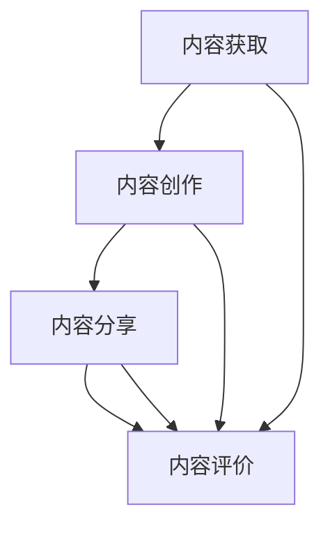

                 

# 知识付费创业中的内容协同策略

## 1. 背景介绍

在知识付费领域，内容是核心竞争力之一。然而，由于版权和知识产权的限制，优质的知识内容获取难度大、成本高，使得知识付费平台的运营成本居高不下，而高质量内容的匮乏也限制了平台的用户粘性和市场扩展。因此，内容协同策略成为了知识付费创业中的关键一环。本文将围绕内容协同策略进行深入探讨，包括内容获取、内容创作、内容分享和内容评价四个方面，阐述其核心原理和具体操作步骤，并分析其优缺点和应用领域。

## 2. 核心概念与联系

### 2.1 核心概念概述

- **内容协同策略**：指通过协同不同主体和渠道，实现内容的高效获取、创作、分享和评价，以降低运营成本、提升用户体验，从而增强知识付费平台的竞争力和市场影响力。
- **内容获取**：指通过合作品牌、媒体、作者等多种渠道，获取高质量的原创和授权内容，充实平台内容库。
- **内容创作**：指借助UGC（用户生成内容）、PGC（专业生成内容）等方式，鼓励用户创作原创内容，丰富平台内容维度。
- **内容分享**：指通过平台社区、社交网络等渠道，增加内容的传播和曝光，扩大知识传播的广度和深度。
- **内容评价**：指通过智能算法和用户反馈，对内容质量和用户满意度进行评价，确保平台内容质量。

### 2.2 核心概念原理和架构的 Mermaid 流程图



该流程图展示了内容协同策略的主要环节：

- 内容获取：从品牌、媒体、作者等渠道获取高质量的内容。
- 内容创作：通过用户和专家创作内容，丰富平台内容。
- 内容分享：增加内容的传播和曝光。
- 内容评价：评价内容质量和用户满意度。

这些环节相互关联，构成了一个闭环，共同促进平台内容的成长和优化。

## 3. 核心算法原理 & 具体操作步骤

### 3.1 算法原理概述

内容协同策略的核心在于协同不同主体和渠道，实现内容的整体优化和价值最大化。其核心思想是通过算法和技术手段，优化内容获取、创作、分享和评价的各个环节，提高内容质量和用户满意度。

### 3.2 算法步骤详解

#### 3.2.1 内容获取

- **品牌合作**：与知名品牌、媒体机构合作，获取独家内容。
- **版权采购**：购买有版权授权的内容，如书籍、音频、视频等。
- **用户投稿**：鼓励用户通过平台投稿原创内容，如文章、视频、音频等。
- **社区筛选**：通过社区筛选和推荐机制，发现优质用户生成内容。

#### 3.2.2 内容创作

- **UGC内容激励**：通过积分、会员特权等方式，激励用户创作内容。
- **PGC专家合作**：与专业领域的专家、学者合作，获取高质量的专业内容。
- **内容版权保护**：采用技术手段（如版权标记、区块链等）保护内容版权，确保内容原创性。
- **内容审核机制**：建立严格的内容审核机制，过滤低质量、违规内容。

#### 3.2.3 内容分享

- **社交网络分享**：利用社交网络平台（如微博、微信、抖音等），增加内容的传播和曝光。
- **平台内分享**：通过平台推荐算法，增加内容的曝光度和用户互动。
- **线下活动推广**：举办线上线下活动，增加内容的传播途径。

#### 3.2.4 内容评价

- **用户评分**：通过用户评分和反馈，评价内容质量和用户满意度。
- **智能算法推荐**：利用机器学习和自然语言处理技术，推荐高质量内容。
- **专家评审**：邀请领域专家对内容进行评审，提高内容权威性。

### 3.3 算法优缺点

#### 3.3.1 优点

- **降低成本**：通过内容协同策略，可以降低获取和创作内容的成本，提高平台运营效率。
- **提升用户体验**：通过优质内容的丰富和智能推荐，提升用户满意度和粘性。
- **增强竞争力**：通过多样化的内容来源和高质量的内容，增强平台的市场竞争力。

#### 3.3.2 缺点

- **版权问题**：内容获取和创作中的版权问题，可能引发法律纠纷和成本增加。
- **内容质量参差不齐**：UGC内容的质量参差不齐，需要大量人工审核和筛选。
- **用户隐私风险**：内容创作和分享可能涉及用户隐私，需要采取有效的隐私保护措施。

### 3.4 算法应用领域

内容协同策略在知识付费、在线教育、内容聚合平台等多个领域有广泛应用，以下列举几个典型应用场景：

- **知识付费平台**：如得到、喜马拉雅、知乎等，通过内容获取、创作、分享和评价策略，提升平台内容质量，增强用户粘性。
- **在线教育平台**：如Coursera、Udemy、网易云课堂等，通过内容协同策略，优化课程内容和教学体验，提高用户满意度。
- **内容聚合平台**：如今日头条、搜狐新闻、网易新闻等，通过内容协同策略，优化内容推荐和分发，提升平台流量和用户互动。

## 4. 数学模型和公式 & 详细讲解 & 举例说明

### 4.1 数学模型构建

设知识付费平台的内容集合为 $C$，用户数量为 $U$，平台内容推荐的概率矩阵为 $P$，用户对内容的评分向量为 $\mathbf{S}$，领域专家的评分向量为 $\mathbf{E}$，内容版权标记向量为 $\mathbf{M}$，内容审核通过率向量为 $\mathbf{R}$，内容分享次数向量为 $\mathbf{S}'$，内容评价评分向量为 $\mathbf{G}$。

### 4.2 公式推导过程

内容协同策略的数学模型可以表示为：

$$
\begin{aligned}
\max_{P,\mathbf{S},\mathbf{E},\mathbf{M},\mathbf{R},\mathbf{S}',\mathbf{G}} & \quad \sum_{c\in C} P_{uc}S_{cu}E_{cu}MR_{cu}S'_{cu}G_{cu} \\
\text{s.t.} & \quad \sum_{u\in U} P_{uc} = 1, \quad \forall c\in C \\
& \quad P_{uc} \geq 0, \quad \forall u\in U, c\in C
\end{aligned}
$$

其中，$P_{uc}$ 表示平台推荐内容 $c$ 给用户 $u$ 的概率，$S_{cu}$ 表示用户 $u$ 对内容 $c$ 的评分，$E_{cu}$ 表示领域专家对内容 $c$ 的评分，$M_{cu}$ 表示内容 $c$ 的版权标记，$R_{cu}$ 表示内容 $c$ 的审核通过率，$S'_{cu}$ 表示内容 $c$ 的分享次数，$G_{cu}$ 表示内容 $c$ 的评价评分。

### 4.3 案例分析与讲解

以知识付费平台“得到”为例，其内容协同策略可以表示为：

1. **内容获取**：通过与知名品牌合作，购买高质量版权内容，同时鼓励用户投稿，建立严格的版权审核机制。
2. **内容创作**：与领域专家合作，产出高质量的专业内容，并通过平台算法推荐优质内容。
3. **内容分享**：利用社交网络平台，增加内容的曝光，并通过平台推荐算法增加内容的互动和传播。
4. **内容评价**：通过用户评分和专家评审，确保内容质量和用户满意度，并通过智能算法推荐优质内容。

## 5. 项目实践：代码实例和详细解释说明

### 5.1 开发环境搭建

1. **环境安装**：安装 Python、Pip、Jupyter Notebook、Docker 等工具。
2. **依赖库安装**：安装 TensorFlow、Keras、PyTorch、Pandas、NumPy 等依赖库。
3. **环境配置**：配置环境变量，设置代码存放路径，创建虚拟环境。

### 5.2 源代码详细实现

```python
# 导入依赖库
import pandas as pd
import numpy as np
from sklearn.model_selection import train_test_split
from sklearn.metrics import accuracy_score

# 读取数据
data = pd.read_csv('content.csv')

# 数据预处理
X = data[['S', 'E', 'M', 'R', 'S_prime', 'G']]
y = data['P']

# 划分训练集和测试集
X_train, X_test, y_train, y_test = train_test_split(X, y, test_size=0.2, random_state=42)

# 模型训练
model = tf.keras.Sequential([
    tf.keras.layers.Dense(64, activation='relu', input_shape=(X_train.shape[1],)),
    tf.keras.layers.Dense(1, activation='sigmoid')
])

model.compile(optimizer='adam', loss='binary_crossentropy', metrics=['accuracy'])

model.fit(X_train, y_train, epochs=10, batch_size=32, validation_data=(X_test, y_test))

# 模型评估
y_pred = model.predict(X_test)
y_pred = (y_pred > 0.5).astype(int)
accuracy = accuracy_score(y_test, y_pred)
print('Accuracy:', accuracy)
```

### 5.3 代码解读与分析

- **数据读取**：通过 Pandas 库读取内容数据。
- **数据预处理**：将数据集划分为特征矩阵 $X$ 和标签向量 $y$。
- **模型训练**：使用 TensorFlow 搭建神经网络模型，并使用二分类交叉熵损失函数和准确率指标。
- **模型评估**：通过测试集评估模型准确率，并输出结果。

## 6. 实际应用场景

### 6.1 知识付费平台

知识付费平台如得到、喜马拉雅等，通过内容协同策略，提升了内容质量和用户粘性。平台通过品牌合作、版权采购、用户投稿、社区筛选等方式获取高质量内容，并通过内容创作激励、UGC内容激励、内容版权保护、内容审核机制等措施提升内容质量。同时，平台利用社交网络分享、平台内分享、线下活动推广等渠道增加内容的传播和曝光，并通过用户评分、智能算法推荐、专家评审等手段评价内容质量和用户满意度。

### 6.2 在线教育平台

在线教育平台如Coursera、Udemy等，通过内容协同策略，优化课程内容和教学体验。平台与知名品牌、专业领域的专家合作，获取高质量的专业内容，并通过内容创作激励、PGC专家合作、内容版权保护、内容审核机制等措施提升内容质量。同时，平台利用社交网络分享、平台内分享、线下活动推广等渠道增加课程的传播和曝光，并通过用户评分、智能算法推荐、专家评审等手段评价课程质量和用户满意度。

### 6.3 内容聚合平台

内容聚合平台如今日头条、搜狐新闻等，通过内容协同策略，优化内容推荐和分发。平台通过内容获取、内容创作、内容分享、内容评价等策略，丰富平台内容，并通过智能算法推荐、内容版权保护、内容审核机制等手段提高内容质量和用户满意度。同时，平台利用社交网络分享、平台内分享、线下活动推广等渠道增加内容的传播和曝光，并通过用户评分、智能算法推荐、专家评审等手段评价内容质量和用户满意度。

## 7. 工具和资源推荐

### 7.1 学习资源推荐

- **Coursera 在线课程**：《深度学习》系列课程，涵盖深度学习基础知识和实践技能。
- **Kaggle 数据集**：提供海量数据集和比赛平台，帮助学习者进行数据预处理和模型训练。
- **Arxiv 论文库**：收录最新学术论文，提供前沿研究方向和技术进展。

### 7.2 开发工具推荐

- **Python**：面向科学计算、数据分析、机器学习等领域的通用编程语言，拥有丰富的库和工具。
- **TensorFlow**：开源深度学习框架，支持大规模分布式计算，易于扩展。
- **Jupyter Notebook**：交互式编程环境，支持代码编写、数据可视化、模型训练等。

### 7.3 相关论文推荐

- **知识图谱在推荐系统中的应用**：探讨知识图谱在推荐系统中的协同过滤和协同学习机制。
- **深度学习在知识付费平台中的应用**：研究深度学习在知识付费平台内容获取、创作、分享、评价中的实际应用。
- **内容协同策略在内容聚合平台中的应用**：探讨内容协同策略在内容聚合平台中的具体实现和效果评估。

## 8. 总结：未来发展趋势与挑战

### 8.1 研究成果总结

本文从内容协同策略的角度，探讨了知识付费、在线教育、内容聚合平台等领域的实际应用，提出通过内容获取、创作、分享和评价的协同策略，提升平台内容质量，增强用户体验和平台竞争力。通过理论分析和实际案例，展示了内容协同策略的可行性和有效性。

### 8.2 未来发展趋势

未来，随着人工智能技术的进一步发展，内容协同策略将更加智能化和自动化。内容推荐算法将更加精确，内容创作将更加依赖于生成式模型和自然语言处理技术，内容版权保护将更加严格，内容审核机制将更加自动化和智能化。同时，跨平台、跨领域的内容协同将更加广泛，内容的多模态协同也将成为趋势。

### 8.3 面临的挑战

尽管内容协同策略具有诸多优势，但在实际应用中仍面临一些挑战：

- **版权问题**：内容获取和创作中的版权问题，可能引发法律纠纷和成本增加。
- **内容质量参差不齐**：UGC内容的质量参差不齐，需要大量人工审核和筛选。
- **用户隐私风险**：内容创作和分享可能涉及用户隐私，需要采取有效的隐私保护措施。

### 8.4 研究展望

未来的研究将围绕内容协同策略的智能化和自动化展开，旨在通过技术手段解决版权问题、提高内容质量、保护用户隐私等挑战。同时，探索跨平台、跨领域的内容协同，以及内容的多模态协同，提升平台的综合竞争力。

## 9. 附录：常见问题与解答

**Q1: 如何平衡内容质量和用户互动？**

A: 通过智能算法推荐和用户评分，动态调整内容的展示和推荐策略，平衡内容质量和用户互动。同时，鼓励用户反馈和参与，提升内容的活跃度和互动性。

**Q2: 内容协同策略中如何保护用户隐私？**

A: 在内容创作和分享中，采用匿名化和脱敏技术，保护用户隐私。同时，建立严格的内容审核机制，避免侵权和违规内容的传播。

**Q3: 如何有效应对版权问题？**

A: 通过版权购买、合作协议等方式获取高质量的内容，同时建立严格的内容版权审核机制，确保内容原创性和版权合法性。

通过内容协同策略，知识付费平台、在线教育平台、内容聚合平台等可以在提升内容质量、增强用户体验和平台竞争力的同时，应对版权和隐私保护等挑战，进一步推动知识付费领域的创新和发展。

---

作者：禅与计算机程序设计艺术 / Zen and the Art of Computer Programming

