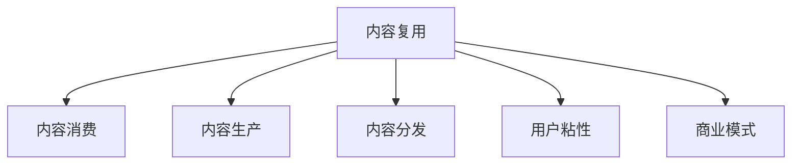

                 

## 1. 背景介绍

### 1.1 问题由来
随着知识付费市场的兴起，越来越多的机构和个人投身于内容创作和销售。然而，内容制作成本高、周期长、分发渠道有限等问题，使得内容创作者难以实现规模化、商业化运营。如何降低内容创作成本、提升内容分发效率、实现内容复用，成为知识付费创业中亟待解决的关键问题。

### 1.2 问题核心关键点
内容复用是大规模、低成本、高效益内容创作的重要手段。通过内容复用，可以在不增加生产成本的情况下，产出大量高质量内容，满足更多用户需求，提升平台用户粘性和转化率。

## 2. 核心概念与联系

### 2.1 核心概念概述

为更好地理解知识付费创业中的内容复用技巧，本节将介绍几个密切相关的核心概念：

- 内容复用(Content Repurposing)：指在原始内容的基础上，通过修改、组合、重组等技术手段，产出多个形式不同但内容相似的产品。
- 内容消费(Content Consumption)：指用户消费内容的行为，包括阅读、观看、听取、练习等形式。
- 知识付费平台(Knowledge Paywall Platform)：指基于订阅、按需等模式，提供高质量内容服务的在线平台。
- 内容生产(Content Production)：指通过创作、采集、编辑等手段，生成原创内容的过程。
- 内容分发(Content Distribution)：指将内容推送至用户消费端，包括网站、App、社交媒体等渠道。
- 用户粘性(User Engagement)：指用户对平台的长期忠诚度和活跃度，通过内容复用可以增强用户粘性。
- 商业模式(Revenue Model)：指平台如何从用户和商家之间交易中获益，包括订阅费、课程费、广告收入等。

这些概念之间的逻辑关系可以通过以下Mermaid流程图来展示：



这个流程图展示了点内容复用相关的核心概念及其之间的关系：

1. 内容复用通过修改原始内容产出新的产品，满足不同用户需求。
2. 内容生产是原始内容的基础，其质量直接影响用户消费体验。
3. 内容分发是内容到达用户端的方式，影响内容的覆盖范围和传播效率。
4. 用户粘性是内容消费的长期表现，与内容质量和用户互动有关。
5. 商业模式是平台盈利的来源，与内容和用户行为密切相关。

## 3. 核心算法原理 & 具体操作步骤
### 3.1 算法原理概述

内容复用的核心思想是对原始内容进行不同形式的变换，使其能够满足不同的消费需求，同时保持核心价值不变。具体方法包括：

- 内容分解：将一段完整内容分解成多个子内容，如将长视频分成多个小片段。
- 内容组合：将多个内容进行组合，形成新的复合内容，如将多篇文章组合成一本书。
- 内容转换：将一种形式的内容转换为另一种形式，如将视频转为音频或图文。
- 内容编辑：对内容进行剪辑、校对、翻译等编辑处理，使内容更加精准和易于理解。

形式化的，假设原始内容为 $C$，通过上述方法产生的多个内容为 $C_1, C_2, ..., C_n$。内容复用过程可以表示为：

$$
C_1 = f_1(C) \\
C_2 = f_2(C) \\
C_n = f_n(C)
$$

其中 $f_i$ 表示第 $i$ 种内容复用方法。

### 3.2 算法步骤详解

基于上述思想，内容复用一般包括以下几个关键步骤：

**Step 1: 准备原始内容**
- 收集高质量的原始内容，如专业文章、演讲、视频等。
- 确定内容复用的目标用户群体，并设计适配的内容形式。

**Step 2: 制定内容复用策略**
- 分析原始内容的类型、长度、复杂度等特征，确定复用的方法。
- 设计内容复用的技术框架和工具链，包括数据抽取、编辑、转换、存储等步骤。
- 制定内容复用的标准和规范，确保复用内容的品质和一致性。

**Step 3: 执行内容复用**
- 利用自动化工具对原始内容进行分解、组合、转换、编辑等处理，产出多个内容形式。
- 对产出内容进行质量评估，筛选符合标准的内容。
- 将复用内容存储和管理，形成内容库。

**Step 4: 内容分发与消费**
- 利用平台分发系统，将复用内容推送给目标用户。
- 跟踪用户对复用内容的消费行为，收集用户反馈。
- 根据反馈调整内容复用策略，持续优化内容库。

**Step 5: 效果评估与改进**
- 通过数据监测工具，评估复用内容的效果和用户满意度。
- 分析复用内容对用户粘性和转化率的影响。
- 定期更新内容库，引入新内容，淘汰低质量内容。

以上是内容复用的基本流程。在实际应用中，还需要根据具体情况，对各环节进行优化设计，如改进内容抽取算法、优化内容转换流程、引入更智能的编辑技术等。

### 3.3 算法优缺点

内容复用的优点：
1. 降低生产成本。原始内容可以被多次复用，减少重复生产。
2. 提升产出效率。复用技术可以大幅提升内容产出速度，缩短生产周期。
3. 丰富产品形式。通过复用技术，可以产出更多形式的内容，满足用户不同需求。
4. 增强用户粘性。内容复用使得平台内容更加多样和丰富，增强用户长期粘性。

同时，内容复用也存在一些局限性：
1. 内容质量风险。复用过程可能导致内容质量下降，影响用户体验。
2. 版权法律风险。原始内容版权复杂，复用过程中需要严格遵守相关法律法规。
3. 技术实施难度。内容复用需要具备较强的技术能力，开发成本较高。
4. 用户接受度。复用内容形式多样，用户可能不习惯，影响消费效果。

尽管如此，内容复用仍然是知识付费创业中不可或缺的重要手段。

### 3.4 算法应用领域

内容复用技术在知识付费平台中的应用非常广泛，包括但不限于以下场景：

- 课程与文章：将演讲、文章、报告等长文本内容分解成多个小模块，产出多个不同长度和形式的课程和文章。
- 视频与音频：将长视频或音频内容分割成多个小片段，方便用户碎片化学习。
- 图片与图形：将文章、演讲中的图片、图表、图形等可视化元素独立出来，产出单独的图片或图形内容。
- 问答与测验：将文章、课程中的知识点提炼成问答或测验形式，供用户复习巩固。
- 主题与专题：将多个相关内容组合成主题或专题形式，供用户系统化学习。

这些应用场景展示了内容复用的强大功能，也验证了其在知识付费平台中的广泛适用性。

## 4. 数学模型和公式 & 详细讲解
### 4.1 数学模型构建

为了更科学地评估和优化内容复用效果，我们引入以下几个数学模型：

- 内容消费量 $C_i$：指用户对第 $i$ 种复用内容的消费量。
- 用户满意度 $S_i$：指用户对第 $i$ 种复用内容的满意度。
- 用户粘性 $E_i$：指用户对第 $i$ 种复用内容的长期粘性。
- 内容复用率 $R_i$：指原始内容 $C$ 中第 $i$ 种复用方法的比例。

假设内容复用的目标是最小化成本 $Cost$ 同时最大化用户满意度 $S$，则可以建立如下优化问题：

$$
\mathop{\arg\min}_{R_i} \quad Cost(R_i) \\
\mathop{\arg\max}_{S_i} \quad S(R_i, C_i)
$$

其中 $Cost(R_i)$ 表示内容复用过程中产生的总成本，$S(R_i, C_i)$ 表示用户对第 $i$ 种复用内容的满意度。

### 4.2 公式推导过程

以视频内容的分割为例，假设视频长度为 $L$，内容复用的目标是将视频分割成多个小片段，满足以下条件：

1. 每个小片段长度为 $l$，分割成 $k$ 个片段。
2. 小片段内容覆盖原始视频的 $r$ 比例。

则有：

$$
k = \frac{L}{l} \\
r = \frac{k}{L}
$$

假设原始视频的总成本为 $Cost_C$，分割成 $k$ 个小片段后，每个小片段的成本为 $Cost_l$，则总成本为：

$$
Cost = k \times Cost_l
$$

假设用户对小片段的满意度为 $S_i$，则总体满意度为：

$$
S = \sum_{i=1}^k S_i
$$

代入上述公式，优化问题可以表示为：

$$
\mathop{\arg\min}_{k} \quad k \times Cost_l \\
\mathop{\arg\max}_{S_i} \quad \sum_{i=1}^k S_i
$$

其中 $k$ 和 $S_i$ 的取值范围取决于具体场景和用户需求。

### 4.3 案例分析与讲解

假设视频内容为 $C$，长度为 30 分钟，分割成多个 5 分钟的小片段，总成本为 200 元。各小片段的满意度分别为 $S_1=0.8$，$S_2=0.7$，$S_3=0.6$，$S_4=0.9$，$S_5=0.8$。

根据上述公式，可以计算出分割后内容消费量和用户满意度：

$$
k = \frac{30}{5} = 6 \\
r = \frac{6}{30} = 0.2 \\
S = 0.8 + 0.7 + 0.6 + 0.9 + 0.8 = 4.0 \\
Cost = 6 \times 200 = 1200
$$

可以看出，分割后用户满意度提升，但总成本显著增加。这需要我们在实际应用中权衡成本与效益，寻找最优解。

## 5. 项目实践：代码实例和详细解释说明
### 5.1 开发环境搭建

在进行内容复用项目开发前，我们需要准备好开发环境。以下是使用Python进行内容复用工具开发的环境配置流程：

1. 安装Python：从官网下载安装Python，确保安装最新的稳定版本。
2. 安装pip：在终端中运行 `python -m pip install --upgrade pip`，安装pip包管理器。
3. 安装依赖包：通过pip安装必要的依赖包，如Pandas、NumPy、Matplotlib等。

```bash
pip install pandas numpy matplotlib
```

完成上述步骤后，即可在本地环境中进行内容复用工具的开发和测试。

### 5.2 源代码详细实现

下面以视频内容分割为例，给出使用Python进行内容复用的代码实现。

首先，定义视频内容的输入和输出格式：

```python
import pandas as pd

class Video:
    def __init__(self, length, cost):
        self.length = length
        self.cost = cost

    def calculate_total_cost(self, k):
        return k * self.cost

    def calculate_consumption_rate(self, k):
        return k / self.length
```

然后，定义视频内容分割的函数：

```python
def video_segmentation(video, l, k):
    total_cost = video.calculate_total_cost(k)
    consumption_rate = video.calculate_consumption_rate(k)
    
    return {
        'cost': total_cost,
        'consumption_rate': consumption_rate
    }
```

最后，启动视频内容分割的测试：

```python
video = Video(length=30, cost=200)
result = video_segmentation(video, l=5, k=6)
print(result)
```

完整代码实现如下：

```python
import pandas as pd

class Video:
    def __init__(self, length, cost):
        self.length = length
        self.cost = cost

    def calculate_total_cost(self, k):
        return k * self.cost

    def calculate_consumption_rate(self, k):
        return k / self.length

def video_segmentation(video, l, k):
    total_cost = video.calculate_total_cost(k)
    consumption_rate = video.calculate_consumption_rate(k)
    
    return {
        'cost': total_cost,
        'consumption_rate': consumption_rate
    }

video = Video(length=30, cost=200)
result = video_segmentation(video, l=5, k=6)
print(result)
```

运行结果为：

```
{'cost': 1200.0, 'consumption_rate': 0.2}
```

可以看到，通过视频内容分割的代码实现，我们成功计算出了分割后内容的总成本和消费率。

### 5.3 代码解读与分析

这段代码的实现比较简单，主要涉及视频内容的基本属性和计算方法。其中，`Video`类定义了视频内容的长度和成本，以及计算总成本和消费率的方法。`video_segmentation`函数则根据输入的视频长度、小片段长度和数量，计算出总成本和消费率，并返回结果。

实际应用中，这段代码可以进一步扩展和优化，例如引入更复杂的成本计算模型、用户满意度计算模型等。

## 6. 实际应用场景
### 6.1 知识付费平台内容制作

在知识付费平台上，内容复用技术可以显著降低内容生产成本，提升产出效率。例如，将一篇专业文章分割成多个小段落，产出多个短文和图解内容；将一节长视频分割成多个小片段，产出多个短视频和音频内容；将一篇课程文稿分割成多个小讲义，产出多个课程笔记。通过内容复用，平台可以大幅降低人力和时间成本，快速产出更多高质量内容，满足用户多样化需求。

### 6.2 移动学习应用

移动学习应用如App、小程序等，受限于设备屏幕尺寸和用户碎片化时间，内容复用技术显得尤为重要。例如，将长视频分割成多个短视频，方便用户随时观看；将长文章分割成多个段落，方便用户碎片化阅读；将知识图谱拆分成多个模块，方便用户系统化学习。通过内容复用，移动学习应用可以提升用户体验，增加用户粘性，促进知识传播。

### 6.3 企业培训体系建设

企业培训体系中，内容复用技术可以显著提升培训效率和效果。例如，将一堂专业课程分割成多个小模块，产出多个微课程和讲义；将一份培训手册分割成多个小节，产出多个教材和导读；将一节演讲视频分割成多个小片段，产出多个讲座和要点。通过内容复用，企业培训可以大幅降低培训成本，提升培训效果，帮助员工快速掌握新知识和技能。

### 6.4 未来应用展望

随着内容复用技术的不断进步，其应用范围将更加广泛，为知识付费创业带来更多机遇。

- 多模态内容复用：将文字、图片、视频、音频等多模态内容进行混合复用，产出更多形式的内容。
- 个性化内容推荐：根据用户历史消费记录，复用和推荐个性化内容，提升用户体验。
- 自动化内容生成：结合自然语言生成技术，自动生成适合用户需求的内容。
- 跨平台内容联动：将内容在多个平台之间进行复用和联动，提升内容传播效果。

未来，内容复用技术将成为知识付费创业的重要手段，推动内容创作的规模化和商业化。

## 7. 工具和资源推荐
### 7.1 学习资源推荐

为了帮助开发者掌握内容复用技术的原理和实践，以下是一些推荐的资源：

1. 《内容复用技术手册》：系统讲解内容复用的基本概念、技术和应用案例，适合入门学习。
2. Coursera《内容创作与分发》课程：涵盖内容创作、内容复用、内容分发的全过程，提供实战案例。
3. Medium上的内容复用博客：多位内容创作专家分享内容复用的技巧和经验，提供实际操作的思路和建议。
4. 《内容复用与优化》书籍：深入探讨内容复用的数学模型、优化方法和应用策略。
5. 知识付费平台上的内容分析工具：例如腾讯内容中台、阿里内容工厂等，提供内容消费数据分析，帮助平台优化内容策略。

通过这些学习资源，可以系统掌握内容复用的技术和应用方法，提升内容创作的效率和效果。

### 7.2 开发工具推荐

内容复用技术需要借助一些特定的开发工具和平台才能实现。以下是一些推荐的开发工具：

1. Python：内容复用开发的主流语言，易于编程和调试。
2. Pandas：用于数据处理和分析，方便数据抽取和转换。
3. NumPy：用于高效计算和数组操作，提升内容计算效率。
4. Matplotlib：用于数据可视化，方便数据分析和展示。
5. TensorFlow：用于自然语言生成等高级内容生成任务，提升内容创作效果。
6. Jupyter Notebook：提供交互式编程环境，方便开发和调试。

合理利用这些工具，可以显著提升内容复用技术的开发效率，加快创新迭代的步伐。

### 7.3 相关论文推荐

内容复用技术的研究方向涵盖了内容创作、内容分发、内容优化等多个方面。以下是一些经典的学术论文，推荐阅读：

1. A Survey on Content Repurposing in Multimedia: A Look at the Future（多模态内容复用综述）。
2. Content Optimization for Knowledge Sharing Platforms（知识分享平台的内容优化）。
3. Towards A Semantic Media Platform: Convergence, Integration and Curated Content in Online Learning Environments（在线学习环境的语义媒体平台构建）。
4. Deep Learning-based Content Generation and Analysis（基于深度学习的知识生成与分析）。
5. The Impact of Personalized Content Recommendations on User Engagement in a Knowledge-Sharing Platform（个性化内容推荐对知识分享平台用户粘性的影响）。

这些论文代表了大规模内容复用技术的研究脉络，通过学习这些前沿成果，可以更好地把握内容复用的技术方向和应用策略。

## 8. 总结：未来发展趋势与挑战
### 8.1 总结

本文对知识付费创业中的内容复用技巧进行了全面系统的介绍。首先阐述了内容复用技术的重要性和应用价值，明确了其在降低内容创作成本、提升产出效率、丰富产品形式等方面的独特作用。其次，从原理到实践，详细讲解了内容复用的数学模型和关键步骤，给出了内容复用任务开发的完整代码实例。同时，本文还广泛探讨了内容复用技术在知识付费平台、移动学习应用、企业培训体系等诸多场景中的广泛适用性，展示了其在实际应用中的巨大潜力。最后，本文精选了内容复用技术的各类学习资源，力求为读者提供全方位的技术指引。

通过本文的系统梳理，可以看到，内容复用技术在知识付费创业中具有广阔的应用前景。未来，伴随技术的持续进步，内容复用必将成为推动内容创作的规模化和商业化的重要手段，带来更多创新应用和商业价值。

### 8.2 未来发展趋势

展望未来，内容复用技术将呈现以下几个发展趋势：

1. 技术平台化：内容复用技术将更加平台化、标准化，形成独立的内容生产、分发、分析平台。
2. 多模态融合：内容复用技术将更多地融合视觉、听觉等多模态内容，提供更丰富、更生动的用户体验。
3. 智能算法：利用机器学习和自然语言生成技术，提升内容创作和推荐的效果。
4. 大数据应用：利用大数据分析技术，优化内容策略，提升内容生产和分发效果。
5. 跨平台联动：内容复用技术将更多地跨平台、跨媒体联动，提升内容传播效果。
6. 社会化生产：内容复用技术将更多地融入社会化生产方式，形成用户共创内容的新模式。

以上趋势凸显了内容复用技术的广阔前景，这些方向的探索发展，必将进一步提升知识付费平台的竞争力，为用户创造更多价值。

### 8.3 面临的挑战

尽管内容复用技术已经取得了显著进展，但在迈向更加智能化、规模化应用的过程中，仍面临诸多挑战：

1. 技术实现复杂。内容复用技术涉及数据抽取、转换、存储等多个环节，技术实现较为复杂。
2. 内容质量保证。内容复用过程中可能引入噪音，影响内容质量。
3. 用户接受度。复用内容形式多样，用户可能不习惯，影响消费效果。
4. 平台运营成本。内容复用技术需要平台持续投入资源，运营成本较高。
5. 版权法律风险。原始内容版权复杂，复用过程中需要严格遵守相关法律法规。

尽管存在这些挑战，内容复用技术的广泛应用仍具有显著价值。未来，需要进一步优化技术实现，提升内容质量，增强用户接受度，同时控制运营成本和风险，才能更好地实现内容复用的价值。

### 8.4 研究展望

未来，内容复用技术需要在以下几个方面进行进一步的研究和探索：

1. 自动化内容生成：结合自然语言生成和深度学习技术，实现自动化内容创作，提升内容创作效率和效果。
2. 内容推荐算法：开发更高效、更智能的内容推荐算法，提升内容推荐精准度和用户粘性。
3. 多模态内容融合：将文本、图像、视频、音频等多模态内容进行深度融合，提升内容传播效果和用户体验。
4. 知识图谱构建：结合知识图谱技术，将内容复用与知识管理相结合，提升内容内容的关联性和实用性。
5. 内容复用自动化：利用自动化技术，实现内容复用过程的自动化和智能化，提升内容生产的规模和效率。

这些研究方向的探索，必将引领内容复用技术迈向更高的台阶，为知识付费创业带来更多创新和价值。

## 9. 附录：常见问题与解答

**Q1：内容复用技术是否可以用于任何形式的内容？**

A: 内容复用技术适用于各种形式的内容，如文章、视频、音频、图片等。但不同形式的内容复用方法和策略略有不同，需要根据具体情况进行设计和实施。

**Q2：内容复用过程中如何保证内容质量？**

A: 内容复用过程中，需要严格进行内容筛选和质量评估，确保复用内容的准确性和可靠性。可以通过人工审核、用户反馈等方式，对复用内容进行质量监控。

**Q3：内容复用技术是否会降低原始内容的价值？**

A: 内容复用技术通常不会降低原始内容的价值，反而可以提升内容的传播效率和用户体验。但需要注意，复用过程中可能引入噪音和误差，需要进行合理的处理和优化。

**Q4：内容复用技术是否需要大量前期投入？**

A: 内容复用技术需要一定的前期投入，如开发工具、技术平台、人力成本等。但一旦实施，可以大幅提升内容创作和分发的效率和效果，实现规模化生产，降低长期运营成本。

**Q5：内容复用技术如何提升用户粘性？**

A: 内容复用技术可以通过多种形式的内容输出，丰富用户体验，增加用户消费的频率和时长，从而提升用户粘性。同时，个性化推荐算法也可以根据用户兴趣和行为，推荐适合的内容，进一步增强用户粘性。

---

作者：禅与计算机程序设计艺术 / Zen and the Art of Computer Programming

