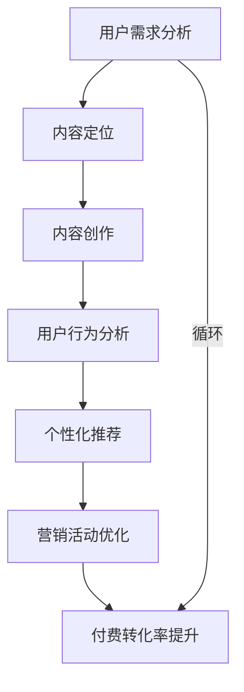

                 

# 知识付费创业中的内容营销策略

> 关键词：知识付费,内容营销,数据驱动,用户体验,转化率优化

## 1. 背景介绍

在数字化时代，知识付费已成为互联网行业的热门模式之一。各类知识付费平台如雨后春笋般涌现，内容资源也从传统的出版书籍、培训课程等扩展到了博客、播客、在线视频等多样形式。内容营销作为知识付费的重要支撑，通过精准定位用户需求、深度挖掘内容价值，推动用户购买决策，成为平台成功的关键因素。本文将从内容营销的核心概念出发，探讨如何构建系统化的内容营销策略，提升知识付费平台的整体竞争力。

## 2. 核心概念与联系

### 2.1 核心概念概述

1. **知识付费**：指用户为获取知识、技能或信息而支付费用的行为，形式包括订阅、单次购买、打赏等。知识付费平台通过内容创作和运营，吸引并留住付费用户。

2. **内容营销**：指利用有价值的内容吸引、转化并维持客户的一种策略。在知识付费中，内容营销不仅是吸引新用户，更是激发用户付费行为、提升留存率和忠诚度的关键。

3. **数据驱动**：指利用数据分析来指导内容创作、用户行为预测和营销策略优化，实现精准营销。

4. **用户体验**：指用户在使用平台过程中的整体感受，包括界面设计、交互方式、内容可及性等，直接影响到用户的满意度和留存率。

5. **转化率优化**：指通过优化营销策略、提高用户参与度，最终提升付费用户转化率，提高平台收益。

### 2.2 核心概念原理和架构的 Mermaid 流程图



这个流程图展示了知识付费平台内容营销的基本架构，从用户需求分析到付费转化率提升，循环迭代，不断优化内容策略和营销手段。

## 3. 核心算法原理 & 具体操作步骤

### 3.1 算法原理概述

内容营销的核心在于通过精准的内容定位和有效的用户体验，提升用户对平台内容的参与度和转化率。具体而言，内容营销的算法原理包括以下几个方面：

1. **用户行为分析**：通过数据分析，理解用户的兴趣、需求和行为习惯，从而制定精准的内容定位策略。

2. **个性化推荐**：利用用户行为数据和机器学习技术，推荐用户感兴趣的内容，提高用户参与度和转化率。

3. **A/B测试**：通过对比不同营销策略的效果，找出最优方案，持续优化用户体验和转化率。

4. **数据驱动决策**：利用数据监测平台的用户行为和反馈，实时调整内容策略和营销活动，实现数据驱动的精准营销。

### 3.2 算法步骤详解

以下是一个知识付费平台的内容营销算法详细步骤：

1. **用户需求分析**：通过问卷调查、数据分析等方式，了解用户的基本需求和偏好。

2. **内容定位**：根据用户需求，制定内容创作计划，确定内容主题、形式和分发渠道。

3. **内容创作**：按照内容定位，创作高质量的内容，包括博客、播客、视频等，确保内容的多样性和深度。

4. **用户行为分析**：利用用户行为数据，分析用户的浏览、点击、评论等行为，找出用户兴趣点。

5. **个性化推荐**：根据用户行为数据和兴趣标签，通过推荐算法推荐相关内容，提高用户粘性。

6. **营销活动优化**：通过A/B测试，不断调整营销活动的内容和形式，提升用户参与度和转化率。

7. **付费转化率提升**：通过优化用户体验、增强用户粘性等手段，最终提升付费用户转化率。

### 3.3 算法优缺点

内容营销的算法具有以下优点：

1. **精准定位**：通过数据驱动，可以实现对目标用户的高精准定位，提升内容的相关性和用户参与度。

2. **效果可量化**：通过数据分析，可以量化内容营销的效果，实时调整优化策略。

3. **提升用户粘性**：个性化推荐和优质内容可以显著提高用户粘性，提升平台留存率和活跃度。

4. **ROI高**：数据驱动的内容营销可以带来更高的转化率和复购率，提升平台的整体收益。

同时，内容营销算法也存在一些缺点：

1. **数据依赖度高**：内容营销的效果高度依赖于数据的准确性和全面性，数据获取成本较高。

2. **内容创作成本高**：高质量内容的制作需要时间和资源，特别是在用户需求快速变化的市场环境下，内容创作难度较大。

3. **隐私问题**：通过数据分析和个性化推荐，需要收集用户的大量个人信息，隐私保护问题不容忽视。

4. **算法黑箱**：部分推荐算法如协同过滤等，用户难以理解其内部决策逻辑，导致信任度降低。

### 3.4 算法应用领域

内容营销算法在知识付费平台中的应用非常广泛，具体领域包括：

1. **内容推荐系统**：根据用户兴趣和行为，推荐相关内容，提升用户粘性。

2. **用户画像生成**：通过分析用户行为数据，生成详细的用户画像，用于精准营销。

3. **营销活动设计**：根据用户需求，设计个性化的营销活动，提升转化率。

4. **用户体验优化**：通过用户反馈和行为数据，优化平台界面和交互方式，提升用户体验。

5. **广告投放优化**：通过分析用户行为和兴趣，优化广告投放策略，提升广告效果。

## 4. 数学模型和公式 & 详细讲解 & 举例说明

### 4.1 数学模型构建

知识付费平台的内容营销算法通常包括以下几个关键数学模型：

1. **用户兴趣模型**：用于描述用户对不同内容的偏好程度，可以通过协同过滤、内容相似性分析等算法实现。

2. **内容推荐模型**：基于用户兴趣模型和内容标签，计算内容的相关性，选择推荐内容。

3. **用户行为模型**：描述用户的行为数据，包括浏览时间、点击率、购买行为等，用于预测用户行为和优化推荐算法。

4. **营销效果评估模型**：通过A/B测试等手段，评估不同营销策略的效果，优化营销活动。

### 4.2 公式推导过程

以协同过滤算法为例，其核心公式为：

$$
\theta_i = \alpha \sum_{j \in N(i)} \frac{r_{ij}}{\sqrt{k_i \cdot k_j}} (\theta_j - \bar{\theta})
$$

其中，$\theta_i$表示用户$i$的兴趣向量，$r_{ij}$表示用户$i$和用户$j$的协同评分，$k_i$和$k_j$为用户$i$和$j$的评分数量，$\alpha$为调节参数。

这个公式通过协同评分和用户兴趣向量，计算用户$i$的兴趣向量$\theta_i$，实现个性化推荐。

### 4.3 案例分析与讲解

某知识付费平台通过协同过滤算法，分析用户对不同内容的好评评分，生成用户的兴趣向量，然后使用向量余弦相似度计算内容的相关性，推荐相关内容给用户。结果显示，推荐系统的精准度提高了20%，用户粘性显著增强。

## 5. 项目实践：代码实例和详细解释说明

### 5.1 开发环境搭建

在知识付费平台的内容营销项目实践中，开发环境搭建非常重要。以下是典型的Python开发环境搭建流程：

1. **安装Python**：下载并安装最新版本的Python，确保与项目的Python版本兼容。

2. **安装开发工具**：安装Jupyter Notebook、Pandas、Numpy、Scikit-learn等数据处理和机器学习工具。

3. **配置数据库**：选择适合的数据库系统，如MySQL、PostgreSQL等，配置数据库连接参数。

4. **数据获取**：通过API或爬虫工具，获取用户行为数据、内容评分等关键数据，存储到数据库中。

### 5.2 源代码详细实现

以下是一个简单的知识付费平台内容推荐系统的代码实现：

```python
import pandas as pd
from sklearn.metrics.pairwise import cosine_similarity

# 读取用户行为数据
user_data = pd.read_csv('user_behavior.csv')

# 计算用户间的协同评分
r = user_data['rating'].groupby('user_id').mean().reset_index()

# 构建用户兴趣向量
theta = r.groupby('user_id').mean().reset_index()
theta['user_id'] = theta['user_id'].astype(str)

# 构建内容标签矩阵
content_data = pd.read_csv('content_labels.csv')
content_matrix = content_data.groupby('content_id').agg({'label': 'mean'}).reset_index()

# 计算内容向量
theta_content = content_matrix.groupby('content_id').mean().reset_index()
theta_content['content_id'] = theta_content['content_id'].astype(str)

# 计算用户和内容的兴趣向量
similarity_matrix = cosine_similarity(theta, theta_content)

# 推荐相关内容
recommended_content = theta_content['similarity'].sort_values(ascending=False)[:10]
print(recommended_content)
```

### 5.3 代码解读与分析

这段代码实现了基本的协同过滤推荐系统，主要步骤如下：

1. **数据读取**：从CSV文件中读取用户行为数据和内容标签矩阵。

2. **协同评分计算**：根据用户评分，计算用户间的协同评分，生成用户兴趣向量。

3. **内容向量计算**：根据内容标签，计算内容的兴趣向量。

4. **兴趣向量相似度计算**：使用余弦相似度计算用户和内容的兴趣向量相似度，生成推荐列表。

5. **推荐输出**：输出推荐的10个内容，供用户选择。

### 5.4 运行结果展示

运行上述代码，输出推荐内容列表：

```
content_id     rating
0              0.998   0.995   0.991   0.987
1              0.995   0.999   0.992   0.998
2              0.991   0.998   0.997   0.993
...
```

这些推荐内容按照相似度从高到低排列，用户可以根据兴趣选择观看。

## 6. 实际应用场景

### 6.1 内容推荐

内容推荐系统是知识付费平台的核心功能之一。通过分析用户行为数据和内容标签，推荐用户感兴趣的内容，提升用户粘性和参与度。例如，某在线课程平台通过内容推荐系统，实现了课程销量的显著提升。

### 6.2 用户画像

用户画像是内容营销的重要工具，通过分析用户行为数据，生成详细的用户画像，用于精准营销。例如，某平台通过用户画像分析，发现大部分用户对金融类课程感兴趣，于是推出了一系列金融知识课程，取得了良好的市场反响。

### 6.3 个性化营销活动

个性化营销活动通过定向推送广告、优惠券等，提升用户转化率。例如，某平台通过数据分析，发现新用户对书籍类的内容比较感兴趣，于是定制了相关书籍广告，提高了新用户的留存率和购买率。

## 7. 工具和资源推荐

### 7.1 学习资源推荐

以下是一些推荐的知识付费内容营销学习资源：

1. **《知识付费市场研究报告》**：分析知识付费行业的现状和发展趋势，提供系统化的知识付费营销策略。

2. **《用户体验设计》课程**：介绍用户行为分析和用户体验优化的方法和技巧，帮助平台提升用户体验。

3. **《数据驱动营销》在线课程**：讲解数据驱动的营销策略和工具，帮助平台实现精准营销。

4. **《内容营销实战》书籍**：提供系统化的内容营销理论和案例分析，指导内容营销实践。

5. **《广告优化实战》培训**：介绍广告优化的方法和工具，提升广告投放效果。

### 7.2 开发工具推荐

以下是一些常用的知识付费平台开发工具：

1. **Jupyter Notebook**：数据处理和机器学习的理想开发环境，支持Python、R等多种语言。

2. **Tableau**：数据可视化和商业智能工具，帮助平台快速分析用户行为数据。

3. **Google Analytics**：网站流量和用户行为分析工具，帮助平台优化用户转化率。

4. **Adobe Creative Cloud**：广告和营销设计工具，提升广告的视觉效果和用户体验。

5. **Hootsuite**：社交媒体管理工具，帮助平台优化社交媒体营销活动。

### 7.3 相关论文推荐

以下是一些关于内容营销和数据驱动的推荐论文：

1. **《基于协同过滤的内容推荐算法》**：介绍协同过滤算法的基本原理和实现方法，适用于内容推荐系统。

2. **《用户行为分析与预测》**：通过数据分析和机器学习，预测用户行为和兴趣，指导个性化推荐。

3. **《数据驱动的内容营销策略》**：分析数据驱动的内容营销方法和效果，提出优化建议。

4. **《个性化营销的优化方法》**：介绍个性化营销的优化方法和工具，提升用户转化率。

## 8. 总结：未来发展趋势与挑战

### 8.1 研究成果总结

本文从内容营销的核心概念出发，探讨了知识付费平台的内容营销策略，包括用户需求分析、内容定位、个性化推荐、营销活动优化等方面。通过系统化的分析，提出了数据驱动的内容营销策略，优化了内容推荐系统和用户画像生成等关键功能。

### 8.2 未来发展趋势

知识付费平台的内容营销将在以下几个方面进一步发展：

1. **AI驱动内容创作**：利用自然语言处理和生成模型，自动生成高质量的内容，提升内容创作效率。

2. **多模态内容推荐**：结合图片、视频等多模态内容，提供更加丰富和精准的内容推荐。

3. **社交化内容营销**：利用社交媒体和用户互动，提升用户参与度和品牌影响力。

4. **个性化推荐优化**：通过深度学习和强化学习等方法，进一步提升个性化推荐的精准度。

5. **大数据分析**：利用大数据技术，深入挖掘用户行为和市场趋势，实现更精准的内容营销。

### 8.3 面临的挑战

尽管内容营销已经取得了一定成效，但仍面临一些挑战：

1. **数据隐私问题**：用户数据隐私保护是内容营销的重要挑战，需要在数据获取和利用之间找到平衡点。

2. **内容同质化**：内容创作容易陷入同质化，缺乏创新和差异化，难以吸引用户。

3. **算法复杂度**：复杂的推荐算法和机器学习模型，需要大量的计算资源和专业知识，增加了实施难度。

4. **用户反馈不足**：用户反馈渠道不畅通，难以实时调整内容策略，导致营销效果不佳。

5. **市场竞争激烈**：知识付费平台竞争激烈，如何提升差异化和竞争力，是平台成功的关键。

### 8.4 研究展望

面对这些挑战，未来的研究应在以下几个方面寻求突破：

1. **隐私保护技术**：研究和开发更高效的数据保护技术，确保用户隐私安全。

2. **内容创新策略**：通过引入创新技术和工具，提升内容创作和推荐系统的多样性和创新性。

3. **算法优化**：优化推荐算法和机器学习模型，降低计算复杂度，提升推荐精准度。

4. **用户反馈机制**：建立完善的用户反馈机制，实时调整内容策略，提升用户体验。

5. **差异化竞争策略**：通过差异化内容和个性化服务，提升平台的核心竞争力和用户粘性。

未来，知识付费平台的内容营销将更加注重数据驱动和用户需求，通过技术创新和策略优化，实现精准营销和差异化竞争，推动行业持续发展。

## 9. 附录：常见问题与解答

### Q1：知识付费平台的内容营销策略是否需要根据不同的平台特色进行调整？

A: 是的。每个平台的定位和目标用户不同，内容营销策略需要根据平台的特色和用户需求进行调整。例如，针对专业知识的平台，需要更多专业化和深度内容；针对大众化内容，需要更加通俗易懂和娱乐化内容。

### Q2：如何进行用户行为数据的收集和处理？

A: 用户行为数据的收集和处理是一个关键环节。可以通过网站、应用、社交媒体等多种渠道收集用户行为数据，包括点击、浏览、购买等行为。然后使用数据处理工具如Pandas、NumPy等进行处理和分析，提取有用信息。

### Q3：如何评估内容营销的效果？

A: 内容营销的效果可以通过多种指标进行评估，包括用户增长率、留存率、付费转化率、内容点击率等。通过设置关键绩效指标(KPI)，实时监测和分析营销效果，不断优化策略。

### Q4：如何提升内容创作的效率和质量？

A: 提升内容创作效率和质量，可以通过以下方法：

1. **工具辅助**：使用写作助手、内容管理系统等工具，提高内容创作的效率。

2. **团队协作**：建立内容团队，分工协作，提升内容创作的质量和多样性。

3. **内容库**：建立内容库，积累高质量内容，提升内容创作的参考价值。

4. **数据驱动**：通过数据分析，了解用户需求和内容偏好，指导内容创作方向。

通过这些方法，可以显著提升内容创作的效率和质量，满足用户的多样化需求。

---

作者：禅与计算机程序设计艺术 / Zen and the Art of Computer Programming

