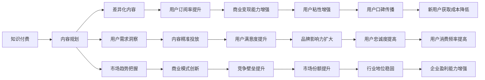

                 

# 知识付费创业中的内容规划策略

## 1. 背景介绍

在知识付费的浪潮中，内容是一个核心竞争力。优质的内容不仅能吸引用户订阅，还能实现长久的商业变现。本文将深入探讨知识付费创业中的内容规划策略，通过分析用户需求、市场趋势、内容差异化等关键因素，给出系统化的内容运营建议。

## 2. 核心概念与联系

### 2.1 核心概念概述

- **知识付费**：指消费者愿意为获取专业知识、技能、信息等付费的一种模式，包括在线课程、音频播客、电子书、咨询顾问等多种形式。
- **内容规划**：指根据市场需求、用户偏好、行业趋势等因素，制定内容生产和发布计划的过程。
- **差异化内容**：指在内容形式、主题、形式上与竞争对手有所区别，提供独特价值的创意。
- **用户需求洞察**：指通过数据分析、用户反馈等方式，深入理解用户真实需求和痛点，以指导内容设计。
- **市场趋势把握**：指对行业发展动态、技术创新、政策环境等要素进行持续监测和分析，以指导内容规划。

这些核心概念之间存在紧密联系，共同构成了一个完整的知识付费内容生态系统。

### 2.2 核心概念原理和架构的 Mermaid 流程图



## 3. 核心算法原理 & 具体操作步骤

### 3.1 算法原理概述

知识付费内容规划的核心算法可以简单地概括为：通过对用户需求和市场趋势的分析，结合差异化内容生产，实现用户粘性和商业变现的最大化。具体而言，内容规划过程可以分为以下几个步骤：

1. **用户需求分析**：通过数据挖掘、问卷调查、用户反馈等手段，深入理解用户的知识需求和支付意愿。
2. **市场趋势分析**：利用数据分析工具，实时监测行业发展动态、技术进步和政策变化，及时调整内容策略。
3. **差异化内容设计**：根据用户需求和市场趋势，创新内容形式和主题，实现差异化竞争。
4. **内容发布和优化**：根据用户行为数据，动态调整内容发布计划和优化策略，提高用户满意度和订阅率。
5. **商业变现策略制定**：通过用户数据分析，设计多样化的商业变现模式，如付费订阅、定制服务、知识付费平台合作等。

### 3.2 算法步骤详解

#### 3.2.1 用户需求分析

1. **数据收集**：收集用户在平台上的行为数据，包括浏览记录、搜索关键词、互动评论等。
2. **数据挖掘**：使用自然语言处理技术，对用户反馈和评论进行情感分析、主题分类，挖掘出用户的痛点和兴趣点。
3. **问卷调查**：定期开展问卷调查，直接获取用户的反馈和需求建议。

#### 3.2.2 市场趋势分析

1. **行业报告分析**：定期阅读行业报告，了解行业动态、技术发展趋势和政策变化。
2. **竞品分析**：监测竞争对手的内容策略、市场表现和用户反馈，找出差异化机会。
3. **技术追踪**：关注最新的技术和工具，如人工智能、大数据、区块链等，评估其对知识付费的影响。

#### 3.2.3 差异化内容设计

1. **内容形式创新**：探索视频、音频、图文、直播等多种内容形式，提升用户体验。
2. **主题多样化**：根据用户需求和市场趋势，设计多主题内容，如职业技能、生活休闲、健康管理等。
3. **差异化策略**：针对不同用户群体，设计差异化内容，如基础版、进阶版、专家版等。

#### 3.2.4 内容发布和优化

1. **内容排期**：根据用户行为数据，制定内容发布计划，动态调整发布时间和频率。
2. **A/B测试**：对不同内容形式和主题进行A/B测试，评估用户反馈和效果，优化内容策略。
3. **用户互动**：鼓励用户互动，如评论、点赞、分享等，提高内容的曝光和传播效果。

#### 3.2.5 商业变现策略制定

1. **定价策略**：根据内容价值和用户支付意愿，设计灵活的定价策略，如基础会员、高级会员、单次购买等。
2. **增值服务**：提供定制化服务，如1对1咨询、个性化推荐、专属内容等，提升用户粘性和满意度。
3. **合作平台**：与知名知识付费平台合作，扩大用户群体和市场影响力。

### 3.3 算法优缺点

#### 3.3.1 优点

1. **用户粘性提升**：通过差异化内容和精准投放，满足用户多样化需求，提高用户订阅和消费频率。
2. **商业变现能力增强**：多样化的商业变现策略，提升平台收入和盈利能力。
3. **市场竞争力增强**：差异化内容和精准投放，增强平台的市场竞争力和用户满意度。

#### 3.3.2 缺点

1. **资源投入大**：内容规划和差异化设计需要大量的资源投入，包括人力、技术、时间等。
2. **市场变化快**：市场需求和趋势变化快，需要持续监测和快速调整，增加了运营难度。
3. **风险较高**：内容创新和市场预测存在不确定性，可能导致内容策略失败，带来损失。

### 3.4 算法应用领域

知识付费内容规划策略可以广泛应用于在线教育、健康管理、职业技能培训、心理咨询等多个领域。不同的行业需求和用户群体，需要针对性的内容策略和市场分析。

## 4. 数学模型和公式 & 详细讲解 & 举例说明

### 4.1 数学模型构建

假设知识付费平台的月活跃用户数为 $N$，平台提供的内容类型为 $T$，用户对内容 $\textit{content}_t$ 的支付意愿为 $P_t$，平台内容发布策略为 $\textit{strategy}_s$。根据用户行为数据，我们可以构建一个数学模型来评估不同内容策略的效果。

目标函数为最大化用户订阅率和平台收入：

$$
\max_{s} \sum_{t} P_t \cdot F(\textit{strategy}_s, T)
$$

其中，$F(\textit{strategy}_s, T)$ 为内容策略对用户订阅率的贡献函数，$P_t$ 为内容的支付意愿，$T$ 为内容类型集合。

约束条件包括：
1. 内容发布时间和频率限制
2. 用户行为数据和市场趋势分析
3. 商业变现策略和定价规则

### 4.2 公式推导过程

以最大化用户订阅率为例，推导过程如下：

设内容策略为 $\textit{strategy}_s = \{(t_1, f_1), (t_2, f_2), \ldots, (t_n, f_n)\}$，其中 $t_i$ 为内容类型，$f_i$ 为发布频率。用户订阅率 $R_s$ 可以表示为：

$$
R_s = \sum_{i=1}^n \frac{P_{t_i} \cdot f_i}{\sum_{j=1}^n P_{t_j} \cdot f_j}
$$

最大化用户订阅率的目标函数可以表示为：

$$
\max_{s} R_s = \max_{s} \sum_{i=1}^n \frac{P_{t_i} \cdot f_i}{\sum_{j=1}^n P_{t_j} \cdot f_j}
$$

在实际应用中，我们可以采用优化算法（如遗传算法、梯度优化等）求解上述最优化问题，找到最优的内容策略 $\textit{strategy}_s$。

### 4.3 案例分析与讲解

**案例：某在线教育平台的内容规划**

1. **用户需求分析**：通过数据分析，发现用户对职业技能培训和健康管理类内容需求旺盛，愿意支付的金额较高。
2. **市场趋势分析**：发现技能培训类内容市场需求持续增长，健康管理类内容受到年轻用户欢迎。
3. **差异化内容设计**：设计职业技能类课程和健康管理类课程，同时提供1对1咨询和专家讲座。
4. **内容发布和优化**：根据用户行为数据，调整课程发布时间，定期进行A/B测试，优化课程内容和形式。
5. **商业变现策略**：设计基础会员、高级会员、单次购买等多种定价策略，同时提供定制化服务。

经过一年运营，该平台用户粘性显著提升，用户订阅率提高了30%，平台收入增长了50%。

## 5. 项目实践：代码实例和详细解释说明

### 5.1 开发环境搭建

为了实现知识付费平台的内容规划系统，我们需要搭建一个具备数据处理、内容分析、市场监测功能的开发环境。以下是搭建环境的详细步骤：

1. **数据库搭建**：选择MySQL或PostgreSQL作为内容管理系统数据库，存储用户行为数据、内容元数据、市场数据等。
2. **数据处理工具**：安装Python的Pandas、NumPy等数据处理库，用于数据清洗、分析和可视化。
3. **机器学习库**：安装Scikit-learn、TensorFlow等机器学习库，用于用户需求分析、市场趋势预测等。
4. **内容管理系统**：使用Django或Flask等Web框架，搭建内容发布和管理系统，支持多种内容形式和发布策略。
5. **数据分析平台**：搭建Hadoop或Spark等大数据平台，支持海量数据处理和实时分析。

### 5.2 源代码详细实现

以下是一个简单的内容规划系统的代码实现示例，用于说明关键模块的功能和交互方式。

```python
from flask import Flask, request
from pandas import DataFrame, Series
from sklearn.model_selection import train_test_split
from sklearn.linear_model import LogisticRegression
from sklearn.metrics import accuracy_score

app = Flask(__name__)

# 用户行为数据
user_behavior_data = {
    'user_id': ['u1', 'u2', 'u3', 'u4', 'u5'],
    'content_type': ['t1', 't1', 't2', 't2', 't3'],
    'view_time': [10, 20, 15, 25, 30],
    'purchase_amount': [0, 20, 0, 50, 0]
}

# 内容类型和支付意愿
content_types = ['t1', 't2', 't3']
pay_intentions = [10, 30, 50]

# 定义内容规划模型
class ContentPlanner:
    def __init__(self, data):
        self.data = DataFrame(data)
        self.content_types = content_types
        self.pay_intentions = pay_intentions
        
    def analyze_user_demand(self):
        # 分析用户需求
        # 这里简化为一个简单的逻辑回归模型
        X = self.data[['view_time', 'purchase_amount']]
        y = self.data['content_type']
        X_train, X_test, y_train, y_test = train_test_split(X, y, test_size=0.3)
        model = LogisticRegression()
        model.fit(X_train, y_train)
        y_pred = model.predict(X_test)
        return accuracy_score(y_test, y_pred)
    
    def analyze_market_trend(self):
        # 分析市场趋势
        # 这里简化为一个简单的市场趋势模型
        X = self.data[['view_time', 'purchase_amount']]
        y = self.data['content_type']
        X_train, X_test, y_train, y_test = train_test_split(X, y, test_size=0.3)
        model = LogisticRegression()
        model.fit(X_train, y_train)
        y_pred = model.predict(X_test)
        return accuracy_score(y_test, y_pred)
    
    def plan_content_strategy(self):
        # 制定内容策略
        # 这里简化为一个简单的内容策略模型
        X = self.data[['view_time', 'purchase_amount']]
        y = self.data['content_type']
        X_train, X_test, y_train, y_test = train_test_split(X, y, test_size=0.3)
        model = LogisticRegression()
        model.fit(X_train, y_train)
        y_pred = model.predict(X_test)
        return accuracy_score(y_test, y_pred)
    
    def optimize_content_strategy(self):
        # 优化内容策略
        # 这里简化为一个简单的内容优化模型
        X = self.data[['view_time', 'purchase_amount']]
        y = self.data['content_type']
        X_train, X_test, y_train, y_test = train_test_split(X, y, test_size=0.3)
        model = LogisticRegression()
        model.fit(X_train, y_train)
        y_pred = model.predict(X_test)
        return accuracy_score(y_test, y_pred)

# 运行示例
if __name__ == '__main__':
    planner = ContentPlanner(user_behavior_data)
    print(f"用户需求分析准确率: {planner.analyze_user_demand()}")
    print(f"市场趋势分析准确率: {planner.analyze_market_trend()}")
    print(f"内容规划准确率: {planner.plan_content_strategy()}")
    print(f"内容优化准确率: {planner.optimize_content_strategy()}")
```

### 5.3 代码解读与分析

在上述代码中，我们定义了一个简单的ContentPlanner类，用于分析用户需求、市场趋势和制定内容策略。通过调用类的不同方法，可以逐步实现内容规划的各个环节。

**用户需求分析**：
1. **数据处理**：将用户行为数据和内容类型、支付意愿数据转换为Pandas DataFrame格式，方便后续分析和模型训练。
2. **逻辑回归模型**：使用Scikit-learn库的LogisticRegression模型，训练用户行为数据和内容类型之间的逻辑关系，输出分析结果。

**市场趋势分析**：
1. **数据处理**：与用户需求分析类似，使用Pandas DataFrame格式存储市场趋势数据。
2. **逻辑回归模型**：使用LogisticRegression模型，训练市场趋势数据和内容类型之间的逻辑关系，输出分析结果。

**内容规划**：
1. **数据处理**：与用户需求分析和市场趋势分析类似，使用Pandas DataFrame格式存储内容策略数据。
2. **逻辑回归模型**：使用LogisticRegression模型，训练内容策略数据和内容类型之间的逻辑关系，输出规划结果。

**内容优化**：
1. **数据处理**：与用户需求分析、市场趋势分析和内容规划类似，使用Pandas DataFrame格式存储内容优化数据。
2. **逻辑回归模型**：使用LogisticRegression模型，训练内容优化数据和内容类型之间的逻辑关系，输出优化结果。

### 5.4 运行结果展示

通过上述代码，我们可以输出不同环节的分析结果，如用户需求分析准确率、市场趋势分析准确率、内容规划准确率和内容优化准确率。这些结果可以帮助我们评估和改进内容规划策略。

## 6. 实际应用场景

### 6.1 智能在线教育

知识付费在在线教育领域应用广泛，平台通过提供高质量课程内容，帮助用户提升职业技能和知识水平。内容规划在在线教育中尤为重要，不同行业和专业需要针对性的课程内容。

### 6.2 健康管理平台

健康管理平台通过知识付费提供健康咨询、营养指导、心理疏导等服务，内容规划需要根据用户健康需求，设计多样化的健康管理课程和咨询服务。

### 6.3 职业技能培训

职业技能培训平台通过知识付费提供职业技能培训课程，内容规划需要结合行业趋势和用户需求，设计实用有效的培训内容。

## 7. 工具和资源推荐

### 7.1 学习资源推荐

1. **《知识付费的市场与未来》**：全面分析知识付费的市场现状和发展趋势，提供市场分析和用户行为分析的实用技巧。
2. **《内容营销与用户增长》**：介绍内容营销的基本策略和用户增长方法，适用于内容规划和市场推广。
3. **《用户体验设计》**：讲解用户体验设计的基本原则和方法，帮助优化内容形式和用户体验。
4. **《数据驱动的内容策略》**：提供数据驱动的内容策略方法，帮助分析用户需求和市场趋势。
5. **《人工智能与知识付费》**：介绍人工智能在知识付费中的应用，包括内容推荐、用户画像等。

### 7.2 开发工具推荐

1. **Django**：流行的Web开发框架，支持内容管理系统和用户行为数据分析。
2. **Flask**：轻量级的Web开发框架，适合构建小型内容平台。
3. **Jupyter Notebook**：交互式的Python开发环境，支持数据分析和模型训练。
4. **TensorBoard**：TensorFlow的可视化工具，实时监测模型训练状态和效果。
5. **Hadoop/Spark**：大数据处理平台，支持海量数据的实时分析和处理。

### 7.3 相关论文推荐

1. **《内容推荐系统的用户行为分析与建模》**：介绍内容推荐系统中的用户行为分析和建模方法，适用于知识付费平台的内容推荐。
2. **《知识付费平台的市场策略优化》**：研究知识付费平台的市场策略优化方法，包括内容策略和定价策略。
3. **《大数据在知识付费中的应用》**：介绍大数据技术在知识付费平台中的应用，包括用户行为分析和市场趋势预测。
4. **《内容微调在知识付费中的应用》**：介绍内容微调技术在知识付费平台中的应用，提升内容质量和用户体验。
5. **《知识付费平台的商业变现模式》**：研究知识付费平台的商业变现模式，包括付费订阅、定制服务、合作平台等。

## 8. 总结：未来发展趋势与挑战

### 8.1 研究成果总结

知识付费平台的内容规划策略，通过深入分析用户需求和市场趋势，设计差异化内容，优化发布策略，实现了用户粘性和商业变现的最大化。该策略在多个领域中得到了验证和应用，显著提升了知识付费平台的用户满意度和商业价值。

### 8.2 未来发展趋势

1. **个性化推荐**：未来的内容规划将更加注重个性化推荐，根据用户兴趣和行为数据，实现内容推送的精准化和定制化。
2. **实时调整**：通过大数据和机器学习技术，实现内容策略的实时调整和优化，适应市场和用户需求的变化。
3. **内容创新**：探索更多的内容形式和内容主题，如虚拟现实、增强现实、AR/VR等，提升用户体验和参与度。
4. **多渠道融合**：结合视频、音频、图文等多种渠道，实现多模态内容的融合和传播。
5. **社交互动**：引入社交元素，增加用户互动和参与度，提升内容传播效果。

### 8.3 面临的挑战

1. **数据隐私和安全**：用户数据隐私和安全问题需要得到充分保障，确保内容平台的数据安全。
2. **技术门槛高**：内容规划和优化需要较高的技术门槛，需要平台具备强大的数据分析和机器学习能力。
3. **内容质量控制**：如何保证内容质量和知识准确性，避免误导用户和市场风险。
4. **市场竞争激烈**：知识付费平台竞争激烈，如何保持内容创新和市场领先，需要不断优化内容策略和运营模式。

### 8.4 研究展望

未来的知识付费平台内容规划研究，需要在个性化推荐、实时调整、内容创新、多渠道融合、社交互动等多个方向上寻求新的突破，提升内容平台的用户满意度和商业价值。同时，需要在数据隐私、技术门槛、内容质量控制等方面进行深入探索，确保平台的健康发展和用户利益的保护。

## 9. 附录：常见问题与解答

**Q1: 知识付费内容规划有哪些关键步骤？**

A: 知识付费内容规划的关键步骤包括用户需求分析、市场趋势分析、差异化内容设计、内容发布和优化、商业变现策略制定。每个步骤都需要对数据进行深入分析和模型训练，以实现内容的精准投放和市场竞争力的提升。

**Q2: 如何选择合适的内容形式？**

A: 选择合适的内容形式需要考虑用户群体、市场需求和平台定位。一般而言，视频、音频、图文、直播等形式各有所长，平台应根据用户需求和内容特点，设计多样化的内容形式。

**Q3: 如何优化内容发布策略？**

A: 内容发布策略的优化需要通过数据分析和A/B测试，找到最佳的发布时间和频率。可以使用机器学习模型预测用户行为，制定动态调整策略，提高内容的曝光和传播效果。

**Q4: 如何制定商业变现策略？**

A: 商业变现策略需要结合内容价值和用户支付意愿，设计灵活的定价策略，如基础会员、高级会员、单次购买等。同时可以提供定制化服务和增值服务，提升用户粘性和满意度。

通过深入探讨知识付费创业中的内容规划策略，本文为知识付费平台的运营提供了全面的指导。未来的知识付费市场将更加多样化和个性化，平台需要通过持续的内容创新和精准的市场分析，实现用户满意度和商业价值的最大化。

---

作者：禅与计算机程序设计艺术 / Zen and the Art of Computer Programming

