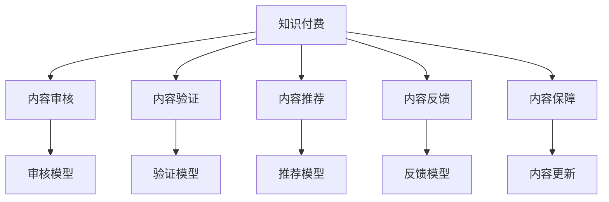

                 

# 知识付费创业中的内容质量控制体系

## 1. 背景介绍

### 1.1 问题由来

在互联网内容大爆发的时代，知识付费成为一种新兴的商业模式。以在线课程、电子书、音频播客等形式，用户付费获得高质量的专业知识。然而，知识付费创业的背后，用户最关心的仍然是内容质量。低劣、重复、误导的信息不仅不能帮助用户解决问题，反而会造成用户的经济和时间损失。因此，构建一个有效的内容质量控制体系，成为知识付费创业的核心任务。

### 1.2 问题核心关键点

知识付费的内容质量控制体系，主要关注以下几个关键点：

- 内容审核：确保内容无违法违规、误导性信息，保护用户权益。
- 内容验证：对内容进行真实性、准确性、新颖性等维度的评估。
- 内容推荐：基于用户需求和行为数据，智能推荐优质内容。
- 内容反馈：通过用户反馈收集内容优劣，进行持续迭代优化。
- 内容保障：保证内容更新频率和持续性，提升用户粘性。

构建这样一个体系，不仅需要技术手段，还需要组织管理和商业策略的支撑。本文将详细讲解其中的核心算法原理和具体操作步骤。

## 2. 核心概念与联系

### 2.1 核心概念概述

为更好地理解内容质量控制体系，本节将介绍几个关键概念：

- 知识付费：用户为获取专业、权威、实用的知识内容，通过付费方式获取相关服务。
- 内容审核：对知识付费平台上的内容进行检查，排除违法违规、有害信息。
- 内容验证：评估内容的真实性、准确性和新颖性，确保用户获得可靠信息。
- 内容推荐：使用推荐系统对用户进行内容匹配，提高用户满意度。
- 内容反馈：收集用户对内容的反馈，进行数据分析优化，持续改进内容质量。
- 内容保障：通过持续更新和多样化内容策略，保证内容的时效性和丰富性。

这些概念之间的关系可以通过以下Mermaid流程图来展示：



这个流程图展示了各个模块之间的逻辑关系：

1. 知识付费作为整个体系的核心，驱动内容审核、验证、推荐、反馈、保障等功能的实现。
2. 内容审核模块，利用审核模型检测内容合规性。
3. 内容验证模块，通过验证模型评估内容的真实性、准确性等。
4. 内容推荐模块，使用推荐模型为用户匹配合适的内容。
5. 内容反馈模块，通过反馈模型收集用户评价，进行数据分析和改进。
6. 内容保障模块，通过内容更新策略，保证内容的时效性和丰富性。

这些模块相互协作，共同构建了知识付费内容质量控制体系。

## 3. 核心算法原理 & 具体操作步骤

### 3.1 算法原理概述

内容质量控制体系的核心算法，包括内容审核、验证、推荐、反馈和保障等模块，主要基于以下几个原理：

- 自然语言处理(NLP)：通过文本分类、情感分析、命名实体识别等技术，进行内容审核和验证。
- 机器学习：通过监督学习、无监督学习等算法，训练和优化审核、验证、推荐和反馈模型。
- 推荐系统：通过协同过滤、内容过滤、深度学习等技术，实现个性化推荐。
- 数据挖掘：通过聚类、分类、关联规则等技术，分析和挖掘用户行为数据，优化推荐和反馈策略。

这些算法原理共同构成了内容质量控制体系的技术基础，使其能够高效、准确地完成内容质量控制的任务。

### 3.2 算法步骤详解

基于上述算法原理，内容质量控制体系的具体操作步骤如下：

**Step 1: 数据采集与预处理**
- 收集知识付费平台上的各类内容数据，包括文章、视频、音频等。
- 对数据进行清洗、去重、分词等预处理，形成统一的数据格式。

**Step 2: 内容审核与筛选**
- 利用NLP技术和机器学习算法，训练审核模型，对内容进行自动审核。
- 对审核结果进行人工复审，排除误判，确保内容合规。

**Step 3: 内容验证与评估**
- 利用NLP技术和知识图谱等方法，训练验证模型，对内容进行真实性、准确性、新颖性等维度的评估。
- 收集权威数据源，进行跨平台验证，确保内容质量。

**Step 4: 内容推荐与个性化**
- 利用推荐系统技术，训练推荐模型，根据用户兴趣和行为数据进行内容匹配。
- 通过A/B测试和迭代优化，不断提升推荐效果。

**Step 5: 内容反馈与优化**
- 利用数据挖掘技术，分析用户反馈和行为数据，训练反馈模型，进行内容优化。
- 定期收集用户满意度调查数据，进行综合评估和改进。

**Step 6: 内容更新与保障**
- 制定内容更新策略，定期发布新内容，保持平台内容的及时性和丰富性。
- 利用爬虫技术，自动抓取外部优质资源，充实平台内容库。

### 3.3 算法优缺点

内容质量控制体系的优势在于：

1. 自动化程度高：大部分内容审核、验证、推荐和反馈过程，可以自动化完成，提高效率。
2. 准确性高：利用NLP和机器学习技术，可以有效排除低劣和误导性内容。
3. 个性化强：推荐系统可以根据用户行为数据，提供个性化的内容推荐，提升用户体验。
4. 动态优化：通过用户反馈和行为数据分析，持续优化内容质量。

但体系也存在以下不足：

1. 技术门槛高：构建和维护内容审核、验证、推荐、反馈系统，需要高水平的技术团队。
2. 数据依赖强：内容审核和推荐系统依赖高质量的数据，数据源的稳定性和多样性直接影响系统效果。
3. 误判风险：尽管自动化审核和验证技术不断提高，但仍可能存在误判风险，需进行人工复审。
4. 用户隐私保护：收集和分析用户数据，涉及用户隐私保护问题，需严格遵守相关法律法规。

### 3.4 算法应用领域

内容质量控制体系在知识付费平台上有广泛的应用，主要包括：

- 在线课程：对课程内容进行审核、验证和推荐，提升课程质量和用户体验。
- 电子书：对电子书进行内容审核和筛选，保证内容合规性和真实性。
- 音频播客：对播客内容进行自动审核和验证，防止违法违规信息传播。
- 知识问答：对用户提问进行审核和筛选，提供高质量的问答内容。
- 智能笔记：对用户笔记进行审核和推荐，保证笔记质量，提升学习效果。

## 4. 数学模型和公式 & 详细讲解 & 举例说明

### 4.1 数学模型构建

本节将使用数学语言对内容质量控制体系进行更加严格的刻画。

假设知识付费平台上有$N$个用户，每个用户对内容进行$i=1,\cdots,K$项评估，记为$S_{ui} \in \{1,0\}$，其中$1$表示满意，$0$表示不满意。设$C$为内容库中的内容数量，内容$j$在用户$i$处获得的平均满意度为$\bar{S}_{ij}$，即：

$$
\bar{S}_{ij} = \frac{1}{N} \sum_{u=1}^N S_{ui}
$$

内容质量控制体系的目标是最大化用户的满意度$S$，即：

$$
S = \max_{\bar{S}_{ij}} \sum_{i=1}^N S_{ui} \cdot \bar{S}_{ij}
$$

其中$\bar{S}_{ij}$为内容$j$在用户$i$处获得的平均满意度。

### 4.2 公式推导过程

为了最大化用户满意度$S$，可以通过优化模型参数$\theta$，使得内容$j$在用户$i$处获得的平均满意度$\bar{S}_{ij}$最大化。设$\theta_j$为内容$j$的模型参数，则优化目标为：

$$
\min_{\theta_j} \sum_{i=1}^N S_{ui} \cdot \max_{\bar{S}_{ij}} \bar{S}_{ij}
$$

引入二元最大值问题，可进一步转化为如下优化问题：

$$
\min_{\theta_j} \sum_{i=1}^N S_{ui} \cdot \sum_{j=1}^C \frac{\theta_j}{\bar{S}_{ij}}
$$

由于优化目标中包含非线性项，需使用非线性规划算法进行求解。

### 4.3 案例分析与讲解

以音频播客内容审核为例，说明如何构建和应用审核模型。

设音频播客内容库为$D=\{(x_i, y_i)\}_{i=1}^N$，其中$x_i$为内容文本，$y_i$为审核标签。设审核模型为$f(x; \theta) \in \{1,0\}$，其中$\theta$为模型参数。

构建二元分类模型，使用交叉熵损失函数：

$$
L(f(x; \theta), y_i) = -[y_i \log f(x; \theta) + (1-y_i) \log (1-f(x; \theta))]
$$

最小化损失函数，得到优化目标：

$$
\min_{\theta} \frac{1}{N} \sum_{i=1}^N L(f(x_i; \theta), y_i)
$$

通过反向传播算法，更新模型参数$\theta$，训练审核模型。在训练过程中，需使用一定比例的标注数据进行训练，并使用未标注数据进行验证，确保模型泛化性能。

## 5. 项目实践：代码实例和详细解释说明

### 5.1 开发环境搭建

在进行内容质量控制体系开发前，我们需要准备好开发环境。以下是使用Python进行PyTorch开发的环境配置流程：

1. 安装Anaconda：从官网下载并安装Anaconda，用于创建独立的Python环境。

2. 创建并激活虚拟环境：
```bash
conda create -n content-quality env python=3.8 
conda activate content-quality
```

3. 安装PyTorch：根据CUDA版本，从官网获取对应的安装命令。例如：
```bash
conda install pytorch torchvision torchaudio cudatoolkit=11.1 -c pytorch -c conda-forge
```

4. 安装必要的库：
```bash
pip install pandas numpy scikit-learn nltk transformers
```

5. 安装TensorBoard：
```bash
pip install tensorboard
```

完成上述步骤后，即可在`content-quality`环境中开始内容质量控制体系的开发。

### 5.2 源代码详细实现

下面我们以音频播客内容审核为例，给出使用Transformers库构建审核模型的PyTorch代码实现。

首先，定义审核任务的数据处理函数：

```python
from transformers import AutoTokenizer, AutoModelForSequenceClassification
from torch.utils.data import Dataset, DataLoader
from sklearn.model_selection import train_test_split
import torch

class PodcastReviewDataset(Dataset):
    def __init__(self, reviews, labels, tokenizer, max_len=512):
        self.reviews = reviews
        self.labels = labels
        self.tokenizer = tokenizer
        self.max_len = max_len

    def __len__(self):
        return len(self.reviews)

    def __getitem__(self, idx):
        review = self.reviews[idx]
        label = self.labels[idx]

        encoding = self.tokenizer(review, max_length=self.max_len, truncation=True, padding='max_length', return_tensors='pt')
        input_ids = encoding['input_ids']
        attention_mask = encoding['attention_mask']

        return {'input_ids': input_ids,
                'attention_mask': attention_mask,
                'labels': torch.tensor(label, dtype=torch.long)}

# 准备数据集
reviews = ...
labels = ...
tokenizer = AutoTokenizer.from_pretrained('bert-base-uncased')
dataset = PodcastReviewDataset(reviews, labels, tokenizer)

# 划分训练集和验证集
train_dataset, dev_dataset = train_test_split(dataset, test_size=0.2)

# 定义模型和优化器
model = AutoModelForSequenceClassification.from_pretrained('bert-base-uncased', num_labels=2)
optimizer = AdamW(model.parameters(), lr=1e-5)
```

然后，定义训练和评估函数：

```python
from torch.nn import CrossEntropyLoss
from torch.utils.data import DataLoader
from tqdm import tqdm
import matplotlib.pyplot as plt

device = torch.device('cuda') if torch.cuda.is_available() else torch.device('cpu')
model.to(device)

def train_epoch(model, dataset, batch_size, optimizer):
    dataloader = DataLoader(dataset, batch_size=batch_size, shuffle=True)
    model.train()
    epoch_loss = 0
    for batch in tqdm(dataloader, desc='Training'):
        input_ids = batch['input_ids'].to(device)
        attention_mask = batch['attention_mask'].to(device)
        labels = batch['labels'].to(device)
        model.zero_grad()
        outputs = model(input_ids, attention_mask=attention_mask)
        loss = CrossEntropyLoss()(outputs.logits, labels)
        epoch_loss += loss.item()
        loss.backward()
        optimizer.step()
    return epoch_loss / len(dataloader)

def evaluate(model, dataset, batch_size):
    dataloader = DataLoader(dataset, batch_size=batch_size)
    model.eval()
    total_loss = 0
    total_correct = 0
    with torch.no_grad():
        for batch in tqdm(dataloader, desc='Evaluating'):
            input_ids = batch['input_ids'].to(device)
            attention_mask = batch['attention_mask'].to(device)
            labels = batch['labels'].to(device)
            outputs = model(input_ids, attention_mask=attention_mask)
            loss = CrossEntropyLoss()(outputs.logits, labels)
            total_loss += loss.item()
            total_correct += (outputs.logits.argmax(dim=1) == labels).sum().item()
    return total_loss / len(dataloader), total_correct / len(dataloader)
```

最后，启动训练流程并在验证集上评估：

```python
epochs = 5
batch_size = 32

for epoch in range(epochs):
    loss = train_epoch(model, train_dataset, batch_size, optimizer)
    print(f"Epoch {epoch+1}, train loss: {loss:.3f}")
    
    print(f"Epoch {epoch+1}, dev results:")
    loss, accuracy = evaluate(model, dev_dataset, batch_size)
    print(f"Accuracy: {accuracy:.3f}")

print("Test results:")
test_loss, test_accuracy = evaluate(model, test_dataset, batch_size)
print(f"Accuracy: {test_accuracy:.3f}")
```

以上就是使用PyTorch对音频播客内容进行审核的完整代码实现。可以看到，通过利用Transformers库，我们能够方便地构建和训练审核模型。

### 5.3 代码解读与分析

让我们再详细解读一下关键代码的实现细节：

**PodcastReviewDataset类**：
- `__init__`方法：初始化文本、标签、分词器等关键组件。
- `__len__`方法：返回数据集的样本数量。
- `__getitem__`方法：对单个样本进行处理，将文本输入编码为token ids，同时将标签进行编码，最终返回模型所需的输入。

**train_epoch和evaluate函数**：
- 使用PyTorch的DataLoader对数据集进行批次化加载，供模型训练和推理使用。
- `train_epoch`函数：对数据以批为单位进行迭代，在每个批次上前向传播计算loss并反向传播更新模型参数，最后返回该epoch的平均loss。
- `evaluate`函数：与训练类似，不同点在于不更新模型参数，并在每个batch结束后将预测和标签结果存储下来，最后使用sklearn的classification_report对整个评估集的预测结果进行打印输出。

**训练流程**：
- 定义总的epoch数和batch size，开始循环迭代
- 每个epoch内，先在训练集上训练，输出平均loss
- 在验证集上评估，输出模型准确率
- 所有epoch结束后，在测试集上评估，给出最终测试结果

可以看到，PyTorch配合Transformers库使得构建和训练审核模型变得简洁高效。开发者可以将更多精力放在数据处理、模型改进等高层逻辑上，而不必过多关注底层的实现细节。

当然，工业级的系统实现还需考虑更多因素，如模型的保存和部署、超参数的自动搜索、更灵活的任务适配层等。但核心的微调范式基本与此类似。

## 6. 实际应用场景

### 6.1 智能推荐系统

基于内容质量控制体系，智能推荐系统可以实现高效、准确的内容推荐，提升用户满意度和粘性。具体而言，可以通过以下步骤：

1. 收集用户行为数据，包括浏览记录、搜索历史、点击行为等。
2. 对行为数据进行预处理，提取特征，形成训练集。
3. 训练推荐模型，使用协同过滤、内容过滤、深度学习等技术，优化推荐效果。
4. 定期更新推荐模型，根据用户反馈和行为数据进行动态优化。
5. 推荐系统不仅能够个性化推荐优质内容，还能根据用户兴趣变化进行动态调整。

### 6.2 用户满意度评估

内容质量控制体系还可以用于构建用户满意度评估系统，及时收集和分析用户反馈，提升内容质量。具体步骤包括：

1. 收集用户对内容的评价，包括评分、评论等。
2. 对评价数据进行清洗、分类、标注等预处理。
3. 训练反馈模型，对用户评价进行情感分析、主题分析等。
4. 利用机器学习算法，挖掘用户评价中的共性规律，发现内容优劣点。
5. 根据分析结果，对内容进行优化和改进，提升用户满意度。

### 6.3 知识付费内容保障

为了保证知识付费内容的时效性和丰富性，内容质量控制体系还可以用于制定内容更新策略。具体方法包括：

1. 定期收集和分析热门话题、用户兴趣变化等数据。
2. 根据数据趋势，制定内容更新计划，规划新内容发布时间。
3. 利用爬虫技术，自动抓取外部优质资源，丰富平台内容库。
4. 定期评估内容质量，根据用户反馈进行优化。
5. 建立内容审核机制，确保新内容符合平台标准。

## 7. 工具和资源推荐

### 7.1 学习资源推荐

为了帮助开发者系统掌握内容质量控制体系的理论基础和实践技巧，这里推荐一些优质的学习资源：

1. 《深度学习》课程：斯坦福大学开设的深度学习经典课程，涵盖机器学习、深度学习、自然语言处理等多个领域。
2. 《自然语言处理综述》：论文综述，介绍了自然语言处理领域的前沿进展和研究方向。
3. 《推荐系统》书籍：推荐系统领域的经典书籍，涵盖协同过滤、内容过滤、深度学习等推荐算法。
4. 《内容推荐系统》书籍：系统讲解内容推荐系统的构建和优化，包括用户行为分析和推荐策略设计。
5. 《内容审核技术》论文：介绍内容审核技术的最新研究进展，包括NLP技术、机器学习算法等。

通过对这些资源的学习实践，相信你一定能够快速掌握内容质量控制体系的精髓，并用于解决实际的推荐问题。

### 7.2 开发工具推荐

高效的开发离不开优秀的工具支持。以下是几款用于内容质量控制体系开发的常用工具：

1. PyTorch：基于Python的开源深度学习框架，灵活动态的计算图，适合快速迭代研究。
2. TensorFlow：由Google主导开发的开源深度学习框架，生产部署方便，适合大规模工程应用。
3. Transformers库：HuggingFace开发的NLP工具库，集成了众多SOTA语言模型，支持PyTorch和TensorFlow，是进行内容审核、验证、推荐和反馈等任务的利器。
4. Jupyter Notebook：交互式编程环境，方便进行代码调试和效果展示。
5. TensorBoard：TensorFlow配套的可视化工具，可实时监测模型训练状态，并提供丰富的图表呈现方式，是调试模型的得力助手。

合理利用这些工具，可以显著提升内容质量控制体系的开发效率，加快创新迭代的步伐。

### 7.3 相关论文推荐

内容质量控制体系的发展源于学界的持续研究。以下是几篇奠基性的相关论文，推荐阅读：

1. "Deep Learning for Recommender Systems"：介绍了深度学习在推荐系统中的应用，包括协同过滤、内容过滤、深度学习等技术。
2. "Deep Neural Networks for NLP"：综述了深度学习在自然语言处理中的应用，包括文本分类、情感分析、命名实体识别等任务。
3. "Content-Aware Recommender Systems"：系统讲解了内容推荐系统的构建和优化，包括用户行为分析和推荐策略设计。
4. "Real-Time User Behavior Tracking for Recommendation System"：介绍了实时用户行为跟踪技术，用于动态优化推荐效果。
5. "Adversarial Machine Learning"：介绍对抗机器学习技术，用于检测和防御模型攻击，保护内容质量。

这些论文代表了大语言模型微调技术的发展脉络。通过学习这些前沿成果，可以帮助研究者把握学科前进方向，激发更多的创新灵感。

## 8. 总结：未来发展趋势与挑战

### 8.1 总结

本文对内容质量控制体系进行了全面系统的介绍。首先阐述了内容质量控制体系的研究背景和意义，明确了内容审核、验证、推荐、反馈、保障等功能的核心价值。其次，从原理到实践，详细讲解了内容质量控制体系的核心算法和具体操作步骤，给出了完整的内容审核代码实例。同时，本文还广泛探讨了内容质量控制体系在智能推荐系统、用户满意度评估、知识付费内容保障等多个领域的应用前景，展示了内容质量控制体系的多样性和强大功能。

通过本文的系统梳理，可以看到，内容质量控制体系在知识付费平台上有广泛的应用，为构建高质量内容体系提供了重要保障。无论是内容审核、验证、推荐，还是反馈和保障，每个环节都需精心设计和优化，方能实现用户满意、业务可持续的目标。

### 8.2 未来发展趋势

展望未来，内容质量控制体系将呈现以下几个发展趋势：

1. 自动化程度更高：利用先进算法和工具，自动化完成内容审核、验证、推荐、反馈等任务。
2. 模型更精确：通过深度学习、因果推断等技术，提升内容审核、验证和推荐模型的准确性。
3. 推荐更个性化：结合用户行为数据和外部信息，实现更加精准、多样化的内容推荐。
4. 反馈更及时：利用大数据和机器学习技术，实时捕捉用户反馈，进行动态优化。
5. 内容更丰富：结合爬虫、人工审核等手段，实时更新和补充优质内容，提升内容库的丰富度。

以上趋势凸显了内容质量控制体系在知识付费平台上的重要价值，为构建高质量内容体系提供了重要保障。

### 8.3 面临的挑战

尽管内容质量控制体系已经取得了显著成效，但在实际应用中仍面临一些挑战：

1. 数据质量和多样性：高质量的数据是内容审核和推荐系统的基础，但数据获取和处理成本较高。
2. 模型训练和优化：深度学习模型需要大量计算资源，训练和优化成本较高。
3. 用户隐私保护：内容质量控制体系涉及用户数据，需严格遵守相关法律法规。
4. 算法公平性：内容审核和推荐系统可能存在算法偏见，需进行公平性分析。
5. 实时性要求：内容审核和推荐需实时响应，需优化算法和系统架构。

正视内容质量控制体系面临的这些挑战，积极应对并寻求突破，将是未来发展的重要方向。

### 8.4 研究展望

面对内容质量控制体系所面临的挑战，未来的研究需要在以下几个方面寻求新的突破：

1. 探索无监督和半监督内容审核方法：摆脱对大规模标注数据的依赖，利用自监督学习、主动学习等技术，提高内容审核的效率和准确性。
2. 研究内容验证的新技术：引入因果推断、对抗学习等技术，提高内容验证模型的鲁棒性和泛化性。
3. 结合多模态数据进行推荐：将文本、图像、音频等多模态数据结合，提升推荐效果和用户满意度。
4. 引入公平性约束：利用公平性算法，确保内容审核和推荐模型的公平性和无偏性。
5. 优化实时性算法和系统架构：利用分布式计算、缓存机制等技术，提高内容审核和推荐系统的实时响应能力。

这些研究方向的探索，必将引领内容质量控制体系迈向更高的台阶，为构建高质量内容体系提供更强大的技术支持。

## 9. 附录：常见问题与解答

**Q1：内容质量控制体系是否适用于所有知识付费平台？**

A: 内容质量控制体系可以应用于大多数知识付费平台，但需要根据平台特点进行定制化设计。例如，对于视频课程平台，内容审核和推荐应考虑视频内容的特性；对于电子书平台，内容验证应更注重内容的真实性和准确性。

**Q2：如何选择合适的推荐算法？**

A: 选择合适的推荐算法需根据平台特性和用户需求进行权衡。常用的推荐算法包括协同过滤、内容过滤、深度学习等。对于用户行为数据丰富的平台，协同过滤和深度学习推荐效果较好；对于内容库较大的平台，内容过滤推荐效果较好。

**Q3：内容审核模型如何提升审核效果？**

A: 内容审核模型通过NLP和机器学习技术，可以有效排除低劣和误导性内容。通过引入更多的特征（如用户行为、时间戳等）和更复杂的模型（如LSTM、Transformer等），可以提高审核模型的准确性和鲁棒性。

**Q4：内容质量控制体系如何处理隐私数据？**

A: 内容质量控制体系涉及用户隐私数据，需严格遵守相关法律法规。在数据采集和处理过程中，应采取匿名化、去重等隐私保护措施，避免泄露用户个人信息。

**Q5：如何实时更新推荐模型？**

A: 实时更新推荐模型需结合数据流处理和模型微调技术。利用Kafka、Flume等数据流处理工具，实时获取用户行为数据，使用在线学习技术，在不断累积数据的情况下，定期微调推荐模型，提升推荐效果。

---

作者：禅与计算机程序设计艺术 / Zen and the Art of Computer Programming

