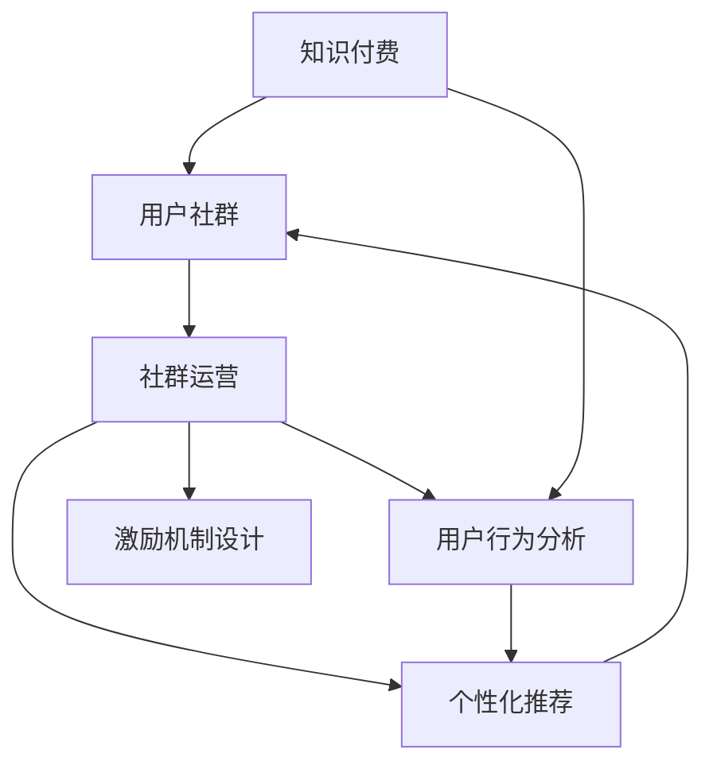

                 

# 知识付费创业中的用户社群运营

## 1. 背景介绍

随着互联网技术的迅猛发展，知识付费已成为一个新兴且充满活力的行业。它不仅仅改变了知识的传播方式，更是重塑了人们对知识价值的认知。面对日益增长的知识需求，如何构建高效、有粘性的用户社群，最大化知识付费平台的用户价值，成为每一个知识创业者必须面对的重要课题。

### 1.1 问题由来

在知识付费领域，用户社群的建设质量直接决定了平台的活跃度和盈利能力。社群成员的互动频率、内容贡献度、付费行为等都是衡量社群运营效果的关键指标。然而，传统的社区运营模式往往侧重于内容发布和用户管理，对于如何将用户紧密结合到知识付费平台，如何高效地激励用户贡献内容、提升互动参与度等关键问题，尚缺少系统化、科学的运营策略。

### 1.2 问题核心关键点

本文将聚焦于如何利用社群运营手段，构建一个健康、有序、高互动的用户社群，帮助知识付费创业公司实现用户增长、提高用户粘性和留存率，最终提升平台的整体收益。在具体实现过程中，我们将通过用户行为数据分析、个性化推荐、激励机制设计等手段，系统化地探讨社群运营的科学方法。

## 2. 核心概念与联系

### 2.1 核心概念概述

- **知识付费（Knowledge-Based Subscription Model）**：用户通过支付一定费用，获取高质量、系统化的知识内容，如在线课程、视频讲座、电子书等。
- **用户社群（User Community）**：由一群具有共同兴趣或需求的个体组成的虚拟或物理社区，用户可以在其中交流学习、分享经验。
- **社群运营（Community Operation）**：通过合理规划和管理，使社群达到活跃、有序、高效运营状态的一系列活动。
- **用户行为分析（User Behavior Analysis）**：通过对用户行为数据的收集和分析，揭示用户需求、兴趣和行为特征，以指导产品和服务优化。
- **个性化推荐（Personalized Recommendation）**：根据用户的历史行为和偏好，推荐相关的内容，提升用户满意度和活跃度。
- **激励机制设计（Incentive Mechanism Design）**：通过设计有效的激励机制，促进用户积极参与社群活动，贡献内容。

以上概念之间的逻辑关系可以通过以下Mermaid流程图来展示：



这个流程图展示了知识付费、用户社群、社群运营、用户行为分析、个性化推荐、激励机制设计等概念之间的内在联系和运营逻辑。

## 3. 核心算法原理 & 具体操作步骤

### 3.1 算法原理概述

基于社群运营的知识付费平台，其核心算法原理可以总结为以下几个方面：

1. **用户行为分析算法**：通过对用户行为数据的建模和分析，识别用户特征、兴趣和行为规律，为个性化推荐和社群运营提供依据。
2. **个性化推荐算法**：根据用户行为和偏好，推荐相关内容，提升用户体验和参与度。
3. **激励机制设计算法**：通过设计合理的激励机制，激发用户参与社群活动，促进内容共享和互动。
4. **社群运营算法**：包括社群结构优化、内容质量监控、用户行为引导等，保障社群的健康发展和秩序维护。

### 3.2 算法步骤详解

1. **用户行为数据收集**：
   - 使用日志记录系统，收集用户浏览、互动、购买等行为数据。
   - 分析用户基本信息、兴趣偏好等特征。

2. **用户行为数据分析**：
   - 利用机器学习算法，如聚类、分类、回归等，对用户行为数据进行建模和分析。
   - 使用自然语言处理技术，分析用户评论、反馈内容，提取关键情感、主题等信息。

3. **个性化推荐**：
   - 使用协同过滤、内容推荐、混合推荐等算法，推荐用户可能感兴趣的内容。
   - 根据用户反馈，不断优化推荐算法，提升推荐效果。

4. **激励机制设计**：
   - 设计积分系统、排行榜、荣誉墙等激励机制，鼓励用户参与社群活动。
   - 利用游戏化设计，如成就解锁、奖励积分等，提升用户粘性和活跃度。

5. **社群运营**：
   - 定期清理低质量内容，维护社群秩序。
   - 建立社区规范，引导用户积极参与讨论和分享。

### 3.3 算法优缺点

基于社群运营的知识付费平台算法，具有以下优点：

1. **高效个性化**：通过分析用户行为和偏好，提供精准的内容推荐，提高用户满意度和参与度。
2. **激励机制多样**：设计灵活多样的激励机制，激发用户参与，提升社群活跃度。
3. **持续优化**：根据用户反馈和行为数据，不断优化推荐和激励策略，实现良性循环。

同时，这些算法也存在以下缺点：

1. **数据隐私风险**：用户行为数据的收集和分析可能涉及隐私问题，需要合理保护用户数据。
2. **推荐冷启动问题**：新用户或新内容的推荐准确率较低，需要更有效的数据预处理和算法设计。
3. **激励效果有限**：过度依赖激励机制可能导致部分用户“功利化”，忽视社群的真实价值。

## 4. 数学模型和公式 & 详细讲解 & 举例说明

### 4.1 数学模型构建

在知识付费平台的用户社群运营中，核心数学模型主要包括以下几个方面：

1. **用户行为建模**：利用时序数据建模，预测用户行为变化趋势。
2. **协同过滤推荐**：通过用户-物品矩阵，计算用户兴趣相似度，推荐相关内容。
3. **内容质量评估**：使用分类、回归等模型，评估内容质量和用户满意度。

### 4.2 公式推导过程

以下是对协同过滤推荐模型的公式推导过程：

设用户集合为 $U$，物品集合为 $V$，用户-物品评分矩阵为 $R \in \mathbb{R}^{m \times n}$，其中 $m$ 为用户数，$n$ 为物品数。设用户 $u$ 对物品 $v$ 的评分 $r_{uv} \in [1,5]$，评分矩阵 $R$ 的部分样本如下：

$$
R = \begin{bmatrix}
3 & 5 & 4 \\
1 & 3 & 4 \\
4 & 5 & 2
\end{bmatrix}
$$

协同过滤推荐算法主要分为基于用户的协同过滤和基于物品的协同过滤。这里以基于用户的协同过滤为例：

1. **用户相似度计算**：计算用户 $u$ 和 $v$ 的相似度 $sim(u,v)$，常用的相似度计算方法包括余弦相似度、皮尔逊相关系数等。以余弦相似度为例：

$$
sim(u,v) = \frac{\mathbf{r}_u \cdot \mathbf{r}_v}{\|\mathbf{r}_u\|_2 \cdot \|\mathbf{r}_v\|_2}
$$

其中 $\mathbf{r}_u$ 和 $\mathbf{r}_v$ 分别为用户 $u$ 和 $v$ 的评分向量。

2. **物品推荐**：根据用户 $u$ 的相似用户 $V_u$，计算物品 $v$ 的预测评分 $p_{uv}$，推荐评分最高的物品 $v$：

$$
p_{uv} = \frac{\sum_{v' \in V_u}r_{uv'}sim(u,v')}{\sum_{v' \in V_u}sim(u,v')}
$$

根据预测评分，对物品进行排序，推荐评分最高的 $k$ 个物品。

### 4.3 案例分析与讲解

假设某知识付费平台希望提升用户 $u_1$ 对某个课程 $v_1$ 的参与度。通过协同过滤推荐算法，平台首先计算用户 $u_1$ 的相似用户集合 $V_{u_1}$，然后计算课程 $v_1$ 在 $V_{u_1}$ 中的平均评分，最后根据预测评分推荐课程 $v_1$ 给用户 $u_1$。

通过类似的公式推导，平台可以优化推荐算法，提升推荐效果，实现更加精准的个性化推荐。

## 5. 项目实践：代码实例和详细解释说明

### 5.1 开发环境搭建

在进行用户社群运营实践前，我们需要准备好开发环境。以下是使用Python进行PyTorch开发的环境配置流程：

1. 安装Anaconda：从官网下载并安装Anaconda，用于创建独立的Python环境。

2. 创建并激活虚拟环境：
```bash
conda create -n pytorch-env python=3.8 
conda activate pytorch-env
```

3. 安装PyTorch：根据CUDA版本，从官网获取对应的安装命令。例如：
```bash
conda install pytorch torchvision torchaudio cudatoolkit=11.1 -c pytorch -c conda-forge
```

4. 安装各类工具包：
```bash
pip install numpy pandas scikit-learn matplotlib tqdm jupyter notebook ipython
```

完成上述步骤后，即可在`pytorch-env`环境中开始项目实践。

### 5.2 源代码详细实现

下面以一个简化的协同过滤推荐系统为例，给出使用PyTorch实现的代码：

```python
import torch
import torch.nn as nn
import torch.nn.functional as F

class协同过滤(nn.Module):
    def __init__(self, num_users, num_items, embed_size):
        super(协同过滤, self).__init__()
        self.user_embedding = nn.Embedding(num_users, embed_size)
        self.item_embedding = nn.Embedding(num_items, embed_size)
        self.similarity_matrix = nn.Parameter(torch.randn(num_users, num_items))
        self.params = nn.Parameter(torch.randn(embed_size, embed_size))
        
    def forward(self, user_ids, item_ids):
        user_emb = self.user_embedding(user_ids)
        item_emb = self.item_embedding(item_ids)
        user_item_dot = (user_emb * item_emb).sum(dim=1)
        similarity = F.cosine_similarity(user_item_dot, self.similarity_matrix, dim=0)
        rating_pred = user_emb @ self.params + item_emb @ self.params.t()
        return similarity, rating_pred

    def predict(self, user_ids, item_ids):
        similarity, rating_pred = self.forward(user_ids, item_ids)
        return similarity, rating_pred
```

### 5.3 代码解读与分析

让我们再详细解读一下关键代码的实现细节：

**协同过滤类**：
- `__init__`方法：初始化用户、物品嵌入层，相似度矩阵和参数。
- `forward`方法：计算用户和物品的相似度矩阵和预测评分。
- `predict`方法：根据用户和物品的ID，计算相似度矩阵和预测评分。

**用户行为数据分析**：
- 可以使用Pandas、Numpy等工具进行用户行为数据的统计和分析，提取关键特征。
- 利用机器学习算法进行分类、回归、聚类等建模分析，提取用户兴趣和行为规律。

**个性化推荐**：
- 使用协同过滤、基于内容的推荐、混合推荐等算法，设计推荐系统，提升用户满意度。
- 根据用户反馈和行为数据，不断优化推荐算法，提升推荐效果。

**激励机制设计**：
- 设计积分系统、排行榜、荣誉墙等激励机制，鼓励用户参与社群活动。
- 利用游戏化设计，如成就解锁、奖励积分等，提升用户粘性和活跃度。

**社群运营**：
- 定期清理低质量内容，维护社群秩序。
- 建立社区规范，引导用户积极参与讨论和分享。

## 6. 实际应用场景

### 6.1 在线教育平台

在线教育平台通过用户社群运营，可以显著提升用户参与度和学习效果。传统教育模式往往以单向灌输为主，而知识付费平台则可以通过用户社群，激发学生的互动和讨论，提升学习兴趣和效果。

在技术实现上，平台可以收集学生的学习行为数据，如课程观看时长、测试成绩、讨论互动等，进行个性化推荐和行为分析。通过设计积分系统、荣誉墙等激励机制，鼓励学生积极参与社群活动，如答疑、讨论、分享学习心得等，形成良性互动循环。

### 6.2 职业培训平台

职业培训平台通过用户社群运营，可以提升学员的学习动力和职业发展。通过构建一个专业领域的社群，学员可以相互交流经验、分享资源，共同解决职业发展中的问题。

在技术实现上，平台可以收集学员的职业兴趣、学习进度、项目案例等数据，进行个性化推荐和行为分析。通过设计证书、认证等激励机制，激励学员积极参与社群活动，如分享项目案例、参与讨论、获取认证等，提升学员的学习动力和职业能力。

### 6.3 在线图书平台

在线图书平台通过用户社群运营，可以提升读者的阅读体验和满意度。通过构建一个阅读爱好者的社群，读者可以相互交流阅读体验、分享书评，提升阅读质量。

在技术实现上，平台可以收集读者的阅读行为数据，如阅读时长、阅读偏好、书评内容等，进行个性化推荐和行为分析。通过设计书评评选、排行榜、荣誉墙等激励机制，鼓励读者积极参与社群活动，如撰写书评、参加读书会、参与讨论等，提升读者的阅读体验和满意度。

### 6.4 未来应用展望

随着技术的发展和市场的成熟，用户社群运营将成为知识付费平台不可或缺的一部分。未来，用户社群运营将更加智能化、个性化，通过大数据、人工智能等手段，实现更加精准的用户画像构建、内容推荐和激励机制设计，形成更高效、有序、高互动的社群生态。

## 7. 工具和资源推荐

### 7.1 学习资源推荐

为了帮助开发者系统掌握用户社群运营的理论基础和实践技巧，这里推荐一些优质的学习资源：

1. 《User Behavior Analysis for Mobile App Design》系列博文：由大用户行为分析专家撰写，深入浅出地介绍了用户行为分析的基本概念和应用方法。

2. 《Recommender Systems》课程：斯坦福大学开设的推荐系统课程，涵盖了协同过滤、内容推荐、混合推荐等推荐算法，适合初学者和进阶者。

3. 《Personalized Recommendation Systems》书籍：推荐系统领域的经典著作，全面介绍了个性化推荐的技术框架和实际应用，是理解个性化推荐算法的绝佳选择。

4. Coursera上的《Data Science》课程：提供从数据采集、处理、分析到应用的全套课程，适合全面了解数据驱动的社群运营。

5. 《社区运营指南》书籍：详细介绍了社区管理的最佳实践，帮助平台建设一个有序、高效的社区环境。

通过对这些资源的学习实践，相信你一定能够快速掌握用户社群运营的理论基础和实践技巧，为知识付费平台的成功运营奠定坚实的基础。

### 7.2 开发工具推荐

高效的开发离不开优秀的工具支持。以下是几款用于用户社群运营开发的常用工具：

1. PyTorch：基于Python的开源深度学习框架，灵活动态的计算图，适合快速迭代研究。

2. TensorFlow：由Google主导开发的开源深度学习框架，生产部署方便，适合大规模工程应用。

3. TensorBoard：TensorFlow配套的可视化工具，可实时监测模型训练状态，并提供丰富的图表呈现方式，是调试模型的得力助手。

4. Weights & Biases：模型训练的实验跟踪工具，可以记录和可视化模型训练过程中的各项指标，方便对比和调优。

5. Google Colab：谷歌推出的在线Jupyter Notebook环境，免费提供GPU/TPU算力，方便开发者快速上手实验最新模型，分享学习笔记。

合理利用这些工具，可以显著提升用户社群运营任务的开发效率，加快创新迭代的步伐。

### 7.3 相关论文推荐

用户社群运营的研究源于学界的持续研究。以下是几篇奠基性的相关论文，推荐阅读：

1. "A Study on User Behavior in Online Learning Platforms"：研究在线学习平台用户行为特征和规律，提出社群运营策略。

2. "Personalized Recommendation via Matrix Factorization"：提出矩阵分解方法，进行协同过滤推荐算法建模，是推荐系统领域的经典之作。

3. "Incentive Mechanism Design in Online Communities"：研究在线社区激励机制的设计，提出多种激励模型和实现方案。

4. "Community Governance and Regulation: A Social Media Case Study"：研究社区治理的规范和策略，为平台建立有序社区环境提供借鉴。

这些论文代表了大用户社群运营的研究方向和最新进展。通过学习这些前沿成果，可以帮助研究者把握学科前进方向，激发更多的创新灵感。

## 8. 总结：未来发展趋势与挑战

### 8.1 总结

本文对知识付费平台中的用户社群运营进行了全面系统的介绍。首先阐述了用户社群运营在知识付费平台中的重要性，明确了如何通过用户行为分析、个性化推荐、激励机制设计等手段，提升社群的活跃度和用户满意度。

通过本文的系统梳理，可以看到，用户社群运营已经成为知识付费平台的重要组成部分，对于提升用户粘性、留存率和平台收益具有关键作用。未来，随着数据科学和人工智能技术的不断发展，用户社群运营将朝着更加智能化、个性化、高效化的方向演进，成为知识付费创业公司不可或缺的战略工具。

### 8.2 未来发展趋势

展望未来，用户社群运营技术将呈现以下几个发展趋势：

1. **数据驱动**：通过大数据分析，实现对用户行为和兴趣的全面洞察，精准定位用户需求，提升运营效率。

2. **个性化推荐**：利用机器学习算法，实现更加个性化、精准的内容推荐，提升用户满意度和参与度。

3. **智能化管理**：引入人工智能技术，实现社群运营的自动化、智能化，降低人力成本，提升运营效果。

4. **社区自治**：通过社区治理工具和规则，实现社群自治，提升用户自治能力，构建更加和谐的社区环境。

5. **跨平台协作**：实现跨平台的用户画像和内容协作，提升用户数据共享和互动体验。

这些趋势凸显了用户社群运营技术的发展方向，将为知识付费平台带来更加高效、智能的用户运营模式。

### 8.3 面临的挑战

尽管用户社群运营技术已经取得了显著进展，但在迈向更加智能化、普适化应用的过程中，它仍面临着诸多挑战：

1. **数据隐私问题**：用户数据的收集、存储和分析可能涉及隐私问题，需要合理保护用户数据。

2. **推荐冷启动问题**：新用户或新内容的推荐准确率较低，需要更有效的数据预处理和算法设计。

3. **激励机制设计**：过度依赖激励机制可能导致部分用户“功利化”，忽视社群的真实价值。

4. **用户留存率**：用户社群的活跃度和留存率受多种因素影响，需要综合考虑用户需求和运营策略。

5. **社区治理**：社区治理和规范的制定、执行可能面临诸多挑战，需要持续优化社区规则和运营策略。

正视这些挑战，积极应对并寻求突破，将是大用户社群运营技术迈向成熟的必由之路。相信随着学界和产业界的共同努力，这些挑战终将一一被克服，用户社群运营必将在构建人机协同的智能时代中扮演越来越重要的角色。

### 8.4 研究展望

面对用户社群运营面临的种种挑战，未来的研究需要在以下几个方面寻求新的突破：

1. **数据隐私保护技术**：研究如何在保证数据隐私的前提下，最大化利用用户数据进行行为分析和推荐。

2. **跨模态推荐算法**：研究如何将用户的多模态数据（如文本、图片、视频）融合到推荐系统中，提升推荐效果。

3. **动态激励机制**：研究如何设计动态、自适应的激励机制，提高用户参与度和留存率。

4. **社区智能治理**：研究如何利用人工智能技术，实现社区的智能治理和管理，提升社群自治能力。

这些研究方向将进一步推动用户社群运营技术的进步，为知识付费平台提供更加科学、高效的运营方案。只有勇于创新、敢于突破，才能不断拓展用户社群运营的边界，让知识付费创业公司实现更大的商业价值。

## 9. 附录：常见问题与解答

**Q1：如何设计一个高效的推荐系统？**

A: 一个高效的推荐系统应考虑以下几个关键因素：
1. 数据收集：收集用户行为数据，如浏览、购买、评价等。
2. 数据清洗：对数据进行清洗和预处理，去除噪音和异常值。
3. 特征工程：提取和构建用户行为特征，如用户画像、兴趣偏好等。
4. 推荐算法：选择合适的推荐算法，如协同过滤、内容推荐、混合推荐等。
5. 模型评估：使用准确率、召回率、AUC等指标评估推荐效果。
6. 持续优化：根据用户反馈和行为数据，不断优化推荐算法，提升推荐效果。

**Q2：如何在社群运营中提高用户粘性？**

A: 提高用户粘性需要从多个方面入手：
1. 提供高质量的内容：确保推荐内容能够满足用户需求，提高用户满意度。
2. 设计激励机制：通过积分系统、排行榜、荣誉墙等激励机制，鼓励用户积极参与社群活动。
3. 增强互动体验：通过讨论、分享、问答等互动方式，提升用户参与度和体验。
4. 社区管理：建立社区规范，引导用户文明互动，构建良好的社群氛围。
5. 个性化推荐：根据用户行为数据，进行个性化推荐，提升用户粘性。

**Q3：如何保护用户数据隐私？**

A: 保护用户数据隐私需要采取以下措施：
1. 数据匿名化：对用户数据进行匿名化处理，去除敏感信息。
2. 数据加密：对用户数据进行加密存储和传输，防止数据泄露。
3. 访问控制：设置严格的访问权限，确保只有授权人员可以访问用户数据。
4. 安全审计：定期进行安全审计，发现和修复潜在的安全漏洞。

这些措施可以有效保护用户数据隐私，确保用户在知识付费平台上的数据安全和隐私权。

**Q4：如何应对推荐冷启动问题？**

A: 应对推荐冷启动问题需要从以下几个方面入手：
1. 预训练模型：利用预训练模型进行推荐，提高新用户和新内容的推荐准确率。
2. 基础数据：收集和整理基础数据，如用户基本属性、行为偏好等，作为推荐基础。
3. 用户画像：构建用户画像，利用多维特征提升推荐效果。
4. 模型优化：不断优化推荐算法，提升推荐效果。
5. 数据补充：通过用户互动、反馈等方式，补充数据，提升推荐精度。

通过这些措施，可以有效解决推荐冷启动问题，提升推荐系统的效果和用户满意度。

**Q5：如何应对社群运营中的激励机制设计问题？**

A: 设计激励机制需要考虑以下几个关键因素：
1. 多样性：设计多样化的激励机制，满足不同用户需求。
2. 公平性：确保激励机制公平公正，不产生激励偏差。
3. 可操作性：设计可操作的激励机制，易于执行和管理。
4. 持续性：设计持续有效的激励机制，避免激励效果消退。
5. 反馈机制：建立激励反馈机制，及时调整和优化激励策略。

合理设计激励机制，可以有效提升用户参与度和社群活跃度，实现社群运营的良性循环。

---

作者：禅与计算机程序设计艺术 / Zen and the Art of Computer Programming

