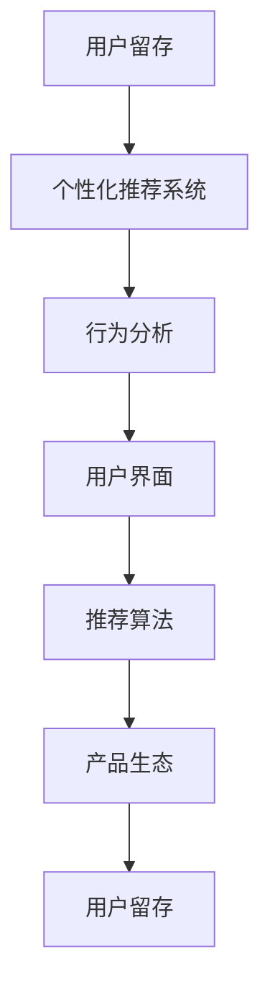

                 

# 知识付费创业中的用户粘性提升策略

> 关键词：知识付费,用户粘性,用户留存,推荐系统,个性化,行为分析,系统优化

## 1. 背景介绍

在当今知识爆炸的时代，知识付费市场正快速崛起。一方面，互联网普及和技术进步使得知识传播和获取更加便捷；另一方面，人们对于高质量、系统化、结构化知识的渴求日益增加。知识付费平台成为连接内容生产者和消费者的重要媒介，满足了人们对于知识高效、有偿获取的需求。然而，随着市场的竞争日趋激烈，如何提升用户粘性、增加用户留存率，成为知识付费平台面临的核心挑战。

### 1.1 知识付费市场概况
随着在线教育、数字内容的兴起，知识付费市场迅速增长。据相关数据显示，预计2025年全球知识付费市场规模将达到1000亿美元。用户需求日益多样化，不再满足于传统的图文内容，而是更加青睐视频课程、音频讲座、电子书等形式。同时，各大知识付费平台争相布局，如得到、喜马拉雅、猿辅导等，在内容和推荐算法上不断创新。竞争态势推动了平台对用户粘性提升策略的探索，以增强用户留存、增加付费订阅。

### 1.2 用户粘性定义及重要性
用户粘性（User Stickiness）指用户对产品或服务的持续使用和忠诚度。对于知识付费平台而言，高粘性用户不仅带来稳定收入，还增强了平台的品牌影响力和市场竞争力。因此，用户粘性提升成为知识付费创业的基石。

## 2. 核心概念与联系

### 2.1 核心概念概述

提升用户粘性涉及多个关键概念：

- **用户留存（User Retention）**：指用户在平台上的使用频率和时间。高留存率意味着用户对平台的持续依赖。
- **个性化推荐系统（Personalized Recommendation System）**：根据用户行为和偏好，推荐可能感兴趣的内容，提升用户体验和满意度。
- **行为分析（Behavioral Analysis）**：通过数据分析，洞察用户行为模式，指导产品优化和策略制定。
- **用户界面（User Interface）**：良好的UI/UX设计，提升用户操作流畅度和满意度，促进粘性提升。
- **推荐算法（Recommendation Algorithm）**：通过设计合理的推荐算法，准确预测用户偏好，提高推荐精准度。
- **产品生态（Product Ecosystem）**：构建丰富多样的内容生态，吸引不同用户群体，提升平台价值。

这些概念相互关联，共同作用于用户粘性的提升。

### 2.2 核心概念原理和架构的 Mermaid 流程图



以上流程图示意了提升用户粘性的系统架构：用户留存在个性化的推荐系统、行为分析、良好的UI/UX、推荐算法和丰富产品生态的协同作用下不断增强。

## 3. 核心算法原理 & 具体操作步骤

### 3.1 算法原理概述

提升用户粘性的核心算法可以归纳为两大类：个性化推荐算法和行为分析算法。

**个性化推荐算法**：基于用户的历史行为数据，如观看时间、浏览历史、点赞评论等，预测用户对新内容的兴趣，从而提升用户对平台的粘性。

**行为分析算法**：通过对用户行为数据的建模和分析，如点击率、停留时长、路径跳转等，评估用户对平台的兴趣度，指导内容的优化和策略的制定。

### 3.2 算法步骤详解

**个性化推荐算法**：

1. **数据收集**：收集用户的行为数据，如观看课程、浏览课程详情、点赞、评论等行为记录。
2. **用户画像构建**：基于行为数据，构建用户画像，识别出用户偏好和行为模式。
3. **相似度计算**：计算新内容和用户画像之间的相似度，如使用余弦相似度、皮尔逊相关系数等。
4. **推荐排序**：根据相似度排序，选取用户最感兴趣的内容进行推荐。

**行为分析算法**：

1. **数据收集**：收集用户的行为数据，如点击、观看时长、路径跳转等。
2. **行为建模**：通过建模分析，识别出用户行为的关键特征和模式，如用户活跃度、点击率、停留时长等。
3. **用户兴趣度评估**：通过行为特征，评估用户对平台的兴趣度，如使用聚类、分类等算法。
4. **策略优化**：根据兴趣度评估结果，优化内容推荐、界面设计等策略，提升用户粘性。

### 3.3 算法优缺点

**个性化推荐算法**：

**优点**：
- 提升用户粘性，增加平台活跃度。
- 根据用户兴趣推荐内容，提升用户体验。

**缺点**：
- 推荐系统复杂度高，需要大量数据和计算资源。
- 推荐精度受限于数据质量和算法设计。

**行为分析算法**：

**优点**：
- 评估用户兴趣度，指导策略制定。
- 分析用户行为，提升产品设计。

**缺点**：
- 数据隐私问题，需要合理处理用户数据。
- 分析模型复杂，需要高水平的工程实现。

### 3.4 算法应用领域

个性化推荐算法和行为分析算法在多个领域有广泛应用：

- **内容推荐**：视频、音频、电子书等内容的推荐。
- **广告投放**：基于用户行为特征，优化广告投放策略。
- **商品推荐**：电商平台的商品推荐系统。
- **个性化新闻**：新闻平台的个性化内容推送。
- **社交网络**：社交平台的内容推荐和好友匹配。

## 4. 数学模型和公式 & 详细讲解 & 举例说明

### 4.1 数学模型构建

**个性化推荐模型**：

1. **用户-物品评分矩阵**：构建用户对物品的评分矩阵，如$R_{ij}$表示用户$i$对物品$j$的评分。
2. **协同过滤**：基于用户-物品评分矩阵，计算用户$i$对物品$j$的推荐评分。
3. **矩阵分解**：通过矩阵分解算法（如SVD），将评分矩阵分解为用户和物品的特征表示。

**行为分析模型**：

1. **用户行为序列**：将用户的行为序列表示为$X_i=\{x_i^1, x_i^2, ..., x_i^n\}$，其中$x_i^j$表示用户$i$在第$j$个时刻的行为。
2. **行为特征提取**：通过特征工程，提取用户行为的关键特征，如点击率、观看时长、路径跳转等。
3. **行为建模**：通过时间序列模型、聚类算法等方法，建模用户行为特征，预测用户兴趣。

### 4.2 公式推导过程

**协同过滤推荐公式**：

设用户$i$对物品$j$的评分$R_{ij}$，物品$j$的均值$\overline{R_j}$，用户$i$的均值$\overline{R_i}$，用户$i$对物品$j$的预测评分$R_{ij}^{\prime}$，则有：

$$
R_{ij}^{\prime} = \frac{R_{ij}}{\sqrt{\overline{R_i} + \epsilon} \sqrt{\overline{R_j} + \epsilon}}
$$

其中$\epsilon$为正则化项，防止分母为零。

**行为分析中的时间序列模型**：

设用户$i$在$t$时刻的行为为$x_i^t$，用户行为序列为$X_i=\{x_i^1, x_i^2, ..., x_i^n\}$，则可以使用ARIMA模型进行建模，预测用户$i$的下一步行为$x_i^{t+1}$。ARIMA模型的公式如下：

$$
x_i^{t+1} = \phi(x_i^t - \mu_i) + \theta \epsilon_i + \sigma\epsilon_i^{\prime}
$$

其中$\phi$为自回归系数，$\theta$为差分系数，$\sigma$为误差项，$\mu_i$为均值。

### 4.3 案例分析与讲解

**视频课程推荐**：
- 数据收集：收集用户观看视频课程的行为记录，如观看时长、点赞、评论等。
- 用户画像：构建用户画像，识别出用户对不同课程的偏好。
- 协同过滤：计算用户与课程的相似度，推荐与用户偏好最相似的课程。
- 行为分析：通过分析用户观看视频的行为序列，预测用户下一步可能观看的课程，提升推荐精度。

## 5. 项目实践：代码实例和详细解释说明

### 5.1 开发环境搭建

**Python 环境搭建**：

1. **安装 Python**：确保系统已安装Python 3.8及以上版本。
2. **创建虚拟环境**：使用`virtualenv`或`conda`创建虚拟环境。
3. **安装依赖包**：使用`pip`或`conda`安装依赖包，如`pandas`、`numpy`、`scikit-learn`等。

**推荐系统搭建**：

1. **选择推荐算法**：选择适合的推荐算法，如协同过滤、内容推荐等。
2. **准备数据集**：准备用户行为数据和物品数据，如`user-item ratings.csv`。
3. **构建用户画像**：使用`user-embedding`算法构建用户画像。
4. **实现推荐算法**：使用`predict`函数实现推荐算法。
5. **进行测试**：使用测试集验证推荐算法的效果。

### 5.2 源代码详细实现

**协同过滤推荐代码实现**：

```python
import numpy as np
from scipy.sparse import coo_matrix

def user_based_cf(data):
    # 构建用户-物品评分矩阵
    ratings = coo_matrix(data)
    
    # 计算用户-物品评分矩阵的平均值
    user_avg = ratings.mean(axis=1)
    item_avg = ratings.mean(axis=0)
    
    # 计算用户-物品评分矩阵的分母部分
    user_term = np.sqrt(user_avg + 1e-10)
    item_term = np.sqrt(item_avg + 1e-10)
    
    # 计算用户-物品评分矩阵的预测部分
    predict = ratings.data / (user_term[:, None] * item_term)
    
    return predict
```

**行为分析代码实现**：

```python
import pandas as pd
from sklearn.metrics import mean_squared_error

def time_series_forecasting(data, horizon=1):
    # 构建时间序列模型
    model = ARIMA(data, order=(1, 1, 1))
    model.fit(disp=0)
    
    # 预测下一步行为
    forecast = model.forecast(steps=horizon)
    
    return forecast
```

### 5.3 代码解读与分析

**协同过滤算法**：

1. **用户-物品评分矩阵**：使用`scipy`库的`coo_matrix`构建用户-物品评分矩阵，便于后续计算。
2. **用户-物品评分矩阵的平均值**：计算用户-物品评分矩阵的平均值，防止分母为零。
3. **用户-物品评分矩阵的分母部分**：计算用户-物品评分矩阵的分母部分，防止除零错误。
4. **用户-物品评分矩阵的预测部分**：根据用户-物品评分矩阵的平均值和分母部分，计算用户-物品评分矩阵的预测部分。

**行为分析算法**：

1. **时间序列模型**：使用`pandas`和`statsmodels`库构建时间序列模型，预测用户行为。
2. **行为预测**：使用`time_series_forecasting`函数，预测用户下一步行为。

## 6. 实际应用场景

### 6.1 在线教育平台

在线教育平台通过个性化推荐和行为分析，提升用户粘性。

**推荐系统**：
- 用户画像：根据用户观看视频、参加课程的行为，构建用户画像。
- 内容推荐：基于用户画像，推荐最感兴趣的课程和视频。
- 行为分析：通过行为分析，评估用户对平台的兴趣度，优化课程推荐和平台策略。

**行为分析**：
- 用户行为序列：收集用户观看视频的行为序列，如观看时长、点赞、评论等。
- 行为建模：使用时间序列模型、聚类算法等方法，建模用户行为特征，预测用户兴趣。
- 策略优化：根据兴趣度评估结果，优化内容推荐、界面设计等策略，提升用户粘性。

### 6.2 数字内容平台

数字内容平台通过个性化推荐和行为分析，提升用户粘性。

**推荐系统**：
- 用户画像：根据用户阅读文章、观看视频的行为，构建用户画像。
- 内容推荐：基于用户画像，推荐最感兴趣的文章和视频。
- 行为分析：通过行为分析，评估用户对平台的兴趣度，优化内容推荐和平台策略。

**行为分析**：
- 用户行为序列：收集用户阅读文章、观看视频的行为序列，如点击、观看时长、路径跳转等。
- 行为建模：使用时间序列模型、聚类算法等方法，建模用户行为特征，预测用户兴趣。
- 策略优化：根据兴趣度评估结果，优化内容推荐、界面设计等策略，提升用户粘性。

## 7. 工具和资源推荐

### 7.1 学习资源推荐

**在线课程**：
- Coursera：提供大量关于推荐系统和行为分析的课程，如《Recommender Systems Specialization》。
- edX：提供推荐系统和行为分析的课程，如《Recommender Systems》。

**书籍**：
- 《推荐系统实战》：深入浅出地介绍了推荐系统的工作原理和实现方法。
- 《行为分析与决策模型》：介绍了行为分析的基本方法和应用场景。

**博客和社区**：
- Kaggle：提供丰富的推荐系统和行为分析的案例和代码。
- GitHub：提供推荐系统和行为分析的开源项目和代码实现。

### 7.2 开发工具推荐

**Python**：
- Python 3.x：推荐使用Python 3.8及以上版本。
- Jupyter Notebook：优秀的交互式编程环境，支持代码执行和结果展示。

**推荐系统工具**：
- LightFM：基于Python的推荐系统框架，支持多种推荐算法。
- Surprise：基于Python的推荐系统库，支持多种推荐算法和评估指标。

**行为分析工具**：
- Pandas：数据处理和分析的库，支持数据清洗和特征工程。
- Scikit-learn：机器学习库，支持时间序列预测和聚类分析。

### 7.3 相关论文推荐

**推荐系统**：
- A. Lang：《A Survey on Personalized Recommendation Systems》：综述推荐系统的经典论文，介绍了推荐系统的基本原理和算法。
- P. J. Su：《Collaborative Filtering for Recommender Systems》：介绍了协同过滤算法的基本原理和实现方法。

**行为分析**：
- R. A. Smith：《An Introduction to Time Series Data Analysis》：介绍了时间序列分析的基本方法和应用场景。
- E. J. Ke：《Predictive Modeling and Statistical Learning》：介绍了预测模型和统计学习的基本方法和应用场景。

## 8. 总结：未来发展趋势与挑战

### 8.1 研究成果总结

本文系统介绍了知识付费创业中用户粘性提升的策略。主要从个性化推荐算法和行为分析算法两个方向，探讨了如何通过数据分析和算法优化提升用户粘性。在具体实践中，需要综合考虑数据质量、算法设计、产品生态等多方面因素，全面提升用户留存率。

### 8.2 未来发展趋势

**个性化推荐**：
- 推荐算法：未来将更加注重个性化推荐算法的设计，如深度学习模型、联合推荐等。
- 用户画像：通过多模态数据融合，构建更加精细化的用户画像。
- 推荐系统：构建智能推荐系统，自动优化推荐策略，提升推荐效果。

**行为分析**：
- 数据质量：优化数据收集和处理，提升数据质量。
- 模型设计：引入更多先进的建模方法，如深度学习、图神经网络等。
- 应用场景：将行为分析应用于更多业务场景，如广告投放、用户体验优化等。

### 8.3 面临的挑战

**个性化推荐**：
- 数据隐私：如何合理处理用户数据，保护用户隐私。
- 推荐精度：如何设计高效的推荐算法，提升推荐精度。
- 用户体验：如何优化推荐结果，提升用户体验。

**行为分析**：
- 数据质量：如何优化数据收集和处理，提升数据质量。
- 模型复杂度：如何设计复杂的建模方法，提升模型效果。
- 业务适配：如何将行为分析应用于更多业务场景，提升业务价值。

### 8.4 研究展望

**个性化推荐**：
- 融合多模态数据：将文本、图像、音频等多模态数据融合，提升推荐效果。
- 深度学习：引入深度学习模型，提升推荐精度和泛化能力。
- 用户反馈：引入用户反馈机制，动态优化推荐策略。

**行为分析**：
- 数据增强：通过数据增强技术，提升数据质量和多样性。
- 多模态分析：引入多模态分析方法，提升行为分析效果。
- 实时分析：引入实时分析技术，动态优化行为分析策略。

## 9. 附录：常见问题与解答

**Q1: 如何优化个性化推荐系统的推荐精度？**

A: 个性化推荐系统的推荐精度优化可以从多个方面入手：
1. **数据质量**：优化数据收集和处理，提升数据质量。
2. **模型选择**：选择适合的推荐算法，如协同过滤、深度学习等。
3. **特征工程**：进行高质量的特征工程，提取用户和物品的关键特征。
4. **模型训练**：使用合适的训练策略，如交叉验证、正则化等。
5. **模型评估**：使用合适的评估指标，如召回率、准确率、F1-score等，评估推荐效果。

**Q2: 如何提升行为分析的准确度？**

A: 提升行为分析的准确度可以从以下几个方面入手：
1. **数据收集**：优化数据收集方法，提升数据质量。
2. **特征提取**：使用高质量的特征提取方法，如时间序列特征、用户行为特征等。
3. **模型选择**：选择适合的建模方法，如时间序列模型、聚类算法等。
4. **模型训练**：使用合适的训练策略，如交叉验证、正则化等。
5. **模型评估**：使用合适的评估指标，如准确率、召回率、F1-score等，评估行为分析效果。

**Q3: 如何处理推荐系统中的数据隐私问题？**

A: 处理推荐系统中的数据隐私问题可以从以下几个方面入手：
1. **数据匿名化**：对用户数据进行匿名化处理，防止数据泄露。
2. **数据脱敏**：对敏感数据进行脱敏处理，保护用户隐私。
3. **隐私保护算法**：引入隐私保护算法，如差分隐私、同态加密等。
4. **隐私协议**：制定严格的隐私保护协议，确保数据安全。
5. **用户知情权**：保障用户对数据使用的知情权，透明化数据使用过程。

**Q4: 如何优化推荐系统的用户体验？**

A: 优化推荐系统的用户体验可以从以下几个方面入手：
1. **推荐策略**：优化推荐策略，如个性化推荐、多样化推荐等。
2. **推荐界面**：设计友好的推荐界面，提升用户操作流畅度。
3. **用户反馈**：引入用户反馈机制，动态优化推荐策略。
4. **推荐效果**：不断优化推荐效果，提升用户满意度。
5. **个性化服务**：提供个性化服务，满足用户多样化需求。

**Q5: 如何处理行为分析中的数据冗余问题？**

A: 处理行为分析中的数据冗余问题可以从以下几个方面入手：
1. **数据清洗**：进行数据清洗，去除无效和冗余数据。
2. **特征选择**：选择有价值的特征，去除冗余特征。
3. **特征编码**：使用高质量的特征编码方法，如独热编码、one-hot编码等。
4. **数据压缩**：使用数据压缩技术，减小数据存储和传输的资源消耗。
5. **实时处理**：使用实时处理技术，提升数据处理效率。

---

作者：禅与计算机程序设计艺术 / Zen and the Art of Computer Programming

