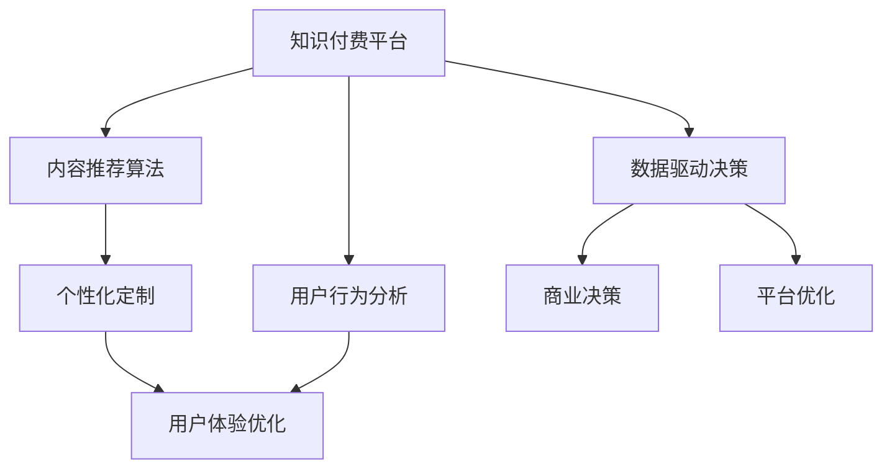

                 

# 知识付费创业中的用户行为分析与应用

> 关键词：知识付费、用户行为分析、内容推荐、个性化定制、用户体验优化

## 1. 背景介绍

### 1.1 问题由来

随着互联网技术的迅猛发展，知识付费模式日渐兴起，成为众多互联网创业项目的热门选择。知识付费平台如得到、喜马拉雅、知乎live等纷纷涌现，成功吸引大量用户付费订阅优质内容。然而，尽管知识付费市场发展迅速，但其用户流失率仍居高不下，达30-50%，远高于传统付费订阅模式。如何更好地理解和引导用户行为，提高用户粘性和满意度，成为知识付费平台亟需解决的关键问题。

用户行为分析作为数据驱动决策的基础工具，能够帮助平台更好地理解用户，优化内容推荐和个性化定制，从而提升用户体验，实现商业价值最大化。本文将从理论到实践，详细介绍基于用户行为分析的知识点推荐算法及其在知识付费平台中的应用。

### 1.2 问题核心关键点

当前，知识付费平台面临的核心问题包括：

1. **用户行为多样性**：知识付费平台的用户需求多样化，从职业技能提升到兴趣爱好学习，从碎片化学习到系统性课程，需求差异显著。
2. **内容推荐难度大**：不同于电商平台以商品为核心，知识付费平台以内容为特色。如何更准确地推荐内容，满足用户多样化需求，是知识付费平台的重大挑战。
3. **个性化需求高**：用户希望得到量身定制的个性化学习方案，而非一刀切的内容推荐。
4. **用户反馈稀缺**：用户反馈率低，难以及时了解用户对推荐内容的质量和兴趣。

### 1.3 问题研究意义

深入理解用户行为并应用其指导的内容推荐算法，不仅有助于提升知识付费平台的用户粘性和满意度，还能大幅降低用户流失率，提高平台盈利能力。具体研究意义包括：

1. **提高用户满意度**：通过对用户行为数据的分析，个性化推荐用户感兴趣的内容，提升用户满意度和留存率。
2. **降低用户流失**：减少用户流失，提升平台用户规模和活跃度。
3. **优化内容分发**：通过分析用户行为，优化内容分发策略，提升内容覆盖面和曝光度。
4. **增加用户粘性**：增加用户粘性，提升用户终身价值(Lifetime Value, LTV)。
5. **探索新商业模式**：探索知识付费平台的新商业模式，实现更灵活的用户付费方式，提升平台市场竞争力。

## 2. 核心概念与联系

### 2.1 核心概念概述

为更好地理解基于用户行为分析的知识推荐系统，本节将介绍几个核心概念：

- **知识付费平台**：通过互联网技术提供知识内容的付费服务，如视频课程、音频播客、文章阅读等。
- **用户行为分析**：通过对用户在平台上的行为数据进行收集和分析，深入了解用户需求和偏好。
- **内容推荐算法**：利用用户行为数据，通过算法模型生成个性化推荐结果，引导用户发现优质内容。
- **个性化定制**：根据用户的行为数据和偏好，提供量身定制的内容方案，提升用户满意度。
- **用户体验优化**：通过改进平台功能和界面设计，提升用户的整体使用体验。
- **数据驱动决策**：基于用户行为数据和推荐结果，进行商业决策和平台优化。

这些核心概念之间的逻辑关系可以通过以下Mermaid流程图来展示：



这个流程图展示了几大核心概念及其之间的关系：

1. 知识付费平台通过用户行为分析，生成个性化推荐结果。
2. 个性化定制进一步提升推荐效果，增强用户粘性。
3. 用户体验优化改善用户整体体验，促进用户转化。
4. 数据驱动决策优化平台功能和内容推荐，提升平台竞争力。

## 3. 核心算法原理 & 具体操作步骤
### 3.1 算法原理概述

基于用户行为分析的知识推荐系统，本质上是一个复杂的数据驱动决策系统。其核心思想是：通过分析用户在平台上的行为数据，挖掘用户需求和偏好，生成个性化推荐结果，引导用户发现优质内容。

形式化地，假设知识付费平台的用户行为数据为 $D=\{(x_i,y_i)\}_{i=1}^N$，其中 $x_i$ 为行为特征向量，如浏览历史、购买记录、评论等，$y_i$ 为标签，如课程、书籍、播客等。内容推荐算法 $f$ 的输入为 $x_i$，输出为个性化推荐结果 $y_i'$。推荐算法优化的目标是最小化用户满意度损失函数 $\mathcal{L}$，即：

$$
\theta^* = \mathop{\arg\min}_{\theta} \mathcal{L}(f_{\theta}(x_i), y_i)
$$

其中 $\theta$ 为算法模型参数，$f_{\theta}(x_i)$ 为模型在输入 $x_i$ 上的预测结果。常见的损失函数包括均方误差、交叉熵、平均绝对误差等。

### 3.2 算法步骤详解

基于用户行为分析的内容推荐算法一般包括以下几个关键步骤：

**Step 1: 数据收集与预处理**

- 收集知识付费平台的用户行为数据，包括浏览记录、购买行为、评分反馈、评论等。
- 对数据进行清洗和预处理，去除噪声和异常值，确保数据的准确性和完整性。

**Step 2: 特征工程**

- 设计合适的特征提取方法，从用户行为数据中提取有用的特征，如课程类别、用户评分、学习时长等。
- 进行特征选择和特征转换，如PCA降维、特征归一化等。

**Step 3: 选择推荐模型**

- 根据任务需求选择合适的推荐算法模型，如协同过滤、基于内容的推荐、矩阵分解等。
- 对于大规模数据集，可以考虑使用模型并行、分布式计算等技术。

**Step 4: 模型训练与调优**

- 将预处理后的数据集划分为训练集、验证集和测试集，用于模型训练和评估。
- 使用机器学习算法或深度学习模型训练推荐模型，并在验证集上进行调优，选择最优模型参数。

**Step 5: 推荐结果输出**

- 将新用户行为数据输入训练好的推荐模型，生成个性化推荐结果。
- 对推荐结果进行后处理，如排序、去重等，确保推荐质量。

**Step 6: 用户反馈收集与反馈循环**

- 收集用户对推荐结果的反馈，如点击率、购买率、评分等。
- 基于反馈结果对推荐模型进行迭代优化，不断提升推荐效果。

### 3.3 算法优缺点

基于用户行为分析的推荐算法具有以下优点：

1. **个性化推荐**：通过分析用户行为，生成量身定制的推荐内容，满足用户多样化需求。
2. **高效推荐**：利用用户行为数据，快速生成个性化推荐结果，提高用户体验。
3. **可解释性强**：推荐结果可解释性强，用户易于理解和使用。
4. **适应性强**：算法易于适应新的用户和内容，无需重新训练模型。

同时，该算法也存在以下局限性：

1. **数据隐私问题**：需要收集大量用户行为数据，涉及隐私保护和安全问题。
2. **数据质量要求高**：数据质量、完整性、准确性直接影响推荐效果。
3. **冷启动问题**：新用户缺乏行为数据，难以生成个性化推荐。
4. **算法复杂度**：部分推荐算法复杂度较高，对计算资源和计算效率要求高。
5. **推荐偏差**：如果数据分布不均衡，可能导致推荐偏差。

尽管存在这些局限性，基于用户行为分析的推荐算法仍是目前知识付费平台中应用最广泛的方法之一。未来相关研究的重点在于如何进一步提高推荐系统的准确性和效率，同时保障用户隐私和数据安全。

### 3.4 算法应用领域

基于用户行为分析的推荐算法在知识付费平台中的应用，主要体现在以下几个方面：

- **内容推荐**：根据用户历史行为，推荐用户感兴趣的内容。
- **个性化定制**：根据用户行为数据，定制个性化学习方案和课程推荐。
- **用户分群**：通过分析用户行为数据，对用户进行分群，制定不同的内容策略。
- **营销活动**：利用用户行为数据，设计个性化营销活动，提升用户参与度和留存率。
- **用户体验优化**：分析用户行为数据，优化平台功能和界面设计，提升用户体验。

除了上述这些经典应用外，知识推荐算法还被创新性地应用到更多场景中，如智能客服、内容生成、广告推荐等，为知识付费平台带来了新的应用思路。

## 4. 数学模型和公式 & 详细讲解 & 举例说明
### 4.1 数学模型构建

本节将使用数学语言对基于用户行为分析的内容推荐系统进行更加严格的刻画。

记用户行为数据为 $D=\{(x_i,y_i)\}_{i=1}^N$，其中 $x_i \in \mathbb{R}^d$ 为用户行为特征向量，$y_i \in \{1,2,\ldots,K\}$ 为标签。

定义推荐模型为 $f: \mathbb{R}^d \rightarrow \{1,2,\ldots,K\}$，其输入为 $x_i$，输出为 $y_i'$。

定义用户满意度损失函数为 $\mathcal{L}(y_i',y_i)$，衡量推荐结果与用户真实标签之间的差异。常见的用户满意度损失函数包括均方误差、交叉熵、平均绝对误差等。

模型训练的优化目标是最小化损失函数 $\mathcal{L}$，即：

$$
\theta^* = \mathop{\arg\min}_{\theta} \mathcal{L}(f_{\theta}(x_i), y_i)
$$

在实践中，我们通常使用基于梯度的优化算法（如SGD、Adam等）来近似求解上述最优化问题。设 $\eta$ 为学习率，$\lambda$ 为正则化系数，则参数的更新公式为：

$$
\theta \leftarrow \theta - \eta \nabla_{\theta}\mathcal{L}(\theta) - \eta\lambda\theta
$$

其中 $\nabla_{\theta}\mathcal{L}(\theta)$ 为损失函数对参数 $\theta$ 的梯度，可通过反向传播算法高效计算。

### 4.2 公式推导过程

以下我们以协同过滤算法为例，推导其基于用户行为分析的推荐公式。

假设协同过滤算法中的用户-物品评分矩阵为 $R \in \mathbb{R}^{N \times M}$，其中 $N$ 为用户数量，$M$ 为物品数量。设用户 $u$ 对物品 $i$ 的评分向量为 $r_i \in \mathbb{R}^M$。

协同过滤算法的目标是预测用户 $u$ 对物品 $i$ 的评分，生成推荐结果。假设用户 $u$ 对物品 $i$ 的评分向量为 $\hat{r}_i$，则协同过滤算法优化的目标是最小化均方误差损失函数：

$$
\mathcal{L}(r_i,\hat{r}_i) = \frac{1}{2}\sum_{i=1}^M (r_i - \hat{r}_i)^2
$$

根据梯度下降算法，参数更新公式为：

$$
\hat{r}_i = r_i + \eta \sum_{j=1}^N \alpha_j(r_j - \hat{r}_j)(R_i - \hat{R}_j)
$$

其中 $\alpha_j = \frac{\sum_{i=1}^M r_iR_{ij}}{\sum_{i=1}^M (r_i - \hat{r}_i)^2}$ 为相似度系数，$\hat{R}_j = \sum_{i=1}^M \alpha_j(r_i - \hat{r}_i)R_{ij}$ 为平均评分预测值。

在得到预测评分 $\hat{r}_i$ 后，可以基于评分生成推荐列表，如选取排名靠前的 $k$ 个物品进行推荐。

### 4.3 案例分析与讲解

假设某知识付费平台上，用户 $u$ 学习了一门编程课程 $i$，评分 $r_i=4$。推荐算法根据用户历史行为数据，预测用户对其他课程的评分向量 $\hat{r}_j$，并生成推荐列表。假设推荐算法选择了评分最高的前三个课程 $j_1,j_2,j_3$，预测评分分别为 $\hat{r}_{j_1}=4.2$、$\hat{r}_{j_2}=4.5$、$\hat{r}_{j_3}=4.8$。

对于课程 $j_1$，用户未购买过，因此需要生成个性化推荐结果。推荐算法可以考虑向用户推荐课程 $j_1$，评分预测为 $\hat{r}_{j_1}=4.2$。此时，如果用户购买了课程 $j_1$，则系统会继续根据新购买的评分进行更新，逐步提升推荐效果。

## 5. 项目实践：代码实例和详细解释说明
### 5.1 开发环境搭建

在进行推荐系统实践前，我们需要准备好开发环境。以下是使用Python进行Pandas和Scikit-learn开发的推荐系统环境配置流程：

1. 安装Anaconda：从官网下载并安装Anaconda，用于创建独立的Python环境。

2. 创建并激活虚拟环境：
```bash
conda create -n recsys-env python=3.8 
conda activate recsys-env
```

3. 安装Pandas和Scikit-learn：
```bash
conda install pandas scikit-learn
```

4. 安装Tensorflow（可选）：
```bash
conda install tensorflow
```

5. 安装其它工具包：
```bash
pip install matplotlib jupyter notebook ipython
```

完成上述步骤后，即可在`recsys-env`环境中开始推荐系统实践。

### 5.2 源代码详细实现

下面我们以协同过滤算法为例，给出使用Pandas和Scikit-learn对知识付费平台进行推荐系统开发的PyTorch代码实现。

首先，定义数据处理函数：

```python
import pandas as pd
from sklearn.model_selection import train_test_split
from sklearn.metrics import mean_squared_error

def load_data(file_path):
    df = pd.read_csv(file_path)
    return df

def split_data(df, test_size=0.2, random_state=42):
    train_df, test_df = train_test_split(df, test_size=test_size, random_state=random_state)
    return train_df, test_df

def preprocess_data(df):
    df.dropna(inplace=True)
    df.fillna(0, inplace=True)
    return df

def normalize_data(df):
    return (df - df.mean()) / df.std()

def evaluate_model(train_df, test_df, model, predictions):
    rmse = mean_squared_error(test_df['rating'], predictions)
    print(f"RMSE: {rmse:.3f}")
```

然后，定义协同过滤算法模型：

```python
from sklearn.metrics.pairwise import cosine_similarity
from scipy.sparse import csr_matrix

def collaborative_filtering(df, k=5):
    # 计算用户-物品评分矩阵
    R = csr_matrix(df.pivot_table(index='user_id', columns='item_id', values='rating').fillna(0))
    
    # 构建用户评分矩阵
    U = R.T.dot(R).power(-0.5).dot(R)
    
    # 生成推荐列表
    predictions = []
    for user_id in U.index:
        similar_items = [v for v in U[user_id] if v != 0]
        top_k_items = sorted(similar_items, key=lambda x: x)[-k:]
        for item_id in top_k_items:
            predictions.append(R[user_id, item_id])
    
    return predictions
```

最后，启动推荐系统流程：

```python
file_path = 'ratings.csv'
test_size = 0.2
random_state = 42

# 加载数据
df = load_data(file_path)

# 划分数据集
train_df, test_df = split_data(df, test_size=test_size, random_state=random_state)

# 预处理数据
train_df = preprocess_data(train_df)
test_df = preprocess_data(test_df)
train_df = normalize_data(train_df)
test_df = normalize_data(test_df)

# 训练模型
predictions = collaborative_filtering(train_df)
evaluate_model(train_df, test_df, predictions)
```

以上就是使用Pandas和Scikit-learn对协同过滤算法进行推荐系统开发的完整代码实现。可以看到，利用Python的数据处理和机器学习库，可以方便地实现协同过滤推荐系统。

### 5.3 代码解读与分析

让我们再详细解读一下关键代码的实现细节：

**load_data函数**：
- 加载CSV格式的数据集，使用Pandas库处理数据。

**split_data函数**：
- 使用Scikit-learn的train_test_split方法，将数据集分为训练集和测试集，确保测试集的真实性。

**preprocess_data函数**：
- 对数据进行清洗和预处理，去除噪声和异常值，确保数据的准确性和完整性。

**normalize_data函数**：
- 对数据进行归一化处理，使不同特征之间的评分具有可比性。

**collaborative_filtering函数**：
- 实现协同过滤算法，通过计算用户-物品评分矩阵，生成个性化推荐列表。

**evaluate_model函数**：
- 评估推荐模型的性能，使用均方根误差(RMSE)作为评价指标。

**主程序**：
- 加载数据集，划分数据集，预处理数据，训练模型，评估模型性能。

可以看到，利用Pandas和Scikit-learn，可以简洁高效地实现协同过滤推荐系统。开发者可以将更多精力放在模型改进和数据处理上，而不必过多关注底层的实现细节。

当然，工业级的系统实现还需考虑更多因素，如模型的保存和部署、超参数的自动搜索、推荐效果的持续优化等。但核心的推荐范式基本与此类似。

## 6. 实际应用场景
### 6.1 智能客服系统

智能客服系统作为知识付费平台的重要组成部分，通过自动解答用户问题，提升用户满意度。利用用户行为数据，可以构建智能推荐系统，推荐用户可能感兴趣的问题解答，提高客服系统的响应速度和准确性。

在技术实现上，可以收集用户的历史咨询记录，将问题和最佳答复构建成监督数据，在此基础上对预训练模型进行微调。微调后的模型能够自动理解用户问题，匹配最合适的答案模板进行回复。对于用户提出的新问题，还可以接入检索系统实时搜索相关内容，动态组织生成回答。如此构建的智能客服系统，能大幅提升客户咨询体验和问题解决效率。

### 6.2 内容分发优化

内容分发是知识付费平台的核心业务。利用用户行为数据，可以优化内容推荐策略，提升内容覆盖面和曝光度。

具体而言，可以收集用户浏览历史、购买行为、评分反馈等数据，分析用户对不同内容的兴趣点和偏好。根据用户行为数据，生成个性化推荐列表，引导用户发现优质内容。此外，还可以通过用户行为数据，优化内容分发的算法模型，提升内容推荐的准确性和多样性。

### 6.3 个性化学习方案

传统的知识付费平台往往采用一刀切的内容推荐方式，难以满足用户个性化需求。通过分析用户行为数据，可以定制个性化的学习方案，提升用户满意度。

具体而言，可以收集用户的浏览历史、学习时长、评分反馈等数据，分析用户的学习行为和偏好。根据用户行为数据，定制个性化的学习路径，推荐用户感兴趣的内容。此外，还可以通过用户行为数据，设计多样化的学习方式，如视频、音频、图文等多种形式，提升用户的学习体验。

### 6.4 未来应用展望

随着用户行为数据和推荐算法的不断发展，基于用户行为分析的推荐系统将在更多领域得到应用，为知识付费平台带来新的突破。

在智慧医疗领域，基于用户行为分析的推荐系统可以推荐适合患者的学习资料，提升患者对疾病的理解和自我管理能力。

在智能教育领域，推荐系统可以个性化推荐学习资源，满足不同学生的学习需求，提升学习效果。

在智慧城市治理中，推荐系统可以推荐市民感兴趣的政策信息和公共服务，提升城市管理的透明度和民众参与度。

此外，在企业培训、文化传媒等领域，基于用户行为分析的推荐系统也将发挥重要作用，推动知识付费平台的技术应用和产业升级。

## 7. 工具和资源推荐
### 7.1 学习资源推荐

为了帮助开发者系统掌握基于用户行为分析的推荐系统的理论基础和实践技巧，这里推荐一些优质的学习资源：

1. 《推荐系统实战》系列博文：由推荐系统专家撰写，深入浅出地介绍了推荐系统原理、协同过滤、基于内容的推荐、深度推荐等前沿话题。

2. 《机器学习实战》课程：Coursera的推荐系统课程，系统介绍推荐系统的理论基础和实践应用，适合初学者学习。

3. 《推荐系统理论与算法》书籍：经典推荐系统著作，全面介绍了推荐系统的发展历程和推荐算法，适合进一步深入学习。

4. 《推荐系统实践》书籍：详细介绍了推荐系统的开发工具和算法实现，适合工程师实践。

5. Kaggle竞赛：参加Kaggle推荐系统竞赛，实战提升推荐系统技能。

通过对这些资源的学习实践，相信你一定能够快速掌握基于用户行为分析的推荐系统的精髓，并用于解决实际的推荐问题。

### 7.2 开发工具推荐

高效的开发离不开优秀的工具支持。以下是几款用于推荐系统开发的常用工具：

1. Pandas：Python的数据处理库，高效便捷，适用于数据清洗和预处理。
2. Scikit-learn：Python的机器学习库，提供丰富的算法和工具，适用于推荐模型训练和评估。
3. Tensorflow：Google主导的深度学习框架，支持大规模分布式计算，适用于复杂模型的开发和训练。
4. Jupyter Notebook：交互式开发环境，方便调试和迭代模型。
5. Weights & Biases：模型训练的实验跟踪工具，记录和可视化模型训练过程中的各项指标，方便对比和调优。
6. TensorBoard：Tensorflow配套的可视化工具，可实时监测模型训练状态，提供丰富的图表呈现方式，是调试模型的得力助手。

合理利用这些工具，可以显著提升推荐系统的开发效率，加快创新迭代的步伐。

### 7.3 相关论文推荐

推荐系统的发展源于学界的持续研究。以下是几篇奠基性的相关论文，推荐阅读：

1. Collaborative Filtering for Implicit Feedback Datasets（Koren等）：提出了协同过滤算法，通过用户-物品评分矩阵进行推荐。

2. A Probabilistic Approach to Knowledge Acquisition and Type Synthesis（Palmer等）：提出了基于内容的推荐方法，通过特征向量的相似度进行推荐。

3. How to Discover a Niche for Your Data（Wang等）：探讨了推荐系统矩阵分解的数学基础，提供了多种推荐算法。

4. Matrix Factorization Techniques for Recommender Systems（Sarwar等）：介绍了矩阵分解算法的原理和应用，是推荐系统领域的经典文献。

5. Deep Aspects of BPR: User–Item Association Prediction Beyond Pairwise Rankings（Chen等）：探讨了深度推荐算法的理论基础和应用，介绍了多种深度学习模型。

这些论文代表了大推荐系统的发展脉络。通过学习这些前沿成果，可以帮助研究者把握学科前进方向，激发更多的创新灵感。

## 8. 总结：未来发展趋势与挑战
### 8.1 总结

本文对基于用户行为分析的推荐系统进行了全面系统的介绍。首先阐述了知识付费平台在用户行为分析上的研究背景和意义，明确了推荐系统在提升用户满意度、降低流失率等方面的关键作用。其次，从原理到实践，详细讲解了协同过滤推荐算法及其在知识付费平台中的应用。最后，我们探讨了推荐系统在智能客服、内容分发、个性化学习方案等多个场景中的实际应用，展示了推荐系统的广阔前景。

通过本文的系统梳理，可以看到，基于用户行为分析的推荐系统正在成为知识付费平台的重要工具，极大地提升了用户体验和留存率。未来的推荐系统研究需要关注如何进一步提高推荐准确性、效率和可解释性，同时保障用户隐私和数据安全。

### 8.2 未来发展趋势

展望未来，基于用户行为分析的推荐系统将呈现以下几个发展趋势：

1. **多模态推荐**：结合文本、图像、音频等多模态数据，提升推荐系统的综合表现。
2. **实时推荐**：通过流式计算和在线学习，实现实时推荐，提高推荐效果和用户体验。
3. **混合推荐**：结合多种推荐算法，如协同过滤、基于内容的推荐、深度推荐等，提升推荐系统的鲁棒性和泛化能力。
4. **个性化推荐**：基于用户行为数据，实现更个性化、多样化的推荐，提升用户满意度和留存率。
5. **自动化调参**：采用自动化调参技术，优化推荐模型的超参数，提高推荐效果。
6. **模型压缩与加速**：通过模型压缩和加速技术，提高推荐系统的计算效率和实时性。

这些趋势凸显了推荐系统的广阔前景。未来的研究需要在推荐算法、数据处理、系统架构等方面协同发力，实现更加智能、高效、可靠、可解释的推荐系统。

### 8.3 面临的挑战

尽管基于用户行为分析的推荐系统取得了不小的进展，但仍面临诸多挑战：

1. **数据隐私保护**：推荐系统需要收集大量用户行为数据，涉及用户隐私保护和数据安全问题。
2. **数据质量与多样性**：数据质量、完整性和多样性直接影响推荐效果。
3. **冷启动问题**：新用户缺乏行为数据，难以生成个性化推荐。
4. **算法复杂度**：部分推荐算法复杂度较高，对计算资源和计算效率要求高。
5. **推荐偏差**：如果数据分布不均衡，可能导致推荐偏差。
6. **推荐效果评估**：如何科学评估推荐系统的性能，优化推荐效果，仍是待解难题。

尽管存在这些挑战，基于用户行为分析的推荐系统仍是目前知识付费平台中应用最广泛的方法之一。未来相关研究的重点在于如何进一步提高推荐系统的准确性和效率，同时保障用户隐私和数据安全。

### 8.4 研究展望

面对推荐系统所面临的种种挑战，未来的研究需要在以下几个方面寻求新的突破：

1. **多模态数据融合**：将文本、图像、音频等多模态数据融合，提升推荐系统的综合表现。
2. **实时推荐算法**：研究实时推荐算法，通过流式计算和在线学习，实现实时推荐。
3. **自动化调参技术**：采用自动化调参技术，优化推荐模型的超参数，提高推荐效果。
4. **推荐系统安全性**：研究推荐系统的安全性，避免数据泄露和用户隐私侵害。
5. **推荐系统解释性**：提升推荐系统的可解释性，增强用户信任和满意度。

这些研究方向将引领推荐系统技术迈向更高的台阶，为知识付费平台带来新的突破。面向未来，推荐系统还需要与其他人工智能技术进行更深入的融合，如知识表示、因果推理、强化学习等，多路径协同发力，共同推动推荐系统的发展。只有勇于创新、敢于突破，才能不断拓展推荐系统的边界，让知识付费平台技术更好地服务于用户。

## 9. 附录：常见问题与解答

**Q1：推荐系统如何提高用户满意度？**

A: 推荐系统通过分析用户行为数据，生成个性化推荐结果，提升用户对平台内容的满意度和粘性。具体措施包括：
1. 用户行为分析：收集用户浏览历史、购买行为、评分反馈等数据，深入了解用户需求和偏好。
2. 个性化推荐：根据用户行为数据，生成量身定制的推荐列表，满足用户多样化需求。
3. 推荐效果评估：通过用户反馈和行为数据，不断优化推荐模型，提升推荐效果。

**Q2：推荐系统的冷启动问题如何解决？**

A: 推荐系统的冷启动问题可以通过以下方法解决：
1. 用户行为预测：利用用户的人口统计学信息、兴趣爱好等非结构化数据，预测用户行为，生成初步推荐。
2. 物品特征提取：通过物品的标签、分类、属性等特征，生成物品相似度矩阵，进行推荐。
3. 多模态融合：结合用户行为数据和物品特征，综合生成推荐结果。

**Q3：推荐系统如何提升推荐效果？**

A: 提升推荐效果的方法包括：
1. 数据预处理：清洗、补全、归一化数据，确保数据质量和准确性。
2. 特征工程：设计合适的特征提取方法，从用户行为数据中提取有用的特征。
3. 算法优化：选择合适推荐算法，如协同过滤、基于内容的推荐、深度推荐等，并优化算法模型。
4. 模型评估：使用合适的评价指标，如均方误差、交叉熵、平均绝对误差等，评估推荐模型性能。
5. 持续优化：基于用户反馈和行为数据，不断优化推荐模型，提升推荐效果。

**Q4：推荐系统如何处理新用户？**

A: 处理新用户的方法包括：
1. 用户行为预测：利用用户的人口统计学信息、兴趣爱好等非结构化数据，预测用户行为，生成初步推荐。
2. 物品特征提取：通过物品的标签、分类、属性等特征，生成物品相似度矩阵，进行推荐。
3. 多模态融合：结合用户行为数据和物品特征，综合生成推荐结果。

**Q5：推荐系统如何保证推荐效果稳定？**

A: 保证推荐效果稳定的措施包括：
1. 数据多样化：收集多种类型的用户行为数据，避免数据偏差。
2. 特征鲁棒性：选择鲁棒性强的特征进行推荐，减少推荐偏差。
3. 模型鲁棒性：选择鲁棒性强的推荐算法模型，减少推荐波动。
4. 反馈循环：基于用户反馈，持续优化推荐模型，保证推荐效果稳定。

这些措施将有助于提升推荐系统的稳定性和效果，让用户体验更满意。

---

作者：禅与计算机程序设计艺术 / Zen and the Art of Computer Programming

