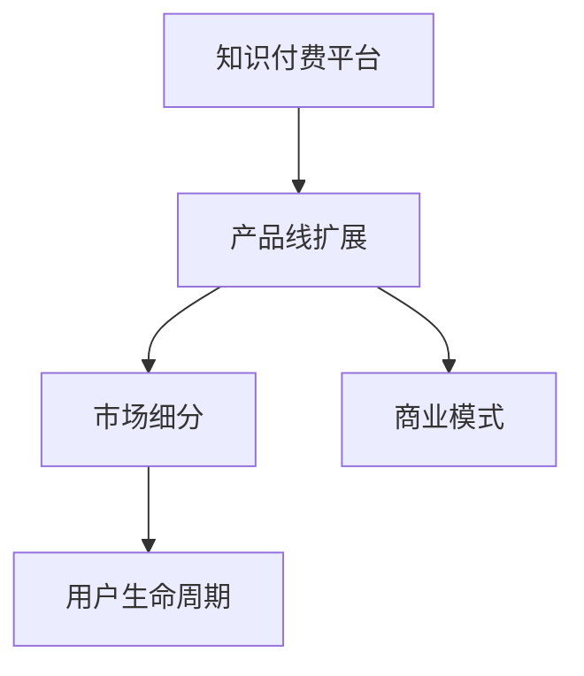

                 

# 知识付费创业的产品线扩展思路

## 1. 背景介绍

### 1.1 问题由来

知识付费近年来在全球范围内发展迅速，特别是在中国市场。随着人们收入水平提升及时间成本意识增强，愿意为优质内容和专业服务付费的用户群体持续扩大。这对许多有志于进入这一领域的创业者来说，既是一大机遇，也是一种挑战。创业初期，企业往往需要同时应对多个发展方向和市场机遇，因此制定合理的产品线扩展策略至关重要。

### 1.2 问题核心关键点

1. **目标市场定位**：明确目标用户群体及他们的需求。
2. **核心价值定位**：确定差异化的产品和服务，以吸引并留住用户。
3. **市场切入点选择**：从细分市场或垂直领域开始，逐步扩大市场覆盖。
4. **用户留存策略**：构建良好的用户体验和生态系统，确保用户长期留存。
5. **商业模式探索**：选择合适的盈利模式，如订阅制、按需付费、增值服务等。
6. **技术资源投入**：评估技术需求和现有资源，合理分配技术力量。

### 1.3 问题研究意义

合理的产品线扩展能够帮助企业快速占领市场，并形成竞争优势。它不仅能增强用户体验，还能为企业带来更高的收入和更强的市场影响力。通过梳理产品线扩展的关键点，可以更好地指导知识付费创业企业的战略规划和执行。

## 2. 核心概念与联系

### 2.1 核心概念概述

为更好地理解知识付费创业的产品线扩展策略，本文将介绍几个核心概念：

- **知识付费平台（Knowledge Subscription Platforms）**：通过提供优质内容和专业知识，向用户收取费用的在线平台。
- **产品线扩展（Product Line Extension）**：在已有产品的基础上，增加新的产品或服务，以扩大市场覆盖和增加收入。
- **市场细分（Market Segmentation）**：将市场划分为不同的子市场，以识别并满足特定的用户需求。
- **用户生命周期（User Lifecycle Management）**：从获取到流失的完整用户旅程，关注用户在整个生命周期内的价值提升和留存。
- **商业模式（Business Model）**：企业通过不同的盈利方式，实现收入和价值创造的策略。

这些核心概念之间的逻辑关系可以通过以下Mermaid流程图来展示：



这个流程图展示了知识付费创业中几个核心概念的相互联系：

1. 知识付费平台是产品线扩展的起点，通过不断增加新的产品或服务来扩大市场。
2. 市场细分是识别和满足特定用户需求的关键。
3. 用户生命周期管理关注用户从获取到流失的全过程，帮助提升用户粘性和长期价值。
4. 商业模式决定了企业如何盈利，不同的模式将影响产品线扩展的方向和规模。

## 3. 核心算法原理 & 具体操作步骤

### 3.1 算法原理概述

产品线扩展的核心算法原理是市场细分和用户生命周期管理。其核心思想是：

1. **市场细分（Market Segmentation）**：通过数据分析和用户研究，将市场划分为多个子市场，并识别出每个子市场的需求特征。
2. **用户生命周期（User Lifecycle）**：通过建立用户画像和行为分析模型，跟踪用户在平台上的行为轨迹，以发现和解决问题。

这些原理通过以下算法步骤具体实施：

1. **数据收集和预处理**：收集用户数据和市场数据，进行清洗和标准化处理。
2. **市场细分分析**：运用聚类算法或分类算法进行市场细分，识别潜在用户群体。
3. **用户生命周期管理**：构建用户行为模型，分析用户各个阶段的需求变化，优化用户体验和粘性。
4. **产品线扩展决策**：基于市场细分和用户生命周期分析结果，决策新的产品或服务，并设计产品实现方案。

### 3.2 算法步骤详解

#### 步骤 1: 数据收集和预处理

- **数据来源**：用户注册信息、登录行为、课程学习记录、订阅行为、付费记录、用户反馈等。
- **数据清洗**：去除重复、噪声、缺失数据，标准化数据格式，确保数据质量。
- **特征提取**：从用户行为数据中提取关键特征，如课程学习时长、活跃度、付费频率等。

#### 步骤 2: 市场细分分析

- **聚类算法（如K-Means、DBSCAN）**：根据用户特征进行聚类，识别出具有相似特征的用户群体。
- **分类算法（如逻辑回归、决策树、随机森林）**：对已知的用户群体进行分类，预测新用户的市场定位。
- **细分结果评估**：使用评价指标如纯度、轮廓系数等评估细分结果的合理性。

#### 步骤 3: 用户生命周期管理

- **用户画像（User Persona）**：基于用户数据构建用户画像，描述用户的基本特征、需求和行为。
- **行为分析（User Behavior Analytics）**：使用时间序列分析、热图分析等方法，分析用户行为模式。
- **用户分群（User Cohort）**：根据用户生命周期阶段（如新用户、活跃用户、流失用户）进行分群。
- **留存策略设计**：设计针对不同生命周期阶段的留存策略，如新手引导、课程推荐、奖励机制等。

#### 步骤 4: 产品线扩展决策

- **需求分析**：基于市场细分和用户生命周期分析，识别新产品的需求来源。
- **可行性评估**：评估产品实现的可行性，包括技术、市场、资源等方面。
- **产品设计**：设计产品功能、界面和用户体验，确保产品与现有平台无缝集成。
- **市场推广**：制定市场推广策略，包括内容营销、社交媒体推广、合作伙伴关系等。

### 3.3 算法优缺点

#### 优点

1. **市场定位精准**：细分后的市场更精准，有助于更有效地满足用户需求。
2. **用户留存提高**：通过个性化策略，提高用户粘性和留存率。
3. **多渠道盈利**：通过扩展产品线，增加盈利渠道，降低对单一产品线的依赖。
4. **风险分散**：通过分散投资，降低市场风险。

#### 缺点

1. **成本投入大**：数据收集和处理、算法开发和模型训练需要大量资源。
2. **数据隐私问题**：在数据收集和处理过程中，需注意用户隐私保护。
3. **市场竞争激烈**：知识付费市场竞争激烈，需不断创新和迭代产品。

### 3.4 算法应用领域

产品线扩展策略在多个领域都有广泛应用，包括但不限于：

- **在线教育**：通过细分用户需求，提供差异化的课程和辅导服务。
- **健康管理**：根据用户健康数据，提供个性化的健康管理方案和产品。
- **职业培训**：基于用户职业背景和兴趣，提供定制化的培训课程和认证服务。
- **心理咨询**：通过用户行为分析，推荐适合的咨询师和心理咨询产品。
- **财务管理**：基于用户财务状况，提供个性化的理财规划和金融产品。

## 4. 数学模型和公式 & 详细讲解 & 举例说明

### 4.1 数学模型构建

产品线扩展涉及多个关键数学模型，包括市场细分、用户行为分析和产品需求预测。

#### 市场细分模型

假设用户数据集为 $D=\{(x_i,y_i)\}_{i=1}^N$，其中 $x_i$ 为特征向量，$y_i$ 为标签（例如，用户群体）。市场细分目标是通过聚类算法识别用户群体。

常用的聚类算法包括K-Means和层次聚类。以K-Means为例，其核心思想是将数据点聚类到K个簇中，使得簇内离散度最小，簇间离散度最大。

数学模型表示为：

$$
\min_{\theta} \sum_{i=1}^N \sum_{j=1}^K \rho(x_i;\theta_j)^2
$$

其中 $\rho(x_i;\theta_j)$ 为数据点 $x_i$ 属于簇 $j$ 的概率密度。

### 4.2 公式推导过程

以K-Means为例，其聚类过程包括初始化聚类中心、分配数据点至簇、更新聚类中心三步：

1. 随机初始化 $K$ 个聚类中心 $\theta_j$。
2. 将每个数据点 $x_i$ 分配至最近的聚类中心 $\theta_j$。
3. 更新每个聚类中心的坐标，使其变为所属数据点的平均值。

公式推导如下：

设聚类中心为 $\theta_j = (x_{j1},x_{j2},\dots,x_{jn_j})$，则更新公式为：

$$
\theta_j \leftarrow \frac{1}{n_j}\sum_{i\in j} x_i
$$

### 4.3 案例分析与讲解

**案例：知识付费平台用户细分**

假设某知识付费平台拥有 $100,000$ 个用户数据，我们想要将用户细分为 $10$ 个不同的群体。使用K-Means算法，我们首先随机选择 $10$ 个数据点作为聚类中心，并将所有用户分配至最近的聚类中心。接着，我们计算每个聚类中心，将其更新为所属用户数据的平均值。经过多轮迭代后，我们可以得到 $10$ 个用户群体，每个群体有 $10,000$ 个用户。

## 5. 项目实践：代码实例和详细解释说明

### 5.1 开发环境搭建

- **环境要求**：Python 3.8以上，推荐使用Anaconda创建虚拟环境。
- **主要库**：numpy、pandas、scikit-learn、matplotlib、seaborn。
- **工具**：Jupyter Notebook、Git、GitHub。

### 5.2 源代码详细实现

以下是一个使用K-Means进行用户分群的Python代码示例：

```python
import numpy as np
from sklearn.cluster import KMeans
from sklearn.preprocessing import StandardScaler
from sklearn.datasets import make_blobs

# 创建模拟数据
X, y = make_blobs(n_samples=10000, n_features=2, centers=10, cluster_std=1.0, random_state=42)

# 标准化数据
scaler = StandardScaler()
X_scaled = scaler.fit_transform(X)

# 进行K-Means聚类
kmeans = KMeans(n_clusters=10, random_state=42)
y_pred = kmeans.fit_predict(X_scaled)

# 可视化聚类结果
import matplotlib.pyplot as plt
plt.scatter(X_scaled[:, 0], X_scaled[:, 1], c=y_pred)
plt.show()
```

**代码解读与分析**

1. **数据生成**：使用`make_blobs`生成10个聚类的模拟数据。
2. **数据标准化**：使用`StandardScaler`对数据进行标准化处理，防止K-Means算法受数据尺度影响。
3. **K-Means聚类**：定义K-Means模型，并通过`fit_predict`进行聚类。
4. **可视化结果**：使用`scatter`函数将聚类结果可视化。

### 5.3 运行结果展示

运行上述代码，将得到聚类结果的可视化图表，其中不同颜色的点表示不同的聚类中心。


## 6. 实际应用场景

### 6.1 智能教育

在智能教育领域，知识付费创业企业可以针对不同年龄段和学科需求，提供定制化的教育内容和课程。通过市场细分，企业可以识别出不同学科和年级的学习需求，并针对性地提供个性化课程。例如，针对小学生提供基础数学和语文辅导，针对高中生提供物理和化学提升课程。

### 6.2 健康管理

健康管理领域，企业可以通过用户健康数据（如步数、心率、睡眠等）进行细分，并提供个性化的健康管理建议和产品。例如，针对经常缺乏运动的用户提供健身计划，针对睡眠问题严重的用户提供改善睡眠的课程。

### 6.3 职业培训

职业培训领域，企业可以根据用户职业背景和兴趣，提供定制化的培训课程和认证服务。例如，针对IT行业从业者提供最新技术培训课程，针对律师提供法律知识更新课程。

### 6.4 心理咨询

心理咨询领域，企业可以通过用户行为分析，推荐适合的咨询师和心理咨询产品。例如，针对焦虑用户推荐情绪管理课程，针对抑郁用户推荐心理辅导课程。

### 6.5 财务管理

财务管理领域，企业可以根据用户财务状况和理财需求，提供个性化的理财规划和金融产品。例如，针对高收入用户提供财富管理课程，针对中低收入用户提供理财入门课程。

## 7. 工具和资源推荐

### 7.1 学习资源推荐

1. **《机器学习实战》（周志华）**：全面介绍了机器学习的基本概念和常用算法，适合初学者入门。
2. **Coursera《机器学习》课程（Andrew Ng）**：斯坦福大学提供的免费机器学习课程，包含视频和作业。
3. **Kaggle**：提供大量数据集和竞赛，适合进行实际数据处理和机器学习实验。
4. **GitHub**：存储和分享代码资源，可以学习到其他开发者的最佳实践。

### 7.2 开发工具推荐

1. **Jupyter Notebook**：轻量级编程环境，支持Python等语言的交互式编程。
2. **Git**：版本控制系统，支持多人协作和项目管理。
3. **Scikit-learn**：Python机器学习库，包含多种算法和数据处理工具。
4. **TensorFlow**：深度学习框架，支持多种机器学习任务。

### 7.3 相关论文推荐

1. **《市场细分方法综述》（市场需求预测与细分）**：回顾了市场细分的多种方法，如聚类、回归、决策树等。
2. **《用户行为分析框架》（User Behavior Analytics Framework）**：介绍了一种用户行为分析框架，通过用户画像和行为模型进行用户细分和留存策略设计。
3. **《机器学习算法选择与实现》（Machine Learning Algorithm Selection）**：介绍不同算法的适用场景和实现方法，帮助选择合适的算法。

## 8. 总结：未来发展趋势与挑战

### 8.1 研究成果总结

本文介绍了知识付费创业中产品线扩展的核心概念和算法原理，并通过具体案例和代码实现，详细讲解了K-Means聚类算法的应用。通过市场细分和用户生命周期管理，企业可以识别并满足特定用户需求，从而扩展产品线，增加市场覆盖和用户留存。

### 8.2 未来发展趋势

1. **个性化服务增强**：未来的产品线扩展将更加注重个性化服务，通过深入分析用户行为和需求，提供更加精准和个性化的产品。
2. **技术创新加速**：随着人工智能和大数据分析技术的进步，产品线扩展将更加智能化和自动化。
3. **跨领域融合**：知识付费平台将与其他领域的产品和服务进行更多跨领域融合，提供更丰富的产品组合。
4. **用户体验优化**：用户留存和忠诚度的提升将更多依赖于优质的用户体验设计和运营策略。
5. **数据驱动决策**：产品线扩展将更加依赖数据驱动的决策，通过大数据分析进行市场洞察和策略制定。

### 8.3 面临的挑战

1. **数据获取与处理**：数据获取和处理成本较高，需解决数据隐私和数据质量问题。
2. **算法复杂性**：复杂算法的选择和实现需要高水平的技术团队支持。
3. **市场竞争激烈**：知识付费平台需不断创新和迭代产品，以保持市场竞争力。
4. **用户需求变化**：需快速响应市场变化，适应用户需求的变化。
5. **盈利模式单一**：单一的订阅模式可能难以覆盖多种需求，需探索多元化的盈利模式。

### 8.4 研究展望

未来的研究应在以下几个方向进一步探索和突破：

1. **多维度数据融合**：将不同维度的数据（如用户行为、社交网络、地理位置等）进行融合，提供更全面的用户画像。
2. **实时数据处理**：通过流式数据处理技术，实现实时用户行为分析和决策。
3. **跨平台协同**：通过多平台协同，提供无缝的用户体验和数据互通。
4. **隐私保护与数据安全**：在用户数据收集和处理过程中，注重隐私保护和数据安全。
5. **用户交互优化**：通过提升用户交互体验，提升用户粘性和留存率。

## 9. 附录：常见问题与解答

**Q1: 如何评估市场细分的效果？**

A: 评估市场细分效果常用的指标包括聚类模型的纯度、轮廓系数和卡方检验。其中，纯度和轮廓系数可以评估聚类结果的内部一致性，卡方检验可以评估聚类结果与实际标签的匹配度。

**Q2: 如何进行用户生命周期管理？**

A: 用户生命周期管理需要构建用户画像和行为分析模型，定期分析用户行为数据，并根据用户生命周期阶段（如新用户、活跃用户、流失用户）进行分群。针对不同阶段的用户，设计相应的留存策略，如新手引导、课程推荐、奖励机制等。

**Q3: 如何进行市场推广？**

A: 市场推广需结合产品特性和目标用户群体，选择合适的推广渠道和策略。常见的推广渠道包括社交媒体、搜索引擎、电子邮件等，需根据实际效果进行优化。

**Q4: 如何进行用户留存策略设计？**

A: 用户留存策略设计需基于用户画像和行为分析，了解用户需求和行为模式。针对不同需求的用户，设计相应的留存策略，如定期提醒、优惠活动、社群互动等。

**Q5: 如何进行产品定价？**

A: 产品定价需考虑用户需求、竞争环境、成本等因素。常见的定价策略包括渗透定价、市场定价、价值定价等，需根据实际情况进行灵活调整。

---

作者：禅与计算机程序设计艺术 / Zen and the Art of Computer Programming

