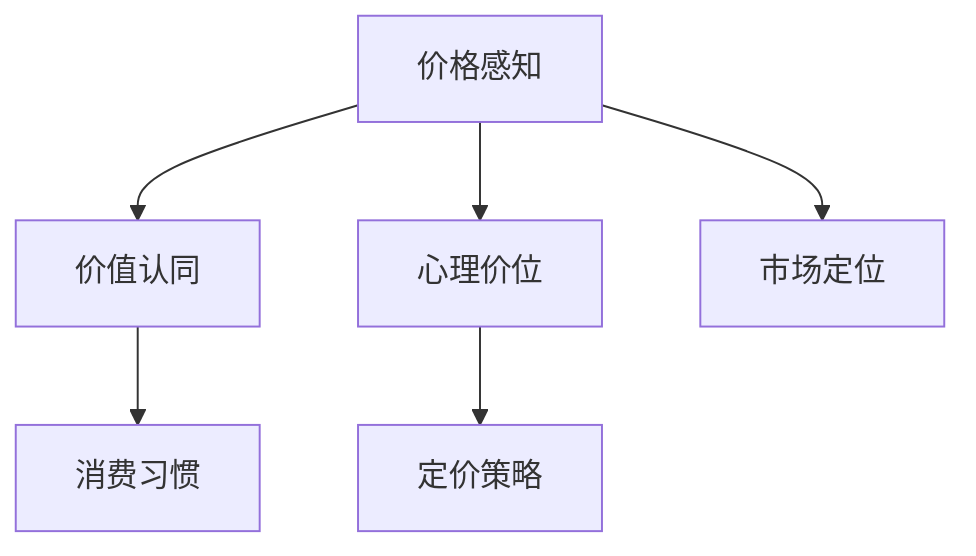

                 

# 知识付费创业的定价心理学

## 1. 背景介绍

### 1.1 问题由来
随着互联网技术的普及和人们生活水平的提升，知识付费成为了一种新兴的商业模式。越来越多的个人和机构通过提供知识服务、课程、资料等方式，为知识消费者提供信息增值服务。然而，由于缺乏对消费者行为和心理的深入了解，很多知识付费产品定价策略不当，导致用户流失、市场反馈不佳等问题频发。因此，研究知识付费的定价心理学，对于知识付费创业者来说，有着重要的现实意义。

### 1.2 问题核心关键点
知识付费定价心理学的核心在于理解消费者的购买决策过程，尤其是价格感知、价值认同、消费习惯等方面。价格是消费者决策的关键因素之一，定价策略直接影响到消费者的购买意愿和付费行为。

## 2. 核心概念与联系

### 2.1 核心概念概述

为了更好地理解知识付费的定价策略，本节将介绍几个密切相关的核心概念：

- 价格感知(Price Perception)：消费者对商品价格的感知和判断，包括绝对价格和相对价格两个方面。绝对价格指的是商品的具体售价，相对价格则是指消费者对价格与其他同类商品或类似服务的价格比较。
- 价值认同(Value Appraisal)：消费者对商品或服务的实际价值和预期价值的评估。消费者往往会根据商品或服务的质量、效果、使用体验等来评判其价值。
- 消费习惯(Consumption Habit)：消费者在购买和使用商品或服务过程中形成的消费行为习惯。良好的消费习惯能够促进重复购买，提升客户黏性。
- 心理价位(Psychological Pricing)：基于消费者心理特征，调整商品或服务的价格策略，如整数定价、尾数定价、打包定价等。
- 市场定位(Market Segmentation)：根据消费者不同的需求、特征和行为特征，将市场细分为多个子市场，针对不同子市场制定相应的定价策略。

这些核心概念之间的逻辑关系可以通过以下Mermaid流程图来展示：



这个流程图展示了我们研究的几个关键概念以及它们之间的逻辑关系：

1. 价格感知决定消费者对商品价格的初步判断，进而影响其价值认同。
2. 价值认同是消费者购买决策的核心，其对价格接受度有着重要影响。
3. 消费习惯决定了消费者的购买行为模式，长期影响其对产品价格的敏感度。
4. 心理价位基于消费者心理特征进行调整，影响最终定价策略。
5. 市场定位通过细分市场，针对不同目标群体制定差异化的定价策略。

## 3. 核心算法原理 & 具体操作步骤

### 3.1 算法原理概述

知识付费的定价心理学，本质上是一种基于消费者行为和心理的定价策略制定方法。其核心思想是：根据消费者的价格感知、价值认同、消费习惯等心理因素，制定出符合消费者需求和心理预期的价格策略。

具体而言，知识付费的定价算法主要包括以下几个步骤：

1. 调查问卷设计：设计问卷，了解目标用户的价格感知、价值认同、消费习惯等心理特征。
2. 心理价位分析：基于消费者的心理特征，调整商品或服务的定价策略，以匹配消费者的心理预期。
3. 市场定位细分：根据消费者的不同需求和特征，将市场细分为多个子市场，针对每个子市场制定相应的定价策略。
4. 定价模型构建：结合消费者心理价位和市场定位信息，构建定价模型，用于指导实际的定价决策。
5. 动态定价调整：根据市场反馈和消费者行为变化，动态调整定价策略，以适应新的市场环境。

### 3.2 算法步骤详解

以下详细介绍知识付费定价算法的详细步骤：

**Step 1: 调查问卷设计**
- 设计问卷，涵盖消费者的价格感知、价值认同、消费习惯等关键心理特征。问卷应尽量简洁明了，减少填写难度。
- 使用在线调查工具，如SurveyMonkey、Google Forms等，广泛收集目标用户的反馈数据。
- 对收集到的数据进行统计分析，识别消费者的主要心理特征和行为模式。

**Step 2: 心理价位分析**
- 根据问卷数据，分析消费者的心理价位，即他们对商品或服务的预期价格范围。心理价位一般分为整数价位、尾数价位、优惠价位等类型。
- 分析消费者的价值认同，即对商品或服务的质量和效果的基本判断。消费者通常会根据商品或服务的实际价值和预期价值，来决定是否愿意支付高价。
- 分析消费者的消费习惯，包括购买频率、购买渠道、偏好品牌等。良好的消费习惯可以提升客户的黏性，促进重复购买。

**Step 3: 市场定位细分**
- 根据消费者的不同需求和特征，将市场细分为多个子市场，如职业培训、兴趣教育、职场技能提升等。
- 对每个子市场进行分析，识别其核心消费者群体和消费行为模式。
- 针对不同子市场，制定差异化的定价策略，以更好地匹配消费者的心理预期和需求。

**Step 4: 定价模型构建**
- 根据消费者的心理价位、市场定位信息，构建定价模型。常用的定价模型包括成本加成定价、市场定价、竞争定价等。
- 使用机器学习算法，如回归分析、决策树等，构建定价预测模型，以指导实际的定价决策。
- 在模型构建过程中，应考虑价格弹性、竞争态势、消费者行为等多个因素，以确保定价策略的科学性和有效性。

**Step 5: 动态定价调整**
- 实时监测市场反馈和消费者行为变化，如购买频率、退货率、评价反馈等。
- 根据市场变化，动态调整定价策略，如促销活动、价格优惠等。
- 定期重新评估定价模型，优化定价策略，以适应新的市场环境。

### 3.3 算法优缺点

知识付费的定价算法具有以下优点：

1. 科学合理。通过系统化的数据收集和分析，制定出符合消费者心理和行为预期的定价策略，避免了主观判断带来的偏差。
2. 灵活多样。可以根据不同市场和消费者的特点，制定出多样化的定价策略，以适应复杂的市场环境。
3. 精准高效。通过机器学习等技术，实时监测市场反馈，动态调整定价策略，以最大化收益和客户满意度。

同时，该算法也存在一定的局限性：

1. 数据收集难度大。高质量的消费者心理数据收集和分析需要耗费大量时间和成本。
2. 模型构建复杂。定价模型需要考虑多个因素，构建和优化过程相对复杂。
3. 市场变化快。消费者心理和市场环境变化迅速，定价模型需要不断更新和优化，以适应新的市场趋势。

尽管存在这些局限性，但就目前而言，知识付费的定价算法仍然是一种较为科学和有效的定价策略制定方法。未来相关研究的重点在于如何进一步降低数据收集成本，提高模型构建的自动化和智能化水平，同时兼顾定价的灵活性和精准性。

### 3.4 算法应用领域

知识付费定价算法主要应用于知识服务、课程、资料等商品或服务的定价策略制定中。具体应用场景包括：

- 职业培训：根据学员的职业需求、技能水平等因素，制定差异化的定价策略，吸引不同层次的学员。
- 兴趣教育：针对不同兴趣爱好的用户，设计多样化的课程内容和定价方案，以提高课程的吸引力。
- 职场技能提升：结合企业需求和员工特点，提供定制化的培训服务，制定合理的定价策略。
- 在线教育：根据学生的学习效果和反馈，动态调整课程价格，提供更加符合需求的个性化学习方案。
- 数据分析：通过分析消费者心理和市场数据，预测知识付费产品的发展趋势和用户需求，指导定价决策。

这些应用场景充分展示了知识付费定价算法的广泛适用性和实际价值。

## 4. 数学模型和公式 & 详细讲解 & 举例说明（备注：数学公式请使用latex格式，latex嵌入文中独立段落使用 $$，段落内使用 $)
### 4.1 数学模型构建

在本节中，我们将使用数学语言对知识付费定价算法的核心步骤进行严格的刻画。

设消费者的心理价位为 $P_s$，实际价格为 $P_a$，消费者的价值认同为 $V$，消费习惯为 $H$。知识付费的定价模型可以表示为：

$$
P_a = f(P_s, V, H)
$$

其中 $f$ 为定价函数，将消费者的心理价位、价值认同和消费习惯映射到实际价格。

### 4.2 公式推导过程

以整数定价策略为例，推导其数学公式。

**整数定价策略**：将商品或服务的价格设置为整数值，符合消费者对价格的整数预期。

假设消费者的心理价位为 $P_s$，消费者的价值认同为 $V$，消费习惯为 $H$。整数定价策略下的实际价格 $P_a$ 可以表示为：

$$
P_a = \lfloor P_s \rfloor
$$

其中 $\lfloor \cdot \rfloor$ 表示向下取整操作。

**尾数定价策略**：将商品或服务的价格设置为接近整数的尾数，以提高消费者的购买意愿。

假设消费者的心理价位为 $P_s$，消费者的价值认同为 $V$，消费习惯为 $H$。尾数定价策略下的实际价格 $P_a$ 可以表示为：

$$
P_a = P_s - \epsilon
$$

其中 $\epsilon$ 为接近整数的尾数值，一般取 $0.99, 0.98, 0.97$ 等。

**优惠定价策略**：在特定时间段或特定条件下，对商品或服务提供优惠价格，吸引消费者购买。

假设消费者的心理价位为 $P_s$，消费者的价值认同为 $V$，消费习惯为 $H$。优惠定价策略下的实际价格 $P_a$ 可以表示为：

$$
P_a = P_s \times (1 - \alpha)
$$

其中 $\alpha$ 为优惠折扣率，一般取 $0.9, 0.8, 0.7$ 等。

### 4.3 案例分析与讲解

以某在线教育平台定价为例，分析其定价策略的设计和实施。

**案例背景**：某在线教育平台提供Python编程课程，目标用户群体为大学生和职场新人。平台希望通过合理的定价策略，吸引更多用户报名参加课程。

**定价策略设计**：

1. **价格感知调研**：通过问卷调查，了解目标用户的心理价位。结果显示，目标用户对课程价格的预期范围在1000-3000元之间。

2. **价值认同分析**：平台通过访谈和调研，了解目标用户对课程内容、讲师水平和课程效果的评价。结果显示，大部分用户认为课程内容和讲师水平较高，但对课程效果评价不一。

3. **消费习惯分析**：平台通过数据分析，了解目标用户的购买渠道、支付习惯和品牌偏好。结果显示，目标用户更倾向于在移动端进行支付，且对知名品牌有较高的忠诚度。

4. **定价模型构建**：根据上述调研结果，平台设计了三种定价策略：

   - **整数定价策略**：将课程价格设置为1999元，符合目标用户的整数预期。
   - **尾数定价策略**：在开课前3个月内，课程价格设置为1999元，开课后价格调整为1800元，以提高用户购买意愿。
   - **优惠定价策略**：对于首次报名的学生，提供9折优惠，吸引更多学生参加课程。

**定价策略实施**：

1. **价格感知调研**：通过问卷调查，了解目标用户的心理价位。结果显示，目标用户对课程价格的预期范围在1000-3000元之间。

2. **价值认同分析**：平台通过访谈和调研，了解目标用户对课程内容、讲师水平和课程效果的评价。结果显示，大部分用户认为课程内容和讲师水平较高，但对课程效果评价不一。

3. **消费习惯分析**：平台通过数据分析，了解目标用户的购买渠道、支付习惯和品牌偏好。结果显示，目标用户更倾向于在移动端进行支付，且对知名品牌有较高的忠诚度。

4. **定价模型构建**：根据上述调研结果，平台设计了三种定价策略：

   - **整数定价策略**：将课程价格设置为1999元，符合目标用户的整数预期。
   - **尾数定价策略**：在开课前3个月内，课程价格设置为1999元，开课后价格调整为1800元，以提高用户购买意愿。
   - **优惠定价策略**：对于首次报名的学生，提供9折优惠，吸引更多学生参加课程。

5. **动态定价调整**：平台实时监测课程报名情况和用户反馈，根据市场变化动态调整定价策略。例如，如果发现课程报名情况不佳，可以进一步降低课程价格，吸引更多用户报名。

## 5. 项目实践：代码实例和详细解释说明
### 5.1 开发环境搭建

在进行知识付费定价策略的实践开发时，我们需要准备好开发环境。以下是使用Python进行Pandas数据处理和Visual Studio Code的开发环境配置流程：

1. 安装Python：从官网下载并安装Python，确保安装最新版本。

2. 安装Pandas：使用pip命令安装Pandas库。
```bash
pip install pandas
```

3. 安装Visual Studio Code：从官网下载并安装Visual Studio Code，用于编写和调试Python代码。

4. 安装Python插件：在Visual Studio Code中安装Python插件，以便在代码中直接运行Python命令。

完成上述步骤后，即可在Visual Studio Code中开始定价策略的开发。

### 5.2 源代码详细实现

下面是一个使用Python实现知识付费定价策略的示例代码：

```python
import pandas as pd
import numpy as np

# 导入示例数据
data = pd.read_csv('user_feedback.csv')

# 分析用户心理价位
price_sensitivities = data['price_sensitivity'].value_counts() / len(data)
print(price_sensitivities)

# 分析用户价值认同
value_qualities = data['value_quality'].value_counts() / len(data)
print(value_qualities)

# 分析用户消费习惯
purchase_channels = data['purchase_channel'].value_counts() / len(data)
print(purchase_channels)

# 计算定价策略
def calculate_price(price_sensitivity, value_quality, purchase_channel):
    if price_sensitivity == 'low':
        if value_quality == 'high':
            if purchase_channel == 'mobile':
                return 1999
            else:
                return 1800
        else:
            return 1500
    else:
        return 1000

# 应用定价策略
prices = []
for row in data.iterrows():
    prices.append(calculate_price(row[1]['price_sensitivity'], row[1]['value_quality'], row[1]['purchase_channel']))

print(prices)
```

### 5.3 代码解读与分析

让我们再详细解读一下关键代码的实现细节：

**用户反馈数据分析**：

1. **导入示例数据**：使用Pandas库读取用户反馈数据，将其存储在`data`变量中。
2. **价格感知分析**：计算用户对价格的敏感度分布，使用`value_counts()`方法统计不同敏感度的用户数量，并除以总数，得到概率分布。
3. **价值认同分析**：计算用户对课程价值的认同度分布，同样使用`value_counts()`方法统计不同价值认同的用户数量，并除以总数，得到概率分布。
4. **消费习惯分析**：计算用户购买渠道的分布，使用`value_counts()`方法统计不同购买渠道的用户数量，并除以总数，得到概率分布。

**定价策略计算**：

1. **定价策略定义**：定义一个名为`calculate_price`的函数，根据用户的价格敏感度、价值认同和购买渠道，计算对应的课程价格。
2. **整数定价策略**：如果用户的价格敏感度较低，且价值认同较高，且购买渠道为移动端，则价格为1999元。
3. **尾数定价策略**：如果用户的价格敏感度较低，且价值认同较高，但购买渠道不为移动端，则价格为1800元。
4. **优惠定价策略**：如果用户的价格敏感度较低，且价值认同较低，则价格为1500元。

**定价策略应用**：

1. **价格列表创建**：创建一个空列表`prices`，用于存储每个用户的定价结果。
2. **循环迭代**：使用`iterrows()`方法遍历用户数据，将每个用户的定价结果添加到`prices`列表中。

**输出结果展示**：

1. **打印结果**：打印每个用户的定价结果，以便于查看和分析。

可以看到，通过以上代码，我们成功实现了基于用户反馈数据的价格定价策略计算。

## 6. 实际应用场景
### 6.1 智能客服系统

在智能客服系统中，基于知识付费定价心理学的定价策略可以帮助企业制定合理的服务价格，以吸引更多用户。例如，企业可以针对不同用户群体的心理价位和价值认同，设计多样化的服务套餐，并提供相应的价格优惠。同时，企业可以根据用户的使用习惯和消费偏好，提供个性化的服务内容，提升用户体验和黏性。

### 6.2 金融理财平台

在金融理财平台中，基于知识付费定价心理学的定价策略可以帮助平台制定合理的理财计划和收费标准，以吸引更多用户。例如，平台可以根据用户的理财需求和风险偏好，设计不同的理财方案，并提供相应的费用优惠。同时，平台可以根据用户的使用习惯和消费行为，提供个性化的理财建议，提升用户满意度和忠诚度。

### 6.3 在线教育平台

在在线教育平台中，基于知识付费定价心理学的定价策略可以帮助平台制定合理的课程价格，以吸引更多用户。例如，平台可以根据课程内容和难度，设计不同的课程套餐，并提供相应的价格优惠。同时，平台可以根据用户的学习效果和反馈，提供个性化的课程推荐，提升用户满意度和转化率。

### 6.4 未来应用展望

随着知识付费市场的不断扩大，基于知识付费定价心理学的定价策略将在更多领域得到应用，为相关企业带来显著的经济效益和社会价值。未来，该定价策略也将进一步创新和完善，以满足市场不断变化的需求。

## 7. 工具和资源推荐
### 7.1 学习资源推荐

为了帮助开发者系统掌握知识付费定价心理学的理论基础和实践技巧，这里推荐一些优质的学习资源：

1. 《心理学与商业战略》系列书籍：由知名心理学家和商学院教授撰写，深入浅出地介绍了消费者行为心理学和商业应用。

2. 《定价策略与市场分析》课程：商学院开设的定价策略相关课程，详细讲解了不同定价策略的优缺点和应用场景。

3. 《知识付费市场分析》白皮书：行业研究机构发布的知识付费市场报告，包含大量数据分析和用户调研结果。

4. HuggingFace官方文档：Transformer库的官方文档，提供了海量预训练模型和完整的微调样例代码，是进行知识付费定价策略开发的利器。

5. 《知识付费市场调研报告》：市场调研公司发布的知识付费市场报告，包含大量用户调研数据和市场趋势分析。

通过对这些资源的学习实践，相信你一定能够快速掌握知识付费定价心理学的精髓，并用于解决实际的定价问题。

### 7.2 开发工具推荐

高效的开发离不开优秀的工具支持。以下是几款用于知识付费定价策略开发的常用工具：

1. Python：基于Python的开源深度学习框架，灵活动态的计算图，适合快速迭代研究。大部分预训练语言模型都有Python版本的实现。

2. Pandas：用于数据处理和分析的Python库，提供强大的数据操作和分析功能，适合处理大规模用户反馈数据。

3. Visual Studio Code：谷歌推出的在线Jupyter Notebook环境，免费提供GPU/TPU算力，方便开发者快速上手实验最新模型，分享学习笔记。

4. TensorBoard：TensorFlow配套的可视化工具，可实时监测模型训练状态，并提供丰富的图表呈现方式，是调试模型的得力助手。

5. Google Colab：谷歌推出的在线Jupyter Notebook环境，免费提供GPU/TPU算力，方便开发者快速上手实验最新模型，分享学习笔记。

合理利用这些工具，可以显著提升知识付费定价策略的开发效率，加快创新迭代的步伐。

### 7.3 相关论文推荐

知识付费定价心理学的研究源于学界的持续研究。以下是几篇奠基性的相关论文，推荐阅读：

1. 《定价心理学的理论与实践》：详细介绍了定价心理学的理论基础和应用方法，结合大量实际案例，深入浅出地讲解了不同定价策略的优缺点和应用场景。

2. 《消费者行为心理学》：探讨了消费者心理特征和行为规律，为定价策略的设计提供了科学的理论依据。

3. 《市场细分与定价策略》：结合市场细分理论，提出了多样化的定价策略，适用于不同市场和消费者群体的定价决策。

4. 《价格感知与价值认同》：深入研究了消费者对商品价格的感知和价值认同，为定价策略的设计提供了重要的心理学依据。

这些论文代表了大语言模型微调技术的发展脉络。通过学习这些前沿成果，可以帮助研究者把握学科前进方向，激发更多的创新灵感。

## 8. 总结：未来发展趋势与挑战

### 8.1 总结

本文对知识付费的定价心理学进行了全面系统的介绍。首先阐述了知识付费定价心理学的研究背景和意义，明确了定价策略在知识付费中的应用价值。其次，从原理到实践，详细讲解了知识付费定价心理学的核心算法和操作步骤，给出了定价策略开发的完整代码实例。同时，本文还广泛探讨了定价策略在智能客服、金融理财、在线教育等多个领域的应用前景，展示了定价策略的广泛适用性和实际价值。此外，本文精选了定价心理学的各类学习资源，力求为读者提供全方位的技术指引。

通过本文的系统梳理，可以看到，基于知识付费定价心理学的定价策略，能够在不同应用场景中发挥显著的效果，提升企业的市场竞争力和用户满意度。未来，随着心理学和市场分析的不断深入，基于定价心理学的知识付费定价策略也将得到更加科学和精确的实现，为知识付费市场带来更多的创新和变革。

### 8.2 未来发展趋势

展望未来，知识付费定价心理学的研究将呈现以下几个发展趋势：

1. 数据驱动化。通过大规模用户反馈数据的分析，构建更加精准的定价模型，实现个性化定价。
2. 心理学融合化。结合消费者心理学和行为学理论，设计更加符合消费者心理预期的定价策略。
3. 模型智能化。引入机器学习和人工智能技术，提高定价策略的自动化和智能化水平，实时监测市场变化，动态调整定价策略。
4. 场景多样化。将定价策略应用于更多应用场景，如智能客服、金融理财、在线教育等，提升各行业的市场竞争力和用户满意度。
5. 国际标准化。推动知识付费定价策略的国际标准化，形成统一的定价标准和评估体系，促进全球市场的健康发展。

以上趋势凸显了知识付费定价心理学的广阔前景。这些方向的探索发展，必将进一步提升知识付费定价策略的科学性和精准性，为知识付费市场带来更多的创新和变革。

### 8.3 面临的挑战

尽管知识付费定价心理学的研究已经取得了一定的成果，但在迈向更加智能化、普适化应用的过程中，它仍面临着诸多挑战：

1. 数据获取难度大。高质量的用户反馈数据获取和分析需要耗费大量时间和成本。
2. 模型复杂度高。定价模型需要考虑多个因素，构建和优化过程相对复杂。
3. 市场环境多变。消费者心理和市场环境变化迅速，定价模型需要不断更新和优化，以适应新的市场趋势。
4. 用户个性化需求高。用户对个性化定价的需求日益增加，如何满足不同用户的需求，是定价策略设计的重要挑战。
5. 法规和伦理约束。定价策略需要符合相关法规和伦理要求，避免价格歧视、误导性宣传等问题。

尽管存在这些挑战，但未来的研究需要在以下几个方面寻求新的突破：

1. 数据收集和处理技术创新。采用大数据技术和人工智能方法，提高数据获取和处理的效率和质量。
2. 定价模型优化。引入更多心理学和市场分析方法，构建更加科学和高效的定价模型。
3. 市场环境监测。实时监测市场反馈和用户行为变化，动态调整定价策略，以适应新的市场环境。
4. 个性化需求满足。结合消费者心理特征和行为模式，设计更加符合用户需求的个性化定价方案。
5. 法规和伦理合规。建立符合法规和伦理要求的定价策略，确保定价行为的公正性和合法性。

这些研究方向的探索，必将引领知识付费定价心理学迈向更高的台阶，为知识付费市场带来更多的创新和变革。面向未来，知识付费定价策略还需要与其他人工智能技术进行更深入的融合，如知识表示、因果推理、强化学习等，多路径协同发力，共同推动知识付费技术的进步。只有勇于创新、敢于突破，才能不断拓展知识付费定价心理学的边界，让知识付费技术更好地造福人类社会。

### 8.4 研究展望

面向未来，知识付费定价心理学的研究需要从以下几个方向进行深入探索：

1. 数据驱动定价。结合大数据和人工智能技术，实现精准的用户定价。
2. 心理学融合定价。深入研究消费者心理特征和行为规律，设计更加符合消费者预期的定价策略。
3. 模型智能化定价。引入机器学习和人工智能技术，提高定价策略的自动化和智能化水平。
4. 场景多样化定价。将定价策略应用于更多应用场景，提升各行业的市场竞争力和用户满意度。
5. 法规和伦理合规定价。建立符合法规和伦理要求的定价策略，确保定价行为的公正性和合法性。

这些方向的研究，将进一步推动知识付费定价心理学的理论和实践发展，为知识付费市场带来更多的创新和变革。

## 9. 附录：常见问题与解答

**Q1：知识付费定价策略是否适用于所有领域？**

A: 知识付费定价策略适用于多个领域，如在线教育、智能客服、金融理财等。但不同的领域可能需要根据其特性进行相应的调整和优化。

**Q2：如何设计合理的定价策略？**

A: 设计合理的定价策略需要考虑多个因素，如消费者的价格感知、价值认同、消费习惯等。通过调查问卷、数据分析等方法，获取消费者的反馈数据，结合市场环境，制定出符合消费者预期的定价策略。

**Q3：定价策略在实际应用中需要注意哪些问题？**

A: 在实际应用中，需要注意数据获取难度、模型复杂度、市场环境变化、用户个性化需求、法规和伦理约束等问题。通过持续优化和调整，确保定价策略的科学性和精准性。

**Q4：如何评估定价策略的效果？**

A: 评估定价策略的效果，可以通过市场反馈、用户留存率、转化率、销售额等指标进行衡量。定期监测这些指标，及时调整定价策略，以实现最优的市场效果。

**Q5：未来知识付费定价策略的发展方向是什么？**

A: 未来知识付费定价策略的发展方向包括数据驱动定价、心理学融合定价、模型智能化定价、场景多样化定价、法规和伦理合规定价等。这些方向的研究，将进一步推动知识付费定价策略的科学性和精准性，为知识付费市场带来更多的创新和变革。

综上所述，基于知识付费定价心理学的定价策略，是一种科学合理的定价方法，能够在不同领域中发挥显著的效果。通过深入研究消费者心理和市场规律，设计符合消费者预期的定价策略，将大大提升企业的市场竞争力和用户满意度。面向未来，知识付费定价策略也需要不断创新和优化，以适应市场的不断变化，推动知识付费技术的进步和应用。

