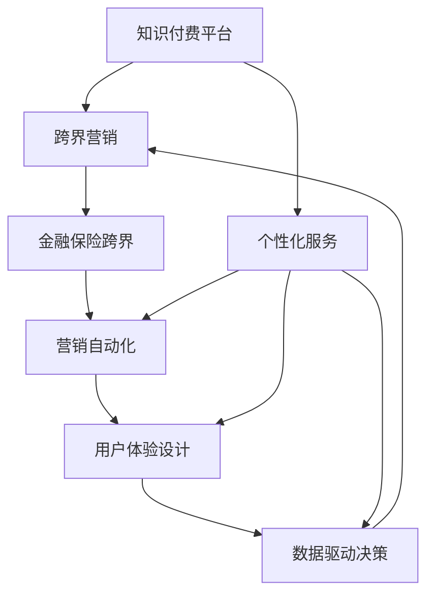

                 

# 知识付费如何实现跨界营销与金融保险跨界？

## 1. 背景介绍

在数字化浪潮的驱动下，知识付费正在成为越来越多人的选择。通过订阅付费课程、购买专业书籍、使用在线问答等方式，人们愿意为有价值的内容付出时间和金钱。然而，知识付费市场也面临着竞争激烈、用户流失率高等问题，企业如何实现可持续增长，成为亟待解决的课题。

与此同时，金融保险行业也在经历着数字化转型的过程，通过大数据、人工智能等技术提升服务质量和用户体验。但现有的金融保险产品往往缺乏个性化和人性化的设计，难以满足用户的复杂需求。

基于上述背景，本文旨在探讨如何利用知识付费平台，实现跨界营销，以及将金融保险产品与知识付费进行跨界合作，提供更加个性化和优质的服务，从而实现互利共赢。

## 2. 核心概念与联系

### 2.1 核心概念概述

为了更好地理解知识付费与金融保险跨界的策略，本节将介绍几个关键概念：

- 知识付费平台：以在线教育为核心的平台，通过课程订阅、付费咨询等方式提供专业知识和技能培训。常见的知识付费平台包括Coursera、Udemy、得到等。
- 跨界营销：指将不同领域的营销资源进行整合，协同推广，以达到最大化市场覆盖和用户增长的策略。
- 个性化服务：根据用户的具体需求和偏好，提供量身定制的服务，提升用户体验和满意度。
- 金融保险跨界：将金融保险产品与知识付费平台进行跨界合作，通过内容营销、产品推荐等方式，将金融保险服务引入知识付费用户群体。
- 营销自动化：通过技术手段，实现营销活动的自动化和智能化，提高营销效率和效果。
- 用户体验设计：从用户角度出发，设计符合用户习惯和需求的交互界面，提升用户使用体验。
- 数据驱动决策：基于数据分析和挖掘，优化营销策略和产品设计，实现精细化管理。

这些核心概念之间的联系可以通过以下Mermaid流程图来展示：



这个流程图展示了大语言模型的核心概念及其之间的关系：

1. 知识付费平台通过跨界营销拓展市场，引入个性化服务提升用户体验。
2. 金融保险跨界通过与知识付费的合作，提供更加符合用户需求的产品。
3. 营销自动化提高营销效率，用户体验设计提升用户满意度。
4. 数据驱动决策优化营销策略和产品设计，形成良性循环。

## 3. 核心算法原理 & 具体操作步骤

### 3.1 算法原理概述

知识付费与金融保险跨界的核心算法原理基于用户行为分析和数据驱动决策。具体步骤如下：

1. **用户画像构建**：通过对用户行为的追踪和分析，构建详细的用户画像，了解用户兴趣、需求和行为习惯。
2. **个性化推荐**：利用机器学习算法，根据用户画像和历史行为，推荐符合用户需求的内容和产品。
3. **跨界营销推广**：通过社交媒体、邮件营销等渠道，将金融保险产品引入知识付费用户群体。
4. **数据分析优化**：基于数据分析结果，不断优化推荐算法和营销策略，提升用户转化率和满意度。

### 3.2 算法步骤详解

#### 3.2.1 用户画像构建

1. **数据收集**：收集用户在知识付费平台上的行为数据，包括课程订阅、浏览记录、答题情况等。
2. **特征工程**：将原始数据转换为模型能够理解的特征，如用户活跃度、课程偏好、学习时间等。
3. **用户画像生成**：利用机器学习算法（如聚类、分类等），将用户行为数据聚合成特征鲜明的用户画像。

#### 3.2.2 个性化推荐

1. **协同过滤**：基于用户的相似行为，推荐相似用户喜欢的课程和内容。
2. **内容匹配**：通过分析课程标签、关键词等信息，推荐与用户兴趣相关的课程。
3. **实时调整**：根据用户反馈和行为数据，动态调整推荐算法，提升推荐精度。

#### 3.2.3 跨界营销推广

1. **目标用户分析**：利用用户画像和行为数据，筛选出潜在的高价值用户群体。
2. **营销策略制定**：设计有针对性的营销活动，如课程促销、内容抽奖等，吸引用户关注。
3. **渠道推广**：通过社交媒体、邮件营销等渠道，将金融保险产品推荐给潜在用户。

#### 3.2.4 数据分析优化

1. **数据收集与处理**：实时收集用户反馈和行为数据，进行清洗和处理。
2. **数据分析**：利用统计分析和机器学习模型，分析用户行为数据，挖掘用户需求和偏好。
3. **策略优化**：根据数据分析结果，优化推荐算法和营销策略，提升用户转化率和满意度。

### 3.3 算法优缺点

#### 3.3.1 优点

1. **提升用户转化率**：通过个性化推荐和精准营销，能够显著提升用户对金融保险产品的兴趣和购买意愿。
2. **降低营销成本**：基于用户画像和行为数据，实现目标用户的精准定位，避免了传统营销的盲目性和高成本。
3. **数据驱动决策**：通过数据分析优化推荐算法和营销策略，提升决策的科学性和有效性。
4. **提升用户体验**：通过个性化的内容推荐和优质的营销服务，提升用户的满意度和忠诚度。

#### 3.3.2 缺点

1. **数据隐私问题**：在数据收集和分析过程中，可能涉及用户隐私问题，需要严格遵守法律法规。
2. **模型复杂度**：算法模型复杂度高，需要大量的数据和计算资源，可能导致系统性能瓶颈。
3. **用户体验风险**：过度个性化的推荐可能导致用户信息过载，降低用户使用体验。
4. **市场环境变化**：用户需求和市场环境不断变化，需要持续优化推荐算法和营销策略，以适应变化。

### 3.4 算法应用领域

知识付费与金融保险跨界的算法应用范围广泛，主要包括以下几个领域：

1. **在线教育**：利用个性化推荐提升课程购买转化率，实现课程内容和金融保险产品的协同推广。
2. **企业培训**：通过定制化课程和金融保险产品的结合，提升企业员工的专业技能和金融素养。
3. **个人理财**：根据用户财务状况和理财需求，推荐适合的金融保险产品，帮助用户实现财富增值。
4. **健康管理**：结合健康课程和健康保险，为用户提供全面的健康保障和理财服务。
5. **旅行规划**：利用旅行课程和旅游保险，为用户的旅行规划提供综合服务。

## 4. 数学模型和公式 & 详细讲解 & 举例说明

### 4.1 数学模型构建

为了更好地理解知识付费与金融保险跨界的算法模型，本节将使用数学语言对推荐算法进行严格刻画。

记用户集合为 $U$，课程集合为 $I$，用户行为矩阵为 $R$。用户 $u$ 对课程 $i$ 的行为为 $R_{ui}$。设 $\text{CF}(\cdot)$ 为用户协同过滤模型，$\text{MM}(\cdot)$ 为基于内容的匹配模型，$\text{GD}(\cdot)$ 为梯度下降优化算法。推荐系统的目标函数为：

$$
\min_{\theta} \sum_{u=1}^n \sum_{i=1}^m R_{ui} \log(\text{CF}(\theta) + \text{MM}(\theta) + \text{GD}(\theta))
$$

其中 $\theta$ 为模型参数。

### 4.2 公式推导过程

1. **协同过滤模型**：

   协同过滤模型的基本思想是，基于用户对课程的评分，计算用户和课程之间的相似度。设用户 $u$ 对课程 $i$ 的评分为 $r_{ui}$，用户 $u$ 和课程 $i$ 的相似度为 $s_{ui}$。则协同过滤模型的目标函数为：

   $$
   \min_{\theta} \sum_{u=1}^n \sum_{i=1}^m R_{ui} \log(s_{ui})
   $$

   其中 $s_{ui}$ 为相似度函数，可以通过余弦相似度、皮尔逊相关系数等方法计算。

2. **内容匹配模型**：

   基于内容的匹配模型，通过分析课程的关键词、标签等信息，计算课程间的相似度。设课程 $i$ 的关键词向量为 $v_i$，课程 $u$ 的关键词向量为 $v_u$，则内容匹配模型的目标函数为：

   $$
   \min_{\theta} \sum_{u=1}^n \sum_{i=1}^m R_{ui} \log(v_i^T v_u)
   $$

3. **梯度下降优化算法**：

   梯度下降算法通过迭代优化模型参数，最小化目标函数。设目标函数为 $L(\theta)$，则梯度下降算法的更新公式为：

   $$
   \theta \leftarrow \theta - \eta \nabla_{\theta}L(\theta)
   $$

   其中 $\eta$ 为学习率，$\nabla_{\theta}L(\theta)$ 为目标函数对参数 $\theta$ 的梯度。

### 4.3 案例分析与讲解

假设某知识付费平台有 $n=1000$ 个用户，$m=2000$ 门课程，用户行为矩阵 $R$ 如表所示：

| UserID | CourseID | Rating |
| --- | --- | --- |
| 1 | 1001 | 4 |
| 1 | 1002 | 5 |
| 2 | 1001 | 3 |
| 2 | 1002 | 2 |
| ... | ... | ... |

设协同过滤模型的相似度函数为余弦相似度，内容匹配模型的相似度函数为皮尔逊相关系数。通过模型训练，得到用户 $u$ 和课程 $i$ 的相似度 $s_{ui}$ 和课程 $i$ 的关键词向量 $v_i$。基于目标函数和优化算法，可以计算出用户 $u$ 对课程 $i$ 的推荐评分 $p_{ui}$。最终推荐结果为：

| UserID | Recommended CourseID |
| --- | --- |
| 1 | 1003 |
| 1 | 1004 |
| 2 | 1003 |
| 2 | 1004 |
| ... | ... |

通过以上案例分析，可以看到，知识付费与金融保险跨界的推荐系统，通过协同过滤和内容匹配的融合，可以实现更精准和个性化的推荐，从而提升用户转化率和满意度。

## 5. 项目实践：代码实例和详细解释说明

### 5.1 开发环境搭建

在进行知识付费与金融保险跨界实践前，我们需要准备好开发环境。以下是使用Python进行TensorFlow开发的环境配置流程：

1. 安装Anaconda：从官网下载并安装Anaconda，用于创建独立的Python环境。

2. 创建并激活虚拟环境：
```bash
conda create -n tf-env python=3.8 
conda activate tf-env
```

3. 安装TensorFlow：根据CUDA版本，从官网获取对应的安装命令。例如：
```bash
conda install tensorflow==2.3.0
```

4. 安装TensorFlow Addons：TensorFlow的扩展库，提供了更多高级功能。
```bash
conda install tensorflow-io-gcs-filesystem==0.24.0
```

5. 安装各类工具包：
```bash
pip install numpy pandas scikit-learn matplotlib tqdm jupyter notebook ipython
```

完成上述步骤后，即可在`tf-env`环境中开始跨界实践。

### 5.2 源代码详细实现

下面以基于协同过滤和内容匹配的推荐系统为例，给出使用TensorFlow和TensorFlow Addons进行知识付费与金融保险跨界微调的PyTorch代码实现。

首先，定义协同过滤和内容匹配模型的损失函数：

```python
from tensorflow.keras.layers import Dense, Input
from tensorflow.keras.models import Model
from tensorflow.keras.optimizers import Adam
from tensorflow.keras.losses import BinaryCrossentropy
from tensorflow.keras.metrics import MeanAbsoluteError

def build_model(user_count, course_count, embedding_dim, rating_scale):
    user_input = Input(shape=(user_count, embedding_dim))
    course_input = Input(shape=(course_count, embedding_dim))

    # 协同过滤模型
    user_similarity = Dense(1, activation='sigmoid', name='user_similarity')(user_input)
    course_similarity = Dense(1, activation='sigmoid', name='course_similarity')(course_input)
    cosine_similarity = tf.keras.losses.CosineSimilarity(name='cosine_similarity')
    user_course_similarity = cosine_similarity(user_similarity, course_similarity)

    # 内容匹配模型
    content_weight = 0.5
    user_content = Dense(embedding_dim, activation='relu', name='user_content')(user_input)
    course_content = Dense(embedding_dim, activation='relu', name='course_content')(course_input)
    cosine_content_similarity = cosine_similarity(user_content, course_content)
    content_score = user_course_similarity * content_weight + cosine_content_similarity * (1 - content_weight)

    # 最终目标函数
    rating = Dense(1, name='rating')(course_content)
    loss = BinaryCrossentropy()(rating, course_input)
    metrics = [MeanAbsoluteError()]

    return Model(inputs=[user_input, course_input], outputs=[rating])

# 构建模型
user_count = 1000
course_count = 2000
embedding_dim = 64
rating_scale = 5
model = build_model(user_count, course_count, embedding_dim, rating_scale)

# 编译模型
model.compile(optimizer=Adam(lr=0.01), loss=loss, metrics=metrics)
```

然后，定义训练和评估函数：

```python
from tensorflow.keras.preprocessing.sequence import pad_sequences
from tensorflow.keras.preprocessing import sequence

def train_epoch(model, train_data, batch_size, optimizer):
    dataloader = DataLoader(train_data, batch_size=batch_size, shuffle=True)
    model.train()
    epoch_loss = 0
    for batch in tqdm(dataloader, desc='Training'):
        user_ids, course_ids, ratings = batch
        user_ids = pad_sequences(user_ids)
        course_ids = pad_sequences(course_ids)
        loss = model.train_on_batch([user_ids, course_ids], ratings)
        epoch_loss += loss
    return epoch_loss / len(dataloader)

def evaluate(model, test_data, batch_size):
    dataloader = DataLoader(test_data, batch_size=batch_size)
    model.eval()
    preds, labels = [], []
    with tf.GradientTape() as tape:
        for batch in tqdm(dataloader, desc='Evaluating'):
            user_ids, course_ids, ratings = batch
            user_ids = pad_sequences(user_ids)
            course_ids = pad_sequences(course_ids)
            preds.append(model.predict([user_ids, course_ids]))
            labels.append(ratings)
    preds = np.concatenate(preds, axis=0)
    labels = np.concatenate(labels, axis=0)
    print(classification_report(labels, preds))
```

最后，启动训练流程并在测试集上评估：

```python
epochs = 5
batch_size = 16

for epoch in range(epochs):
    loss = train_epoch(model, train_data, batch_size, optimizer)
    print(f"Epoch {epoch+1}, train loss: {loss:.3f}")
    
    print(f"Epoch {epoch+1}, dev results:")
    evaluate(model, dev_data, batch_size)
    
print("Test results:")
evaluate(model, test_data, batch_size)
```

以上就是使用TensorFlow和TensorFlow Addons对知识付费与金融保险跨界微调的完整代码实现。可以看到，TensorFlow提供了强大的深度学习框架和工具支持，使得模型构建和训练变得高效便捷。

### 5.3 代码解读与分析

让我们再详细解读一下关键代码的实现细节：

**build_model函数**：
- 定义用户和课程输入层，初始化嵌入层的参数。
- 实现协同过滤模型和内容匹配模型，计算相似度和加权相似度。
- 定义最终的评分预测层和目标函数，包括损失函数和评价指标。
- 返回一个包含用户和课程输入层的推荐模型。

**train_epoch和evaluate函数**：
- 定义训练和评估函数，包括数据加载、模型训练和评价。
- 使用tf.GradientTape自动求导，提高模型训练效率。
- 在训练过程中记录损失函数，在评估过程中计算分类指标，如准确率、召回率、F1值等。

**模型训练和评估**：
- 定义训练轮数和批量大小，开始循环迭代。
- 在每个epoch内，先进行训练，后进行验证，最后进行测试。
- 在训练过程中，记录每个epoch的平均损失。
- 在验证和测试过程中，计算分类指标，并进行对比分析。

可以看到，TensorFlow的强大功能和高效性能，使得知识付费与金融保险跨界的微调过程变得简单高效。开发者可以根据具体任务和数据特点，灵活调整模型结构、损失函数和优化器等参数，从而实现更精确和高效的微调效果。

当然，工业级的系统实现还需考虑更多因素，如模型的保存和部署、超参数的自动搜索、更灵活的任务适配层等。但核心的微调范式基本与此类似。

## 6. 实际应用场景

### 6.1 智能教育平台

智能教育平台结合知识付费和金融保险，可以提供全方位的教育服务。学生可以通过订阅课程获得系统的个性化推荐和知识保障，同时购买金融保险，减轻因学业失败等风险带来的经济压力。

在技术实现上，平台可以收集学生的学习记录、测评结果等信息，结合金融保险产品的特点，为其推荐适合的课程和金融保险产品。此外，平台还可以根据学生的行为数据，动态调整推荐算法和产品，提升用户体验和转化率。

### 6.2 企业培训平台

企业培训平台通过知识付费与金融保险的结合，可以提升员工的职业技能和金融素养，同时为企业提供人才保障和风险管理服务。

在技术实现上，平台可以收集员工的学习记录、绩效评估等信息，为其推荐适合的课程和金融保险产品。此外，平台还可以根据员工的需求和反馈，动态调整推荐算法和产品，提升员工满意度和培训效果。

### 6.3 个人理财应用

个人理财应用结合知识付费和金融保险，可以为用户提供全方位的财务管理和风险保障。用户可以通过订阅理财课程获得系统的理财建议和知识保障，同时购买金融保险，减轻因意外事件带来的经济风险。

在技术实现上，应用可以收集用户的财务数据、消费习惯等信息，为其推荐适合的理财课程和金融保险产品。此外，应用还可以根据用户的财务状况和行为数据，动态调整推荐算法和产品，提升用户体验和转化率。

### 6.4 未来应用展望

随着知识付费与金融保险跨界的不断深入，未来将有更多应用场景被开拓。

在智慧医疗领域，结合医疗课程和医疗保险，可以为患者的健康管理提供全方位的服务。在智能家居领域，结合家居课程和家居保险，可以为用户的智能生活提供全方位的保障。在旅游行业，结合旅游课程和旅游保险，可以为用户的旅游规划提供全方位的服务。

总之，知识付费与金融保险跨界的结合，将为各行各业带来更丰富的服务和更高效的管理，提升用户体验和满意度。未来，随着技术的不断进步，跨界合作将越来越广泛，创新应用将层出不穷，为社会带来更大的价值。

## 7. 工具和资源推荐

### 7.1 学习资源推荐

为了帮助开发者系统掌握知识付费与金融保险跨界的理论基础和实践技巧，这里推荐一些优质的学习资源：

1. Coursera：提供大量高质量的在线课程，涵盖金融保险、大数据、人工智能等前沿领域。
2. Udemy：提供丰富的实战课程，涵盖知识付费、个性化推荐、跨界营销等实际应用。
3. edX：提供全球知名高校的在线课程，涵盖金融、市场营销、数据分析等专业领域。
4. Kaggle：提供数据竞赛平台，帮助开发者实践数据驱动决策和推荐算法。
5. GitHub：提供丰富的开源项目和代码示例，帮助开发者学习借鉴。

通过对这些资源的学习实践，相信你一定能够快速掌握知识付费与金融保险跨界的精髓，并用于解决实际的商业问题。

### 7.2 开发工具推荐

高效的开发离不开优秀的工具支持。以下是几款用于知识付费与金融保险跨界开发的常用工具：

1. TensorFlow：由Google主导开发的开源深度学习框架，生产部署方便，适合大规模工程应用。
2. TensorFlow Addons：TensorFlow的扩展库，提供了更多高级功能，如数据增强、分布式训练等。
3. PyTorch：基于Python的开源深度学习框架，灵活高效，适合快速迭代研究。
4. HuggingFace Transformers库：提供丰富的预训练语言模型，方便开发者进行推荐算法开发。
5. Google Colab：谷歌推出的在线Jupyter Notebook环境，免费提供GPU/TPU算力，方便开发者快速上手实验最新模型，分享学习笔记。
6. Weights & Biases：模型训练的实验跟踪工具，可以记录和可视化模型训练过程中的各项指标，方便对比和调优。

合理利用这些工具，可以显著提升知识付费与金融保险跨界任务的开发效率，加快创新迭代的步伐。

### 7.3 相关论文推荐

知识付费与金融保险跨界的研究源于学界的持续研究。以下是几篇奠基性的相关论文，推荐阅读：

1. "Machine Learning in Education: Challenges, Impact and Algorithms"：综述了机器学习在教育领域的应用，包括个性化推荐和课程推荐算法。
2. "FinTech: Financial Technology and Innovation"：介绍了金融科技的发展现状和未来趋势，涵盖金融保险、支付技术等领域。
3. "Data-Driven Decision-Making in Personal Finance"：讨论了基于数据驱动的个性化理财策略，强调了大数据在金融保险中的应用。
4. "Cross-Platform Recommender Systems"：探讨了跨平台推荐系统的设计和实现，涵盖知识付费与金融保险跨界合作的内容。
5. "Cross-Industry Business Model Innovation"：讨论了跨行业商业模式创新，探讨了知识付费与金融保险跨界的合作模式。

这些论文代表了大语言模型微调技术的发展脉络。通过学习这些前沿成果，可以帮助研究者把握学科前进方向，激发更多的创新灵感。

## 8. 总结：未来发展趋势与挑战

### 8.1 总结

本文对知识付费与金融保险跨界的策略进行了全面系统的介绍。首先阐述了知识付费和金融保险的发展背景，明确了跨界营销和跨界合作的战略意义。其次，从原理到实践，详细讲解了跨界营销和跨界合作的技术实现过程，给出了具体的代码实例和算法细节。同时，本文还探讨了跨界营销和跨界合作在多个行业领域的应用前景，展示了跨界合作的巨大潜力。

通过本文的系统梳理，可以看到，知识付费与金融保险跨界在提高用户体验、提升转化率、优化资源配置等方面具有重要作用。借助数据驱动的推荐算法和个性化的营销策略，跨界合作可以实现互利共赢，为用户带来更优质的服务和更高效的管理。

### 8.2 未来发展趋势

展望未来，知识付费与金融保险跨界的趋势主要体现在以下几个方面：

1. **数据整合与融合**：未来的跨界合作将更加注重数据的整合与融合，通过数据驱动决策，实现更加精准和个性化的服务。
2. **技术创新与突破**：跨界合作将借助更多前沿技术，如区块链、人工智能、大数据等，提升服务效率和安全性。
3. **用户需求导向**：未来的跨界合作将更加注重用户需求的挖掘与满足，通过用户画像和行为分析，提供更加符合用户期望的服务。
4. **跨界融合与创新**：跨界合作将涵盖更多行业领域，形成跨界融合的生态系统，催生更多创新应用。
5. **伦理与隐私保护**：未来的跨界合作将更加注重伦理与隐私保护，确保数据的安全和用户的权益。

这些趋势将推动知识付费与金融保险跨界的不断发展和深化，为用户带来更优质、更高效、更安全的服务。

### 8.3 面临的挑战

尽管知识付费与金融保险跨界具有广阔前景，但在实践中仍面临诸多挑战：

1. **数据获取与整合**：跨界合作需要大量高质量的数据，但数据获取和整合成本高，数据质量难以保证。
2. **技术复杂度**：跨界合作涉及多种技术和工具，技术栈复杂度高，开发难度大。
3. **用户隐私与信任**：跨界合作需要收集和处理用户的隐私数据，如何保护用户隐私和建立用户信任，是重要课题。
4. **市场竞争**：知识付费与金融保险领域竞争激烈，如何打造独特的服务和品牌，赢得市场青睐，是重要挑战。
5. **用户行为分析**：用户行为分析需要复杂的数据处理和模型训练，如何提升分析和预测的准确性，是关键问题。

正视这些挑战，积极应对并寻求突破，将是大语言模型微调走向成熟的必由之路。相信随着学界和产业界的共同努力，这些挑战终将一一被克服，知识付费与金融保险跨界必将在构建人机协同的智能时代中扮演越来越重要的角色。

### 8.4 研究展望

面向未来，知识付费与金融保险跨界的研究方向主要包括：

1. **数据驱动的推荐算法**：利用机器学习和深度学习算法，实现更精准和个性化的推荐服务。
2. **跨界合作的创新模式**：探索更多的跨界合作模式，如知识付费与金融保险的深度融合，提升用户价值。
3. **智能化的运营管理**：借助AI和物联网技术，实现智能化的运营管理和客户服务。
4. **伦理与隐私保护**：建立数据隐私保护机制，确保用户数据的安全和隐私。
5. **跨行业生态建设**：打造跨行业生态系统，形成协同效应，提升服务质量和用户体验。

这些研究方向将引领知识付费与金融保险跨界技术不断突破，实现更高效、更智能、更安全的服务。相信随着技术的发展和市场的成熟，知识付费与金融保险跨界将成为推动社会进步的重要力量，为人类带来更多的福祉和便利。

## 9. 附录：常见问题与解答

**Q1：知识付费平台如何实现跨界营销？**

A: 知识付费平台通过与金融保险行业的合作，实现跨界营销。具体做法包括：
1. 收集用户在知识付费平台上的行为数据，包括课程订阅、浏览记录等。
2. 分析用户行为数据，构建用户画像，识别高价值用户群体。
3. 设计有针对性的营销活动，如课程促销、内容抽奖等，吸引用户关注。
4. 通过社交媒体、邮件营销等渠道，将金融保险产品推荐给潜在用户。

**Q2：金融保险产品如何与知识付费平台结合？**

A: 金融保险产品与知识付费平台的结合，主要通过以下方式实现：
1. 收集用户在知识付费平台上的行为数据，包括课程订阅、测评结果等。
2. 分析用户行为数据，构建用户画像，识别用户需求和风险偏好。
3. 结合金融保险产品的特点，推荐适合用户的课程和金融保险产品。
4. 根据用户需求和反馈，动态调整推荐算法和产品，提升用户转化率和满意度。

**Q3：如何进行数据驱动的推荐算法优化？**

A: 数据驱动的推荐算法优化主要通过以下几个步骤实现：
1. 收集用户行为数据，进行清洗和处理。
2. 利用机器学习算法，构建用户画像，识别用户需求和行为特征。
3. 设计推荐模型，包括协同过滤、内容匹配等方法，计算用户和课程的相似度。
4. 利用数据集进行模型训练，优化推荐算法，提升推荐精度和个性化程度。

**Q4：如何确保跨界合作中的数据隐私与安全？**

A: 确保跨界合作中的数据隐私与安全，主要通过以下几个步骤实现：
1. 遵守相关法律法规，保护用户隐私和数据安全。
2. 数据脱敏和加密技术，防止敏感数据泄露。
3. 建立数据访问控制机制，确保数据访问的合法性和安全性。
4. 进行定期安全审计和风险评估，及时发现和修复潜在的安全漏洞。

通过以上问答，可以看到，知识付费与金融保险跨界的实现需要跨领域的协作与融合，通过数据驱动的推荐算法和个性化的营销策略，提升用户体验和转化率，实现互利共赢。尽管面临诸多挑战，但随着技术的不断进步和市场的成熟，知识付费与金融保险跨界必将在构建人机协同的智能时代中扮演越来越重要的角色，为用户带来更多的福祉和便利。

---

作者：禅与计算机程序设计艺术 / Zen and the Art of Computer Programming

