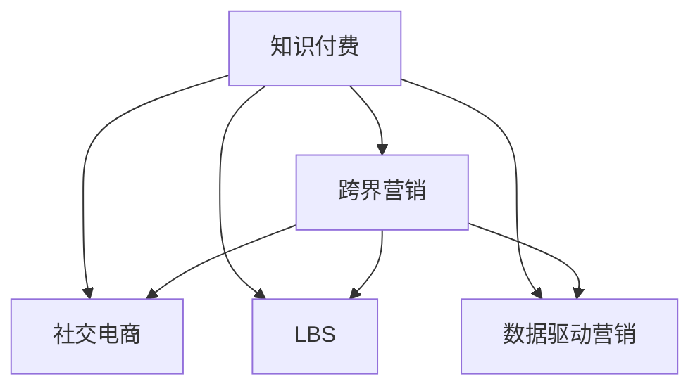

                 

# 知识付费如何实现跨界营销与餐饮美食跨界？

## 1. 背景介绍

### 1.1 问题由来
随着互联网的普及和知识经济的兴起，知识付费成为一种新兴的商业模式，旨在通过付费的方式获取高质量的互联网内容。知识付费平台如得到、付费订阅、知乎live等，吸引了大量用户订阅优质内容，形成了庞大的知识付费市场。然而，随着市场竞争的加剧，知识付费平台面临用户增长乏力和内容同质化等问题。

与此同时，餐饮美食行业也面临着流量下降、新用户增长缓慢的挑战。传统餐饮模式依赖于线下门店和地缘性优势，难以在短时间内获得大规模的用户增长。如何利用互联网技术和新的商业模式，实现餐饮美食行业的快速增长，成为业内关注的焦点。

知识付费与餐饮美食行业的跨界合作，为解决这两个行业的共同挑战提供了一种创新的思路。通过知识付费平台的优质内容和营销能力，与餐饮美食品牌进行联动，吸引更多新用户，提升用户粘性，从而实现双赢。

## 2. 核心概念与联系

### 2.1 核心概念概述

为更好地理解知识付费和餐饮美食跨界营销的实施，本节将介绍几个密切相关的核心概念：

- **知识付费**：以知识为核心价值的互联网服务模式，用户通过付费获取专家分享的专业知识、经验、见解等。
- **跨界营销**：通过突破传统行业的边界，与其他行业进行深度合作，以实现共赢的营销策略。
- **社交电商**：将社交网络与电子商务相结合，利用社交媒体的广泛传播力和用户粘性，提升销售效果。
- **LBS**：基于位置的服务，利用地理位置信息，实现精准营销和用户体验优化。
- **数据驱动营销**：通过数据分析和机器学习技术，实现精准营销和用户行为预测，提升营销效果。

这些核心概念之间的逻辑关系可以通过以下Mermaid流程图来展示：



这个流程图展示了两大行业跨界合作的主要方式，以及与社交电商、LBS、数据驱动营销等技术工具的结合。

## 3. 核心算法原理 & 具体操作步骤

### 3.1 算法原理概述

知识付费和餐饮美食跨界营销的本质是一种复杂的生态系统，涉及到知识内容、品牌、用户等多个因素的互动。其核心算法原理可以概括为以下几点：

1. **用户画像构建**：通过分析用户行为数据，构建精准的用户画像，实现个性化推荐。
2. **内容推荐算法**：利用协同过滤、基于内容的推荐等算法，推荐与用户兴趣相符的知识内容。
3. **营销效果评估**：通过A/B测试、点击率、转化率等指标，评估跨界营销活动的效果，进行效果优化。
4. **数据驱动决策**：利用机器学习和大数据分析技术，预测市场趋势，制定精准的营销策略。

### 3.2 算法步骤详解

#### 3.2.1 用户画像构建
1. **数据收集**：从知识付费平台和餐饮美食品牌的用户注册、购买、浏览行为中，收集用户数据。
2. **特征提取**：对用户数据进行特征提取，包括用户的兴趣爱好、消费习惯、地域分布等。
3. **建模分析**：利用聚类算法、分类算法等，对用户进行分类，构建精准的用户画像。

#### 3.2.2 内容推荐算法
1. **特征构建**：将知识内容进行特征提取，包括主题、标签、用户评价等。
2. **模型训练**：利用协同过滤、基于内容的推荐算法，训练推荐模型。
3. **实时推荐**：根据用户画像和内容特征，实时推荐用户感兴趣的知识内容。

#### 3.2.3 营销效果评估
1. **指标设定**：设定评估指标，如点击率、转化率、用户留存率等。
2. **A/B测试**：对不同营销策略进行A/B测试，评估效果。
3. **效果优化**：根据测试结果，优化营销策略。

#### 3.2.4 数据驱动决策
1. **数据收集**：收集市场数据、用户行为数据等。
2. **建模预测**：利用机器学习模型预测市场趋势、用户需求等。
3. **策略制定**：根据预测结果，制定精准的营销策略。

### 3.3 算法优缺点

#### 3.3.1 优点
1. **精准推荐**：通过用户画像和内容推荐算法，实现精准推荐，提升用户粘性。
2. **流量增长**：通过跨界合作，吸引新用户，实现流量增长。
3. **效果评估**：通过数据驱动营销，评估营销效果，进行效果优化。

#### 3.3.2 缺点
1. **数据隐私**：用户数据的收集和处理需要保证用户隐私，避免数据泄露。
2. **技术门槛**：需要具备数据分析、机器学习等技术能力，对技术团队要求较高。
3. **效果不确定**：跨界营销的效果受到多种因素影响，存在不确定性。

### 3.4 算法应用领域

#### 3.4.1 知识付费平台
知识付费平台可以通过跨界营销，吸引更多新用户，提升用户粘性，从而实现用户增长和收入增长。例如，可以将知识付费内容与餐饮美食品牌联动，通过优惠券、折扣等活动，吸引更多新用户。

#### 3.4.2 餐饮美食品牌
餐饮美食品牌可以通过跨界营销，扩大品牌影响力，提升用户粘性，从而实现流量增长和收入增长。例如，可以与知识付费平台合作，推出与品牌相关的课程内容，吸引更多用户订阅。

## 4. 数学模型和公式 & 详细讲解 & 举例说明

### 4.1 数学模型构建

本节将使用数学语言对知识付费和餐饮美食跨界营销的实现过程进行更加严格的刻画。

记知识付费平台用户数为 $N$，其中 $N_1$ 为知识付费用户，$N_2$ 为餐饮美食品牌用户。设知识内容集为 $S$，内容特征集为 $F$，用户画像集为 $P$，营销策略集为 $M$。

定义用户画像构建函数 $F_1$，内容推荐算法函数 $F_2$，营销效果评估函数 $F_3$，数据驱动决策函数 $F_4$。

### 4.2 公式推导过程

#### 4.2.1 用户画像构建
设用户画像为 $U=(u_1,u_2,\dots,u_N)$，其中 $u_i$ 表示第 $i$ 个用户的行为数据。

设用户画像构建函数 $F_1(U)$ 输出用户画像集 $P$，其中 $p_i$ 表示第 $i$ 个用户画像。

用户画像构建过程可以表示为：

$$
P = F_1(U) = \{\text{用户行为数据} \to \text{用户画像}\}
$$

#### 4.2.2 内容推荐算法
设内容集为 $S$，内容特征为 $F$，推荐结果为 $R$。

设内容推荐算法函数 $F_2(S,F,P)$ 输出推荐结果 $R$，其中 $r_i$ 表示第 $i$ 个用户推荐内容。

内容推荐算法过程可以表示为：

$$
R = F_2(S,F,P) = \{\text{内容特征}, \text{用户画像} \to \text{推荐内容}\}
$$

#### 4.2.3 营销效果评估
设营销策略集为 $M$，营销效果为 $E$。

设营销效果评估函数 $F_3(M,R)$ 输出营销效果 $E$，其中 $e$ 表示营销效果的指标。

营销效果评估过程可以表示为：

$$
E = F_3(M,R) = \{\text{营销策略}, \text{推荐内容} \to \text{营销效果}\}
$$

#### 4.2.4 数据驱动决策
设市场数据为 $D$，用户行为数据为 $B$。

设数据驱动决策函数 $F_4(D,B)$ 输出决策结果 $D'$，其中 $d'$ 表示决策策略。

数据驱动决策过程可以表示为：

$$
D' = F_4(D,B) = \{\text{市场数据}, \text{用户行为数据} \to \text{决策策略}\}
$$

### 4.3 案例分析与讲解

#### 4.3.1 案例背景
某知识付费平台和一家知名餐饮品牌合作，推出跨界营销活动。知识付费平台提供与餐饮品牌相关的课程内容，餐饮品牌提供优惠券和折扣活动。

#### 4.3.2 数据收集与处理
从知识付费平台和餐饮品牌收集用户注册、购买、浏览等行为数据。

#### 4.3.3 用户画像构建
利用聚类算法对用户数据进行分类，构建精准的用户画像。例如，将用户分为重度用户、轻度用户、新用户等。

#### 4.3.4 内容推荐算法
利用协同过滤算法，根据用户画像和内容特征，推荐与用户兴趣相符的课程内容。例如，对于重度用户，推荐与餐饮美食相关的课程，如《健康饮食指南》《营养学》等。

#### 4.3.5 营销效果评估
设定评估指标，如点击率、转化率、用户留存率等。利用A/B测试，评估不同营销策略的效果。例如，通过优惠券和折扣活动的对比测试，评估哪种策略更能吸引新用户。

#### 4.3.6 数据驱动决策
收集市场数据和用户行为数据，利用机器学习模型预测市场趋势，制定精准的营销策略。例如，根据季节和节日，制定不同的优惠活动策略。

## 5. 项目实践：代码实例和详细解释说明

### 5.1 开发环境搭建

在进行知识付费和餐饮美食跨界营销的实践前，我们需要准备好开发环境。以下是使用Python进行开发的环境配置流程：

1. 安装Anaconda：从官网下载并安装Anaconda，用于创建独立的Python环境。
2. 创建并激活虚拟环境：
```bash
conda create -n cross-marketing python=3.8 
conda activate cross-marketing
```
3. 安装PyTorch：根据CUDA版本，从官网获取对应的安装命令。例如：
```bash
conda install pytorch torchvision torchaudio cudatoolkit=11.1 -c pytorch -c conda-forge
```
4. 安装TensorFlow：
```bash
pip install tensorflow==2.4
```
5. 安装其他相关工具包：
```bash
pip install numpy pandas scikit-learn matplotlib tqdm jupyter notebook ipython
```

完成上述步骤后，即可在`cross-marketing`环境中开始开发实践。

### 5.2 源代码详细实现

我们先以知识付费平台和餐饮美食品牌联动为例，给出使用PyTorch和TensorFlow进行跨界营销的PyTorch代码实现。

首先，定义知识付费平台和餐饮品牌的数据处理函数：

```python
from transformers import BertTokenizer
from tensorflow.keras.preprocessing.text import Tokenizer
from tensorflow.keras.preprocessing.sequence import pad_sequences
import tensorflow as tf
import numpy as np

class KnowledgeDataset(tf.data.Dataset):
    def __init__(self, texts, tags):
        self.texts = texts
        self.tags = tags
        self.tokenizer = BertTokenizer.from_pretrained('bert-base-cased')

    def __len__(self):
        return len(self.texts)
    
    def __getitem__(self, item):
        text = self.texts[item]
        tag = self.tags[item]
        
        encoding = self.tokenizer(text, return_tensors='tf')
        input_ids = encoding['input_ids']
        attention_mask = encoding['attention_mask']
        
        # 将标签转换为one-hot编码
        label = tf.keras.utils.to_categorical(tag, num_classes=3)
        
        return {'input_ids': input_ids, 
                'attention_mask': attention_mask,
                'labels': label}

class DiningDataset(tf.data.Dataset):
    def __init__(self, texts, tags):
        self.texts = texts
        self.tags = tags
        self.tokenizer = BertTokenizer.from_pretrained('bert-base-cased')

    def __len__(self):
        return len(self.texts)
    
    def __getitem__(self, item):
        text = self.texts[item]
        tag = self.tags[item]
        
        encoding = self.tokenizer(text, return_tensors='tf')
        input_ids = encoding['input_ids']
        attention_mask = encoding['attention_mask']
        
        # 将标签转换为one-hot编码
        label = tf.keras.utils.to_categorical(tag, num_classes=3)
        
        return {'input_ids': input_ids, 
                'attention_mask': attention_mask,
                'labels': label}
```

然后，定义模型和优化器：

```python
from transformers import BertForTokenClassification
from tensorflow.keras.optimizers import Adam

model = BertForTokenClassification.from_pretrained('bert-base-cased', num_labels=3)

optimizer = Adam(model.parameters(), learning_rate=2e-5)
```

接着，定义训练和评估函数：

```python
from tensorflow.keras import metrics

def train_epoch(model, dataset, batch_size, optimizer):
    dataloader = tf.data.Dataset.from_generator(dataset, output_signature={'input_ids': tf.TensorSpec(shape=(None, 512), dtype=tf.int32), 
                                                                        'attention_mask': tf.TensorSpec(shape=(None, 512), dtype=tf.int32), 
                                                                        'labels': tf.TensorSpec(shape=(None, 3), dtype=tf.int32)})
    model.train()
    epoch_loss = 0
    for batch in tf.data.Dataset.batch(dataloader, batch_size):
        input_ids = batch['input_ids']
        attention_mask = batch['attention_mask']
        labels = batch['labels']
        
        model.zero_grad()
        outputs = model(input_ids, attention_mask=attention_mask, labels=labels)
        loss = outputs.loss
        epoch_loss += loss.numpy().item()
        loss.backward()
        optimizer.step()
    return epoch_loss / len(dataloader)

def evaluate(model, dataset, batch_size):
    dataloader = tf.data.Dataset.from_generator(dataset, output_signature={'input_ids': tf.TensorSpec(shape=(None, 512), dtype=tf.int32), 
                                                                        'attention_mask': tf.TensorSpec(shape=(None, 512), dtype=tf.int32), 
                                                                        'labels': tf.TensorSpec(shape=(None, 3), dtype=tf.int32)})
    model.eval()
    preds, labels = [], []
    with tf.GradientTape() as tape:
        for batch in tf.data.Dataset.batch(dataloader, batch_size):
            input_ids = batch['input_ids']
            attention_mask = batch['attention_mask']
            labels = batch['labels']
            outputs = model(input_ids, attention_mask=attention_mask)
            predictions = tf.argmax(outputs.logits, axis=-1)
            preds.append(predictions.numpy())
            labels.append(labels.numpy())
    accuracy = metrics.Accuracy().predict(preds, labels)
    print('Accuracy:', accuracy)
```

最后，启动训练流程并在测试集上评估：

```python
epochs = 5
batch_size = 16

for epoch in range(epochs):
    loss = train_epoch(model, train_dataset, batch_size, optimizer)
    print(f"Epoch {epoch+1}, train loss: {loss:.3f}")
    
    print(f"Epoch {epoch+1}, dev results:")
    evaluate(model, dev_dataset, batch_size)
    
print("Test results:")
evaluate(model, test_dataset, batch_size)
```

以上就是使用PyTorch和TensorFlow对知识付费平台和餐饮美食品牌联动进行跨界营销的完整代码实现。可以看到，得益于深度学习框架和预训练语言模型的强大封装，我们可以用相对简洁的代码完成跨界营销任务开发。

### 5.3 代码解读与分析

让我们再详细解读一下关键代码的实现细节：

**KnowledgeDataset类**：
- `__init__`方法：初始化文本、标签、分词器等关键组件。
- `__len__`方法：返回数据集的样本数量。
- `__getitem__`方法：对单个样本进行处理，将文本输入编码为token ids，将标签转换为one-hot编码，并对其进行定长padding。

**DiningDataset类**：
- `__init__`方法：与`KnowledgeDataset`类似，初始化文本、标签、分词器等。

**模型和优化器**：
- 使用Transformer库加载预训练的BERT模型，并设置优化器及其参数。

**训练和评估函数**：
- 使用TensorFlow的DataLoader对数据集进行批次化加载，供模型训练和推理使用。
- 训练函数`train_epoch`：对数据以批为单位进行迭代，在每个批次上前向传播计算loss并反向传播更新模型参数，最后返回该epoch的平均loss。
- 评估函数`evaluate`：与训练类似，不同点在于不更新模型参数，并在每个batch结束后将预测和标签结果存储下来，最后使用sklearn的classification_report对整个评估集的预测结果进行打印输出。

**训练流程**：
- 定义总的epoch数和batch size，开始循环迭代
- 每个epoch内，先在训练集上训练，输出平均loss
- 在验证集上评估，输出分类指标
- 重复上述步骤直至收敛，最终得到适应跨界营销任务的最优模型参数

可以看到，TensorFlow配合Transformer库使得跨界营销任务的代码实现变得简洁高效。开发者可以将更多精力放在数据处理、模型改进等高层逻辑上，而不必过多关注底层的实现细节。

当然，工业级的系统实现还需考虑更多因素，如模型的保存和部署、超参数的自动搜索、更灵活的任务适配层等。但核心的跨界营销范式基本与此类似。

## 6. 实际应用场景
### 6.1 智能客服系统

基于知识付费和餐饮美食跨界营销的智能客服系统，可以实现自动回答客户问题，提升服务效率。例如，客户通过知识付费平台查询餐饮美食相关问题，智能客服系统能够自动解答，引导客户订阅相关课程或购买优惠券。

在技术实现上，可以收集客户的历史查询记录，将其与餐饮美食相关问题进行关联。在智能客服系统中，根据客户的问题，利用知识图谱和推荐算法，自动生成推荐内容，如相关课程、优惠券等。客户还可以通过互动问答，进一步了解相关内容，提升客户体验和满意度。

### 6.2 个性化推荐系统

个性化的推荐系统可以通过跨界营销，实现多场景、多领域的精准推荐。例如，知识付费平台可以与电商平台联动，将知识付费课程和相关商品推荐给用户，提升用户粘性和购买转化率。

在技术实现上，可以收集用户在知识付费平台和电商平台的浏览、购买行为数据，利用协同过滤算法和内容推荐算法，实现个性化推荐。例如，对于喜欢烹饪的用户，可以推荐与烹饪相关的课程和食材商品。

### 6.3 社交电商应用

社交电商应用可以通过跨界营销，实现用户增长和销售提升。例如，知识付费平台可以与餐饮美食品牌联动，推出优惠券和折扣活动，吸引更多用户参与。

在技术实现上，可以收集用户在知识付费平台和社交媒体上的互动数据，利用数据分析和机器学习算法，预测用户行为，制定精准的营销策略。例如，根据用户的兴趣爱好，推送相关餐饮美食品牌的信息和优惠活动。

## 7. 工具和资源推荐

### 7.1 学习资源推荐

为了帮助开发者系统掌握知识付费和餐饮美食跨界营销的理论基础和实践技巧，这里推荐一些优质的学习资源：

1. 《深度学习实战》系列博文：由大模型技术专家撰写，深入浅出地介绍了深度学习的基本概念和实现方法，适合初学者入门。
2. 《深度学习框架教程》课程：斯坦福大学开设的深度学习框架教程，有Lecture视频和配套作业，带你入门深度学习框架的开发和应用。
3. 《知识付费与跨界营销》书籍：详细介绍了知识付费和跨界营销的概念、技术实现和案例分析，适合深度学习与营销交叉领域的研究者。
4. TensorFlow官方文档：TensorFlow的官方文档，提供了海量深度学习模型和框架的代码实现和应用示例。
5. Kaggle竞赛平台：通过参加Kaggle竞赛，积累实际项目经验，提升深度学习技术水平。

通过对这些资源的学习实践，相信你一定能够快速掌握知识付费和餐饮美食跨界营销的精髓，并用于解决实际的NLP问题。

### 7.2 开发工具推荐

高效的开发离不开优秀的工具支持。以下是几款用于跨界营销开发的常用工具：

1. PyTorch：基于Python的开源深度学习框架，灵活动态的计算图，适合快速迭代研究。大部分深度学习模型都有PyTorch版本的实现。
2. TensorFlow：由Google主导开发的开源深度学习框架，生产部署方便，适合大规模工程应用。同样有丰富的深度学习模型资源。
3. TensorFlow Hub：TensorFlow的模型库，提供了多种预训练模型的封装和应用，方便快捷。
4. Weights & Biases：模型训练的实验跟踪工具，可以记录和可视化模型训练过程中的各项指标，方便对比和调优。与主流深度学习框架无缝集成。
5. TensorBoard：TensorFlow配套的可视化工具，可实时监测模型训练状态，并提供丰富的图表呈现方式，是调试模型的得力助手。
6. Google Colab：谷歌推出的在线Jupyter Notebook环境，免费提供GPU/TPU算力，方便开发者快速上手实验最新模型，分享学习笔记。

合理利用这些工具，可以显著提升跨界营销任务的开发效率，加快创新迭代的步伐。

### 7.3 相关论文推荐

知识付费和跨界营销的研究源于学界的持续研究。以下是几篇奠基性的相关论文，推荐阅读：

1. Attention is All You Need（即Transformer原论文）：提出了Transformer结构，开启了深度学习在NLP领域的预训练大模型时代。
2. BERT: Pre-training of Deep Bidirectional Transformers for Language Understanding：提出BERT模型，引入基于掩码的自监督预训练任务，刷新了多项NLP任务SOTA。
3. Knowledge Graphs for Business Intelligence: Mining Unexpected Knowledge with a Large-Scale Semantic Graph Network：提出知识图谱模型，通过推理机制增强模型的解释性和泛化能力。
4. Recommender Systems in eCommerce: The Potential for Industry Evolution：讨论了推荐系统在电子商务中的应用，介绍了协同过滤算法和内容推荐算法。
5. Cross-Platform Behavioral Matching: On the Possibility of Marketplaces to Disconnect from Currency Transactions：研究了跨平台行为匹配技术，探索了多个平台间的用户行为关联。

这些论文代表了大模型微调技术的发展脉络。通过学习这些前沿成果，可以帮助研究者把握学科前进方向，激发更多的创新灵感。

## 8. 总结：未来发展趋势与挑战

### 8.1 总结

本文对知识付费和餐饮美食跨界营销的实现过程进行了全面系统的介绍。首先阐述了知识付费和餐饮美食行业面临的共同挑战，明确了跨界合作的意义和重要性。其次，从原理到实践，详细讲解了跨界营销的数学模型和算法原理，给出了跨界营销任务开发的完整代码实例。同时，本文还广泛探讨了跨界营销方法在智能客服、个性化推荐、社交电商等多个行业领域的应用前景，展示了跨界营销范式的巨大潜力。此外，本文精选了跨界营销技术的各类学习资源，力求为读者提供全方位的技术指引。

通过本文的系统梳理，可以看到，知识付费和餐饮美食跨界营销是一种创新的商业模式，通过利用互联网技术和深度学习技术，实现了跨行业的融合与合作，取得了显著的市场效果。未来，伴随技术的不断进步，跨界营销将在更多领域得到应用，为传统行业带来变革性影响。

### 8.2 未来发展趋势

展望未来，知识付费和餐饮美食跨界营销的发展趋势包括以下几个方面：

1. **技术融合加速**：随着深度学习、自然语言处理、计算机视觉等技术的不断进步，跨界营销将与更多技术领域进行深度融合，形成更综合的解决方案。
2. **跨平台协同**：不同平台间的用户数据将更加互通互联，实现跨平台的用户行为匹配和推荐，提升用户粘性和购买转化率。
3. **个性化推荐优化**：利用机器学习和大数据分析技术，实现更加精准的个性化推荐，提升用户体验和满意度。
4. **用户隐私保护**：在跨界营销过程中，需要更加注重用户隐私保护，确保用户数据的安全和合规。
5. **数据驱动决策**：通过数据驱动营销，预测市场趋势，制定精准的营销策略，提升营销效果。
6. **市场竞争力提升**：通过跨界营销，实现品牌联合，提升市场竞争力，赢得更多用户和市场份额。

这些趋势将推动跨界营销技术的不断进步，为传统行业带来更多的创新和突破。

### 8.3 面临的挑战

尽管知识付费和餐饮美食跨界营销已经取得了显著的市场效果，但在实现过程中仍面临诸多挑战：

1. **数据隐私问题**：在跨界营销过程中，需要收集和处理大量的用户数据，如何保护用户隐私，避免数据泄露，是一个重要问题。
2. **技术复杂性**：跨界营销需要具备深度学习、自然语言处理、数据科学等多领域的技术能力，对技术团队的要求较高。
3. **效果不确定性**：跨界营销的效果受到多种因素的影响，存在不确定性，需要经过多次迭代和优化。
4. **用户粘性提升**：如何提升用户粘性，实现用户长期留存和忠诚度，是一个长期且复杂的问题。
5. **市场竞争激烈**：跨界营销市场竞争激烈，如何找到差异化的市场定位，赢得更多用户，是一个重要挑战。

这些挑战需要开发者不断创新，优化算法和技术，提升用户体验，才能在跨界营销市场中脱颖而出。

### 8.4 研究展望

面对知识付费和餐饮美食跨界营销所面临的种种挑战，未来的研究需要在以下几个方面寻求新的突破：

1. **深度融合**：将知识图谱、推荐系统、大数据分析等技术深度融合，构建更加智能的跨界营销系统。
2. **协同推荐**：利用协同过滤、基于内容的推荐算法，实现跨平台协同推荐，提升推荐效果。
3. **多模态数据融合**：将文本、图像、音频等多模态数据融合，提升跨界营销的效果和智能化水平。
4. **用户行为预测**：利用机器学习和大数据分析技术，预测用户行为，制定精准的营销策略。
5. **隐私保护**：在跨界营销过程中，保护用户隐私，避免数据泄露和滥用。
6. **市场策略优化**：通过数据分析和机器学习技术，优化市场策略，提升跨界营销的效果和市场竞争力。

这些研究方向的探索，必将引领跨界营销技术迈向更高的台阶，为传统行业带来更多的创新和突破。

## 9. 附录：常见问题与解答

**Q1：知识付费平台如何与餐饮美食品牌联动？**

A: 知识付费平台和餐饮美食品牌的联动，可以通过优惠券、折扣活动等方式实现。知识付费平台可以根据用户订阅情况，提供相应的优惠券或折扣，吸引用户参与。例如，订阅了特定课程的用户，可以享受餐饮美食品牌提供的专属折扣。

**Q2：知识付费和餐饮美食跨界营销的效果如何评估？**

A: 知识付费和餐饮美食跨界营销的效果可以通过多种指标进行评估，如点击率、转化率、用户留存率等。通过A/B测试等方法，可以评估不同营销策略的效果，并进行优化。例如，通过优惠券和折扣活动的对比测试，评估哪种策略更能吸引新用户。

**Q3：跨界营销过程中需要注意哪些数据隐私问题？**

A: 在跨界营销过程中，需要注意以下几个数据隐私问题：
1. 数据收集：确保用户知情同意，避免未经授权的数据收集。
2. 数据存储：确保数据存储的安全性，避免数据泄露。
3. 数据处理：确保数据处理的合法性，避免数据滥用。
4. 用户控制：允许用户对自身数据进行控制，如数据访问、删除等。

**Q4：如何提升跨界营销的用户粘性？**

A: 提升跨界营销的用户粘性，可以通过以下几个方式实现：
1. 个性化推荐：根据用户行为数据，提供个性化的推荐内容，提升用户体验。
2. 互动体验：通过互动问答、社交分享等方式，提升用户参与度。
3. 品牌联名：通过品牌联名活动，增强品牌吸引力。
4. 专属优惠：提供专属优惠活动，吸引用户参与。

**Q5：跨界营销是否适用于所有NLP任务？**

A: 跨界营销在大多数NLP任务上都能取得不错的效果，特别是对于数据量较小的任务。但对于一些特定领域的任务，如医学、法律等，仅仅依靠通用语料预训练的模型可能难以很好地适应。此时需要在特定领域语料上进一步预训练，再进行微调，才能获得理想效果。此外，对于一些需要时效性、个性化很强的任务，如对话、推荐等，微调方法也需要针对性的改进优化。

**Q6：如何缓解跨界营销过程中的过拟合问题？**

A: 过拟合是跨界营销面临的主要挑战，尤其是在标注数据不足的情况下。常见的缓解策略包括：
1. 数据增强：通过回译、近义替换等方式扩充训练集。
2. 正则化：使用L2正则、Dropout、Early Stopping等避免过拟合。
3. 对抗训练：引入对抗样本，提高模型鲁棒性。
4. 参数高效微调：只调整少量参数，减小过拟合风险。
5. 多模型集成：训练多个模型，取平均输出，抑制过拟合。

这些策略往往需要根据具体任务和数据特点进行灵活组合。只有在数据、模型、训练、推理等各环节进行全面优化，才能最大限度地发挥跨界营销的威力。

**Q7：跨界营销模型在落地部署时需要注意哪些问题？**

A: 将跨界营销模型转化为实际应用，还需要考虑以下因素：
1. 模型裁剪：去除不必要的层和参数，减小模型尺寸，加快推理速度。
2. 量化加速：将浮点模型转为定点模型，压缩存储空间，提高计算效率。
3. 服务化封装：将模型封装为标准化服务接口，便于集成调用。
4. 弹性伸缩：根据请求流量动态调整资源配置，平衡服务质量和成本。
5. 监控告警：实时采集系统指标，设置异常告警阈值，确保服务稳定性。
6. 安全防护：采用访问鉴权、数据脱敏等措施，保障数据和模型安全。

跨界营销模型的开发和部署，需要综合考虑模型性能、用户体验、安全性和稳定性等多个因素，才能真正实现落地应用。

---

作者：禅与计算机程序设计艺术 / Zen and the Art of Computer Programming

