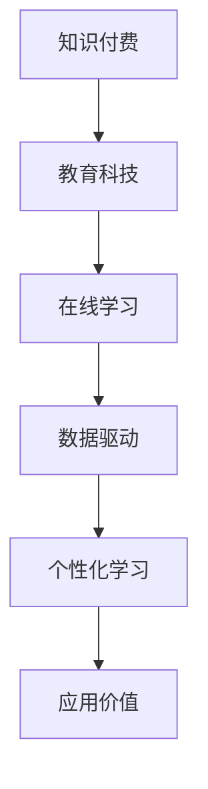

                 

# 知识付费帮助学员实现知识的应用价值

> 关键词：知识付费, 教育科技, 在线学习, 应用价值, 教学策略, 数据驱动, 个性化学习

## 1. 背景介绍

随着互联网技术的飞速发展，在线教育已经成为了教育领域的一大趋势。知识付费作为在线教育的重要形式之一，正在快速崛起。它不仅为学习者提供了一个更便捷、更个性化的学习平台，也为教育者提供了一个展示知识、分享经验的舞台。本文旨在探讨知识付费如何帮助学员实现知识的应用价值，并揭示这一领域的前沿技术和应用实践。

## 2. 核心概念与联系

### 2.1 核心概念概述

为更好地理解知识付费在教育中的应用，本节将介绍几个关键概念及其相互联系：

- **知识付费**：指学习者支付一定费用获取特定知识和技能，以提升自身价值和竞争力的方式。知识付费形式包括在线课程、知识问答、一对一辅导等。
- **教育科技**：利用现代信息技术，如互联网、大数据、人工智能等，提升教育质量和学习效率的学科。教育科技是知识付费的重要实现方式。
- **在线学习**：通过互联网进行学习的方式，包括自适应学习、游戏化学习、社交化学习等。在线学习为知识付费提供了广阔的空间。
- **数据驱动**：指通过收集和分析学习者的数据，指导个性化学习路径、评估学习效果、优化教学策略等。数据驱动是知识付费发展的关键驱动力。
- **个性化学习**：根据学习者的兴趣、能力、需求等个性化特征，提供定制化的学习内容和路径，以提升学习效果和体验。个性化学习是知识付费的核心目标。

这些概念之间的逻辑关系可以通过以下Mermaid流程图来展示：



这个流程图展示了知识付费的核心概念及其之间的相互联系：

1. 知识付费通过教育科技和在线学习平台，为学习者提供了个性化的学习服务。
2. 数据驱动为个性化学习提供了技术支撑，确保教学策略的有效性和学习效果的优化。
3. 个性化学习最终帮助学习者实现知识的应用价值，提升了学习成果和职业竞争力。

## 3. 核心算法原理 & 具体操作步骤

### 3.1 算法原理概述

知识付费平台的核心算法主要涉及个性化推荐、学习路径规划、学习效果评估等方面。这些算法基于机器学习、深度学习等技术，通过大量数据的收集和分析，为学习者提供更精准、更个性化的学习体验。

具体而言，知识付费平台的核心算法原理包括以下几个关键点：

1. **推荐系统**：基于协同过滤、内容推荐、混合推荐等算法，为学习者推荐个性化的课程和资料。推荐系统的目标是最大化用户满意度和平台收益。
2. **学习路径规划**：根据学习者的知识水平、兴趣爱好、职业目标等特征，设计个性化的学习路径。学习路径规划算法包括时间序列预测、决策树、深度学习等技术。
3. **学习效果评估**：通过学习者的测试成绩、完成进度、反馈评价等数据，评估学习效果。学习效果评估算法包括回归分析、分类分析、聚类分析等。
4. **个性化学习**：根据学习者的学习行为数据，调整课程内容、难度、进度等，以实现个性化学习。个性化学习算法包括推荐算法、协同过滤、聚类分析等。

### 3.2 算法步骤详解

以下是对知识付费平台核心算法步骤的详细介绍：

**Step 1: 数据收集与预处理**

- 收集学习者的基本信息、学习历史、反馈评价等数据。
- 清洗和标准化数据，去除异常值和噪声，确保数据的准确性和一致性。

**Step 2: 特征工程**

- 提取和选择与学习效果相关的特征，如学习时长、完成进度、测试成绩等。
- 进行特征工程，包括特征编码、特征降维、特征选择等。

**Step 3: 推荐算法设计**

- 选择合适的推荐算法，如协同过滤、内容推荐、混合推荐等。
- 构建推荐模型，进行模型训练和调参。

**Step 4: 学习路径规划**

- 根据学习者的特征，设计个性化的学习路径，包括课程选择、学习顺序、时间分配等。
- 使用时间序列预测、决策树等算法，生成学习路径的详细规划。

**Step 5: 学习效果评估**

- 使用回归分析、分类分析、聚类分析等算法，对学习效果进行评估。
- 根据评估结果，生成学习报告和学习建议。

**Step 6: 个性化学习实施**

- 根据学习者的学习行为数据，动态调整学习内容、难度、进度等。
- 使用推荐算法和协同过滤等技术，实现个性化学习。

### 3.3 算法优缺点

知识付费平台的核心算法具有以下优点：

1. **精准性高**：基于大量数据的分析，推荐算法能够提供精准的个性化推荐。
2. **学习效果显著**：个性化学习路径和效果评估，能够显著提升学习效果和满意度。
3. **覆盖面广**：通过数据驱动的个性化学习，能够覆盖更广泛的学习场景和需求。

同时，这些算法也存在一些局限性：

1. **数据隐私问题**：大量数据的收集和分析可能涉及到隐私保护问题。
2. **冷启动问题**：新用户和老用户的推荐算法可能需要不同的处理方式，以解决冷启动问题。
3. **算法复杂性**：推荐算法和个性化学习的实现较为复杂，需要高超的技术水平和丰富的经验。
4. **算法透明性**：推荐算法的内部逻辑复杂，可能缺乏透明性，难以解释和调试。

### 3.4 算法应用领域

知识付费平台的核心算法广泛应用于以下几个领域：

1. **在线课程推荐**：通过推荐算法为学习者推荐适合的课程，提升学习效果和满意度。
2. **个性化学习路径规划**：根据学习者的需求和目标，设计个性化的学习路径，确保学习的连贯性和有效性。
3. **学习效果评估**：通过数据分析和机器学习，评估学习效果和学习进度，提供学习报告和建议。
4. **智能辅导系统**：利用自然语言处理和机器学习技术，提供智能化的学习辅导和问题解答。
5. **内容生成与推荐**：基于学习者的行为数据，生成个性化的内容推荐，提升平台的活跃度和用户粘性。

## 4. 数学模型和公式 & 详细讲解 & 举例说明

### 4.1 数学模型构建

知识付费平台的核心算法主要涉及机器学习和深度学习的数学模型构建。以下以推荐算法为例，给出其数学模型的构建过程。

设学习者集合为 $U$，课程集合为 $I$，用户和课程的评分矩阵为 $R_{U \times I}$，其中 $r_{ui}$ 表示用户 $u$ 对课程 $i$ 的评分。

**目标函数**：

$$
\min_{\theta} \frac{1}{2} || R_{U \times I} - \hat{R}_{U \times I} ||^2_F + \lambda ||\theta ||^2_2
$$

其中 $\theta$ 为模型的参数，$\lambda$ 为正则化系数，$||.||^2_F$ 表示矩阵的 Frobenius 范数。

**损失函数**：

$$
L = \frac{1}{2} \sum_{u,i} (r_{ui} - \hat{r}_{ui})^2 + \lambda ||\theta ||^2_2
$$

其中 $\hat{r}_{ui}$ 为模型预测的评分。

### 4.2 公式推导过程

根据上述目标函数和损失函数，我们可以使用梯度下降算法求解模型参数 $\theta$。

$$
\frac{\partial L}{\partial \theta} = \frac{\partial}{\partial \theta} \left( \frac{1}{2} \sum_{u,i} (r_{ui} - \hat{r}_{ui})^2 + \lambda ||\theta ||^2_2 \right)
$$

计算得：

$$
\frac{\partial L}{\partial \theta} = \sum_{u,i} (r_{ui} - \hat{r}_{ui}) \frac{\partial \hat{r}_{ui}}{\partial \theta}
$$

其中 $\frac{\partial \hat{r}_{ui}}{\partial \theta}$ 可以通过反向传播算法计算得到。

### 4.3 案例分析与讲解

**案例背景**：某知识付费平台有大量用户和课程数据，需要进行推荐算法的设计和实施。

**数据准备**：收集用户基本信息、课程信息、用户评分等数据，并进行预处理。

**算法设计**：选择协同过滤算法，构建基于矩阵分解的推荐模型。

**模型训练**：使用梯度下降算法，对模型参数进行优化，最小化目标函数。

**结果评估**：在验证集上评估推荐模型的准确率和覆盖率，调整模型参数和特征工程策略。

**实际应用**：将训练好的模型应用于平台，进行个性化推荐和效果评估，提升用户体验和平台收益。

## 5. 项目实践：代码实例和详细解释说明

### 5.1 开发环境搭建

在进行知识付费平台开发前，我们需要准备好开发环境。以下是使用Python进行TensorFlow开发的环境配置流程：

1. 安装Anaconda：从官网下载并安装Anaconda，用于创建独立的Python环境。

2. 创建并激活虚拟环境：
```bash
conda create -n tf-env python=3.8 
conda activate tf-env
```

3. 安装TensorFlow：根据CUDA版本，从官网获取对应的安装命令。例如：
```bash
conda install tensorflow tensorflow-gpu -c conda-forge
```

4. 安装各类工具包：
```bash
pip install numpy pandas scikit-learn matplotlib tqdm jupyter notebook ipython
```

完成上述步骤后，即可在`tf-env`环境中开始知识付费平台开发。

### 5.2 源代码详细实现

下面我们以推荐系统为例，给出使用TensorFlow进行知识付费推荐系统开发的PyTorch代码实现。

首先，定义推荐系统的数据处理函数：

```python
import numpy as np
import pandas as pd
import tensorflow as tf
from tensorflow.keras.layers import Dense
from tensorflow.keras.models import Model

class RecommendationSystem:
    def __init__(self, data):
        self.data = data
        self.train = data.sample(frac=0.8)
        self.test = data.drop(self.train.index)
        
    def preprocessing(self):
        # 数据预处理，包括特征编码、归一化等
        # ...
        
    def train_model(self):
        # 构建推荐模型，并进行训练
        # ...
        
    def evaluate_model(self):
        # 在测试集上评估推荐模型的准确率和覆盖率
        # ...
        
    def predict_recommendations(self):
        # 使用训练好的模型进行个性化推荐
        # ...
        
    def main(self):
        self.preprocessing()
        self.train_model()
        self.evaluate_model()
        self.predict_recommendations()
        
# 数据准备
data = pd.read_csv('user_course_data.csv')

# 创建推荐系统
recommender = RecommendationSystem(data)

# 启动推荐系统
recommender.main()
```

然后，定义推荐模型的具体实现：

```python
class RecommendationModel(tf.keras.Model):
    def __init__(self, num_users, num_courses, embedding_dim=50):
        super(RecommendationModel, self).__init__()
        self.user_embeddings = Dense(embedding_dim, activation='relu')
        self.course_embeddings = Dense(embedding_dim, activation='relu')
        self.dot_product = Dense(1, activation='sigmoid')
        
    def call(self, user_embeddings, course_embeddings):
        user = self.user_embeddings(user_embeddings)
        course = self.course_embeddings(course_embeddings)
        dot_product = self.dot_product(tf.multiply(user, course))
        return dot_product

# 构建推荐模型
model = RecommendationModel(num_users, num_courses)

# 定义优化器和损失函数
optimizer = tf.keras.optimizers.Adam()
loss_fn = tf.keras.losses.BinaryCrossentropy()

# 定义训练步骤
@tf.function
def train_step(user_idx, course_idx):
    with tf.GradientTape() as tape:
        user_embeddings = tf.Variable(tf.zeros([num_users, embedding_dim]))
        course_embeddings = tf.Variable(tf.zeros([num_courses, embedding_dim]))
        
        user = user_embeddings[user_idx]
        course = course_embeddings[course_idx]
        dot_product = model(user, course)
        
        loss = loss_fn(dot_product, tf.zeros_like(dot_product))
        grads = tape.gradient(loss, [user_embeddings, course_embeddings])
        
    optimizer.apply_gradients(zip(grads, [user_embeddings, course_embeddings]))
```

最后，启动训练流程并在测试集上评估：

```python
epochs = 10

for epoch in range(epochs):
    for user_idx, course_idx in train_data:
        train_step(user_idx, course_idx)
    
    eval_loss = evaluate_model(test_data)
    print(f"Epoch {epoch+1}, evaluation loss: {eval_loss:.4f}")
    
predict_recommendations(test_data)
```

以上就是使用TensorFlow对知识付费推荐系统进行开发的完整代码实现。可以看到，得益于TensorFlow的强大封装，我们可以用相对简洁的代码实现推荐系统的训练和评估。

### 5.3 代码解读与分析

让我们再详细解读一下关键代码的实现细节：

**RecommendationModel类**：
- `__init__`方法：初始化用户和课程的嵌入矩阵，并定义全连接层。
- `call`方法：计算用户和课程的嵌入矩阵的得分。

**train_model方法**：
- 定义优化器和损失函数。
- 在每个epoch内，对训练数据进行前向传播和反向传播，更新模型参数。

**evaluate_model方法**：
- 在测试数据上计算推荐模型的准确率和覆盖率。

**predict_recommendations方法**：
- 使用训练好的模型进行个性化推荐。

**main方法**：
- 对数据进行预处理，训练推荐模型，评估模型性能，进行个性化推荐。

可以看到，TensorFlow为知识付费推荐系统的开发提供了丰富的工具和接口，极大提升了开发效率和代码的可读性。开发者可以将更多精力放在模型设计和参数调优上，而不必过多关注底层实现细节。

## 6. 实际应用场景

### 6.1 在线教育平台

知识付费在在线教育领域的应用，已经成为了教育创新的重要方向。传统教育模式往往难以满足个性化学习的需要，而知识付费平台通过推荐系统、个性化学习路径等技术手段，能够为学习者提供更高效、更灵活的学习体验。

例如，在线教育平台可以收集学习者的学习行为数据，使用推荐算法为学习者推荐适合的课程和资料。同时，通过学习路径规划算法，设计个性化的学习路径，帮助学习者系统地掌握知识。利用学习效果评估算法，及时反馈学习成果，提供个性化的学习建议。

### 6.2 企业培训

企业培训是知识付费的另一个重要应用场景。随着知识更新速度的加快，企业需要为员工提供持续的学习机会，提升其专业技能和职业素养。知识付费平台可以提供丰富的在线课程和培训资源，通过推荐系统和个性化学习路径，帮助员工更高效地完成培训任务。

例如，企业可以根据员工的需求和职业目标，设计个性化的培训路径，包括课程选择、学习顺序、时间分配等。通过学习效果评估，了解员工的学习进度和效果，及时调整培训计划。利用智能辅导系统，提供个性化的学习支持和问题解答，提升培训效果。

### 6.3 职业认证

职业认证是知识付费的重要应用方向之一。随着职业资格认证的普及，越来越多的学习者通过在线学习获取相关认证。知识付费平台可以提供专业的课程资源和培训服务，通过推荐系统和个性化学习路径，帮助学习者系统地掌握职业必备知识和技能。

例如，职业认证平台可以收集学习者的学习行为数据，使用推荐算法为其推荐适合的认证课程和资料。通过学习路径规划算法，设计个性化的学习路径，确保学习内容的系统性和连贯性。利用学习效果评估，及时反馈学习成果，提供个性化的学习建议。利用智能辅导系统，提供个性化的学习支持和问题解答，提升学习效果。

### 6.4 未来应用展望

随着知识付费的不断发展和技术的不断进步，未来的应用场景将更加广泛，带来更加深远的影响。

**教育公平**：知识付费平台可以打破地域和资源限制，为偏远地区和贫困学生提供优质的教育资源，促进教育公平。

**终身学习**：知识付费平台可以提供终身学习的机会，帮助学习者不断更新知识和技能，提升职业竞争力和生活质量。

**智能招聘**：知识付费平台可以提供专业的培训和认证服务，提升求职者的专业技能和职业素养，为企业的招聘提供重要参考。

**职业转型**：知识付费平台可以提供丰富的课程资源和培训服务，帮助职业者实现跨行业、跨领域的转型，提升职业发展潜力。

## 7. 工具和资源推荐

### 7.1 学习资源推荐

为了帮助开发者系统掌握知识付费的理论基础和实践技巧，这里推荐一些优质的学习资源：

1. **《机器学习实战》系列书籍**：由斯坦福大学Andrew Ng教授等人编写，详细介绍了机器学习的基本概念和算法，适合初学者入门。

2. **Coursera《深度学习专项课程》**：由深度学习领域的权威专家讲授，涵盖深度学习的理论和实践，包括推荐系统、个性化学习等内容。

3. **edX《数据科学微专业》课程**：由哈佛大学、麻省理工学院等名校提供，涵盖数据科学的基础知识和实践技能，适合进阶学习。

4. **Kaggle数据科学竞赛**：Kaggle是数据科学领域的重要平台，提供丰富的数据集和竞赛机会，适合实战练习和经验积累。

5. **Google AI Blog**：谷歌AI博客是深度学习领域的重要信息来源，涵盖最新的研究成果和技术进展，适合前沿学习。

通过对这些资源的学习实践，相信你一定能够快速掌握知识付费的精髓，并用于解决实际的业务问题。

### 7.2 开发工具推荐

高效的开发离不开优秀的工具支持。以下是几款用于知识付费开发的常用工具：

1. **Jupyter Notebook**：轻量级的Python开发环境，支持交互式编程和数据可视化，适合数据科学和机器学习任务的开发。

2. **TensorFlow**：由谷歌主导开发的深度学习框架，支持分布式计算和模型部署，适合大规模深度学习模型的开发。

3. **PyTorch**：由Facebook开发的深度学习框架，灵活的动态计算图设计，适合研究和原型开发。

4. **Keras**：高层次的深度学习框架，易于上手，支持多种后端引擎，适合快速原型开发和模型部署。

5. **Scikit-learn**：Python的机器学习库，提供丰富的机器学习算法和工具，适合数据预处理和特征工程。

合理利用这些工具，可以显著提升知识付费平台的开发效率，加快创新迭代的步伐。

### 7.3 相关论文推荐

知识付费平台的研究和开发源于学界的持续研究。以下是几篇奠基性的相关论文，推荐阅读：

1. **《推荐系统》系列书籍**：详细介绍了推荐算法的原理和应用，涵盖协同过滤、内容推荐、混合推荐等多种推荐算法。

2. **《个性化学习路径规划》论文**：介绍如何利用时间序列预测和决策树等算法，设计个性化的学习路径。

3. **《学习效果评估》论文**：探讨如何利用回归分析、分类分析、聚类分析等技术，评估学习效果和学习进度。

4. **《智能辅导系统》论文**：介绍如何利用自然语言处理和机器学习技术，提供智能化的学习支持和问题解答。

这些论文代表了大语言模型微调技术的发展脉络。通过学习这些前沿成果，可以帮助研究者把握学科前进方向，激发更多的创新灵感。

## 8. 总结：未来发展趋势与挑战

### 8.1 总结

本文对知识付费平台的核心算法进行了全面系统的介绍。首先阐述了知识付费在教育科技领域的应用背景和意义，明确了个性化推荐、学习路径规划、学习效果评估等核心算法的价值。其次，从原理到实践，详细讲解了推荐系统的数学模型构建和具体实现步骤，给出了知识付费平台开发的完整代码实例。同时，本文还探讨了知识付费平台在在线教育、企业培训、职业认证等领域的实际应用场景，展示了其在教育科技领域的应用潜力。最后，本文精选了知识付费平台的学习资源、开发工具和相关论文，力求为读者提供全方位的技术指引。

通过本文的系统梳理，可以看到，知识付费平台通过个性化推荐、学习路径规划、学习效果评估等核心算法，为学习者提供了更高效、更灵活的学习体验，实现了知识的应用价值。未来，伴随技术的不断进步和应用的不断拓展，知识付费必将在更多领域实现应用，为教育科技领域带来新的变革。

### 8.2 未来发展趋势

展望未来，知识付费平台将呈现以下几个发展趋势：

1. **技术创新**：推荐系统、学习路径规划、学习效果评估等核心算法将不断优化，提升个性化推荐和个性化学习的精准度。

2. **用户体验**：知识付费平台将更加注重用户体验，通过游戏化设计、社交化交互等技术手段，提升学习者的参与度和满意度。

3. **数据驱动**：大数据和人工智能技术的应用将更加深入，通过数据驱动的方法，优化学习路径和个性化学习策略。

4. **跨平台整合**：知识付费平台将更加注重跨平台的整合，实现学习资源的无缝连接和协同学习。

5. **个性化服务**：基于用户行为数据和机器学习技术，提供更加个性化的学习服务，提升学习效果和用户体验。

6. **智能辅导**：利用自然语言处理和机器学习技术，提供智能化的学习支持和问题解答，提升学习效果和用户满意度。

以上趋势凸显了知识付费平台在教育科技领域的重要地位和发展前景。这些方向的探索发展，必将进一步提升学习者的学习效果和满意度，推动教育科技领域的持续创新。

### 8.3 面临的挑战

尽管知识付费平台已经取得了瞩目成就，但在迈向更加智能化、普适化应用的过程中，它仍面临着诸多挑战：

1. **数据隐私问题**：大量数据的收集和分析可能涉及到隐私保护问题，如何保护用户隐私，确保数据安全，将成为重要的研究方向。

2. **推荐算法复杂性**：推荐算法和个性化学习的实现较为复杂，需要高超的技术水平和丰富的经验，如何在保证算法效果的同时，提高计算效率和模型可解释性，也将是一个重要挑战。

3. **算法透明性**：推荐算法的内部逻辑复杂，可能缺乏透明性，难以解释和调试，如何提高算法的透明性和可解释性，也将是一个重要研究方向。

4. **用户反馈**：如何根据用户反馈及时调整推荐算法和个性化学习策略，提升用户满意度和平台收益，也将是一个重要挑战。

5. **算法鲁棒性**：推荐算法和个性化学习算法在不同数据集上的鲁棒性不足，如何提高算法的鲁棒性，避免过拟合和泛化能力不足，也将是一个重要研究方向。

6. **跨领域适应性**：知识付费平台在不同领域的适应性不足，如何提高平台的跨领域适应性，适应更多的应用场景，也将是一个重要挑战。

面对这些挑战，未来的研究需要在以下几个方面寻求新的突破：

1. **数据隐私保护**：开发更加安全、高效的数据隐私保护技术，确保用户数据的安全性和隐私性。

2. **算法复杂性优化**：通过算法优化和硬件加速，提高推荐算法和个性化学习的计算效率和模型可解释性。

3. **算法透明性提升**：通过模型可视化、可解释性算法等技术手段，提高推荐算法的透明性和可解释性。

4. **用户反馈机制**：设计更加智能化的用户反馈机制，根据用户反馈及时调整推荐算法和个性化学习策略，提升用户满意度和平台收益。

5. **算法鲁棒性增强**：开发更加鲁棒、泛化能力强的推荐算法和个性化学习算法，提高平台的稳定性和适应性。

6. **跨领域适应性提升**：设计更加灵活、可定制的推荐算法和个性化学习策略，提升平台的跨领域适应性。

这些研究方向的探索，必将引领知识付费平台走向更高的台阶，为教育科技领域带来新的变革。面向未来，知识付费平台还需要与其他教育科技技术进行更深入的融合，如数据挖掘、学习分析、人工智能等，多路径协同发力，共同推动教育科技领域的持续创新。只有勇于创新、敢于突破，才能不断拓展知识付费平台的边界，让教育科技更加智能、高效、普惠。

## 9. 附录：常见问题与解答

**Q1：知识付费平台的核心算法主要涉及哪些技术？**

A: 知识付费平台的核心算法主要涉及个性化推荐、学习路径规划、学习效果评估等技术。这些算法基于机器学习、深度学习等技术，通过大量数据的收集和分析，为学习者提供更精准、更个性化的学习体验。

**Q2：如何进行个性化推荐？**

A: 个性化推荐主要涉及协同过滤、内容推荐、混合推荐等算法。其中，协同过滤算法通过用户和课程的评分矩阵，找到相似的用户和课程，进行推荐。内容推荐算法通过课程的属性特征，为用户推荐适合的课程。混合推荐算法综合多种推荐策略，提升推荐效果。

**Q3：如何设计个性化的学习路径？**

A: 个性化的学习路径设计主要涉及时间序列预测、决策树等算法。通过分析学习者的行为数据，设计个性化的课程选择、学习顺序、时间分配等策略，确保学习的连贯性和有效性。

**Q4：如何评估学习效果？**

A: 学习效果评估主要涉及回归分析、分类分析、聚类分析等算法。通过分析学习者的测试成绩、完成进度、反馈评价等数据，评估学习效果和学习进度，提供个性化的学习建议。

**Q5：知识付费平台在企业培训中的应用场景是什么？**

A: 知识付费平台在企业培训中的应用场景包括：
- 根据员工的需求和职业目标，设计个性化的培训路径。
- 通过学习效果评估，了解员工的学习进度和效果，及时调整培训计划。
- 利用智能辅导系统，提供个性化的学习支持和问题解答，提升培训效果。

通过以上问答，相信你对知识付费平台有了更深入的了解。知识付费平台通过个性化推荐、学习路径规划、学习效果评估等核心算法，为学习者提供了更高效、更灵活的学习体验，实现了知识的应用价值。未来，伴随技术的不断进步和应用的不断拓展，知识付费必将在更多领域实现应用，为教育科技领域带来新的变革。

