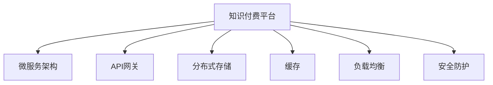

                 

# 知识付费平台的技术架构设计

> 关键词：知识付费平台, 技术架构设计, 数据流, 微服务, API网关, 分布式存储, 缓存, 负载均衡, 安全防护

## 1. 背景介绍

### 1.1 问题由来
随着互联网技术的发展和知识经济的兴起，知识付费平台成为众多企业争相布局的新领域。知识付费平台以线上课程、专栏、电子书等内容为核心，通过构建用户、内容、交易三个维度的一体化生态，为用户提供全面、便捷、高效的学习体验，同时帮助内容生产者实现价值变现。

然而，知识付费平台的发展也面临着诸多挑战，如内容品质参差不齐、用户体验不一致、支付体系不完善、数据安全难以保障等。这些问题亟需通过系统化的技术架构设计来解决，以确保平台稳定、高效、安全地运行。

### 1.2 问题核心关键点
技术架构设计是知识付费平台建设的关键环节。其核心在于如何构建一个高可用、可扩展、易维护的系统，以支撑平台的稳定运行和持续迭代优化。具体包括以下几个关键点：

1. 数据流设计：如何高效地组织和处理数据，确保数据流向的合理性和一致性。
2. 微服务架构：如何通过微服务技术实现系统的模块化和松耦合，提高系统的可扩展性和可靠性。
3. 基础设施：如何选择合适的基础设施，如云服务、数据库、缓存、存储等，满足平台的高性能需求。
4. 安全防护：如何通过技术手段保障数据和用户的安全，防止信息泄露和攻击。
5. 负载均衡：如何通过负载均衡技术实现系统的高并发处理能力，提升用户体验。

本文将深入探讨知识付费平台的技术架构设计，结合实际案例，介绍如何通过合理的设计理念和工程实践，构建一个高效、可扩展、安全、稳定的知识付费平台。

## 2. 核心概念与联系

### 2.1 核心概念概述

为更好地理解知识付费平台的技术架构设计，本节将介绍几个密切相关的核心概念：

- 知识付费平台(Knowledge Paying Platform)：以知识内容为核心，为用户提供线上学习、支付、互动等综合服务的企业级平台。
- 微服务架构(Microservices Architecture)：将系统拆分为多个独立、自治的微服务，每个微服务负责单一业务功能，通过API进行通信和数据交换。
- API网关(API Gateway)：用于统一管理API路由、版本控制、负载均衡、安全性控制等功能，减少微服务间的直接调用，提高系统性能和安全性。
- 分布式存储(Distributed Storage)：通过多节点共享存储资源，提高数据的可扩展性和可用性。
- 缓存(Caching)：利用高速缓存存储热点数据，减少数据库查询压力，提升系统响应速度。
- 负载均衡(Load Balancing)：通过分散请求流量，提高系统的并发处理能力，提升用户体验。
- 安全防护(Security Protection)：通过加密、认证、授权、访问控制等技术手段，保障数据和用户的安全。

这些核心概念之间的逻辑关系可以通过以下Mermaid流程图来展示：



这个流程图展示了大语言模型的核心概念及其之间的关系：

1. 知识付费平台通过微服务架构实现系统的模块化设计，将系统拆分为多个独立、自治的服务。
2. API网关用于统一管理各微服务间的通信，减少微服务间的直接调用，提高系统性能和安全性。
3. 分布式存储和缓存技术用于提升系统的数据处理和响应速度，满足平台的高并发需求。
4. 负载均衡技术用于分散请求流量，提高系统的并发处理能力。
5. 安全防护技术用于保障数据和用户的安全，防止信息泄露和攻击。

这些概念共同构成了知识付费平台的技术架构设计基础，确保平台能够高效、可扩展、安全地运行。

## 3. 核心算法原理 & 具体操作步骤

### 3.1 算法原理概述

知识付费平台的技术架构设计，本质上是一个面向服务的设计过程，旨在通过合理分解和整合系统功能，实现高效、可扩展、安全、稳定的目标。其核心思想是：

1. 采用微服务架构，将系统拆分为多个独立的微服务，每个微服务负责单一的业务功能，提高系统的模块化和松耦合性。
2. 使用API网关统一管理微服务间的通信，减少微服务间的直接调用，提高系统的性能和安全性。
3. 利用分布式存储和缓存技术，提升系统的数据处理和响应速度，满足平台的高并发需求。
4. 通过负载均衡技术，分散请求流量，提高系统的并发处理能力。
5. 应用安全防护技术，保障数据和用户的安全，防止信息泄露和攻击。

### 3.2 算法步骤详解

知识付费平台的技术架构设计一般包括以下几个关键步骤：

**Step 1: 系统需求分析**
- 分析业务需求，明确平台的功能模块和业务流程。
- 确定系统的数据模型和数据流向，设计数据仓库和数据管道。
- 评估系统的非功能性需求，如性能、安全、可靠性等。

**Step 2: 架构设计**
- 根据需求分析结果，设计系统的整体架构，选择合适的技术栈和工具。
- 采用微服务架构，将系统拆分为多个独立的微服务，明确每个微服务的职责和接口。
- 设计API网关，统一管理微服务间的通信，减少微服务间的直接调用，提高系统的性能和安全性。
- 引入分布式存储和缓存技术，提升系统的数据处理和响应速度，满足平台的高并发需求。
- 应用负载均衡技术，分散请求流量，提高系统的并发处理能力。
- 设计安全防护机制，保障数据和用户的安全，防止信息泄露和攻击。

**Step 3: 实施部署**
- 按照设计方案，搭建系统环境和基础设施，如云服务、数据库、缓存、存储等。
- 实现各个微服务的功能，编写API接口，进行单元测试和集成测试。
- 部署微服务到生产环境，配置负载均衡和缓存策略，进行性能测试和安全测试。
- 建立监控告警系统，实时采集系统指标，设置异常告警阈值，确保系统稳定运行。

**Step 4: 运维优化**
- 根据监控数据和用户反馈，进行系统调优和性能优化，提升用户体验。
- 定期进行安全审计和漏洞扫描，及时修复安全隐患，保障数据和用户安全。
- 根据业务需求和用户反馈，持续迭代和优化系统架构，满足新的功能需求和技术要求。

### 3.3 算法优缺点

知识付费平台的技术架构设计具有以下优点：
1. 模块化和松耦合：微服务架构将系统拆分为多个独立、自治的服务，每个服务负责单一的业务功能，提高了系统的模块化和松耦合性，便于单独维护和扩展。
2. 高性能和安全性：通过API网关统一管理微服务间的通信，减少微服务间的直接调用，提高系统的性能和安全性。
3. 可扩展性和可用性：利用分布式存储和缓存技术，提升系统的数据处理和响应速度，满足平台的高并发需求。
4. 高并发处理能力：通过负载均衡技术，分散请求流量，提高系统的并发处理能力，提升用户体验。
5. 安全保障：应用安全防护技术，保障数据和用户的安全，防止信息泄露和攻击。

同时，该架构也存在一定的局限性：
1. 系统复杂性增加：微服务架构虽然提高了系统的模块化和松耦合性，但也增加了系统的复杂性，管理难度较大。
2. 服务间通信开销增加：通过API网关统一管理微服务间的通信，虽然提高了系统的性能和安全性，但也增加了服务间通信的开销。
3. 分布式存储和缓存的维护成本高：分布式存储和缓存技术虽然提升了系统的数据处理和响应速度，但也增加了维护成本和技术难度。
4. 负载均衡的实现复杂：负载均衡技术虽然提高了系统的并发处理能力，但也增加了系统的实现复杂度。
5. 安全防护的难度大：安全防护技术虽然保障了数据和用户的安全，但也增加了系统的实现难度和维护成本。

尽管存在这些局限性，但就目前而言，基于微服务的架构设计仍是被广泛认可的知识付费平台架构范式。未来相关研究的重点在于如何进一步降低微服务架构的复杂度，提高系统的维护效率，同时兼顾性能和安全性。

### 3.4 算法应用领域

知识付费平台的技术架构设计，在多个行业领域得到了广泛应用，如在线教育、在线医疗、在线金融等。以下是几个典型的应用场景：

- 在线教育平台：通过微服务架构实现课程内容、用户管理、支付体系、数据分析等功能模块的独立开发和维护，提升平台的性能和稳定性。
- 在线医疗平台：通过微服务架构实现医疗咨询、预约挂号、电子病历、药品推荐等功能模块的独立开发和维护，提高平台的可扩展性和用户体验。
- 在线金融平台：通过微服务架构实现理财咨询、股票交易、基金管理、风险控制等功能模块的独立开发和维护，保障平台的安全性和可靠性。

除了这些典型的应用场景外，知识付费平台的技术架构设计还被创新性地应用到更多领域中，如智慧城市、智能制造、智能交通等，为各行各业提供了新的技术支持。

## 4. 数学模型和公式 & 详细讲解  
### 4.1 数学模型构建

本节将使用数学语言对知识付费平台的技术架构设计过程进行更加严格的刻画。

假设知识付费平台采用微服务架构，系统由多个微服务 $S_i$ 组成，每个微服务提供单一的业务功能。系统整体架构设计如下：


其中，每个微服务 $S_i$ 通过API网关进行通信，API网关统一管理各微服务间的路由、负载均衡和安全控制。分布式存储和缓存技术用于提升系统的数据处理和响应速度，负载均衡技术用于分散请求流量，安全防护技术用于保障数据和用户的安全。

### 4.2 公式推导过程

以下我们以在线教育平台为例，推导微服务架构的性能和安全性优化公式。

假设在线教育平台的请求率为 $R$，每个请求的处理时间为 $T$，每个微服务 $S_i$ 的并发请求数为 $C_i$，系统总并发请求数为 $C$。则系统总处理时间为：

$$
T_{total} = \sum_{i=1}^n C_i \times T
$$

其中，$n$ 为微服务数量。

通过引入负载均衡技术，可以将请求流量 $R$ 分散到多个微服务上，使得每个微服务的并发请求数 $C_i$ 平均分配，即：

$$
C_i = \frac{R}{n}
$$

则系统总处理时间为：

$$
T_{total} = n \times \frac{R}{n} \times T = R \times T
$$

系统总处理时间与请求率 $R$ 成正比，但与微服务数量 $n$ 无关，说明负载均衡技术可以显著提升系统的并发处理能力。

同时，通过API网关进行统一管理和路由，可以优化微服务间的通信，减少微服务间的直接调用，提高系统的性能和安全性。假设API网关的通信开销为 $T_{gateway}$，则系统总处理时间为：

$$
T_{total} = R \times T + n \times T_{gateway}
$$

引入缓存技术后，可以显著提升系统的响应速度。假设缓存的命中率 $H$ 为 $x$，则系统总处理时间为：

$$
T_{total} = R \times T + n \times T_{gateway} + (1-x) \times R \times T
$$

其中，$1-x$ 为未命中缓存的处理请求占比。

系统总处理时间与请求率 $R$ 成正比，但与缓存命中率 $H$ 成反比，说明缓存技术可以有效提升系统的响应速度。

### 4.3 案例分析与讲解

**案例：在线教育平台的性能优化**

在线教育平台面对高并发请求，系统设计需要优化性能。具体分析如下：

1. 采用微服务架构：将系统拆分为课程管理、用户管理、支付体系等功能模块，每个模块独立开发和维护，提升系统的模块化和松耦合性。
2. 引入API网关：统一管理各微服务间的路由和负载均衡，减少微服务间的直接调用，提高系统的性能和安全性。
3. 利用缓存技术：对热点数据进行缓存，减少数据库查询压力，提升系统响应速度。
4. 应用负载均衡技术：分散请求流量，提高系统的并发处理能力，提升用户体验。

通过上述优化措施，在线教育平台的系统架构设计可以满足高并发、高性能、高可靠性的需求，确保平台的稳定运行和用户体验。

## 5. 项目实践：代码实例和详细解释说明
### 5.1 开发环境搭建

在进行知识付费平台的技术架构设计实践前，我们需要准备好开发环境。以下是使用Python进行微服务开发的环境配置流程：

1. 安装Docker：从官网下载并安装Docker，用于容器化部署和运行微服务。

2. 安装Kubernetes：从官网下载并安装Kubernetes，用于容器编排和资源调度。

3. 安装Helm：从官网下载并安装Helm，用于微服务的部署和管理。

4. 安装Swagger UI：从官网下载并安装Swagger UI，用于API文档的管理和展示。

完成上述步骤后，即可在容器化环境中开始微服务开发和部署。

### 5.2 源代码详细实现

这里以在线教育平台的微服务架构设计为例，给出完整的代码实现。

**5.2.1 课程服务实现**

```python
from flask import Flask, request, jsonify

app = Flask(__name__)

@app.route('/api/courses', methods=['POST'])
def add_course():
    course = request.json
    # 业务逻辑：将课程信息保存到数据库
    return jsonify({'status': 'success', 'message': 'Course added successfully'})

@app.route('/api/courses', methods=['GET'])
def get_courses():
    courses = get_courses_from_db()
    # 业务逻辑：从数据库中获取课程信息
    return jsonify(courses)

if __name__ == '__main__':
    app.run(debug=True)
```

**5.2.2 用户服务实现**

```python
from flask import Flask, request, jsonify

app = Flask(__name__)

@app.route('/api/users', methods=['POST'])
def add_user():
    user = request.json
    # 业务逻辑：将用户信息保存到数据库
    return jsonify({'status': 'success', 'message': 'User added successfully'})

@app.route('/api/users', methods=['GET'])
def get_users():
    users = get_users_from_db()
    # 业务逻辑：从数据库中获取用户信息
    return jsonify(users)

if __name__ == '__main__':
    app.run(debug=True)
```

**5.2.3 支付服务实现**

```python
from flask import Flask, request, jsonify

app = Flask(__name__)

@app.route('/api/payments', methods=['POST'])
def process_payment():
    payment_info = request.json
    # 业务逻辑：处理支付请求，更新订单状态
    return jsonify({'status': 'success', 'message': 'Payment processed successfully'})

@app.route('/api/payments', methods=['GET'])
def get_payments():
    payments = get_payments_from_db()
    # 业务逻辑：从数据库中获取支付信息
    return jsonify(payments)

if __name__ == '__main__':
    app.run(debug=True)
```

### 5.3 代码解读与分析

**代码解读**：
- 课程服务、用户服务和支付服务分别对应在线教育平台的不同功能模块。每个服务通过Flask框架实现RESTful API接口。
- 通过API网关统一管理各微服务间的通信，减少微服务间的直接调用，提高系统的性能和安全性。
- 利用Docker容器化部署和运行微服务，确保系统的稳定性和可扩展性。
- 通过Kubernetes进行容器编排和资源调度，实现系统的自动扩缩容和负载均衡。
- 使用Helm进行微服务的部署和管理，简化部署流程，提升开发效率。

**分析**：
- 微服务架构将系统拆分为多个独立、自治的服务，每个服务负责单一的业务功能，提高了系统的模块化和松耦合性。
- API网关统一管理各微服务间的通信，减少微服务间的直接调用，提高系统的性能和安全性。
- 通过Docker容器化部署和运行微服务，确保系统的稳定性和可扩展性。
- Kubernetes进行容器编排和资源调度，实现系统的自动扩缩容和负载均衡，提升系统的并发处理能力。
- Helm进行微服务的部署和管理，简化部署流程，提升开发效率。

## 6. 实际应用场景
### 6.1 智能课程推荐

基于知识付费平台的技术架构设计，可以构建智能课程推荐系统。推荐系统通过分析用户的学习行为和偏好，为用户推荐个性化的课程内容，提升学习效率和用户体验。

在技术实现上，可以收集用户的学习数据，如观看时长、答题正确率、兴趣标签等，将其作为训练数据输入到机器学习模型中。通过微调模型，可以实现对用户兴趣的精准预测和课程推荐。

**实现步骤**：
1. 收集用户学习数据，构建特征工程。
2. 选择适合的推荐算法，如协同过滤、内容推荐、混合推荐等。
3. 利用微服务架构将推荐算法模块化，独立开发和维护。
4. 通过API网关统一管理各微服务间的通信，减少微服务间的直接调用，提高系统的性能和安全性。
5. 利用缓存技术对热门课程进行缓存，提升推荐速度。

通过上述优化措施，智能课程推荐系统可以提供更加精准、个性化的课程推荐，提升用户体验和学习效率。

### 6.2 学习数据分析

在线教育平台汇聚了大量的学习数据，如何从中提取有价值的信息，分析用户的知识掌握情况和学习行为，是平台重要的应用场景之一。

基于知识付费平台的技术架构设计，可以构建学习数据分析系统。数据分析系统通过分析用户的学习数据，识别知识掌握薄弱环节和学习行为模式，提供个性化的学习建议和优化方案，提升学习效果。

**实现步骤**：
1. 收集用户学习数据，构建数据仓库。
2. 选择适合的数据分析算法，如聚类分析、分类分析、回归分析等。
3. 利用微服务架构将数据分析算法模块化，独立开发和维护。
4. 通过API网关统一管理各微服务间的通信，减少微服务间的直接调用，提高系统的性能和安全性。
5. 利用缓存技术对热门分析结果进行缓存，提升查询速度。

通过上述优化措施，学习数据分析系统可以提供更加全面、精准的学习数据分析，帮助用户发现知识掌握薄弱环节，提升学习效果。

### 6.3 智能客服系统

智能客服系统通过自然语言处理技术和知识图谱，实现对用户咨询的自动解答和问题解决，提升客户服务质量和效率。

基于知识付费平台的技术架构设计，可以构建智能客服系统。智能客服系统通过微服务架构实现知识图谱的存储和查询，利用自然语言处理技术对用户咨询进行理解和分析，提供智能化的服务响应。

**实现步骤**：
1. 构建知识图谱，存储平台上的课程、用户、订单等业务数据。
2. 利用微服务架构实现知识图谱的存储和查询，独立开发和维护。
3. 利用自然语言处理技术对用户咨询进行理解和分析，生成智能回复。
4. 通过API网关统一管理各微服务间的通信，减少微服务间的直接调用，提高系统的性能和安全性。
5. 利用缓存技术对热门知识图谱和智能回复进行缓存，提升查询速度。

通过上述优化措施，智能客服系统可以实现对用户咨询的自动解答和问题解决，提升客户服务质量和效率。

## 7. 工具和资源推荐
### 7.1 学习资源推荐

为了帮助开发者系统掌握知识付费平台的技术架构设计理论基础和实践技巧，这里推荐一些优质的学习资源：

1. 《微服务架构设计》系列博文：由微服务架构专家撰写，深入浅出地介绍了微服务架构的设计理念、技术栈和实现方法。

2. 《Docker实战》书籍：介绍Docker容器的基本概念、安装配置和使用技巧，帮助开发者快速上手容器化部署。

3. 《Kubernetes权威指南》书籍：介绍Kubernetes的架构、安装配置和使用技巧，帮助开发者快速上手容器编排和资源调度。

4. 《Helm实战》书籍：介绍Helm的架构、安装配置和使用技巧，帮助开发者快速上手微服务的部署和管理。

5. Swagger UI官网：提供API文档的管理和展示工具，帮助开发者快速构建API网关和文档化微服务接口。

通过对这些资源的学习实践，相信你一定能够快速掌握知识付费平台的技术架构设计精髓，并用于解决实际的业务问题。

### 7.2 开发工具推荐

高效的开发离不开优秀的工具支持。以下是几款用于知识付费平台开发的工具：

1. Flask：轻量级的Python Web框架，简单易用，适合快速开发RESTful API接口。
2. Docker：开源的容器化技术，用于打包、分发和管理应用程序，确保系统的稳定性和可扩展性。
3. Kubernetes：开源的容器编排技术，用于容器编排和资源调度，实现系统的自动扩缩容和负载均衡。
4. Helm：开源的微服务管理工具，用于微服务的部署和管理，简化部署流程，提升开发效率。
5. Swagger UI：开源的API文档管理工具，用于API文档的管理和展示，帮助开发者快速构建API网关和文档化微服务接口。

合理利用这些工具，可以显著提升知识付费平台的技术架构设计效率，加快创新迭代的步伐。

### 7.3 相关论文推荐

知识付费平台的技术架构设计源于学界的持续研究。以下是几篇奠基性的相关论文，推荐阅读：

1. 《微服务架构：设计、部署、运营》（Michael Farrell, Crockford, Ben）：介绍微服务架构的设计理念、技术栈和实现方法，提供了系统的架构设计和实践指导。

2. 《Docker：持续交付的基础设施》（Herman Bunka）：介绍Docker容器的基本概念、安装配置和使用技巧，提供了系统的容器化部署和运维方法。

3. 《Kubernetes：容器编排的未来》（Google）：介绍Kubernetes的架构、安装配置和使用技巧，提供了系统的容器编排和资源调度方法。

4. 《Helm：微服务的部署利器》（Google）：介绍Helm的架构、安装配置和使用技巧，提供了系统的微服务部署和管理方法。

这些论文代表了大语言模型微调技术的发展脉络。通过学习这些前沿成果，可以帮助研究者把握学科前进方向，激发更多的创新灵感。

## 8. 总结：未来发展趋势与挑战

### 8.1 总结

本文对知识付费平台的技术架构设计进行了全面系统的介绍。首先阐述了知识付费平台建设的背景和意义，明确了技术架构设计的核心目标和关键点。其次，从原理到实践，详细讲解了微服务架构、API网关、分布式存储、缓存、负载均衡和安全防护等关键技术，给出了完整的代码实现和详细解释说明。同时，本文还探讨了微服务架构在在线教育、智能客服、学习数据分析等多个领域的应用场景，展示了微服务架构的强大灵活性和可扩展性。

通过本文的系统梳理，可以看到，知识付费平台的技术架构设计已经成为建设高质量平台的基础，其成功部署和优化对提升用户体验和学习效果具有重要意义。未来，随着微服务架构的不断演进，知识付费平台的技术架构设计必将在更多行业领域得到应用，为各行各业提供新的技术支持。

### 8.2 未来发展趋势

展望未来，知识付费平台的技术架构设计将呈现以下几个发展趋势：

1. 模块化和松耦合：微服务架构将继续成为知识付费平台的主要架构范式，通过模块化和松耦合的设计，提升系统的可扩展性和维护性。
2. 高性能和安全性：API网关、缓存、负载均衡和安全防护等技术将进一步发展和优化，提升系统的性能和安全性。
3. 容器化和容器编排：Docker和Kubernetes等容器化技术将得到更广泛的应用，提升系统的稳定性和可扩展性。
4. 微服务管理：Helm等微服务管理工具将进一步完善，提升微服务的部署和运维效率。
5. 智能和自动化：通过引入AI和大数据技术，实现更智能和自动化的知识付费平台，提升用户体验和学习效果。

这些趋势凸显了知识付费平台技术架构设计的广阔前景。这些方向的探索发展，必将进一步提升知识付费平台的技术性能和用户体验，推动知识付费行业的健康发展。

### 8.3 面临的挑战

尽管知识付费平台的技术架构设计已经取得了显著进展，但在迈向更加智能化、普适化应用的过程中，仍面临诸多挑战：

1. 系统复杂度增加：微服务架构虽然提升了系统的模块化和松耦合性，但也增加了系统的复杂度，管理难度较大。
2. 性能和安全性：API网关、缓存、负载均衡和安全防护等技术虽然提升了系统的性能和安全性，但也增加了系统的实现难度和维护成本。
3. 微服务管理和运维：微服务的管理和运维复杂度增加，需要更多的工具和技术支持，提升运维效率。
4. 智能和自动化：引入AI和大数据技术，虽然能够提升系统的智能化和自动化水平，但也增加了系统的实现难度和成本。
5. 数据和用户安全：数据和用户的安全问题始终是平台建设的重大挑战，需要持续投入资源进行保障。

正视知识付费平台技术架构设计面临的这些挑战，积极应对并寻求突破，将是大语言模型微调走向成熟的必由之路。相信随着学界和产业界的共同努力，这些挑战终将一一被克服，知识付费平台的技术架构设计必将在构建人机协同的智能时代中扮演越来越重要的角色。

### 8.4 研究展望

面对知识付费平台技术架构设计所面临的种种挑战，未来的研究需要在以下几个方面寻求新的突破：

1. 探索新的微服务架构设计：研究新的微服务拆分策略，降低微服务间的依赖和复杂度，提升系统的维护效率。
2. 优化API网关和负载均衡：优化API网关的路由和负载均衡策略，提高系统的性能和安全性。
3. 引入AI和大数据技术：通过引入AI和大数据技术，实现更智能和自动化的知识付费平台，提升用户体验和学习效果。
4. 提升数据和用户安全：研究更高效、更智能的数据和用户安全防护技术，保障数据和用户的安全。
5. 自动化运维和智能运维：研究更高效的运维自动化技术，提升微服务的部署、监控和故障恢复能力。

这些研究方向的探索，必将引领知识付费平台技术架构设计迈向更高的台阶，为知识付费行业的健康发展提供新的技术支持。面向未来，知识付费平台的技术架构设计还需要与其他人工智能技术进行更深入的融合，如自然语言处理、知识图谱、增强学习等，多路径协同发力，共同推动知识付费平台的创新发展。只有勇于创新、敢于突破，才能不断拓展知识付费平台的技术边界，让智能技术更好地造福人类社会。

## 9. 附录：常见问题与解答

**Q1：知识付费平台采用微服务架构有哪些优势？**

A: 知识付费平台采用微服务架构有以下几个优势：

1. 模块化和松耦合：微服务架构将系统拆分为多个独立、自治的服务，每个服务负责单一的业务功能，提高了系统的模块化和松耦合性，便于单独维护和扩展。
2. 高性能和安全性：通过API网关统一管理各微服务间的通信，减少微服务间的直接调用，提高系统的性能和安全性。
3. 可扩展性和可用性：利用分布式存储和缓存技术，提升系统的数据处理和响应速度，满足平台的高并发需求。

**Q2：知识付费平台如何实现高性能和安全性？**

A: 知识付费平台可以通过以下几个步骤实现高性能和安全性：

1. 采用微服务架构，将系统拆分为多个独立的微服务，每个微服务负责单一的业务功能，提高系统的模块化和松耦合性。
2. 引入API网关，统一管理各微服务间的路由、负载均衡和安全控制，减少微服务间的直接调用，提高系统的性能和安全性。
3. 利用缓存技术，对热点数据进行缓存，减少数据库查询压力，提升系统响应速度。
4. 应用负载均衡技术，分散请求流量，提高系统的并发处理能力，提升用户体验。
5. 应用安全防护技术，保障数据和用户的安全，防止信息泄露和攻击。

**Q3：知识付费平台如何实现智能课程推荐？**

A: 知识付费平台可以通过以下几个步骤实现智能课程推荐：

1. 收集用户学习数据，构建特征工程。
2. 选择适合的推荐算法，如协同过滤、内容推荐、混合推荐等。
3. 利用微服务架构将推荐算法模块化，独立开发和维护。
4. 通过API网关统一管理各微服务间的通信，减少微服务间的直接调用，提高系统的性能和安全性。
5. 利用缓存技术对热门课程进行缓存，提升推荐速度。

通过上述优化措施，智能课程推荐系统可以提供更加精准、个性化的课程推荐，提升用户体验和学习效率。

**Q4：知识付费平台如何实现学习数据分析？**

A: 知识付费平台可以通过以下几个步骤实现学习数据分析：

1. 收集用户学习数据，构建数据仓库。
2. 选择适合的数据分析算法，如聚类分析、分类分析、回归分析等。
3. 利用微服务架构将数据分析算法模块化，独立开发和维护。
4. 通过API网关统一管理各微服务间的通信，减少微服务间的直接调用，提高系统的性能和安全性。
5. 利用缓存技术对热门分析结果进行缓存，提升查询速度。

通过上述优化措施，学习数据分析系统可以提供更加全面、精准的学习数据分析，帮助用户发现知识掌握薄弱环节，提升学习效果。

**Q5：知识付费平台如何实现智能客服系统？**

A: 知识付费平台可以通过以下几个步骤实现智能客服系统：

1. 构建知识图谱，存储平台上的课程、用户、订单等业务数据。
2. 利用微服务架构实现知识图谱的存储和查询，独立开发和维护。
3. 利用自然语言处理技术对用户咨询进行理解和分析，生成智能回复。
4. 通过API网关统一管理各微服务间的通信，减少微服务间的直接调用，提高系统的性能和安全性。
5. 利用缓存技术对热门知识图谱和智能回复进行缓存，提升查询速度。

通过上述优化措施，智能客服系统可以实现对用户咨询的自动解答和问题解决，提升客户服务质量和效率。

---

作者：禅与计算机程序设计艺术 / Zen and the Art of Computer Programming

