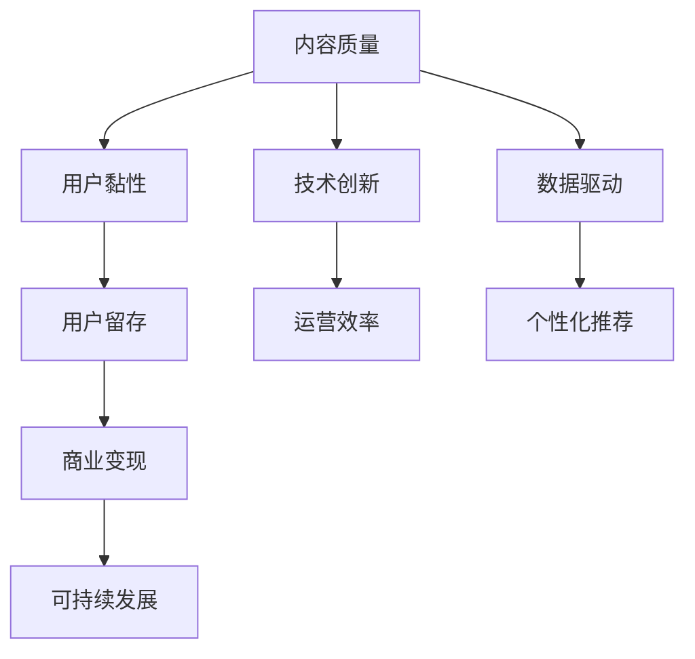

                 

# 知识付费行业的未来趋势分析

## 1. 背景介绍

### 1.1 问题由来

随着互联网技术的快速发展和普及，人们获取知识的方式也在发生深刻变化。知识付费行业作为互联网内容产业的一部分，正处于高速发展的时期。然而，面对激烈的市场竞争和用户需求的变化，知识付费行业也面临着诸多挑战。如何准确把握行业发展趋势，制定科学合理的战略规划，成为了各大知识付费平台和内容创作者的共同课题。

### 1.2 问题核心关键点

当前知识付费行业主要面临以下几个核心挑战：

- **内容质量**：在知识爆炸的时代，如何筛选出有价值、有深度的高质量内容，成为吸引用户和提升用户留存的关键。
- **用户黏性**：面对免费内容免费的诱惑，如何设计内容消费机制，提升用户黏性，增加用户复购率。
- **技术创新**：在快速迭代的技术环境中，如何运用新技术、新工具，提升平台运营效率，增强用户体验。
- **数据驱动**：如何充分利用用户行为数据，优化内容推荐算法，实现个性化推荐，提升用户满意度。
- **商业变现**：如何在用户订阅、付费内容、广告分成等多元化的商业模式下，实现可持续发展。

通过深入分析这些问题，本文将探讨知识付费行业的未来发展趋势，并提出针对性的建议。

## 2. 核心概念与联系

### 2.1 核心概念概述

- **知识付费平台**：提供有偿知识内容，并采用订阅、购买等付费模式获取收益的平台。
- **内容创作者**：生产内容并发布到平台的个人或组织。
- **用户**：付费消费知识内容，获取知识服务的个人。
- **内容质量**：指内容在深度、广度、实用性和原创性等方面的水平。
- **用户黏性**：指用户对平台的持续关注和使用程度。
- **技术创新**：指在平台运营、内容创作、数据分析等环节中引入的新技术、新方法。
- **数据驱动**：指在平台运营和内容推荐中，基于数据分析优化决策。
- **商业变现**：指平台通过多种渠道实现盈利。

这些概念之间存在紧密的联系：内容质量直接影响用户黏性，用户黏性则与平台的用户留存和商业变现能力密切相关。技术创新和数据驱动是提升内容质量和用户黏性的重要手段，而商业变现则为平台的可持续发展提供动力。

### 2.2 核心概念原理和架构的 Mermaid 流程图(Mermaid 流程节点中不要有括号、逗号等特殊字符)



这个流程图展示了知识付费行业的主要概念及其联系。内容质量是提升用户黏性的基础，用户黏性则是实现商业变现的前提，而商业变现又支持平台的可持续发展。技术创新和数据驱动分别通过提升运营效率和优化个性化推荐，间接影响内容质量和用户黏性。

## 3. 核心算法原理 & 具体操作步骤

### 3.1 算法原理概述

在知识付费行业中，内容推荐算法是一个核心环节。推荐算法的目标是根据用户的历史行为和偏好，匹配符合其兴趣的高质量内容。典型的推荐算法包括协同过滤、基于内容的推荐、深度学习推荐等。其中，深度学习推荐算法（如基于矩阵分解和神经网络的推荐模型）近年来在知识付费平台中得到了广泛应用。

推荐算法的原理可以归纳为以下几个步骤：

1. **数据收集**：收集用户的历史行为数据（如浏览、点赞、评论、购买记录等），以及内容的质量数据（如评分、标签、热度等）。
2. **特征提取**：将用户和内容映射为高维向量，提取其特征。
3. **模型训练**：使用训练数据训练推荐模型，如矩阵分解、神经网络等。
4. **预测评分**：对用户和内容对进行评分预测，确定内容的排序优先级。
5. **排序输出**：根据评分预测结果，对内容进行排序并输出推荐列表。

### 3.2 算法步骤详解

以基于神经网络的深度学习推荐算法为例，推荐过程主要分为以下几个步骤：

1. **数据准备**：收集用户和内容的数据，进行数据预处理（如去重、归一化等）。
2. **模型构建**：搭建神经网络模型，定义输入层、隐藏层和输出层，以及损失函数和优化器。
3. **特征工程**：设计特征提取器，将用户和内容的文本、标签等信息转化为向量表示。
4. **模型训练**：使用训练数据进行模型训练，调整模型参数。
5. **评分预测**：将用户和内容输入训练好的模型，得到预测评分。
6. **排序推荐**：根据预测评分排序，输出推荐内容列表。

### 3.3 算法优缺点

深度学习推荐算法的优点包括：

- **高精度**：能够处理高维稀疏数据，预测精度较高。
- **泛化能力强**：能够适应不同领域和数据分布，具有较好的泛化性能。
- **实时性**：能够实时更新推荐内容，满足用户即时需求。

其缺点包括：

- **计算复杂度高**：模型参数较多，训练和推理计算复杂度较高。
- **冷启动问题**：新用户和新内容初始化较为困难，推荐效果较差。
- **数据依赖性高**：依赖高质量标注数据，数据偏差可能影响推荐结果。

### 3.4 算法应用领域

深度学习推荐算法已经广泛应用于知识付费行业的各个方面，如内容推荐、广告投放、个性化定制等。以下是一些具体的应用场景：

- **内容推荐**：根据用户的历史行为和兴趣，推荐相关内容，提高用户黏性。
- **广告投放**：根据用户特征和内容属性，进行精准广告推荐，提升平台收益。
- **个性化定制**：根据用户偏好，推送个性化定制的内容，满足用户个性化需求。
- **用户流失预警**：通过用户行为数据分析，预警可能流失的用户，及时采取措施。

## 4. 数学模型和公式 & 详细讲解 & 举例说明（备注：数学公式请使用latex格式，latex嵌入文中独立段落使用 $$，段落内使用 $)
### 4.1 数学模型构建

以基于神经网络的推荐算法为例，数学模型可以表示为：

$$
y = f(x; \theta)
$$

其中，$x$ 为输入的特征向量，$y$ 为输出的预测评分，$\theta$ 为模型参数。常见的神经网络推荐模型包括基于FM、MLP、DNN等架构的模型。

### 4.2 公式推导过程

以基于FM（Factorization Machines）的推荐模型为例，其基本公式为：

$$
y = \sum_{i=1}^{k} w_i \cdot \prod_{j=1}^{n} x_{i,j} + b
$$

其中，$w_i$ 为第$i$个特征的权重，$x_{i,j}$ 为第$i$个特征的第$j$个维度，$b$ 为截距。通过公式推导，可以将其转化为更高效的数学表示。

### 4.3 案例分析与讲解

以某知识付费平台的课程推荐系统为例，其推荐模型可以表示为：

$$
\hat{y} = \text{sigmoid}(w \cdot x + b)
$$

其中，$x$ 为用户的特征向量，$w$ 为模型的权重矩阵，$b$ 为偏置项，$\text{sigmoid}$ 为激活函数。通过训练，模型能够预测用户对课程的兴趣程度，并根据评分排序，输出推荐列表。

## 5. 项目实践：代码实例和详细解释说明

### 5.1 开发环境搭建

在知识付费平台的项目实践中，开发环境搭建是基础。以下是一些常用的开发工具和环境配置：

1. **Python**：作为知识付费平台开发的主要语言，Python拥有丰富的库和框架。
2. **Django或Flask**：用于后端开发，提供RESTful API接口。
3. **MySQL或PostgreSQL**：用于数据存储和查询。
4. **Redis**：用于缓存和消息队列。
5. **Docker和Kubernetes**：用于容器化和分布式部署。

### 5.2 源代码详细实现

以下是一个基于PyTorch的推荐系统代码示例：

```python
import torch
import torch.nn as nn
import torch.optim as optim
from torch.utils.data import DataLoader
from torchvision import datasets, transforms

class FM(nn.Module):
    def __init__(self, n_features, k):
        super(FM, self).__init__()
        self.fc1 = nn.Linear(n_features, k)
        self.fc2 = nn.Linear(n_features, k)
        self.fc3 = nn.Linear(n_features, 1)
        self.sigmoid = nn.Sigmoid()
        
    def forward(self, x):
        i = self.fc1(x)
        o = self.fc2(x)
        p = self.fc3(x)
        return self.sigmoid(i @ o.t() + p)

# 加载数据集
train_data = datasets.MNIST('mnist_data/', train=True, download=True, transform=transforms.ToTensor())
test_data = datasets.MNIST('mnist_data/', train=False, download=True, transform=transforms.ToTensor())

# 数据处理
train_dataset = torch.utils.data.TensorDataset(train_data.train.t().numpy(), train_data.train.labels.numpy())
test_dataset = torch.utils.data.TensorDataset(test_data.test.t().numpy(), test_data.test.labels.numpy())

# 定义模型
model = FM(784, 32)

# 定义优化器和损失函数
optimizer = optim.Adam(model.parameters(), lr=0.001)
criterion = nn.BCELoss()

# 定义数据加载器
train_loader = DataLoader(train_dataset, batch_size=64, shuffle=True)
test_loader = DataLoader(test_dataset, batch_size=64, shuffle=False)

# 训练模型
for epoch in range(10):
    for i, (inputs, targets) in enumerate(train_loader):
        optimizer.zero_grad()
        outputs = model(inputs)
        loss = criterion(outputs, targets)
        loss.backward()
        optimizer.step()
        
    # 测试模型
    with torch.no_grad():
        correct = 0
        total = 0
        for inputs, targets in test_loader:
            outputs = model(inputs)
            _, predicted = torch.max(outputs.data, 1)
            total += targets.size(0)
            correct += (predicted == targets).sum().item()
        print('Accuracy of the network on the 10000 test images: %d %%' % (100 * correct / total))
```

### 5.3 代码解读与分析

以上代码实现了一个基于FM模型的推荐系统，主要用于分类任务的推荐。

- **模型定义**：使用PyTorch定义FM模型，包含两个全连接层和Sigmoid激活函数。
- **数据加载**：使用Django或Flask加载数据集，并进行数据预处理。
- **优化器和损失函数**：定义Adam优化器和BCE损失函数，用于模型训练。
- **数据加载器**：定义DataLoader，用于分批次加载数据。
- **模型训练**：使用训练数据进行模型训练，并输出测试准确率。

## 6. 实际应用场景

### 6.1 智能客服系统

知识付费平台的智能客服系统，可以通过推荐算法匹配用户问题和合适的答案。例如，用户输入“如何提高编程技能？”，智能客服系统可以推荐相关课程、视频、文章等资源，提高用户满意度。

### 6.2 个性化课程推荐

个性化课程推荐是知识付费平台的核心功能之一。通过推荐算法，平台可以根据用户的历史行为和偏好，推荐符合其兴趣的课程，提升用户黏性和购买率。

### 6.3 精准广告投放

精准广告投放是知识付费平台的重要收入来源。通过推荐算法，平台可以针对用户特征和内容属性，进行精准广告投放，提升广告转化率和平台收益。

### 6.4 未来应用展望

未来，知识付费平台将面临更多的技术挑战和商业机会。以下是一些可能的趋势：

- **多模态数据融合**：结合视频、音频等多模态数据，提供更加丰富和全面的推荐服务。
- **深度学习与符号学习的融合**：结合深度学习和符号逻辑推理，提升推荐模型的解释性和可信度。
- **用户行为预测**：通过预测用户未来的行为，提前调整推荐策略，提升用户满意度和留存率。
- **跨平台融合**：实现知识付费平台与社交媒体、在线教育平台的跨平台融合，提供更加全面的知识服务。

## 7. 工具和资源推荐

### 7.1 学习资源推荐

- **《深度学习》课程**：由斯坦福大学开设，系统讲解深度学习理论和应用。
- **《推荐系统实践》书籍**：详细讲解推荐算法的实现和优化。
- **Kaggle竞赛**：通过参加推荐系统相关的竞赛，积累实践经验。

### 7.2 开发工具推荐

- **PyTorch**：开源深度学习框架，提供高效的计算图和丰富的库。
- **Django**：用于后端开发，提供RESTful API接口。
- **MySQL**：用于数据存储和查询。
- **Redis**：用于缓存和消息队列。
- **Docker**：用于容器化和分布式部署。

### 7.3 相关论文推荐

- **《深度学习推荐系统》论文**：详细讲解深度学习推荐系统的理论和应用。
- **《推荐系统实战》书籍**：提供推荐算法的实际应用案例和优化技巧。

## 8. 总结：未来发展趋势与挑战

### 8.1 研究成果总结

知识付费行业正处于高速发展阶段，推荐算法是平台运营的核心。本文从内容推荐、广告投放、个性化定制等多个角度，探讨了知识付费平台的未来发展趋势。

### 8.2 未来发展趋势

- **数据驱动**：通过数据分析优化推荐算法，提升用户体验和平台收益。
- **技术创新**：结合新技术和新工具，提升平台运营效率和推荐精度。
- **用户个性化**：通过个性化推荐，提升用户黏性和留存率。
- **多模态融合**：结合多模态数据，提供更加丰富和全面的推荐服务。

### 8.3 面临的挑战

- **数据质量**：高质量标注数据的获取和维护是一个长期挑战。
- **算法复杂度**：推荐算法需要处理高维稀疏数据，计算复杂度较高。
- **商业变现**：在多元化的商业模式下，如何实现可持续发展是一个重要问题。

### 8.4 研究展望

未来的研究需要结合数据驱动、技术创新、商业变现等多个维度，提升知识付费平台的核心竞争力。同时，通过多模态融合、符号学习等手段，提升推荐模型的可信度和解释性，为用户和平台创造更大的价值。

## 9. 附录：常见问题与解答

**Q1: 知识付费平台应该如何处理冷启动问题？**

A: 处理冷启动问题需要结合多种策略：
- **新用户引导**：提供新手引导或入门课程，帮助新用户快速了解平台。
- **基于内容推荐**：根据新用户的浏览记录，推荐相关内容，提高用户黏性。
- **多维度数据收集**：通过多渠道收集用户行为数据，提供更加全面的推荐。

**Q2: 如何提升推荐系统的实时性？**

A: 提升推荐系统的实时性需要优化计算和存储：
- **分布式计算**：使用分布式计算框架（如Spark）进行高效计算。
- **内存计算**：使用内存计算技术（如Redis）进行快速数据处理。
- **缓存技术**：使用缓存技术（如Memcached）减少重复计算。

**Q3: 如何设计推荐系统的特征工程？**

A: 设计推荐系统的特征工程需要结合业务场景和用户行为：
- **内容特征**：提取内容的质量、长度、热度等特征。
- **用户特征**：提取用户的历史行为、兴趣、评分等特征。
- **上下文特征**：结合时间和地点等上下文信息，提升推荐精度。

**Q4: 如何平衡推荐系统中的多样性和准确性？**

A: 平衡推荐系统中的多样性和准确性需要优化推荐算法：
- **多样性约束**：在损失函数中引入多样性约束，避免过度集中。
- **多样性增强**：通过多样性增强技术（如元路径推荐）提高推荐多样性。
- **多目标优化**：结合准确性和多样性，设计多目标优化算法。

**Q5: 如何应对知识付费平台的快速迭代？**

A: 应对知识付费平台的快速迭代需要灵活调整策略：
- **持续学习**：利用增量学习技术，保持模型在动态环境下的高效运行。
- **迭代优化**：结合A/B测试，不断优化推荐算法和策略。
- **跨领域应用**：将推荐技术应用到其他领域，积累经验和提升技术。

---

作者：禅与计算机程序设计艺术 / Zen and the Art of Computer Programming

