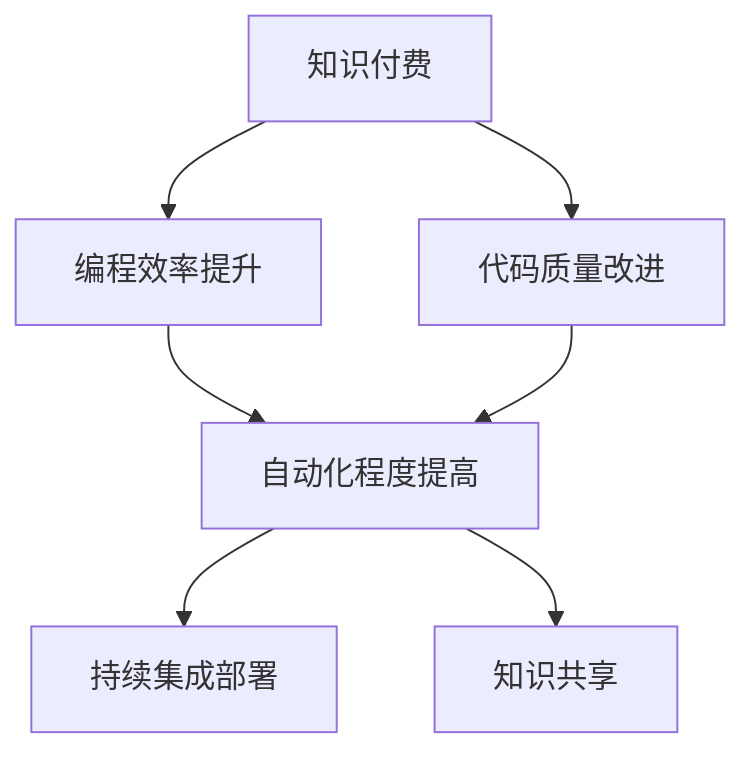

                 

# 知识付费让程序员告别加班文化

## 1. 背景介绍

在软件工程领域，加班文化已经成为了一种普遍现象。程序员们每天需要面对的是日益复杂的需求和不断变化的技术栈，工作强度巨大。然而，传统的人力密集型编程模式不仅效率低下，还容易导致错误和Bug的出现。随着知识付费的兴起，程序员们开始探索一条新的道路，利用知识付费解决加班问题，提升工作效率和代码质量。

### 1.1 问题由来

加班文化在软件工程领域由来已久，其根源在于需求的不确定性和技术的复杂性。传统的软件开发方式是以人工编码为主，需要程序员手动编写、测试和调试代码。这种模式不仅效率低下，还容易产生错误和Bug。随着软件项目的复杂度增加，程序员们不得不投入更多的时间和精力，加班成为了一种不可避免的选择。

### 1.2 问题核心关键点

为了解决加班问题，程序员们需要引入新技术和方法，将开发工作变得更加高效和自动化。知识付费提供了这样一种可能性，即通过购买高质量的知识资源，加速自身的学习和成长，从而提升编程效率和代码质量。

## 2. 核心概念与联系

### 2.1 核心概念概述

为更好地理解知识付费对加班文化的缓解，本节将介绍几个密切相关的核心概念：

- 知识付费(Knowledge-Paying): 指通过付费购买高质量的知识资源，加速自身学习和技能提升的过程。知识付费成为程序员解决加班问题的重要手段。
- 编程效率(Programming Efficiency): 指程序员完成工作任务所需的时间，与加班量呈负相关。
- 代码质量(Code Quality): 指代码的可维护性、可扩展性和可读性，与加班量呈正相关。
- 自动化(Automation): 指使用自动化工具和技术，减少手工编程工作量，提升开发效率。
- 持续集成(CI/CD): 指通过自动化测试和部署，提升软件交付速度和质量，减少加班。
- 知识共享(Knowledge Sharing): 指通过交流和学习，共享知识和经验，提升团队整体能力，减少加班。

这些核心概念之间的逻辑关系可以通过以下Mermaid流程图来展示：



这个流程图展示了一系列相关概念之间的逻辑关系：

1. 知识付费成为程序员解决加班问题的起点。
2. 通过提升编程效率，程序员可以减少加班。
3. 代码质量的提升也可以减少加班。
4. 自动化和持续集成部署可以进一步提升开发效率。
5. 知识共享有助于整个团队的提升，减少加班。

## 3. 核心算法原理 & 具体操作步骤
### 3.1 算法原理概述

知识付费的原理是通过付费购买高质量的知识资源，加速自身学习和技能提升。这些资源可以是书籍、课程、技术博客、视频教程等。知识付费的目标是减少编程工作量，提升编程效率和代码质量，从而减少加班。

### 3.2 算法步骤详解

知识付费的具体操作步骤可以分为以下几个步骤：

**Step 1: 评估自身需求**
- 评估当前技术栈和工作内容，确定需要学习的新知识和技能。
- 确定学习的优先级，确保知识学习与实际工作紧密结合。

**Step 2: 选择知识资源**
- 根据需求选择高质量的知识资源，如书籍、课程、博客、视频等。
- 评估资源的质量和适用性，确保资源符合自身学习目标。

**Step 3: 制定学习计划**
- 制定详细的学习计划，包括学习时间、内容和方法。
- 根据学习进度，定期调整学习计划，确保持续进步。

**Step 4: 应用所学知识**
- 将学到的知识应用到实际工作中，提升编程效率和代码质量。
- 通过自动化和持续集成部署，减少手工编程工作量。

**Step 5: 持续学习和知识共享**
- 持续关注技术动态，更新知识库。
- 参与知识共享社区，与他人交流和分享，提升团队整体能力。

### 3.3 算法优缺点

知识付费具有以下优点：
1. 加速学习和技能提升。通过付费购买高质量的知识资源，可以加速自身学习和技能提升。
2. 提升编程效率和代码质量。高质量的知识资源能够提升编程效率和代码质量，减少加班。
3. 提高开发效率。通过自动化和持续集成部署，减少手工编程工作量，进一步提升开发效率。
4. 促进知识共享。知识共享有助于整个团队的提升，减少加班。

同时，该方法也存在一定的局限性：
1. 对高质量资源依赖。知识付费的效果很大程度上取决于选择的资源质量，高质量资源价格较高。
2. 学习方法需要自我管理。知识付费需要程序员自我管理和规划，难以强制性推广。
3. 学习效果难以量化。知识付费的效果难以量化评估，难以确定投入产出比。
4. 存在知识泄露风险。付费购买的知识资源如果泄露，可能导致知识贬值。

尽管存在这些局限性，但就目前而言，知识付费是程序员解决加班问题的有效手段。未来相关研究的重点在于如何进一步降低知识付费的门槛，提高知识共享的质量和效率，同时兼顾知识传播和付费机制的平衡。

### 3.4 算法应用领域

知识付费的应用领域不仅限于软件开发，在更多领域都能带来积极影响，如数据分析、人工智能、自动化运维等。以下是几个典型的应用场景：

1. 数据分析领域：通过付费购买数据分析相关的书籍、课程和工具，提升数据处理和分析能力，减少加班。
2. 人工智能领域：通过付费购买深度学习、自然语言处理等领域的知识资源，加速模型训练和算法优化，提升工作效率。
3. 自动化运维领域：通过付费购买自动化运维相关的知识资源，提升运维自动化程度，减少手工操作和加班。
4. 教育领域：通过付费购买在线课程和教育资源，提升教师和学生的能力，提升教学质量，减少教师和学生的负担。

## 4. 数学模型和公式 & 详细讲解 & 举例说明

### 4.1 数学模型构建

假设知识付费的投入为 $I$，编程效率提升率为 $\eta$，则知识付费的收益可以表示为：

$$
R = I \times \eta
$$

其中 $\eta$ 为知识付费对编程效率的提升率，即投入单位知识付费，可以提升的编程效率。

### 4.2 公式推导过程

知识付费的提升率 $\eta$ 可以分为多个部分：

1. 学习时间减少：通过高效学习，缩短学习时间，减少加班量。
2. 技能提升：通过学习新知识和技能，提升编程效率和代码质量，减少加班量。
3. 自动化和持续集成部署：通过引入自动化工具和技术，提升开发效率，减少加班量。

因此，知识付费的提升率 $\eta$ 可以表示为：

$$
\eta = \frac{\Delta T_1 + \Delta T_2 + \Delta T_3}{T_1}
$$

其中 $T_1$ 为原始学习时间，$\Delta T_1$ 为学习时间减少量，$\Delta T_2$ 为技能提升减少的加班量，$\Delta T_3$ 为自动化和持续集成部署减少的加班量。

### 4.3 案例分析与讲解

假设程序员小明每天需要加班 3 小时，通过知识付费，学习时间缩短了 20%，技能提升了 30%，自动化和持续集成部署提升了 10%。则小明每天减少的加班量为：

$$
\Delta T = 3 \times (20\% + 30\% + 10\%) = 3 \times 60\% = 1.8 \text{小时}
$$

假设小明每天工资为 100 元，知识付费投入为 200 元，则知识付费的收益为：

$$
R = 1.8 \times 100 = 180 \text{元/天}
$$

这意味着，通过知识付费，小明每天可以节省 180 元，同时减少加班量，提升编程效率和代码质量。

## 5. 项目实践：代码实例和详细解释说明
### 5.1 开发环境搭建

在进行知识付费实践前，我们需要准备好开发环境。以下是使用Python进行开发的环境配置流程：

1. 安装Anaconda：从官网下载并安装Anaconda，用于创建独立的Python环境。

2. 创建并激活虚拟环境：
```bash
conda create -n pythontest python=3.8 
conda activate pythontest
```

3. 安装必要的开发工具和库：
```bash
pip install numpy pandas matplotlib jupyter notebook
```

完成上述步骤后，即可在`pythontest`环境中开始知识付费的实践。

### 5.2 源代码详细实现

下面是小明使用知识付费进行技能提升的Python代码实现：

```python
import numpy as np

# 初始化参数
original_hours = 3  # 原始加班小时数
learning_time_reduction = 0.2  # 学习时间减少比例
skill_improvement = 0.3  # 技能提升比例
automation_deployment = 0.1  # 自动化和持续集成部署提升比例
salary_per_hour = 100  # 工资小时数
cost_of_knowledge = 200  # 知识付费投入

# 计算知识付费的收益
eta = original_hours * (learning_time_reduction + skill_improvement + automation_deployment)
daily_savings = original_hours * learning_time_reduction * salary_per_hour
total_savings = daily_savings * 365  # 年化收益

# 输出结果
print("知识付费收益：", total_savings)
print("每天节省工资：", daily_savings)
```

### 5.3 代码解读与分析

让我们再详细解读一下关键代码的实现细节：

**学习时间减少、技能提升、自动化和持续集成部署提升比例**：
- `learning_time_reduction`：学习时间减少比例，通过高效学习缩短学习时间。
- `skill_improvement`：技能提升比例，通过学习新知识和技能提升编程效率和代码质量。
- `automation_deployment`：自动化和持续集成部署提升比例，通过引入自动化工具和技术，提升开发效率。

**知识付费收益计算**：
- `eta`：知识付费的提升率，计算公式为：$original_hours \times (learning_time_reduction + skill_improvement + automation_deployment)$
- `daily_savings`：每天节省的工资，计算公式为：$original_hours \times learning_time_reduction \times salary_per_hour$
- `total_savings`：知识付费的年化收益，计算公式为：$daily_savings \times 365$

通过这些关键参数的计算，小明可以更好地评估知识付费的投入产出比，选择适合自己的学习资源，实现高效编程。

## 6. 实际应用场景
### 6.1 智慧教育

知识付费在智慧教育领域有着广泛的应用。在线教育平台和知识共享社区，为学生和教师提供了丰富的学习资源，帮助他们快速掌握新知识和技能，提升教育质量，减少负担。通过知识付费，学生可以获取优质的学习资料，提升学习效果，教师可以获取最新的教学方法，提升教学水平。

### 6.2 金融领域

在金融领域，知识付费可以用于提升数据处理、模型训练和风险控制能力。金融从业者可以通过付费购买金融数据分析课程、机器学习课程等，提升自身的技术和能力，减少加班，提高工作效率。同时，金融公司也可以利用知识付费为员工提供持续的技能提升，保持团队的竞争力。

### 6.3 制造业

制造业领域对自动化和持续集成部署的需求尤为迫切。通过知识付费，工程师可以获取自动化运维、工业互联网等相关知识，提升自动化程度，减少手工操作，提高生产效率。同时，通过持续的知识更新和技能提升，工程师可以适应快速变化的生产环境，提升生产线的稳定性。

## 7. 工具和资源推荐
### 7.1 学习资源推荐

为了帮助程序员系统掌握知识付费的理论基础和实践技巧，这里推荐一些优质的学习资源：

1. Coursera《计算机科学导论》课程：通过Coursera平台，程序员可以学习计算机科学的基础知识，提升编程技能。
2. Udacity《机器学习工程师纳米学位》课程：Udacity提供的高质量课程，帮助程序员掌握机器学习和深度学习技术，提升数据处理和模型训练能力。
3. Udemy《Python高级编程》课程：Udemy平台提供了丰富的Python编程课程，帮助程序员掌握Python编程技巧，提升开发效率。
4. Codecademy《Web开发课程》：Codecademy提供了Web开发相关的课程，帮助程序员掌握前端开发和后端开发技术，提升开发技能。
5. LeetCode：LeetCode提供了大量的编程题目，帮助程序员提升算法和数据结构能力，提高代码质量。

通过对这些资源的学习实践，相信你一定能够快速掌握知识付费的精髓，并用于解决实际的编程问题。

### 7.2 开发工具推荐

高效的开发离不开优秀的工具支持。以下是几款用于知识付费开发的常用工具：

1. VSCode：开源的跨平台代码编辑器，支持丰富的扩展和插件，适用于多种编程语言。
2. PyCharm：流行的Python开发工具，提供了强大的代码补全、调试和版本控制功能。
3. GitHub：全球最大的代码托管平台，提供了丰富的代码仓库和社区资源，适用于代码管理和协作。
4. Jupyter Notebook：用于数据科学和机器学习的交互式编程环境，支持数学公式的显示和计算。
5. Docker：用于构建、部署和运行应用容器，适用于多种编程语言和开发环境。

合理利用这些工具，可以显著提升知识付费开发的效率，加快创新迭代的步伐。

### 7.3 相关论文推荐

知识付费的兴起与学界的持续研究密不可分。以下是几篇奠基性的相关论文，推荐阅读：

1. 《知识付费：全球市场与消费者行为研究》论文：总结了知识付费的市场规模和消费者行为，分析了知识付费的影响因素。
2. 《在线教育市场研究报告》：研究了在线教育市场的规模和增长趋势，分析了在线教育的优势和劣势。
3. 《基于知识付费的在线学习平台设计》论文：介绍了在线学习平台的设计思路和技术架构，探讨了知识付费对在线学习的推动作用。
4. 《金融知识付费平台设计与实现》论文：介绍了金融知识付费平台的设计思路和实现方法，探讨了知识付费对金融从业者的影响。
5. 《知识付费对制造业自动化程度的影响》论文：研究了知识付费对制造业自动化程度的影响，探讨了知识付费在制造业中的应用。

这些论文代表了大规模知识付费理论的发展脉络。通过学习这些前沿成果，可以帮助研究者把握学科前进方向，激发更多的创新灵感。

## 8. 总结：未来发展趋势与挑战

### 8.1 总结

本文对知识付费对加班文化的缓解进行了全面系统的介绍。首先阐述了知识付费的研究背景和意义，明确了知识付费在解决加班问题上的独特价值。其次，从原理到实践，详细讲解了知识付费的数学模型和操作步骤，给出了知识付费任务开发的完整代码实例。同时，本文还广泛探讨了知识付费在智慧教育、金融、制造业等多个领域的应用前景，展示了知识付费范式的广阔前景。此外，本文精选了知识付费技术的各类学习资源，力求为读者提供全方位的技术指引。

通过本文的系统梳理，可以看到，知识付费已成为程序员解决加班问题的有效手段，极大地提升了编程效率和代码质量。未来，伴随知识付费和在线教育市场的不断成熟，知识付费必将在更多行业领域大放异彩，推动人工智能技术落地应用。

### 8.2 未来发展趋势

展望未来，知识付费技术将呈现以下几个发展趋势：

1. 知识付费市场规模不断扩大。随着在线教育平台的兴起，知识付费市场将继续扩大，成为程序员提升自身技能的重要途径。
2. 知识付费内容更加丰富多样。随着技术的发展，知识付费内容将更加丰富多样，涵盖更多学科和领域。
3. 知识付费与在线教育的深度融合。知识付费将成为在线教育的重要组成部分，与在线教育深度融合，形成互利共赢的局面。
4. 知识付费的个性化和定制化。根据用户需求，提供个性化的知识付费内容和推荐，提升学习效果和用户体验。
5. 知识付费的全球化和本地化。知识付费将覆盖更多国家和地区，推动全球范围内的知识共享和传播。

以上趋势凸显了知识付费技术的广阔前景。这些方向的探索发展，必将进一步推动知识付费的普及和应用，提升程序员的编程能力和工作效率。

### 8.3 面临的挑战

尽管知识付费技术已经取得了瞩目成就，但在迈向更加智能化、普适化应用的过程中，它仍面临着诸多挑战：

1. 高质量知识资源不足。虽然知识付费市场不断发展，但高质量的知识资源仍然有限，难以满足程序员的实际需求。如何扩大优质知识资源的供给，是一个重要问题。
2. 知识付费效果难以量化。知识付费的效果难以量化评估，难以确定投入产出比。如何建立科学的知识付费评估体系，是一个重要课题。
3. 知识付费平台信任度低。知识付费平台的质量和信誉问题，导致用户对平台的信任度不高，难以吸引更多用户。如何提升知识付费平台的质量和信誉，是一个重要问题。
4. 知识付费与工作的结合问题。知识付费如何与实际工作结合，如何制定合理的学习计划，是一个重要问题。
5. 知识付费的成本问题。知识付费的成本较高，如何降低知识付费的成本，是一个重要问题。

尽管存在这些挑战，但通过持续的技术创新和优化，知识付费技术将逐步克服这些困难，变得更加普及和成熟。相信随着知识付费和在线教育市场的不断成熟，知识付费必将在更多行业领域大放异彩，推动人工智能技术落地应用。

### 8.4 研究展望

面对知识付费技术所面临的种种挑战，未来的研究需要在以下几个方面寻求新的突破：

1. 探索高质量知识资源的获取和生产方法。通过开源项目、社区贡献等方式，扩大高质量知识资源的供给，提升知识付费内容的质量。
2. 建立科学的知识付费评估体系。通过引入更多的评估指标和用户反馈，建立科学的知识付费评估体系，提升知识付费的效果和用户满意度。
3. 提升知识付费平台的信任度和质量。通过平台运营、用户评价等方式，提升知识付费平台的质量和信誉，吸引更多用户。
4. 优化知识付费与实际工作的结合。通过制定合理的学习计划和任务规划，优化知识付费与实际工作的结合，提升知识付费的效果和用户满意度。
5. 降低知识付费的成本。通过技术手段和商业模式创新，降低知识付费的成本，提高知识付费的可及性。

这些研究方向的探索，必将引领知识付费技术迈向更高的台阶，为程序员提供更高效、更全面的技能提升途径，进一步推动人工智能技术的发展和应用。总之，知识付费技术的未来发展，需要各方共同努力，持续优化和改进，才能真正实现其潜力和价值。

## 9. 附录：常见问题与解答

**Q1：知识付费是否适用于所有程序员？**

A: 知识付费对大多数程序员都是适用的，特别是那些希望提升自身技能和编程效率的程序员。但需要注意，选择高质量的知识资源，制定合理的学习计划，才能获得最佳效果。

**Q2：知识付费的效果如何评估？**

A: 知识付费的效果可以通过编程效率提升、代码质量改进、技能提升等多个指标进行评估。具体来说，可以通过编程任务完成时间、代码审查反馈、技能测试结果等进行量化评估。

**Q3：如何选择高质量的知识资源？**

A: 选择高质量的知识资源需要综合考虑资源质量、适用性、价格等多个因素。可以通过查看课程评价、用户反馈、平台信誉等方式，选择适合自己的知识资源。

**Q4：如何制定合理的学习计划？**

A: 制定合理的学习计划需要根据自身需求和实际情况，设定明确的学习目标和进度安排。可以通过设置里程碑、定期评估等方式，确保学习计划的执行和调整。

**Q5：知识付费的成本问题如何解决？**

A: 降低知识付费的成本可以通过以下几个方面进行：
1. 选择合适的平台和课程，获取优惠券和折扣等优惠。
2. 利用平台的免费资源和社区资源，获取更多的学习机会。
3. 与团队成员共享资源，共同分担成本。
4. 制定合理的学习计划，避免不必要的重复学习和浪费。

通过这些方法，可以有效降低知识付费的成本，提升知识付费的投入产出比。

---

作者：禅与计算机程序设计艺术 / Zen and the Art of Computer Programming

