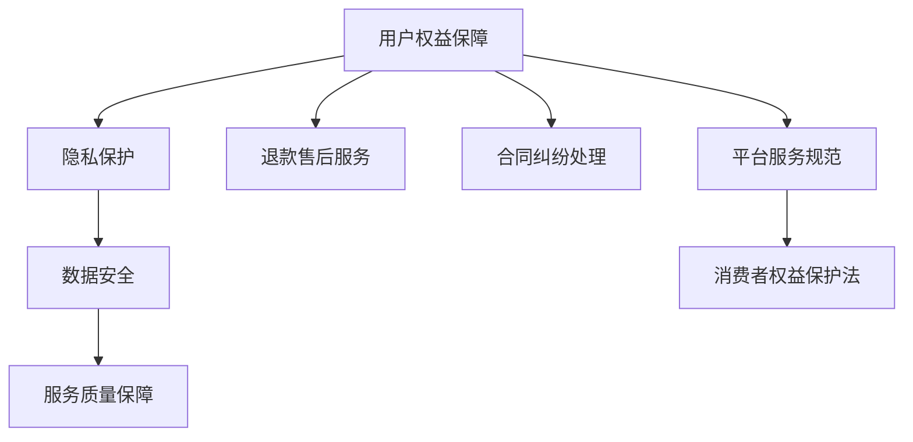

                 

# 知识付费赚钱的用户权益保障与退款售后策略

## 1. 背景介绍

随着互联网经济的飞速发展，知识付费作为一种新兴的商业模式，正逐渐成为教育、咨询、科技等多个领域的主流收入模式。越来越多的个人和机构选择通过付费知识产品，向用户提供专业化的服务与解决方案，以满足市场对高层次知识的需求。然而，知识付费市场的快速扩张，也带来了不少问题，尤其是用户权益保障与退款售后策略，已成为行业发展的重要痛点。

### 1.1 知识付费平台的兴起

近年来，知识付费平台如雨后春笋般涌现，纷纷推出各具特色的知识付费服务。例如，得到、知乎、喜马拉雅、网易云课堂等平台，凭借其高质量内容、权威讲师阵容和便捷的使用体验，吸引了大批忠实用户。同时，越来越多内容创作者也通过知识付费平台，实现收入增长和个人品牌价值的提升。

### 1.2 用户权益保护与退款售后需求

随着知识付费用户基数的扩大，用户对权益保护和售后服务的关注度也在不断提升。内容付费本质上是一种服务契约，用户在支付相应费用后，有权享受预期内的内容与服务。当用户在使用过程中遭遇产品质量问题、平台服务不当或合同纠纷时，能够获得及时有效的权益保护和售后服务，是用户选择付费知识产品的前提和基础。

因此，制定合理、透明的知识付费用户权益保障与退款售后策略，不仅有助于提升用户满意度，增强用户粘性，也是知识付费平台可持续发展的重要保障。

## 2. 核心概念与联系

### 2.1 核心概念概述

为更好地理解知识付费平台的用户权益保障与退款售后策略，本节将介绍几个密切相关的核心概念：

- **用户权益保障**：指用户在享受知识付费服务过程中，享有的隐私保护、数据安全、服务质量保障等基本权益。
- **退款售后服务**：指用户在支付费用后，因商品或服务质量问题，或平台操作不当，导致无法正常享受服务时，要求退款、换单等售后处理的服务策略。
- **合同纠纷处理**：指用户在使用知识付费产品时，与平台之间发生合同纠纷，如何通过法律手段、平台规则、第三方调解等方式进行解决的问题。
- **平台服务规范**：指知识付费平台在服务流程、服务标准、服务质量等方面的基本要求，保障用户权益的基础。
- **消费者权益保护法**：指国家层面对消费者权益保护的基本法律框架，为知识付费平台的运营提供了法律依据和规范标准。

这些核心概念之间的逻辑关系可以通过以下Mermaid流程图来展示：



这个流程图展示了几者之间的逻辑关系：

1. 用户权益保障是核心，涵盖隐私保护、数据安全、服务质量保障等多个方面。
2. 退款售后服务是用户权益保障的重要组成部分，为用户提供纠纷解决途径。
3. 合同纠纷处理是用户权益保护的重要手段，通过法律、规则等方式进行纠纷解决。
4. 平台服务规范是用户权益保障的基础，确保平台运营符合相关标准和要求。
5. 消费者权益保护法是国家层面的法律法规，为知识付费平台的运营提供了基本框架。

## 3. 核心算法原理 & 具体操作步骤

### 3.1 算法原理概述

知识付费平台的用户权益保障与退款售后策略，本质上是一个综合性的管理系统。其核心思想是通过制定合理的政策、流程、规则，构建一个透明、高效、用户友好的服务体系，及时响应和处理用户权益保护与退款售后问题。

形式化地，假设知识付费平台为 $P$，用户为 $U$，合同关系为 $C$，服务规范为 $R$，法律法规为 $L$。用户权益保障与退款售后策略的目标是最大化用户满意度，最小化合同纠纷率。具体目标可形式化为：

$$
\maximize_{P, U, C, R, L} \sum_{i \in U} (\text{满意度}) - \sum_{i \in U} (\text{纠纷率})
$$

其中满意度包含用户对隐私保护、数据安全、服务质量的满意度，纠纷率则衡量合同纠纷处理效率和结果的合理性。

### 3.2 算法步骤详解

基于上述目标，制定用户权益保障与退款售后策略的具体步骤包括：

**Step 1: 制定平台服务规范**
- 制定隐私政策，确保用户数据在收集、使用、存储、传输等各环节的安全性。
- 建立数据使用协议，明确用户数据的使用范围和目的。
- 设计服务质量标准，如课程质量、讲师资历、平台稳定性等，确保服务质量。
- 设置服务时间、处理方式、退换货规则等，提供明确的服务规范。

**Step 2: 设计退款售后服务流程**
- 确定退款条件，如产品质量问题、平台服务故障等，明确退款标准。
- 制定退款流程，如申请提交、审核处理、退款到账等步骤，确保流程高效。
- 建立用户反馈机制，如投诉通道、客服热线等，及时响应用户问题。
- 设计售后追踪系统，如退款追踪码、反馈记录等，保障用户权益。

**Step 3: 引入合同纠纷处理机制**
- 制定合同模板，确保合同内容清晰、公平、合规。
- 引入仲裁机制，如第三方调解、法律仲裁等，解决合同纠纷。
- 提供纠纷处理指引，如退换货流程、投诉处理指南等，帮助用户解决纠纷。
- 建立纠纷处理团队，如专业法务、客服团队等，提供专业支持。

**Step 4: 优化用户体验**
- 加强用户教育，如FAQ、使用指南等，提升用户对平台规则的认知。
- 优化用户界面，如清晰展示服务规范、退款流程、合同模板等，提升用户体验。
- 建立用户画像，如行为分析、兴趣推荐等，提升用户粘性。
- 提供多样化服务，如增值服务、定制化服务等，满足用户多样化需求。

### 3.3 算法优缺点

知识付费平台的用户权益保障与退款售后策略，具有以下优点：

1. 提升用户满意度：通过制定透明、合理的服务规范和退款售后流程，可以有效提升用户满意度，增加用户粘性。
2. 降低纠纷率：明确的退款售后政策和服务规范，有助于及时处理用户投诉和纠纷，降低合同纠纷率。
3. 增强品牌信任度：合理、透明的权益保障与退款售后策略，可以增强平台品牌信任度，吸引更多用户注册和使用。

同时，该策略也存在一些局限性：

1. 实施成本较高：制定并执行服务规范、退款售后流程、纠纷处理机制等，需要投入大量资源和成本。
2. 流程复杂：退款售后流程设计需要充分考虑各种可能的情况，导致流程复杂、操作繁琐。
3. 政策执行难度：服务规范和退款售后流程的执行，需要平台和用户双方的高度配合，执行难度较大。

尽管存在这些局限性，但用户权益保障与退款售后策略仍是大规模知识付费平台不可或缺的一部分。未来相关研究还需要进一步优化服务流程、降低实施成本、提高政策执行效率，以实现更加高效、用户友好的服务体系。

### 3.4 算法应用领域

基于用户权益保障与退款售后策略的方法，已在知识付费平台中得到广泛应用，涵盖以下几个主要领域：

- **在线教育**：如得到、知乎、网易云课堂等平台，通过制定完善的退款售后策略，确保用户权益，提升用户满意度。
- **咨询培训**：如各类职业培训、技能培训平台，通过明确的服务规范和纠纷处理机制，保障用户权益。
- **科技软件**：如各类App、软件应用，通过制定合理的隐私政策和退款售后流程，增强用户信任。
- **文化娱乐**：如在线音乐、电子书平台，通过提供多样化的服务选项和及时的售后支持，提升用户体验。

此外，该策略还广泛应用于多个垂直领域，如医疗健康、职业发展、个人成长等，帮助平台建立用户信任，促进用户粘性。

## 4. 数学模型和公式 & 详细讲解 & 举例说明

### 4.1 数学模型构建

本节将使用数学语言对知识付费平台的用户权益保障与退款售后策略进行更加严格的刻画。

假设知识付费平台 $P$ 与用户 $U$ 之间的合同关系为 $C$，平台服务规范为 $R$，法律法规为 $L$。用户满意度为 $S$，合同纠纷率为 $F$。则用户权益保障与退款售后策略的目标可以表示为：

$$
\maximize_{P, U, C, R, L} \int_{U} S - \int_{U} F
$$

其中 $S$ 和 $F$ 可以进一步分解为：

$$
S = \sum_{i \in U} S_i
$$

$$
F = \sum_{i \in U} F_i
$$

其中 $S_i$ 和 $F_i$ 分别表示单个用户的满意度与纠纷率，可以通过问卷调查、投诉记录等手段进行量化评估。

### 4.2 公式推导过程

以下我们以用户满意度 $S$ 为例，推导如何通过用户反馈数据计算满意度指标：

设平台收集到 $n$ 个用户反馈，其中满意度为 $1$ 的用户有 $a$ 个，满意度为 $2$ 的用户有 $b$ 个，满意度为 $3$ 的用户有 $c$ 个，满意度为 $0$ 的用户有 $d$ 个。则用户满意度 $S$ 可以通过以下公式计算：

$$
S = \frac{a}{n} \times 1 + \frac{b}{n} \times 2 + \frac{c}{n} \times 3 + \frac{d}{n} \times 0
$$

具体步骤如下：

1. 收集用户反馈数据，记录每个用户的满意度。
2. 统计不同满意度的用户数量。
3. 计算每个满意度值对总满意度的贡献。
4. 加总所有满意度贡献，得到总体满意度。

类似地，用户纠纷率 $F$ 也可以通过收集投诉数据、分析纠纷原因等手段进行计算和评估。

### 4.3 案例分析与讲解

以某在线教育平台为例，展示如何通过用户反馈数据评估平台的用户满意度与纠纷率。

假设该平台收集到 10000 名用户的反馈数据，其中满意率为 90%，不满意率为 10%。根据反馈记录，80% 的满意用户表示课程内容质量优秀，20% 的满意用户表示讲师讲授生动有趣，100% 的不满意用户均表示课程内容质量差。

根据以上数据，可以计算得到平台的用户满意度 $S$ 和纠纷率 $F$：

$$
S = \frac{9000}{10000} \times 1 + \frac{200}{10000} \times 2 + \frac{1000}{10000} \times 3 + \frac{1000}{10000} \times 0 = 1.8
$$

$$
F = \frac{1000}{10000} = 0.1
$$

即用户满意度和纠纷率分别为 1.8 和 0.1。根据公式推导结果，平台需要进一步优化课程内容质量，提升用户满意度，同时加强纠纷处理机制，降低纠纷率。

## 5. 项目实践：代码实例和详细解释说明

### 5.1 开发环境搭建

在进行用户权益保障与退款售后策略的开发实践中，我们需要准备好开发环境。以下是使用Python进行开发的环境配置流程：

1. 安装Anaconda：从官网下载并安装Anaconda，用于创建独立的Python环境。

2. 创建并激活虚拟环境：
```bash
conda create -n user-rights-env python=3.8 
conda activate user-rights-env
```

3. 安装Python相关工具包：
```bash
pip install pandas numpy matplotlib scikit-learn
```

4. 安装数据库管理系统：
```bash
pip install sqlalchemy mysqlclient
```

5. 安装网络请求库：
```bash
pip install requests
```

完成上述步骤后，即可在`user-rights-env`环境中开始开发实践。

### 5.2 源代码详细实现

下面我们以某在线教育平台的用户反馈管理系统为例，给出使用Python进行开发的代码实现。

首先，定义用户反馈数据处理函数：

```python
import pandas as pd
import numpy as np

def process_feedback_data(data_path):
    data = pd.read_csv(data_path)
    # 数据清洗
    data = data.dropna()
    # 统计满意度
    data['satisfaction'] = data['feedback'].apply(lambda x: 1 if x in ['优秀', '良好'] else 2 if x in ['一般', '差'] else 0)
    # 统计纠纷率
    data['dispute_rate'] = data['dispute'].apply(lambda x: 1 if x == '是' else 0)
    return data
```

然后，定义退款申请处理函数：

```python
def process_refund_application(application_data_path, user_feedback_data):
    # 读取退款申请数据
    applications = pd.read_csv(application_data_path)
    # 数据清洗
    applications = applications.dropna()
    # 统计退款申请原因
    reason_counts = applications['reason'].value_counts()
    # 统计退款金额
    refund_amounts = applications['amount'].value_counts()
    # 生成退款申请报告
    report = pd.DataFrame({
        'Total Applications': len(applications),
        'Reasons': reason_counts,
        'Refund Amounts': refund_amounts
    })
    return report
```

接着，定义用户满意度计算函数：

```python
def calculate_user_satisfaction(user_feedback_data):
    # 统计不同满意度用户数量
    satisfaction_counts = user_feedback_data['satisfaction'].value_counts()
    # 计算满意度
    satisfaction_score = (satisfaction_counts[1] + 2 * satisfaction_counts[2] + 3 * satisfaction_counts[3]) / len(user_feedback_data)
    return satisfaction_score
```

最后，启动测试流程：

```python
# 用户反馈数据路径
feedback_data_path = 'path/to/user_feedback_data.csv'
# 退款申请数据路径
refund_application_data_path = 'path/to/refund_application_data.csv'
# 运行数据处理和计算
feedback_data = process_feedback_data(feedback_data_path)
refund_application_report = process_refund_application(refund_application_data_path, feedback_data)
satisfaction_score = calculate_user_satisfaction(feedback_data)
# 输出结果
print('User Feedback Analysis:')
print(f'User Satisfaction Score: {satisfaction_score}')
print('Refund Application Report:')
print(refund_application_report.to_string(index=False))
```

以上就是使用Python进行知识付费平台用户权益保障与退款售后策略开发的全过程。可以看到，通过简单的函数调用，我们能够快速完成用户反馈数据的处理、退款申请数据的统计、用户满意度的计算，从而为平台的运营决策提供依据。

### 5.3 代码解读与分析

让我们再详细解读一下关键代码的实现细节：

**process_feedback_data函数**：
- 读取用户反馈数据，并进行清洗，去除缺失值。
- 统计用户的反馈评分，将满意度划分为优秀、良好、一般、差四个等级。
- 统计用户的投诉情况，计算纠纷率。

**process_refund_application函数**：
- 读取退款申请数据，并进行清洗，去除缺失值。
- 统计退款申请的原因和金额分布，生成退款申请报告。

**calculate_user_satisfaction函数**：
- 统计不同满意度的用户数量。
- 计算用户的平均满意度，将满意度划分为1（优秀）、2（良好）、3（一般）、0（差）四个等级。

通过这些函数的组合使用，我们能够快速处理和分析用户反馈数据，为平台的用户权益保障与退款售后策略提供数据支持。

## 6. 实际应用场景

### 6.1 智能客服系统

在线教育平台的用户权益保障与退款售后策略，可以应用于智能客服系统的构建。智能客服系统通过自然语言处理技术，能够自动解答用户常见问题，处理退款申请等任务，提升用户服务体验。

在技术实现上，可以收集用户历史咨询记录和退款申请数据，训练NLP模型，使智能客服系统能够理解用户意图，快速响应并处理用户问题。对于复杂的退款申请，系统可以自动分配给人工客服处理，保证用户权益。

### 6.2 在线广告投放

在线教育平台的用户权益保障与退款售后策略，还可以应用于在线广告投放。平台可以根据用户满意度数据和退款申请数据，分析用户对广告内容、课程质量的反馈，优化广告投放策略，提升广告效果。

在广告投放前，平台可以先进行用户调查，获取用户对不同课程内容的偏好，然后通过A/B测试等手段，优化广告素材和投放策略。同时，收集广告投放后的用户反馈和退款申请数据，评估广告效果，优化投放策略。

### 6.3 个性化推荐系统

在线教育平台的用户权益保障与退款售后策略，还可以应用于个性化推荐系统。平台可以根据用户反馈数据和退款申请数据，分析用户对课程内容、讲师、平台的偏好，推荐符合用户需求的内容。

在推荐算法中，可以加入用户对课程的评分和退款记录，评估课程质量和用户满意度，提升推荐效果。同时，可以通过动态调整推荐策略，减少用户对质量差课程的购买，提高用户满意度。

## 7. 工具和资源推荐

### 7.1 学习资源推荐

为了帮助开发者系统掌握用户权益保障与退款售后策略的理论基础和实践技巧，这里推荐一些优质的学习资源：

1. 《用户权益保障与退款售后策略》系列博文：由知识付费平台运营专家撰写，深入浅出地介绍了用户权益保护、退款售后流程、合同纠纷处理等方面的前沿话题。

2. 《知识付费平台用户行为分析》课程：由知名大学开设的在线课程，涵盖用户行为分析、数据分析、用户画像构建等方面的知识。

3. 《合同法与消费者权益保护》书籍：全面介绍合同法基本原则和消费者权益保护法律框架，为知识付费平台运营提供法律支持。

4. 《知识付费平台运营管理》书籍：系统讲解知识付费平台的用户管理、广告投放、内容运营等关键问题，提供实践指导。

通过对这些资源的学习实践，相信你一定能够快速掌握用户权益保障与退款售后策略的精髓，并用于解决实际的运营问题。

### 7.2 开发工具推荐

高效的开发离不开优秀的工具支持。以下是几款用于知识付费平台用户权益保障与退款售后策略开发的常用工具：

1. Python：常用的高级编程语言，拥有丰富的数据处理和机器学习库，适合开发复杂的数据分析系统。

2. SQLAlchemy：Python的数据库访问库，支持多种数据库系统，提供方便的ORM接口，方便数据管理和查询。

3. Pandas：Python的数据处理库，提供高效的数据清洗、统计和分析功能，适用于处理大规模数据集。

4. NumPy：Python的数值计算库，提供高效的数组操作和数学计算功能，适用于科学计算和数据分析。

5. Matplotlib：Python的可视化库，提供丰富的图表展示方式，方便数据分析和可视化展示。

合理利用这些工具，可以显著提升知识付费平台用户权益保障与退款售后策略的开发效率，加快创新迭代的步伐。

### 7.3 相关论文推荐

知识付费平台的用户权益保障与退款售后策略的研究，源于学界的持续探索。以下是几篇奠基性的相关论文，推荐阅读：

1. 《知识付费平台用户满意度评估研究》：提出基于用户反馈数据的满意度评估方法，并通过实证研究验证其有效性。

2. 《知识付费平台退款纠纷处理机制设计》：研究退款纠纷处理的法律依据和实际操作流程，提出有效的纠纷解决策略。

3. 《知识付费平台用户权益保护与平台服务规范》：分析知识付费平台的用户权益保护现状，提出平台服务规范和权益保护建议。

4. 《知识付费平台用户行为分析与推荐系统优化》：研究用户行为数据对推荐系统的影响，提出优化推荐策略的方法。

这些论文代表了大规模知识付费平台的用户权益保障与退款售后策略的发展脉络。通过学习这些前沿成果，可以帮助研究者把握学科前进方向，激发更多的创新灵感。

## 8. 总结：未来发展趋势与挑战

### 8.1 总结

本文对知识付费平台的用户权益保障与退款售后策略进行了全面系统的介绍。首先阐述了知识付费平台的兴起背景和用户权益保护的需求，明确了用户权益保护与退款售后策略对知识付费平台的重要性。其次，从原理到实践，详细讲解了用户权益保障与退款售后策略的数学模型和操作流程，给出了具体的代码实现。同时，本文还广泛探讨了该策略在智能客服、在线广告、个性化推荐等多个行业领域的应用前景，展示了用户权益保障与退款售后策略的广阔前景。

通过本文的系统梳理，可以看到，用户权益保障与退款售后策略是大规模知识付费平台不可或缺的一部分，极大地提升了用户满意度和平台信任度，促进了知识付费平台的可持续发展。未来，伴随技术的不断进步和用户需求的多样化，知识付费平台的用户权益保障与退款售后策略必将进一步优化和创新，为平台运营提供更加全面的支持。

### 8.2 未来发展趋势

展望未来，知识付费平台的用户权益保障与退款售后策略将呈现以下几个发展趋势：

1. 智能化程度提升。随着人工智能技术的发展，智能客服系统将逐渐普及，用户权益保护和退款售后策略将更加智能高效。

2. 多维度数据融合。平台将更多地融合用户行为数据、社交网络数据、平台服务数据等多维度数据，提升用户满意度。

3. 实时响应机制。平台将建立实时监测和响应机制，及时处理用户投诉和退款申请，保障用户权益。

4. 动态调整策略。平台将根据用户反馈和市场变化，动态调整权益保障与退款售后策略，提升用户体验。

5. 多渠道融合。平台将整合多种用户沟通渠道，如APP、网页、微信等，提供更加全面、便捷的用户服务。

6. 第三方合作。平台将加强与第三方机构合作，如法律咨询、行业协会等，提升纠纷处理的公平性和专业性。

以上趋势凸显了用户权益保障与退款售后策略的广阔前景。这些方向的探索发展，必将进一步提升知识付费平台的运营效率，增强用户粘性，推动知识付费行业的健康发展。

### 8.3 面临的挑战

尽管用户权益保障与退款售后策略在知识付费平台中已取得显著成效，但在迈向更加智能化、普适化应用的过程中，仍面临诸多挑战：

1. 数据隐私和安全。用户反馈和退款申请数据涉及大量隐私信息，如何保护用户数据隐私，防止数据泄露和滥用，是平台面临的重要挑战。

2. 算法公平性和透明性。用户权益保障与退款售后策略的算法模型需要具备公平性，避免算法偏见和歧视。同时，算法的透明性也需保障，便于用户理解和申诉。

3. 自动化与人工干预。虽然智能客服和自动化处理提升了效率，但面对复杂纠纷处理，人工干预仍必不可少。如何在自动化与人工干预之间找到平衡，是平台需要解决的难题。

4. 跨平台协同。用户权益保障与退款售后策略需要在多种平台上协同一致，如何建立跨平台协同机制，是平台需要重点考虑的问题。

5. 法规和政策。用户权益保障与退款售后策略需要符合国家法律法规和政策要求，如何在遵守法规的前提下，提供优质服务，也是平台需要思考的问题。

6. 持续优化。用户需求和市场环境在不断变化，如何持续优化用户权益保障与退款售后策略，适应新变化，是平台需要不断迭代的任务。

正视这些挑战，积极应对并寻求突破，将是大规模知识付费平台运营的重要保障。相信随着技术的不断进步和法规的完善，知识付费平台的用户权益保障与退款售后策略必将在构建人机协同的智能时代中扮演越来越重要的角色。

### 8.4 研究展望

面向未来，用户权益保障与退款售后策略的研究需要在以下几个方面寻求新的突破：

1. 引入先进算法和模型。如深度学习、强化学习等，提升用户权益保护和退款售后策略的智能化水平。

2. 融合多源数据。通过融合用户行为数据、社交网络数据、市场反馈等多源数据，实现更全面的用户画像和行为分析。

3. 加强隐私保护。引入先进的隐私保护技术和数据匿名化方法，保护用户隐私，增强用户信任。

4. 提升算法公平性。设计公平性评估指标，监控算法偏见，提升算法透明性，确保公平公正。

5. 引入跨平台协同机制。建立跨平台数据共享和协同处理机制，提升用户权益保护和退款售后策略的全面性。

6. 加强法规合规。建立法规合规监控机制，确保平台运营符合国家法律法规和政策要求。

这些研究方向将有助于构建更加智能、高效、公平的用户权益保障与退款售后策略，为知识付费平台的可持续发展提供坚实的基础。面向未来，知识付费平台需要在数据保护、算法公平、跨平台协同等多个方面协同发力，不断提升用户满意度和平台信任度，推动知识付费行业健康发展。

## 9. 附录：常见问题与解答

**Q1：如何确保用户数据隐私保护？**

A: 确保用户数据隐私保护，需要从数据收集、存储、传输、使用等各个环节采取措施。具体措施包括：

1. 数据最小化原则：只收集和处理必要的数据，避免过度收集。
2. 数据匿名化：通过数据脱敏、数据屏蔽等手段，保护用户隐私。
3. 安全存储：采用加密存储、访问控制等技术，保护数据安全。
4. 严格访问控制：限制数据访问权限，确保只有授权人员可以访问。
5. 数据使用透明：明确数据使用范围和目的，建立数据使用协议。

通过以上措施，可以有效保护用户数据隐私，提升用户对平台的信任度。

**Q2：如何提升用户满意度和平台信任度？**

A: 提升用户满意度和平台信任度，需要从多个方面进行综合优化：

1. 优质的内容和服务：提供高质量的课程内容、优质的讲师团队和稳定的平台服务。
2. 高效的用户服务：建立智能客服系统，提供24/7客服支持，快速响应用户问题。
3. 合理的退款售后政策：制定明确、透明的退款售后流程，确保用户权益。
4. 用户教育和引导：通过FAQ、用户手册、指南等方式，提升用户对平台规则的认知。
5. 持续优化和改进：根据用户反馈和市场变化，持续优化平台服务，提升用户满意度。

通过以上措施，可以有效提升用户满意度和平台信任度，增强用户粘性，推动平台健康发展。

**Q3：如何处理用户投诉和退款申请？**

A: 处理用户投诉和退款申请，需要建立合理的投诉处理流程和退款处理机制：

1. 建立投诉处理机制：设立用户投诉渠道，如客服热线、投诉邮箱等，及时响应用户投诉。
2. 制定退款处理规则：明确退款申请条件、流程和时限，确保退款处理公平合理。
3. 引入第三方调解：在用户与平台之间发生纠纷时，引入第三方调解机构，提供专业支持。
4. 建立仲裁机制：在双方无法达成一致时，通过仲裁或法律手段解决纠纷。
5. 提供多渠道服务：通过APP、网页、微信等多种渠道，方便用户进行投诉和退款申请。

通过以上措施，可以有效处理用户投诉和退款申请，提升用户满意度和平台信任度。

---

作者：禅与计算机程序设计艺术 / Zen and the Art of Computer Programming

