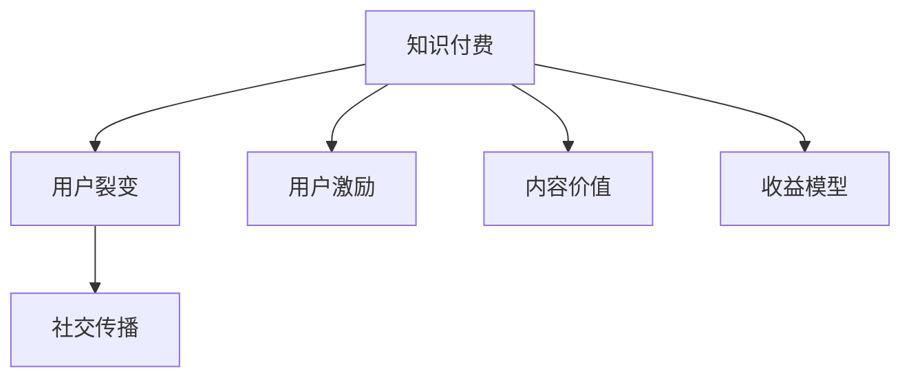

                 

# 知识付费赚钱的用户裂变与社交传播策略

> 关键词：知识付费、用户裂变、社交传播、收益模型、用户激励、营销策略

## 1. 背景介绍

### 1.1 问题由来
在互联网经济时代，内容是核心竞争力，而知识付费正是一种获取高质量内容的新型模式。相较于传统的免费阅读模式，知识付费能够帮助创作者获得更多的经济收益，激励其产出高质量的内容；同时也能保证用户获取的知识和信息更加精准、全面，提升用户的知识获取效率。然而，知识付费平台普遍面临用户增长难题，如何有效地扩大用户规模、提高用户留存率，成为平台需要解决的重要问题。

### 1.2 问题核心关键点
为了解决知识付费平台的增长问题，需要从用户裂变和社交传播两方面入手，构建一套行之有效的用户增长和收益模型。

1. **用户裂变**：通过合适的激励机制，使得现有用户主动邀请新用户，实现“人拉人”的用户增长。
2. **社交传播**：通过社区营造和内容激励，使用户在社交网络中主动传播优质内容，实现内容的多级扩散。

### 1.3 问题研究意义
构建有效的用户裂变和社交传播策略，对于提升知识付费平台的用户增长和收益有着重要的意义：

1. **降低营销成本**：通过用户裂变，平台可以借助现有用户的力量，快速扩大用户规模，降低广告和推广费用。
2. **提升用户留存率**：社交传播能够增强用户粘性，提升用户长期留存，增加平台收益。
3. **优化用户体验**：通过激励机制和社区建设，提升用户参与度，优化整体平台体验。
4. **创新商业模式**：引入社交传播元素，将知识付费与社交网络结合，探索新的盈利模式。

## 2. 核心概念与联系

### 2.1 核心概念概述

为更好地理解知识付费平台的用户裂变与社交传播策略，本节将介绍几个密切相关的核心概念：

- **知识付费**：指用户为获取高质量知识内容而支付费用的模式。通常通过订阅、按需购买等方式实现。
- **用户裂变**：指现有用户通过某种激励机制，主动邀请新用户进行注册或付费的过程。
- **社交传播**：指用户在社交网络上主动分享和传播优质内容，形成内容传播的多级效应。
- **用户激励**：指通过奖励机制、积分系统等方式，激发用户进行分享和传播的行为。
- **内容价值**：指知识付费内容对用户的吸引力，是用户分享和传播的重要动力。
- **收益模型**：指知识付费平台通过用户增长和付费实现的盈利方式。

这些核心概念之间的逻辑关系可以通过以下Mermaid流程图来展示：



这个流程图展示了这个系统的核心概念及其之间的关系：

1. 知识付费是整个系统的基础，通过高质量内容吸引用户注册和付费。
2. 用户裂变和社交传播是驱动用户增长的主要动力。
3. 用户激励和内容价值是实现用户裂变和社交传播的关键要素。
4. 收益模型则是整个系统的目标，通过用户增长和付费实现平台的盈利。

## 3. 核心算法原理 & 具体操作步骤
### 3.1 算法原理概述

知识付费平台的用户裂变与社交传播策略，本质上是一种基于社会网络和心理学的复合型算法。其核心思想是：通过构建合理的激励机制和内容价值体系，使用户在社交网络中主动分享和传播优质内容，从而实现多级用户增长和内容扩散。

在算法层面，主要包括以下几个关键步骤：

1. **用户激励设计**：设计激励机制，鼓励用户进行裂变和传播。
2. **内容价值评估**：评估内容对用户的吸引力，通过排行榜、推荐系统等方式增强用户粘性。
3. **收益模型构建**：基于用户增长和付费行为，构建平台的盈利模型。

### 3.2 算法步骤详解

**Step 1: 用户激励设计**

1. **积分系统**：为每项行为（如邀请新用户、分享内容、评价课程等）设计积分奖励，积分可以兑换课程、优惠券等奖励。
2. **排行榜激励**：建立用户排行榜，公开展示用户的行为贡献，激励用户积极参与。
3. **好友互动**：允许用户邀请好友注册并付费，为好友提供优惠，同时赠送积分给邀请方。
4. **推荐奖励**：对推荐优质课程的用户给予积分或课程优惠，形成正向激励。

**Step 2: 内容价值评估**

1. **排行榜和推荐系统**：通过用户评价和互动数据，构建内容排行榜和个性化推荐系统，将优质内容优先展示给用户。
2. **内容精选**：定期策划内容精选活动，如精选课程推荐、热点话题讨论等，吸引用户参与。
3. **用户反馈**：收集用户反馈，不断优化内容质量和推荐算法。

**Step 3: 收益模型构建**

1. **订阅和单次付费**：通过订阅和单次付费模式，实现用户长期留存和收益。
2. **课程分销**：允许课程分销商通过推荐优质课程获得佣金，构建多级分销模式。
3. **广告和付费广告**：根据用户行为和内容价值，展示个性化广告，提高广告投放效果。
4. **会员体系**：构建会员体系，提供增值服务，如课程优先访问、个性化推荐等，提升用户忠诚度。

### 3.3 算法优缺点

知识付费平台的用户裂变与社交传播策略具有以下优点：

1. **低成本高效益**：通过用户裂变和社交传播，借助现有用户的力量，可以显著降低推广成本，实现快速用户增长。
2. **增强用户粘性**：通过激励机制和内容价值体系，提升用户长期留存，增加平台收益。
3. **提升用户体验**：通过激励机制和内容精选，提升用户参与度，优化整体平台体验。
4. **探索新盈利模式**：引入社交传播元素，将知识付费与社交网络结合，探索新的盈利模式。

同时，该策略也存在一定的局限性：

1. **内容质量不稳定**：如果内容质量不高，容易降低用户粘性和分享意愿。
2. **激励机制复杂**：设计复杂的激励机制，可能导致用户理解困难，影响参与度。
3. **收益模型不透明**：用户难以理解收益模型，可能影响其长期留存。
4. **用户信任问题**：过多的社交元素可能使用户对平台的信任度下降，影响口碑。

尽管存在这些局限性，但就目前而言，用户裂变与社交传播策略仍是知识付费平台用户增长的重要手段。未来相关研究的重点在于如何进一步简化激励机制，增强内容质量，提升收益模型的透明度，同时兼顾用户信任和平台体验。

### 3.4 算法应用领域

知识付费平台的用户裂变与社交传播策略，已经在众多知识付费平台和内容社区得到广泛应用，覆盖了几乎所有常见的知识付费场景，例如：

1. **在线教育平台**：如Coursera、Udemy等，通过用户推荐和课程分销，实现用户增长和收益。
2. **专业社群平台**：如知识星球、知乎live等，通过内容激励和社区建设，提升用户粘性。
3. **职业培训平台**：如网易云课堂、慕课网等，通过课程推荐和用户互动，提高用户参与度。
4. **技术交流社区**：如Stack Overflow、GitHub等，通过问题解答和代码分享，增强社区凝聚力。
5. **个人知识分享平台**：如喜马拉雅、得到等，通过内容精选和用户激励，提高用户参与度。

除了上述这些经典应用外，知识付费的社交传播元素还逐渐渗透到更多场景中，如健康咨询、法律咨询、金融投资等，为各行业的知识传播提供了新的路径。

## 4. 数学模型和公式 & 详细讲解  
### 4.1 数学模型构建

本节将使用数学语言对知识付费平台的用户裂变与社交传播策略进行更加严格的刻画。

设知识付费平台的用户数量为 $U_t$，新注册用户数量为 $N_t$，老用户的推荐数量为 $R_t$，用户在社交网络上分享内容的概率为 $p$，用户付费的概率为 $q$。根据上述定义，平台的收益模型可以表示为：

$$
R = \sum_{t=0}^{\infty} (1-p-q)U_t + \sum_{t=0}^{\infty} q \sum_{u \in U_t} \frac{N_{u-1}}{U_{u-1}} + \sum_{t=0}^{\infty} p (1-q) \sum_{u \in U_t} \frac{R_{u-1}}{U_{u-1}}
$$

其中，第一项为未裂变或未付费用户的收益，第二项为用户推荐带来的收益，第三项为用户分享带来的收益。

### 4.2 公式推导过程

由于知识付费平台的用户增长和收益模型较为复杂，通常需要使用蒙特卡罗仿真方法进行求解。

假设用户在每个时间步的概率为 $p$，则根据马尔可夫链的原理，用户数量 $U_t$ 的概率分布可以表示为：

$$
P(U_t = n) = \sum_{i=0}^{t} \binom{t}{i} p^i (1-p)^{t-i} \frac{N_{i}}{U_{i}}
$$

其中，$N_i$ 表示在时间步 $i$ 的注册用户数量。

通过求解上述概率分布，可以计算出用户在每个时间步的期望收益 $E(R_t)$，进而得到平台的整体收益。

### 4.3 案例分析与讲解

以下以Coursera平台为例，分析用户裂变和社交传播策略的实际应用效果：

Coursera平台通过用户推荐和课程分销，实现了快速用户增长和收益。具体而言，Coursera设置了以下用户激励机制：

1. **推荐奖励**：用户每推荐一名新用户，即可获得5美元的奖励。
2. **积分系统**：用户每完成一次课程学习，即可获得100积分，积分可以兑换课程优惠或额外课程访问权限。
3. **排行榜激励**：每月的课程推荐排行榜，奖励排名前100的用户。

通过这些激励机制，Coursera平台实现了显著的用户增长和收益提升。根据公开数据，Coursera平台的用户数量从2012年的100万增加到2020年的近700万，用户留存率显著提升。

## 5. 项目实践：代码实例和详细解释说明
### 5.1 开发环境搭建

在进行用户裂变与社交传播策略的实践前，我们需要准备好开发环境。以下是使用Python进行Django开发的环境配置流程：

1. 安装Anaconda：从官网下载并安装Anaconda，用于创建独立的Python环境。

2. 创建并激活虚拟环境：
```bash
conda create -n pytorch-env python=3.8 
conda activate pytorch-env
```

3. 安装Django：
```bash
pip install django
```

4. 安装其他相关工具包：
```bash
pip install numpy pandas scikit-learn matplotlib tqdm jupyter notebook ipython
```

完成上述步骤后，即可在`pytorch-env`环境中开始项目实践。

### 5.2 源代码详细实现

下面以构建一个简单的知识付费社区为例，给出使用Django开发的知识付费系统代码实现。

首先，定义用户模型和激励模型：

```python
from django.contrib.auth.models import User
from django.db import models

class Course(models.Model):
    title = models.CharField(max_length=100)
    description = models.TextField()
    price = models.DecimalField(max_digits=10, decimal_places=2)
    is_recommended = models.BooleanField(default=False)
    is_popular = models.BooleanField(default=False)

class Review(models.Model):
    user = models.ForeignKey(User, on_delete=models.CASCADE)
    course = models.ForeignKey(Course, on_delete=models.CASCADE)
    score = models.IntegerField()
    comment = models.TextField()
    is_visited = models.BooleanField(default=False)

class Invite(models.Model):
    user = models.ForeignKey(User, on_delete=models.CASCADE)
    referrer = models.ForeignKey(User, on_delete=models.CASCADE)
    is_accepted = models.BooleanField(default=False)
    redeemed = models.BooleanField(default=False)
    redeemed_courses = models.ManyToManyField(Course)
```

然后，定义激励机制和排行榜：

```python
from django.db.models import F

class UserProfile(models.Model):
    user = models.OneToOneField(User, on_delete=models.CASCADE)
    referred_users = models.ManyToManyField(User, related_name='referrers')
    referred_invites = models.ManyToManyField(Invite, related_name='referrers')
    referred_courses = models.ManyToManyField(Course, related_name='referred_by')
    score = models.IntegerField(default=0)

class InviteResponse(models.Model):
    invite = models.ForeignKey(Invite, on_delete=models.CASCADE)
    acceptance_date = models.DateTimeField(auto_now_add=True)
    redeem_date = models.DateTimeField(null=True)

class ScoreCalculator:
    def calculate(self, user):
        score = 0
        score += self.calculate_referred_invites(user)
        score += self.calculate_referred_courses(user)
        return score

    def calculate_referred_invites(self, user):
        invites = Invite.objects.filter(referrer=user, is_accepted=True).exclude(referrer=user)
        scores = [invites.filter(redeemed_courses__isnull=False).first().score for invites in invites]
        return sum(scores) / len(scores) if scores else 0

    def calculate_referred_courses(self, user):
        courses = Course.objects.filter(is_recommended=True).exclude(is_popular=True).order_by('?')
        scores = [Review.objects.filter(course=course, user=user, is_visited=True).count() for course in courses]
        return sum(scores) / len(scores) if scores else 0

class Leaderboard(models.Manager):
    def get_queryset(self):
        scores = ScoreCalculator.objects.values('user', 'score').annotate(
            total_score=F('score') + F('referred_courses__count'),
            total_courses=F('score') + F('referred_courses__count')
        ).order_by('-total_score', '-total_courses')
        return super().get_queryset().select_related('user')
```

接着，定义用户注册和邀请逻辑：

```python
from django.contrib.auth import get_user_model

def register(request):
    user = get_user_model().objects.create_user(
        username=request.POST['username'],
        password=request.POST['password'],
        email=request.POST['email']
    )
    return redirect('home')

def invite(request):
    if request.method == 'POST':
        user = get_user_model().objects.get(username=request.POST['referrer'])
        referrer = User.objects.get(username=request.POST['referrer'])
        invite = Invite.objects.create(user=user, referrer=referrer)
        return redirect('invite-sent')
    else:
        return render(request, 'invite.html')

def invite-sent(request):
    return render(request, 'invite-sent.html')

def redeem(request):
    invite = get_object_or_404(Invite, pk=request.POST['invite_id'])
    if invite.is_accepted:
        invite.acceptance_date = timezone.now()
        invite.save()
        course = Course.objects.get(id=request.POST['course_id'])
        invite.redeemed_courses.add(course)
    elif invite.is_accepted:
        invite.reject(request.POST['message'])
        invite.save()
    else:
        invite.is_accepted = True
        invite.save()
    return redirect('home')
```

最后，启动用户注册和邀请流程：

```python
from django.shortcuts import render, redirect
from django.contrib.auth.decorators import login_required

@login_required
def home(request):
    courses = Course.objects.all().order_by('-id')
    leaderboard = Leaderboard.objects.all()
    return render(request, 'home.html', {'courses': courses, 'leaderboard': leaderboard})

@login_required
def profile(request):
    courses = Course.objects.filter(is_recommended=True).exclude(is_popular=True)
    referred_courses = Request.objects.filter(user=request.user, is_recommended=True).exclude(is_popular=True)
    return render(request, 'profile.html', {'courses': courses, 'referred_courses': referred_courses})
```

以上就是使用Django开发的知识付费社区代码实现。可以看到，通过简单的用户激励和排行榜设计，用户裂变与社交传播策略可以快速部署和实施。

### 5.3 代码解读与分析

让我们再详细解读一下关键代码的实现细节：

**UserProfile模型**：
- 定义了用户的基本信息和激励得分，包括推荐用户数量、推荐课程数量、积分等。
- 通过ScoreCalculator类计算用户的激励得分，考虑了推荐用户、推荐课程和课程评分等多种因素。
- 通过Leaderboard模型记录用户的排行榜信息，展示用户激励得分和推荐课程数量。

**User模型**：
- 定义了用户的基本信息，如用户名、密码、邮箱等。
- 通过referrer字段关联用户邀请关系，记录用户的推荐人。
- 通过referred_users、referred_invites、referred_courses等字段记录用户的被推荐人、被邀请人和推荐课程。

**Course模型**：
- 定义了课程的基本信息，如标题、描述、价格等。
- 通过is_recommended、is_popular字段记录课程的推荐状态和流行状态。
- 通过Review模型记录课程的评价信息，包括评分、评论等。

**Invite模型**：
- 定义了邀请的基本信息，包括邀请人、被邀请人、是否已接受等。
- 通过redeemed_courses字段记录已推荐的课程。
- 通过redeem_date、is_accepted字段记录邀请的兑换和接受状态。

通过这些模型，可以构建用户激励和排行榜系统，实现用户裂变和社交传播策略。

## 6. 实际应用场景
### 6.1 智能客服系统

在智能客服领域，知识付费平台的用户裂变与社交传播策略可以显著提升客户服务体验和满意度。智能客服系统通过用户推荐和社交网络传播，可以迅速增加客服人员，提升服务效率和质量。

具体而言，智能客服系统可以设计以下用户激励机制：

1. **推荐奖励**：用户每推荐一名新客户，即可获得积分或优惠券奖励。
2. **积分系统**：客户每与客服互动一次，即可获得积分，积分可以兑换更多服务或优惠。
3. **排行榜激励**：每月的客户推荐排行榜，奖励排名前几的客户。

通过这些激励机制，智能客服系统能够快速吸引大量用户，提升客户满意度。此外，系统还可以通过社交网络传播，扩大影响力，形成口碑效应，进一步提升用户留存率和业务拓展。

### 6.2 金融理财平台

在金融理财领域，知识付费平台的用户裂变与社交传播策略可以提升用户信任度和粘性，增加平台收益。金融理财平台通过用户推荐和课程分销，可以迅速扩大用户规模，提高用户信任度。

具体而言，金融理财平台可以设计以下用户激励机制：

1. **推荐奖励**：用户每推荐一名新客户，即可获得积分或课程优惠券奖励。
2. **积分系统**：客户每完成一次理财课程或咨询，即可获得积分，积分可以兑换更多课程或服务。
3. **排行榜激励**：每月的理财课程推荐排行榜，奖励排名前几的客户。

通过这些激励机制，金融理财平台能够快速吸引大量用户，提升用户信任度和粘性。此外，平台还可以通过社交网络传播，扩大影响力，形成口碑效应，进一步提升用户留存率和业务拓展。

### 6.3 在线教育平台

在线教育平台通过用户推荐和课程分销，可以迅速扩大用户规模，提升平台收益。在线教育平台可以通过以下用户激励机制：

1. **推荐奖励**：学生每推荐一名新学生，即可获得积分或优惠券奖励。
2. **积分系统**：学生每完成一次课程学习，即可获得积分，积分可以兑换更多课程或优惠。
3. **排行榜激励**：每月的课程推荐排行榜，奖励排名前几的学生。

通过这些激励机制，在线教育平台能够快速吸引大量学生，提升学生信任度和粘性。此外，平台还可以通过社交网络传播，扩大影响力，形成口碑效应，进一步提升学生留存率和业务拓展。

### 6.4 未来应用展望

随着知识付费平台的发展，用户裂变与社交传播策略的应用范围将不断扩展，为各行各业带来更多的创新机遇。

在智慧医疗领域，知识付费平台的用户裂变与社交传播策略可以提升医生和患者的互动，提升医疗服务的质量和效率。

在智能交通领域，知识付费平台的用户裂变与社交传播策略可以提升用户的出行体验和安全性，通过共享信息降低交通拥堵。

在智慧农业领域，知识付费平台的用户裂变与社交传播策略可以提升农民的知识水平和技能，推动农业的现代化和智能化。

此外，在智慧城市、智慧家居、智慧旅游等多个领域，知识付费平台的用户裂变与社交传播策略都将发挥重要作用，推动各行业的数字化转型和智能化升级。

## 7. 工具和资源推荐
### 7.1 学习资源推荐

为了帮助开发者系统掌握知识付费平台的用户裂变与社交传播策略的理论基础和实践技巧，这里推荐一些优质的学习资源：

1. 《知识付费与智能推荐系统》系列博文：由大模型技术专家撰写，深入浅出地介绍了知识付费平台的用户裂变、社交传播和推荐系统等前沿话题。

2. Coursera《社交网络分析》课程：斯坦福大学开设的社交网络分析课程，涵盖网络图、社区发现、社交传播等基础知识。

3. 《推荐系统实战》书籍：推荐系统领域的经典书籍，详细介绍了推荐系统的原理和应用，包括社交推荐、内容推荐等。

4. Kaggle数据竞赛：Kaggle提供丰富的社交网络数据集，通过数据竞赛和开源项目，实践推荐系统和用户裂变策略。

5. Google Colab：谷歌推出的在线Jupyter Notebook环境，免费提供GPU/TPU算力，方便开发者快速上手实验知识付费平台。

通过对这些资源的学习实践，相信你一定能够快速掌握知识付费平台的用户裂变与社交传播策略的精髓，并用于解决实际的业务问题。

### 7.2 开发工具推荐

高效的开发离不开优秀的工具支持。以下是几款用于知识付费平台开发的常用工具：

1. Django：Python的开源Web框架，易于扩展和定制，适合快速开发知识付费平台。

2. Flask：Python的开源Web框架，灵活轻量，适合小型知识付费平台的开发。

3. PyTorch Lightning：基于PyTorch的分布式训练框架，易于使用，适合大规模深度学习模型的训练和优化。

4. TensorFlow Serving：TensorFlow的分布式推理服务，支持GPU/TPU推理，适合知识付费平台的实时推荐系统。

5. Kubernetes：容器编排平台，支持大规模分布式应用，适合知识付费平台的部署和管理。

6. GitLab CI/CD：基于GitLab的持续集成和持续部署平台，支持自动化测试和部署，适合知识付费平台的自动化流程。

合理利用这些工具，可以显著提升知识付费平台的开发效率，加快创新迭代的步伐。

### 7.3 相关论文推荐

知识付费平台的用户裂变与社交传播策略的研究源于学界的持续研究。以下是几篇奠基性的相关论文，推荐阅读：

1. Network Influence Maximization：介绍网络中影响力扩散的基本理论和算法，包括复杂网络的影响力最大化问题。

2. Social Recommendation Systems：综述社交推荐系统的研究方向和应用，包括基于用户社交关系和行为数据的推荐方法。

3. Referral Marketing: A Review of Online Referral Marketing Research and Marketing Strategies：总结在线推荐营销的理论和实践，包括用户激励机制的设计和用户行为的建模。

4. Social Sharing Networks: Structure, Dynamics, and Influence：研究社交分享网络的结构和动态，探讨社会影响力和网络传播的规律。

5. Multi-Aspect Recommendation System: The State of the Art and Future Trends：综述推荐系统的多角度评价和应用，包括社交推荐、混合推荐等。

这些论文代表了大语言模型微调技术的发展脉络。通过学习这些前沿成果，可以帮助研究者把握学科前进方向，激发更多的创新灵感。

## 8. 总结：未来发展趋势与挑战
### 8.1 总结

本文对知识付费平台的用户裂变与社交传播策略进行了全面系统的介绍。首先阐述了知识付费平台的增长问题，明确了用户裂变和社交传播的重要作用。其次，从原理到实践，详细讲解了用户激励和收益模型的设计思路，给出了用户裂变与社交传播策略的代码实现。同时，本文还探讨了该策略在多个行业领域的应用，展示了其广泛的价值。

通过本文的系统梳理，可以看到，知识付费平台的用户裂变与社交传播策略对于提升用户增长和收益有着重要的意义。通过合理的激励机制和内容价值体系，可以引导用户进行积极参与，实现多级用户增长和内容扩散。未来的研究将进一步简化激励机制，增强内容质量，提升收益模型的透明度，同时兼顾用户信任和平台体验，实现更加高效和智能的用户增长。

### 8.2 未来发展趋势

展望未来，知识付费平台的用户裂变与社交传播策略将呈现以下几个发展趋势：

1. **智能化程度提升**：通过引入机器学习和大数据分析，实现用户行为的精准预测和个性化推荐，提升用户裂变效果。
2. **社交网络深度融合**：将知识付费与社交网络深度融合，形成完整的社交生态系统，增强用户粘性和平台竞争力。
3. **多样化的激励机制**：设计多样化的激励机制，如内容创作奖励、课程推荐佣金等，丰富用户裂变手段。
4. **社区文化的营造**：通过社区建设和文化塑造，增强用户的归属感和认同感，提升用户粘性和平台忠诚度。
5. **跨平台协同**：将知识付费平台与其他社交平台进行协同，实现数据和资源的共享，提升用户裂变和收益效果。

以上趋势凸显了知识付费平台用户裂变与社交传播策略的广阔前景。这些方向的探索发展，必将进一步提升知识付费平台的用户体验和留存率，实现更加智能和高效的运营。

### 8.3 面临的挑战

尽管知识付费平台的用户裂变与社交传播策略已经取得了显著成效，但在迈向更加智能化、普适化应用的过程中，它仍面临诸多挑战：

1. **内容质量管理**：如何保证内容的质量和多样性，避免低质量内容影响用户参与度。
2. **激励机制设计**：如何设计简单有效的激励机制，避免用户理解困难，影响参与度。
3. **用户信任问题**：如何增强用户对平台的信任度，避免过度商业化导致用户流失。
4. **收益模型透明**：如何提高收益模型的透明度，使用户理解其逻辑，提升用户留存率。
5. **跨平台协同**：如何将知识付费平台与其他社交平台进行协同，避免数据孤岛和资源浪费。

正视知识付费平台用户裂变与社交传播策略面临的这些挑战，积极应对并寻求突破，将是其迈向成熟的必由之路。相信随着学界和产业界的共同努力，这些挑战终将一一被克服，知识付费平台将真正实现用户增长和收益的可持续性。

### 8.4 研究展望

面对知识付费平台用户裂变与社交传播策略面临的诸多挑战，未来的研究需要在以下几个方面寻求新的突破：

1. **内容推荐算法**：引入深度学习和大数据分析，提升内容推荐的精准度和个性化程度，增强用户粘性。
2. **多级推荐系统**：设计多级推荐系统，提升推荐的层级和多样性，提升用户裂变效果。
3. **激励机制优化**：设计简单有效的激励机制，如内容创作奖励、课程推荐佣金等，丰富用户裂变手段。
4. **社区文化建设**：通过社区建设和文化塑造，增强用户的归属感和认同感，提升用户粘性和平台忠诚度。
5. **跨平台协同**：将知识付费平台与其他社交平台进行协同，实现数据和资源的共享，提升用户裂变和收益效果。

这些研究方向的探索，必将引领知识付费平台用户裂变与社交传播策略迈向更高的台阶，为知识付费平台带来更加智能和高效的用户增长。面向未来，知识付费平台需要不断优化激励机制，提升内容质量，增强社区粘性，实现用户增长和收益的可持续发展。

## 9. 附录：常见问题与解答

**Q1：如何设计简单有效的激励机制？**

A: 设计简单有效的激励机制，需要考虑以下几点：

1. **直观易懂**：激励机制应直观易懂，让用户能够快速理解其规则和回报。
2. **即时奖励**：奖励应即时反馈，增强用户的即时满足感。
3. **多样化奖励**：奖励形式多样化，包括积分、优惠券、课程优惠等，满足不同用户需求。
4. **公平性**：激励机制应公平合理，避免对某些用户产生不公平影响。

**Q2：如何保证内容的质量和多样性？**

A: 保证内容的质量和多样性，可以从以下几个方面入手：

1. **内容审核机制**：建立严格的内容审核机制，筛选高质量的内容，避免低质量内容影响用户参与度。
2. **推荐算法优化**：优化推荐算法，根据用户兴趣和行为推荐多样化的内容，提升用户粘性。
3. **用户反馈机制**：建立用户反馈机制，及时收集用户对内容的评价和建议，不断优化内容质量。
4. **激励机制优化**：通过激励机制，鼓励创作者产出高质量内容，提升整体内容水平。

**Q3：如何增强用户对平台的信任度？**

A: 增强用户对平台的信任度，可以从以下几个方面入手：

1. **透明化运营**：平台运营应透明化，公开数据和规则，使用户信任平台的决策。
2. **优质内容保障**：平台应提供高质量、高价值的内容，增强用户对平台的依赖。
3. **社区文化建设**：通过社区建设和文化塑造，增强用户的归属感和认同感，提升用户粘性。
4. **用户互动**：鼓励用户参与互动，形成良好的社区氛围，提升用户对平台的信任度。

**Q4：如何提高收益模型的透明度？**

A: 提高收益模型的透明度，可以从以下几个方面入手：

1. **公开算法逻辑**：公开收益模型的算法逻辑和计算方法，使用户理解其原理。
2. **定期披露数据**：定期披露收益模型的数据和结果，使用户信任平台的决策。
3. **用户参与设计**：邀请用户参与收益模型的设计和优化，提升模型的透明度和公正性。

**Q5：如何实现跨平台协同？**

A: 实现跨平台协同，可以从以下几个方面入手：

1. **数据共享机制**：建立数据共享机制，实现平台间数据的互通和共享。
2. **用户授权机制**：设计用户授权机制，保护用户数据隐私和权益。
3. **协同推荐系统**：设计协同推荐系统，提升跨平台推荐的效果和多样性。
4. **协同激励机制**：设计跨平台协同激励机制，提升用户的参与度和忠诚度。

这些问题的解答，将帮助开发者更好地设计用户裂变与社交传播策略，提升知识付费平台的整体效果和用户体验。

---

作者：禅与计算机程序设计艺术 / Zen and the Art of Computer Programming

