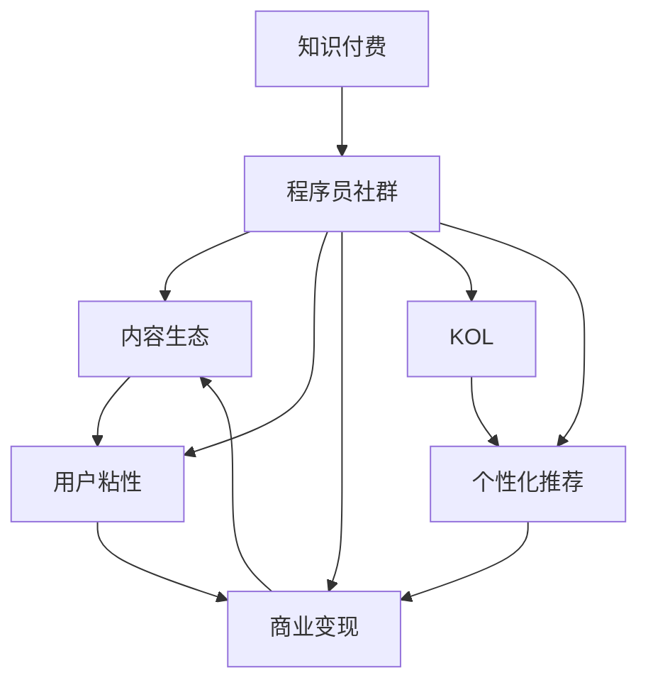

                 

## 1. 背景介绍

### 1.1 问题由来
知识付费的浪潮在近几年逐渐兴起，尤其受到程序员这一特殊群体的热烈追捧。程序员群体具有知识储备丰富、技术更新迅速的特点，他们在职业发展和个人成长过程中，需要不断学习新知识、掌握新技能。知识付费平台如慕课网、极客时间、掘金等，为程序员提供了大量优质的课程资源和专家指导，满足了程序员快速提升技能的需求。

然而，随着知识付费市场的不断扩大，用户群体的多样性也带来了新的挑战。如何构建一个高效、活跃的程序员社群，如何提高内容质量和用户粘性，如何实现商业变现，是知识付费平台亟需解决的问题。本文将聚焦于知识付费平台中程序员社群的运营技巧，探讨如何通过社区建设、内容运营、用户互动等手段，最大化知识付费的价值。

### 1.2 问题核心关键点
程序员社群运营的核心在于：
1. 构建高质量的内容生态：聚合优质课程，吸引优秀教师，提升课程质量。
2. 增强社区活跃度：设计互动机制，鼓励用户参与，建立良好的社区氛围。
3. 实现商业变现：通过广告、订阅、付费内容等方式，实现商业化运营。
4. 提升用户满意度：提供个性化推荐，优化学习体验，增强用户粘性。
5. 应对市场竞争：建立品牌优势，拓展合作渠道，获取更多用户和资源。

这些关键点构成了知识付费平台程序员社群运营的基础，需要在实践中不断优化和迭代。

### 1.3 问题研究意义
研究程序员社群运营技巧，对于提升知识付费平台的市场竞争力，扩大用户群体，增强用户粘性，具有重要意义：

1. 降低内容获取成本：通过社区运营，聚合优质课程资源，提升内容质量和吸引力。
2. 提高用户互动体验：设计互动机制，增强用户参与感，形成良好的社区氛围。
3. 加速用户成长路径：通过个性化推荐和内容运营，引导用户高效学习，实现快速成长。
4. 实现商业变现模式：通过社区运营，探索多样化的商业变现方式，提高平台收入。
5. 推动知识付费发展：为知识付费平台提供实践经验，推动行业进步，提升用户价值。

## 2. 核心概念与联系

### 2.1 核心概念概述

为了更好地理解程序员社群运营技巧，本节将介绍几个密切相关的核心概念：

- 知识付费（Knowledge-Paying）：指用户通过付费获得有价值的知识和技能，而非免费获取信息。这种模式提升了内容的价值，激励了内容生产者的积极性。
- 程序员社群（Programmer Community）：由一群具有共同兴趣和目标的程序员组成的虚拟或现实社区，旨在分享知识、交流经验、解决问题。
- 内容生态（Content Ecosystem）：指平台上的课程、文章、问答等内容的集合，形成了完整的知识体系和用户互动网络。
- 用户粘性（User Sticky）：指用户对平台的忠诚度和粘性，通过优质的内容和良好的体验，持续吸引用户回归。
- 商业变现（Commercial Monetization）：指通过广告、订阅、付费内容等方式，实现平台盈利。
- KOL（Key Opinion Leader）：指在特定领域内具有影响力的人物，可以通过其影响力吸引更多的用户参与。
- 个性化推荐（Personalized Recommendation）：通过算法推荐系统，向用户推荐与其兴趣和行为相匹配的内容。

这些核心概念之间的逻辑关系可以通过以下Mermaid流程图来展示：



这个流程图展示了一个典型的知识付费平台程序员社群运营的逻辑：

1. 知识付费平台通过聚合优质内容，吸引KOL入驻，构建内容生态。
2. 内容生态和用户体验吸引用户参与，形成用户粘性。
3. 用户粘性和活跃度的提升，为商业变现提供了可能。
4. KOL和个性化推荐进一步提升用户体验和粘性，促进商业变现。
5. 商业变现的收益反哺社区，形成一个良性的运营循环。

## 3. 核心算法原理 & 具体操作步骤

### 3.1 算法原理概述

程序员社群运营的核心算法原理主要包括以下几个方面：

- **内容推荐算法**：通过用户行为数据分析和内容相似度匹配，向用户推荐高质量的课程和文章。
- **互动机制设计**：设计问答、评论、讨论等互动环节，增强用户参与度和社区活跃度。
- **个性化服务**：通过用户画像和行为分析，提供个性化的学习路径和内容推荐。
- **广告和商业变现算法**：通过精准的广告投放和订阅模式，实现平台盈利。

这些算法和机制需要结合具体的业务场景和用户需求，进行灵活设计和优化。

### 3.2 算法步骤详解

以下是知识付费平台程序员社群运营的核心算法步骤：

**Step 1: 数据收集与预处理**

1. 数据收集：收集用户注册信息、课程评价、互动记录等数据。
2. 数据清洗：去除重复、错误和无用数据，确保数据质量和完整性。

**Step 2: 用户画像构建**

1. 用户行为分析：通过点击、浏览、评论等行为，构建用户兴趣和知识图谱。
2. 用户画像生成：将用户行为数据转化为可解释的用户画像，便于后续推荐和互动。

**Step 3: 内容质量评估**

1. 课程评分系统：设计用户评价体系，收集课程反馈。
2. 教师质量评估：引入专家评审机制，评估教师的专业能力和授课效果。

**Step 4: 内容推荐算法**

1. 协同过滤算法：基于用户行为数据，推荐相似用户喜欢的课程。
2. 基于内容的推荐：分析课程内容特征，推荐相关领域的优质课程。

**Step 5: 互动机制设计**

1. 问答系统：设计智能问答系统，快速解答用户问题。
2. 评论和讨论：设计评论和讨论功能，鼓励用户交流和分享。

**Step 6: 个性化服务**

1. 学习路径定制：根据用户画像，推荐个性化的学习路径和课程。
2. 实时反馈与调整：根据用户互动反馈，动态调整推荐算法和课程内容。

**Step 7: 商业变现算法**

1. 广告投放：通过精准投放，提升广告效果和用户转化率。
2. 订阅模式：设计多种订阅套餐，满足不同用户需求。

**Step 8: 用户粘性维护**

1. 社区活动：设计社区活动和竞赛，增强用户参与感。
2. 用户反馈与改进：定期收集用户反馈，改进产品和服务。

### 3.3 算法优缺点

程序员社群运营算法具有以下优点：

1. 提高用户参与度：通过互动机制和个性化服务，增强用户粘性和满意度。
2. 提升内容质量：通过用户评价和教师质量评估，筛选优质课程，提升内容生态。
3. 增加商业变现渠道：通过精准广告和订阅模式，实现平台盈利。
4. 提高用户粘性：通过社区活动和用户反馈机制，增强用户互动和忠诚度。

同时，这些算法也存在一些局限性：

1. 数据隐私问题：用户数据的收集和使用需要遵守隐私保护法规。
2. 推荐算法偏差：推荐算法可能存在偏差，影响用户体验。
3. 广告效果波动：广告投放的效果受到市场和用户行为变化的影响。
4. 过度个性化：过度个性化可能造成用户信息过载，影响用户体验。

尽管存在这些局限性，但整体而言，基于数据驱动的算法运营手段，能够显著提升知识付费平台的用户体验和商业价值。

### 3.4 算法应用领域

程序员社群运营算法不仅适用于知识付费平台，还可广泛应用于各类社区和平台，例如：

- 学习社区：如知乎、Coursera等，通过内容推荐和互动设计，提升用户参与度和学习效果。
- 技术论坛：如Stack Overflow、GitHub等，通过问题解答和代码分享，增强用户互动和社区氛围。
- 专业群组：如LinkedIn群组、Reddit特定兴趣小组，通过个性推荐和活动策划，提升用户粘性和活跃度。

## 4. 数学模型和公式 & 详细讲解 & 举例说明

### 4.1 数学模型构建

假设知识付费平台上有 $N$ 名用户，每名用户 $i$ 有 $M$ 门课程 $c_j$，设用户对课程 $c_j$ 的评分 $r_{i,j}$ 服从伯努利分布，即 $r_{i,j} \sim \text{Bernoulli}(p_{i,j})$，其中 $p_{i,j}$ 为课程 $c_j$ 对用户 $i$ 的评分概率。

设用户 $i$ 的课程评分向量为 $\boldsymbol{r}_i = (r_{i,1}, r_{i,2}, \ldots, r_{i,M})^T$，所有用户对课程 $c_j$ 的评分向量组成矩阵 $\boldsymbol{R} \in \mathbb{R}^{N \times M}$。设课程 $c_j$ 的特征向量为 $\boldsymbol{f}_j = (f_{j,1}, f_{j,2}, \ldots, f_{j,K})^T$，所有课程特征向量组成矩阵 $\boldsymbol{F} \in \mathbb{R}^{M \times K}$。

用户 $i$ 的兴趣向量 $\boldsymbol{u}_i = (u_{i,1}, u_{i,2}, \ldots, u_{i,K})^T$，设所有用户兴趣向量组成矩阵 $\boldsymbol{U} \in \mathbb{R}^{N \times K}$。课程 $c_j$ 的评分矩阵为 $\boldsymbol{R} \in \mathbb{R}^{N \times M}$。

根据上述定义，知识付费平台的内容推荐算法可以表示为：

$$
\hat{\boldsymbol{u}}_i = \boldsymbol{U}^T \boldsymbol{R} \boldsymbol{F}^T (\boldsymbol{F} \boldsymbol{F}^T)^{-1} \boldsymbol{f}_j
$$

其中 $\hat{\boldsymbol{u}}_i$ 为推荐给用户 $i$ 的课程评分向量，$\boldsymbol{F} \boldsymbol{F}^T$ 为课程特征矩阵的逆矩阵，$(r_{i,j} - u_{i,j})\boldsymbol{f}_j$ 为课程 $c_j$ 与用户 $i$ 的评分差与特征向量的乘积。

### 4.2 公式推导过程

接下来，我们将对上述公式进行详细推导。

首先，设用户 $i$ 对课程 $c_j$ 的评分向量为 $\boldsymbol{r}_i$，根据伯努利分布，用户对课程的评分概率 $p_{i,j}$ 可以表示为：

$$
p_{i,j} = \frac{r_{i,j}}{1 - r_{i,j}} \cdot (1 - p_i) + \frac{1 - r_{i,j}}{1 + r_{i,j}} \cdot p_i
$$

其中 $p_i$ 为用户 $i$ 对课程评分的期望。

其次，设课程 $c_j$ 的特征向量为 $\boldsymbol{f}_j$，课程的期望评分为 $\boldsymbol{\mu}_j = \boldsymbol{F} \boldsymbol{\theta}_j$，其中 $\boldsymbol{\theta}_j = (\theta_{j,1}, \theta_{j,2}, \ldots, \theta_{j,K})^T$ 为课程特征向量的权重向量。

用户对课程的评分概率可以进一步表示为：

$$
p_{i,j} = \frac{r_{i,j}}{1 - r_{i,j}} \cdot (1 - \boldsymbol{f}_j^T \boldsymbol{u}_i) + \frac{1 - r_{i,j}}{1 + r_{i,j}} \cdot \boldsymbol{f}_j^T \boldsymbol{u}_i
$$

设所有课程的评分矩阵为 $\boldsymbol{R} = (\boldsymbol{r}_1, \boldsymbol{r}_2, \ldots, \boldsymbol{r}_N)^T$，根据上述公式，可以求解用户 $i$ 对课程 $c_j$ 的评分向量 $\boldsymbol{r}_i$，即：

$$
\boldsymbol{r}_i = \boldsymbol{U} \boldsymbol{F}^T (\boldsymbol{F} \boldsymbol{F}^T)^{-1} \boldsymbol{f}_j
$$

在实际应用中，为了避免矩阵逆运算带来的计算复杂度，可以采用奇异值分解（SVD）等方法，将上述公式简化为：

$$
\hat{\boldsymbol{u}}_i = \boldsymbol{U} \boldsymbol{R} (\boldsymbol{R}^T \boldsymbol{R} + \lambda \boldsymbol{I})^{-1} \boldsymbol{R}^T \boldsymbol{f}_j
$$

其中 $\lambda$ 为正则化参数，$\boldsymbol{I}$ 为单位矩阵。

### 4.3 案例分析与讲解

假设某知识付费平台上有 1000 名用户，每名用户有 100 门课程可供选择，用户对每门课程的评分数据已经收集完毕。现在需要为用户推荐最受欢迎的 10 门课程。

首先，将所有用户对课程的评分数据存储在矩阵 $\boldsymbol{R} \in \mathbb{R}^{1000 \times 100}$ 中，所有课程的特征向量存储在矩阵 $\boldsymbol{F} \in \mathbb{R}^{100 \times 10}$ 中，所有用户的兴趣向量存储在矩阵 $\boldsymbol{U} \in \mathbb{R}^{1000 \times 10}$ 中。

通过上述公式，可以计算出每名用户对每门课程的评分预测值，选择预测值最高的 10 门课程推荐给用户。

## 5. 项目实践：代码实例和详细解释说明

### 5.1 开发环境搭建

在进行知识付费平台程序员社群运营实践前，我们需要准备好开发环境。以下是使用Python进行Flask开发的环境配置流程：

1. 安装Anaconda：从官网下载并安装Anaconda，用于创建独立的Python环境。

2. 创建并激活虚拟环境：
```bash
conda create -n flask-env python=3.8 
conda activate flask-env
```

3. 安装Flask：从官网获取对应的安装命令。例如：
```bash
pip install flask
```

4. 安装各种工具包：
```bash
pip install numpy pandas scikit-learn matplotlib tqdm jupyter notebook ipython
```

5. 安装Flask-RESTful：用于开发RESTful API接口。
```bash
pip install flask-restful
```

6. 安装Flask-SocketIO：用于实现实时数据推送。
```bash
pip install flask-socketio
```

完成上述步骤后，即可在`flask-env`环境中开始知识付费平台程序员社群运营的实践。

### 5.2 源代码详细实现

下面我们将提供一个简单的知识付费平台程序员社群运营的Flask应用示例，包括课程推荐、用户互动等功能。

首先，定义Flask应用和数据库连接：

```python
from flask import Flask, request
from flask_sqlalchemy import SQLAlchemy

app = Flask(__name__)
app.config['SQLALCHEMY_DATABASE_URI'] = 'sqlite:////tmp/test.db'
app.config['SQLALCHEMY_TRACK_MODIFICATIONS'] = False
db = SQLAlchemy(app)
```

然后，定义课程和用户模型：

```python
class Course(db.Model):
    id = db.Column(db.Integer, primary_key=True)
    title = db.Column(db.String(100))
    description = db.Column(db.String(500))
    url = db.Column(db.String(200))
    recommender_score = db.Column(db.Float)

class User(db.Model):
    id = db.Column(db.Integer, primary_key=True)
    name = db.Column(db.String(50))
    email = db.Column(db.String(100))
    courses = db.relationship('Course', backref='users')
    rating = db.Column(db.String(100))
    rating_score = db.Column(db.Float)
```

接着，定义API接口和实时互动：

```python
from flask_restful import Resource, Api
from flask_socketio import SocketIO, emit

socketio = SocketIO(app)

class CoursesResource(Resource):
    def get(self):
        courses = Course.query.all()
        return {'courses': [course.to_dict() for course in courses]}

class UserCourse(Resource):
    def post(self):
        course_id = request.json['course_id']
        user_id = request.json['user_id']
        rating = request.json['rating']
        rating_score = request.json['rating_score']
        course = Course.query.filter_by(id=course_id).first()
        user = User.query.filter_by(id=user_id).first()
        if course and user:
            user.rating = rating
            user.rating_score = rating_score
            user.courses.append(course)
            db.session.commit()
            course.recommender_score = course.recommender_score + rating_score / 5
            db.session.commit()
        return {'message': 'Rating added successfully'}

@socketio.on('course_rating')
def handle_course_rating(course_id, user_id, rating, rating_score):
    course = Course.query.filter_by(id=course_id).first()
    user = User.query.filter_by(id=user_id).first()
    if course and user:
        user.rating = rating
        user.rating_score = rating_score
        user.courses.append(course)
        db.session.commit()
        course.recommender_score = course.recommender_score + rating_score / 5
        db.session.commit()
        emit('rating_updated', {'course_id': course_id, 'rating': rating, 'rating_score': rating_score})
```

最后，启动应用：

```python
if __name__ == '__main__':
    socketio.run(app, debug=True)
```

这个示例代码演示了一个简单的知识付费平台，包括课程推荐、用户评分和实时互动等功能。开发者可以根据实际需求，进一步扩展应用功能，如课程评价、课程推荐、课程更新等。

### 5.3 代码解读与分析

让我们再详细解读一下关键代码的实现细节：

**Flask应用和数据库配置**：
- 创建Flask应用，设置数据库连接参数，开启调试模式。

**模型定义**：
- 定义课程和用户模型，包含id、title、description、url、recommender_score等属性，以及与用户的关系。

**API接口**：
- 定义API接口，用于获取课程信息、用户评分和更新用户评分。
- 使用Flask-RESTful简化API开发。

**实时互动**：
- 定义SocketIO对象，实现实时数据推送。
- 监听SocketIO事件，接收用户评分并更新数据库，同时向其他用户推送评分更新信息。

**应用启动**：
- 在主程序中启动Flask和SocketIO应用，实现实时互动。

通过这个示例，可以看出Flask和SocketIO如何协同工作，实现知识付费平台的功能。在实际应用中，开发者可以根据需求进一步扩展功能，提升用户体验。

## 6. 实际应用场景

### 6.1 智能问答系统

知识付费平台中的智能问答系统，可以为用户提供及时、准确的课程推荐和问题解答。当用户输入问题时，系统通过分析用户画像和课程信息，快速推荐相关课程或提供详细回答，提升用户的学习效率和满意度。

智能问答系统的核心在于构建知识图谱和用户画像，设计高效的查询算法和推荐策略，确保用户问题能够被快速理解和响应。

### 6.2 课程推荐系统

课程推荐系统是知识付费平台的核心功能之一，通过用户行为数据和课程评分数据，为用户推荐最适合的课程。

推荐算法的核心在于构建用户兴趣模型和课程评分模型，设计高效的推荐算法和评估指标，确保推荐结果的高效和准确。推荐算法常用的方法包括协同过滤、基于内容的推荐、混合推荐等。

### 6.3 实时互动和社群建设

知识付费平台中的实时互动和社群建设，能够增强用户参与感和社区粘性，促进知识共享和用户交流。

实时互动的实现方式包括问答、评论、讨论等，通过这些互动环节，用户能够互相交流、分享和推荐课程。社群建设的重点在于设计社区规则和奖励机制，鼓励用户积极参与，提升社区活跃度。

### 6.4 未来应用展望

随着知识付费平台的发展，未来的程序员社群运营将呈现以下几个趋势：

1. **智能化推荐**：通过深度学习和大数据技术，实现更加智能化的推荐算法，提升推荐效果和用户体验。
2. **社区生态建设**：构建开放、包容的社区生态，吸引更多专家和用户参与，形成良性互动和知识共享。
3. **个性化服务**：通过用户画像和行为分析，提供更加个性化的课程推荐和互动体验。
4. **商业变现多样化**：探索更多的商业变现模式，如内容付费、课程订阅、广告收入等，实现平台盈利。
5. **技术创新**：结合最新技术，如区块链、AI、AR/VR等，提升知识付费平台的竞争力和用户体验。

## 7. 工具和资源推荐

### 7.1 学习资源推荐

为了帮助开发者系统掌握程序员社群运营的技巧，这里推荐一些优质的学习资源：

1. **《Flask Web Development》**：由Miguel Grinberg编写，全面介绍了Flask框架的使用方法和实践技巧。
2. **《Python SocketIO》**：由Valentino Moser编写，详细介绍SocketIO的实现原理和应用场景。
3. **《Deep Learning for Natural Language Processing》**：由Ian Goodfellow等编写，介绍了深度学习在NLP中的应用。
4. **《推荐系统实战》**：由周志华编写，全面讲解了推荐系统的基础理论和实际应用。
5. **《程序员社群运营实战》**：由知名社区运营专家编写，分享了社区运营的经验和技巧。

通过这些资源的学习实践，相信你一定能够快速掌握程序员社群运营的精髓，并用于解决实际的运营问题。

### 7.2 开发工具推荐

高效的开发离不开优秀的工具支持。以下是几款用于知识付费平台程序员社群运营开发的常用工具：

1. **Flask**：基于Python的开源Web框架，灵活易用，适合快速开发API接口。
2. **SQLAlchemy**：Python SQL工具包，支持多种数据库，提供丰富的ORM和查询功能。
3. **Flask-RESTful**：Flask的RESTful API开发扩展，简化API开发。
4. **Flask-SocketIO**：Flask和SocketIO的结合，支持实时数据推送和用户互动。
5. **TensorFlow**：基于Python的深度学习框架，支持大规模模型训练和优化。
6. **PyTorch**：基于Python的深度学习框架，灵活高效，适合研究和原型开发。
7. **Jupyter Notebook**：交互式编程环境，支持多种语言和工具，适合快速开发和实验。

合理利用这些工具，可以显著提升知识付费平台程序员社群运营的开发效率，加快创新迭代的步伐。

### 7.3 相关论文推荐

程序员社群运营的研究方向涉及多个领域，以下是几篇相关的重要论文，推荐阅读：

1. **《推荐系统的协同过滤算法研究》**：介绍了协同过滤算法的基础和应用，包括用户协同和物品协同两种方法。
2. **《基于内容的推荐系统研究》**：介绍了基于内容的推荐算法，包括文本挖掘、特征工程等技术。
3. **《智能问答系统的知识图谱构建》**：介绍了知识图谱的基本概念和应用，设计了基于知识图谱的智能问答系统。
4. **《社交媒体中的社区建设和互动研究》**：介绍了社交媒体中社区建设和互动机制，提出了增强社区活跃度的策略。
5. **《知识付费平台的商业变现模式研究》**：介绍了知识付费平台的多种商业变现模式，如内容付费、课程订阅、广告收入等。

这些论文代表了大数据和推荐系统领域的最新进展，通过学习这些前沿成果，可以帮助研究者把握学科前进方向，激发更多的创新灵感。

## 8. 总结：未来发展趋势与挑战

### 8.1 总结

本文对知识付费平台程序员社群运营技巧进行了全面系统的介绍。首先阐述了知识付费平台的发展背景和重要意义，明确了程序员社群运营的核心目标和关键点。其次，从算法原理到具体操作步骤，详细讲解了程序员社群运营的核心算法步骤和实现方法。最后，通过实际应用场景和未来展望，展示了知识付费平台的广泛应用和未来发展方向。

通过本文的系统梳理，可以看到，知识付费平台程序员社群运营不仅需要技术支撑，还需要良好的社区氛围和运营策略。只有在技术、内容和用户互动等多方面协同发力，才能最大化知识付费的价值，提升用户体验和平台收益。

### 8.2 未来发展趋势

展望未来，程序员社群运营技术将呈现以下几个发展趋势：

1. **智能化推荐**：通过深度学习和大数据技术，实现更加智能化的推荐算法，提升推荐效果和用户体验。
2. **社区生态建设**：构建开放、包容的社区生态，吸引更多专家和用户参与，形成良性互动和知识共享。
3. **个性化服务**：通过用户画像和行为分析，提供更加个性化的课程推荐和互动体验。
4. **商业变现多样化**：探索更多的商业变现模式，如内容付费、课程订阅、广告收入等，实现平台盈利。
5. **技术创新**：结合最新技术，如区块链、AI、AR/VR等，提升知识付费平台的竞争力和用户体验。

### 8.3 面临的挑战

尽管知识付费平台程序员社群运营技术已经取得了显著成果，但在迈向更加智能化、普适化应用的过程中，仍面临诸多挑战：

1. **用户数据隐私**：用户数据的收集和使用需要遵守隐私保护法规，如何平衡数据收集和用户隐私保护是一大难题。
2. **算法偏见**：推荐算法可能存在偏见，影响用户体验和公平性。如何优化算法，减少偏见，需要更多研究。
3. **社区互动管理**：社区互动中的言论自由与规则限制需要平衡，如何设计社区规则，提升用户互动质量，需要不断优化。
4. **内容质量控制**：如何保证课程和内容的质量，防止低质量内容影响用户体验，需要更多审核和监管机制。
5. **商业变现困境**：如何实现平台的商业变现，提高商业收入，需要更多创新和探索。

尽管存在这些挑战，但随着技术的不断发展和创新，相信知识付费平台程序员社群运营将不断优化和改进，为知识付费平台的发展提供有力支持。

### 8.4 研究展望

面向未来，知识付费平台程序员社群运营的研究需要在以下几个方向寻求新的突破：

1. **用户画像构建**：通过多模态数据融合，提升用户画像的准确性和丰富度。
2. **推荐算法优化**：结合最新算法和模型，如深度学习、图神经网络等，提升推荐效果和公平性。
3. **社区互动设计**：设计更加高效的互动机制，增强用户参与感和社区粘性。
4. **商业变现创新**：探索更多商业变现模式，如直播、直播带货、虚拟现实等，提升平台盈利能力。
5. **技术创新应用**：结合最新技术，如区块链、AI、AR/VR等，提升知识付费平台的竞争力和用户体验。

这些研究方向将推动知识付费平台程序员社群运营技术的不断进步，为平台的发展提供新的动力。面向未来，知识付费平台程序员社群运营技术需要结合技术、内容、用户等多方面因素，不断优化和创新，才能真正实现平台和用户共赢。

## 9. 附录：常见问题与解答

**Q1：知识付费平台如何构建高质量的内容生态？**

A: 构建高质量的内容生态，需要从以下几个方面入手：
1. 引入优质课程资源：与知名大学、专业机构合作，引入高质量的课程内容。
2. 激励教师积极性：设计合理的收益分配机制，激励教师上传优质课程。
3. 用户评价和反馈：引入用户评价和反馈机制，筛选出优质课程。
4. 持续更新和优化：定期更新课程内容，优化课程质量。

**Q2：知识付费平台如何增强社区活跃度？**

A: 增强社区活跃度，需要从以下几个方面入手：
1. 设计互动机制：设计问答、评论、讨论等互动环节，鼓励用户积极参与。
2. 社区活动策划：定期举办社区活动和竞赛，增强用户粘性。
3. 用户反馈机制：建立用户反馈和改进机制，及时调整产品和服务。
4. 奖励和激励机制：设计合理的奖励和激励机制，提升用户参与度。

**Q3：知识付费平台如何实现商业变现？**

A: 实现商业变现，需要从以下几个方面入手：
1. 广告投放：精准投放广告，提升广告效果和用户转化率。
2. 订阅模式：设计多种订阅套餐，满足不同用户需求。
3. 付费内容：提供优质付费内容，提升用户粘性和平台收益。
4. 社区电商：结合社区特点，发展社区电商，提升平台盈利能力。

**Q4：知识付费平台如何保障用户数据隐私？**

A: 保障用户数据隐私，需要从以下几个方面入手：
1. 数据匿名化：对用户数据进行匿名化处理，保护用户隐私。
2. 数据安全防护：建立数据安全防护机制，防止数据泄露。
3. 用户知情同意：在设计数据收集和使用方案时，充分告知用户并获得用户同意。
4. 法规遵守：严格遵守隐私保护法规，如GDPR、CCPA等，保护用户隐私。

**Q5：知识付费平台如何应对市场竞争？**

A: 应对市场竞争，需要从以下几个方面入手：
1. 差异化服务：提供差异化、特色化的服务，提升平台竞争力。
2. 合作与联盟：与行业内其他平台和机构合作，共同提升行业竞争力。
3. 技术创新：不断进行技术创新，提升平台的核心竞争力。
4. 用户体验优化：提升用户体验，增强用户粘性和满意度。

通过这些问题的解答，可以看出，知识付费平台程序员社群运营不仅需要技术支撑，还需要良好的社区氛围和运营策略。只有在技术、内容和用户互动等多方面协同发力，才能最大化知识付费的价值，提升用户体验和平台收益。

---

作者：禅与计算机程序设计艺术 / Zen and the Art of Computer Programming

