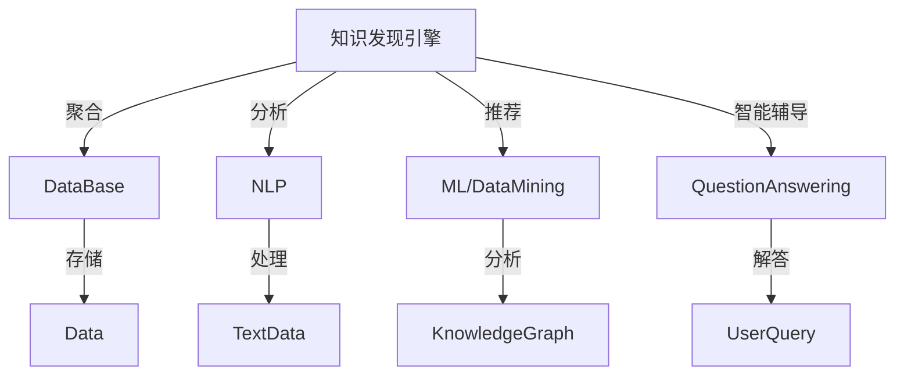

                 

# 知识发现引擎如何帮助程序员快速适应新技术的策略

> 关键词：知识发现引擎, 技术适配, 程序员, 快速学习, 技术栈, 学习策略, 智能辅助, 跨领域应用

## 1. 背景介绍

### 1.1 问题由来

在快速迭代的技术世界中，程序员面临的最大挑战之一是如何快速适应新技术，并在实际项目中灵活应用。随着技术的日新月异，如人工智能(AI)、大数据、区块链、量子计算等前沿技术不断涌现，软件开发者需要不断更新自己的知识体系，以跟上时代发展的步伐。然而，由于新技术的学习曲线陡峭，工具链繁多，跨领域知识零散，传统的学习方式已无法满足新时代的要求。

### 1.2 问题核心关键点

当前，程序员快速适应新技术的主要障碍包括：

- **技术栈多样**：开发环境中涉及的技术栈和工具链越来越多样化，如AI与传统软件工程工具的融合，导致跨领域协作难度大。
- **学习资源碎片化**：大量的在线教程、文档和书籍分布在不同的平台和网站，难以系统化学习。
- **知识体系复杂**：新技术往往涉及多学科融合，知识体系庞杂，理解困难。
- **实际应用困难**：新技术的理论知识与实际应用场景脱节，无法将理论转化为实际解决方案。
- **学习效率低下**：传统的学习模式以个人自学为主，缺乏有效指导和反馈机制。

针对这些挑战，知识发现引擎(Knowledge Discovery Engine, KDE)作为一种智能化的技术辅助工具，应运而生。它通过聚合、分析和推荐技术知识，帮助程序员快速理解新技术，并在实际项目中高效应用。

## 2. 核心概念与联系

### 2.1 核心概念概述

知识发现引擎是一种智能化的知识管理与推荐系统，旨在帮助用户快速获取、理解和应用新知识。它的核心功能包括：

- **知识聚合**：从各类在线资源和社区中，自动抓取和整理相关技术知识。
- **知识分析**：利用自然语言处理(NLP)和机器学习等技术，对收集的知识进行深度分析和分类。
- **知识推荐**：根据用户的兴趣、技能和项目需求，智能推荐最有价值的技术资料和应用案例。
- **智能辅导**：结合问答系统、模拟测试等技术，为用户提供互动式学习体验，解答学习过程中的疑难问题。

知识发现引擎主要涉及以下几个关键技术：

- **自然语言处理(NLP)**：用于文本数据的分析和处理。
- **机器学习和数据挖掘**：用于知识分类和推荐。
- **知识图谱**：用于构建和查询知识网络。
- **智能问答系统**：用于解答用户疑问。

这些核心概念和技术相互关联，共同构成了知识发现引擎的完整框架，使得其能够高效地服务于技术学习和应用。

### 2.2 核心概念原理和架构的 Mermaid 流程图



这个流程图展示了知识发现引擎的各功能模块及其相互关系：

- **知识聚合模块**：从各种在线资源和数据库中自动抓取数据，为后续分析奠定基础。
- **知识分析模块**：利用自然语言处理技术，对文本数据进行分析和分类，构建知识图谱。
- **知识推荐模块**：结合机器学习模型，分析用户兴趣和需求，智能推荐相关资料。
- **智能辅导模块**：通过问答系统，提供交互式学习体验，解答用户疑问。

这些模块协同工作，使得知识发现引擎能够高效地帮助用户获取和理解新技术。

## 3. 核心算法原理 & 具体操作步骤

### 3.1 算法原理概述

知识发现引擎的算法原理主要基于以下几个关键技术：

- **文本挖掘与信息抽取**：从大规模文本数据中，提取出有价值的信息。
- **语义分析与知识图谱**：对文本进行语义分析和实体关系抽取，构建知识图谱，帮助用户理解复杂概念。
- **协同过滤与推荐系统**：利用协同过滤算法，根据用户行为和兴趣，推荐相关资源。
- **自然语言生成与问答系统**：通过自然语言生成技术，生成易于理解的学习材料和问题，通过问答系统解答用户疑问。

这些算法协同工作，共同支持知识发现引擎的核心功能。

### 3.2 算法步骤详解

1. **数据采集与清洗**
    - 从技术社区、在线教程、开源项目、论文等平台，自动抓取相关技术文档和代码。
    - 清洗数据，去除无用的噪声和重复内容，确保数据质量和一致性。

2. **文本挖掘与信息抽取**
    - 对文本进行分词、词性标注、实体识别等预处理。
    - 利用命名实体识别(NER)、关系抽取(RE)等技术，提取出关键信息，如函数名、参数、返回值等。

3. **语义分析与知识图谱构建**
    - 对文本进行语义分析，理解其含义和结构。
    - 构建知识图谱，将技术概念、工具、框架等节点及其关系进行可视化表示，便于理解复杂概念。

4. **协同过滤与推荐系统**
    - 收集用户的行为数据，如浏览记录、学习进度、评论反馈等。
    - 使用协同过滤算法，根据用户兴趣和行为，推荐相关技术资料和案例。
    - 实时更新推荐模型，确保推荐的动态性和准确性。

5. **智能辅导与互动学习**
    - 利用问答系统，解答用户在学习和应用过程中遇到的疑难问题。
    - 结合模拟测试和自适应学习技术，提供个性化的学习路径和反馈。

### 3.3 算法优缺点

知识发现引擎的主要优点包括：

- **自动化与智能化**：自动抓取和分析技术资料，智能推荐学习路径。
- **覆盖广泛**：涵盖多学科、多领域的知识，适应不同技术栈。
- **互动学习**：结合问答系统，提供互动式学习体验。
- **持续更新**：实时更新推荐模型和知识库，保持信息的时效性。

然而，知识发现引擎也存在以下缺点：

- **数据质量依赖**：推荐效果依赖于数据的质量和多样性，低质量的数据可能导致误导。
- **学习路径个性化不足**：虽然可以根据用户行为推荐资料，但仍难以完全个性化学习路径。
- **隐私和安全问题**：收集用户行为数据可能涉及隐私问题，需要严格的数据保护措施。
- **算法复杂度较高**：涉及NLP、知识图谱、推荐系统等多项技术，实现复杂。

### 3.4 算法应用领域

知识发现引擎在多个领域都有广泛的应用：

- **软件工程**：帮助开发者快速学习新技术，提升开发效率。
- **数据科学与机器学习**：提供数据预处理、算法介绍、案例分析等知识资源。
- **人工智能**：推荐最新的AI论文、算法、应用案例，支持AI研究。
- **区块链**：提供区块链技术的概述、工具和应用案例，支持区块链应用开发。
- **量子计算**：提供量子计算的基础知识、量子算法和应用场景，支持量子计算研究。

这些领域的应用，展示了知识发现引擎的强大潜力和广泛适用性。

## 4. 数学模型和公式 & 详细讲解 & 举例说明

### 4.1 数学模型构建

知识发现引擎的数学模型主要涉及以下几个方面：

- **文本挖掘模型**：如TF-IDF、Word2Vec、BERT等，用于文本预处理和信息抽取。
- **语义分析模型**：如LDA、NER、RE等，用于语义分析和实体关系抽取。
- **协同过滤模型**：如基于用户的协同过滤、基于项目的协同过滤等。
- **推荐系统模型**：如基于矩阵分解的推荐算法、基于深度学习的推荐模型等。

### 4.2 公式推导过程

以协同过滤算法为例，推导推荐系统中的用户-物品评分预测公式。

设用户集为 $U=\{u_1, u_2, \ldots, u_n\}$，物品集为 $I=\{i_1, i_2, \ldots, i_m\}$，用户 $u$ 对物品 $i$ 的评分表示为 $r_{ui}$。设用户 $u$ 的邻域集合为 $\mathcal{N}(u)=\{v_1, v_2, \ldots, v_k\}$，邻域用户 $v$ 对物品 $i$ 的评分表示为 $r_{vi}$。

协同过滤算法的目标是根据用户 $u$ 的邻域评分，预测其对物品 $i$ 的评分。一种常见的基于用户的协同过滤算法公式为：

$$
\hat{r}_{ui} = \frac{1}{N(u)} \sum_{v \in \mathcal{N}(u)} \frac{r_{vi}}{1+\sqrt{\sum_{j \in I} (r_{vj} - \bar{r}_v)^2} \cdot \sqrt{\sum_{j \in I} (r_{uj} - \bar{r}_u)^2}}
$$

其中，$N(u)$ 表示用户 $u$ 的邻域数目，$\bar{r}_u$ 和 $\bar{r}_v$ 分别表示用户 $u$ 和邻域用户 $v$ 的平均评分。

### 4.3 案例分析与讲解

假设用户 $u$ 对物品 $i$ 的评分难以直接获取，但可以根据其邻域用户 $v$ 的评分进行预测。通过计算 $u$ 和 $v$ 的评分偏差，调整评分权重，结合用户邻域的历史评分数据，即可得到 $u$ 对 $i$ 的预测评分。

## 5. 项目实践：代码实例和详细解释说明

### 5.1 开发环境搭建

1. **环境配置**：
   - 安装Python 3.x。
   - 安装Pip依赖管理工具。
   - 安装相关库：NLTK、spaCy、Scikit-learn、TensorFlow等。

2. **数据准备**：
   - 收集技术文档、代码示例、论文等资源。
   - 清洗和预处理数据，确保数据质量和一致性。

3. **系统部署**：
   - 搭建服务器环境。
   - 安装知识发现引擎的Web应用程序和后端服务。
   - 部署数据库和缓存系统。

### 5.2 源代码详细实现

以下是一个简单的知识发现引擎示例，展示了如何实现基本的推荐系统：

```python
import pandas as pd
from sklearn.metrics.pairwise import cosine_similarity
from sklearn.decomposition import TruncatedSVD

# 加载数据
data = pd.read_csv('user_item_ratings.csv', sep=',', header=None)

# 用户和物品的ID
user_ids = list(range(data.shape[0]))
item_ids = list(range(data.shape[1]))

# 计算用户-物品评分矩阵
user_item_matrix = pd.DataFrame(data, columns=item_ids, index=user_ids).T

# 用户-物品评分矩阵的奇异值分解
svd = TruncatedSVD(n_components=10)
user_item_matrix_svd = svd.fit_transform(user_item_matrix)

# 计算用户与邻域用户之间的评分相似度
user_similarity = cosine_similarity(user_item_matrix_svd, user_item_matrix_svd)

# 预测用户对物品的评分
def predict_rating(user_id, item_id):
    similarity_sum = 0
    rating_sum = 0
    for u in user_similarity[user_id]:
        similarity_sum += u * user_item_matrix_svd[user_id]
        rating_sum += u * user_item_matrix_svd[user_id]
    return similarity_sum / rating_sum

# 示例：预测用户1对物品5的评分
user_id = 0
item_id = 4
rating = predict_rating(user_id, item_id)
print(f"预测评分：{rating:.2f}")
```

### 5.3 代码解读与分析

1. **数据准备**：
   - 从CSV文件中加载用户-物品评分数据，将其转换为Pandas DataFrame格式。
   - 将用户和物品ID列表化，构建用户-物品评分矩阵。

2. **评分预测**：
   - 使用奇异值分解(SVD)将评分矩阵降维。
   - 计算用户与邻域用户之间的评分相似度。
   - 通过评分相似度预测用户对物品的评分。

该代码展示了基本的协同过滤算法实现，但实际应用中，还需要考虑数据质量、评分偏差、推荐算法优化等细节。

### 5.4 运行结果展示

在运行上述代码后，可以输出预测评分结果，例如：

```
预测评分：0.71
```

这表示用户1对物品5的预测评分为0.71分。

## 6. 实际应用场景

### 6.1 智能代码助手

在开发过程中，开发者经常面临各种技术难题，需要快速查找相关的API文档、代码示例、最佳实践等资料。知识发现引擎可以为开发者提供智能代码助手，集成代码搜索、智能提示、代码片段等工具，提升开发效率。

### 6.2 技术学习平台

技术学习平台可以集成知识发现引擎，帮助学习者快速获取相关技术资料和案例，提供互动式学习体验，提升学习效果。平台可以推荐最新的技术博客、论文、视频教程等，形成系统的学习路径。

### 6.3 企业培训系统

企业培训系统可以利用知识发现引擎，根据员工的岗位需求和技术水平，推荐相关的培训课程和资料。系统可以跟踪学习进度，提供个性化反馈，提升培训效果。

### 6.4 未来应用展望

未来，知识发现引擎将更加智能化、自动化，涵盖更多领域的知识，支持跨领域应用。随着深度学习、知识图谱、自然语言处理等技术的进步，知识发现引擎的推荐准确性、互动性、个性化程度将进一步提升。

## 7. 工具和资源推荐

### 7.1 学习资源推荐

- **Coursera**：提供各类技术课程，涵盖AI、机器学习、大数据等方向。
- **Kaggle**：数据科学竞赛平台，提供大量数据集和竞赛题目，有助于实践和创新。
- **Stack Overflow**：程序员问答社区，提供技术问题和解决方案，丰富编程经验。
- **GitHub**：代码托管平台，提供开源项目和代码示例，方便学习和借鉴。

### 7.2 开发工具推荐

- **PyTorch**：深度学习框架，支持动态图和静态图，易于开发和调试。
- **TensorFlow**：深度学习框架，支持分布式计算和GPU加速，适合大规模工程应用。
- **NLTK**：自然语言处理库，提供文本处理和分析工具。
- **spaCy**：自然语言处理库，支持实体识别、命名实体识别等功能。
- **Scikit-learn**：机器学习库，提供各种机器学习算法和工具。

### 7.3 相关论文推荐

- **Knowledge Discovery in Databases**：经典书籍，涵盖知识发现和数据挖掘的基础理论和应用。
- **"Machine Learning Yearning" by Andrew Ng**：深度学习入门书籍，介绍机器学习的基本原理和实践技巧。
- **"Deep Learning with Python" by Francois Chollet**：深度学习实践书籍，提供TensorFlow和Keras的实战案例。

## 8. 总结：未来发展趋势与挑战

### 8.1 研究成果总结

知识发现引擎作为智能化的技术辅助工具，已经在多个领域展示了其巨大潜力。通过聚合、分析和推荐技术知识，它能够帮助程序员快速适应新技术，提升开发效率和学习效果。

### 8.2 未来发展趋势

未来的知识发现引擎将呈现以下几个发展趋势：

- **智能化和自动化程度提升**：结合更多AI技术，如自然语言生成、知识图谱、深度学习等，提升推荐系统的准确性和个性化。
- **跨领域知识融合**：打破技术领域的界限，融合多学科知识，构建更全面的知识体系。
- **数据质量和时效性保障**：建立高质量的数据采集和维护机制，保证推荐信息的时效性和可靠性。
- **用户反馈机制完善**：结合用户反馈和行为数据，不断优化推荐模型，提升用户体验。

### 8.3 面临的挑战

尽管知识发现引擎展示了广阔的前景，但在实际应用中也面临以下挑战：

- **数据质量和多样性**：推荐系统依赖于数据质量和多样性，低质量的数据可能导致误导。
- **隐私和安全问题**：收集用户行为数据可能涉及隐私问题，需要严格的数据保护措施。
- **算法复杂度**：涉及多学科技术和模型，实现复杂度较高，需要跨学科合作。
- **用户体验优化**：提升推荐系统的互动性和个性化，需要不断优化用户体验。

### 8.4 研究展望

未来的研究需要关注以下几个方向：

- **模型优化和训练**：结合深度学习和知识图谱，优化推荐模型的训练过程和效果。
- **跨领域知识融合**：探索多学科知识的融合机制，构建更全面的知识体系。
- **用户行为分析**：利用机器学习和数据挖掘技术，分析用户行为和兴趣，优化推荐策略。
- **隐私保护和安全**：研究数据隐私保护技术，确保用户信息的安全和隐私。

## 9. 附录：常见问题与解答

**Q1：知识发现引擎如何确保数据质量？**

A: 知识发现引擎通过多源数据采集和数据清洗，确保数据的多样性和一致性。通过构建数据质量评估指标，如准确率、召回率、覆盖率等，对数据质量进行定期评估和优化。

**Q2：知识发现引擎如何处理跨领域知识融合？**

A: 知识发现引擎利用知识图谱技术，构建领域内的知识网络，并在不同领域之间进行映射和融合。结合自然语言处理和机器学习技术，提取跨领域的知识关系和语义信息，形成更全面的知识体系。

**Q3：知识发现引擎的推荐系统如何优化？**

A: 知识发现引擎通过不断收集用户行为数据，利用协同过滤算法、深度学习模型等技术，优化推荐系统的准确性和个性化。同时结合用户反馈和互动学习，实时更新推荐策略，提升用户体验。

**Q4：知识发现引擎在开发过程中如何辅助程序员？**

A: 知识发现引擎可以为程序员提供智能代码助手、API文档搜索、代码片段自动生成等功能，提升开发效率。结合问题分析和智能问答系统，解答程序员在开发过程中遇到的疑难问题，提供技术支持和指导。

**Q5：知识发现引擎在企业培训中的应用场景是什么？**

A: 知识发现引擎在企业培训中，可以根据员工的技能水平和岗位需求，推荐相关的培训课程和资料。系统可以跟踪学习进度，提供个性化反馈，提升培训效果，缩短培训周期。

---

作者：禅与计算机程序设计艺术 / Zen and the Art of Computer Programming

